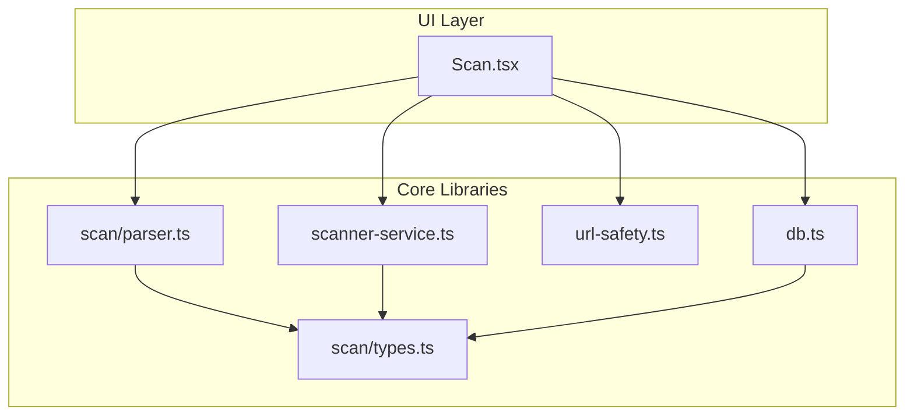
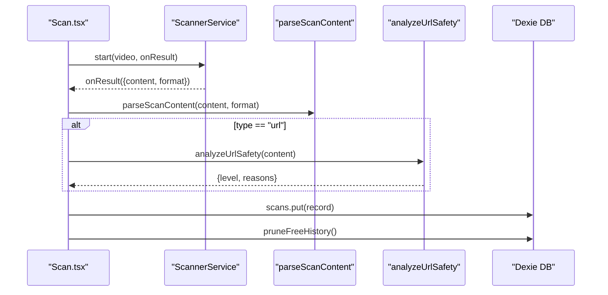
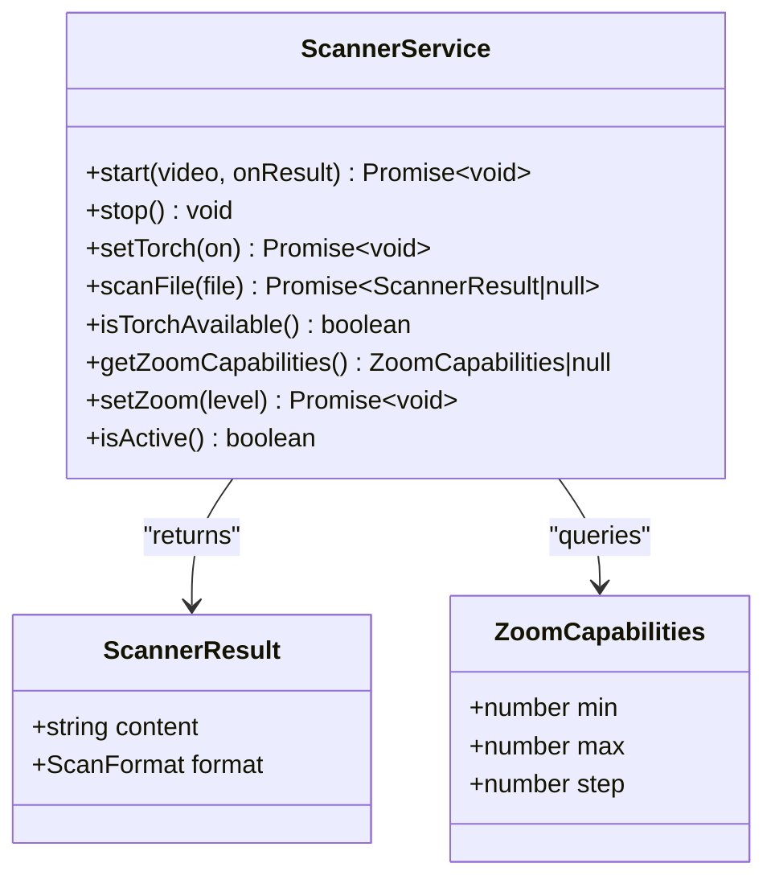
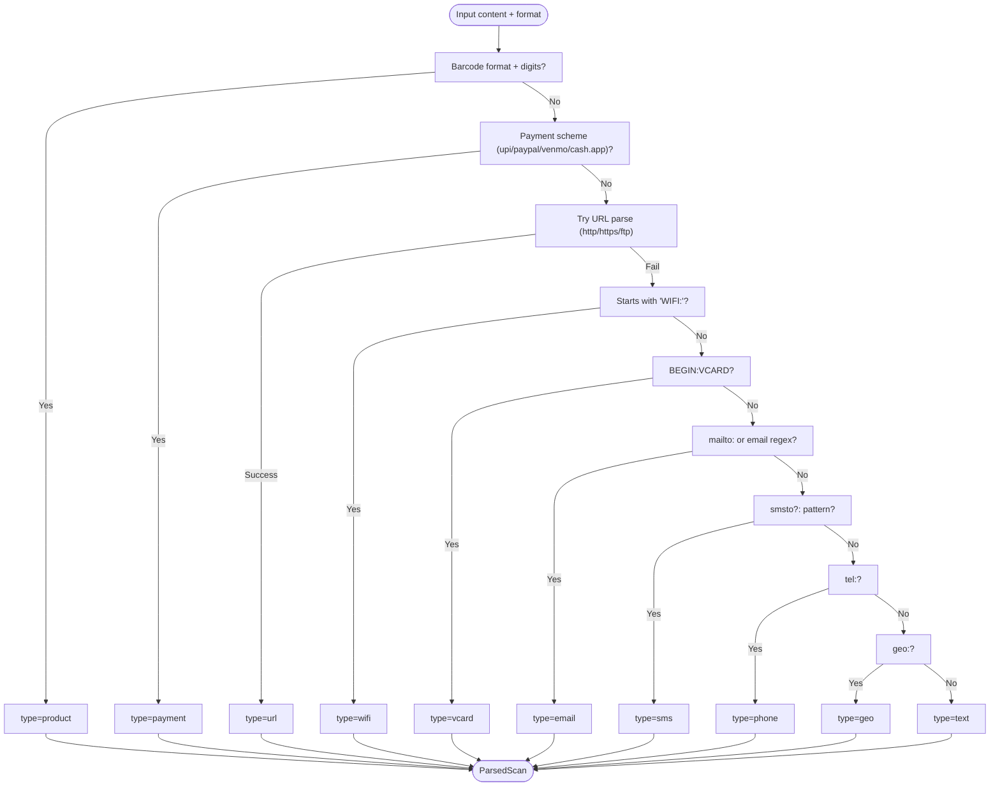
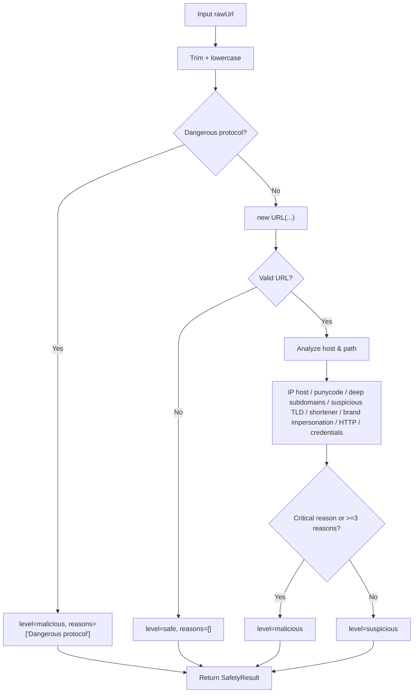
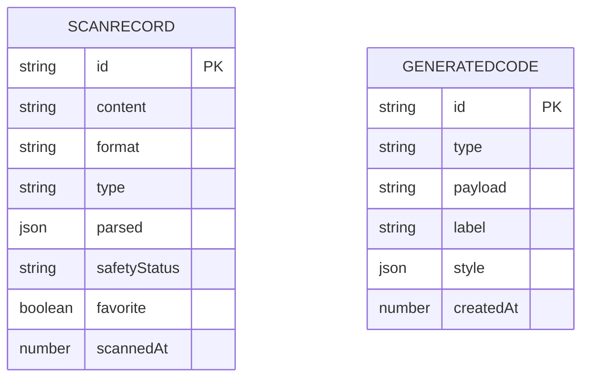
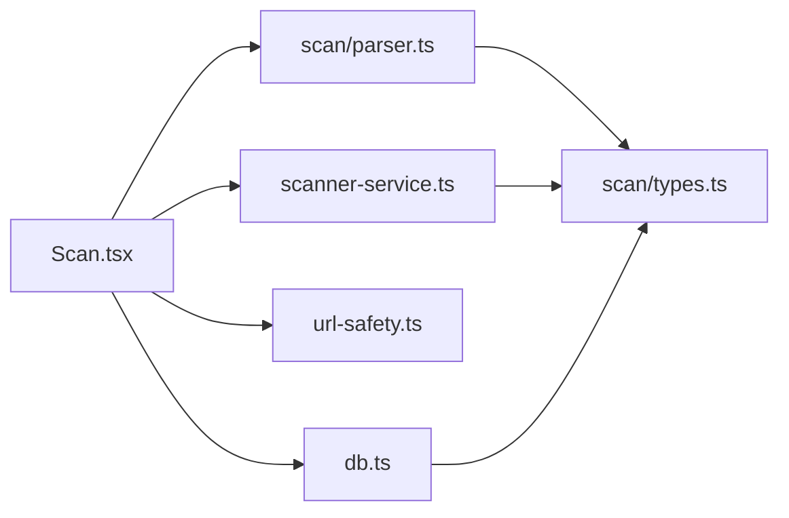

# API Reference

<cite>
**Referenced Files in This Document**
- [scanner-service.ts](file://src/lib/scanner-service.ts)
- [parser.ts](file://src/lib/scan/parser.ts)
- [types.ts](file://src/lib/scan/types.ts)
- [url-safety.ts](file://src/lib/url-safety.ts)
- [db.ts](file://src/lib/db.ts)
- [Scan.tsx](file://src/pages/Scan.tsx)
</cite>

## Table of Contents
1. Introduction
2. Project Structure
3. Core Components
4. Architecture Overview
5. Detailed Component Analysis
6. Dependency Analysis
7. Performance Considerations
8. Troubleshooting Guide
9. Conclusion

## Introduction
This document provides a comprehensive API reference for Smart Scan Pro’s public interfaces, focusing on:
- ScannerService: camera-based scanning, file-based scanning, and device capability detection
- Content parsing API: supported formats, parsing strategies, and return structures
- URL safety analysis API: threat detection methods, risk classification, and result structure
- Database API: data models, query patterns, and lifecycle helpers

It includes method signatures, parameter descriptions, return values, error handling patterns, practical usage examples, and performance best practices.

## Project Structure
The APIs are implemented as modular TypeScript modules under src/lib and consumed by the UI layer (pages). The key files are:
- Scanner service and capabilities: scanner-service.ts
- Content parsing: scan/parser.ts and shared types: scan/types.ts
- URL safety analysis: url-safety.ts
- IndexedDB persistence via Dexie: db.ts
- Integration example: pages/Scan.tsx

**Diagram sources**
- [Scan.tsx](file://src/pages/Scan.tsx)
- [scanner-service.ts](file://src/lib/scanner-service.ts)
- [parser.ts](file://src/lib/scan/parser.ts)
- [types.ts](file://src/lib/scan/types.ts)
- [url-safety.ts](file://src/lib/url-safety.ts)
- [db.ts](file://src/lib/db.ts)

**Section sources**
- [scanner-service.ts](file://src/lib/scanner-service.ts)
- [parser.ts](file://src/lib/scan/parser.ts)
- [types.ts](file://src/lib/scan/types.ts)
- [url-safety.ts](file://src/lib/url-safety.ts)
- [db.ts](file://src/lib/db.ts)
- [Scan.tsx](file://src/pages/Scan.tsx)

## Core Components
- ScannerService: Provides live camera scanning, image file scanning, torch control, zoom control, and capability queries.
- Content Parsing: Converts raw scanned content into typed structures with display hints.
- URL Safety Analysis: Evaluates URLs for suspicious or malicious characteristics and returns a risk level with reasons.
- Database API: IndexedDB-backed storage for scan records and generated codes, including history pruning.

**Section sources**
- [scanner-service.ts](file://src/lib/scanner-service.ts)
- [parser.ts](file://src/lib/scan/parser.ts)
- [types.ts](file://src/lib/scan/types.ts)
- [url-safety.ts](file://src/lib/url-safety.ts)
- [db.ts](file://src/lib/db.ts)

## Architecture Overview
High-level flow from camera capture to persisted record:

**Diagram sources**
- [Scan.tsx](file://src/pages/Scan.tsx)
- [scanner-service.ts](file://src/lib/scanner-service.ts)
- [parser.ts](file://src/lib/scan/parser.ts)
- [url-safety.ts](file://src/lib/url-safety.ts)
- [db.ts](file://src/lib/db.ts)

## Detailed Component Analysis

### ScannerService API
Public interface and behavior:
- start(videoElement, onResult): Starts camera scanning; invokes onResult for each detected code.
- stop(): Stops active scanning session and releases resources.
- setTorch(on): Toggles device torch if available.
- scanFile(file): Scans an image File object for barcodes/QR.
- isTorchAvailable(): Reports whether torch is supported by current track.
- getZoomCapabilities(): Returns min/max/step zoom range if supported.
- setZoom(level): Applies zoom within supported range.
- isActive(): Indicates if a scanning session is currently active.

Key types:
- ScannerResult: content string, format enum
- ZoomCapabilities: numeric min, max, step

Error handling:
- start may throw on permission/device errors; caller should handle and update UI state.
- setTorch/setZoom may silently fail when unsupported; callers should guard UI accordingly.
- scanFile returns null when no code is found; otherwise returns ScannerResult.

Practical usage patterns:
- Camera scanning: Initialize once per mount, stop on unmount or visibility change.
- File scanning: Triggered by user input; handle null results gracefully.
- Torch/zoom: Query capabilities before enabling controls.

Performance considerations:
- Debounce rapid zoom updates using requestAnimationFrame.
- Avoid concurrent starts; ensure stop is called before restart.
- Revoke object URLs after file scanning to free memory.

**Diagram sources**
- [scanner-service.ts](file://src/lib/scanner-service.ts)
- [types.ts](file://src/lib/scan/types.ts)

**Section sources**
- [scanner-service.ts](file://src/lib/scanner-service.ts)
- [types.ts](file://src/lib/scan/types.ts)
- [Scan.tsx](file://src/pages/Scan.tsx)

### Content Parsing API
Function:
- parseScanContent(content: string, format: ScanFormat): ParsedScan

Supported content types and strategies:
- product: Numeric barcodes (EAN_13/EAN_8/UPC_A/UPC_E/CODE_128/CODE_39/CODE_93/ITF) with all-digit payloads.
- payment: UPI deep links, PayPal.me, Venmo, Cash App URLs.
- url: http/https/ftp URLs.
- wifi: WIFI: SSID/password/encryption strings.
- vcard: BEGIN:VCARD blocks (name, phone, email).
- email: mailto: URIs or plain email addresses.
- sms/smsto: SMS intent strings.
- phone: tel: URIs.
- geo: geo: URIs.
- text: Fallback for unrecognized content.

Return value:
- ParsedScan: { type, data: Record<string,string>, display: string }

Parsing strategy overview:

**Diagram sources**
- [parser.ts](file://src/lib/scan/parser.ts)
- [types.ts](file://src/lib/scan/types.ts)

Practical usage patterns:
- Always pass the detected format from ScannerService to improve accuracy.
- Use ParsedScan.display for UI labels and ParsedScan.data for actions.

Performance considerations:
- Parsing is synchronous and lightweight; safe to call per result.
- Avoid redundant re-parsing by caching results when appropriate.

**Section sources**
- [parser.ts](file://src/lib/scan/parser.ts)
- [types.ts](file://src/lib/scan/types.ts)

### URL Safety Analysis API
Function:
- analyzeUrlSafety(rawUrl: string): SafetyResult

Risk classification:
- Level: "safe", "suspicious", "malicious"
- Reasons: Array of human-readable explanations

Detection rules:
- Dangerous protocols (javascript:, data:)
- IP address hosts
- Punycode/homograph domains
- Excessive subdomains
- Suspicious TLDs
- Known URL shorteners
- Brand impersonation heuristics
- Unencrypted HTTP
- Embedded credentials (@username/password)

Return value:
- SafetyResult: { level, reasons[] }

Usage notes:
- Non-URL inputs return safe with empty reasons.
- Critical indicators (impersonation, dangerous protocol, embedded credentials) push toward malicious.
- Three or more reasons also classify as malicious.

**Diagram sources**
- [url-safety.ts](file://src/lib/url-safety.ts)

Practical usage patterns:
- Run only for parsed URLs to avoid unnecessary work.
- Surface reasons to users for transparency.

Performance considerations:
- Minimal overhead; safe to run per URL.

**Section sources**
- [url-safety.ts](file://src/lib/url-safety.ts)

### Database API
IndexedDB schema and helpers:
- Tables:
  - scans: fields include id, content, format, type, parsed, safetyStatus, favorite, scannedAt
  - generated: fields include id, type, payload, label, style, createdAt
- Exported instance: db (Dexie database)
- History pruning: pruneFreeHistory(limit) removes oldest non-favorite scans beyond limit

CRUD operations (via Dexie):
- Create/Update: db.scans.put(record), db.generated.put(record)
- Read single: db.scans.get(id), db.generated.get(id)
- List/Query:
  - db.scans.orderBy("scannedAt").reverse().toArray()
  - db.scans.where("type").equals("url").toArray()
  - db.scans.where("favorite").equals(true).toArray()
  - db.scans.filter(s => s.content.includes(query)).toArray()
- Delete: db.scans.delete(id), db.scans.bulkDelete(ids)

Data models:
- ScanRecord: id, content, format, type, parsed?, safetyStatus?, favorite?, scannedAt
- GeneratedCode: id, type, payload, label?, style?, createdAt

Example usage patterns:
- Persist new scan results immediately after parsing and safety check.
- Prune history after insert to maintain limits.
- Use indexes defined in stores for efficient queries.

**Diagram sources**
- [db.ts](file://src/lib/db.ts)
- [types.ts](file://src/lib/scan/types.ts)

**Section sources**
- [db.ts](file://src/lib/db.ts)
- [types.ts](file://src/lib/scan/types.ts)

### Integration Example: End-to-End Flow
The Scan page demonstrates how to wire the APIs together:
- Start camera scanning and handle results
- Parse content and optionally analyze URL safety
- Persist results and prune history
- Provide auto-actions based on settings

**Diagram sources**
- [Scan.tsx](file://src/pages/Scan.tsx)
- [scanner-service.ts](file://src/lib/scanner-service.ts)
- [parser.ts](file://src/lib/scan/parser.ts)
- [url-safety.ts](file://src/lib/url-safety.ts)
- [db.ts](file://src/lib/db.ts)

**Section sources**
- [Scan.tsx](file://src/pages/Scan.tsx)

## Dependency Analysis
Module relationships:

**Diagram sources**
- [Scan.tsx](file://src/pages/Scan.tsx)
- [scanner-service.ts](file://src/lib/scanner-service.ts)
- [parser.ts](file://src/lib/scan/parser.ts)
- [url-safety.ts](file://src/lib/url-safety.ts)
- [db.ts](file://src/lib/db.ts)
- [types.ts](file://src/lib/scan/types.ts)

**Section sources**
- [Scan.tsx](file://src/pages/Scan.tsx)
- [scanner-service.ts](file://src/lib/scanner-service.ts)
- [parser.ts](file://src/lib/scan/parser.ts)
- [url-safety.ts](file://src/lib/url-safety.ts)
- [db.ts](file://src/lib/db.ts)
- [types.ts](file://src/lib/scan/types.ts)

## Performance Considerations
- ScannerService
  - Avoid concurrent starts; always stop before restarting.
  - Clamp zoom values to reported capabilities; batch updates via requestAnimationFrame.
  - Revoke object URLs after file scanning to prevent leaks.
- Content Parsing
  - Synchronous and fast; cache results if reused across components.
- URL Safety
  - Only evaluate URLs; skip for other content types.
- Database
  - Use indexed fields (scannedAt, type, format, favorite, content) for efficient queries.
  - Prune history after inserts to keep dataset bounded.

[No sources needed since this section provides general guidance]

## Troubleshooting Guide
Common issues and resolutions:
- Camera denied or unavailable
  - Check permissions and device enumeration; present clear overlays and retry options.
- Torch/zoom not working
  - Verify capabilities before enabling controls; catch unsupported constraints gracefully.
- No code found in file scan
  - Ensure image quality and lighting; inform user and allow retry.
- Storage failures
  - Catch IndexedDB errors and notify users; consider fallback or clearing space.

**Section sources**
- [Scan.tsx](file://src/pages/Scan.tsx)

## Conclusion
Smart Scan Pro exposes a clean, composable API surface:
- ScannerService abstracts camera and file scanning with device capability introspection.
- Content parsing transforms raw codes into actionable, typed structures.
- URL safety analysis adds a lightweight security layer for web links.
- The database API provides straightforward CRUD and history management.

Adhering to the recommended patterns and performance tips will yield a responsive, reliable scanning experience.