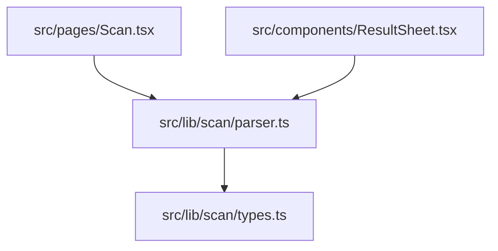
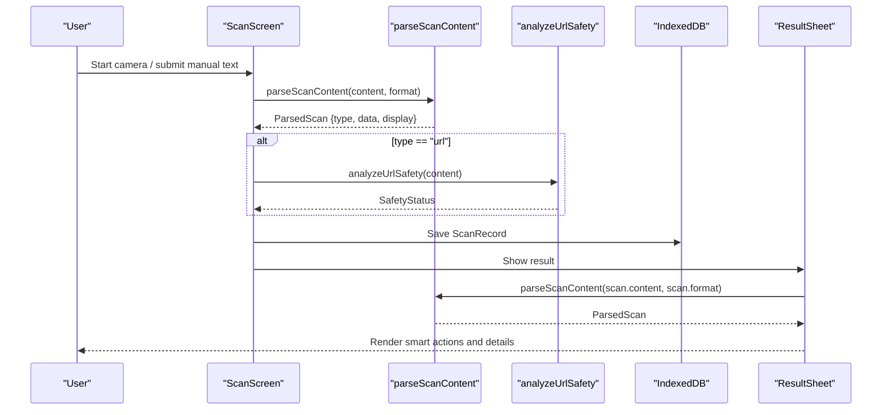
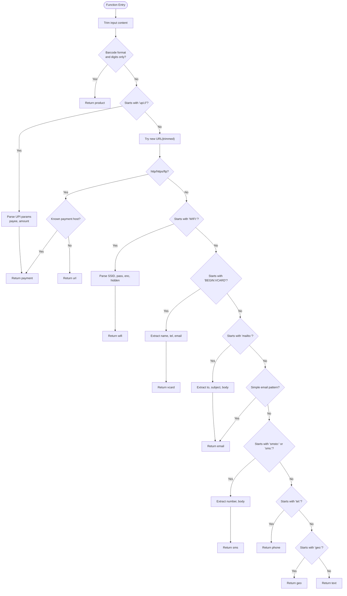
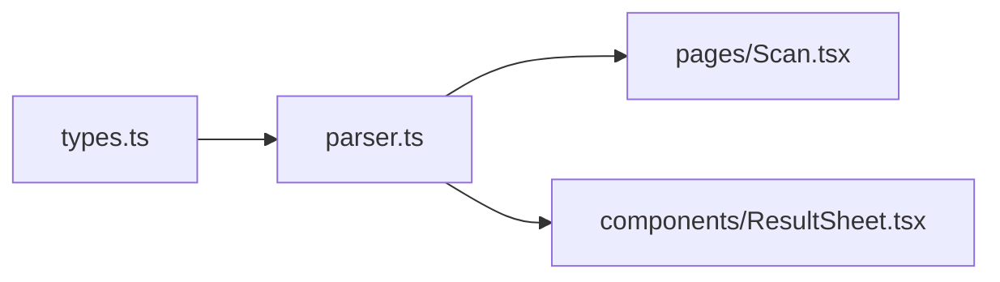

# Content Parser API

<cite>
**Referenced Files in This Document**
- [parser.ts](file://src/lib/scan/parser.ts)
- [types.ts](file://src/lib/scan/types.ts)
- [Scan.tsx](file://src/pages/Scan.tsx)
- [ResultSheet.tsx](file://src/components/ResultSheet.tsx)
</cite>

## Table of Contents
1. [Introduction](#introduction)
2. [Project Structure](#project-structure)
3. [Core Components](#core-components)
4. [Architecture Overview](#architecture-overview)
5. [Detailed Component Analysis](#detailed-component-analysis)
6. [Dependency Analysis](#dependency-analysis)
7. [Performance Considerations](#performance-considerations)
8. [Troubleshooting Guide](#troubleshooting-guide)
9. [Conclusion](#conclusion)
10. [Appendices](#appendices)

## Introduction
This document provides detailed API documentation for the content parsing system used to detect and extract structured data from scanned or manually entered content. The core function parseScanContent classifies input into a set of content types (such as URLs, WiFi credentials, contact cards, emails, phone numbers, SMS messages, geographic coordinates, product codes, payment links, and plain text), returning a normalized result structure that is consumed by UI components and automation logic.

The system supports:
- URL detection including generic http(s)/ftp and specific payment service patterns
- UPI payment link parsing with payee and amount extraction
- WiFi credential parsing from WIFI: strings
- vCard (contact card) parsing for name, telephone, and email
- Email detection via mailto: URIs and simple email addresses
- SMS handling for smsto: and sms: schemes
- Phone number handling via tel: scheme
- Geographic coordinate handling via geo: scheme
- Product code recognition for numeric barcodes
- Fallback to plain text when no other pattern matches

## Project Structure
The parsing system is implemented as a small, focused module with clear separation between type definitions and parsing logic. Consumers include the scanning page and the result sheet component.

**Diagram sources**
- [Scan.tsx:57-72](file://src/pages/Scan.tsx#L57-L72)
- [ResultSheet.tsx:127-131](file://src/components/ResultSheet.tsx#L127-L131)
- [parser.ts:12-101](file://src/lib/scan/parser.ts#L12-L101)
- [types.ts:16-26](file://src/lib/scan/types.ts#L16-L26)

**Section sources**
- [parser.ts:1-101](file://src/lib/scan/parser.ts#L1-L101)
- [types.ts:1-49](file://src/lib/scan/types.ts#L1-L49)
- [Scan.tsx:50-102](file://src/pages/Scan.tsx#L50-L102)
- [ResultSheet.tsx:111-131](file://src/components/ResultSheet.tsx#L111-L131)

## Core Components
This section documents the public API surface of the parser module and its integration points.

- Function: parseScanContent(content: string, format: ScanFormat): ParsedScan
  - Purpose: Classify and extract structured data from raw content based on both content heuristics and scanner-provided format hints.
  - Input validation rules:
    - content: non-null string; trimmed before processing.
    - format: one of the supported ScanFormat values; influences barcode-specific behavior.
  - Output structure: ParsedScan object containing:
    - type: one of the supported ScanContentType values
    - data: Record<string, string> with fields specific to the detected type
    - display: human-friendly string for UI presentation
  - Error handling:
    - No exceptions are thrown by the function itself.
    - URL parsing uses try/catch internally; invalid URLs fall through to subsequent checks.
    - Unknown formats or unrecognized content return a "text" result.

- Type: ScanContentType
  - Values: url, wifi, vcard, email, sms, phone, geo, product, text, payment
  - Usage: Indicates the semantic category of parsed content.

- Type: ScanFormat
  - Values: QR_CODE, EAN_13, EAN_8, UPC_A, UPC_E, CODE_128, CODE_39, CODE_93, ITF, DATA_MATRIX, PDF_417, AZTEC, UNKNOWN
  - Usage: Influences special-case handling such as numeric-only product codes.

- Interface: ParsedScan
  - Fields:
    - type: ScanContentType
    - data: Record<string, string>
    - display: string

- Integration usage:
  - Scanning flow: ScanScreen calls parseScanContent after receiving content and format from the scanner service, then persists a record and shows the ResultSheet.
  - Result display: ResultSheet re-parses stored records to render smart actions and details.

**Section sources**
- [parser.ts:6-101](file://src/lib/scan/parser.ts#L6-L101)
- [types.ts:16-26](file://src/lib/scan/types.ts#L16-L26)
- [types.ts:1-14](file://src/lib/scan/types.ts#L1-L14)
- [Scan.tsx:57-72](file://src/pages/Scan.tsx#L57-L72)
- [ResultSheet.tsx:127-131](file://src/components/ResultSheet.tsx#L127-L131)

## Architecture Overview
The parsing pipeline is straightforward:
- Scanner service emits content and format.
- ScanScreen invokes parseScanContent to classify and extract data.
- Optional URL safety analysis runs for URL-type results.
- A scan record is persisted and displayed in ResultSheet.
- ResultSheet re-invokes parseScanContent to render type-specific actions.

**Diagram sources**
- [Scan.tsx:57-72](file://src/pages/Scan.tsx#L57-L72)
- [ResultSheet.tsx:127-131](file://src/components/ResultSheet.tsx#L127-L131)
- [parser.ts:12-101](file://src/lib/scan/parser.ts#L12-L101)

## Detailed Component Analysis

### parseScanContent Algorithm
The function applies a sequence of pattern-based checks and returns the first matching classification. Key behaviors:
- Barcode product codes: If format indicates a barcode and content is digits-only, classify as product.
- Payment links:
  - UPI: Recognizes upi:// and extracts payee and amount from query parameters.
  - PayPal.me and other services: Recognizes specific hosts and extracts recipient.
- URLs: Generic http(s)/ftp URLs are classified as url with host extracted.
- WiFi: Parses WIFI: strings into SSID, password, encryption, and hidden flags.
- vCard: Extracts name, telephone, and email from BEGIN:VCARD blocks.
- Email: Supports mailto: URIs and simple email address patterns.
- SMS: Handles smsto: and sms: schemes, extracting number and optional body.
- Phone: Handles tel: scheme.
- Geo: Handles geo: scheme.
- Fallback: Returns text with the original trimmed content.

**Diagram sources**
- [parser.ts:12-101](file://src/lib/scan/parser.ts#L12-L101)

**Section sources**
- [parser.ts:12-101](file://src/lib/scan/parser.ts#L12-L101)

### Supported Content Types and Extraction Results
Below is a summary of each content type, expected inputs, and output fields in ParsedScan.data.

- url
  - Inputs: http(s)/ftp URLs
  - Data fields: url, host
  - Display: Original URL
- payment
  - Inputs: upi://, paypal.me, venmo.com, cash.app
  - Data fields: scheme, payee, amount (optional), raw
  - Display: Payee or descriptive label
- wifi
  - Inputs: WIFI:T:...;S:...;P:...;H:...;;
  - Data fields: ssid, password, encryption, hidden
  - Display: SSID or original string
- vcard
  - Inputs: BEGIN:VCARD...END:VCARD
  - Data fields: name, tel, email, raw
  - Display: Name, tel, or email
- email
  - Inputs: mailto: URI or simple email address
  - Data fields: to, subject (optional), body (optional)
  - Display: Address or pathname
- sms
  - Inputs: smsto:/sms: with optional body
  - Data fields: number, body
  - Display: Number
- phone
  - Inputs: tel: URI
  - Data fields: number
  - Display: Number
- geo
  - Inputs: geo: URI
  - Data fields: coords
  - Display: Coordinates string
- product
  - Inputs: Numeric-only content with barcode format
  - Data fields: code
  - Display: Code string
- text
  - Inputs: Any unrecognized content
  - Data fields: text
  - Display: Text content

**Section sources**
- [parser.ts:15-101](file://src/lib/scan/parser.ts#L15-L101)
- [types.ts:16-26](file://src/lib/scan/types.ts#L16-L26)

### Strategy Pattern and Extensibility
Current implementation uses a sequential decision tree rather than an explicit strategy registry. To add support for new content types or parsers:
- Add a new case branch in parseScanContent following existing patterns.
- Update ScanContentType union to include the new type.
- Extend ResultSheet’s action rendering to handle the new type.
- Optionally introduce a strategy registry mapping content prefixes or regex patterns to handler functions for better scalability.

Recommended approach for extensibility:
- Define a Handler interface with methods like canHandle(input, format) and handle(input, format).
- Maintain a list of handlers ordered by specificity.
- Iterate handlers until one matches, enabling easy addition without modifying central branching logic.

[No sources needed since this section proposes architectural improvements not present in current code]

## Dependency Analysis
The parser depends only on type definitions and is consumed by two primary consumers.

**Diagram sources**
- [types.ts:1-49](file://src/lib/scan/types.ts#L1-L49)
- [parser.ts:1-101](file://src/lib/scan/parser.ts#L1-L101)
- [Scan.tsx:57-72](file://src/pages/Scan.tsx#L57-L72)
- [ResultSheet.tsx:127-131](file://src/components/ResultSheet.tsx#L127-L131)

**Section sources**
- [parser.ts:1-101](file://src/lib/scan/parser.ts#L1-L101)
- [types.ts:1-49](file://src/lib/scan/types.ts#L1-L49)
- [Scan.tsx:57-72](file://src/pages/Scan.tsx#L57-L72)
- [ResultSheet.tsx:127-131](file://src/components/ResultSheet.tsx#L127-L131)

## Performance Considerations
- Parsing is lightweight and deterministic; it performs simple string operations and regex tests.
- Avoid repeated parsing by caching results if necessary, though consumers already call parseScanContent once per scan and once for display.
- For large batches, consider batching and memoization strategies at the consumer layer.

[No sources needed since this section provides general guidance]

## Troubleshooting Guide
Common issues and resolutions:
- Invalid URL strings:
  - Behavior: URL constructor throws; parser catches and continues to next checks.
  - Resolution: Ensure content is properly encoded; rely on fallback to text if not recognized.
- Missing fields in structured formats:
  - Behavior: Fields default to empty strings where applicable.
  - Resolution: Validate downstream usage against optional fields.
- Unexpected content type:
  - Behavior: Falls back to text.
  - Resolution: Adjust input formatting or extend parser with additional cases.

Integration error handling:
- ScanScreen wraps parsing and persistence in try/catch and surfaces user-facing errors via toast notifications.
- ResultSheet handles clipboard and share failures gracefully.

**Section sources**
- [parser.ts:28-49](file://src/lib/scan/parser.ts#L28-L49)
- [Scan.tsx:98-101](file://src/pages/Scan.tsx#L98-L101)
- [ResultSheet.tsx:132-153](file://src/components/ResultSheet.tsx#L132-L153)

## Conclusion
The content parsing system provides a robust, extensible foundation for detecting and extracting structured data from diverse content types. Its design emphasizes simplicity and clarity, making it easy to maintain and extend. By following the documented API and recommended extensibility patterns, developers can add new content type parsers and integrate them seamlessly into the scanning workflow.

[No sources needed since this section summarizes without analyzing specific files]

## Appendices

### Practical Examples

- Parse a URL
  - Input: https://example.com/path?query=1
  - Expected type: url
  - Data fields: url, host
  - Display: Original URL
  - Section sources
    - [parser.ts:28-43](file://src/lib/scan/parser.ts#L28-L43)

- Parse a UPI payment link
  - Input: upi://pay?pa=user@bank&pn=Name&am=100
  - Expected type: payment
  - Data fields: scheme, payee, amount, raw
  - Display: Payee or “UPI Payment”
  - Section sources
    - [parser.ts:19-25](file://src/lib/scan/parser.ts#L19-L25)

- Parse a PayPal.me link
  - Input: https://paypal.me/johndoe
  - Expected type: payment
  - Data fields: scheme, payee, raw
  - Display: “PayPal: johndoe”
  - Section sources
    - [parser.ts:33-36](file://src/lib/scan/parser.ts#L33-L36)

- Parse a WiFi credential
  - Input: WIFI:T:WPA;S:MyNetwork;P:secret;H:false;;
  - Expected type: wifi
  - Data fields: ssid, password, encryption, hidden
  - Display: SSID
  - Section sources
    - [parser.ts:51-64](file://src/lib/scan/parser.ts#L51-L64)

- Parse a vCard
  - Input: BEGIN:VCARD\nVERSION:3.0\nFN:Alice\nTEL:+1234567890\nEMAIL:alice@example.com\nEND:VCARD
  - Expected type: vcard
  - Data fields: name, tel, email, raw
  - Display: Name
  - Section sources
    - [parser.ts:66-72](file://src/lib/scan/parser.ts#L66-L72)

- Parse an email address
  - Input: alice@example.com
  - Expected type: email
  - Data fields: to
  - Display: Email address
  - Section sources
    - [parser.ts:79-81](file://src/lib/scan/parser.ts#L79-L81)

- Parse a mailto link
  - Input: mailto:alice@example.com?subject=Hello
  - Expected type: email
  - Data fields: to, subject, body
  - Display: Pathname
  - Section sources
    - [parser.ts:74-78](file://src/lib/scan/parser.ts#L74-L78)

- Parse an SMS message
  - Input: SMSTO:+1234567890:Hello there
  - Expected type: sms
  - Data fields: number, body
  - Display: Number
  - Section sources
    - [parser.ts:83-88](file://src/lib/scan/parser.ts#L83-L88)

- Parse a phone number
  - Input: tel:+1234567890
  - Expected type: phone
  - Data fields: number
  - Display: Number
  - Section sources
    - [parser.ts:90-93](file://src/lib/scan/parser.ts#L90-L93)

- Parse geographic coordinates
  - Input: geo:37.7749,-122.4194
  - Expected type: geo
  - Data fields: coords
  - Display: Coordinates string
  - Section sources
    - [parser.ts:95-98](file://src/lib/scan/parser.ts#L95-L98)

- Parse a product code
  - Input: 123456789012 with barcode format
  - Expected type: product
  - Data fields: code
  - Display: Code string
  - Section sources
    - [parser.ts:15-17](file://src/lib/scan/parser.ts#L15-L17)

- Handle unknown content
  - Input: Random text
  - Expected type: text
  - Data fields: text
  - Display: Text content
  - Section sources
    - [parser.ts:100-101](file://src/lib/scan/parser.ts#L100-L101)