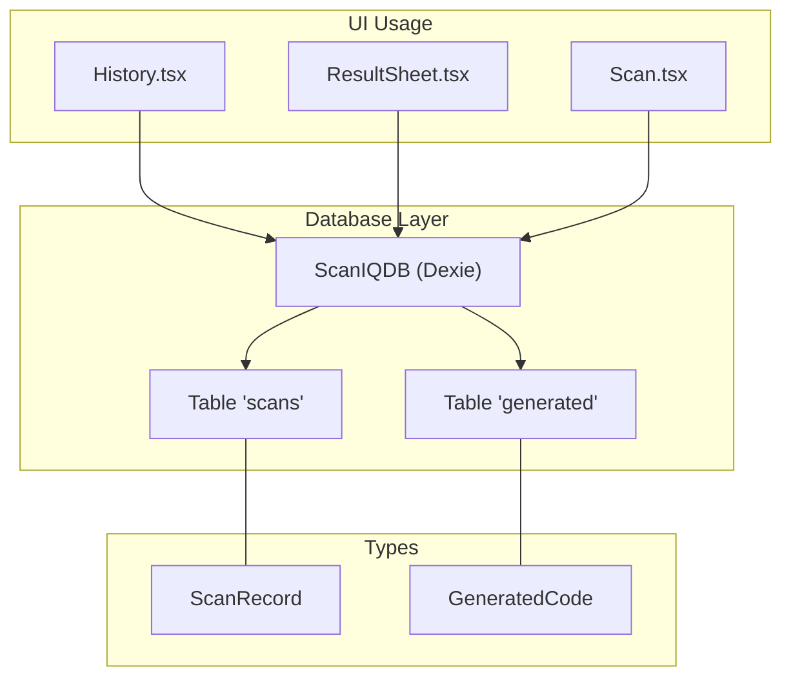
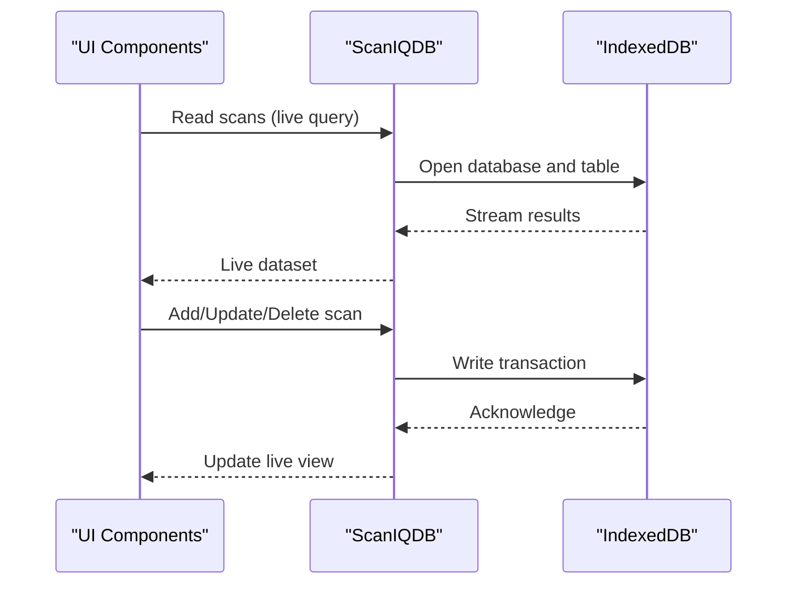
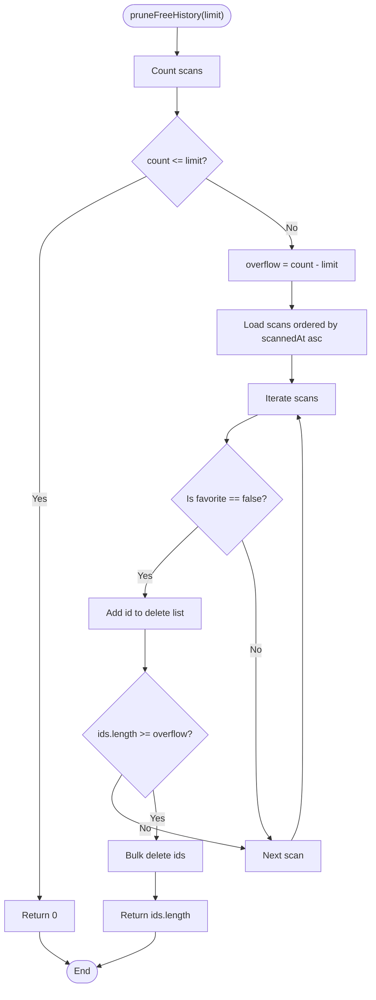
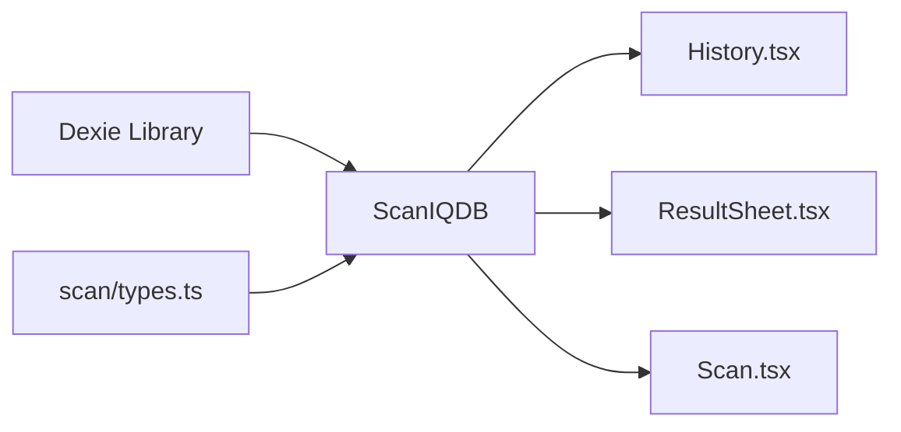

# Database API

<cite>
**Referenced Files in This Document**
- [db.ts](file://src/lib/db.ts)
- [types.ts](file://src/lib/scan/types.ts)
- [History.tsx](file://src/pages/History.tsx)
- [ResultSheet.tsx](file://src/components/ResultSheet.tsx)
- [Scan.tsx](file://src/pages/Scan.tsx)
</cite>

## Table of Contents
1. [Introduction](#introduction)
2. [Project Structure](#project-structure)
3. [Core Components](#core-components)
4. [Architecture Overview](#architecture-overview)
5. [Detailed Component Analysis](#detailed-component-analysis)
6. [Dependency Analysis](#dependency-analysis)
7. [Performance Considerations](#performance-considerations)
8. [Troubleshooting Guide](#troubleshooting-guide)
9. [Conclusion](#conclusion)
10. [Appendices](#appendices)

## Introduction
This document provides detailed API documentation for the database layer built with Dexie ORM. It covers data models, schema design, indexing strategies, CRUD operations, query patterns, automatic cleanup policies for free tier limitations, error handling, and practical examples for common operations. The goal is to help developers understand how scan history and generated codes are persisted, queried, and maintained efficiently in the browser using IndexedDB via Dexie.

## Project Structure
The database layer is implemented as a small Dexie class that defines two tables: scans and generated. Data models are defined in a shared types file. UI components use Dexie’s live queries and standard table methods to read, update, and delete records.

**Diagram sources**
- [db.ts:4-17](file://src/lib/db.ts#L4-L17)
- [types.ts:30-48](file://src/lib/scan/types.ts#L30-L48)
- [History.tsx:34-60](file://src/pages/History.tsx#L34-L60)
- [ResultSheet.tsx:150-160](file://src/components/ResultSheet.tsx#L150-L160)
- [Scan.tsx:60-75](file://src/pages/Scan.tsx#L60-L75)

**Section sources**
- [db.ts:1-35](file://src/lib/db.ts#L1-L35)
- [types.ts:1-49](file://src/lib/scan/types.ts#L1-L49)
- [History.tsx:1-138](file://src/pages/History.tsx#L1-L138)
- [ResultSheet.tsx:150-160](file://src/components/ResultSheet.tsx#L150-L160)
- [Scan.tsx:60-75](file://src/pages/Scan.tsx#L60-L75)

## Core Components
- ScanIQDB: A Dexie subclass defining the database name and schema version. It exposes typed tables for scans and generated records.
- Tables:
  - scans: Stores scan history entries.
  - generated: Stores generated code artifacts.
- Types:
  - ScanRecord: Represents a single scan entry with metadata and optional fields.
  - GeneratedCode: Represents a generated code artifact with payload and styling options.

Key responsibilities:
- Define schema and indexes at version initialization.
- Provide a singleton instance for app-wide access.
- Implement free-tier history pruning utility.

**Section sources**
- [db.ts:4-17](file://src/lib/db.ts#L4-L17)
- [types.ts:30-48](file://src/lib/scan/types.ts#L30-L48)

## Architecture Overview
The application uses Dexie to persist scan history and generated codes in IndexedDB. UI components subscribe to live queries for real-time updates and perform mutations directly on Dexie tables. A dedicated utility prunes old non-favorite scans when exceeding the free tier limit.

**Diagram sources**
- [db.ts:4-17](file://src/lib/db.ts#L4-L17)
- [History.tsx:34-60](file://src/pages/History.tsx#L34-L60)
- [ResultSheet.tsx:150-160](file://src/components/ResultSheet.tsx#L150-L160)
- [Scan.tsx:60-75](file://src/pages/Scan.tsx#L60-L75)

## Detailed Component Analysis

### Data Models
- ScanRecord
  - id: string — Primary key
  - content: string — Raw scanned content
  - format: enum — Barcode/QR format identifier
  - type: enum — Content category (e.g., url, wifi, vcard)
  - parsed?: object — Optional structured parsing result
  - safetyStatus?: enum — Safety classification
  - favorite?: boolean — User preference flag
  - scannedAt: number — Epoch milliseconds timestamp
- GeneratedCode
  - id: string — Primary key
  - type: enum — Content category
  - payload: string — Encoded or serialized payload
  - label?: string — Human-readable label
  - style?: object — Styling options (foreground/background colors)
  - createdAt: number — Epoch milliseconds timestamp

Relationships and constraints:
- Both tables use string primary keys.
- Scans include an index on scannedAt for time-based ordering and filtering.
- Generated codes include indexes on createdAt and type for efficient retrieval.

**Section sources**
- [types.ts:30-48](file://src/lib/scan/types.ts#L30-L48)

### Database Schema and Indexing
- Database name: "scaniq"
- Version: 1
- Tables and indexes:
  - scans: indexed by id, scannedAt, type, format, favorite, content
  - generated: indexed by id, createdAt, type

Indexing strategy:
- Time-based queries on scans rely on scannedAt index.
- Type-based filtering leverages type index.
- Full-text search is performed client-side over content due to lack of text index.

Schema definition location:
- [db.ts:8-14](file://src/lib/db.ts#L8-L14)

**Section sources**
- [db.ts:8-14](file://src/lib/db.ts#L8-L14)

### CRUD Operations for Scan History
Note: The repository does not expose wrapper functions named addScan(), getScans(), updateScan(), deleteScan(). Instead, it uses Dexie table methods directly. The following maps typical operations to actual usage patterns found in the codebase.

- Add a scan record
  - Pattern: db.scans.put(record)
  - Example usage path: [Scan.tsx:60-75](file://src/pages/Scan.tsx#L60-L75)
  - Parameters:
    - record: ScanRecord
  - Returns: Promise resolving to the stored id
  - Errors: IndexedDB write errors; wrap with try/catch if needed

- Get all scans (ordered by time)
  - Pattern: db.scans.orderBy("scannedAt").reverse().toArray()
  - Example usage path: [History.tsx:34-41](file://src/pages/History.tsx#L34-L41)
  - Returns: Promise resolving to ScanRecord[]
  - Errors: Query failures; handle with try/catch

- Update a scan (toggle favorite)
  - Pattern: db.scans.update(id, { favorite: next })
  - Example usage path: [ResultSheet.tsx:150-160](file://src/components/ResultSheet.tsx#L150-L160)
  - Parameters:
    - id: string
    - partial: Partial<ScanRecord>
  - Returns: Promise resolving to number of updated records
  - Errors: Record not found or write failure

- Delete a scan
  - Pattern: db.scans.delete(id)
  - Example usage path: [History.tsx:52-55](file://src/pages/History.tsx#L52-L55)
  - Parameters:
    - id: string
  - Returns: Promise resolving to void
  - Errors: Record not found or write failure

- Clear all scans
  - Pattern: db.scans.clear()
  - Example usage path: [History.tsx:57-60](file://src/pages/History.tsx#L57-L60)
  - Returns: Promise resolving to void
  - Errors: Bulk deletion failure

Query Methods:
- Search scans (client-side filter)
  - Pattern: Fetch ordered list then filter by content.toLowerCase().includes(query)
  - Example usage path: [History.tsx:42-50](file://src/pages/History.tsx#L42-L50)
  - Parameters:
    - query: string
  - Returns: Filtered ScanRecord[]
  - Notes: Not indexed; suitable for moderate datasets

- Get favorites
  - Pattern: Filter results where favorite === true
  - Example usage path: [History.tsx:42-50](file://src/pages/History.tsx#L42-L50)
  - Returns: Filtered ScanRecord[]

- Get recent scans
  - Pattern: Order by scannedAt descending and take N items
  - Example usage path: [History.tsx:34-41](file://src/pages/History.tsx#L34-L41)
  - Returns: Ordered ScanRecord[]

Error Handling Patterns:
- Wrap async Dexie calls in try/catch blocks.
- Use toast notifications for user feedback on success/failure.
- For bulk operations like clear or prune, consider progress feedback.

**Section sources**
- [Scan.tsx:60-75](file://src/pages/Scan.tsx#L60-L75)
- [History.tsx:34-60](file://src/pages/History.tsx#L34-L60)
- [ResultSheet.tsx:150-160](file://src/components/ResultSheet.tsx#L150-L160)

### Automatic Cleanup Policy (Free Tier Limitation)
- Purpose: Enforce a maximum number of scan history entries for free users.
- Behavior:
  - Count total scans.
  - If count exceeds limit, compute overflow = count - limit.
  - Iterate scans ordered by scannedAt ascending.
  - Collect ids of non-favorite scans until overflow is satisfied.
  - Bulk delete collected ids.
- Return value: Number of deleted records.

Implementation reference:
- [db.ts:19-34](file://src/lib/db.ts#L19-L34)

**Diagram sources**
- [db.ts:19-34](file://src/lib/db.ts#L19-L34)

**Section sources**
- [db.ts:19-34](file://src/lib/db.ts#L19-L34)

### Practical Examples and Patterns
- Adding a new scan:
  - Construct a ScanRecord with required fields (id, content, format, type, scannedAt).
  - Persist using db.scans.put(record).
  - Reference: [Scan.tsx:60-75](file://src/pages/Scan.tsx#L60-L75)

- Listing and searching scans:
  - Subscribe to live query for real-time updates.
  - Apply client-side filters for favorites and search terms.
  - References:
    - [History.tsx:34-41](file://src/pages/History.tsx#L34-L41)
    - [History.tsx:42-50](file://src/pages/History.tsx#L42-L50)

- Updating favorite status:
  - Toggle favorite field via db.scans.update(id, { favorite }).
  - Reference: [ResultSheet.tsx:150-160](file://src/components/ResultSheet.tsx#L150-L160)

- Deleting and clearing:
  - Single delete: db.scans.delete(id)
  - Clear all: db.scans.clear()
  - References: [History.tsx:52-60](file://src/pages/History.tsx#L52-L60)

- Pruning history:
  - Call pruneFreeHistory(limit) after adding scans to enforce limits.
  - Reference: [db.ts:19-34](file://src/lib/db.ts#L19-L34)

[No sources needed since this section aggregates previously cited references]

## Dependency Analysis
The database module depends on Dexie and exports a singleton instance used across UI components. Types are imported from a shared module.

**Diagram sources**
- [db.ts:1-17](file://src/lib/db.ts#L1-L17)
- [types.ts:1-49](file://src/lib/scan/types.ts#L1-L49)
- [History.tsx:1-20](file://src/pages/History.tsx#L1-L20)
- [ResultSheet.tsx:150-160](file://src/components/ResultSheet.tsx#L150-L160)
- [Scan.tsx:60-75](file://src/pages/Scan.tsx#L60-L75)

**Section sources**
- [db.ts:1-17](file://src/lib/db.ts#L1-L17)
- [types.ts:1-49](file://src/lib/scan/types.ts#L1-L49)
- [History.tsx:1-20](file://src/pages/History.tsx#L1-L20)
- [ResultSheet.tsx:150-160](file://src/components/ResultSheet.tsx#L150-L160)
- [Scan.tsx:60-75](file://src/pages/Scan.tsx#L60-L75)

## Performance Considerations
- Index utilization:
  - Prefer orderBy("scannedAt") for time-based queries.
  - Filter by type using the existing type index.
- Client-side search:
  - Current search iterates over loaded results; consider pagination or server-side-like chunking for large datasets.
- Live queries:
  - useLiveQuery reduces manual refresh logic but may increase memory usage; ensure proper cleanup in component unmount if necessary.
- Bulk operations:
  - Use bulkDelete for pruning instead of individual deletes to reduce transaction overhead.
- Storage limits:
  - IndexedDB quotas vary by browser; implement pruning proactively to avoid quota exceeded errors.

[No sources needed since this section provides general guidance]

## Troubleshooting Guide
Common issues and resolutions:
- Write failures:
  - Ensure valid record structure matching ScanRecord.
  - Wrap put/update/delete calls in try/catch and log errors.
- No results returned:
  - Verify scannedAt values are epoch milliseconds.
  - Confirm indexes exist for scannedAt and type.
- Excessive memory usage:
  - Avoid loading entire dataset into memory; paginate or limit results.
- Free tier enforcement:
  - Call pruneFreeHistory after insertions to maintain size constraints.

Operational references:
- Pruning implementation: [db.ts:19-34](file://src/lib/db.ts#L19-L34)
- Live query usage: [History.tsx:34-41](file://src/pages/History.tsx#L34-L41)
- Favorite toggle: [ResultSheet.tsx:150-160](file://src/components/ResultSheet.tsx#L150-L160)
- Deletion and clearing: [History.tsx:52-60](file://src/pages/History.tsx#L52-L60)

**Section sources**
- [db.ts:19-34](file://src/lib/db.ts#L19-L34)
- [History.tsx:34-60](file://src/pages/History.tsx#L34-L60)
- [ResultSheet.tsx:150-160](file://src/components/ResultSheet.tsx#L150-L160)

## Conclusion
The database layer is minimal and effective, leveraging Dexie’s typed tables and live queries for a responsive user experience. The schema includes appropriate indexes for time-based and categorical queries. The free-tier pruning utility enforces storage limits by removing older non-favorite scans. Developers should continue to optimize queries for larger datasets and adopt robust error handling around all asynchronous Dexie operations.

[No sources needed since this section summarizes without analyzing specific files]

## Appendices

### Method Signatures and Descriptions
- pruneFreeHistory(limit?: number): Promise<number>
  - Description: Ensures scan history does not exceed the specified limit by deleting oldest non-favorite scans.
  - Parameters:
    - limit: number — Maximum allowed scan records (default FREE_HISTORY_LIMIT)
  - Returns: Number of deleted records
  - Error handling: Throws on IndexedDB errors; callers should catch and handle appropriately
  - Reference: [db.ts:19-34](file://src/lib/db.ts#L19-L34)

- db.scans.put(record: ScanRecord): Promise<string>
  - Description: Inserts or updates a scan record.
  - Reference: [Scan.tsx:60-75](file://src/pages/Scan.tsx#L60-L75)

- db.scans.orderBy("scannedAt").reverse().toArray(): Promise<ScanRecord[]>
  - Description: Retrieves all scans ordered by newest first.
  - Reference: [History.tsx:34-41](file://src/pages/History.tsx#L34-L41)

- db.scans.update(id: string, partial: Partial<ScanRecord>): Promise<number>
  - Description: Updates fields of an existing scan record.
  - Reference: [ResultSheet.tsx:150-160](file://src/components/ResultSheet.tsx#L150-L160)

- db.scans.delete(id: string): Promise<void>
  - Description: Deletes a single scan record.
  - Reference: [History.tsx:52-55](file://src/pages/History.tsx#L52-L55)

- db.scans.clear(): Promise<void>
  - Description: Removes all scan records.
  - Reference: [History.tsx:57-60](file://src/pages/History.tsx#L57-L60)

### Data Migration Strategy
- Increment Dexie version and define store changes in the migration callback.
- Example approach:
  - this.version(2).stores({ ...new schema... })
  - this.version(2).upgrade(tx => { /* migrate data */ })
- Note: Current schema is at version 1; future migrations should preserve existing indexes and data integrity.

[No sources needed since this section provides general guidance]

### Backup and Storage Limits
- Backup strategies:
  - Export scans to JSON periodically and prompt users to download.
  - Import JSON to restore state on new devices.
- Storage limits:
  - IndexedDB quotas depend on browser and available disk space.
  - Proactive pruning helps avoid quota exceeded errors.
  - Monitor storage usage and provide user feedback when nearing limits.

[No sources needed since this section provides general guidance]