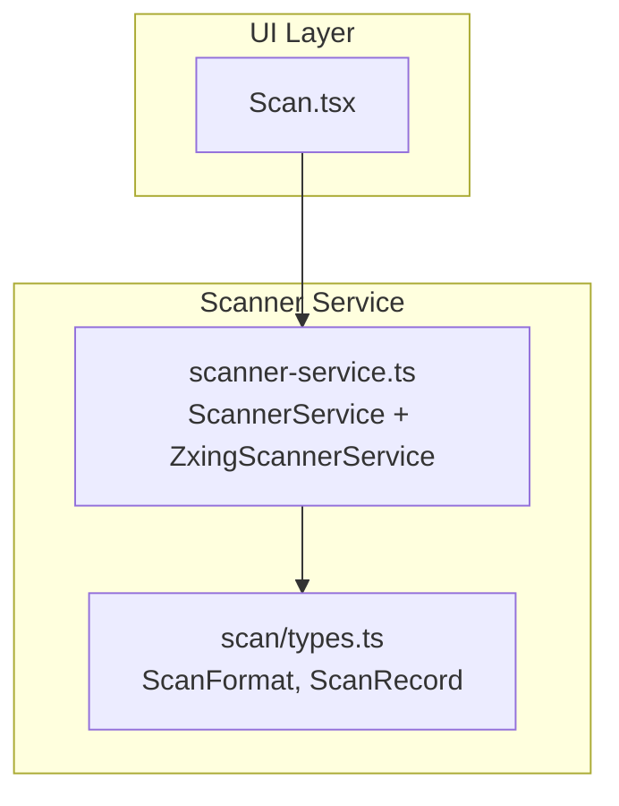
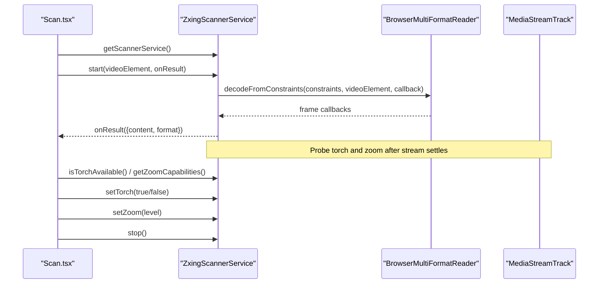
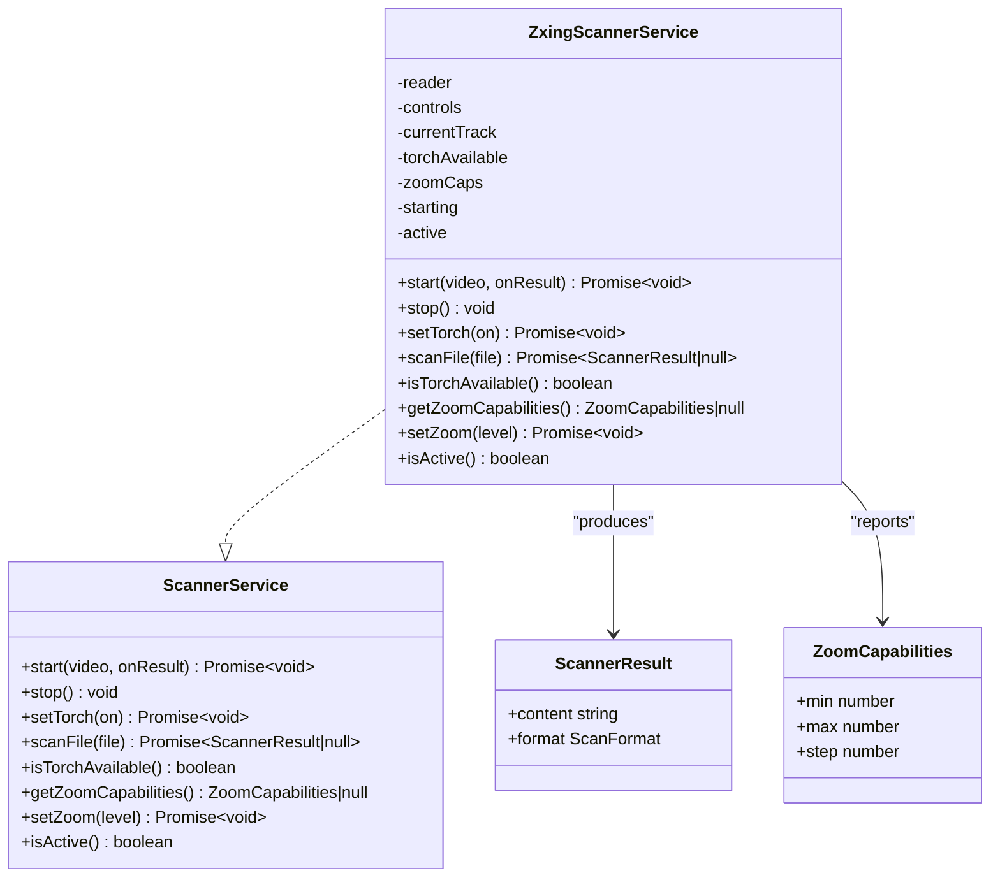
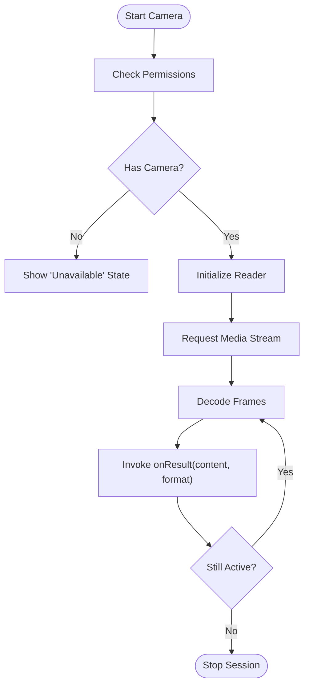
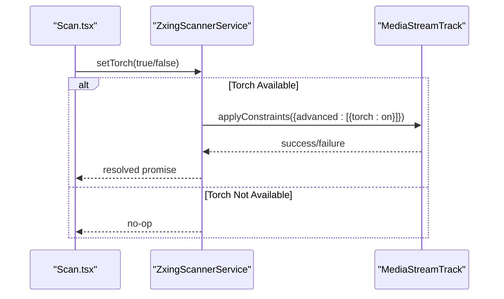
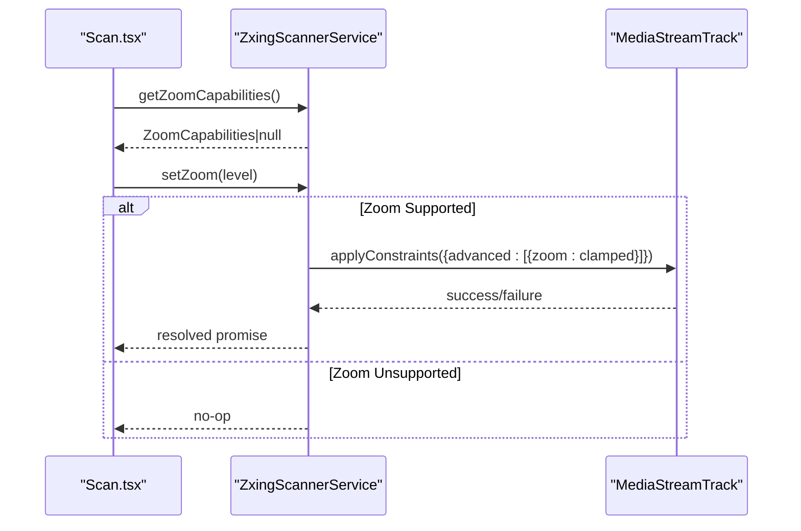
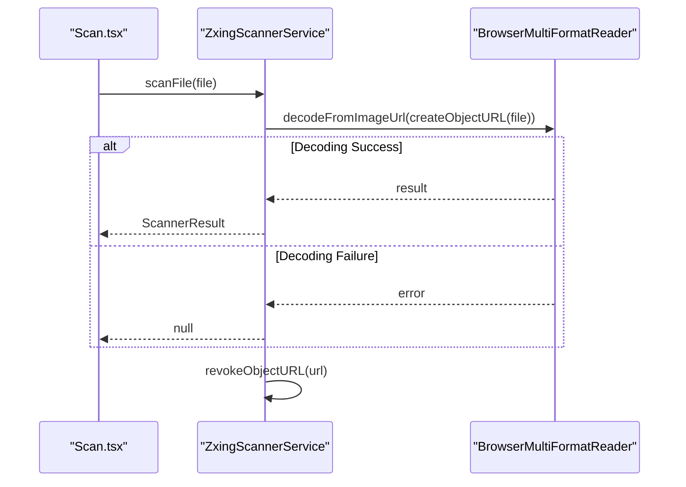
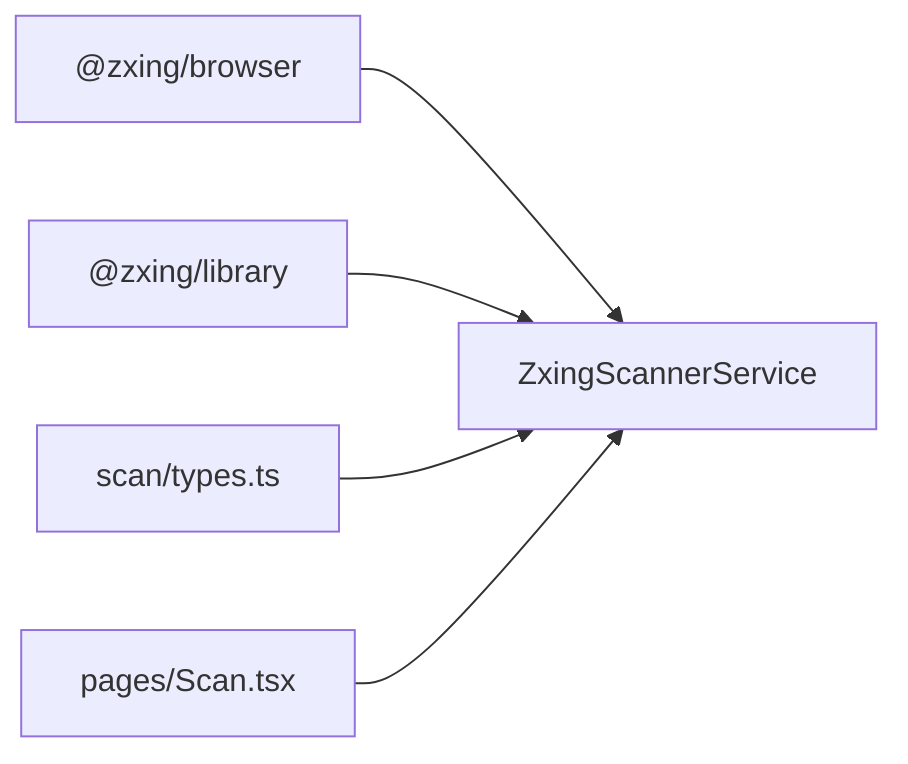

# Scanner Service API

<cite>
**Referenced Files in This Document**
- [scanner-service.ts](file://src/lib/scanner-service.ts)
- [types.ts](file://src/lib/scan/types.ts)
- [Scan.tsx](file://src/pages/Scan.tsx)
</cite>

## Table of Contents
1. [Introduction](#introduction)
2. [Project Structure](#project-structure)
3. [Core Components](#core-components)
4. [Architecture Overview](#architecture-overview)
5. [Detailed Component Analysis](#detailed-component-analysis)
6. [Dependency Analysis](#dependency-analysis)
7. [Performance Considerations](#performance-considerations)
8. [Troubleshooting Guide](#troubleshooting-guide)
9. [Conclusion](#conclusion)

## Introduction
This document provides comprehensive API documentation for the ScannerService interface and its related types used to perform barcode scanning via camera or image files, control device torch and zoom, and detect device capabilities. It includes method signatures, parameter descriptions, return values, error handling patterns, supported formats, and practical usage examples drawn from the application codebase.

## Project Structure
The ScannerService is implemented as a singleton service that wraps a browser-based multi-format barcode reader. The UI layer integrates with this service to start/stop camera scanning, handle results, toggle torch, and adjust zoom.

**Diagram sources**
- [scanner-service.ts:14-23](file://src/lib/scanner-service.ts#L14-L23)
- [types.ts:1-14](file://src/lib/scan/types.ts#L1-L14)
- [Scan.tsx:104-180](file://src/pages/Scan.tsx#L104-L180)

**Section sources**
- [scanner-service.ts:14-23](file://src/lib/scanner-service.ts#L14-L23)
- [types.ts:1-14](file://src/lib/scan/types.ts#L1-L14)
- [Scan.tsx:104-180](file://src/pages/Scan.tsx#L104-L180)

## Core Components
- ScannerService: Interface defining camera and file scanning operations, torch and zoom controls, capability checks, and lifecycle methods.
- ScannerResult: Represents a single scan result with content and format.
- ZoomCapabilities: Describes min/max/step values for supported zoom levels.
- ScanFormat: Enumerates supported barcode formats including QR_CODE, EAN_13, EAN_8, UPC_A/E, CODE_128/39/93, ITF, DATA_MATRIX, PDF_417, AZTEC, and UNKNOWN.

Supported formats are mapped internally to ensure only recognized formats are returned; unknown formats map to UNKNOWN.

**Section sources**
- [scanner-service.ts:3-23](file://src/lib/scanner-service.ts#L3-L23)
- [scanner-service.ts:25-40](file://src/lib/scanner-service.ts#L25-L40)
- [types.ts:1-14](file://src/lib/scan/types.ts#L1-L14)

## Architecture Overview
The ScannerService uses a singleton pattern to provide a single instance across the app. It initializes a multi-format reader lazily, requests camera access with constraints, and streams frames to the reader. After the stream starts, it probes device capabilities (torch and zoom) and exposes them through the API.

**Diagram sources**
- [scanner-service.ts:42-131](file://src/lib/scanner-service.ts#L42-L131)
- [scanner-service.ts:155-170](file://src/lib/scanner-service.ts#L155-L170)
- [Scan.tsx:104-180](file://src/pages/Scan.tsx#L104-L180)

## Detailed Component Analysis

### ScannerService Interface
Defines the public contract for scanning and device control.

- start(video: HTMLVideoElement, onResult: (r: ScannerResult) => void): Promise<void>
  - Starts camera scanning using the provided video element.
  - onResult is invoked repeatedly with each detected barcode until stop() is called.
  - Throws when camera permissions are denied or devices are unavailable.
- stop(): void
  - Stops scanning and releases resources.
- setTorch(on: boolean): Promise<void>
  - Toggles the device torch if available.
  - No-op if torch is not supported or no active track exists.
- scanFile(file: File): Promise<ScannerResult | null>
  - Scans an image file for barcodes.
  - Returns null if no code is found or decoding fails.
- isTorchAvailable(): boolean
  - Reports whether torch is available based on capability probing.
- getZoomCapabilities(): ZoomCapabilities | null
  - Returns zoom range and step if supported; null otherwise.
- setZoom(level: number): Promise<void>
  - Applies zoom level clamped to device capabilities.
  - No-op if zoom is unsupported or no active track exists.
- isActive(): boolean
  - Indicates whether a scanning session is currently active.

**Section sources**
- [scanner-service.ts:14-23](file://src/lib/scanner-service.ts#L14-L23)

### ScannerResult Interface
Represents a single decoded result.

- content: string
  - The decoded text payload.
- format: ScanFormat
  - The detected barcode format.

**Section sources**
- [scanner-service.ts:3-6](file://src/lib/scanner-service.ts#L3-L6)
- [types.ts:1-14](file://src/lib/scan/types.ts#L1-L14)

### ZoomCapabilities Interface
Describes zoom support.

- min: number
  - Minimum zoom level supported by the device.
- max: number
  - Maximum zoom level supported by the device.
- step: number
  - Increment granularity for zoom adjustments.

**Section sources**
- [scanner-service.ts:8-12](file://src/lib/scanner-service.ts#L8-L12)

### Supported Barcode Formats
The following formats are supported and mapped to ScanFormat values:
- QR_CODE
- EAN_13
- EAN_8
- UPC_A
- UPC_E
- CODE_128
- CODE_39
- CODE_93
- ITF
- DATA_MATRIX
- PDF_417
- AZTEC
- UNKNOWN (fallback for unrecognized formats)

**Section sources**
- [scanner-service.ts:25-40](file://src/lib/scanner-service.ts#L25-L40)
- [types.ts:1-14](file://src/lib/scan/types.ts#L1-L14)

### Singleton Accessor
- getScannerService(): ScannerService
  - Returns a singleton instance of the scanner service.

**Section sources**
- [scanner-service.ts:193-197](file://src/lib/scanner-service.ts#L193-L197)

### Class Diagram

**Diagram sources**
- [scanner-service.ts:14-23](file://src/lib/scanner-service.ts#L14-L23)
- [scanner-service.ts:42-197](file://src/lib/scanner-service.ts#L42-L197)
- [scanner-service.ts:3-12](file://src/lib/scanner-service.ts#L3-L12)

### Camera-Based Scanning Flow

**Diagram sources**
- [scanner-service.ts:80-131](file://src/lib/scanner-service.ts#L80-L131)
- [Scan.tsx:104-180](file://src/pages/Scan.tsx#L104-L180)

### Torch Control Flow

**Diagram sources**
- [scanner-service.ts:165-170](file://src/lib/scanner-service.ts#L165-L170)
- [Scan.tsx:210-218](file://src/pages/Scan.tsx#L210-L218)

### Zoom Control Flow

**Diagram sources**
- [scanner-service.ts:155-163](file://src/lib/scanner-service.ts#L155-L163)
- [Scan.tsx:220-232](file://src/pages/Scan.tsx#L220-L232)

### File-Based Scanning Flow

**Diagram sources**
- [scanner-service.ts:176-190](file://src/lib/scanner-service.ts#L176-L190)
- [Scan.tsx:254-268](file://src/pages/Scan.tsx#L254-L268)

## Dependency Analysis
- External dependencies:
  - @zxing/browser: BrowserMultiFormatReader for decoding frames and images.
  - @zxing/library: BarcodeFormat and DecodeHintType configuration.
- Internal dependencies:
  - ScanFormat type from scan/types.ts.
  - UI integration in pages/Scan.tsx for user interactions and state management.

**Diagram sources**
- [scanner-service.ts:42-74](file://src/lib/scanner-service.ts#L42-L74)
- [types.ts:1-14](file://src/lib/scan/types.ts#L1-L14)
- [Scan.tsx:104-180](file://src/pages/Scan.tsx#L104-L180)

**Section sources**
- [scanner-service.ts:42-74](file://src/lib/scanner-service.ts#L42-L74)
- [types.ts:1-14](file://src/lib/scan/types.ts#L1-L14)
- [Scan.tsx:104-180](file://src/pages/Scan.tsx#L104-L180)

## Performance Considerations
- Lazy initialization: The reader is created on first use to avoid unnecessary overhead.
- Frame rate throttling: A delay between scan attempts reduces CPU usage during continuous scanning.
- Capability probing: Torch and zoom capabilities are probed after the stream settles to avoid race conditions.
- Resource cleanup: stop() ensures controls and tracks are released promptly.
- Debounced zoom updates: The UI batches zoom changes using requestAnimationFrame to minimize constraint churn.

[No sources needed since this section provides general guidance]

## Troubleshooting Guide
Common issues and resolutions:
- Permission denied:
  - Symptoms: start() throws permission-related errors; UI shows "denied" or "denied-permanent".
  - Resolution: Prompt user to allow camera access; check navigator.permissions where supported.
- No camera devices:
  - Symptoms: start() throws NotFound/DevicesNotFound; UI shows "unavailable".
  - Resolution: Verify device has a camera; fall back to file-based scanning.
- Torch not available:
  - Symptom: isTorchAvailable() returns false; setTorch() becomes a no-op.
  - Resolution: Disable torch UI controls when not available.
- Zoom not supported:
  - Symptom: getZoomCapabilities() returns null; setZoom() becomes a no-op.
  - Resolution: Hide zoom controls when not available.
- Image scanning failures:
  - Symptom: scanFile() returns null or throws.
  - Resolution: Ensure image contains a scannable code; handle null gracefully.

**Section sources**
- [scanner-service.ts:80-131](file://src/lib/scanner-service.ts#L80-L131)
- [scanner-service.ts:155-170](file://src/lib/scanner-service.ts#L155-L170)
- [scanner-service.ts:176-190](file://src/lib/scanner-service.ts#L176-L190)
- [Scan.tsx:158-179](file://src/pages/Scan.tsx#L158-L179)

## Conclusion
The ScannerService provides a robust, capability-aware API for real-time camera scanning and file-based decoding, with optional torch and zoom controls. By adhering to the documented interfaces and best practices—such as checking capabilities, managing resources, and handling errors—you can integrate reliable scanning functionality into your application.