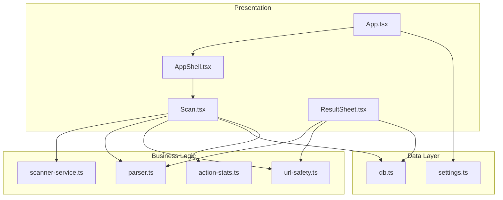
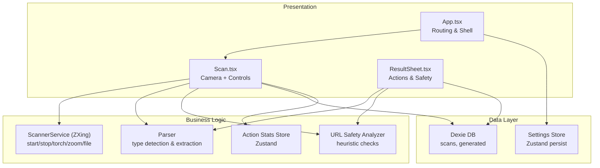
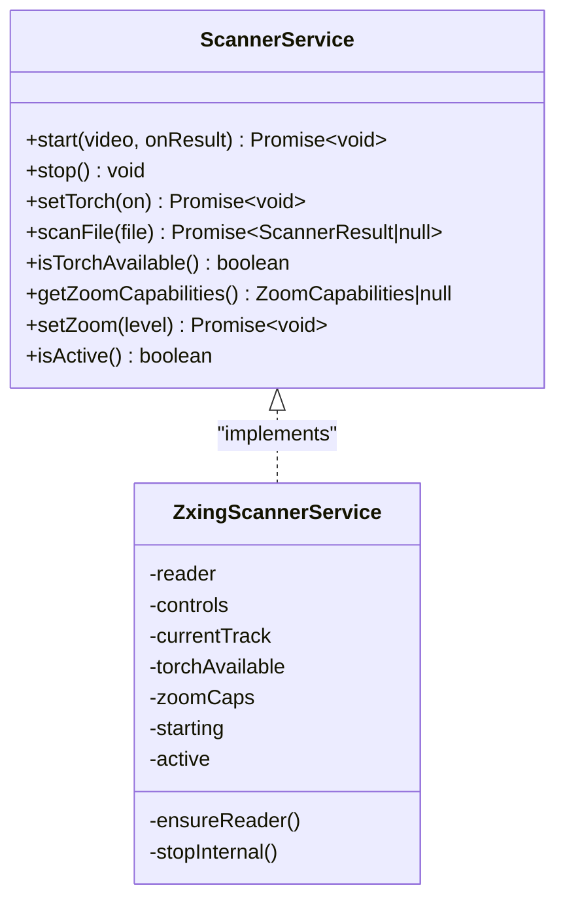
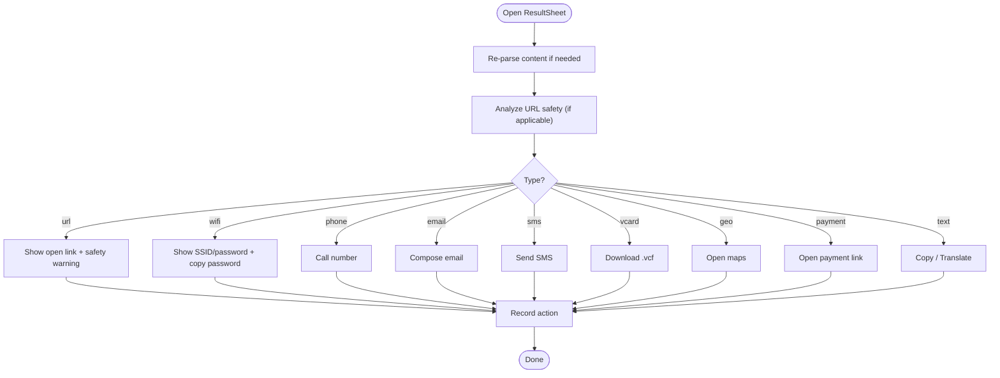
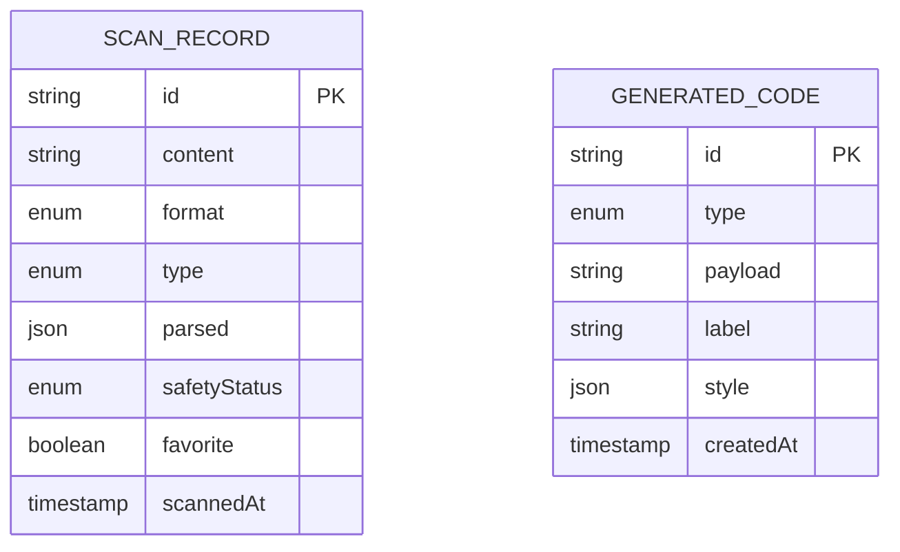
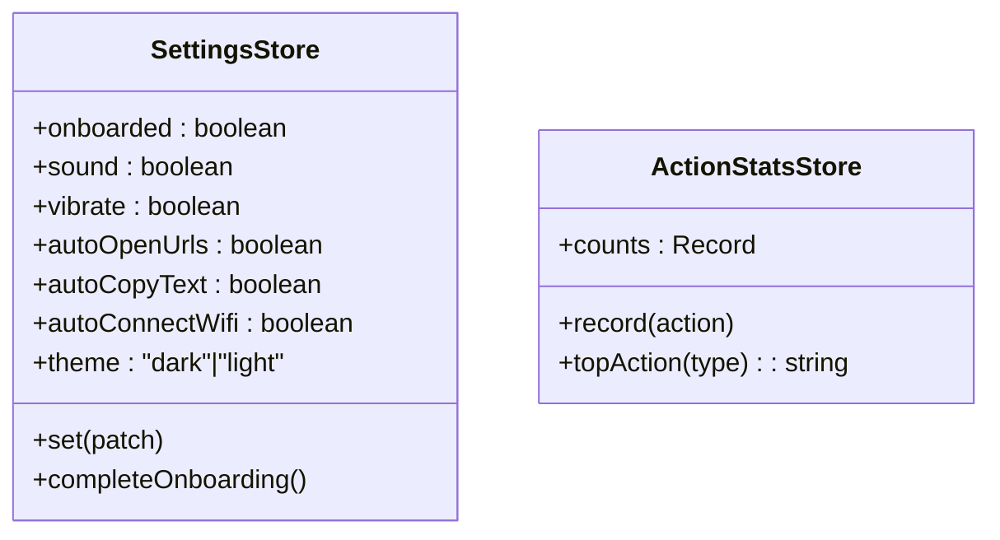
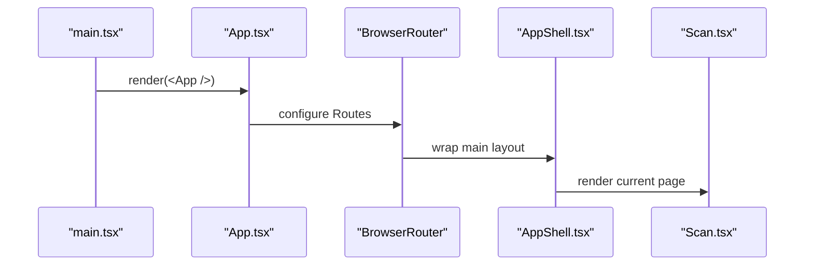
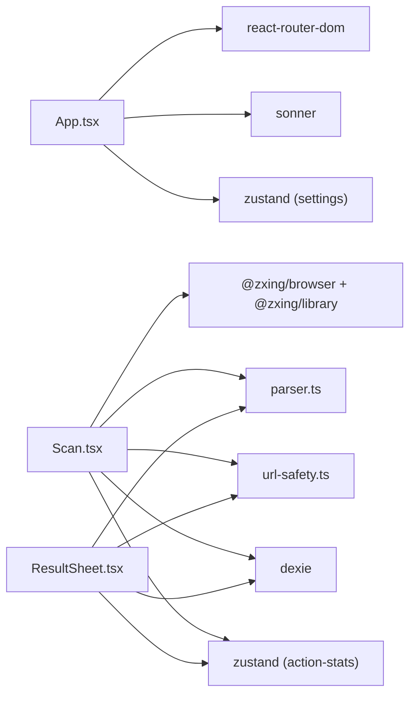

# Architecture Overview

<cite>
**Referenced Files in This Document**
- [main.tsx](file://src/main.tsx)
- [App.tsx](file://src/App.tsx)
- [AppShell.tsx](file://src/components/AppShell.tsx)
- [Scan.tsx](file://src/pages/Scan.tsx)
- [scanner-service.ts](file://src/lib/scanner-service.ts)
- [parser.ts](file://src/lib/scan/parser.ts)
- [types.ts](file://src/lib/scan/types.ts)
- [db.ts](file://src/lib/db.ts)
- [url-safety.ts](file://src/lib/url-safety.ts)
- [ResultSheet.tsx](file://src/components/ResultSheet.tsx)
- [settings.ts](file://src/lib/settings.ts)
- [action-stats.ts](file://src/lib/action-stats.ts)
- [package.json](file://package.json)
</cite>

## Table of Contents
1. Introduction
2. Project Structure
3. Core Components
4. Architecture Overview
5. Detailed Component Analysis
6. Dependency Analysis
7. Performance Considerations
8. Troubleshooting Guide
9. Conclusion

## Introduction
This document describes Smart Scan Pro’s system architecture with a focus on separation of concerns across presentation, business logic, and data layers. It explains the service-oriented patterns used for scanning, local storage abstraction, and state management via Zustand. It also details data flow from camera input through parsing to storage and UI updates, integration points with ZXing and Dexie, performance and memory considerations, cross-platform compatibility, security checks, and error handling strategies.

## Project Structure
The application is a React-based SPA organized by feature and layer:
- Presentation: pages and shared UI components
- Business logic: scanner service, content parser, URL safety analyzer, action statistics
- Data layer: Dexie database wrapper and settings store
- State management: Zustand stores (settings, action stats)
- App shell and routing: top-level app setup and navigation



**Diagram sources**
- [App.tsx](file://src/App.tsx)
- [AppShell.tsx](file://src/components/AppShell.tsx)
- [Scan.tsx](file://src/pages/Scan.tsx)
- [ResultSheet.tsx](file://src/components/ResultSheet.tsx)
- [scanner-service.ts](file://src/lib/scanner-service.ts)
- [parser.ts](file://src/lib/scan/parser.ts)
- [url-safety.ts](file://src/lib/url-safety.ts)
- [action-stats.ts](file://src/lib/action-stats.ts)
- [db.ts](file://src/lib/db.ts)
- [settings.ts](file://src/lib/settings.ts)

**Section sources**
- [App.tsx](file://src/App.tsx)
- [AppShell.tsx](file://src/components/AppShell.tsx)
- [Scan.tsx](file://src/pages/Scan.tsx)
- [ResultSheet.tsx](file://src/components/ResultSheet.tsx)
- [scanner-service.ts](file://src/lib/scanner-service.ts)
- [parser.ts](file://src/lib/scan/parser.ts)
- [url-safety.ts](file://src/lib/url-safety.ts)
- [action-stats.ts](file://src/lib/action-stats.ts)
- [db.ts](file://src/lib/db.ts)
- [settings.ts](file://src/lib/settings.ts)

## Core Components
- ScannerService: Service interface abstracting camera scanning and file scanning; implemented using ZXing browser APIs. Provides start/stop, torch control, zoom capabilities, and file decoding.
- Database layer: Dexie-based schema for scans and generated codes, plus history pruning utility.
- Parser: Content-type detection and structured extraction for URLs, WiFi, vCard, email, SMS, phone, geo, product barcodes, and payment links.
- URL Safety Analyzer: Heuristic checks for malicious or suspicious URLs (protocols, IP hosts, punycode, shorteners, brand impersonation, HTTP).
- State Management: Zustand stores for app settings and user action statistics, both persisted.
- UI: Router-driven pages with a bottom tab shell; scan page orchestrates camera, results, and actions; result sheet renders smart actions and safety warnings.

**Section sources**
- [scanner-service.ts](file://src/lib/scanner-service.ts)
- [db.ts](file://src/lib/db.ts)
- [parser.ts](file://src/lib/scan/parser.ts)
- [url-safety.ts](file://src/lib/url-safety.ts)
- [settings.ts](file://src/lib/settings.ts)
- [action-stats.ts](file://src/lib/action-stats.ts)
- [App.tsx](file://src/App.tsx)
- [AppShell.tsx](file://src/components/AppShell.tsx)
- [Scan.tsx](file://src/pages/Scan.tsx)
- [ResultSheet.tsx](file://src/components/ResultSheet.tsx)

## Architecture Overview
Smart Scan Pro follows a layered, service-oriented architecture:
- Presentation layer (React components and pages) handles user interactions and rendering.
- Business logic layer encapsulates scanning orchestration, parsing, safety analysis, and analytics.
- Data layer provides persistence via Dexie and persistent settings via Zustand.



**Diagram sources**
- [App.tsx](file://src/App.tsx)
- [Scan.tsx](file://src/pages/Scan.tsx)
- [ResultSheet.tsx](file://src/components/ResultSheet.tsx)
- [scanner-service.ts](file://src/lib/scanner-service.ts)
- [parser.ts](file://src/lib/scan/parser.ts)
- [url-safety.ts](file://src/lib/url-safety.ts)
- [action-stats.ts](file://src/lib/action-stats.ts)
- [db.ts](file://src/lib/db.ts)
- [settings.ts](file://src/lib/settings.ts)

## Detailed Component Analysis

### ScannerService (ZXing Integration)
- Responsibilities:
  - Start/stop camera scanning against an HTMLVideoElement
  - Torch and zoom control via MediaStreamTrack constraints
  - File-based scanning via image URL decode
  - Capability probing for torch and zoom ranges
- Key design decisions:
  - Lazy import of ZXing modules to reduce initial bundle size
  - Singleton instance exposed via getScannerService()
  - Debounced concurrent start guard and internal stop helper to avoid race conditions
  - Graceful fallbacks when features are unsupported



**Diagram sources**
- [scanner-service.ts](file://src/lib/scanner-service.ts)

**Section sources**
- [scanner-service.ts](file://src/lib/scanner-service.ts)

### Data Flow: Camera Input to UI Updates
End-to-end flow from camera capture to persisted record and UI feedback:

```mermaid
sequenceDiagram
participant UI as "Scan.tsx"
participant SVC as "ScannerService"
participant PAR as "Parser"
participant SAF as "URL Safety Analyzer"
participant DB as "Dexie DB"
participant STORE as "Action Stats Store"
UI->>SVC : start(video, onResult)
SVC-->>UI : onResult({content, format})
UI->>PAR : parseScanContent(content, format)
PAR-->>UI : {type, data, display}
UI->>SAF : analyzeUrlSafety(content) (if url)
SAF-->>UI : {level, reasons}
UI->>DB : db.scans.put(record)
UI->>STORE : record(action) (auto-copy/open)
UI-->>UI : setResult(record) -> ResultSheet
```

**Diagram sources**
- [Scan.tsx](file://src/pages/Scan.tsx)
- [scanner-service.ts](file://src/lib/scanner-service.ts)
- [parser.ts](file://src/lib/scan/parser.ts)
- [url-safety.ts](file://src/lib/url-safety.ts)
- [db.ts](file://src/lib/db.ts)
- [action-stats.ts](file://src/lib/action-stats.ts)

**Section sources**
- [Scan.tsx](file://src/pages/Scan.tsx)
- [scanner-service.ts](file://src/lib/scanner-service.ts)
- [parser.ts](file://src/lib/scan/parser.ts)
- [url-safety.ts](file://src/lib/url-safety.ts)
- [db.ts](file://src/lib/db.ts)
- [action-stats.ts](file://src/lib/action-stats.ts)

### Result Sheet and Smart Actions
- Renders parsed content type-specific actions (open link, call, email, save contact, open maps, open payment).
- Displays safety warnings and allows forced open after confirmation for malicious links.
- Persists favorite toggles and records user actions for learning primary actions.



**Diagram sources**
- [ResultSheet.tsx](file://src/components/ResultSheet.tsx)
- [parser.ts](file://src/lib/scan/parser.ts)
- [url-safety.ts](file://src/lib/url-safety.ts)
- [action-stats.ts](file://src/lib/action-stats.ts)

**Section sources**
- [ResultSheet.tsx](file://src/components/ResultSheet.tsx)
- [parser.ts](file://src/lib/scan/parser.ts)
- [url-safety.ts](file://src/lib/url-safety.ts)
- [action-stats.ts](file://src/lib/action-stats.ts)

### Database Layer Abstraction (Dexie)
- Defines tables for scans and generated codes with indexed fields for efficient queries.
- Provides a free-tier history pruning utility that preserves favorites while enforcing a count limit.



**Diagram sources**
- [db.ts](file://src/lib/db.ts)
- [types.ts](file://src/lib/scan/types.ts)

**Section sources**
- [db.ts](file://src/lib/db.ts)
- [types.ts](file://src/lib/scan/types.ts)

### State Management with Zustand
- Settings store: persists theme, onboarding status, auto-actions, and sound/vibration toggles. Applied early to avoid FOUC and synced with DOM classes.
- Action stats store: tracks user actions per content type and learns a preferred primary action based on usage thresholds.



**Diagram sources**
- [settings.ts](file://src/lib/settings.ts)
- [action-stats.ts](file://src/lib/action-stats.ts)

**Section sources**
- [settings.ts](file://src/lib/settings.ts)
- [action-stats.ts](file://src/lib/action-stats.ts)

### Application Shell and Routing
- Top-level app configures global providers, offline banner, toast notifications, and routes.
- Onboarding gate controls initial route.
- AppShell provides a responsive bottom tab navigation with icons and labels.



**Diagram sources**
- [main.tsx](file://src/main.tsx)
- [App.tsx](file://src/App.tsx)
- [AppShell.tsx](file://src/components/AppShell.tsx)
- [Scan.tsx](file://src/pages/Scan.tsx)

**Section sources**
- [main.tsx](file://src/main.tsx)
- [App.tsx](file://src/App.tsx)
- [AppShell.tsx](file://src/components/AppShell.tsx)
- [Scan.tsx](file://src/pages/Scan.tsx)

## Dependency Analysis
External libraries and their roles:
- @zxing/browser and @zxing/library: barcode/QR decoding and media stream scanning
- dexie and dexie-react-hooks: IndexedDB ORM and React hooks
- zustand: lightweight state management with persistence middleware
- react-router-dom: client-side routing
- sonner: toast notifications
- i18next/react-i18next: internationalization
- qrcode: QR code generation (used elsewhere in the app)



**Diagram sources**
- [App.tsx](file://src/App.tsx)
- [Scan.tsx](file://src/pages/Scan.tsx)
- [ResultSheet.tsx](file://src/components/ResultSheet.tsx)
- [scanner-service.ts](file://src/lib/scanner-service.ts)
- [parser.ts](file://src/lib/scan/parser.ts)
- [url-safety.ts](file://src/lib/url-safety.ts)
- [db.ts](file://src/lib/db.ts)
- [settings.ts](file://src/lib/settings.ts)
- [action-stats.ts](file://src/lib/action-stats.ts)
- [package.json](file://package.json)

**Section sources**
- [package.json](file://package.json)
- [App.tsx](file://src/App.tsx)
- [Scan.tsx](file://src/pages/Scan.tsx)
- [ResultSheet.tsx](file://src/components/ResultSheet.tsx)
- [scanner-service.ts](file://src/lib/scanner-service.ts)
- [parser.ts](file://src/lib/scan/parser.ts)
- [url-safety.ts](file://src/lib/url-safety.ts)
- [db.ts](file://src/lib/db.ts)
- [settings.ts](file://src/lib/settings.ts)
- [action-stats.ts](file://src/lib/action-stats.ts)

## Performance Considerations
- Lazy loading of heavy routes and ZXing modules reduces initial bundle size and startup time.
- RequestAnimationFrame throttling for zoom updates prevents excessive constraint writes during pinch gestures.
- Debouncing duplicate scan results avoids redundant processing and UI churn.
- Dexie indexes on frequently queried fields (e.g., scannedAt, favorite) improve query performance.
- History pruning runs asynchronously and ignores non-favorites first to preserve important entries.
- Global error handlers prevent unhandled promise rejections and runtime errors from crashing the app.

[No sources needed since this section provides general guidance]

## Troubleshooting Guide
Common issues and strategies:
- Camera permission denied or permanent denial: Detect via permissions API and device enumeration; present retry or settings guidance.
- Device not found or not readable: Surface clear messages and offer image upload/manual entry fallbacks.
- Storage failures: Catch and notify users; continue scanning session.
- Clipboard unavailable: Gracefully degrade and inform users.
- Unsafe links: Warn users and require explicit confirmation before opening malicious URLs.

Operational safeguards:
- Visibility change handler stops camera when hidden and restarts on return.
- Singleton scanner service ensures single active session and proper cleanup.
- Object URLs for file scanning are revoked promptly to free memory.

**Section sources**
- [Scan.tsx](file://src/pages/Scan.tsx)
- [scanner-service.ts](file://src/lib/scanner-service.ts)
- [ResultSheet.tsx](file://src/components/ResultSheet.tsx)
- [main.tsx](file://src/main.tsx)

## Conclusion
Smart Scan Pro employs a clean, layered architecture with clear responsibilities: presentation components manage UI and user flows, business logic services handle scanning, parsing, safety analysis, and analytics, and the data layer abstracts persistence. The service-oriented approach isolates external dependencies (ZXing, Dexie), enabling maintainability and testability. Robust error handling, performance optimizations, and security heuristics contribute to a reliable and secure user experience across platforms.