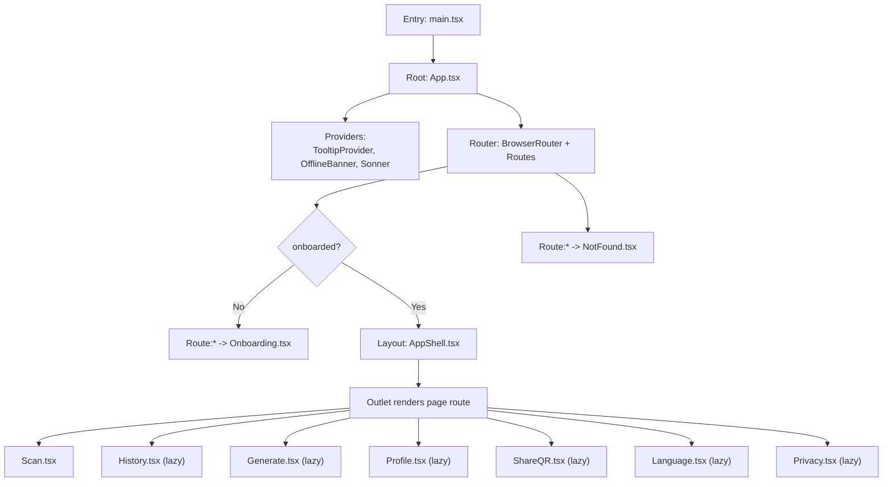
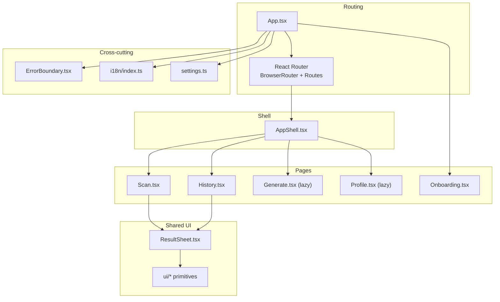
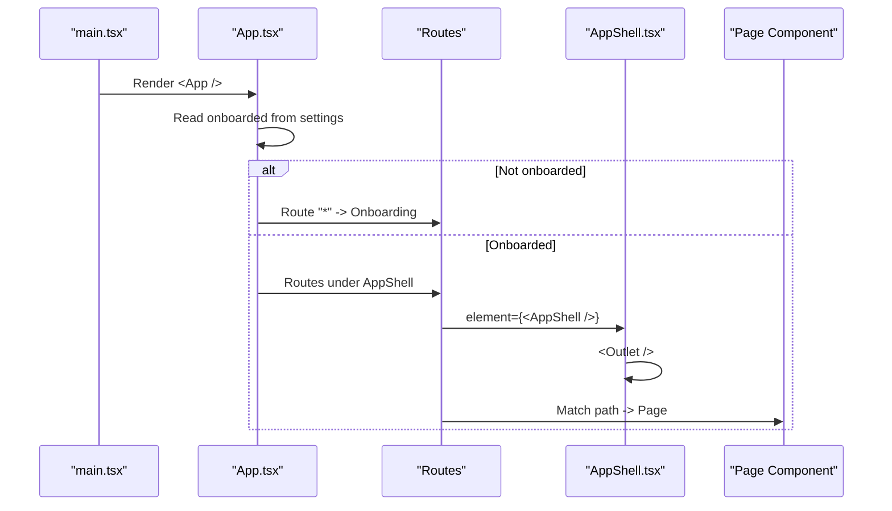
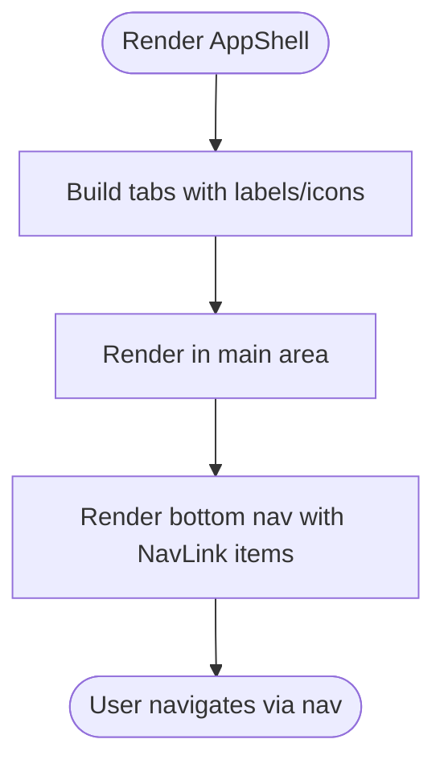
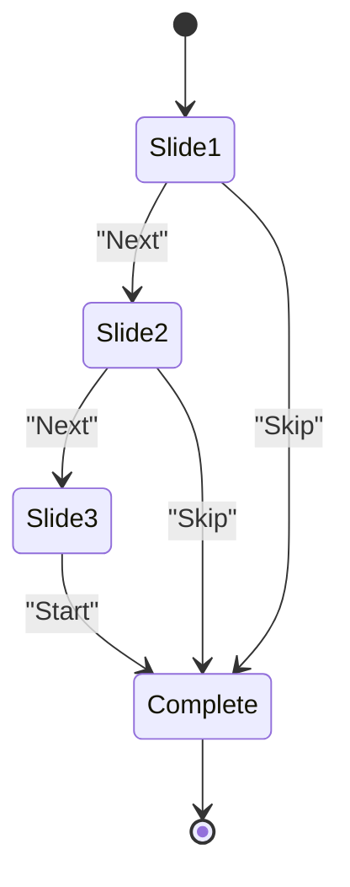
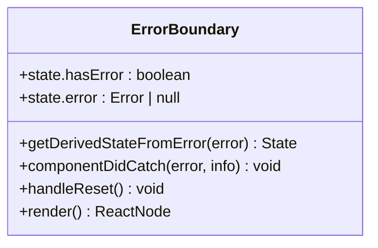
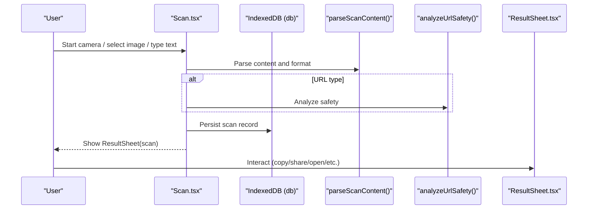
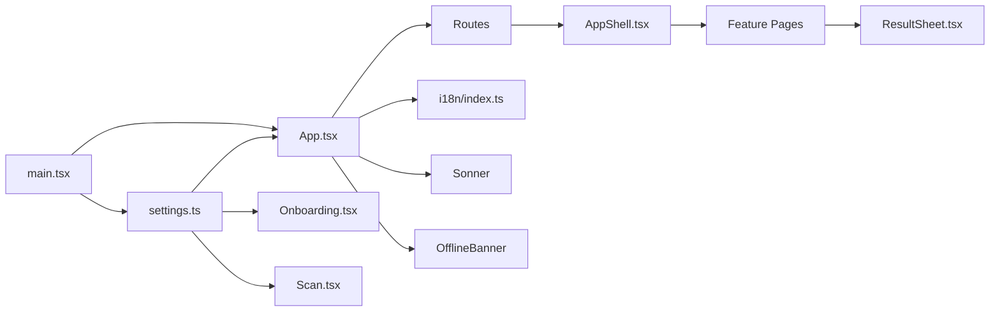
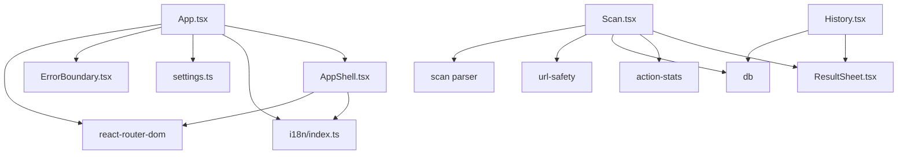

# Component Hierarchy and Layout

<cite>
**Referenced Files in This Document**
- [main.tsx](file://src/main.tsx)
- [App.tsx](file://src/App.tsx)
- [AppShell.tsx](file://src/components/AppShell.tsx)
- [ErrorBoundary.tsx](file://src/components/ErrorBoundary.tsx)
- [Scan.tsx](file://src/pages/Scan.tsx)
- [History.tsx](file://src/pages/History.tsx)
- [Onboarding.tsx](file://src/pages/Onboarding.tsx)
- [ResultSheet.tsx](file://src/components/ResultSheet.tsx)
- [settings.ts](file://src/lib/settings.ts)
- [i18n/index.ts](file://src/lib/i18n/index.ts)
</cite>

## Table of Contents
1. [Introduction](#introduction)
2. [Project Structure](#project-structure)
3. [Core Components](#core-components)
4. [Architecture Overview](#architecture-overview)
5. [Detailed Component Analysis](#detailed-component-analysis)
6. [Dependency Analysis](#dependency-analysis)
7. [Performance Considerations](#performance-considerations)
8. [Troubleshooting Guide](#troubleshooting-guide)
9. [Conclusion](#conclusion)

## Introduction
This document explains Smart Scan Pro’s component hierarchy and layout architecture with a focus on:
- Root App structure and React Router configuration
- Lazy loading for performance optimization
- AppShell as the main layout wrapper providing consistent navigation and UI structure
- Page-based organization for major features (Scan, History, Generate, Profile)
- Onboarding flow and error boundary implementation
- How components are composed and how state flows through the tree
- Separation between presentation components and business logic components

## Project Structure
At runtime, the application bootstraps from the entry point, initializes global providers, and renders the root App component. The App configures routing, wraps the app in an error boundary, and conditionally shows either the onboarding flow or the main shell with feature routes.

**Diagram sources**
- [main.tsx:1-24](file://src/main.tsx#L1-L24)
- [App.tsx:1-100](file://src/App.tsx#L1-L100)
- [AppShell.tsx:1-63](file://src/components/AppShell.tsx#L1-L63)
- [Scan.tsx:1-488](file://src/pages/Scan.tsx#L1-L488)
- [History.tsx:1-138](file://src/pages/History.tsx#L1-L138)
- [Onboarding.tsx:1-73](file://src/pages/Onboarding.tsx#L1-L73)

**Section sources**
- [main.tsx:1-24](file://src/main.tsx#L1-L24)
- [App.tsx:1-100](file://src/App.tsx#L1-L100)

## Core Components
- Root App: Configures routing, lazy-loading, and top-level providers; decides whether to show onboarding or main shell based on persisted settings.
- AppShell: Provides the persistent bottom navigation and renders the current page via Outlet.
- ErrorBoundary: Catches rendering errors and provides recovery actions.
- Pages: Feature screens such as Scan and History implement their own local state and compose shared UI primitives.
- Shared UI: ResultSheet is a reusable sheet that presents scan results and actions.

Key responsibilities:
- Routing and navigation orchestration live in App and AppShell.
- Business logic (camera scanning, parsing, safety checks, persistence) lives in pages and libraries.
- Presentation components (UI primitives, sheets, dialogs) remain focused on display and user interactions.

**Section sources**
- [App.tsx:1-100](file://src/App.tsx#L1-L100)
- [AppShell.tsx:1-63](file://src/components/AppShell.tsx#L1-L63)
- [ErrorBoundary.tsx:1-71](file://src/components/ErrorBoundary.tsx#L1-L71)
- [ResultSheet.tsx:1-414](file://src/components/ResultSheet.tsx#L1-L414)

## Architecture Overview
The application follows a clear separation:
- Shell layer: AppShell manages layout and navigation chrome.
- Route layer: App defines routes and lazy-loaded page modules.
- Feature layer: Each page owns its domain logic and composes UI primitives.
- Cross-cutting concerns: i18n, theme, toast notifications, offline banner, and error boundaries wrap the app.

**Diagram sources**
- [App.tsx:1-100](file://src/App.tsx#L1-L100)
- [AppShell.tsx:1-63](file://src/components/AppShell.tsx#L1-L63)
- [Scan.tsx:1-488](file://src/pages/Scan.tsx#L1-L488)
- [History.tsx:1-138](file://src/pages/History.tsx#L1-L138)
- [ResultSheet.tsx:1-414](file://src/components/ResultSheet.tsx#L1-L414)
- [i18n/index.ts:1-96](file://src/lib/i18n/index.ts#L1-L96)
- [settings.ts:1-35](file://src/lib/settings.ts#L1-L35)

## Detailed Component Analysis

### Root App and Routing
- Wraps the entire app in ErrorBoundary and TooltipProvider.
- Renders OfflineBanner and Sonner toasts globally.
- Uses BrowserRouter and conditional Routes:
  - If not onboarded, all routes redirect to Onboarding.
  - Otherwise, routes render inside AppShell.
- Lazy loads heavy pages (History, Generate, Profile, ShareQR, Language, Privacy) with Suspense fallbacks.

**Diagram sources**
- [App.tsx:1-100](file://src/App.tsx#L1-L100)
- [AppShell.tsx:1-63](file://src/components/AppShell.tsx#L1-L63)
- [Onboarding.tsx:1-73](file://src/pages/Onboarding.tsx#L1-L73)

**Section sources**
- [App.tsx:1-100](file://src/App.tsx#L1-L100)

### AppShell Layout and Navigation
- Provides a full-height flex container with a scrollable main area and a fixed bottom nav bar.
- Defines tab configuration mapping routes to labels and icons.
- Uses NavLink with active styling and icon scaling for visual feedback.
- Renders child routes via Outlet.

**Diagram sources**
- [AppShell.tsx:1-63](file://src/components/AppShell.tsx#L1-L63)

**Section sources**
- [AppShell.tsx:1-63](file://src/components/AppShell.tsx#L1-L63)

### Onboarding Flow
- Displays a multi-step slide deck with animated transitions.
- Persists completion via settings store to unlock main app.
- Skippable and continues until final step completes onboarding.

**Diagram sources**
- [Onboarding.tsx:1-73](file://src/pages/Onboarding.tsx#L1-L73)
- [settings.ts:1-35](file://src/lib/settings.ts#L1-L35)

**Section sources**
- [Onboarding.tsx:1-73](file://src/pages/Onboarding.tsx#L1-L73)
- [settings.ts:1-35](file://src/lib/settings.ts#L1-L35)

### Error Boundary Implementation
- Class component that catches rendering errors in its subtree.
- Logs error details and exposes a recoverable UI with retry and reload options.
- Supports custom fallback via props.

**Diagram sources**
- [ErrorBoundary.tsx:1-71](file://src/components/ErrorBoundary.tsx#L1-L71)

**Section sources**
- [ErrorBoundary.tsx:1-71](file://src/components/ErrorBoundary.tsx#L1-L71)

### Page-Based Organization: Scan and History
- ScanScreen orchestrates camera access, scanning lifecycle, zoom/torch controls, manual input, and result handling. It persists records and triggers auto-actions based on settings.
- HistoryScreen lists scans with search and favorites, and opens ResultSheet for details.

**Diagram sources**
- [Scan.tsx:1-488](file://src/pages/Scan.tsx#L1-L488)
- [ResultSheet.tsx:1-414](file://src/components/ResultSheet.tsx#L1-L414)

**Section sources**
- [Scan.tsx:1-488](file://src/pages/Scan.tsx#L1-L488)
- [History.tsx:1-138](file://src/pages/History.tsx#L1-L138)
- [ResultSheet.tsx:1-414](file://src/components/ResultSheet.tsx#L1-L414)

### State Flow Through the Component Tree
- Global settings (persisted) drive routing decisions and behavior toggles (e.g., auto-copy, auto-open).
- Theme is applied before first paint and reacts to settings changes.
- Toast notifications provide non-blocking feedback across the app.
- i18n is initialized early and used by components for localized strings.

**Diagram sources**
- [main.tsx:1-24](file://src/main.tsx#L1-L24)
- [settings.ts:1-35](file://src/lib/settings.ts#L1-L35)
- [App.tsx:1-100](file://src/App.tsx#L1-L100)
- [i18n/index.ts:1-96](file://src/lib/i18n/index.ts#L1-L96)

**Section sources**
- [main.tsx:1-24](file://src/main.tsx#L1-L24)
- [settings.ts:1-35](file://src/lib/settings.ts#L1-L35)
- [App.tsx:1-100](file://src/App.tsx#L1-L100)
- [i18n/index.ts:1-96](file://src/lib/i18n/index.ts#L1-L96)

### Separation of Presentation vs. Business Logic
- Presentation components:
  - AppShell, ResultSheet, and ui/* primitives focus on layout, styling, and user interaction without deep domain logic.
- Business logic components:
  - ScanScreen encapsulates camera lifecycle, scanning service integration, parsing, safety analysis, persistence, and auto-actions.
  - HistoryScreen handles list queries, filtering, and favorites management.
- Shared utilities and services:
  - Parsing, safety analysis, database, action stats, and scanner service are imported into feature pages rather than embedded in UI components.

Examples of composition:
- ScanScreen composes ResultSheet to present parsed results and actions.
- HistoryScreen composes ResultSheet to inspect past scans.
- AppShell composes NavLink and Outlet to render page-specific content within a consistent shell.

**Section sources**
- [Scan.tsx:1-488](file://src/pages/Scan.tsx#L1-L488)
- [History.tsx:1-138](file://src/pages/History.tsx#L1-L138)
- [ResultSheet.tsx:1-414](file://src/components/ResultSheet.tsx#L1-L414)
- [AppShell.tsx:1-63](file://src/components/AppShell.tsx#L1-L63)

## Dependency Analysis
- App depends on:
  - React Router for routing and lazy imports for code splitting.
  - ErrorBoundary for crash resilience.
  - TooltipProvider and Sonner for UX enhancements.
  - OfflineBanner for connectivity awareness.
  - settings for onboarding gating and behavior flags.
- AppShell depends on:
  - react-router-dom for navigation and outlet rendering.
  - i18n for label translation.
  - UI primitives for styling and accessibility.
- Pages depend on:
  - Libraries for parsing, safety, persistence, and analytics.
  - Shared UI components like ResultSheet.

**Diagram sources**
- [App.tsx:1-100](file://src/App.tsx#L1-L100)
- [AppShell.tsx:1-63](file://src/components/AppShell.tsx#L1-L63)
- [Scan.tsx:1-488](file://src/pages/Scan.tsx#L1-L488)
- [History.tsx:1-138](file://src/pages/History.tsx#L1-L138)
- [ResultSheet.tsx:1-414](file://src/components/ResultSheet.tsx#L1-L414)
- [settings.ts:1-35](file://src/lib/settings.ts#L1-L35)
- [i18n/index.ts:1-96](file://src/lib/i18n/index.ts#L1-L96)

**Section sources**
- [App.tsx:1-100](file://src/App.tsx#L1-L100)
- [AppShell.tsx:1-63](file://src/components/AppShell.tsx#L1-L63)
- [Scan.tsx:1-488](file://src/pages/Scan.tsx#L1-L488)
- [History.tsx:1-138](file://src/pages/History.tsx#L1-L138)
- [ResultSheet.tsx:1-414](file://src/components/ResultSheet.tsx#L1-L414)
- [settings.ts:1-35](file://src/lib/settings.ts#L1-L35)
- [i18n/index.ts:1-96](file://src/lib/i18n/index.ts#L1-L96)

## Performance Considerations
- Lazy loading: Heavy pages (History, Generate, Profile, ShareQR, Language, Privacy) are dynamically imported and wrapped with Suspense to reduce initial bundle size and improve Time to Interactive.
- Memoization: AppShell uses memo and useMemo to avoid unnecessary re-renders when translations change.
- Early theme application: The theme is applied before first paint to prevent flash of incorrect theme.
- Efficient updates: Stable refs and callbacks minimize re-renders in camera-heavy components.

[No sources needed since this section provides general guidance]

## Troubleshooting Guide
- Unhandled errors:
  - Global listeners log uncaught errors and promise rejections to aid debugging.
  - ErrorBoundary catches React rendering errors and offers retry/reload.
- Camera issues:
  - Permission denied states are detected and surfaced with actionable guidance.
  - Device availability and read errors are handled with specific overlays and retry options.
- Storage failures:
  - Persistence errors are caught and surfaced via toast notifications.

**Section sources**
- [main.tsx:1-24](file://src/main.tsx#L1-L24)
- [ErrorBoundary.tsx:1-71](file://src/components/ErrorBoundary.tsx#L1-L71)
- [Scan.tsx:1-488](file://src/pages/Scan.tsx#L1-L488)

## Conclusion
Smart Scan Pro’s architecture cleanly separates concerns:
- App orchestrates routing, providers, and onboarding gating.
- AppShell provides a consistent layout and navigation shell.
- Feature pages encapsulate domain logic while composing shared UI components.
- Global cross-cutting concerns (i18n, theme, toasts, offline banner, error boundaries) ensure robustness and consistency.
Lazy loading and careful memoization contribute to strong performance characteristics, while comprehensive error handling improves reliability and user experience.