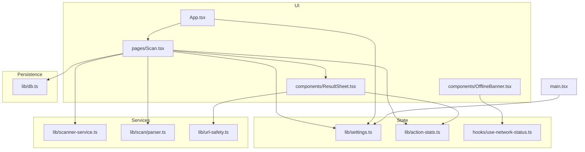
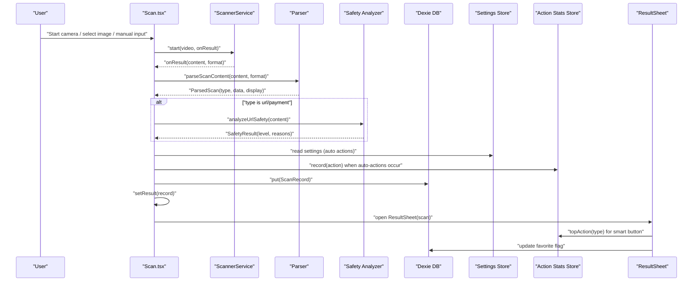
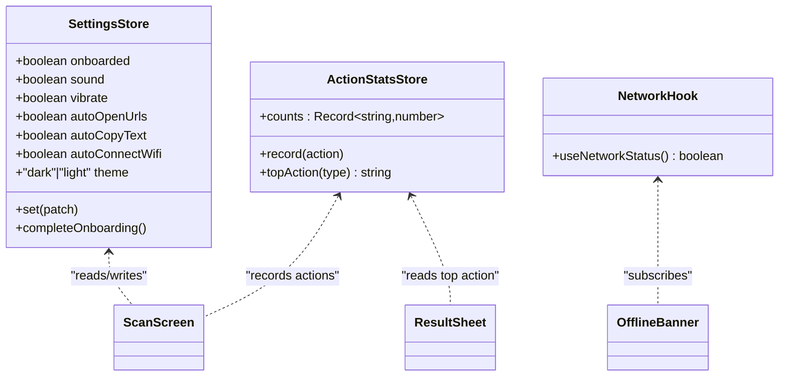
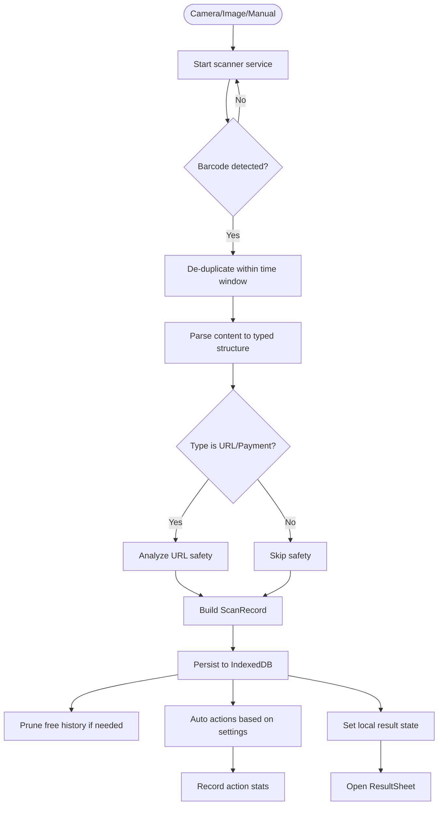
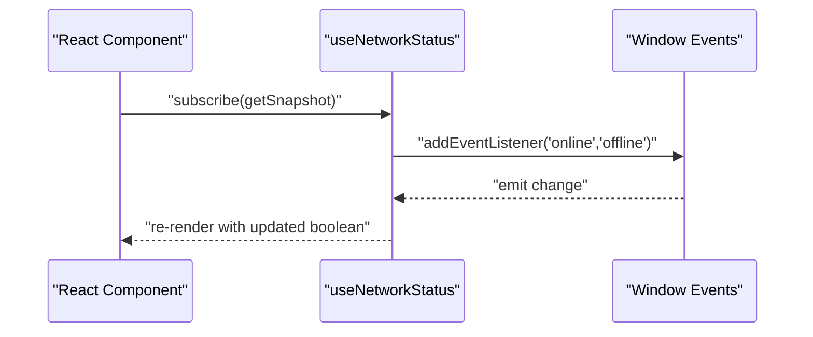
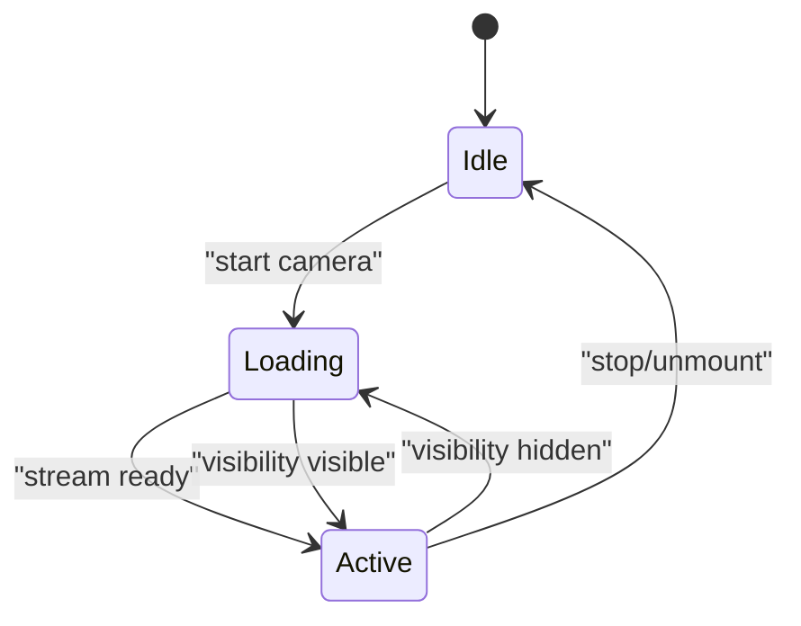
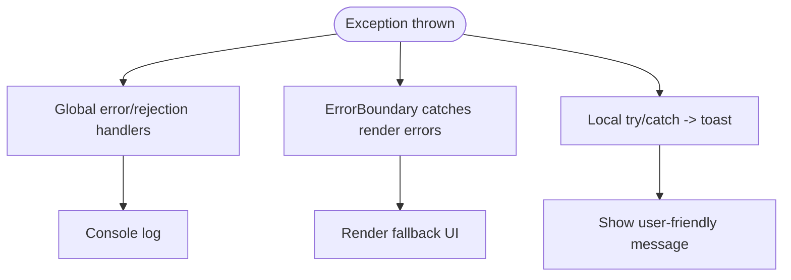
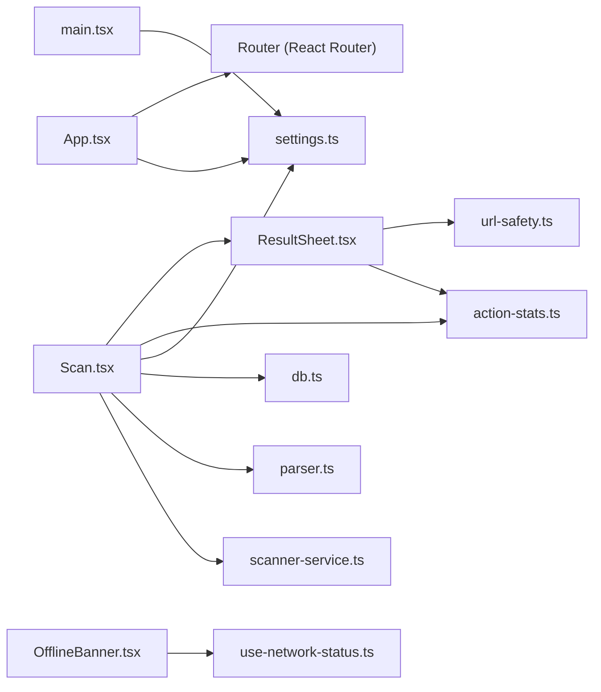

# Data Flow and State Management

<cite>
**Referenced Files in This Document**
- [App.tsx](file://src/App.tsx)
- [main.tsx](file://src/main.tsx)
- [Scan.tsx](file://src/pages/Scan.tsx)
- [ResultSheet.tsx](file://src/components/ResultSheet.tsx)
- [scanner-service.ts](file://src/lib/scanner-service.ts)
- [parser.ts](file://src/lib/scan/parser.ts)
- [types.ts](file://src/lib/scan/types.ts)
- [db.ts](file://src/lib/db.ts)
- [settings.ts](file://src/lib/settings.ts)
- [action-stats.ts](file://src/lib/action-stats.ts)
- [url-safety.ts](file://src/lib/url-safety.ts)
- [use-network-status.ts](file://src/hooks/use-network-status.ts)
- [OfflineBanner.tsx](file://src/components/OfflineBanner.tsx)
- [ErrorBoundary.tsx](file://src/components/ErrorBoundary.tsx)
- [feedback.ts](file://src/lib/feedback.ts)
</cite>

## Table of Contents
1. Introduction
2. Project Structure
3. Core Components
4. Architecture Overview
5. Detailed Component Analysis
6. Dependency Analysis
7. Performance Considerations
8. Troubleshooting Guide
9. Conclusion

## Introduction
This document explains Smart Scan Pro’s data flow patterns and state management architecture with a focus on:
- Reactive global state using Zustand stores for user settings, action statistics, and network status
- End-to-end data flow from camera input through parsing services to IndexedDB storage and UI updates
- Custom hooks for reusable logic (e.g., useNetworkStatus)
- Event-driven patterns for real-time updates and synchronization
- State persistence strategies, data validation flows, and error propagation mechanisms
- Performance considerations for large datasets and memory optimization

## Project Structure
The application is organized by feature and layer:
- Pages orchestrate high-level workflows (e.g., scanning)
- Services encapsulate device capabilities (camera scanning)
- Parsers transform raw content into typed structures
- Stores manage global reactive state (Zustand)
- Database layer persists scan records (IndexedDB via Dexie)
- Utilities provide safety analysis, feedback, and cross-cutting concerns
- UI components render results and system status

**Diagram sources**
- [App.tsx:1-100](file://src/App.tsx#L1-L100)
- [Scan.tsx:1-488](file://src/pages/Scan.tsx#L1-L488)
- [ResultSheet.tsx:1-414](file://src/components/ResultSheet.tsx#L1-L414)
- [scanner-service.ts:1-198](file://src/lib/scanner-service.ts#L1-L198)
- [parser.ts:1-102](file://src/lib/scan/parser.ts#L1-L102)
- [db.ts:1-37](file://src/lib/db.ts#L1-L37)
- [settings.ts:1-35](file://src/lib/settings.ts#L1-L35)
- [action-stats.ts:1-81](file://src/lib/action-stats.ts#L1-L81)
- [url-safety.ts:1-106](file://src/lib/url-safety.ts#L1-L106)
- [use-network-status.ts:1-23](file://src/hooks/use-network-status.ts#L1-L23)
- [OfflineBanner.tsx:1-18](file://src/components/OfflineBanner.tsx#L1-L18)
- [main.tsx:1-23](file://src/main.tsx#L1-L23)

**Section sources**
- [App.tsx:1-100](file://src/App.tsx#L1-L100)
- [main.tsx:1-23](file://src/main.tsx#L1-L23)

## Core Components
- Global state stores (Zustand):
  - User settings store with persistence
  - Action statistics store with persistence and learning-based primary action selection
- Network status hook using React’s external store subscription
- Scanner service abstraction over ZXing browser APIs
- Content parser that classifies scanned content into typed payloads
- URL safety analyzer for risk assessment
- IndexedDB database wrapper with history pruning utility
- Feedback utilities for sound and vibration based on settings

Key responsibilities:
- Settings: Persisted toggles for UX behavior (sound, vibrate, auto actions, theme)
- Action stats: Track user interactions and recommend top actions per content type
- Network status: Subscribe to online/offline events and reflect in UI
- Scanner service: Start/stop camera stream, handle torch and zoom, decode images
- Parser: Convert raw text/format into structured types (URL, WiFi, vCard, email, SMS, phone, geo, product, payment, text)
- Safety: Heuristic checks for malicious/suspicious URLs
- DB: Store scans, generated codes; prune free-tier history
- Feedback: Trigger haptic/audio feedback respecting settings

**Section sources**
- [settings.ts:1-35](file://src/lib/settings.ts#L1-L35)
- [action-stats.ts:1-81](file://src/lib/action-stats.ts#L1-L81)
- [use-network-status.ts:1-23](file://src/hooks/use-network-status.ts#L1-L23)
- [scanner-service.ts:1-198](file://src/lib/scanner-service.ts#L1-L198)
- [parser.ts:1-102](file://src/lib/scan/parser.ts#L1-L102)
- [url-safety.ts:1-106](file://src/lib/url-safety.ts#L1-L106)
- [db.ts:1-37](file://src/lib/db.ts#L1-L37)
- [feedback.ts:1-40](file://src/lib/feedback.ts#L1-L40)

## Architecture Overview
Smart Scan Pro follows a unidirectional data flow with event-driven updates:
- Camera or file input triggers the scanner service
- Results are parsed into typed structures
- Optional safety analysis runs for URLs/payments
- A new record is persisted to IndexedDB
- UI state updates reactively via local component state and Zustand stores
- The result sheet renders smart actions based on parsed type and learned preferences

**Diagram sources**
- [Scan.tsx:1-488](file://src/pages/Scan.tsx#L1-L488)
- [scanner-service.ts:1-198](file://src/lib/scanner-service.ts#L1-L198)
- [parser.ts:1-102](file://src/lib/scan/parser.ts#L1-L102)
- [url-safety.ts:1-106](file://src/lib/url-safety.ts#L1-L106)
- [db.ts:1-37](file://src/lib/db.ts#L1-L37)
- [settings.ts:1-35](file://src/lib/settings.ts#L1-L35)
- [action-stats.ts:1-81](file://src/lib/action-stats.ts#L1-L81)
- [ResultSheet.tsx:1-414](file://src/components/ResultSheet.tsx#L1-L414)

## Detailed Component Analysis

### Reactive State Management with Zustand
- Settings store:
  - Provides app-wide toggles and theme
  - Persists to localStorage under a dedicated key
  - Subscribed at app bootstrap to apply theme immediately and keep it in sync
- Action stats store:
  - Tracks counts per action string
  - Computes recommended primary action per content type with a threshold rule
  - Persists counts across sessions
- Network status hook:
  - Uses useSyncExternalStore to subscribe to window online/offline events
  - Returns a boolean snapshot for SSR-safe rendering

**Diagram sources**
- [settings.ts:1-35](file://src/lib/settings.ts#L1-L35)
- [action-stats.ts:1-81](file://src/lib/action-stats.ts#L1-L81)
- [use-network-status.ts:1-23](file://src/hooks/use-network-status.ts#L1-L23)
- [Scan.tsx:1-488](file://src/pages/Scan.tsx#L1-L488)
- [ResultSheet.tsx:1-414](file://src/components/ResultSheet.tsx#L1-L414)
- [OfflineBanner.tsx:1-18](file://src/components/OfflineBanner.tsx#L1-L18)
- [main.tsx:1-23](file://src/main.tsx#L1-L23)

**Section sources**
- [settings.ts:1-35](file://src/lib/settings.ts#L1-L35)
- [action-stats.ts:1-81](file://src/lib/action-stats.ts#L1-L81)
- [use-network-status.ts:1-23](file://src/hooks/use-network-status.ts#L1-L23)
- [main.tsx:1-23](file://src/main.tsx#L1-L23)

### Data Flow: Camera Input to Storage and UI
- Scanning pipeline:
  - Start camera with constraints and optional torch/zoom probing
  - Decode frames and emit results
  - De-duplicate rapid duplicates via timestamp gating
- Parsing and safety:
  - Classify content into typed structures
  - For URLs/payments, run heuristic safety analysis
- Persistence and automation:
  - Insert record into IndexedDB
  - Prune free-tier history if needed
  - Auto-copy/open based on settings
  - Record user actions for learning
- UI update:
  - Set local result state to open the result sheet
  - Render smart actions and safety warnings

**Diagram sources**
- [scanner-service.ts:1-198](file://src/lib/scanner-service.ts#L1-L198)
- [parser.ts:1-102](file://src/lib/scan/parser.ts#L1-L102)
- [url-safety.ts:1-106](file://src/lib/url-safety.ts#L1-L106)
- [db.ts:1-37](file://src/lib/db.ts#L1-L37)
- [settings.ts:1-35](file://src/lib/settings.ts#L1-L35)
- [action-stats.ts:1-81](file://src/lib/action-stats.ts#L1-L81)
- [Scan.tsx:1-488](file://src/pages/Scan.tsx#L1-L488)

**Section sources**
- [Scan.tsx:1-488](file://src/pages/Scan.tsx#L1-L488)
- [scanner-service.ts:1-198](file://src/lib/scanner-service.ts#L1-L198)
- [parser.ts:1-102](file://src/lib/scan/parser.ts#L1-L102)
- [url-safety.ts:1-106](file://src/lib/url-safety.ts#L1-L106)
- [db.ts:1-37](file://src/lib/db.ts#L1-L37)
- [settings.ts:1-35](file://src/lib/settings.ts#L1-L35)
- [action-stats.ts:1-81](file://src/lib/action-stats.ts#L1-L81)

### Custom Hooks Architecture
- useNetworkStatus:
  - Wraps navigator.onLine with event subscriptions
  - Provides SSR-safe server snapshot default
  - Used by OfflineBanner to show connectivity status

**Diagram sources**
- [use-network-status.ts:1-23](file://src/hooks/use-network-status.ts#L1-L23)
- [OfflineBanner.tsx:1-18](file://src/components/OfflineBanner.tsx#L1-L18)

**Section sources**
- [use-network-status.ts:1-23](file://src/hooks/use-network-status.ts#L1-L23)
- [OfflineBanner.tsx:1-18](file://src/components/OfflineBanner.tsx#L1-L18)

### Event-Driven Patterns and Real-Time Updates
- Scanner callbacks:
  - Service emits decoded results via callback, triggering parsing and persistence
- Visibility changes:
  - Pause/resume camera stream on tab visibility changes
- Online/offline events:
  - Drive banner visibility and potential future offline behaviors
- Settings changes:
  - Theme applied globally via subscription at startup

**Diagram sources**
- [Scan.tsx:1-488](file://src/pages/Scan.tsx#L1-L488)
- [use-network-status.ts:1-23](file://src/hooks/use-network-status.ts#L1-L23)
- [main.tsx:1-23](file://src/main.tsx#L1-L23)

**Section sources**
- [Scan.tsx:1-488](file://src/pages/Scan.tsx#L1-L488)
- [use-network-status.ts:1-23](file://src/hooks/use-network-status.ts#L1-L23)
- [main.tsx:1-23](file://src/main.tsx#L1-L23)

### State Persistence Strategies
- Settings persistence:
  - Zustand persist middleware writes to localStorage under a specific key
  - Applied before first paint to avoid flash of wrong theme
- Action stats persistence:
  - Counts stored and restored across sessions to learn preferred actions
- Database persistence:
  - IndexedDB tables for scans and generated codes
  - History pruning ensures free-tier limits while preserving favorites

**Section sources**
- [settings.ts:1-35](file://src/lib/settings.ts#L1-L35)
- [action-stats.ts:1-81](file://src/lib/action-stats.ts#L1-L81)
- [db.ts:1-37](file://src/lib/db.ts#L1-L37)
- [main.tsx:1-23](file://src/main.tsx#L1-L23)

### Data Validation Flows
- Format detection:
  - Barcode formats mapped to numeric-only product codes
  - Protocol-based classification for URLs, emails, tel, sms, geo
  - Specialized parsers for WiFi strings and vCards
- Safety validation:
  - Checks for dangerous protocols, IP hosts, punycode, deep subdomains, suspicious TLDs, shorteners, brand impersonation, HTTP, embedded credentials
  - Classifies into safe, suspicious, or malicious with reasons

**Section sources**
- [parser.ts:1-102](file://src/lib/scan/parser.ts#L1-L102)
- [url-safety.ts:1-106](file://src/lib/url-safety.ts#L1-L106)

### Error Propagation Mechanisms
- Global handlers:
  - Unhandled errors and promise rejections logged at bootstrap
- Component boundary:
  - ErrorBoundary catches render errors, shows recovery options
- Localized errors:
  - Toast notifications for clipboard failures, storage issues, unexpected errors
  - Camera permission/device availability states guide user remediation

**Diagram sources**
- [main.tsx:1-23](file://src/main.tsx#L1-L23)
- [ErrorBoundary.tsx:1-71](file://src/components/ErrorBoundary.tsx#L1-L71)
- [Scan.tsx:1-488](file://src/pages/Scan.tsx#L1-L488)
- [ResultSheet.tsx:1-414](file://src/components/ResultSheet.tsx#L1-L414)

**Section sources**
- [main.tsx:1-23](file://src/main.tsx#L1-L23)
- [ErrorBoundary.tsx:1-71](file://src/components/ErrorBoundary.tsx#L1-L71)
- [Scan.tsx:1-488](file://src/pages/Scan.tsx#L1-L488)
- [ResultSheet.tsx:1-414](file://src/components/ResultSheet.tsx#L1-L414)

## Dependency Analysis
High-level dependencies between modules:

**Diagram sources**
- [App.tsx:1-100](file://src/App.tsx#L1-L100)
- [Scan.tsx:1-488](file://src/pages/Scan.tsx#L1-L488)
- [ResultSheet.tsx:1-414](file://src/components/ResultSheet.tsx#L1-L414)
- [scanner-service.ts:1-198](file://src/lib/scanner-service.ts#L1-L198)
- [parser.ts:1-102](file://src/lib/scan/parser.ts#L1-L102)
- [db.ts:1-37](file://src/lib/db.ts#L1-L37)
- [settings.ts:1-35](file://src/lib/settings.ts#L1-L35)
- [action-stats.ts:1-81](file://src/lib/action-stats.ts#L1-L81)
- [url-safety.ts:1-106](file://src/lib/url-safety.ts#L1-L106)
- [use-network-status.ts:1-23](file://src/hooks/use-network-status.ts#L1-L23)
- [OfflineBanner.tsx:1-18](file://src/components/OfflineBanner.tsx#L1-L18)
- [main.tsx:1-23](file://src/main.tsx#L1-L23)

**Section sources**
- [App.tsx:1-100](file://src/App.tsx#L1-L100)
- [Scan.tsx:1-488](file://src/pages/Scan.tsx#L1-L488)
- [ResultSheet.tsx:1-414](file://src/components/ResultSheet.tsx#L1-L414)
- [scanner-service.ts:1-198](file://src/lib/scanner-service.ts#L1-L198)
- [parser.ts:1-102](file://src/lib/scan/parser.ts#L1-L102)
- [db.ts:1-37](file://src/lib/db.ts#L1-L37)
- [settings.ts:1-35](file://src/lib/settings.ts#L1-L35)
- [action-stats.ts:1-81](file://src/lib/action-stats.ts#L1-L81)
- [url-safety.ts:1-106](file://src/lib/url-safety.ts#L1-L106)
- [use-network-status.ts:1-23](file://src/hooks/use-network-status.ts#L1-L23)
- [OfflineBanner.tsx:1-18](file://src/components/OfflineBanner.tsx#L1-L18)
- [main.tsx:1-23](file://src/main.tsx#L1-L23)

## Performance Considerations
- Large dataset handling:
  - Use IndexedDB indexes defined for scans (id, scannedAt, type, format, favorite, content) to support efficient queries and sorting
  - Implement pagination or virtualization in list views (e.g., history) to limit DOM nodes
  - Apply debouncing/throttling for frequent operations like zoom slider updates
- Memory optimization:
  - Revoke object URLs after decoding images to prevent leaks
  - Stop camera tracks and release resources on unmount or visibility change
  - Avoid unnecessary re-renders by selecting only required slices from Zustand stores
- I/O efficiency:
  - Batch writes where possible (bulk delete used during pruning)
  - Keep auto-actions asynchronous and non-blocking to avoid jank
- Rendering performance:
  - Memoize derived values (e.g., safety analysis) to avoid recomputation
  - Lazy-load heavy pages to reduce initial bundle size

[No sources needed since this section provides general guidance]

## Troubleshooting Guide
Common issues and remedies:
- Camera denied or unavailable:
  - Check permissions API and device enumeration; present retry or settings navigation
  - Handle NotReadable/TrackStartError cases with helpful messages
- Clipboard failures:
  - Catch exceptions and notify users; fall back gracefully
- Storage failures:
  - Wrap IndexedDB operations in try/catch and inform users
- Unexpected runtime errors:
  - Global handlers log details; ErrorBoundary offers reset/reload

**Section sources**
- [Scan.tsx:1-488](file://src/pages/Scan.tsx#L1-L488)
- [ResultSheet.tsx:1-414](file://src/components/ResultSheet.tsx#L1-L414)
- [ErrorBoundary.tsx:1-71](file://src/components/ErrorBoundary.tsx#L1-L71)
- [main.tsx:1-23](file://src/main.tsx#L1-L23)

## Conclusion
Smart Scan Pro implements a clear, reactive architecture:
- Zustand stores centralize persistent global state
- A robust scanner-parsing pipeline transforms raw inputs into typed data
- IndexedDB ensures durable storage with pruning strategies
- Event-driven patterns power real-time UI updates and system responsiveness
- Comprehensive error handling and safety analysis improve reliability and security
- Performance-conscious design choices prepare the app for scale and smooth user experience

[No sources needed since this section summarizes without analyzing specific files]