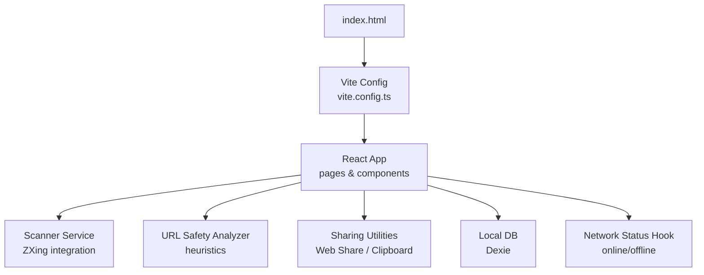
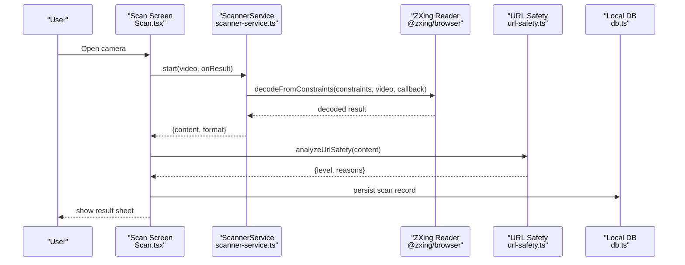
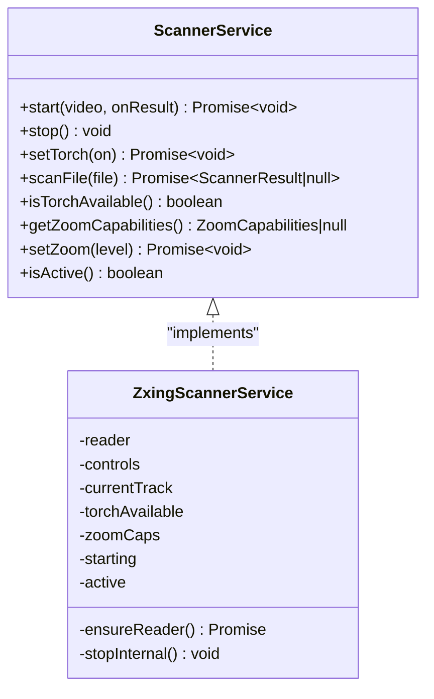
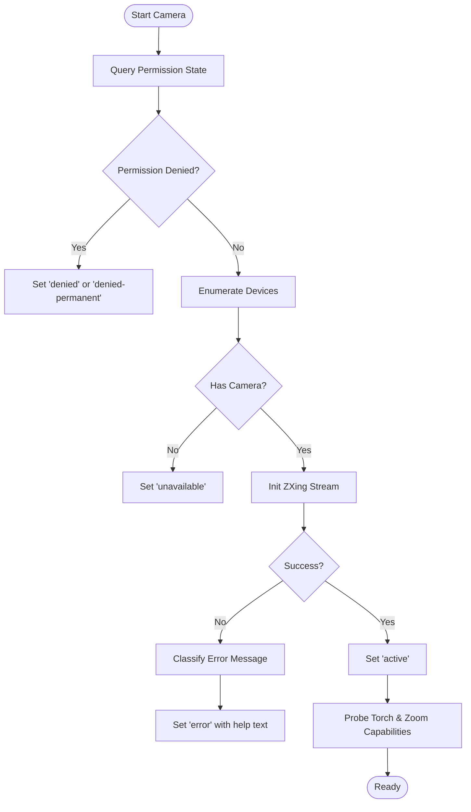
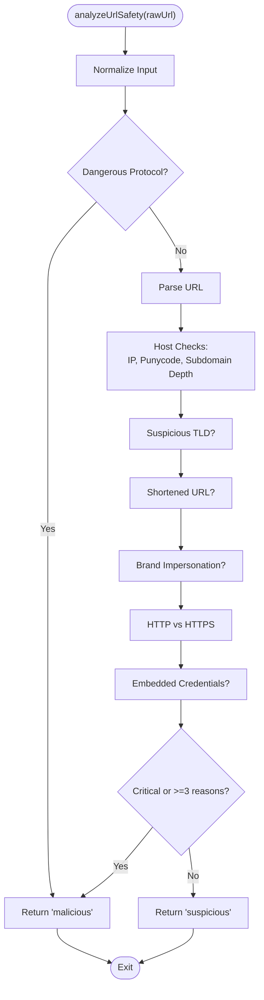
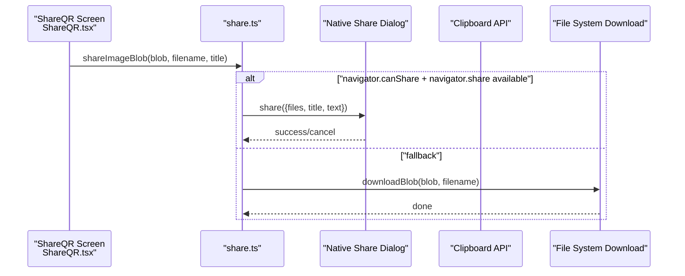
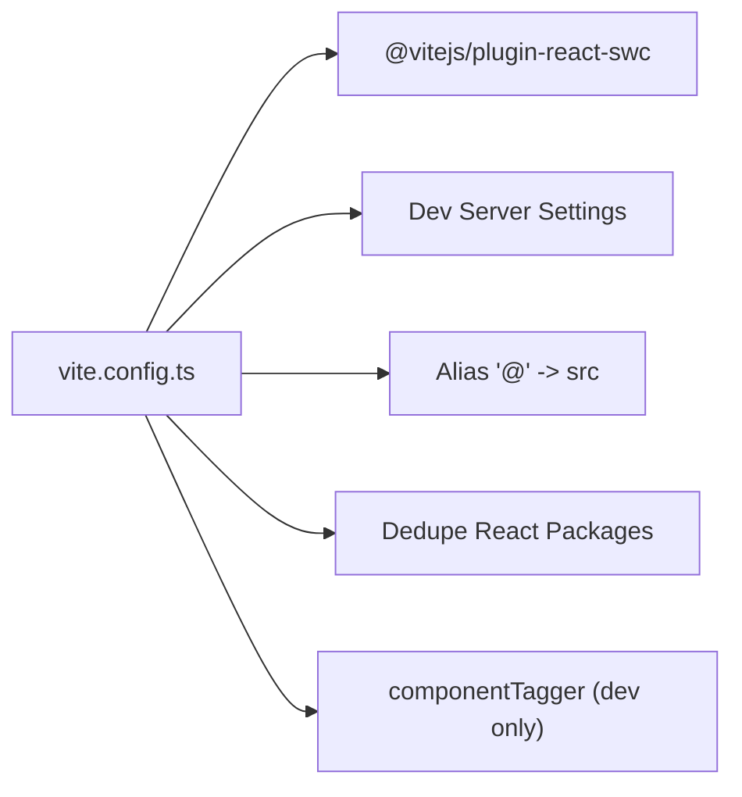
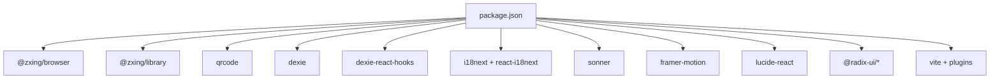
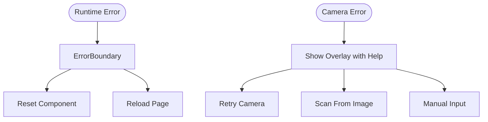

# External Integration and Dependencies

<cite>
**Referenced Files in This Document**
- [package.json](file://package.json)
- [vite.config.ts](file://vite.config.ts)
- [index.html](file://index.html)
- [src/lib/scanner-service.ts](file://src/lib/scanner-service.ts)
- [src/pages/Scan.tsx](file://src/pages/Scan.tsx)
- [src/lib/url-safety.ts](file://src/lib/url-safety.ts)
- [src/lib/share.ts](file://src/lib/share.ts)
- [src/pages/ShareQR.tsx](file://src/pages/ShareQR.tsx)
- [src/lib/app-meta.ts](file://src/lib/app-meta.ts)
- [src/lib/db.ts](file://src/lib/db.ts)
- [src/components/ErrorBoundary.tsx](file://src/components/ErrorBoundary.tsx)
- [src/hooks/use-network-status.ts](file://src/hooks/use-network-status.ts)
- [src/components/OfflineBanner.tsx](file://src/components/OfflineBanner.tsx)
</cite>

## Table of Contents
1. [Introduction](#introduction)
2. [Project Structure](#project-structure)
3. [Core Components](#core-components)
4. [Architecture Overview](#architecture-overview)
5. [Detailed Component Analysis](#detailed-component-analysis)
6. [Dependency Analysis](#dependency-analysis)
7. [Performance Considerations](#performance-considerations)
8. [Troubleshooting Guide](#troubleshooting-guide)
9. [Conclusion](#conclusion)

## Introduction
This document explains Smart Scan Pro’s external integration patterns and third-party dependencies with a focus on:
- ZXing-based barcode scanning, including camera API usage, permission handling, and fallbacks
- URL safety analysis using built-in threat detection heuristics
- Sharing capabilities via native device APIs for file sharing and clipboard operations
- Build tooling configuration with Vite for code splitting and performance optimization
- Browser compatibility considerations, polyfill requirements, and progressive web app (PWA) features
- Error handling strategies and graceful degradation for external service failures

## Project Structure
The application is a React + TypeScript project built with Vite. Key areas relevant to external integrations:
- Scanning pipeline: scanner service abstraction over ZXing, camera UI, and result processing
- Safety analysis: local heuristic-based URL risk assessment
- Sharing utilities: Web Share API, Clipboard API, and download helpers
- Build configuration: Vite setup with plugin and aliasing
- PWA-related HTML meta tags and offline status hooks

**Diagram sources**
- [index.html:1-25](file://index.html#L1-L25)
- [vite.config.ts:1-23](file://vite.config.ts#L1-L23)
- [src/pages/Scan.tsx:1-488](file://src/pages/Scan.tsx#L1-L488)
- [src/lib/scanner-service.ts:1-198](file://src/lib/scanner-service.ts#L1-L198)
- [src/lib/url-safety.ts:1-106](file://src/lib/url-safety.ts#L1-L106)
- [src/lib/share.ts:1-52](file://src/lib/share.ts#L1-L52)
- [src/lib/db.ts:1-37](file://src/lib/db.ts#L1-L37)
- [src/hooks/use-network-status.ts:1-22](file://src/hooks/use-network-status.ts#L1-L22)

**Section sources**
- [index.html:1-25](file://index.html#L1-L25)
- [vite.config.ts:1-23](file://vite.config.ts#L1-L23)
- [package.json:1-70](file://package.json#L1-L70)

## Core Components
- ScannerService: Abstraction around ZXing for live camera scanning and image file decoding; exposes torch and zoom controls.
- URL Safety Analyzer: Local heuristic engine that classifies URLs as safe, suspicious, or malicious based on protocol, host, TLD, shorteners, brand impersonation, and more.
- Sharing Utilities: Provide shareApp() and shareImageBlob() with fallbacks to clipboard and downloads when native APIs are unavailable.
- Build Configuration: Vite config sets up React SWC plugin, dev server, aliases, and dependency deduplication.

**Section sources**
- [src/lib/scanner-service.ts:1-198](file://src/lib/scanner-service.ts#L1-L198)
- [src/lib/url-safety.ts:1-106](file://src/lib/url-safety.ts#L1-L106)
- [src/lib/share.ts:1-52](file://src/lib/share.ts#L1-L52)
- [vite.config.ts:1-23](file://vite.config.ts#L1-L23)

## Architecture Overview
High-level flow from user action to external integrations:
- Camera scanning uses MediaDevices and ZXing reader; results feed into parsing and safety checks before storage and UI updates.
- Sharing flows prefer Web Share API; if unsupported or canceled, fall back to clipboard or download.
- Offline state is detected and surfaced via a banner.

**Diagram sources**
- [src/pages/Scan.tsx:104-180](file://src/pages/Scan.tsx#L104-L180)
- [src/lib/scanner-service.ts:80-131](file://src/lib/scanner-service.ts#L80-L131)
- [src/lib/url-safety.ts:31-105](file://src/lib/url-safety.ts#L31-L105)
- [src/lib/db.ts:1-37](file://src/lib/db.ts#L1-L37)

## Detailed Component Analysis

### ZXing Barcode Scanning Integration
Responsibilities:
- Lazy-load ZXing modules to reduce initial bundle size
- Start/stop camera stream with constraints targeting the rear camera
- Map ZXing formats to internal types
- Probe torch and zoom capabilities after stream initialization
- Support scanning from an uploaded image file

**Diagram sources**
- [src/lib/scanner-service.ts:14-23](file://src/lib/scanner-service.ts#L14-L23)
- [src/lib/scanner-service.ts:42-197](file://src/lib/scanner-service.ts#L42-L197)

Camera lifecycle and permissions:
- Pre-flight checks: query camera permission state and enumerate devices
- Start camera with environment-facing camera preference
- Handle errors by mapping messages to user-friendly states (denied, unavailable, error)
- On visibility change, stop and restart camera appropriately

**Diagram sources**
- [src/pages/Scan.tsx:104-180](file://src/pages/Scan.tsx#L104-L180)

Fallback mechanisms:
- If camera is blocked/unavailable, allow scanning from an image file or manual input
- Image scanning uses ZXing’s image decoder via object URL

**Section sources**
- [src/pages/Scan.tsx:104-180](file://src/pages/Scan.tsx#L104-L180)
- [src/pages/Scan.tsx:254-275](file://src/pages/Scan.tsx#L254-L275)
- [src/lib/scanner-service.ts:176-190](file://src/lib/scanner-service.ts#L176-L190)

### URL Safety Analysis Integration
Responsibilities:
- Detect dangerous protocols (javascript:, data:)
- Parse URL safely and evaluate host characteristics (IP address, punycode/homograph, deep subdomains)
- Flag suspicious TLDs, URL shorteners, brand impersonation, HTTP-only connections, embedded credentials
- Classify into safe, suspicious, or malicious based on rule severity and count

**Diagram sources**
- [src/lib/url-safety.ts:31-105](file://src/lib/url-safety.ts#L31-L105)

Integration points:
- Called during scan result processing to annotate safety level for URLs
- Auto-open behavior only triggers for safe URLs based on user settings

**Section sources**
- [src/pages/Scan.tsx:50-102](file://src/pages/Scan.tsx#L50-L102)
- [src/lib/url-safety.ts:31-105](file://src/lib/url-safety.ts#L31-L105)

### Sharing Capabilities Integration
Responsibilities:
- shareApp(): Prefer navigator.share; if canceled or unsupported, copy link to clipboard
- shareImageBlob(): Prefer sharing files via navigator.share with canShare check; otherwise download blob
- downloadBlob(): Create temporary object URL and trigger programmatic download

**Diagram sources**
- [src/pages/ShareQR.tsx:33-37](file://src/pages/ShareQR.tsx#L33-L37)
- [src/lib/share.ts:35-51](file://src/lib/share.ts#L35-L51)

Graceful degradation:
- AbortError indicates user cancellation; do not show error
- Clipboard write failure shows a toast with the URL for manual use
- Blob download ensures users can still obtain content

**Section sources**
- [src/lib/share.ts:5-22](file://src/lib/share.ts#L5-L22)
- [src/lib/share.ts:24-33](file://src/lib/share.ts#L24-L33)
- [src/lib/share.ts:35-51](file://src/lib/share.ts#L35-L51)
- [src/pages/ShareQR.tsx:27-37](file://src/pages/ShareQR.tsx#L27-L37)

### Build Tooling Configuration (Vite)
Key aspects:
- React SWC plugin for fast builds
- Development server configuration with host/port and HMR overlay control
- Path alias “@” pointing to src
- Dependency deduplication for React packages
- Optional componentTagger in development mode

**Diagram sources**
- [vite.config.ts:1-23](file://vite.config.ts#L1-L23)

Code splitting and lazy loading:
- ZXing modules are dynamically imported inside the scanner service to avoid bundling them upfront
- This reduces initial payload and improves Time to Interactive

**Section sources**
- [vite.config.ts:1-23](file://vite.config.ts#L1-L23)
- [src/lib/scanner-service.ts:51-74](file://src/lib/scanner-service.ts#L51-L74)

### Browser Compatibility and PWA Features
- index.html includes viewport and theme-color meta tags suitable for mobile experiences
- Network status hook listens to online/offline events and provides a reactive boolean
- OfflineBanner displays a warning when offline

Recommendations:
- For broader browser support, consider adding polyfills for Web Share, Clipboard, and MediaDevices where needed
- To enable full PWA behavior, add a manifest and service worker registration

**Section sources**
- [index.html:1-25](file://index.html#L1-L25)
- [src/hooks/use-network-status.ts:1-22](file://src/hooks/use-network-status.ts#L1-L22)
- [src/components/OfflineBanner.tsx:1-17](file://src/components/OfflineBanner.tsx#L1-L17)

## Dependency Analysis
External libraries used for core integrations:
- @zxing/browser and @zxing/library: Barcode scanning
- qrcode: QR code generation
- dexie and dexie-react-hooks: IndexedDB wrapper and React bindings
- i18next and react-i18next: Internationalization
- sonner: Toast notifications
- framer-motion, lucide-react, Radix UI: UI and animations
- vite and related tooling: Build and dev experience

**Diagram sources**
- [package.json:16-46](file://package.json#L16-L46)

Coupling and cohesion:
- ScannerService encapsulates ZXing details and exposes a clean interface to UI components
- URL safety logic is pure and testable, with no side effects
- Sharing utilities centralize platform feature checks and fallbacks

Potential circular dependencies:
- None observed among analyzed modules; imports are unidirectional from UI to services

External integration points:
- MediaDevices and Permissions API for camera access
- Web Share API and Clipboard API for sharing
- IndexedDB via Dexie for persistence

**Section sources**
- [package.json:16-46](file://package.json#L16-L46)
- [src/lib/scanner-service.ts:1-198](file://src/lib/scanner-service.ts#L1-L198)
- [src/lib/url-safety.ts:1-106](file://src/lib/url-safety.ts#L1-L106)
- [src/lib/share.ts:1-52](file://src/lib/share.ts#L1-L52)
- [src/lib/db.ts:1-37](file://src/lib/db.ts#L1-L37)

## Performance Considerations
- Dynamic imports for ZXing reduce initial bundle size and improve startup time
- Deduplicating React packages avoids multiple copies in the final bundle
- Debounced zoom updates via requestAnimationFrame prevent excessive constraint changes
- Pruning free history keeps IndexedDB size manageable

[No sources needed since this section provides general guidance]

## Troubleshooting Guide
Common issues and strategies:
- Camera denied or unavailable:
  - Use permission queries and device enumeration to detect states early
  - Present clear overlays with retry options and alternative inputs (image/manual)
- Unexpected errors:
  - Global ErrorBoundary catches render/runtime errors and offers reset/reload actions
- Storage failures:
  - Catch and notify users when saving scans fails
- Offline conditions:
  - Show banner and disable network-dependent features gracefully

**Diagram sources**
- [src/components/ErrorBoundary.tsx:16-70](file://src/components/ErrorBoundary.tsx#L16-L70)
- [src/pages/Scan.tsx:277-349](file://src/pages/Scan.tsx#L277-L349)

**Section sources**
- [src/components/ErrorBoundary.tsx:16-70](file://src/components/ErrorBoundary.tsx#L16-L70)
- [src/pages/Scan.tsx:158-179](file://src/pages/Scan.tsx#L158-L179)
- [src/pages/Scan.tsx:277-349](file://src/pages/Scan.tsx#L277-L349)

## Conclusion
Smart Scan Pro integrates external capabilities through well-encapsulated services:
- ZXing-based scanning with robust permission handling and fallbacks
- Heuristic-driven URL safety analysis without external calls
- Native sharing with graceful degradation to clipboard and downloads
- Vite-powered build configuration enabling efficient code splitting and fast iteration
These patterns ensure reliability across browsers and devices while maintaining a responsive user experience.