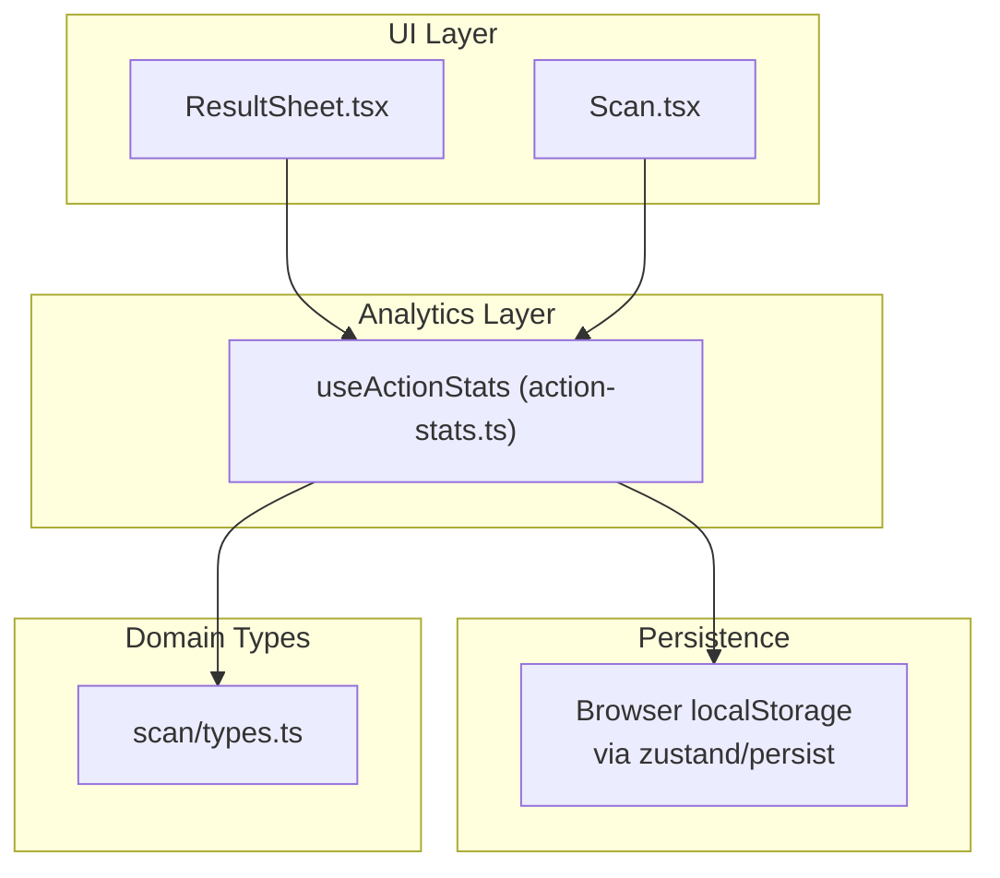
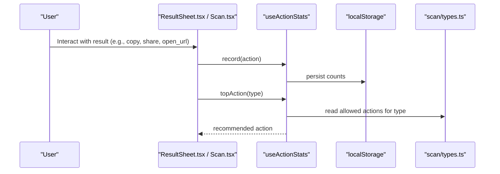
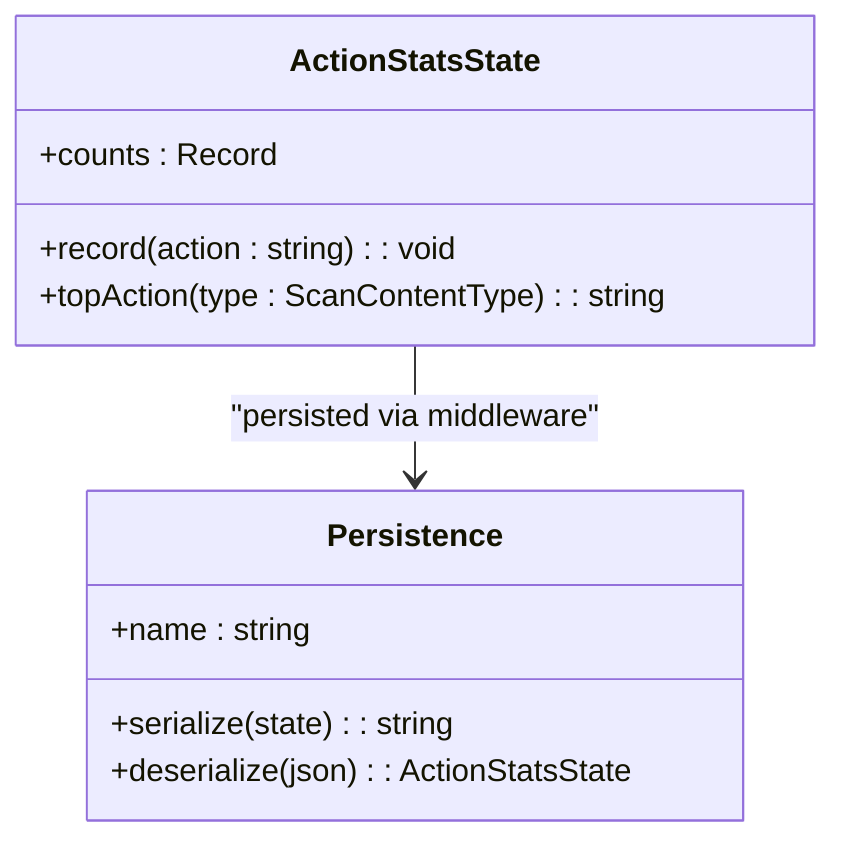
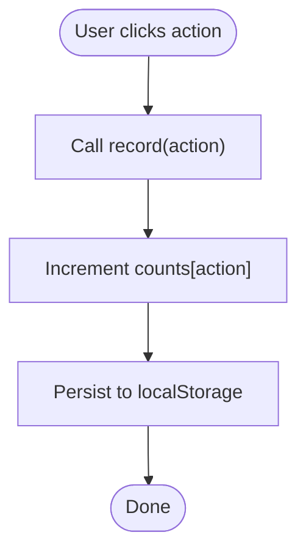
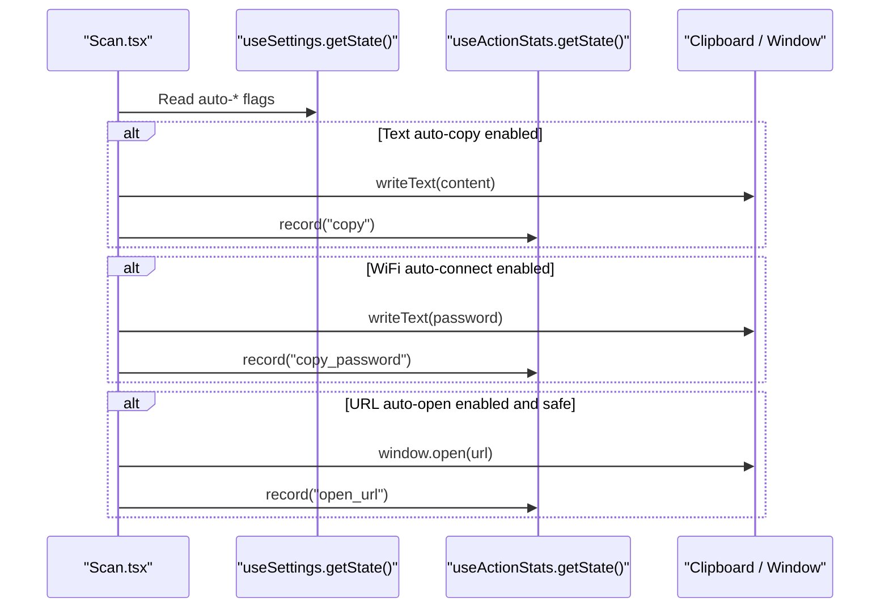
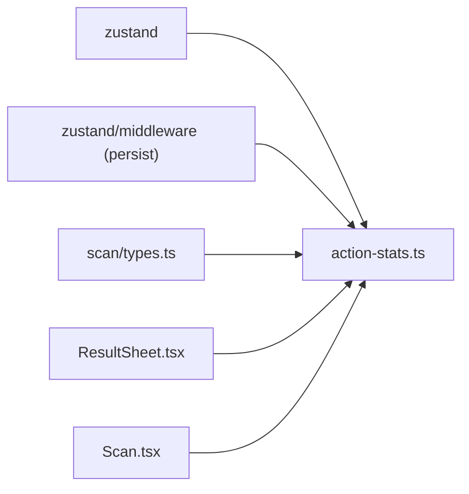

# Action Statistics Service

<cite>
**Referenced Files in This Document**
- [action-stats.ts](file://src/lib/action-stats.ts)
- [ResultSheet.tsx](file://src/components/ResultSheet.tsx)
- [Scan.tsx](file://src/pages/Scan.tsx)
- [types.ts](file://src/lib/scan/types.ts)
- [db.ts](file://src/lib/db.ts)
- [Privacy.tsx](file://src/pages/Privacy.tsx)
</cite>

## Table of Contents
1. [Introduction](#introduction)
2. [Project Structure](#project-structure)
3. [Core Components](#core-components)
4. [Architecture Overview](#architecture-overview)
5. [Detailed Component Analysis](#detailed-component-analysis)
6. [Dependency Analysis](#dependency-analysis)
7. [Performance Considerations](#performance-considerations)
8. [Troubleshooting Guide](#troubleshooting-guide)
9. [Conclusion](#conclusion)
10. [Appendices](#appendices)

## Introduction
This document describes the action statistics tracking service used for analytics and usage monitoring within the application. It focuses on how user interactions are tracked, how feature usage patterns are learned to personalize primary actions, and how performance-related metrics can be collected locally. The system is designed to be privacy-preserving by keeping all analytics data local to the device with no outbound telemetry. It also covers data aggregation algorithms, local storage strategies, reporting mechanisms, trend analysis approaches, dashboard data preparation, examples of custom event tracking, integration points for external analytics platforms, retention policies, anonymization techniques, GDPR considerations, and performance impact mitigation.

## Project Structure
The action statistics service is implemented as a lightweight Zustand store with persistence. It is consumed by UI components that record user actions and compute recommended primary actions based on historical usage.

**Diagram sources**
- [action-stats.ts:45-80](file://src/lib/action-stats.ts#L45-L80)
- [ResultSheet.tsx:114-131](file://src/components/ResultSheet.tsx#L114-L131)
- [Scan.tsx:75-97](file://src/pages/Scan.tsx#L75-L97)
- [types.ts:16-26](file://src/lib/scan/types.ts#L16-L26)

**Section sources**
- [action-stats.ts:1-80](file://src/lib/action-stats.ts#L1-L80)
- [ResultSheet.tsx:111-131](file://src/components/ResultSheet.tsx#L111-L131)
- [Scan.tsx:75-97](file://src/pages/Scan.tsx#L75-L97)
- [types.ts:16-26](file://src/lib/scan/types.ts#L16-L26)

## Core Components
- Action stats store: Provides an in-memory state with persistent storage for action counts and exposes methods to record actions and compute the top action per content type.
- Integration points: UI components call into the store to record actions and to determine the recommended primary action.
- Data types: Content type definitions drive which actions are considered relevant for ranking.

Key responsibilities:
- Record: Increment counters for specific actions.
- Top action recommendation: Compute the most-used action per content type with a threshold-based override logic.
- Persistence: Persist counts across sessions using browser storage.

**Section sources**
- [action-stats.ts:37-80](file://src/lib/action-stats.ts#L37-L80)
- [types.ts:16-26](file://src/lib/scan/types.ts#L16-L26)

## Architecture Overview
The architecture centers around a small, focused store that tracks action frequencies and recommends primary actions. It integrates with UI components at interaction boundaries and persists data locally.

**Diagram sources**
- [ResultSheet.tsx:114-131](file://src/components/ResultSheet.tsx#L114-L131)
- [Scan.tsx:75-97](file://src/pages/Scan.tsx#L75-L97)
- [action-stats.ts:45-80](file://src/lib/action-stats.ts#L45-L80)
- [types.ts:16-26](file://src/lib/scan/types.ts#L16-L26)

## Detailed Component Analysis

### Action Stats Store (useActionStats)
Responsibilities:
- Maintain a map of action names to counts.
- Provide a method to increment counts when users perform actions.
- Compute the best action for a given content type using a simple frequency-based algorithm with a minimum threshold to override defaults.

Data model:
- counts: A dictionary mapping action identifiers to their occurrence counts.
- record(action): Increments the count for the specified action.
- topAction(type): Returns the recommended primary action for the provided content type.

Algorithm highlights:
- Default primary actions are defined per content type.
- Allowed actions per content type define the candidate set for ranking.
- An alternative action overrides the default only if it has been used at least three more times than the default’s current count.

Complexity:
- record: O(1) update to a dictionary entry.
- topAction: O(k) where k is the number of candidate actions for the content type (small constant).

Persistence:
- Uses a middleware to serialize and persist the entire counts object to browser storage under a dedicated key.

Privacy:
- All data remains on-device; no network calls or remote transmission are performed by this component.

**Diagram sources**
- [action-stats.ts:37-80](file://src/lib/action-stats.ts#L37-L80)

**Section sources**
- [action-stats.ts:10-35](file://src/lib/action-stats.ts#L10-L35)
- [action-stats.ts:37-80](file://src/lib/action-stats.ts#L37-L80)

### ResultSheet Integration
Integration points:
- Records actions such as copy, share, open_url, translate, open_payment, save_contact, send_email, send_sms, call, open_maps, and copy_password.
- Computes the primary action using topAction(parsed.type) to highlight the most likely desired operation.

Behavioral notes:
- Actions are recorded immediately upon user-triggered operations.
- Safety checks may gate certain actions (e.g., opening URLs), but recording still occurs when the action proceeds.

**Diagram sources**
- [ResultSheet.tsx:114-131](file://src/components/ResultSheet.tsx#L114-L131)
- [ResultSheet.tsx:132-187](file://src/components/ResultSheet.tsx#L132-L187)
- [action-stats.ts:45-80](file://src/lib/action-stats.ts#L45-L80)

**Section sources**
- [ResultSheet.tsx:114-131](file://src/components/ResultSheet.tsx#L114-L131)
- [ResultSheet.tsx:132-187](file://src/components/ResultSheet.tsx#L132-L187)

### Scan Screen Integration
Integration points:
- Auto-actions triggered by settings (auto-copy text, auto-connect WiFi by copying password, auto-open safe URLs) record corresponding actions.
- Ensures that automated flows contribute to the learning model consistently with manual flows.

**Diagram sources**
- [Scan.tsx:75-97](file://src/pages/Scan.tsx#L75-L97)
- [action-stats.ts:45-80](file://src/lib/action-stats.ts#L45-L80)

**Section sources**
- [Scan.tsx:75-97](file://src/pages/Scan.tsx#L75-L97)

### Data Types and Context
Content types inform which actions are valid candidates for ranking and what default behavior should be applied.

Examples:
- url -> ["open_url", "copy", "share"]
- wifi -> ["copy_password", "copy", "share"]
- text -> ["copy", "translate", "share"]

These mappings ensure that recommendations remain relevant to the scanned content.

**Section sources**
- [types.ts:16-26](file://src/lib/scan/types.ts#L16-L26)
- [action-stats.ts:10-35](file://src/lib/action-stats.ts#L10-L35)

## Dependency Analysis
The action statistics module depends on:
- Zustand for state management.
- Zustand persist middleware for local storage.
- Scan content type definitions for domain context.

Consumers:
- ResultSheet uses the store to record actions and compute the primary action.
- Scan screen uses the store to record auto-action outcomes.

**Diagram sources**
- [action-stats.ts:1-3](file://src/lib/action-stats.ts#L1-L3)
- [ResultSheet.tsx:27-28](file://src/components/ResultSheet.tsx#L27-L28)
- [Scan.tsx:9-10](file://src/pages/Scan.tsx#L9-L10)

**Section sources**
- [action-stats.ts:1-3](file://src/lib/action-stats.ts#L1-L3)
- [ResultSheet.tsx:27-28](file://src/components/ResultSheet.tsx#L27-L28)
- [Scan.tsx:9-10](file://src/pages/Scan.tsx#L9-L10)

## Performance Considerations
- Local-only storage: No network overhead; minimal I/O due to small payload size.
- Efficient updates: Dictionary-based counting ensures O(1) increments.
- Lightweight computation: topAction iterates over a small fixed list of candidate actions per content type.
- Debouncing/batching opportunities: If needed, future enhancements could batch multiple rapid events before persisting to reduce disk writes.

[No sources needed since this section provides general guidance]

## Troubleshooting Guide
Common issues and resolutions:
- Counts not updating: Ensure record is called from every code path that performs an action, including auto-actions.
- Recommendations not changing: Verify that the alternative action has been used at least three more times than the default for the same content type.
- Persistence failures: Check browser storage availability and quotas; clear site data to reset corrupted state if necessary.
- Privacy expectations: Confirm that no external analytics SDKs are integrated; the current implementation is fully local.

**Section sources**
- [action-stats.ts:45-80](file://src/lib/action-stats.ts#L45-L80)
- [Privacy.tsx:9-14](file://src/pages/Privacy.tsx#L9-L14)

## Conclusion
The action statistics service provides a compact, privacy-first mechanism to learn user preferences and personalize primary actions. It records interactions locally, computes recommendations using a straightforward frequency-based algorithm with a safety threshold, and persists state across sessions. The design is intentionally minimal to avoid performance overhead and maintain strong privacy guarantees.

[No sources needed since this section summarizes without analyzing specific files]

## Appendices

### Examples

- Tracking custom events:
  - Add a new action identifier and call record("your_action") wherever the action occurs.
  - If the action is relevant to specific content types, include it in the candidate list for those types so it can influence recommendations.

- Generating usage reports:
  - Access the counts map from the store and aggregate by content type or action name to produce summaries.
  - Export or visualize the aggregated data locally for debugging or insights.

- Integrating with external analytics platforms:
  - Wrap record calls with optional telemetry hooks that forward anonymized, aggregated metrics to your backend if desired.
  - Ensure compliance with consent and privacy requirements before enabling any outbound transmission.

- Data retention policies:
  - Implement periodic pruning of counts or rolling windows to cap storage growth.
  - Provide a user-facing option to reset or export stored statistics.

- Anonymization techniques:
  - Avoid storing personally identifiable information in action payloads.
  - Aggregate metrics before any potential export and strip contextual details.

- GDPR compliance considerations:
  - Keep data local by default and provide clear controls for clearing or exporting data.
  - Offer transparent notices about what is tracked and why, and allow users to opt out of any optional telemetry.

- Dashboard data preparation:
  - Build views that summarize action frequencies by content type and time windows.
  - Surface trends such as rising adoption of secondary actions or declining use of defaults.

[No sources needed since this section provides general guidance]