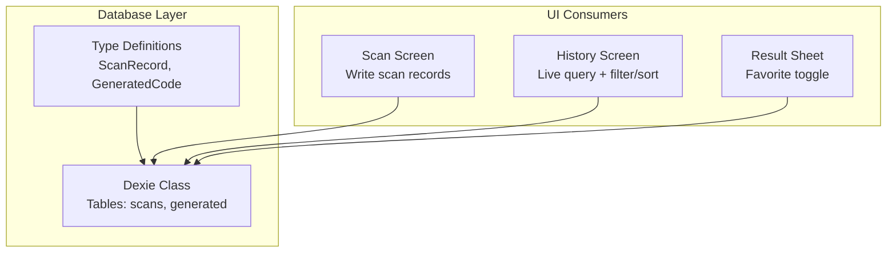
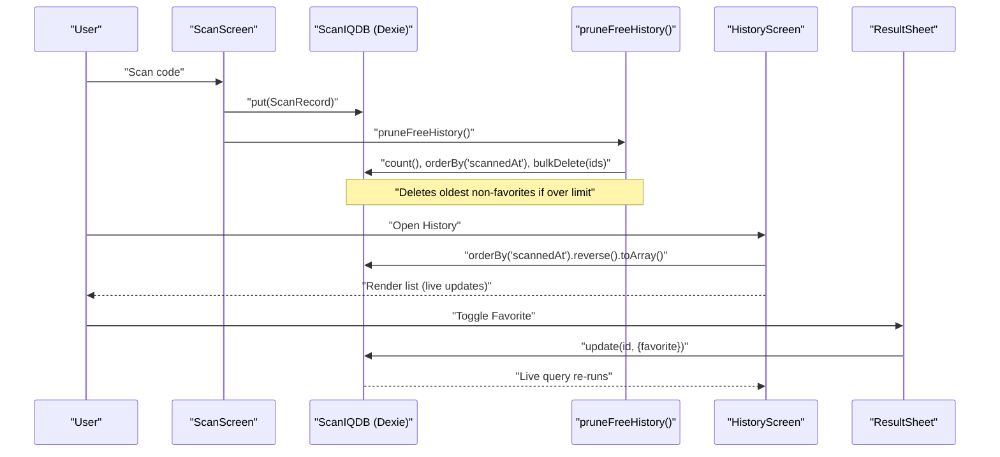
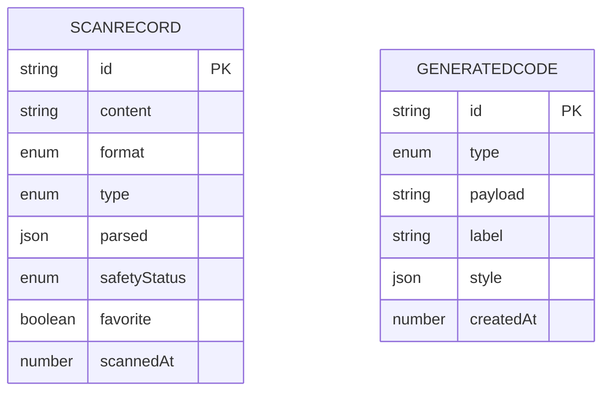
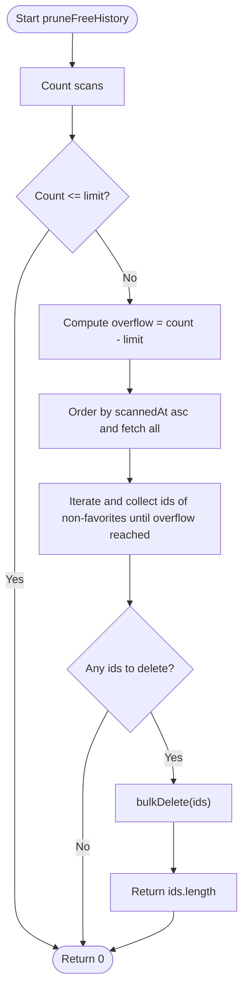
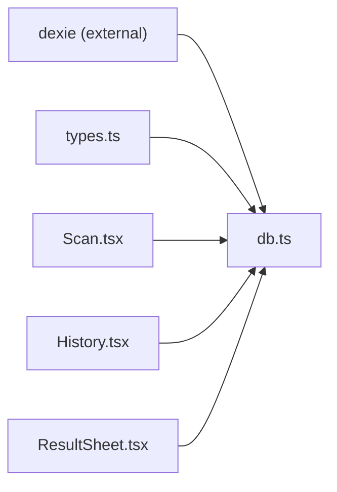

# Database Service

<cite>
**Referenced Files in This Document**
- [db.ts](file://src/lib/db.ts)
- [types.ts](file://src/lib/scan/types.ts)
- [History.tsx](file://src/pages/History.tsx)
- [ResultSheet.tsx](file://src/components/ResultSheet.tsx)
- [Scan.tsx](file://src/pages/Scan.tsx)
</cite>

## Table of Contents
1. [Introduction](#introduction)
2. [Project Structure](#project-structure)
3. [Core Components](#core-components)
4. [Architecture Overview](#architecture-overview)
5. [Detailed Component Analysis](#detailed-component-analysis)
6. [Dependency Analysis](#dependency-analysis)
7. [Performance Considerations](#performance-considerations)
8. [Troubleshooting Guide](#troubleshooting-guide)
9. [Conclusion](#conclusion)
10. [Appendices](#appendices)

## Introduction
This document describes the database service layer built on Dexie ORM for IndexedDB. It covers schema design, data access patterns, query optimization, transaction management, automatic history pruning for free tier limits, favorite marking, search functionality, CRUD examples, complex queries, migration strategy, performance and indexing considerations, backup/restore procedures, entity relationships, and referential integrity constraints.

## Project Structure
The database service is implemented as a thin Dexie wrapper with two primary tables: scans and generated. The types are defined separately to ensure consistent schemas across the app. UI components consume the database via Dexie’s fluent API and live queries.

**Diagram sources**
- [db.ts:4-17](file://src/lib/db.ts#L4-L17)
- [types.ts:30-48](file://src/lib/scan/types.ts#L30-L48)
- [Scan.tsx:50-72](file://src/pages/Scan.tsx#L50-L72)
- [History.tsx:34-50](file://src/pages/History.tsx#L34-L50)
- [ResultSheet.tsx:155-160](file://src/components/ResultSheet.tsx#L155-L160)

**Section sources**
- [db.ts:4-17](file://src/lib/db.ts#L4-L17)
- [types.ts:30-48](file://src/lib/scan/types.ts#L30-L48)

## Core Components
- Dexie class and schema definition:
  - Database name: “scaniq”
  - Tables:
    - scans: indexed by id, scannedAt, type, format, favorite, content
    - generated: indexed by id, createdAt, type
- Free-tier history pruning utility:
  - Enforces a maximum number of stored scan records by deleting oldest non-favorite entries when over limit
- Type definitions:
  - ScanRecord: includes id, content, format, type, parsed, safetyStatus, favorite, scannedAt
  - GeneratedCode: includes id, type, payload, label, style, createdAt

Key responsibilities:
- Centralized schema and versioning
- Consistent record shapes via shared types
- Pruning logic to enforce storage limits

**Section sources**
- [db.ts:4-17](file://src/lib/db.ts#L4-L17)
- [db.ts:19-34](file://src/lib/db.ts#L19-L34)
- [types.ts:30-48](file://src/lib/scan/types.ts#L30-L48)

## Architecture Overview
The database layer is consumed by multiple screens:
- Scan screen writes new scan records and triggers pruning
- History screen reads all scans using live queries and supports filtering and sorting
- Result sheet toggles favorites and updates the corresponding record

**Diagram sources**
- [Scan.tsx:50-72](file://src/pages/Scan.tsx#L50-L72)
- [db.ts:21-34](file://src/lib/db.ts#L21-L34)
- [History.tsx:34-50](file://src/pages/History.tsx#L34-L50)
- [ResultSheet.tsx:155-160](file://src/components/ResultSheet.tsx#L155-L160)

## Detailed Component Analysis

### Schema Design and Data Model
- Database name: “scaniq”
- Tables and indexes:
  - scans: primary key id; secondary indexes on scannedAt, type, format, favorite, content
  - generated: primary key id; secondary indexes on createdAt, type
- Entities:
  - ScanRecord: unique identifier, raw content, barcode format, semantic type, optional parsed object, safety status, favorite flag, timestamp
  - GeneratedCode: unique identifier, semantic type, payload string, optional label/style, creation timestamp

**Diagram sources**
- [db.ts:10-13](file://src/lib/db.ts#L10-L13)
- [types.ts:30-48](file://src/lib/scan/types.ts#L30-L48)

**Section sources**
- [db.ts:10-13](file://src/lib/db.ts#L10-L13)
- [types.ts:30-48](file://src/lib/scan/types.ts#L30-L48)

### Data Access Patterns
- Write path:
  - Create a ScanRecord with a stable id and timestamps
  - Insert or update via put()
  - Trigger pruning after successful write
- Read path:
  - Use live queries to fetch ordered lists
  - Apply client-side filters for favorites and text search
- Update path:
  - Toggle favorite via update() with partial fields

Examples (paths only):
- Create and store a scan record: [Scan.tsx:50-72](file://src/pages/Scan.tsx#L50-L72)
- Live query for history list: [History.tsx:34-50](file://src/pages/History.tsx#L34-L50)
- Toggle favorite: [ResultSheet.tsx:155-160](file://src/components/ResultSheet.tsx#L155-L160)

**Section sources**
- [Scan.tsx:50-72](file://src/pages/Scan.tsx#L50-L72)
- [History.tsx:34-50](file://src/pages/History.tsx#L34-L50)
- [ResultSheet.tsx:155-160](file://src/components/ResultSheet.tsx#L155-L160)

### Query Optimization Strategies
- Index usage:
  - scans.scannedAt enables efficient ordering and range operations
  - scans.type, scans.format, scans.favorite enable filtered views
  - scans.content supports substring search at the application level
- Ordering and pagination:
  - Reverse order for newest-first listing
  - For large datasets, consider limiting results and implementing cursor-based pagination
- Client-side filtering:
  - Favorites tab filters in-memory after fetching
  - Text search uses case-insensitive substring matching on content

Recommendations:
- Prefer Dexie’s orderBy/filter chains where possible to leverage indexes
- Avoid full table scans by combining indexable filters before toArray()

**Section sources**
- [db.ts:10-13](file://src/lib/db.ts#L10-L13)
- [History.tsx:34-50](file://src/pages/History.tsx#L34-L50)

### Transaction Management
- Dexie wraps each operation in a transaction automatically
- Bulk operations:
  - pruneFreeHistory uses bulkDelete for efficient removal of multiple ids
- Best practices:
  - Group related writes into a single transaction when needed
  - Keep transactions short to reduce contention

Example paths:
- Bulk delete during pruning: [db.ts:21-34](file://src/lib/db.ts#L21-L34)

**Section sources**
- [db.ts:21-34](file://src/lib/db.ts#L21-L34)

### Automatic History Pruning Mechanism (Free Tier)
- Purpose:
  - Enforce a maximum number of stored scan records for free users
- Algorithm:
  - Count total scans
  - If over limit, compute overflow count
  - Order scans by scannedAt ascending
  - Collect ids of non-favorite records until overflow is satisfied
  - Delete collected ids in bulk
- Return value:
  - Number of deleted records

**Diagram sources**
- [db.ts:21-34](file://src/lib/db.ts#L21-L34)

**Section sources**
- [db.ts:21-34](file://src/lib/db.ts#L21-L34)

### Favorite Marking System
- State:
  - Each ScanRecord has a boolean favorite field
- UI integration:
  - Result sheet toggles favorite and persists the change
  - History screen shows a favorites-only view and highlights favorite items

Example paths:
- Toggle favorite: [ResultSheet.tsx:155-160](file://src/components/ResultSheet.tsx#L155-L160)
- Favorites tab filter: [History.tsx:34-50](file://src/pages/History.tsx#L34-L50)

**Section sources**
- [ResultSheet.tsx:155-160](file://src/components/ResultSheet.tsx#L155-L160)
- [History.tsx:34-50](file://src/pages/History.tsx#L34-L50)

### Search Functionality
- Implementation:
  - Case-insensitive substring search on content
  - Applied after retrieving the ordered list
- Performance note:
  - For very large histories, consider server-like pagination or advanced indexing strategies

Example path:
- Search filter: [History.tsx:34-50](file://src/pages/History.tsx#L34-L50)

**Section sources**
- [History.tsx:34-50](file://src/pages/History.tsx#L34-L50)

### CRUD Operations Examples (Paths Only)
- Create:
  - Insert a new scan record: [Scan.tsx:50-72](file://src/pages/Scan.tsx#L50-L72)
- Read:
  - Live query for all scans ordered by time: [History.tsx:34-50](file://src/pages/History.tsx#L34-L50)
- Update:
  - Toggle favorite: [ResultSheet.tsx:155-160](file://src/components/ResultSheet.tsx#L155-L160)
- Delete:
  - Remove a single scan: [History.tsx:34-50](file://src/pages/History.tsx#L34-L50)
  - Clear all scans: [History.tsx:34-50](file://src/pages/History.tsx#L34-L50)
  - Bulk delete during pruning: [db.ts:21-34](file://src/lib/db.ts#L21-L34)

**Section sources**
- [Scan.tsx:50-72](file://src/pages/Scan.tsx#L50-L72)
- [History.tsx:34-50](file://src/pages/History.tsx#L34-L50)
- [ResultSheet.tsx:155-160](file://src/components/ResultSheet.tsx#L155-L160)
- [db.ts:21-34](file://src/lib/db.ts#L21-L34)

### Complex Queries with Filtering and Sorting (Paths Only)
- Newest-first listing:
  - Order by scannedAt descending: [History.tsx:34-50](file://src/pages/History.tsx#L34-L50)
- Favorites-only view:
  - Filter by favorite flag: [History.tsx:34-50](file://src/pages/History.tsx#L34-L50)
- Text search:
  - Substring match on content: [History.tsx:34-50](file://src/pages/History.tsx#L34-L50)

**Section sources**
- [History.tsx:34-50](file://src/pages/History.tsx#L34-L50)

### Data Migration Strategy
- Current state:
  - Version 1 with initial stores for scans and generated
- Recommended approach:
  - Increment version and define migrations that:
    - Add new indexes
    - Transform existing records to new shapes
    - Backfill computed fields
- Example pattern:
  - Use Dexie’s version(n).stores(...) and .upgrade() hooks to evolve schema safely

Relevant reference:
- Initial schema setup: [db.ts:10-13](file://src/lib/db.ts#L10-L13)

**Section sources**
- [db.ts:10-13](file://src/lib/db.ts#L10-L13)

### Entity Relationships and Referential Integrity
- Relationship:
  - No explicit foreign keys between scans and generated
  - Both entities share a common semantic type field (type)
- Constraints:
  - Primary keys enforced by Dexie
  - Semantic consistency maintained by shared types
- Recommendation:
  - Maintain referential integrity at the application layer by ensuring type values remain consistent across entities

**Section sources**
- [types.ts:30-48](file://src/lib/scan/types.ts#L30-L48)
- [db.ts:10-13](file://src/lib/db.ts#L10-L13)

## Dependency Analysis
The database module depends on Dexie and shared types. UI modules depend on the database module for read/write operations.

**Diagram sources**
- [db.ts:1-3](file://src/lib/db.ts#L1-L3)
- [types.ts:30-48](file://src/lib/scan/types.ts#L30-L48)
- [Scan.tsx:50-72](file://src/pages/Scan.tsx#L50-L72)
- [History.tsx:34-50](file://src/pages/History.tsx#L34-L50)
- [ResultSheet.tsx:155-160](file://src/components/ResultSheet.tsx#L155-L160)

**Section sources**
- [db.ts:1-3](file://src/lib/db.ts#L1-L3)
- [types.ts:30-48](file://src/lib/scan/types.ts#L30-L48)

## Performance Considerations
- Indexing:
  - Ensure frequently queried fields are indexed (already configured for scannedAt, type, format, favorite, content)
- Query composition:
  - Combine indexable filters before materializing arrays
- Pagination:
  - Implement limit/take for large result sets
- Transactions:
  - Batch writes to minimize overhead
- Memory:
  - Avoid loading entire tables into memory; use cursors or chunked reads when necessary

[No sources needed since this section provides general guidance]

## Troubleshooting Guide
Common issues and resolutions:
- Storage failures:
  - Handle errors from put() and inform the user
  - Check quota and clear unnecessary data
- Camera-related flows:
  - Ensure scanning callbacks do not block UI threads
- Pruning behavior:
  - Verify favorite records are preserved during pruning
  - Confirm overflow calculation and deletion counts

Example paths:
- Error handling around scan persistence: [Scan.tsx:50-72](file://src/pages/Scan.tsx#L50-L72)
- Pruning implementation: [db.ts:21-34](file://src/lib/db.ts#L21-L34)

**Section sources**
- [Scan.tsx:50-72](file://src/pages/Scan.tsx#L50-L72)
- [db.ts:21-34](file://src/lib/db.ts#L21-L34)

## Conclusion
The database service layer leverages Dexie to provide a simple, typed, and efficient IndexedDB interface. With well-defined indexes, live queries, and a robust pruning mechanism, it supports core features like history browsing, favorites, and safe storage limits. Future enhancements can include advanced pagination, richer search, and structured migrations for schema evolution.

[No sources needed since this section summarizes without analyzing specific files]

## Appendices

### Backup and Restore Procedures
- Export:
  - Iterate scans and generated tables and serialize to JSON
- Import:
  - Validate incoming data against types
  - Begin a Dexie transaction and bulkPut records
- Notes:
  - Preserve primary keys and timestamps
  - Rebuild indexes implicitly handled by Dexie

[No sources needed since this section provides general guidance]