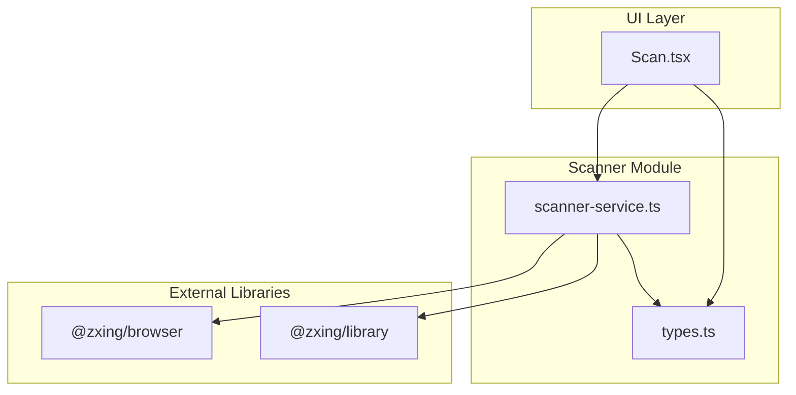
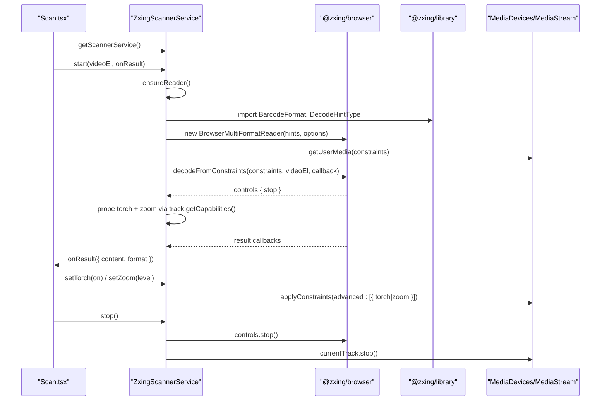
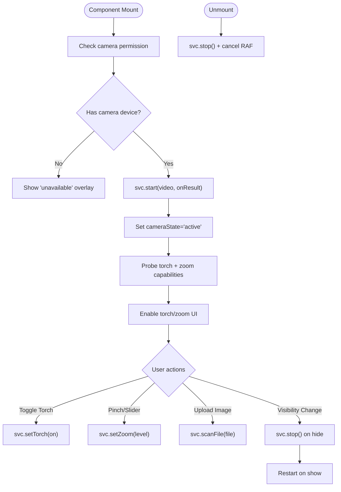
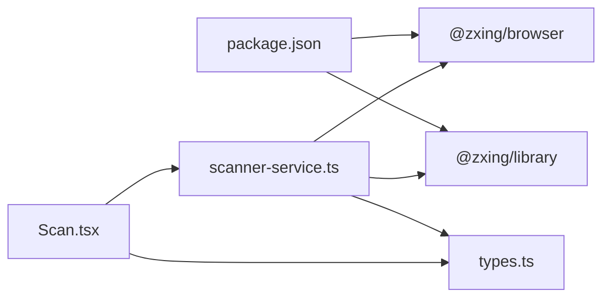

# Scanner Service

<cite>
**Referenced Files in This Document**
- [scanner-service.ts](file://src/lib/scanner-service.ts)
- [types.ts](file://src/lib/scan/types.ts)
- [Scan.tsx](file://src/pages/Scan.tsx)
- [package.json](file://package.json)
</cite>

## Table of Contents
1. [Introduction](#introduction)
2. [Project Structure](#project-structure)
3. [Core Components](#core-components)
4. [Architecture Overview](#architecture-overview)
5. [Detailed Component Analysis](#detailed-component-analysis)
6. [Dependency Analysis](#dependency-analysis)
7. [Performance Considerations](#performance-considerations)
8. [Troubleshooting Guide](#troubleshooting-guide)
9. [Conclusion](#conclusion)

## Introduction
This document provides comprehensive documentation for the ScannerService implementation used to scan barcodes and QR codes in a browser-based application. It focuses on:
- The singleton pattern used to manage camera resources globally
- ZXing library integration for multi-format scanning
- Core methods: start(), stop(), setTorch(), scanFile(), zoom controls, and torch availability
- Camera permission handling via MediaStream API and video element integration
- Format mapping system for barcode types
- Error handling strategies and lifecycle management
- Cross-platform compatibility considerations, performance optimizations, and troubleshooting guidance

## Project Structure
The scanner functionality is implemented as a service module with clear separation between:
- Service interface and implementation (singleton)
- Shared type definitions for formats and content
- UI integration in the Scan page that manages camera state, permissions, and user interactions



**Diagram sources**
- [scanner-service.ts:1-198](file://src/lib/scanner-service.ts#L1-L198)
- [types.ts:1-49](file://src/lib/scan/types.ts#L1-L49)
- [Scan.tsx:1-488](file://src/pages/Scan.tsx#L1-L488)

**Section sources**
- [scanner-service.ts:1-198](file://src/lib/scanner-service.ts#L1-L198)
- [types.ts:1-49](file://src/lib/scan/types.ts#L1-L49)
- [Scan.tsx:1-488](file://src/pages/Scan.tsx#L1-L488)

## Core Components
- ScannerService interface defines the public contract for starting/stopping scanning, controlling torch and zoom, scanning files, and querying capabilities.
- ZxingScannerService implements the interface using ZXing’s BrowserMultiFormatReader and WebRTC MediaStream APIs.
- Singleton accessor getScannerService() ensures a single instance across the app to avoid multiple camera streams and resource contention.

Key responsibilities:
- Lazy initialization of ZXing reader with supported formats
- Starting continuous scanning from a live video stream bound to an HTMLVideoElement
- Stopping scanning and releasing tracks and controls
- Applying torch and zoom constraints to the active MediaStreamTrack
- Scanning static images via decodeFromImageUrl
- Mapping ZXing format strings to internal ScanFormat enum

**Section sources**
- [scanner-service.ts:14-23](file://src/lib/scanner-service.ts#L14-L23)
- [scanner-service.ts:42-191](file://src/lib/scanner-service.ts#L42-L191)
- [types.ts:1-14](file://src/lib/scan/types.ts#L1-L14)

## Architecture Overview
The scanner architecture integrates three layers:
- UI layer (Scan.tsx): Manages camera state, permission checks, device enumeration, and user controls (torch, zoom, file upload).
- Service layer (ZxingScannerService): Encapsulates ZXing reader lifecycle, MediaStream setup, track capability probing, and result normalization.
- External libraries (@zxing/browser and @zxing/library): Provide decoding logic and browser helpers for media capture.



**Diagram sources**
- [scanner-service.ts:51-131](file://src/lib/scanner-service.ts#L51-L131)
- [scanner-service.ts:133-149](file://src/lib/scanner-service.ts#L133-L149)
- [scanner-service.ts:155-170](file://src/lib/scanner-service.ts#L155-L170)
- [Scan.tsx:104-180](file://src/pages/Scan.tsx#L104-L180)
- [package.json:27-28](file://package.json#L27-L28)

## Detailed Component Analysis

### ZxingScannerService Class
The class encapsulates all scanning logic and resource management.

```mermaid
classDiagram
class ScannerService {
+start(video, onResult) Promise~void~
+stop() void
+setTorch(on) Promise~void~
+scanFile(file) Promise~ScannerResult|null~
+isTorchAvailable() boolean
+getZoomCapabilities() ZoomCapabilities|null
+setZoom(level) Promise~void~
+isActive() boolean
}
class ZxingScannerService {
-reader : BrowserMultiFormatReader|null
-controls : { stop() }|null
-currentTrack : MediaStreamTrack|null
-torchAvailable : boolean
-zoomCaps : ZoomCapabilities|null
-starting : boolean
-active : boolean
-ensureReader() Promise~BrowserMultiFormatReader~
+start(video, onResult) Promise~void~
+stop() void
+setTorch(on) Promise~void~
+scanFile(file) Promise~ScannerResult|null~
+isTorchAvailable() boolean
+getZoomCapabilities() ZoomCapabilities|null
+setZoom(level) Promise~void~
+isActive() boolean
}
class ScannerResult {
+content : string
+format : ScanFormat
}
class ZoomCapabilities {
+min : number
+max : number
+step : number
}
class ScanFormat {
<<enum>>
}
ZxingScannerService ..|> ScannerService
ZxingScannerService --> ScannerResult : "produces"
ZxingScannerService --> ZoomCapabilities : "queries"
ZxingScannerService --> ScanFormat : "maps"
```

**Diagram sources**
- [scanner-service.ts:14-23](file://src/lib/scanner-service.ts#L14-L23)
- [scanner-service.ts:42-191](file://src/lib/scanner-service.ts#L42-L191)
- [types.ts:1-14](file://src/lib/scan/types.ts#L1-L14)

#### Key Methods
- start(video, onResult)
  - Prevents concurrent starts and stops any existing session before initializing.
  - Lazily initializes ZXing reader with hints for supported formats and scan timing.
  - Requests a camera stream using MediaStreamConstraints with ideal resolution and rear-facing camera preference.
  - Starts continuous decoding via decodeFromConstraints and sets up capability probing for torch and zoom after a short delay.
  - Marks the service as active once decoding is running.

- stop()
  - Stops the decoder controls and releases the current MediaStreamTrack if present.
  - Resets torch and zoom capability flags.

- setTorch(on)
  - Applies torch constraint to the active track when available; ignores unsupported errors.

- setZoom(level)
  - Clamps requested zoom within min/max capabilities and applies via advanced constraints.

- scanFile(file)
  - Decodes a static image by creating an object URL and calling decodeFromImageUrl.
  - Ensures memory cleanup by revoking the object URL in finally block.

- getZoomCapabilities() / isTorchAvailable()
  - Expose capability probes performed after the stream settles.

- isActive()
  - Indicates whether scanning is currently running.

**Section sources**
- [scanner-service.ts:51-131](file://src/lib/scanner-service.ts#L51-L131)
- [scanner-service.ts:133-149](file://src/lib/scanner-service.ts#L133-L149)
- [scanner-service.ts:155-170](file://src/lib/scanner-service.ts#L155-L170)
- [scanner-service.ts:176-190](file://src/lib/scanner-service.ts#L176-L190)

#### Singleton Pattern
- getScannerService() returns a single global instance of ZxingScannerService.
- Guarantees one camera stream at a time and centralizes resource management.

**Section sources**
- [scanner-service.ts:193-197](file://src/lib/scanner-service.ts#L193-L197)

#### Format Mapping System
- Internal map converts ZXing format strings to the application’s ScanFormat enum.
- Unknown or unmapped formats are normalized to UNKNOWN.

Supported formats include:
- QR_CODE, EAN_13, EAN_8, UPC_A, UPC_E, CODE_128, CODE_39, CODE_93, ITF, DATA_MATRIX, PDF_417, AZTEC

**Section sources**
- [scanner-service.ts:25-40](file://src/lib/scanner-service.ts#L25-L40)
- [types.ts:1-14](file://src/lib/scan/types.ts#L1-L14)

### UI Integration and Lifecycle Management (Scan.tsx)
The Scan page orchestrates camera access, error states, and user controls.

- Permission and device checks:
  - Uses navigator.permissions.query("camera") where supported.
  - Enumerates devices via navigator.mediaDevices.enumerateDevices() to detect presence of cameras.

- Start flow:
  - Calls svc.start(videoRef.current, onResult) and updates UI state to active.
  - Probes torch and zoom capabilities after a delay and exposes them to the UI.

- Torch control:
  - Toggles torch via svc.setTorch(next), updating local UI state.

- Zoom control:
  - Maintains pinch-to-zoom gesture tracking and debounces updates via requestAnimationFrame.
  - Applies zoom through svc.setZoom(clampedValue).

- File scanning:
  - Invokes svc.scanFile(file) for image uploads and handles success/failure feedback.

- Lifecycle and visibility:
  - Stops scanning on visibility change to background and restarts when visible again.
  - Cleans up on component unmount by stopping the service and canceling animation frames.



**Diagram sources**
- [Scan.tsx:104-180](file://src/pages/Scan.tsx#L104-L180)
- [Scan.tsx:182-204](file://src/pages/Scan.tsx#L182-L204)
- [Scan.tsx:210-232](file://src/pages/Scan.tsx#L210-L232)
- [Scan.tsx:254-268](file://src/pages/Scan.tsx#L254-L268)

**Section sources**
- [Scan.tsx:104-180](file://src/pages/Scan.tsx#L104-L180)
- [Scan.tsx:182-204](file://src/pages/Scan.tsx#L182-L204)
- [Scan.tsx:210-232](file://src/pages/Scan.tsx#L210-L232)
- [Scan.tsx:254-268](file://src/pages/Scan.tsx#L254-L268)

## Dependency Analysis
- External dependencies:
  - @zxing/browser: Provides BrowserMultiFormatReader and helper methods for media capture and decoding.
  - @zxing/library: Supplies BarcodeFormat and DecodeHintType constants used to configure the reader.

- Internal dependencies:
  - types.ts: Defines ScanFormat and related types consumed by the service and UI.



**Diagram sources**
- [package.json:27-28](file://package.json#L27-L28)
- [scanner-service.ts:51-74](file://src/lib/scanner-service.ts#L51-L74)
- [types.ts:1-14](file://src/lib/scan/types.ts#L1-L14)
- [Scan.tsx:1-18](file://src/pages/Scan.tsx#L1-L18)

**Section sources**
- [package.json:27-28](file://package.json#L27-L28)
- [scanner-service.ts:51-74](file://src/lib/scanner-service.ts#L51-L74)
- [types.ts:1-14](file://src/lib/scan/types.ts#L1-L14)
- [Scan.tsx:1-18](file://src/pages/Scan.tsx#L1-L18)

## Performance Considerations
- Lazy loading of ZXing modules:
  - Reader and constants are imported only when needed to reduce initial bundle size and startup time.

- Scan attempt throttling:
  - Configured delayBetweenScanAttempts reduces CPU usage during continuous scanning.

- Capability probing delay:
  - Torch and zoom capabilities are probed after a short delay to allow the stream to settle, avoiding premature queries.

- Debounced zoom updates:
  - UI batches zoom changes via requestAnimationFrame to minimize constraint churn.

- Memory cleanup:
  - Object URLs created for image scanning are revoked immediately after use.
  - MediaStreamTrack is stopped and references cleared on stop to prevent leaks.

[No sources needed since this section provides general guidance]

## Troubleshooting Guide
Common issues and resolutions:
- Permission denied:
  - If permission is permanently denied, the UI shows a dedicated overlay with guidance to adjust browser settings.
  - Transient denials prompt retry flows.

- No camera devices:
  - Device enumeration detects absence of videoinput devices and displays an “unavailable” overlay.

- Camera not readable or track start errors:
  - Errors like NotReadable, TrackStartError, AbortError, or messages indicating the camera could not start lead to an error overlay with helpful text.

- Torch/zoom not working:
  - Torch and zoom rely on MediaTrackCapabilities. If unavailable, the UI hides those controls.
  - ApplyConstraints may fail silently on unsupported browsers/devices; the service catches and ignores such errors.

- Multiple camera streams:
  - The singleton pattern prevents concurrent starts and ensures only one stream is active at a time.

- Memory leaks:
  - Ensure stop() is called on unmount and visibility change to background.
  - Verify revokeObjectURL is executed for scanned images.

**Section sources**
- [Scan.tsx:158-179](file://src/pages/Scan.tsx#L158-L179)
- [scanner-service.ts:133-149](file://src/lib/scanner-service.ts#L133-L149)
- [scanner-service.ts:155-170](file://src/lib/scanner-service.ts#L155-L170)
- [scanner-service.ts:176-190](file://src/lib/scanner-service.ts#L176-L190)

## Conclusion
The ScannerService implementation provides a robust, cross-platform solution for real-time barcode and QR code scanning in the browser. By leveraging ZXing’s multi-format reader and WebRTC MediaStream APIs, it offers:
- Centralized resource management via a singleton
- Comprehensive format support with normalized output
- Graceful error handling and user-friendly overlays
- Torch and zoom controls adapted to device capabilities
- Efficient performance through lazy loading, throttled scanning, and careful memory cleanup

Adhering to the documented lifecycle patterns and error-handling strategies will ensure reliable operation across diverse environments and devices.