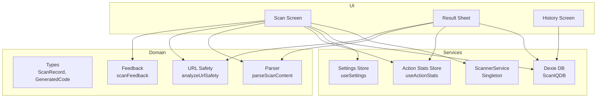
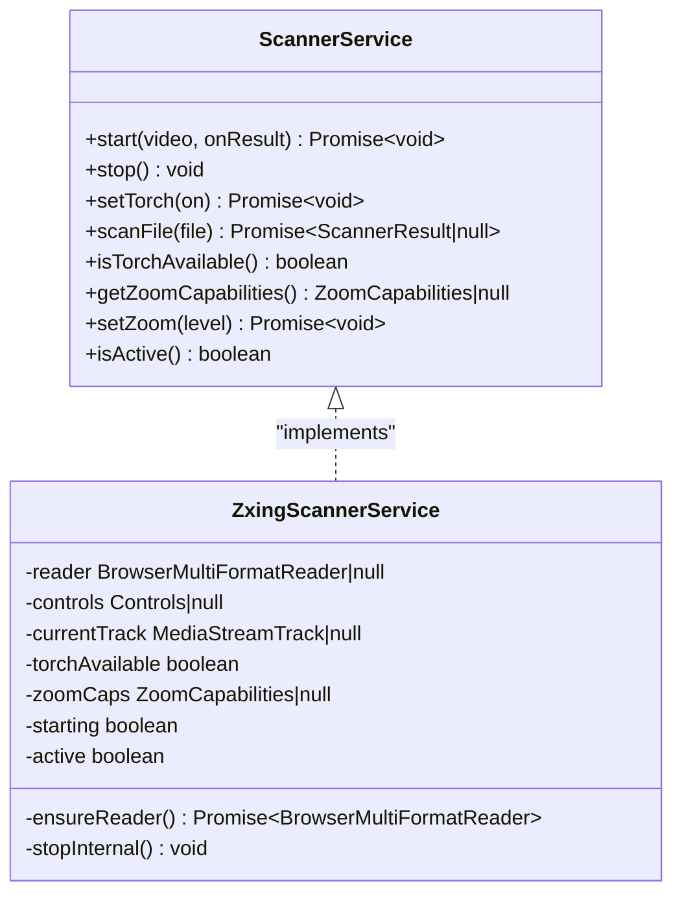
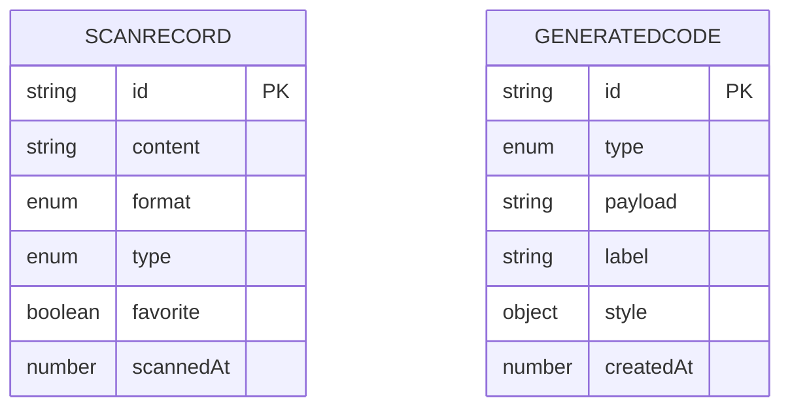
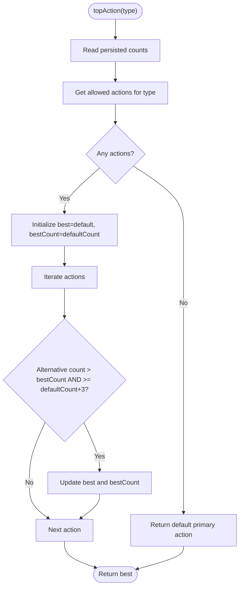
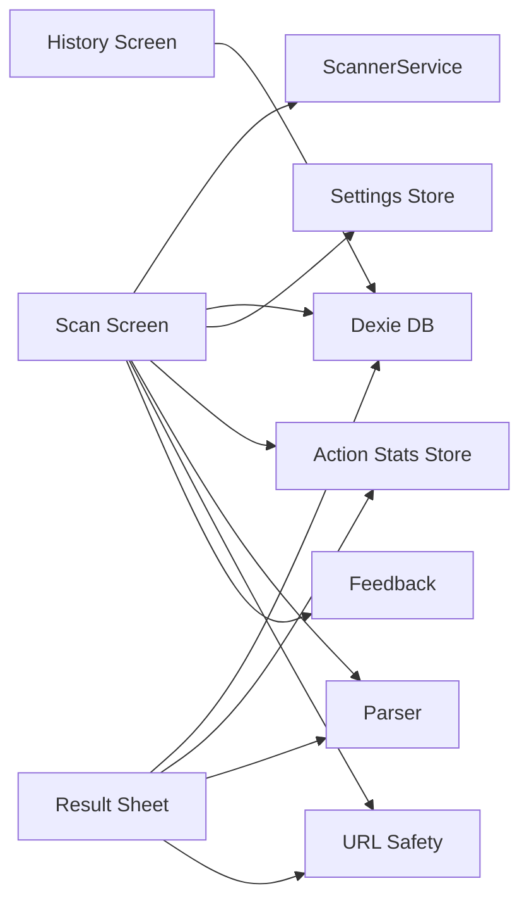

# Service Layer Architecture

<cite>
**Referenced Files in This Document**
- [scanner-service.ts](file://src/lib/scanner-service.ts)
- [db.ts](file://src/lib/db.ts)
- [settings.ts](file://src/lib/settings.ts)
- [action-stats.ts](file://src/lib/action-stats.ts)
- [types.ts](file://src/lib/scan/types.ts)
- [parser.ts](file://src/lib/scan/parser.ts)
- [url-safety.ts](file://src/lib/url-safety.ts)
- [feedback.ts](file://src/lib/feedback.ts)
- [Scan.tsx](file://src/pages/Scan.tsx)
- [ResultSheet.tsx](file://src/components/ResultSheet.tsx)
- [History.tsx](file://src/pages/History.tsx)
</cite>

## Table of Contents
1. [Introduction](#introduction)
2. [Project Structure](#project-structure)
3. [Core Components](#core-components)
4. [Architecture Overview](#architecture-overview)
5. [Detailed Component Analysis](#detailed-component-analysis)
6. [Dependency Analysis](#dependency-analysis)
7. [Performance Considerations](#performance-considerations)
8. [Troubleshooting Guide](#troubleshooting-guide)
9. [Conclusion](#conclusion)

## Introduction
This document describes the service-oriented architecture of Smart Scan Pro with a clear separation of concerns across scanning, persistence, settings, and analytics services. It focuses on:
- ScannerService singleton for camera resource management and ZXing integration
- Database service layer built on Dexie ORM for IndexedDB operations
- Settings management using Zustand with persistent storage
- Action statistics tracking for analytics and usage monitoring
- Examples of service instantiation, dependency injection patterns, and error handling strategies
- Memory management, performance optimization, and cross-platform compatibility considerations

## Project Structure
The service layer is organized under src/lib with focused modules:
- scanner-service.ts: Camera and barcode scanning service (singleton)
- db.ts: Dexie-based database schema and helpers
- settings.ts: Persistent app settings via Zustand
- action-stats.ts: Persistent action analytics via Zustand
- scan/types.ts: Shared data models for scans and generated codes
- scan/parser.ts: Content type detection and parsing
- url-safety.ts: URL safety analysis utilities
- feedback.ts: Sound and vibration feedback based on settings



**Diagram sources**
- [scanner-service.ts](file://src/lib/scanner-service.ts)
- [db.ts](file://src/lib/db.ts)
- [settings.ts](file://src/lib/settings.ts)
- [action-stats.ts](file://src/lib/action-stats.ts)
- [types.ts](file://src/lib/scan/types.ts)
- [parser.ts](file://src/lib/scan/parser.ts)
- [url-safety.ts](file://src/lib/url-safety.ts)
- [feedback.ts](file://src/lib/feedback.ts)
- [Scan.tsx](file://src/pages/Scan.tsx)
- [ResultSheet.tsx](file://src/components/ResultSheet.tsx)
- [History.tsx](file://src/pages/History.tsx)

**Section sources**
- [scanner-service.ts](file://src/lib/scanner-service.ts)
- [db.ts](file://src/lib/db.ts)
- [settings.ts](file://src/lib/settings.ts)
- [action-stats.ts](file://src/lib/action-stats.ts)
- [types.ts](file://src/lib/scan/types.ts)
- [parser.ts](file://src/lib/scan/parser.ts)
- [url-safety.ts](file://src/lib/url-safety.ts)
- [feedback.ts](file://src/lib/feedback.ts)
- [Scan.tsx](file://src/pages/Scan.tsx)
- [ResultSheet.tsx](file://src/components/ResultSheet.tsx)
- [History.tsx](file://src/pages/History.tsx)

## Core Components
- ScannerService: Singleton interface and implementation that manages MediaStream tracks, torch, zoom, and ZXing decoding from both live video and image files.
- Database Service: Dexie class defining tables and indexes; helper to prune free-tier history while preserving favorites.
- Settings Service: Zustand store with persist middleware for user preferences such as theme, auto behaviors, and haptics.
- Action Stats Service: Zustand store with persist middleware to track primary actions per content type and recommend top actions.

Key responsibilities and boundaries:
- Scanning service encapsulates all browser media and ZXing interactions.
- Database service centralizes IndexedDB access and schema evolution.
- Settings and stats stores provide reactive state with persistence.
- Parser and safety utilities are pure functions used by UI and services.

**Section sources**
- [scanner-service.ts](file://src/lib/scanner-service.ts)
- [db.ts](file://src/lib/db.ts)
- [settings.ts](file://src/lib/settings.ts)
- [action-stats.ts](file://src/lib/action-stats.ts)
- [types.ts](file://src/lib/scan/types.ts)
- [parser.ts](file://src/lib/scan/parser.ts)
- [url-safety.ts](file://src/lib/url-safety.ts)

## Architecture Overview
The application follows a service-oriented pattern where UI components consume services through stable APIs:
- ScannerService is accessed via a singleton accessor.
- Database access uses a shared Dexie instance exported from the module.
- Settings and stats are consumed via React hooks backed by Zustand stores.

```mermaid
sequenceDiagram
participant UI as "Scan Screen"
participant Svc as "ScannerService"
participant DB as "Dexie DB"
participant ST as "Settings Store"
participant AS as "Action Stats Store"
participant PAR as "Parser"
participant SAF as "URL Safety"
participant FB as "Feedback"
UI->>Svc : start(video, onResult)
Svc-->>UI : onResult(content, format)
UI->>PAR : parseScanContent(content, format)
PAR-->>UI : {type, data, display}
UI->>SAF : analyzeUrlSafety(content) if type=url
SAF-->>UI : {level, reasons}
UI->>FB : scanFeedback()
UI->>DB : scans.put(record)
UI->>DB : pruneFreeHistory()
UI->>ST : getState().auto* flags
alt auto actions enabled
UI->>AS : record(action)
end
```

**Diagram sources**
- [Scan.tsx](file://src/pages/Scan.tsx)
- [scanner-service.ts](file://src/lib/scanner-service.ts)
- [db.ts](file://src/lib/db.ts)
- [settings.ts](file://src/lib/settings.ts)
- [action-stats.ts](file://src/lib/action-stats.ts)
- [parser.ts](file://src/lib/scan/parser.ts)
- [url-safety.ts](file://src/lib/url-safety.ts)
- [feedback.ts](file://src/lib/feedback.ts)

## Detailed Component Analysis

### ScannerService (Camera and ZXing Integration)
Responsibilities:
- Lazy initialization of ZXing reader with decode hints
- Start/stop camera stream and manage MediaStreamTrack lifecycle
- Torch and zoom capability probing and control
- Image file scanning via object URLs with cleanup
- Singleton exposure via getScannerService()

Design highlights:
- Concurrency guard prevents overlapping starts
- Internal stop ensures consistent teardown of controls and tracks
- Capability probing occurs after stream settles to avoid race conditions
- File scanning reuses the same reader instance and revokes object URLs



**Diagram sources**
- [scanner-service.ts](file://src/lib/scanner-service.ts)

**Section sources**
- [scanner-service.ts](file://src/lib/scanner-service.ts)

### Database Service Layer (Dexie ORM)
Responsibilities:
- Define database name and versioned schema with table indexes
- Provide a shared instance for global use
- Implement pruning logic to maintain free-tier limits without deleting favorites

Schema design:
- scans table indexed by id, scannedAt, type, format, favorite, content
- generated table indexed by id, createdAt, type

Data access patterns:
- Direct table queries via Dexie API
- Bulk delete for pruning overflow records
- Use of ordering and filtering to respect favorites



**Diagram sources**
- [db.ts](file://src/lib/db.ts)
- [types.ts](file://src/lib/scan/types.ts)

**Section sources**
- [db.ts](file://src/lib/db.ts)
- [types.ts](file://src/lib/scan/types.ts)

### Settings Management Service (Zustand + Persist)
Responsibilities:
- Maintain app-wide preferences including onboarding, sound, vibration, auto behaviors, and theme
- Persist state to localStorage via zustand/middleware
- Expose imperative setters and convenience methods

Usage patterns:
- Hook-based subscription in React components
- getState() for non-reactive reads when needed

**Section sources**
- [settings.ts](file://src/lib/settings.ts)

### Action Statistics Tracking Service (Zustand + Persist)
Responsibilities:
- Record user actions globally and persist counts
- Compute recommended primary action per content type with a threshold rule
- Provide default actions per content type and available actions list

Algorithm overview:
- Default primary action per type
- If an alternative action count exceeds default by at least 3, promote it as top action



**Diagram sources**
- [action-stats.ts](file://src/lib/action-stats.ts)
- [types.ts](file://src/lib/scan/types.ts)

**Section sources**
- [action-stats.ts](file://src/lib/action-stats.ts)
- [types.ts](file://src/lib/scan/types.ts)

### Content Parsing and Safety Utilities
Responsibilities:
- Detect content types (URL, WiFi, vCard, email, SMS, phone, geo, product, payment, text)
- Extract structured fields for downstream actions
- Analyze URL safety heuristics (protocol checks, IP hosts, punycode, shorteners, brand impersonation, HTTP, embedded credentials)

Integration points:
- Used by Scan screen to build ScanRecord and decide auto-actions
- Used by Result sheet to render smart actions and safety warnings

**Section sources**
- [parser.ts](file://src/lib/scan/parser.ts)
- [url-safety.ts](file://src/lib/url-safety.ts)
- [types.ts](file://src/lib/scan/types.ts)

### Feedback Service
Responsibilities:
- Play beep and/or vibrate based on settings
- Centralized entry point for scan completion feedback

**Section sources**
- [feedback.ts](file://src/lib/feedback.ts)
- [settings.ts](file://src/lib/settings.ts)

## Dependency Analysis
High-level dependencies between services and UI:
- ScannerScreen depends on ScannerService, Dexie DB, Settings, Action Stats, Parser, URL Safety, and Feedback
- ResultSheet depends on Dexie DB, Action Stats, Parser, and URL Safety
- HistoryScreen depends on Dexie DB



**Diagram sources**
- [Scan.tsx](file://src/pages/Scan.tsx)
- [ResultSheet.tsx](file://src/components/ResultSheet.tsx)
- [History.tsx](file://src/pages/History.tsx)
- [scanner-service.ts](file://src/lib/scanner-service.ts)
- [db.ts](file://src/lib/db.ts)
- [settings.ts](file://src/lib/settings.ts)
- [action-stats.ts](file://src/lib/action-stats.ts)
- [parser.ts](file://src/lib/scan/parser.ts)
- [url-safety.ts](file://src/lib/url-safety.ts)
- [feedback.ts](file://src/lib/feedback.ts)

**Section sources**
- [Scan.tsx](file://src/pages/Scan.tsx)
- [ResultSheet.tsx](file://src/components/ResultSheet.tsx)
- [History.tsx](file://src/pages/History.tsx)

## Performance Considerations
- Lazy loading of ZXing modules reduces initial bundle size and startup time.
- Debounced zoom updates via requestAnimationFrame prevent excessive constraint changes.
- Object URLs for image scanning are revoked promptly to avoid memory leaks.
- Dexie indexing supports efficient queries and sorting by scannedAt and filters by favorite.
- Pruning strategy avoids expensive deletions by batching IDs and skipping favorites.
- Avoid concurrent camera starts with a guard flag to reduce race conditions and wasted resources.
- Use of zustand/persist keeps state small and serializable for fast I/O.

[No sources needed since this section provides general guidance]

## Troubleshooting Guide
Common issues and strategies:
- Camera permission denied or permanent denial: detect via permissions API and show appropriate overlay with guidance.
- Device not found or not readable: handle NotFound/NotReadable errors and present retry or fallback options.
- Storage failures: catch and surface user-friendly messages during write operations.
- Clipboard unavailable: gracefully degrade to toast notifications and continue flow.
- Visibility changes: stop camera when hidden and restart on focus to conserve battery and resources.

Error handling patterns:
- Try/catch around async operations with specific message classification for UX overlays.
- Non-fatal catches for unsupported features (e.g., torch/zoom constraints).
- Global ErrorBoundary component wraps the app to prevent crashes and offer recovery.

**Section sources**
- [Scan.tsx](file://src/pages/Scan.tsx)
- [ResultSheet.tsx](file://src/components/ResultSheet.tsx)
- [db.ts](file://src/lib/db.ts)

## Conclusion
Smart Scan Pro’s service layer cleanly separates concerns:
- ScannerService encapsulates hardware and decoding complexity behind a simple interface and singleton pattern.
- Dexie-based database service centralizes schema and access patterns with robust pruning logic.
- Zustand-backed settings and stats stores deliver reactive, persistent state with minimal boilerplate.
- Pure utilities for parsing and safety analysis keep UI logic focused on presentation and user flows.
Together, these services enable responsive, reliable scanning experiences with thoughtful attention to memory, performance, and cross-platform behavior.