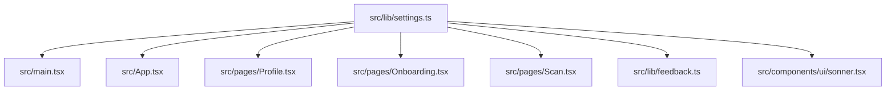
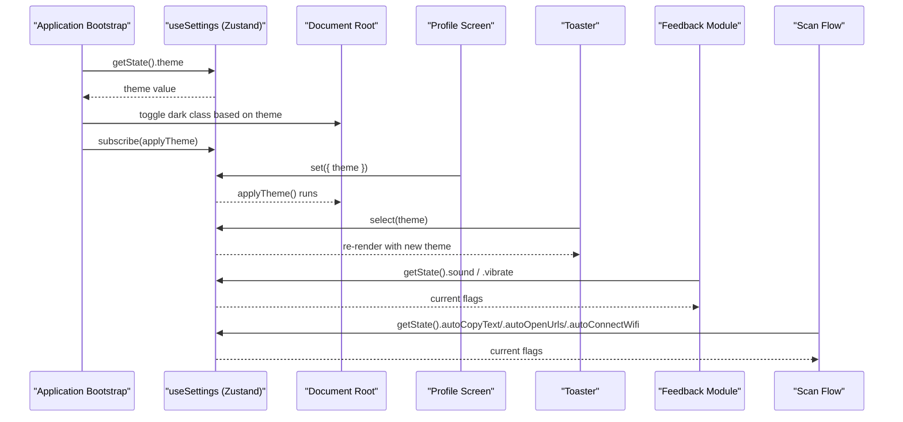
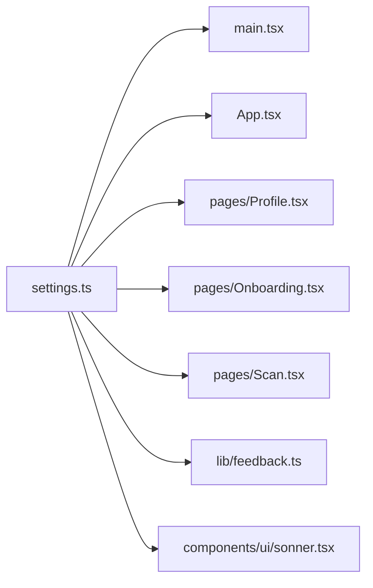

# Settings Service

<cite>
**Referenced Files in This Document**
- [settings.ts](file://src/lib/settings.ts)
- [main.tsx](file://src/main.tsx)
- [App.tsx](file://src/App.tsx)
- [Profile.tsx](file://src/pages/Profile.tsx)
- [Onboarding.tsx](file://src/pages/Onboarding.tsx)
- [Scan.tsx](file://src/pages/Scan.tsx)
- [feedback.ts](file://src/lib/feedback.ts)
- [sonner.tsx](file://src/components/ui/sonner.tsx)
</cite>

## Table of Contents
1. [Introduction](#introduction)
2. [Project Structure](#project-structure)
3. [Core Components](#core-components)
4. [Architecture Overview](#architecture-overview)
5. [Detailed Component Analysis](#detailed-component-analysis)
6. [Dependency Analysis](#dependency-analysis)
7. [Performance Considerations](#performance-considerations)
8. [Troubleshooting Guide](#troubleshooting-guide)
9. [Conclusion](#conclusion)
10. [Appendices](#appendices)

## Introduction
This document explains the settings management service implemented with Zustand for reactive state and localStorage persistence. It covers the AppSettings interface, default values, reactive updates, synchronization to storage, usage patterns across components, performance considerations, and guidance for validation, migration, export/import, and reset strategies.

## Project Structure
The settings service is a small, focused module that:
- Defines the application settings shape
- Creates a Zustand store with middleware-based persistence
- Exposes a hook for reading and updating settings
- Provides a global subscription to apply theme changes before first paint

**Diagram sources**
- [settings.ts:1-35](file://src/lib/settings.ts#L1-L35)
- [main.tsx:1-23](file://src/main.tsx#L1-L23)
- [App.tsx:1-100](file://src/App.tsx#L1-L100)
- [Profile.tsx:1-180](file://src/pages/Profile.tsx#L1-L180)
- [Onboarding.tsx:1-73](file://src/pages/Onboarding.tsx#L1-L73)
- [Scan.tsx:70-102](file://src/pages/Scan.tsx#L70-L102)
- [feedback.ts:1-41](file://src/lib/feedback.ts#L1-L41)
- [sonner.tsx:1-28](file://src/components/ui/sonner.tsx#L1-L28)

**Section sources**
- [settings.ts:1-35](file://src/lib/settings.ts#L1-L35)
- [main.tsx:1-23](file://src/main.tsx#L1-L23)

## Core Components
- AppSettings interface defines all user preferences including onboarding status, sound/vibration toggles, auto-actions (open URLs, copy text, connect Wi-Fi), and theme selection.
- The Zustand store exposes:
  - State fields from AppSettings
  - A set method for partial updates
  - A completeOnboarding action to mark onboarding as finished
- Persistence is configured via middleware using a dedicated storage key.

Key responsibilities:
- Centralized source of truth for app-wide settings
- Automatic persistence to browser storage
- Reactive updates consumed by UI and logic

**Section sources**
- [settings.ts:4-17](file://src/lib/settings.ts#L4-L17)
- [settings.ts:19-34](file://src/lib/settings.ts#L19-L34)

## Architecture Overview
The settings service integrates at three levels:
- Global initialization applies persisted theme immediately and subscribes to future changes
- UI components read and update settings reactively
- Non-UI modules read current settings imperatively when needed

**Diagram sources**
- [main.tsx:15-22](file://src/main.tsx#L15-L22)
- [Profile.tsx:36-40](file://src/pages/Profile.tsx#L36-L40)
- [sonner.tsx:6-12](file://src/components/ui/sonner.tsx#L6-L12)
- [feedback.ts:5-35](file://src/lib/feedback.ts#L5-L35)
- [Scan.tsx:74-97](file://src/pages/Scan.tsx#L74-L97)

## Detailed Component Analysis

### AppSettings Interface and Defaults
- Fields include:
  - Onboarding completion flag
  - Sound and vibration toggles
  - Auto actions: open URLs, copy text, connect Wi-Fi
  - Theme selection between two options
- Default values are defined inline in the store initializer. These defaults are used when no persisted data exists or when keys are missing.

Practical implications:
- First run behavior is predictable due to explicit defaults
- Theme defaults to a specific mode unless overridden by stored data

**Section sources**
- [settings.ts:4-12](file://src/lib/settings.ts#L4-L12)
- [settings.ts:21-28](file://src/lib/settings.ts#L21-L28)

### Reactive State Updates and Subscriptions
- Components can subscribe to individual fields to minimize re-renders.
- A global subscriber applies theme changes to the document root immediately upon any change.

Usage patterns:
- Selective subscriptions in components
- Imperative reads via getState for non-React code paths

**Section sources**
- [App.tsx:24-25](file://src/App.tsx#L24-L25)
- [sonner.tsx:6-7](file://src/components/ui/sonner.tsx#L6-L7)
- [main.tsx:15-22](file://src/main.tsx#L15-L22)
- [feedback.ts:5-29](file://src/lib/feedback.ts#L5-L29)
- [Scan.tsx:74-76](file://src/pages/Scan.tsx#L74-L76)

### LocalStorage Synchronization
- The store uses a named storage key for persistence.
- Middleware handles serialization/deserialization automatically.

Operational notes:
- Data survives page reloads and browser restarts
- Key name is fixed and should not be changed without a migration strategy

**Section sources**
- [settings.ts:31-33](file://src/lib/settings.ts#L31-L33)

### Default Value Management
- Defaults are provided in the store initializer.
- If existing storage contains older or incomplete shapes, defaults fill missing fields.

Recommendation:
- Keep defaults aligned with the latest interface to avoid stale states

**Section sources**
- [settings.ts:21-28](file://src/lib/settings.ts#L21-L28)

### Settings Validation
- Current implementation does not perform runtime validation of persisted values.
- Consumers assume values match expected types.

Guidance:
- Add a normalization step during initialization if you expect external modifications or legacy formats
- Validate critical fields like theme against allowed values

[No sources needed since this section provides general guidance]

### Migration Strategies for Version Upgrades
- When adding new fields or changing defaults, consider:
  - Detecting version differences
  - Migrating old persisted objects to the new shape
  - Ensuring backward compatibility until users upgrade

Implementation ideas:
- Wrap the store creation with a migration function that inspects the persisted object and returns a normalized one
- Use a versioned key or a separate version field inside the settings object

[No sources needed since this section provides general guidance]

### Bulk Update Operations
- The store exposes a set method accepting partial updates.
- Multiple fields can be updated atomically by passing an object with multiple keys.

Best practices:
- Prefer single set calls for related changes to reduce re-renders
- Avoid excessive granular updates in tight loops

**Section sources**
- [settings.ts:14-16](file://src/lib/settings.ts#L14-L16)
- [Profile.tsx:36-40](file://src/pages/Profile.tsx#L36-L40)

### Programmatic Updates
- UI controls call set with the relevant field(s).
- Onboarding completion uses a dedicated action to mark onboarding done.

Examples of usage:
- Toggle theme
- Toggle sound/vibration
- Toggle auto-actions
- Complete onboarding flow

**Section sources**
- [Profile.tsx:36-40](file://src/pages/Profile.tsx#L36-L40)
- [Profile.tsx:66-72](file://src/pages/Profile.tsx#L66-L72)
- [Profile.tsx:107-118](file://src/pages/Profile.tsx#L107-L118)
- [Onboarding.tsx:15-24](file://src/pages/Onboarding.tsx#L15-L24)

### Accessing Settings in Components
- Selective subscriptions ensure only affected components re-render.
- Example patterns:
  - Subscribe to a single boolean or enum field
  - Read entire store when necessary (less efficient)

**Section sources**
- [App.tsx:24-25](file://src/App.tsx#L24-L25)
- [sonner.tsx:6-7](file://src/components/ui/sonner.tsx#L6-L7)

### Reading Settings Outside React
- Non-React modules use getState to read current values synchronously.
- This is appropriate for event handlers or utility functions.

**Section sources**
- [feedback.ts:5-29](file://src/lib/feedback.ts#L5-L29)
- [Scan.tsx:74-76](file://src/pages/Scan.tsx#L74-L76)

### Settings Export/Import Functionality
- No built-in export/import API is present in the settings module.
- You can implement it by:
  - Exporting: reading the full state via getState and serializing to JSON
  - Importing: merging incoming data into the store via set, then persisting

Considerations:
- Validate imported data before applying
- Provide rollback or confirmation flows for destructive imports

[No sources needed since this section provides general guidance]

### Reset Mechanisms
- There is no built-in reset function.
- To reset:
  - Clear the persisted storage key
  - Reinitialize the store to defaults by reloading or calling set with defaults

Caution:
- Clearing storage affects all persisted data under the same key; coordinate with other features if they share storage

[No sources needed since this section provides general guidance]

## Dependency Analysis
The settings module is a leaf dependency consumed by multiple parts of the app.

**Diagram sources**
- [settings.ts:1-35](file://src/lib/settings.ts#L1-L35)
- [main.tsx:1-23](file://src/main.tsx#L1-L23)
- [App.tsx:1-100](file://src/App.tsx#L1-L100)
- [Profile.tsx:1-180](file://src/pages/Profile.tsx#L1-L180)
- [Onboarding.tsx:1-73](file://src/pages/Onboarding.tsx#L1-L73)
- [Scan.tsx:70-102](file://src/pages/Scan.tsx#L70-L102)
- [feedback.ts:1-41](file://src/lib/feedback.ts#L1-L41)
- [sonner.tsx:1-28](file://src/components/ui/sonner.tsx#L1-L28)

**Section sources**
- [settings.ts:1-35](file://src/lib/settings.ts#L1-L35)

## Performance Considerations
- Prefer selective subscriptions to avoid unnecessary re-renders.
- Batch related updates using a single set call to minimize state churn.
- Use getState for imperative reads outside React to avoid component subscriptions.
- The global theme subscriber runs once per change; keep its work minimal.

[No sources needed since this section provides general guidance]

## Troubleshooting Guide
Common issues and resolutions:
- Theme not applied on first load:
  - Ensure the bootstrap code reads the persisted theme and applies it before rendering
- Unexpected behavior after manual storage edits:
  - Validate persisted values; add normalization/validation on startup
- Missing fields after upgrades:
  - Implement migration to fill defaults for new fields
- Export/import mismatches:
  - Validate incoming payloads and merge carefully

**Section sources**
- [main.tsx:15-22](file://src/main.tsx#L15-L22)
- [settings.ts:21-28](file://src/lib/settings.ts#L21-L28)

## Conclusion
The settings service provides a simple, robust foundation for managing user preferences with reactive updates and persistent storage. By leveraging selective subscriptions, batch updates, and careful initialization, the app maintains responsiveness while ensuring consistent user experience across sessions. Extending it with validation, migration, and export/import capabilities will further improve reliability and maintainability.

## Appendices

### Usage Examples Reference Paths
- Apply theme globally and subscribe to changes:
  - [main.tsx:15-22](file://src/main.tsx#L15-L22)
- Read onboarding status to control routing:
  - [App.tsx:24-25](file://src/App.tsx#L24-L25)
- Update theme and sync UI:
  - [Profile.tsx:36-40](file://src/pages/Profile.tsx#L36-L40)
- Toggle sound/vibration:
  - [Profile.tsx:66-72](file://src/pages/Profile.tsx#L66-L72)
- Toggle auto-actions:
  - [Profile.tsx:107-118](file://src/pages/Profile.tsx#L107-L118)
- Complete onboarding:
  - [Onboarding.tsx:15-24](file://src/pages/Onboarding.tsx#L15-L24)
- Read settings imperatively in scan flow:
  - [Scan.tsx:74-97](file://src/pages/Scan.tsx#L74-L97)
- Read sound/vibrate flags in feedback module:
  - [feedback.ts:5-35](file://src/lib/feedback.ts#L5-L35)
- Consume theme in toaster:
  - [sonner.tsx:6-12](file://src/components/ui/sonner.tsx#L6-L12)