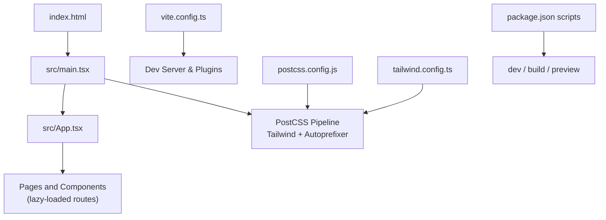
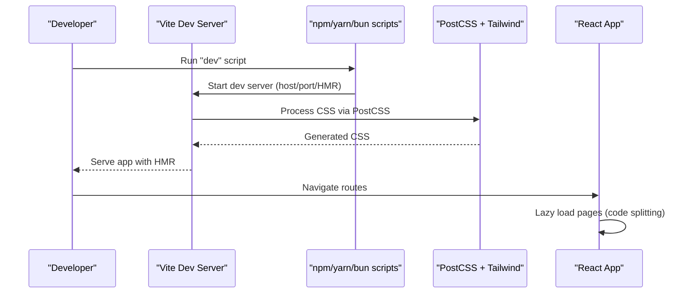
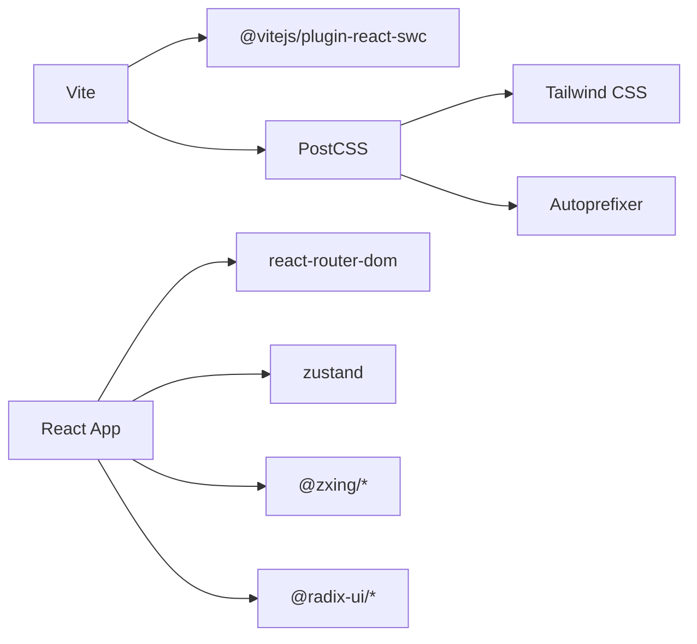

# Build and Deployment

<cite>
**Referenced Files in This Document**
- [vite.config.ts](file://vite.config.ts)
- [package.json](file://package.json)
- [postcss.config.js](file://postcss.config.js)
- [tailwind.config.ts](file://tailwind.config.ts)
- [index.html](file://index.html)
- [src/main.tsx](file://src/main.tsx)
- [src/App.tsx](file://src/App.tsx)
- [tsconfig.app.json](file://tsconfig.app.json)
- [tsconfig.node.json](file://tsconfig.node.json)
- [components.json](file://components.json)
</cite>

## Table of Contents
1. [Introduction](#introduction)
2. [Project Structure](#project-structure)
3. [Core Components](#core-components)
4. [Architecture Overview](#architecture-overview)
5. [Detailed Component Analysis](#detailed-component-analysis)
6. [Dependency Analysis](#dependency-analysis)
7. [Performance Considerations](#performance-considerations)
8. [Troubleshooting Guide](#troubleshooting-guide)
9. [Conclusion](#conclusion)
10. [Appendices](#appendices)

## Introduction
This document provides comprehensive build and deployment guidance for Smart Scan Pro (ScanIQ). It explains the Vite-based build system, PostCSS pipeline with Tailwind CSS integration, environment configuration strategies, performance optimizations such as code splitting and lazy loading, and deployment options including static hosting, cloud platforms, and mobile app wrapping. It also covers caching, security headers, monitoring setup, and troubleshooting common issues.

## Project Structure
The project is a React + TypeScript application built with Vite. The build tooling includes:
- Vite for development server and production builds
- SWC-powered React plugin for fast compilation
- PostCSS with Tailwind CSS and Autoprefixer for CSS processing
- TypeScript configured for bundler mode and module resolution
- A minimal HTML entry that bootstraps the React root

**Diagram sources**
- [index.html:1-25](file://index.html#L1-L25)
- [src/main.tsx:1-24](file://src/main.tsx#L1-L24)
- [src/App.tsx:1-100](file://src/App.tsx#L1-L100)
- [vite.config.ts:1-23](file://vite.config.ts#L1-L23)
- [postcss.config.js:1-7](file://postcss.config.js#L1-L7)
- [tailwind.config.ts:1-108](file://tailwind.config.ts#L1-L108)
- [package.json:1-70](file://package.json#L1-L70)

**Section sources**
- [index.html:1-25](file://index.html#L1-L25)
- [src/main.tsx:1-24](file://src/main.tsx#L1-L24)
- [src/App.tsx:1-100](file://src/App.tsx#L1-L100)
- [vite.config.ts:1-23](file://vite.config.ts#L1-L23)
- [postcss.config.js:1-7](file://postcss.config.js#L1-L7)
- [tailwind.config.ts:1-108](file://tailwind.config.ts#L1-L108)
- [package.json:1-70](file://package.json#L1-L70)

## Core Components
- Development server and plugins:
  - Host binding, port, and HMR overlay settings are defined in the Vite config.
  - React SWC plugin is used; an additional dev-only component tagger plugin is conditionally enabled.
  - Path alias "@" maps to the src directory; React packages are deduplicated.
- Scripts:
  - npm scripts provide dev, build, build:dev, preview, lint, and test commands.
- CSS pipeline:
  - PostCSS uses Tailwind CSS and Autoprefixer.
  - Tailwind configuration scans TS/TSX files under src and extends theme tokens and animations.
- Entry points:
  - index.html defines meta tags, Open Graph/Twitter cards, and loads the React root.
  - main.tsx initializes global error handlers, applies persisted theme before first paint, and renders App.
- Routing and code splitting:
  - App.tsx uses React.lazy and Suspense for route-level code splitting.

**Section sources**
- [vite.config.ts:1-23](file://vite.config.ts#L1-L23)
- [package.json:1-70](file://package.json#L1-L70)
- [postcss.config.js:1-7](file://postcss.config.js#L1-L7)
- [tailwind.config.ts:1-108](file://tailwind.config.ts#L1-L108)
- [index.html:1-25](file://index.html#L1-L25)
- [src/main.tsx:1-24](file://src/main.tsx#L1-L24)
- [src/App.tsx:1-100](file://src/App.tsx#L1-L100)

## Architecture Overview
The build and runtime architecture centers on Vite orchestrating the dev server and production build, while PostCSS processes styles through Tailwind and Autoprefixer. The application bootstraps from index.html, which loads the React entry point. At runtime, routing and lazy loading split the bundle into smaller chunks per page.

**Diagram sources**
- [package.json:1-70](file://package.json#L1-L70)
- [vite.config.ts:1-23](file://vite.config.ts#L1-L23)
- [postcss.config.js:1-7](file://postcss.config.js#L1-L7)
- [tailwind.config.ts:1-108](file://tailwind.config.ts#L1-L108)
- [src/App.tsx:1-100](file://src/App.tsx#L1-L100)

## Detailed Component Analysis

### Vite Configuration and Build Settings
- Development server:
  - Host set to listen on all interfaces; default port configured; HMR overlay disabled.
- Plugins:
  - React SWC plugin for fast JSX transform.
  - Conditional dev-only component tagger plugin.
- Resolution:
  - Alias "@" to src.
  - Dedupe React packages to avoid duplicate instances.
- Output:
  - Production build outputs assets suitable for static hosting or CDN.

Recommendations:
- Add base path if deploying under a subpath.
- Configure asset handling (e.g., image optimization) if needed.
- Enable sourcemaps for production only when debugging is required.

**Section sources**
- [vite.config.ts:1-23](file://vite.config.ts#L1-L23)

### PostCSS and Tailwind CSS Integration
- PostCSS pipeline:
  - Tailwind CSS generates utility classes based on scanned content paths.
  - Autoprefixer adds vendor prefixes for compatibility.
- Tailwind configuration:
  - Scans TS/TSX files under src.
  - Extends theme variables, colors, radii, gradients, shadows, keyframes, and animations.
  - Uses CSS variables for theming and dark mode via class strategy.

Best practices:
- Keep content globs precise to reduce unused CSS.
- Use CSS variables for consistent theming across components.
- Ensure Tailwind’s prefix and container settings align with your design system.

**Section sources**
- [postcss.config.js:1-7](file://postcss.config.js#L1-L7)
- [tailwind.config.ts:1-108](file://tailwind.config.ts#L1-L108)

### Environment Configuration Strategy
- Modes:
  - Default production mode for builds.
  - Development mode available via explicit flag.
- Environment variables:
  - Access via import.meta.env.* at build time.
  - Prefix variables with VITE_ to expose to client code.
- Recommended .env files:
  - .env.development for local overrides.
  - .env.production for production defaults.
  - .env.[mode] for custom modes.

Guidelines:
- Never commit secrets; use CI/CD secret managers.
- Validate required variables at startup and fail fast with clear messages.
- For CDN deployments, ensure public URLs resolve correctly and consider setting a base path.

**Section sources**
- [package.json:1-70](file://package.json#L1-L70)
- [vite.config.ts:1-23](file://vite.config.ts#L1-L23)

### Asset Processing and HTML Entry
- HTML entry:
  - Defines viewport, theme color, SEO metadata, and social sharing tags.
  - Loads the React entry point as a module.
- Assets:
  - Static assets under public are served as-is.
  - Imported assets are hashed and optimized by Vite.

Operational tips:
- Place large images in public only if they must be referenced by absolute paths.
- Prefer importing assets to leverage hashing and compression.

**Section sources**
- [index.html:1-25](file://index.html#L1-L25)

### Application Bootstrap and Global Error Handling
- Initialization:
  - Applies persisted theme before first paint to avoid flash.
  - Subscribes to settings changes to toggle dark mode dynamically.
- Error handling:
  - Global listeners log unhandled errors and promise rejections.

Enhancements:
- Integrate a lightweight analytics or error reporting SDK in production.
- Provide user-friendly fallbacks for network failures.

**Section sources**
- [src/main.tsx:1-24](file://src/main.tsx#L1-L24)

### Routing and Code Splitting
- Lazy loading:
  - Pages are wrapped with React.lazy and Suspense to split bundles by route.
- Fallback UI:
  - A simple loading indicator is shown while chunks load.

Impact:
- Reduces initial payload size and improves Time to Interactive.
- Improves perceived performance on slower networks.

**Section sources**
- [src/App.tsx:1-100](file://src/App.tsx#L1-L100)

### TypeScript Configuration
- App target:
  - ES2020 target with DOM libs; bundler module resolution; isolated modules.
- Node target:
  - ES2022 target for build-time scripts.
- Paths:
  - "@/*" mapped to "./src/*".

Notes:
- Strictness is relaxed for app code but stricter for node config.
- Skip lib checks to speed up builds.

**Section sources**
- [tsconfig.app.json:1-31](file://tsconfig.app.json#L1-L31)
- [tsconfig.node.json:1-23](file://tsconfig.node.json#L1-L23)

### UI System and Aliases
- shadcn/ui configuration:
  - Points to Tailwind config and CSS file.
  - Enables CSS variables and sets aliases for components, utils, hooks, and lib.

Usage:
- Import UI primitives using aliases for consistent structure and maintainability.

**Section sources**
- [components.json:1-21](file://components.json#L1-L21)

## Dependency Analysis
Build-time dependencies include Vite, React SWC plugin, PostCSS, Tailwind CSS, Autoprefixer, and TypeScript. Runtime dependencies include React ecosystem, UI primitives, QR/barcode scanning libraries, state management, and i18n.

**Diagram sources**
- [package.json:1-70](file://package.json#L1-L70)
- [vite.config.ts:1-23](file://vite.config.ts#L1-L23)
- [postcss.config.js:1-7](file://postcss.config.js#L1-L7)
- [tailwind.config.ts:1-108](file://tailwind.config.ts#L1-L108)

**Section sources**
- [package.json:1-70](file://package.json#L1-L70)

## Performance Considerations
- Code splitting:
  - Route-level lazy loading reduces initial bundle size.
- Tree-shaking:
  - Vite leverages ES modules to eliminate unused code.
- CSS optimization:
  - Tailwind purges unused utilities; keep content globs accurate.
- Asset optimization:
  - Use modern image formats and sizes; prefer imported assets for hashing.
- Bundle analysis:
  - Integrate a bundle analyzer plugin to inspect chunk sizes and identify heavy dependencies.
- Caching:
  - Rely on Vite’s content-hashed filenames for long-term caching.
  - Configure CDN cache policies for immutable assets.
- Network:
  - Enable gzip or Brotli compression on the server/CDN.
  - Use HTTP/2 or HTTP/3 where possible.

[No sources needed since this section provides general guidance]

## Troubleshooting Guide
Common issues and resolutions:
- Styles not applied:
  - Verify PostCSS and Tailwind are installed and configured; ensure content paths include all source files.
- Theme flicker on load:
  - Confirm theme is applied before first paint and subscriptions are active.
- HMR not working:
  - Check host/port settings and browser console for overlay errors.
- Build fails due to missing env vars:
  - Ensure required variables exist in the correct .env file or CI/CD environment.
- Incorrect asset paths:
  - Set base path in Vite if deploying under a subdirectory; verify public assets are accessible.
- Large bundle size:
  - Analyze chunks; lazy-load heavy features; remove unused dependencies.

**Section sources**
- [postcss.config.js:1-7](file://postcss.config.js#L1-L7)
- [tailwind.config.ts:1-108](file://tailwind.config.ts#L1-L108)
- [src/main.tsx:1-24](file://src/main.tsx#L1-L24)
- [vite.config.ts:1-23](file://vite.config.ts#L1-L23)

## Conclusion
Smart Scan Pro uses a modern, efficient stack centered on Vite, React, TypeScript, and Tailwind CSS. With route-level code splitting, a robust CSS pipeline, and flexible environment configuration, it is well-suited for static hosting, cloud platforms, and mobile app wrapping. Applying the recommended performance, caching, and security strategies will further improve reliability and user experience.

[No sources needed since this section summarizes without analyzing specific files]

## Appendices

### Build Commands
- Development:
  - Run the local dev server with hot module replacement.
- Production build:
  - Generate optimized assets for deployment.
- Preview:
  - Serve the production build locally to validate output.

**Section sources**
- [package.json:1-70](file://package.json#L1-L70)

### Deployment Options
- Static hosting:
  - Upload the build output to any static host or CDN.
- Cloud platforms:
  - Deploy to platforms that support static sites; configure base path if needed.
- Mobile app wrapping:
  - Wrap the static site in a WebView-based shell; ensure HTTPS and secure headers.

[No sources needed since this section provides general guidance]

### Security Headers and Caching
- Security headers:
  - Implement Content-Security-Policy, X-Content-Type-Options, Referrer-Policy, and others at the server/CDN level.
- Caching:
  - Cache immutable assets indefinitely; short-cache HTML and dynamic resources.
- Monitoring:
  - Integrate error tracking and performance monitoring in production.

[No sources needed since this section provides general guidance]