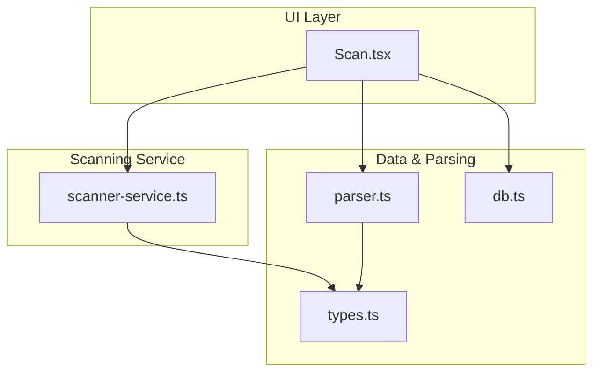
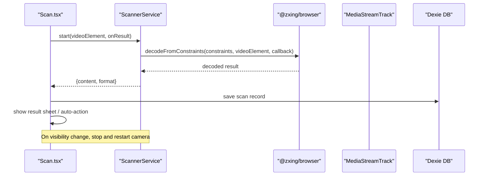
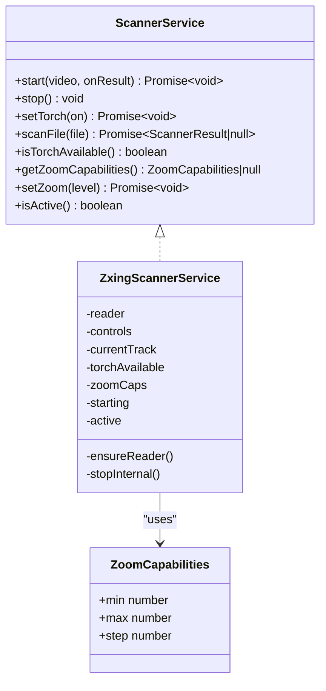
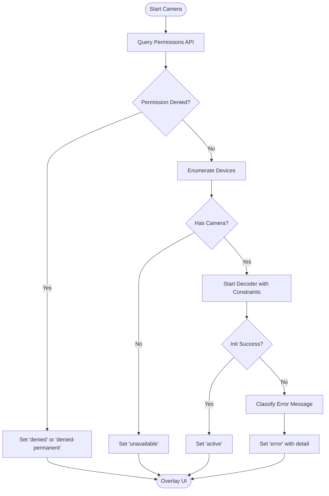
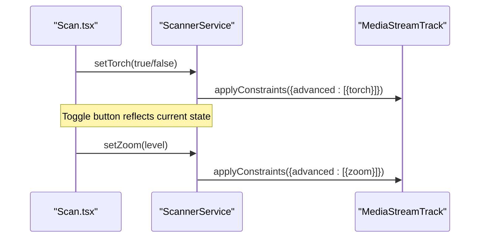
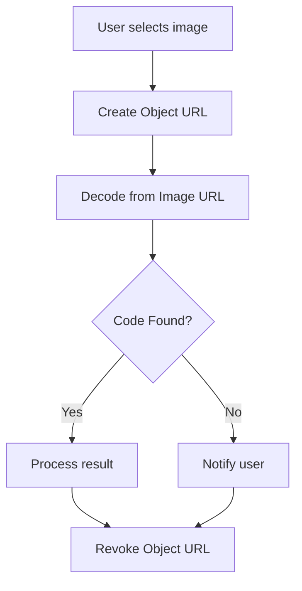
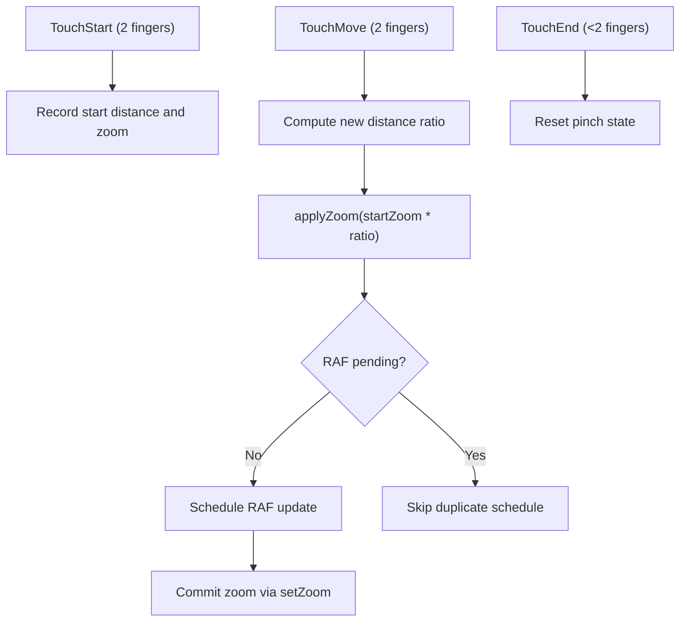
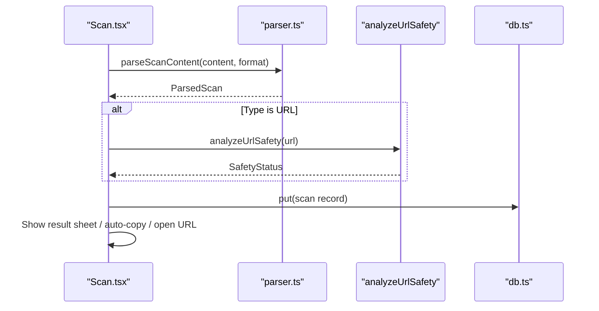
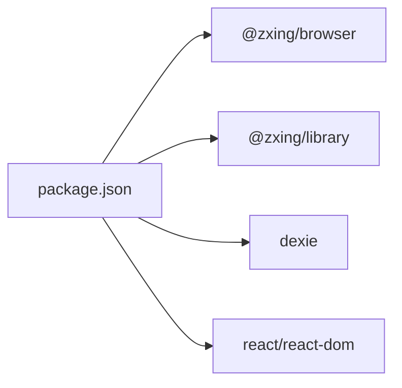

# Barcode Scanning System

<cite>
**Referenced Files in This Document**
- [scanner-service.ts](file://src/lib/scanner-service.ts)
- [Scan.tsx](file://src/pages/Scan.tsx)
- [types.ts](file://src/lib/scan/types.ts)
- [parser.ts](file://src/lib/scan/parser.ts)
- [db.ts](file://src/lib/db.ts)
- [package.json](file://package.json)
</cite>

## Table of Contents
1. [Introduction](#introduction)
2. [Project Structure](#project-structure)
3. [Core Components](#core-components)
4. [Architecture Overview](#architecture-overview)
5. [Detailed Component Analysis](#detailed-component-analysis)
6. [Dependency Analysis](#dependency-analysis)
7. [Performance Considerations](#performance-considerations)
8. [Troubleshooting Guide](#troubleshooting-guide)
9. [Conclusion](#conclusion)

## Introduction
This document explains the barcode scanning system implemented in the project. It covers camera integration via the MediaDevices API, permission handling and error states (denied, unavailable, loading, active), supported barcode formats, the ScannerService singleton pattern, camera controls (torch and zoom), file-based scanning fallback, pinch-to-zoom gesture handling, touch interactions, responsive design considerations, performance optimizations such as debounced zoom updates and camera resource management, and browser compatibility requirements with mobile-specific features.

## Project Structure
The scanning feature is primarily implemented across:
- A service layer that encapsulates camera access, decoding, and device capabilities
- A React page that orchestrates UI state, user interactions, and result processing
- Shared types and a parser for interpreting scanned content
- Local storage for scan history

**Diagram sources**
- [Scan.tsx:1-488](file://src/pages/Scan.tsx#L1-L488)
- [scanner-service.ts:1-198](file://src/lib/scanner-service.ts#L1-L198)
- [types.ts:1-49](file://src/lib/scan/types.ts#L1-L49)
- [parser.ts:1-102](file://src/lib/scan/parser.ts#L1-L102)
- [db.ts:1-36](file://src/lib/db.ts#L1-L36)

**Section sources**
- [Scan.tsx:1-488](file://src/pages/Scan.tsx#L1-L488)
- [scanner-service.ts:1-198](file://src/lib/scanner-service.ts#L1-L198)
- [types.ts:1-49](file://src/lib/scan/types.ts#L1-L49)
- [parser.ts:1-102](file://src/lib/scan/parser.ts#L1-L102)
- [db.ts:1-36](file://src/lib/db.ts#L1-L36)

## Core Components
- ScannerService: Encapsulates camera stream lifecycle, decoding, torch and zoom control, and file-based scanning. Implements a singleton accessor to ensure a single instance per app lifetime.
- Scan Screen: Manages camera permissions, device enumeration, error overlays, UI state transitions, pinch-to-zoom gestures, and result handling.
- Types and Parser: Define supported formats and parse raw content into structured data for actions like opening URLs or copying text.
- Database: Stores scan records and prunes older entries to keep history manageable.

Key responsibilities:
- Camera integration and constraints
- Permission checks and robust error mapping
- Torch and zoom capability probing and application
- File-based scanning fallback
- Gesture-driven zoom with requestAnimationFrame throttling
- Result parsing, safety checks, and auto-actions based on settings

**Section sources**
- [scanner-service.ts:14-23](file://src/lib/scanner-service.ts#L14-L23)
- [scanner-service.ts:42-197](file://src/lib/scanner-service.ts#L42-L197)
- [Scan.tsx:23-208](file://src/pages/Scan.tsx#L23-L208)
- [types.ts:1-49](file://src/lib/scan/types.ts#L1-L49)
- [parser.ts:12-101](file://src/lib/scan/parser.ts#L12-L101)
- [db.ts:1-36](file://src/lib/db.ts#L1-L36)

## Architecture Overview
The system uses a layered architecture:
- UI layer (React component) handles user input, visibility changes, and renders overlays and controls
- Service layer abstracts media devices and ZXing decoding
- Data layer persists results and manages history pruning

**Diagram sources**
- [Scan.tsx:104-180](file://src/pages/Scan.tsx#L104-L180)
- [scanner-service.ts:80-131](file://src/lib/scanner-service.ts#L80-L131)
- [db.ts:1-36](file://src/lib/db.ts#L1-L36)

## Detailed Component Analysis

### ScannerService Singleton and Camera Integration
- Singleton pattern: A module-level variable holds the only instance; getScannerService returns it lazily.
- Lazy initialization: The ZXing reader is created on first use with dynamic imports to reduce initial bundle size.
- Decoding pipeline: Uses BrowserMultiFormatReader with configured hints for supported formats and a delay between attempts to balance accuracy and performance.
- Camera constraints: Requests an environment-facing camera with ideal resolution; audio disabled.
- Capability probing: After the stream starts, probes torch availability and zoom capabilities from the track’s capabilities.
- Resource management: Stops decoder controls and stops the underlying MediaStreamTrack when stopping; resets internal flags and capabilities.

Supported formats are explicitly configured and mapped to internal type values.

**Diagram sources**
- [scanner-service.ts:14-23](file://src/lib/scanner-service.ts#L14-L23)
- [scanner-service.ts:42-197](file://src/lib/scanner-service.ts#L42-L197)

**Section sources**
- [scanner-service.ts:193-197](file://src/lib/scanner-service.ts#L193-L197)
- [scanner-service.ts:51-74](file://src/lib/scanner-service.ts#L51-L74)
- [scanner-service.ts:80-131](file://src/lib/scanner-service.ts#L80-L131)
- [scanner-service.ts:133-149](file://src/lib/scanner-service.ts#L133-L149)
- [scanner-service.ts:155-174](file://src/lib/scanner-service.ts#L155-L174)
- [scanner-service.ts:176-190](file://src/lib/scanner-service.ts#L176-L190)

### Supported Barcode Formats
The scanner supports the following formats through ZXing configuration and type mapping:
- QR_CODE
- EAN_13, EAN_8
- UPC_A, UPC_E
- CODE_128, CODE_39, CODE_93
- ITF
- DATA_MATRIX
- PDF_417
- AZTEC
- UNKNOWN (fallback when format cannot be determined)

These are declared in both the service’s format map and the shared types.

**Section sources**
- [scanner-service.ts:25-40](file://src/lib/scanner-service.ts#L25-L40)
- [types.ts:1-14](file://src/lib/scan/types.ts#L1-L14)

### Permission Handling and Error States
The screen implements comprehensive permission and device checks:
- Pre-flight permission query using Permissions API where available
- Device enumeration to detect presence of cameras
- Robust error classification into distinct states:
  - denied: temporary denial
  - denied-permanent: persistent denial requiring user action
  - unavailable: no camera devices found
  - loading: initializing camera
  - active: camera running and scanning
  - error: initialization failure with optional detail message

**Diagram sources**
- [Scan.tsx:104-180](file://src/pages/Scan.tsx#L104-L180)

**Section sources**
- [Scan.tsx:104-180](file://src/pages/Scan.tsx#L104-L180)
- [Scan.tsx:277-349](file://src/pages/Scan.tsx#L277-L349)

### Camera Controls: Torch and Zoom
- Torch: Toggled via applyConstraints on the active MediaStreamTrack; availability probed after stream start.
- Zoom: Probed from track capabilities; clamped to min/max; applied via advanced constraints. UI exposes a slider and pinch-to-zoom.

**Diagram sources**
- [scanner-service.ts:155-174](file://src/lib/scanner-service.ts#L155-L174)
- [Scan.tsx:210-232](file://src/pages/Scan.tsx#L210-L232)

**Section sources**
- [scanner-service.ts:107-127](file://src/lib/scanner-service.ts#L107-L127)
- [scanner-service.ts:155-174](file://src/lib/scanner-service.ts#L155-L174)
- [Scan.tsx:210-232](file://src/pages/Scan.tsx#L210-L232)

### File-Based Scanning Fallback
When camera is not available or the user prefers, the system can scan images from files:
- Triggers a hidden file input for image selection
- Creates an object URL for the selected file
- Decodes via the same ZXing reader
- Revokes the object URL to free memory
- Returns null if no code is found

**Diagram sources**
- [scanner-service.ts:176-190](file://src/lib/scanner-service.ts#L176-L190)
- [Scan.tsx:254-268](file://src/pages/Scan.tsx#L254-L268)

**Section sources**
- [scanner-service.ts:176-190](file://src/lib/scanner-service.ts#L176-L190)
- [Scan.tsx:254-268](file://src/pages/Scan.tsx#L254-L268)

### Pinch-to-Zoom Gesture Handling and Touch Interactions
- Two-finger distance calculation determines pinch ratio
- Current zoom is scaled by the ratio and clamped to capabilities
- Updates are throttled using requestAnimationFrame to avoid excessive constraint applications
- touchAction is dynamically adjusted to allow custom gestures when zoom is available

**Diagram sources**
- [Scan.tsx:234-252](file://src/pages/Scan.tsx#L234-L252)
- [Scan.tsx:220-232](file://src/pages/Scan.tsx#L220-L232)

**Section sources**
- [Scan.tsx:220-252](file://src/pages/Scan.tsx#L220-L252)

### Responsive Design Considerations
- Video element fills the viewport with object-cover to maintain aspect ratio
- Reticle and controls adapt to viewport width using relative units and max-width constraints
- Safe area padding and backdrop-blur overlays improve readability on various screens
- Slider and labels scale within constrained widths for small devices

[No sources needed since this section provides general guidance]

### Content Parsing and Auto-Actions
After a successful scan:
- Content is parsed to determine type (URL, WiFi, vCard, email, SMS, phone, geo, product, payment, text)
- For URLs, safety analysis is performed; safe URLs may be opened automatically
- Text and WiFi passwords can be copied to clipboard based on user settings
- Results are persisted locally and displayed in a result sheet

**Diagram sources**
- [Scan.tsx:50-102](file://src/pages/Scan.tsx#L50-L102)
- [parser.ts:12-101](file://src/lib/scan/parser.ts#L12-L101)
- [db.ts:1-36](file://src/lib/db.ts#L1-L36)

**Section sources**
- [Scan.tsx:50-102](file://src/pages/Scan.tsx#L50-L102)
- [parser.ts:12-101](file://src/lib/scan/parser.ts#L12-L101)
- [db.ts:1-36](file://src/lib/db.ts#L1-L36)

## Dependency Analysis
External dependencies relevant to scanning:
- @zxing/browser and @zxing/library provide multi-format barcode decoding
- Dexie wraps IndexedDB for local persistence
- React ecosystem components render UI and handle interactions

**Diagram sources**
- [package.json:16-46](file://package.json#L16-L46)

**Section sources**
- [package.json:16-46](file://package.json#L16-L46)

## Performance Considerations
- Debounced zoom updates: Zoom changes are batched via requestAnimationFrame to minimize constraint churn and improve responsiveness during pinch gestures.
- Camera resource management: The service stops decoder controls and the underlying MediaStreamTrack on stop, preventing leaks and freeing hardware resources.
- Visibility handling: Camera is stopped when the tab becomes hidden and restarted when visible, reducing background battery usage.
- Decoding cadence: A delay between scan attempts reduces CPU load while maintaining detection reliability.
- Memory hygiene: Object URLs for file scanning are revoked immediately after use.

[No sources needed since this section provides general guidance]

## Troubleshooting Guide
Common issues and their indicators:
- Permission denied:
  - Temporary denial: Prompt user to retry
  - Permanent denial: Direct user to system settings to enable camera access
- No camera devices:
  - Indicates device lacks a camera or enumeration failed; offer file-based scanning fallback
- Initialization errors:
  - NotReadable, TrackStartError, AbortError, or “could not start” suggest hardware or OS-level restrictions; guide users to try again or switch browsers
- Torch or zoom not working:
  - Feature availability depends on device and browser; gracefully degrade UI when capabilities are absent

Operational tips:
- Use the manual entry mode when scanning fails
- Prefer rear camera orientation for better focus and lighting
- Ensure adequate lighting; toggle torch when available

**Section sources**
- [Scan.tsx:158-180](file://src/pages/Scan.tsx#L158-L180)
- [Scan.tsx:277-349](file://src/pages/Scan.tsx#L277-L349)

## Conclusion
The barcode scanning system combines a robust service layer with a responsive UI to deliver reliable scanning across devices. It leverages MediaDevices for camera access, ZXing for decoding, and Dexie for persistence. The implementation includes thoughtful UX patterns for permissions, error states, and interactive controls like torch and pinch-to-zoom. Performance is optimized through throttled zoom updates, careful resource cleanup, and visibility-aware lifecycle management. With broad format support and a file-based fallback, the system balances usability and resilience across diverse environments.