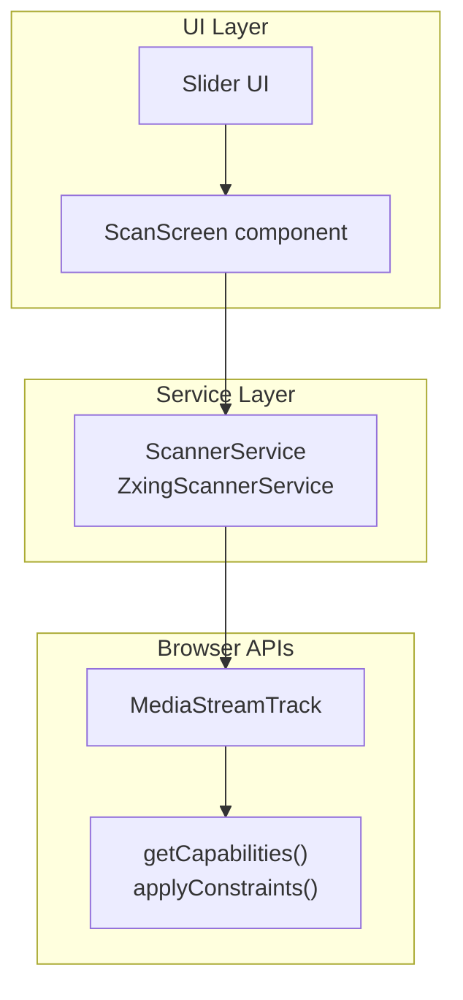
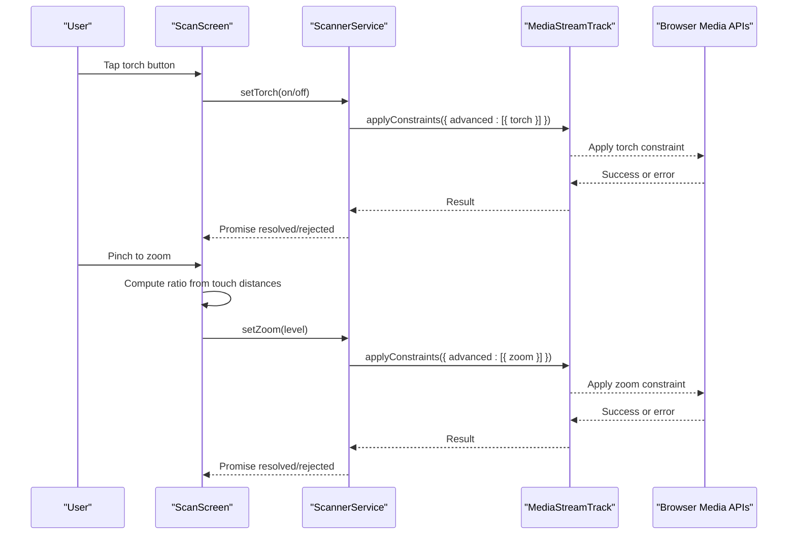
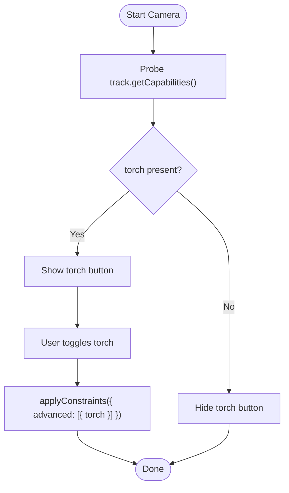
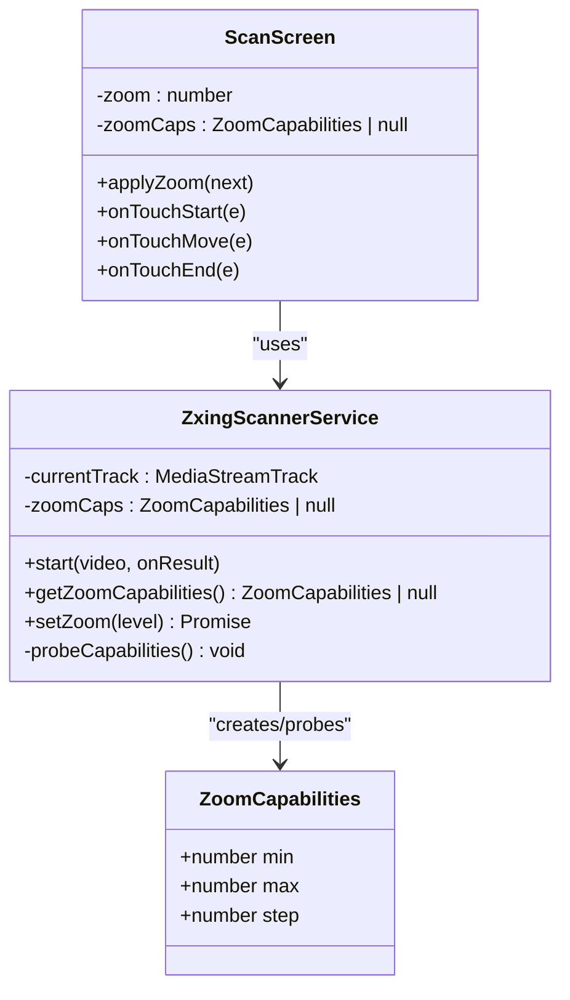
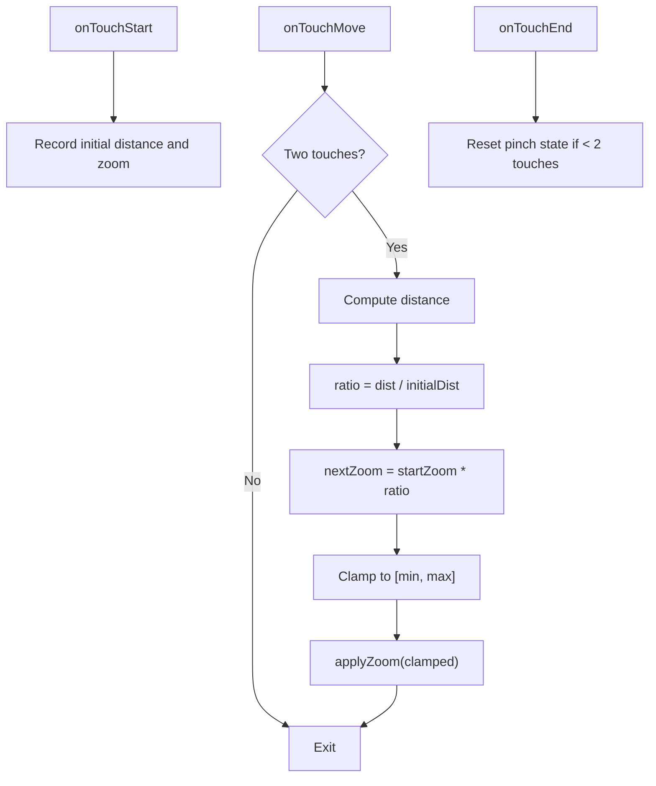
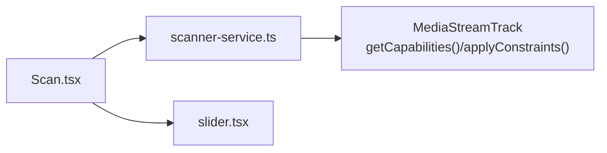

# Camera Controls

<cite>
**Referenced Files in This Document**
- [Scan.tsx](file://src/pages/Scan.tsx)
- [scanner-service.ts](file://src/lib/scanner-service.ts)
- [slider.tsx](file://src/components/ui/slider.tsx)
</cite>

## Table of Contents
1. [Introduction](#introduction)
2. [Project Structure](#project-structure)
3. [Core Components](#core-components)
4. [Architecture Overview](#architecture-overview)
5. [Detailed Component Analysis](#detailed-component-analysis)
6. [Dependency Analysis](#dependency-analysis)
7. [Performance Considerations](#performance-considerations)
8. [Troubleshooting Guide](#troubleshooting-guide)
9. [Conclusion](#conclusion)

## Introduction
This document explains the camera control features implemented in the application, focusing on:
- Torch/flash control using MediaTrackConstraints with advanced.torch and capability detection via getCapabilities()
- Graceful fallback when torch is unsupported
- Zoom functionality including pinch-to-zoom gesture handling, zoom range detection (min/max/step), and constraint application
- Touch interaction patterns and responsive design considerations for different screen sizes
- Performance optimization techniques such as debounced zoom updates
- Cross-device compatibility issues and troubleshooting guidance for common camera control problems

## Project Structure
The camera controls are primarily implemented across two files:
- A React page that renders the camera UI, handles user interactions, and manages state for torch and zoom
- A scanner service that encapsulates MediaStreamTrack operations, capability probing, and constraint application

**Diagram sources**
- [Scan.tsx:23-478](file://src/pages/Scan.tsx#L23-L478)
- [scanner-service.ts:42-197](file://src/lib/scanner-service.ts#L42-L197)
- [slider.tsx:6-20](file://src/components/ui/slider.tsx#L6-L20)

**Section sources**
- [Scan.tsx:23-478](file://src/pages/Scan.tsx#L23-L478)
- [scanner-service.ts:42-197](file://src/lib/scanner-service.ts#L42-L197)
- [slider.tsx:6-20](file://src/components/ui/slider.tsx#L6-L20)

## Core Components
- ScannerService: Encapsulates camera stream lifecycle, capability probing, and constraint application for torch and zoom. It exposes methods to start/stop scanning, toggle torch, set zoom, and query capabilities.
- ScanScreen: Renders the camera view, overlays controls (torch button, zoom slider), handles touch gestures for pinch-to-zoom, and coordinates with ScannerService.
- Slider UI: A Radix-based slider used to adjust zoom level within device-reported min/max/step ranges.

Key responsibilities:
- Capability detection: After starting the stream, the service probes torch availability and zoom range via track.getCapabilities().
- Constraint application: Both torch and zoom are applied through track.applyConstraints({ advanced: [...] }).
- Gesture handling: The UI listens for two-finger touch events to compute distance ratios and update zoom smoothly.
- Debouncing: Zoom updates are throttled per frame using requestAnimationFrame to avoid excessive applyConstraints calls.

**Section sources**
- [scanner-service.ts:107-127](file://src/lib/scanner-service.ts#L107-L127)
- [scanner-service.ts:155-170](file://src/lib/scanner-service.ts#L155-L170)
- [Scan.tsx:210-232](file://src/pages/Scan.tsx#L210-L232)
- [slider.tsx:6-20](file://src/components/ui/slider.tsx#L6-L20)

## Architecture Overview
The system follows a clear separation between UI and service layers:
- UI layer (ScanScreen) manages user interactions and visual feedback
- Service layer (ScannerService) abstracts browser media APIs and enforces constraints
- Browser APIs provide MediaStreamTrack capabilities and constraint application

**Diagram sources**
- [Scan.tsx:210-232](file://src/pages/Scan.tsx#L210-L232)
- [scanner-service.ts:155-170](file://src/lib/scanner-service.ts#L155-L170)

## Detailed Component Analysis

### Torch Control Implementation
- Capability detection: After the stream starts, the service retrieves the video track and calls getCapabilities(). If the returned object includes a torch property, torch is considered available.
- Applying torch: When the user toggles the torch, the UI calls setTorch(next). The service applies an advanced constraint with { torch: on } to the current track.
- Graceful fallback: If torch is not supported by the device/browser, the capability probe returns false and the UI hides the torch button. Calls to setTorch are wrapped in try/catch; unsupported constraints are ignored.

**Diagram sources**
- [scanner-service.ts:107-127](file://src/lib/scanner-service.ts#L107-L127)
- [scanner-service.ts:165-170](file://src/lib/scanner-service.ts#L165-L170)
- [Scan.tsx:381-394](file://src/pages/Scan.tsx#L381-L394)

**Section sources**
- [scanner-service.ts:107-127](file://src/lib/scanner-service.ts#L107-L127)
- [scanner-service.ts:165-170](file://src/lib/scanner-service.ts#L165-L170)
- [Scan.tsx:381-394](file://src/pages/Scan.tsx#L381-L394)

### Zoom Functionality
- Range detection: The service inspects track.getCapabilities().zoom. If it is an object with max greater than min, the service normalizes it into a ZoomCapabilities shape with min, max, and step (defaulting step to a small positive value if missing).
- Constraint application: setZoom(level) clamps the requested level to [min, max] and applies it via track.applyConstraints({ advanced: [{ zoom }] }).
- UI integration: The UI shows a slider bounded by the detected min/max/step and displays the current zoom factor.

**Diagram sources**
- [scanner-service.ts:8-12](file://src/lib/scanner-service.ts#L8-L12)
- [scanner-service.ts:107-127](file://src/lib/scanner-service.ts#L107-L127)
- [scanner-service.ts:155-163](file://src/lib/scanner-service.ts#L155-L163)
- [Scan.tsx:220-232](file://src/pages/Scan.tsx#L220-L232)

**Section sources**
- [scanner-service.ts:107-127](file://src/lib/scanner-service.ts#L107-L127)
- [scanner-service.ts:155-163](file://src/lib/scanner-service.ts#L155-L163)
- [Scan.tsx:220-232](file://src/pages/Scan.tsx#L220-L232)

### Pinch-to-Zoom Gesture Handling
- Two-finger tracking: onTouchStart records initial finger positions and the current zoom. onTouchMove computes the distance between fingers and derives a ratio relative to the initial distance.
- Ratio application: The new zoom is computed as pinchStartZoom * ratio, then clamped to the device’s min/max and applied.
- Event prevention: During pinch moves, the handler prevents default to avoid browser scrolling/zooming.

**Diagram sources**
- [Scan.tsx:234-252](file://src/pages/Scan.tsx#L234-L252)
- [Scan.tsx:220-232](file://src/pages/Scan.tsx#L220-L232)

**Section sources**
- [Scan.tsx:234-252](file://src/pages/Scan.tsx#L234-L252)
- [Scan.tsx:220-232](file://src/pages/Scan.tsx#L220-L232)

### Responsive Design Considerations
- The zoom slider container uses width constraints based on viewport width to ensure usability across devices.
- The reticle and overlay elements adapt to screen size using percentage-based sizing and safe area insets.
- The slider itself is configured with touch-none to prevent native touch behaviors from interfering with custom gesture handling.

**Section sources**
- [Scan.tsx:410-428](file://src/pages/Scan.tsx#L410-L428)
- [slider.tsx:10-19](file://src/components/ui/slider.tsx#L10-L19)

### Performance Optimization Techniques
- Debounced zoom updates: applyZoom batches zoom changes using requestAnimationFrame. Only one applyConstraints call per frame is issued, preventing excessive reconfiguration of the track.
- Clamping values: All zoom levels are clamped to the device’s reported min/max before applying constraints, reducing invalid attempts.
- Conditional rendering: The torch button and zoom slider are only shown when capabilities are confirmed, avoiding unnecessary UI work.

**Section sources**
- [Scan.tsx:220-232](file://src/pages/Scan.tsx#L220-L232)
- [scanner-service.ts:155-163](file://src/lib/scanner-service.ts#L155-L163)

## Dependency Analysis
The following diagram maps dependencies among the core components involved in camera controls:

**Diagram sources**
- [Scan.tsx:23-478](file://src/pages/Scan.tsx#L23-L478)
- [scanner-service.ts:42-197](file://src/lib/scanner-service.ts#L42-L197)
- [slider.tsx:6-20](file://src/components/ui/slider.tsx#L6-L20)

**Section sources**
- [Scan.tsx:23-478](file://src/pages/Scan.tsx#L23-L478)
- [scanner-service.ts:42-197](file://src/lib/scanner-service.ts#L42-L197)
- [slider.tsx:6-20](file://src/components/ui/slider.tsx#L6-L20)

## Performance Considerations
- Use requestAnimationFrame to throttle zoom updates, ensuring smooth interactions without overloading the camera pipeline.
- Avoid frequent applyConstraints calls by clamping and batching values.
- Keep UI minimal and conditional on capability results to reduce render overhead.
- Ensure touchAction is set appropriately to prevent conflicting gestures while maintaining responsiveness.

[No sources needed since this section provides general guidance]

## Troubleshooting Guide
Common issues and resolutions:
- Torch not visible: Capability probe did not detect torch. The UI hides the torch button automatically. Verify device support and permissions.
- Zoom slider not shown: Device does not report zoom capabilities or the range is invalid. The UI falls back to a hint message instead of showing the slider.
- Pinch-to-zoom not working: Ensure two-finger gestures are recognized and that touchAction allows custom handling. Confirm that zoomCaps is available before enabling pinch logic.
- Unexpected errors during torch/zoom: The service wraps applyConstraints in try/catch and ignores unsupported constraints. Check console logs for underlying errors and verify browser/device support.

**Section sources**
- [scanner-service.ts:107-127](file://src/lib/scanner-service.ts#L107-L127)
- [scanner-service.ts:155-170](file://src/lib/scanner-service.ts#L155-L170)
- [Scan.tsx:210-232](file://src/pages/Scan.tsx#L210-L232)
- [Scan.tsx:410-436](file://src/pages/Scan.tsx#L410-L436)

## Conclusion
The camera controls implement robust torch and zoom features by leveraging MediaTrackConstraints and capability detection. The architecture cleanly separates UI concerns from service-level media operations, providing graceful fallbacks when features are unsupported. Touch interactions are handled efficiently with debounced updates and proper event management, ensuring responsive performance across devices.

[No sources needed since this section summarizes without analyzing specific files]