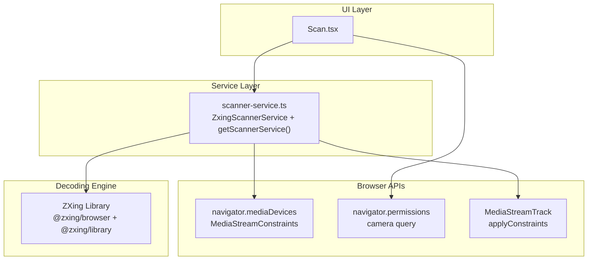
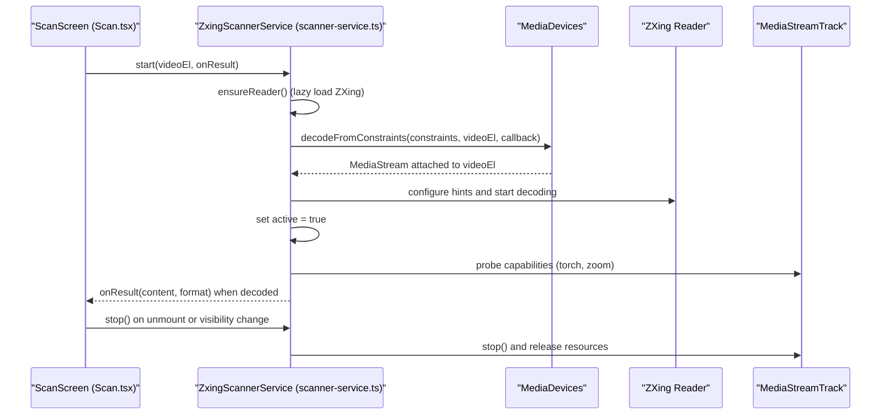
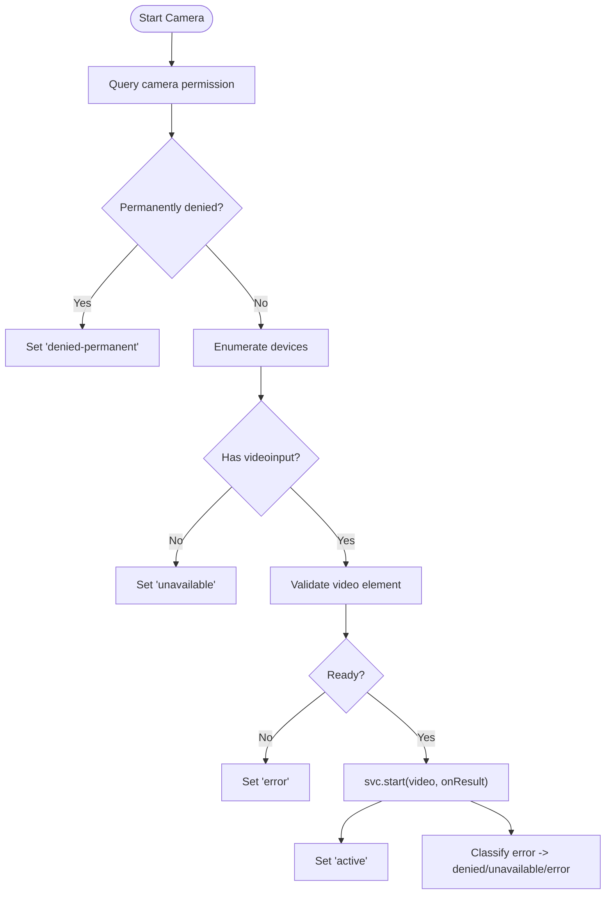
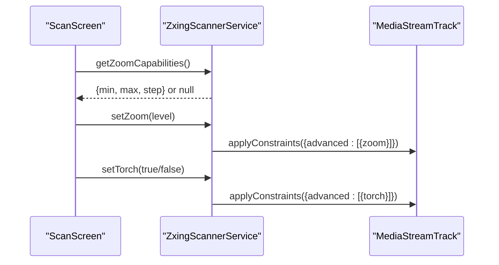
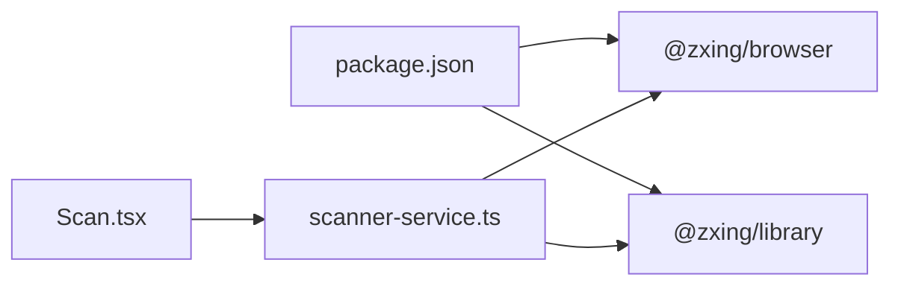

# Camera Integration

<cite>
**Referenced Files in This Document**
- [scanner-service.ts](file://src/lib/scanner-service.ts)
- [Scan.tsx](file://src/pages/Scan.tsx)
- [package.json](file://package.json)
</cite>

## Table of Contents
1. [Introduction](#introduction)
2. [Project Structure](#project-structure)
3. [Core Components](#core-components)
4. [Architecture Overview](#architecture-overview)
5. [Detailed Component Analysis](#detailed-component-analysis)
6. [Dependency Analysis](#dependency-analysis)
7. [Performance Considerations](#performance-considerations)
8. [Troubleshooting Guide](#troubleshooting-guide)
9. [Conclusion](#conclusion)

## Introduction
This document explains how the barcode scanning system integrates with device cameras using browser APIs, focusing on:
- MediaDevices API usage and permission handling
- Error states for camera lifecycle (loading, active, denied, unavailable)
- ScannerService singleton pattern and lazy loading of ZXing
- Camera resource management and concurrent start prevention
- Constraints configuration for optimal scanning performance
- Browser compatibility considerations and fallback mechanisms

## Project Structure
The camera integration spans two primary modules:
- A service layer that encapsulates ZXing decoding and camera track control
- A React page that orchestrates UI state, permissions, and user interactions



**Diagram sources**
- [scanner-service.ts:42-131](file://src/lib/scanner-service.ts#L42-L131)
- [Scan.tsx:104-180](file://src/pages/Scan.tsx#L104-L180)

**Section sources**
- [scanner-service.ts:1-197](file://src/lib/scanner-service.ts#L1-L197)
- [Scan.tsx:1-488](file://src/pages/Scan.tsx#L1-L488)

## Core Components
- ZxingScannerService: Implements a unified interface for starting/stopping camera-based scanning, torch control, zoom control, and file-based scanning. It lazily loads ZXing and manages MediaStreamTrack resources.
- getScannerService(): Provides a singleton instance to ensure a single camera session across the app.
- ScanScreen: Manages camera permission checks, enumerates devices, renders overlays for error states, and handles user controls (torch, pinch-to-zoom, manual input, image upload).

Key responsibilities:
- Permission probing via navigator.permissions where supported
- Device enumeration via navigator.mediaDevices.enumerateDevices
- Starting decoding with decodeFromConstraints and binding to an HTMLVideoElement
- Probing torch and zoom capabilities after stream initialization
- Resource cleanup on stop and visibility changes

**Section sources**
- [scanner-service.ts:14-23](file://src/lib/scanner-service.ts#L14-L23)
- [scanner-service.ts:42-131](file://src/lib/scanner-service.ts#L42-L131)
- [scanner-service.ts:193-197](file://src/lib/scanner-service.ts#L193-L197)
- [Scan.tsx:23-180](file://src/pages/Scan.tsx#L23-L180)

## Architecture Overview
The flow begins at the UI, which probes permissions and device availability before delegating to the scanner service. The service initializes ZXing on demand, requests a video stream with constraints, and starts decoding. After the stream is ready, it probes torch and zoom capabilities and exposes them to the UI.



**Diagram sources**
- [scanner-service.ts:51-131](file://src/lib/scanner-service.ts#L51-L131)
- [Scan.tsx:104-180](file://src/pages/Scan.tsx#L104-L180)

## Detailed Component Analysis

### ScannerService Singleton and Lazy Loading
- Singleton: getScannerService returns a single instance to avoid multiple camera sessions and conflicting tracks.
- Lazy loading: ZXing modules are dynamically imported only when needed, reducing initial bundle size and startup time.
- Concurrency guard: An internal flag prevents overlapping start calls; if a start is already in progress, subsequent calls return early.
- Resource management: On stop, the service halts decoding controls, stops the current track, and resets capability flags.

```mermaid
classDiagram
class ZxingScannerService {
-reader : BrowserMultiFormatReader | null
-controls : { stop() } | null
-currentTrack : MediaStreamTrack | null
-torchAvailable : boolean
-zoomCaps : ZoomCapabilities | null
-starting : boolean
-active : boolean
+start(video, onResult) Promise~void~
+stop() void
+setTorch(on) Promise~void~
+scanFile(file) Promise~ScannerResult|null~
+isTorchAvailable() boolean
+getZoomCapabilities() ZoomCapabilities|null
+setZoom(level) Promise~void~
+isActive() boolean
-ensureReader() Promise~BrowserMultiFormatReader~
-stopInternal() void
}
class ScannerService {
<<interface>>
+start(video, onResult) Promise~void~
+stop() void
+setTorch(on) Promise~void~
+scanFile(file) Promise~ScannerResult|null~
+isTorchAvailable() boolean
+getZoomCapabilities() ZoomCapabilities|null
+setZoom(level) Promise~void~
+isActive() boolean
}
ZxingScannerService ..|> ScannerService
```

**Diagram sources**
- [scanner-service.ts:14-23](file://src/lib/scanner-service.ts#L14-L23)
- [scanner-service.ts:42-197](file://src/lib/scanner-service.ts#L42-L197)

**Section sources**
- [scanner-service.ts:42-131](file://src/lib/scanner-service.ts#L42-L131)
- [scanner-service.ts:193-197](file://src/lib/scanner-service.ts#L193-L197)

### MediaDevices API and Permission Handling
- Permission probing: The UI attempts to query camera permission status via navigator.permissions. If permanently denied, it shows a dedicated overlay.
- Device enumeration: Before starting, the UI enumerates available devices to detect presence of videoinput. If none found, it sets an “unavailable” state.
- Start flow: The UI calls the service’s start method with an HTMLVideoElement and a result callback. Errors are categorized into denied, unavailable, or generic error states.



**Diagram sources**
- [Scan.tsx:104-180](file://src/pages/Scan.tsx#L104-L180)

**Section sources**
- [Scan.tsx:104-180](file://src/pages/Scan.tsx#L104-L180)

### Camera Constraints Configuration
- Facing mode: Uses an ideal preference for the rear-facing camera to improve scanning ergonomics on mobile devices.
- Resolution: Width and height are set with ideal values to balance quality and performance.
- Audio disabled: Explicitly disables audio to avoid unnecessary prompts and overhead.

These constraints are passed to the decoder, which uses them to request a suitable stream from the browser.

**Section sources**
- [scanner-service.ts:91-94](file://src/lib/scanner-service.ts#L91-L94)

### Torch and Zoom Controls
- Capability probing: After the stream settles, the service inspects MediaStreamTrack capabilities to determine torch support and zoom range.
- Torch toggle: Applies advanced constraints to enable/disable the flash when supported.
- Zoom slider and pinch-to-zoom: The UI clamps values within reported min/max and applies them via applyConstraints. Pinch gestures compute distance ratios to adjust zoom smoothly.



**Diagram sources**
- [scanner-service.ts:108-170](file://src/lib/scanner-service.ts#L108-L170)
- [Scan.tsx:210-252](file://src/pages/Scan.tsx#L210-L252)

**Section sources**
- [scanner-service.ts:108-170](file://src/lib/scanner-service.ts#L108-L170)
- [Scan.tsx:210-252](file://src/pages/Scan.tsx#L210-L252)

### Error States and Overlays
The UI maintains a typed cameraState with distinct overlays:
- loading: Initial state while attempting to start the camera
- active: Scanning is running
- denied: Temporary denial; retry may succeed
- denied-permanent: Persistent denial; suggests opening system settings
- unavailable: No camera devices detected
- error: Initialization failure with optional detail message

Overlays provide contextual help and alternative actions such as uploading an image or entering text manually.

**Section sources**
- [Scan.tsx:21-37](file://src/pages/Scan.tsx#L21-L37)
- [Scan.tsx:277-349](file://src/pages/Scan.tsx#L277-L349)

### Fallback Mechanisms
- Image upload fallback: When camera access is denied or unavailable, users can scan from a static image.
- Manual entry fallback: Users can type or paste content directly.
- Visibility handling: When the tab becomes hidden, the camera is stopped to free resources; resuming restarts the camera.

**Section sources**
- [Scan.tsx:254-275](file://src/pages/Scan.tsx#L254-L275)
- [Scan.tsx:182-204](file://src/pages/Scan.tsx#L182-L204)

## Dependency Analysis
The scanner relies on external libraries for decoding and uses browser APIs for media access.



**Diagram sources**
- [package.json:27-28](file://package.json#L27-L28)
- [scanner-service.ts:51-74](file://src/lib/scanner-service.ts#L51-L74)

**Section sources**
- [package.json:16-46](file://package.json#L16-L46)
- [scanner-service.ts:51-74](file://src/lib/scanner-service.ts#L51-L74)

## Performance Considerations
- Lazy loading ZXing reduces initial payload and defers heavy work until scanning is initiated.
- Ideal resolution constraints aim for a good trade-off between accuracy and processing speed.
- Debounced zoom updates via requestAnimationFrame prevent excessive constraint churn during rapid gestures.
- Decoding interval is configured to balance responsiveness and CPU usage.

[No sources needed since this section provides general guidance]

## Troubleshooting Guide
Common issues and resolutions:
- Permission denied:
  - If temporarily denied, prompt the user to retry.
  - If permanently denied, guide the user to browser/system settings to allow camera access.
- No camera devices:
  - Show “unavailable” state and suggest using image upload or manual entry.
- Camera initialization errors:
  - Display a friendly message and offer retry or alternative inputs.
- Torch or zoom not working:
  - These features depend on device capability; gracefully hide controls when unsupported.

Operational tips:
- Always stop the camera on unmount or when the tab is hidden to free resources.
- Avoid concurrent starts by relying on the service’s internal guard.

**Section sources**
- [Scan.tsx:158-180](file://src/pages/Scan.tsx#L158-L180)
- [Scan.tsx:182-204](file://src/pages/Scan.tsx#L182-L204)
- [scanner-service.ts:133-149](file://src/lib/scanner-service.ts#L133-L149)

## Conclusion
The camera integration combines robust permission and device checks with a well-encapsulated scanner service. It leverages browser APIs for media access, implements a singleton pattern with lazy loading for efficiency, and provides clear error states and fallbacks. The design supports mobile-specific features like torch and zoom while remaining resilient across varying browser capabilities.