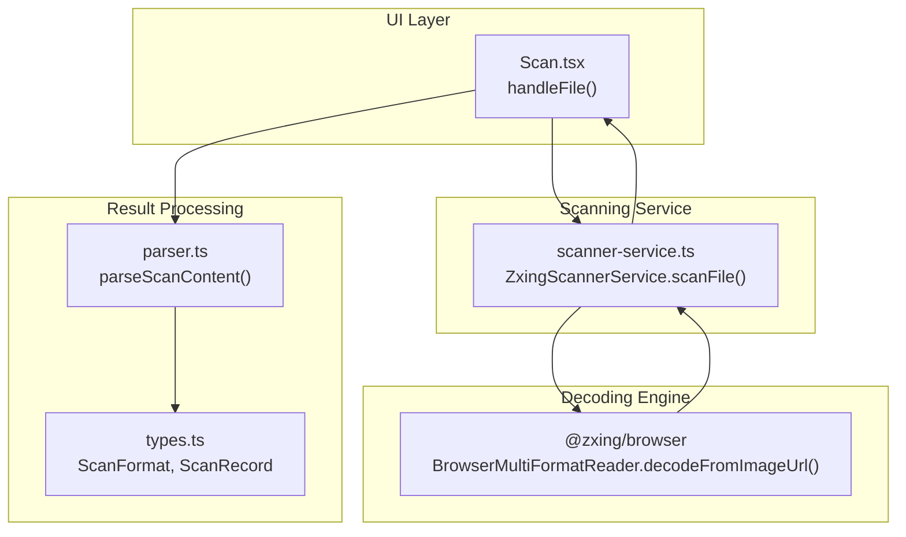
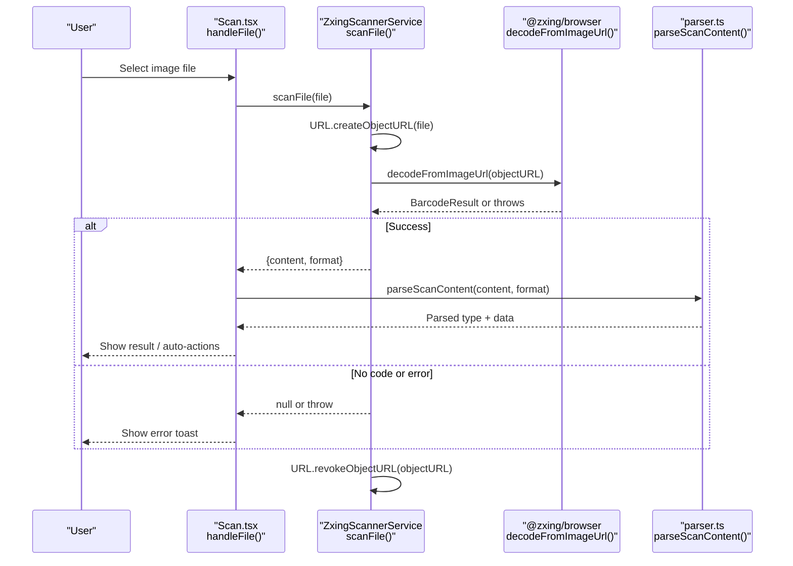
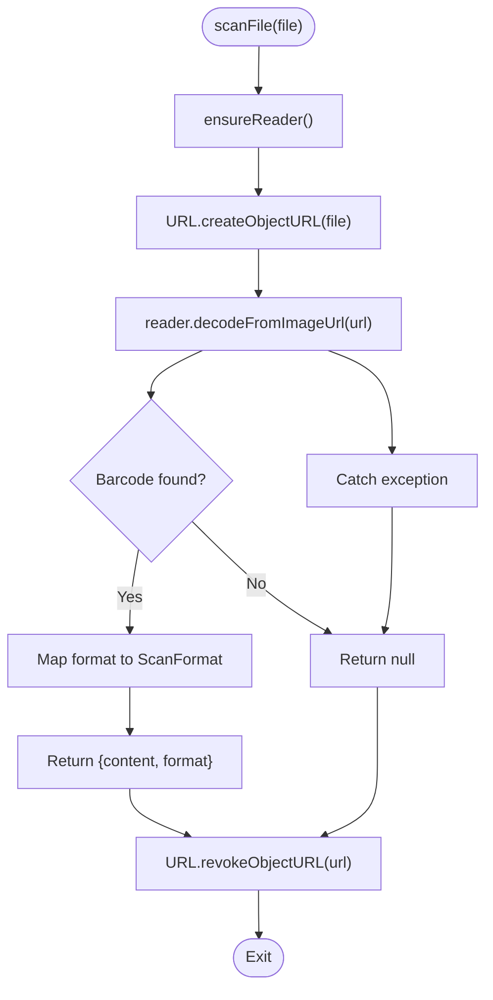
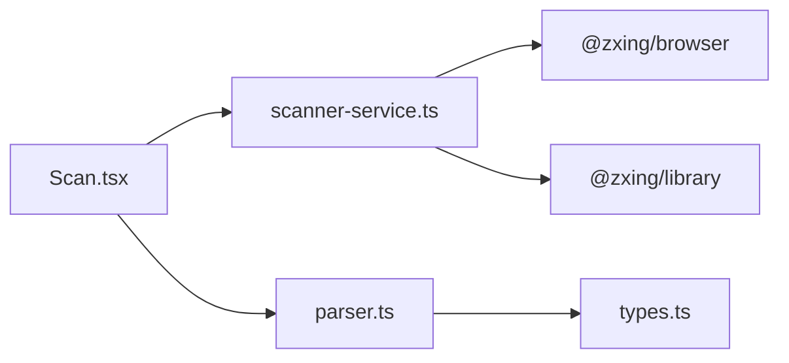

# File-based Scanning

<cite>
**Referenced Files in This Document**
- [scanner-service.ts](file://src/lib/scanner-service.ts)
- [Scan.tsx](file://src/pages/Scan.tsx)
- [types.ts](file://src/lib/scan/types.ts)
- [parser.ts](file://src/lib/scan/parser.ts)
</cite>

## Table of Contents
1. [Introduction](#introduction)
2. [Project Structure](#project-structure)
3. [Core Components](#core-components)
4. [Architecture Overview](#architecture-overview)
5. [Detailed Component Analysis](#detailed-component-analysis)
6. [Dependency Analysis](#dependency-analysis)
7. [Performance Considerations](#performance-considerations)
8. [Troubleshooting Guide](#troubleshooting-guide)
9. [Conclusion](#conclusion)

## Introduction
This document explains the file-based barcode scanning feature as an alternative to camera scanning. It focuses on the scanFile method that uses URL.createObjectURL to pass a selected image to ZXing’s decodeFromImageUrl, and it covers supported formats, error handling, memory management, and best practices for batch operations. The goal is to help developers understand the end-to-end flow from user file selection through decoding and result extraction.

## Project Structure
The file-based scanning path spans three main areas:
- UI trigger and orchestration in the Scan screen
- Core scanning service implementing scanFile
- Type definitions and content parsing utilities

**Diagram sources**
- [Scan.tsx:254-268](file://src/pages/Scan.tsx#L254-L268)
- [scanner-service.ts:176-190](file://src/lib/scanner-service.ts#L176-L190)
- [parser.ts:12-101](file://src/lib/scan/parser.ts#L12-L101)
- [types.ts:1-49](file://src/lib/scan/types.ts#L1-L49)

**Section sources**
- [Scan.tsx:254-268](file://src/pages/Scan.tsx#L254-L268)
- [scanner-service.ts:176-190](file://src/lib/scanner-service.ts#L176-L190)
- [parser.ts:12-101](file://src/lib/scan/parser.ts#L12-L101)
- [types.ts:1-49](file://src/lib/scan/types.ts#L1-L49)

## Core Components
- ScannerService interface and ZxingScannerService implementation provide scanFile(file): Promise<ScannerResult | null>.
- ScanScreen component exposes a hidden file input with accept="image/*" and wires handleFile to invoke getScannerService().scanFile(file).
- Result processing parses raw content into typed structures using parseScanContent and types.

Key responsibilities:
- UI: Trigger file selection, show feedback, and route results.
- Service: Create object URL, call ZXing decoder, map format, revoke object URL.
- Parser: Classify content type (URL, WiFi, vCard, email, SMS, phone, geo, product, payment, text).

**Section sources**
- [scanner-service.ts:14-23](file://src/lib/scanner-service.ts#L14-L23)
- [scanner-service.ts:176-190](file://src/lib/scanner-service.ts#L176-L190)
- [Scan.tsx:254-268](file://src/pages/Scan.tsx#L254-L268)
- [parser.ts:12-101](file://src/lib/scan/parser.ts#L12-L101)
- [types.ts:1-49](file://src/lib/scan/types.ts#L1-L49)

## Architecture Overview
The file-based scanning workflow is a straightforward pipeline:
- User selects an image via the hidden file input.
- The UI calls scanFile with the File object.
- The service creates an object URL and decodes via ZXing.
- On success, the UI processes and persists the result; on failure or no code found, it shows user-friendly errors.

**Diagram sources**
- [Scan.tsx:254-268](file://src/pages/Scan.tsx#L254-L268)
- [scanner-service.ts:176-190](file://src/lib/scanner-service.ts#L176-L190)
- [parser.ts:12-101](file://src/lib/scan/parser.ts#L12-L101)

## Detailed Component Analysis

### File Input and Orchestration (Scan.tsx)
- The Scan screen renders a hidden <input type="file" accept="image/*"> and triggers it via a button.
- handleFile reads the first selected file and calls getScannerService().scanFile(file).
- If scanFile returns null, a “no code found” message is shown; if it throws, an “image scan failed” message is shown.
- On success, the result is passed to handleResult which parses content, persists it, and may perform auto-actions based on settings.

Important notes:
- The input accepts any image MIME type via accept="image/*".
- The UI clears the input value after processing to allow re-selecting the same file.

**Section sources**
- [Scan.tsx:455](file://src/pages/Scan.tsx#L455)
- [Scan.tsx:254-268](file://src/pages/Scan.tsx#L254-L268)
- [Scan.tsx:50-102](file://src/pages/Scan.tsx#L50-L102)

### File Decoding Implementation (scanner-service.ts)
- scanFile ensures the ZXing reader is initialized once and lazily loaded.
- It creates an object URL from the provided File, passes it to decodeFromImageUrl, and maps the returned format string to the app’s ScanFormat enum.
- It always revokes the object URL in a finally block to prevent memory leaks.
- On exceptions or when no code is detected, it returns null rather than throwing.

Supported formats are configured at initialization via DecodeHintType.POSSIBLE_FORMATS and include QR codes, EAN/UPC barcodes, Code 128/39/93, ITF, Data Matrix, PDF 417, and Aztec.

**Diagram sources**
- [scanner-service.ts:51-74](file://src/lib/scanner-service.ts#L51-L74)
- [scanner-service.ts:176-190](file://src/lib/scanner-service.ts#L176-L190)

**Section sources**
- [scanner-service.ts:25-40](file://src/lib/scanner-service.ts#L25-L40)
- [scanner-service.ts:51-74](file://src/lib/scanner-service.ts#L51-L74)
- [scanner-service.ts:176-190](file://src/lib/scanner-service.ts#L176-L190)

### Supported Formats and Content Parsing
- ScanFormat enumerates all recognized barcode symbologies plus UNKNOWN.
- parseScanContent classifies decoded strings into higher-level types such as URL, WiFi, vCard, email, SMS, phone, geo, product, payment, or generic text.

This classification drives UI behavior like auto-copying text or opening safe URLs.

**Section sources**
- [types.ts:1-14](file://src/lib/scan/types.ts#L1-L14)
- [parser.ts:12-101](file://src/lib/scan/parser.ts#L12-L101)

## Dependency Analysis
- Scan.tsx depends on scanner-service.ts for both camera and file scanning.
- scanner-service.ts depends on @zxing/browser and @zxing/library (lazily imported).
- parser.ts and types.ts are used by Scan.tsx to interpret and store results.

**Diagram sources**
- [Scan.tsx:4](file://src/pages/Scan.tsx#L4)
- [scanner-service.ts:52-54](file://src/lib/scanner-service.ts#L52-L54)
- [parser.ts:1](file://src/lib/scan/parser.ts#L1)
- [types.ts:1](file://src/lib/scan/types.ts#L1)

**Section sources**
- [Scan.tsx:4](file://src/pages/Scan.tsx#L4)
- [scanner-service.ts:52-54](file://src/lib/scanner-service.ts#L52-L54)
- [parser.ts:1](file://src/lib/scan/parser.ts#L1)
- [types.ts:1](file://src/lib/scan/types.ts#L1)

## Performance Considerations
- Image size and resolution: Large images increase decode time and memory usage. Consider client-side resizing before decoding if you expect very large uploads.
- Object URL lifecycle: The service correctly revokes object URLs immediately after decoding. Avoid retaining references to the created URL beyond the scope of scanFile.
- Lazy loading: ZXing modules are dynamically imported only when needed, reducing initial bundle cost.
- Single-file focus: The current UI handles one file at a time. For batch scenarios, process files sequentially or with controlled concurrency to avoid UI jank and excessive memory pressure.

[No sources needed since this section provides general guidance]

## Troubleshooting Guide
Common issues and how they are handled:
- No code found: scanFile returns null; the UI displays a “no code found” message.
- Invalid or corrupted image: decodeFromImageUrl may throw; the service catches and returns null; the UI shows an “image scan failed” message.
- Unsupported format: If the image contains a supported barcode but the library cannot detect it, the same “no code found” path applies.
- Memory leaks: Always ensure URL.revokeObjectURL is called; the implementation does so in a finally block.

Operational tips:
- Validate file type and size at the UI layer before calling scanFile to fail fast and improve UX.
- Provide clear user feedback for each outcome (success, no code, error).
- For batch scanning, consider:
  - Limiting concurrent scans (e.g., queue with a small worker pool).
  - Resizing images prior to decoding.
  - Revoking object URLs promptly after each decode.
  - Debouncing rapid successive selections to avoid overload.

**Section sources**
- [Scan.tsx:254-268](file://src/pages/Scan.tsx#L254-L268)
- [scanner-service.ts:176-190](file://src/lib/scanner-service.ts#L176-L190)

## Conclusion
The file-based scanning feature offers a robust alternative to camera scanning by leveraging URL.createObjectURL and ZXing’s decodeFromImageUrl. The implementation cleanly manages object URLs, maps formats to application types, and integrates with result parsing and persistence. With careful attention to image sizing, concurrency, and error messaging, it can scale well for single and batch workflows while maintaining good performance and memory hygiene.