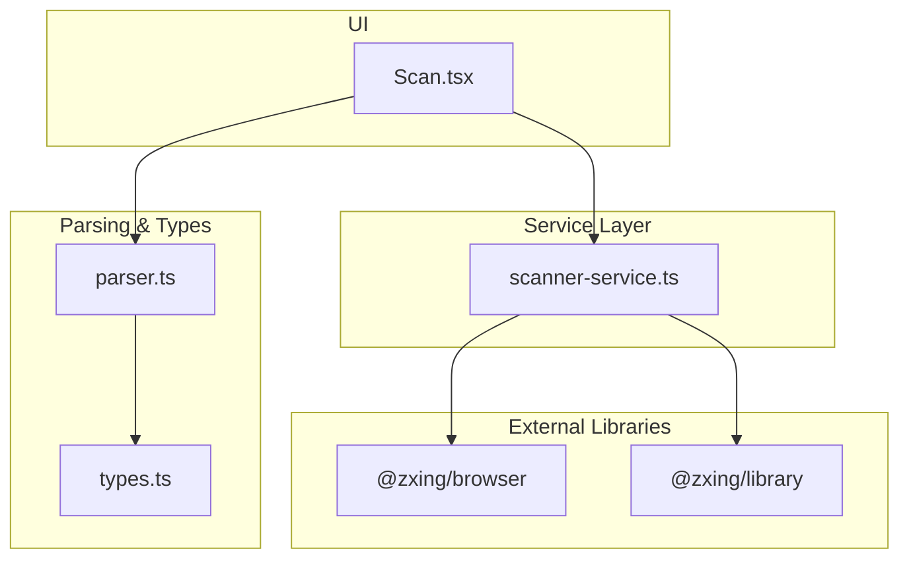
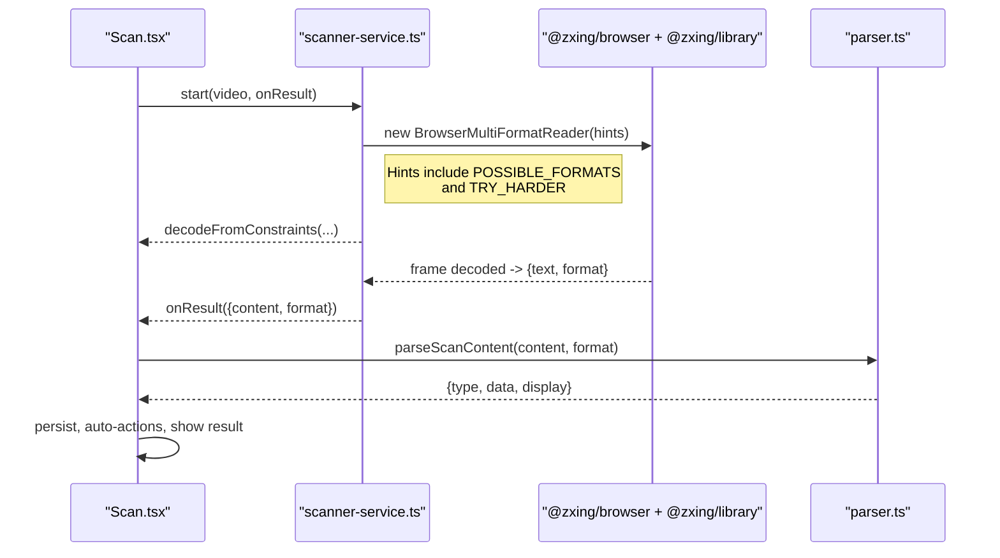
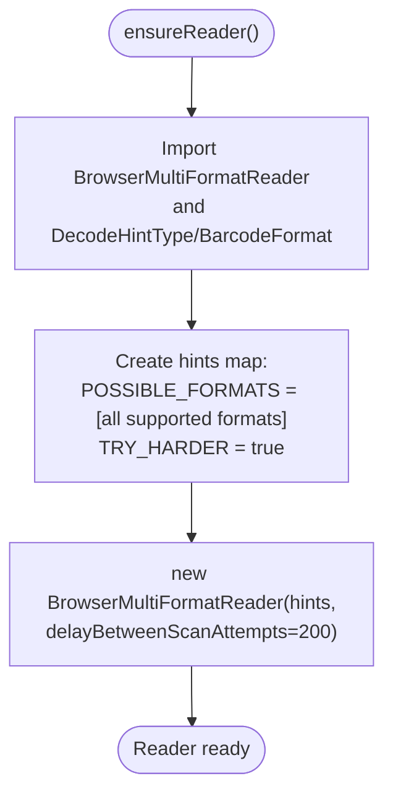
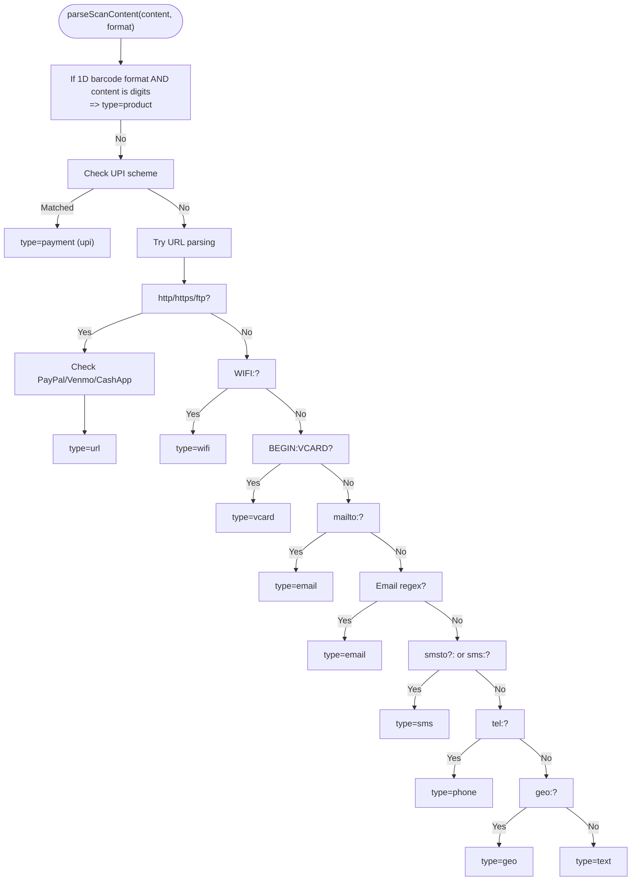
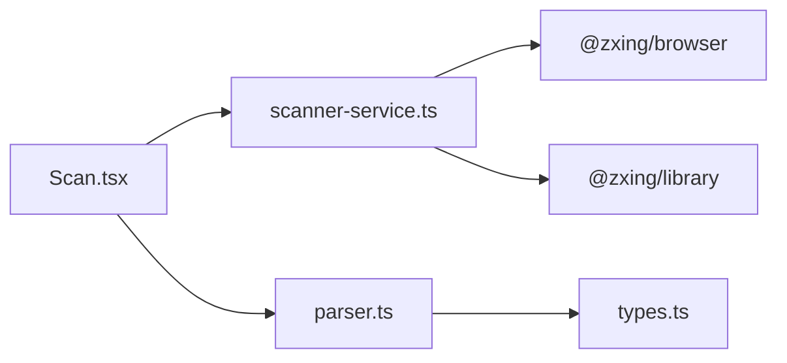

# Supported Barcode Formats

<cite>
**Referenced Files in This Document**
- [scanner-service.ts](file://src/lib/scanner-service.ts)
- [types.ts](file://src/lib/scan/types.ts)
- [parser.ts](file://src/lib/scan/parser.ts)
- [Scan.tsx](file://src/pages/Scan.tsx)
- [package.json](file://package.json)
</cite>

## Table of Contents
1. [Introduction](#introduction)
2. [Project Structure](#project-structure)
3. [Core Components](#core-components)
4. [Architecture Overview](#architecture-overview)
5. [Detailed Component Analysis](#detailed-component-analysis)
6. [Dependency Analysis](#dependency-analysis)
7. [Performance Considerations](#performance-considerations)
8. [Troubleshooting Guide](#troubleshooting-guide)
9. [Conclusion](#conclusion)

## Introduction
This document describes all supported barcode formats in the scanning system and explains how format detection is configured using ZXing’s BrowserMultiFormatReader with DecodeHintType settings. It also outlines format-specific characteristics, common use cases, recognition reliability considerations, typical data patterns, parsing implications, and performance trade-offs when supporting multiple formats simultaneously.

## Project Structure
The scanning pipeline is implemented as a thin service layer over ZXing, integrated into a React UI:
- Scanner service initializes ZXing with explicit format hints and decodes from camera or image files.
- The Scan page orchestrates camera access, result handling, and user actions.
- A parser classifies raw content into semantic types (URL, WiFi, vCard, email, SMS, phone, geo, product, payment, text).
- Types define the canonical set of supported barcode formats.

**Diagram sources**
- [Scan.tsx:104-180](file://src/pages/Scan.tsx#L104-L180)
- [scanner-service.ts:42-74](file://src/lib/scanner-service.ts#L42-L74)
- [parser.ts:12-101](file://src/lib/scan/parser.ts#L12-L101)
- [types.ts:1-14](file://src/lib/scan/types.ts#L1-L14)

**Section sources**
- [scanner-service.ts:1-74](file://src/lib/scanner-service.ts#L1-L74)
- [Scan.tsx:104-180](file://src/pages/Scan.tsx#L104-L180)
- [parser.ts:12-101](file://src/lib/scan/parser.ts#L12-L101)
- [types.ts:1-14](file://src/lib/scan/types.ts#L1-L14)

## Core Components
- Format registry: The application defines a fixed set of supported formats and maps them to internal identifiers.
- Scanner service: Lazily constructs a ZXing reader with DecodeHintType.POSSIBLE_FORMATS including all supported formats and sets TRY_HARDER for improved robustness.
- Content parser: Classifies decoded strings into semantic types based on format hints and content patterns.

Key responsibilities:
- scanner-service.ts: Initializes ZXing with format hints, starts/stops camera decoding, scans images, exposes torch/zoom controls.
- types.ts: Declares the canonical list of supported formats and scan record shape.
- parser.ts: Determines content type (e.g., product, URL, WiFi, vCard, email, SMS, phone, geo, payment, text) and extracts structured fields.
- Scan.tsx: Wires camera lifecycle, result handling, auto-actions, and UI state.

**Section sources**
- [scanner-service.ts:25-74](file://src/lib/scanner-service.ts#L25-L74)
- [types.ts:1-14](file://src/lib/scan/types.ts#L1-L14)
- [parser.ts:12-101](file://src/lib/scan/parser.ts#L12-L101)
- [Scan.tsx:144-180](file://src/pages/Scan.tsx#L144-L180)

## Architecture Overview
The runtime flow for live scanning:
- The Scan page requests camera access and starts the scanner service.
- The scanner service creates a BrowserMultiFormatReader with DecodeHintType configuration that includes all supported formats.
- Frames are decoded; on success, the service emits a result containing raw content and detected format.
- The Scan page parses the content via the parser, persists it, and performs optional auto-actions.

**Diagram sources**
- [Scan.tsx:144-180](file://src/pages/Scan.tsx#L144-L180)
- [scanner-service.ts:51-74](file://src/lib/scanner-service.ts#L51-L74)
- [parser.ts:12-101](file://src/lib/scan/parser.ts#L12-L101)

## Detailed Component Analysis

### Format Detection Mechanism
- Reader initialization: The service lazily imports ZXing modules and builds a Map of DecodeHintType entries.
- Format enumeration: POSSIBLE_FORMATS lists all supported formats explicitly.
- Robustness hint: TRY_HARDER is enabled to improve detection under challenging conditions.
- Result mapping: The raw ZXing format string is mapped to the internal ScanFormat union; unknown values fall back to UNKNOWN.

**Diagram sources**
- [scanner-service.ts:51-74](file://src/lib/scanner-service.ts#L51-L74)

**Section sources**
- [scanner-service.ts:51-74](file://src/lib/scanner-service.ts#L51-L74)
- [types.ts:1-14](file://src/lib/scan/types.ts#L1-L14)

### Supported Formats and Characteristics
The following table summarizes each supported format, its typical characteristics, common use cases, recognition reliability notes, and example data patterns. These descriptions reflect standard specifications and practical behavior observed in web-based scanning.

- QR_CODE
  - Characteristics: 2D matrix code; supports alphanumeric, binary, and various encodings; high capacity.
  - Common uses: URLs, contact info (vCard), Wi-Fi credentials, app links, payments.
  - Reliability: Generally robust; tolerates moderate damage; orientation-independent.
  - Typical patterns: Any printable text; often starts with http(s)://, WIFI:, BEGIN:VCARD, etc.
  - Parsing considerations: Content-type determined by parser after detection.

- EAN_13
  - Characteristics: 13-digit numeric product identifier used globally.
  - Common uses: Retail products, inventory.
  - Reliability: High in good lighting; requires clear bars and quiet zones.
  - Typical patterns: Exactly 13 digits.
  - Parsing considerations: Classified as product if purely numeric.

- EAN_8
  - Characteristics: 8-digit numeric variant of EAN for small packages.
  - Common uses: Small retail items.
  - Reliability: Similar to EAN_13 but shorter; more sensitive to print quality.
  - Typical patterns: Exactly 8 digits.
  - Parsing considerations: Classified as product if purely numeric.

- UPC_A
  - Characteristics: 12-digit numeric identifier primarily in North America.
  - Common uses: Retail products.
  - Reliability: Good under proper conditions; check digit validation is handled by decoder.
  - Typical patterns: Exactly 12 digits.
  - Parsing considerations: Classified as product if purely numeric.

- UPC_E
  - Characteristics: Compressed 8-digit form of UPC-A for small packages.
  - Common uses: Compact retail packaging.
  - Reliability: Comparable to UPC_A; depends on print quality.
  - Typical patterns: 8 digits.
  - Parsing considerations: Classified as product if purely numeric.

- CODE_128
  - Characteristics: High-density 1D linear code; supports full ASCII and extended characters.
  - Common uses: Shipping labels, logistics, asset tracking.
  - Reliability: Strong error correction; widely supported.
  - Typical patterns: Alphanumeric strings; variable length.
  - Parsing considerations: Treated as text unless recognized as a specific protocol by the parser.

- CODE_39
  - Characteristics: 1D linear code; uppercase letters, digits, and some symbols.
  - Common uses: Industrial labeling, healthcare.
  - Reliability: Moderate; needs adequate contrast and spacing.
  - Typical patterns: Uppercase alphanumeric sequences.
  - Parsing considerations: Treated as text unless matched by higher-level parsers.

- CODE_93
  - Characteristics: Enhanced version of Code 39 with higher density and better error checking.
  - Common uses: Logistics and specialized industrial applications.
  - Reliability: Better than Code 39 in similar conditions.
  - Typical patterns: Uppercase alphanumeric sequences.
  - Parsing considerations: Treated as text unless matched by higher-level parsers.

- ITF (Interleaved Two of Five)
  - Characteristics: Numeric-only 1D code; pairs digits for encoding.
  - Common uses: Warehousing, carton labeling.
  - Reliability: Good for large numeric blocks; requires sufficient quiet zones.
  - Typical patterns: Even number of digits.
  - Parsing considerations: Classified as product if purely numeric.

- DATA_MATRIX
  - Characteristics: 2D square matrix; compact, high-capacity.
  - Common uses: Electronics marking, small item labeling.
  - Reliability: Excellent for small areas; tolerant to partial damage.
  - Typical patterns: Binary/text payloads; often short to medium length.
  - Parsing considerations: Content-type determined by parser.

- PDF_417
  - Characteristics: Stacked linear 2D code; high capacity and strong error correction.
  - Common uses: IDs, boarding passes, shipping documents.
  - Reliability: Very robust; works well at lower resolutions.
  - Typical patterns: Large text blocks; structured documents.
  - Parsing considerations: Content-type determined by parser.

- AZTEC
  - Characteristics: 2D circular/square code; compact and efficient.
  - Common uses: Tickets, boarding passes, mobile coupons.
  - Reliability: Good for compact data; less common in consumer contexts.
  - Typical patterns: Mixed text/binary payloads.
  - Parsing considerations: Content-type determined by parser.

Notes on classification:
- The parser treats numeric-only content from 1D barcode formats (EAN_13, EAN_8, UPC_A, UPC_E, CODE_128, CODE_39, CODE_93, ITF) as product codes.
- Other formats (QR_CODE, DATA_MATRIX, PDF_417, AZTEC) can carry any payload; the parser determines type based on content patterns.

**Section sources**
- [types.ts:1-14](file://src/lib/scan/types.ts#L1-L14)
- [parser.ts:12-101](file://src/lib/scan/parser.ts#L12-L101)

### Format-Specific Parsing Considerations
- Product codes: If the detected format is one of the 1D numeric formats and the content is purely digits, the parser returns a product type with a code field.
- URLs: HTTP(S)/FTP URLs are parsed into url type with host extraction.
- Payments: Specialized schemes like UPI and PayPal.me are recognized and returned as payment types with payee and amount where available.
- Wi-Fi: WIFI: SSID strings are parsed into ssid, password, encryption, and hidden fields.
- Contacts: BEGIN:VCARD blocks are parsed into name, telephone, and email.
- Email/SMS/Phone/Geo: mailto:, smsto:/sms:, tel:, and geo: URIs are parsed accordingly.
- Fallback: Non-matching content is treated as plain text.

**Diagram sources**
- [parser.ts:12-101](file://src/lib/scan/parser.ts#L12-L101)

**Section sources**
- [parser.ts:12-101](file://src/lib/scan/parser.ts#L12-L101)

## Dependency Analysis
The scanner relies on two ZXing packages:
- @zxing/browser provides BrowserMultiFormatReader and browser-specific utilities.
- @zxing/library provides core decoding logic and constants such as DecodeHintType and BarcodeFormat.

**Diagram sources**
- [package.json:27-28](file://package.json#L27-L28)
- [scanner-service.ts:51-74](file://src/lib/scanner-service.ts#L51-L74)
- [Scan.tsx:104-180](file://src/pages/Scan.tsx#L104-L180)
- [parser.ts:12-101](file://src/lib/scan/parser.ts#L12-L101)
- [types.ts:1-14](file://src/lib/scan/types.ts#L1-L14)

**Section sources**
- [package.json:27-28](file://package.json#L27-L28)
- [scanner-service.ts:51-74](file://src/lib/scanner-service.ts#L51-L74)

## Performance Considerations
- Multiple simultaneous formats increase decoding workload. The service configures TRY_HARDER and enumerates all supported formats, which improves accuracy but may reduce throughput on constrained devices.
- Frame rate and resolution: The service requests ideal video dimensions (1280x720). Higher resolution increases CPU usage; consider lowering constraints on low-end devices.
- Scan interval: The reader is initialized with a delay between attempts (200 ms), balancing responsiveness and CPU load.
- Image scanning: File-based decoding runs once per image and avoids continuous camera processing.
- Torch and zoom: Using torch can improve readability in low light; zoom helps focus small barcodes but may reduce field of view.

Recommendations:
- Keep TRY_HARDER enabled for general use; disable only if you must optimize for speed on very weak hardware.
- Limit active formats if your app targets a narrow domain (e.g., only QR_CODE and CODE_128).
- Prefer appropriate video constraints for device capabilities.
- Use file scanning for batch operations instead of live camera.

[No sources needed since this section provides general guidance]

## Troubleshooting Guide
Common issues and mitigations:
- Camera permission denied: The UI detects permission states and shows guidance; users should grant camera access.
- No camera devices: The UI checks for available videoinput devices and informs the user.
- Initialization errors: Various MediaStream errors are caught and surfaced with helpful messages.
- Low-light conditions: Enable torch if available; adjust zoom to focus on the code.
- Poor recognition: Ensure adequate lighting, steady hold, and proper distance; try different angles.

Operational tips:
- Use manual input or image upload when camera is unavailable.
- Review history to re-process results or verify misclassifications.

**Section sources**
- [Scan.tsx:158-180](file://src/pages/Scan.tsx#L158-L180)
- [Scan.tsx:254-275](file://src/pages/Scan.tsx#L254-L275)

## Conclusion
The scanning system supports a comprehensive set of 1D and 2D barcode formats through ZXing’s BrowserMultiFormatReader, configured with explicit format hints and TRY_HARDER for robustness. The scanner service integrates tightly with the UI to provide real-time scanning, torch/zoom controls, and image-based scanning. The parser translates raw content into actionable types, enabling features like automatic URL opening, Wi-Fi credential extraction, and payment link handling. While supporting many formats enhances versatility, it introduces performance trade-offs; tuning constraints and format sets can help balance accuracy and speed for target devices.