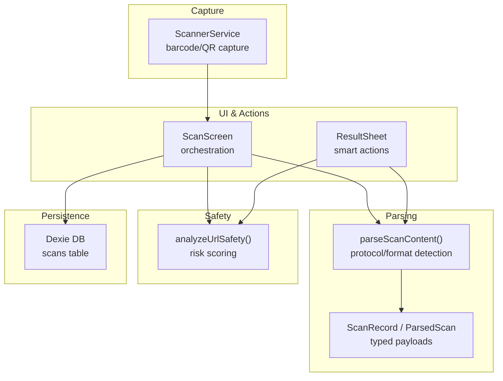
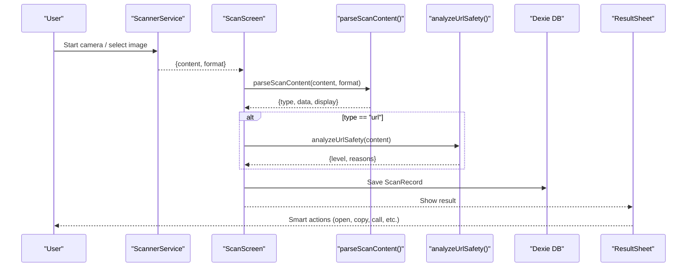
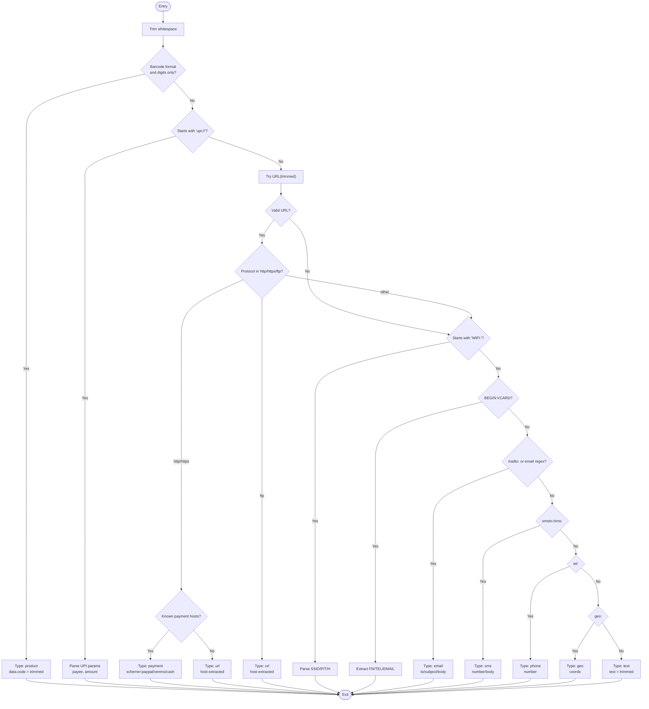
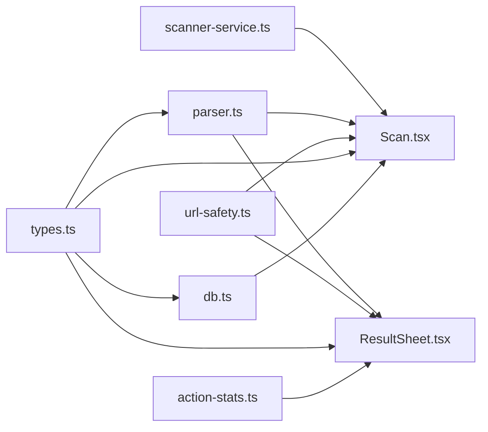

# Content Parsing Engine

<cite>
**Referenced Files in This Document**
- [parser.ts](file://src/lib/scan/parser.ts)
- [types.ts](file://src/lib/scan/types.ts)
- [scanner-service.ts](file://src/lib/scanner-service.ts)
- [Scan.tsx](file://src/pages/Scan.tsx)
- [ResultSheet.tsx](file://src/components/ResultSheet.tsx)
- [url-safety.ts](file://src/lib/url-safety.ts)
- [db.ts](file://src/lib/db.ts)
- [action-stats.ts](file://src/lib/action-stats.ts)
</cite>

## Table of Contents
1. [Introduction](#introduction)
2. [Project Structure](#project-structure)
3. [Core Components](#core-components)
4. [Architecture Overview](#architecture-overview)
5. [Detailed Component Analysis](#detailed-component-analysis)
6. [Dependency Analysis](#dependency-analysis)
7. [Performance Considerations](#performance-considerations)
8. [Troubleshooting Guide](#troubleshooting-guide)
9. [Conclusion](#conclusion)
10. [Appendices](#appendices)

## Introduction
This document explains the intelligent content parsing engine that classifies and extracts structured data from scanned or manually entered content. It covers:
- Strategy-like classification for multiple content types (URLs, WiFi credentials, vCard contacts, emails, phone numbers, SMS messages, geographic coordinates, payment links).
- Protocol detection algorithms and data extraction methods.
- Validation rules and safety checks for URLs.
- The ScanRecord type structure, parsed data formats, and automatic content classification.
- Examples of supported formats with expected input/output patterns.
- Edge cases, malformed data handling, and extensibility points for adding new content types.

## Project Structure
The parsing engine is implemented as a small set of focused modules:
- Scanner service captures raw barcode/QR content.
- Parser classifies content into typed structures using protocol and format heuristics.
- Safety analyzer evaluates URL risk.
- UI orchestrates scanning, parsing, persistence, and user actions.

**Diagram sources**
- [scanner-service.ts:1-198](file://src/lib/scanner-service.ts#L1-L198)
- [parser.ts:1-102](file://src/lib/scan/parser.ts#L1-L102)
- [types.ts:1-49](file://src/lib/scan/types.ts#L1-L49)
- [url-safety.ts:1-106](file://src/lib/url-safety.ts#L1-L106)
- [Scan.tsx:1-488](file://src/pages/Scan.tsx#L1-L488)
- [ResultSheet.tsx:1-414](file://src/components/ResultSheet.tsx#L1-L414)
- [db.ts:1-37](file://src/lib/db.ts#L1-L37)

**Section sources**
- [scanner-service.ts:1-198](file://src/lib/scanner-service.ts#L1-L198)
- [parser.ts:1-102](file://src/lib/scan/parser.ts#L1-L102)
- [types.ts:1-49](file://src/lib/scan/types.ts#L1-L49)
- [url-safety.ts:1-106](file://src/lib/url-safety.ts#L1-L106)
- [Scan.tsx:1-488](file://src/pages/Scan.tsx#L1-L488)
- [ResultSheet.tsx:1-414](file://src/components/ResultSheet.tsx#L1-L414)
- [db.ts:1-37](file://src/lib/db.ts#L1-L37)

## Core Components
- ScannerService: Captures QR/barcodes via camera or image file and returns raw text plus barcode format.
- parseScanContent(): Central classifier that detects protocols and formats to produce typed results.
- analyzeUrlSafety(): Heuristic-based URL risk assessment.
- ScanRecord: Persistent record schema including raw content, detected format, type, parsed payload, and safety status.
- ResultSheet: Presents smart actions based on parsed type and safety.

Key responsibilities:
- Classification strategy: A single function routes content through ordered checks to determine type and extract fields.
- Data normalization: Produces consistent typed payloads per content type.
- Safety gating: Optional URL safety analysis before opening links.

**Section sources**
- [scanner-service.ts:1-198](file://src/lib/scanner-service.ts#L1-L198)
- [parser.ts:1-102](file://src/lib/scan/parser.ts#L1-L102)
- [url-safety.ts:1-106](file://src/lib/url-safety.ts#L1-L106)
- [types.ts:1-49](file://src/lib/scan/types.ts#L1-L49)
- [ResultSheet.tsx:1-414](file://src/components/ResultSheet.tsx#L1-L414)

## Architecture Overview
End-to-end flow from scan to action:

**Diagram sources**
- [scanner-service.ts:1-198](file://src/lib/scanner-service.ts#L1-L198)
- [Scan.tsx:1-488](file://src/pages/Scan.tsx#L1-L488)
- [parser.ts:1-102](file://src/lib/scan/parser.ts#L1-L102)
- [url-safety.ts:1-106](file://src/lib/url-safety.ts#L1-L106)
- [db.ts:1-37](file://src/lib/db.ts#L1-L37)
- [ResultSheet.tsx:1-414](file://src/components/ResultSheet.tsx#L1-L414)

## Detailed Component Analysis

### Scanner Service
Responsibilities:
- Initialize ZXing reader with supported formats.
- Stream video, decode barcodes/QR codes, and return content + format.
- Support torch and zoom controls when available.
- Decode images from files.

Key behaviors:
- Lazy initialization of reader to reduce startup cost.
- Debounced callbacks and active state management.
- Capability probing for torch and zoom after stream starts.

**Section sources**
- [scanner-service.ts:1-198](file://src/lib/scanner-service.ts#L1-L198)

### Content Parser (Strategy-like Classification)
The parser implements a strategy-like approach by routing content through a prioritized sequence of checks. Each check corresponds to a “strategy” for a specific content type. The first matching rule wins, ensuring deterministic classification.

Supported strategies and detection logic:
- Product codes: When barcode format indicates product code and content is numeric digits only.
- UPI payments: Recognizes upi:// scheme and extracts payee and amount.
- Payment services via URL: paypal.me, venmo.com, cash.app host detection.
- Generic URLs: http/https/ftp schemes; extracts host.
- WiFi credentials: WIFI: string with key-value pairs (SSID, password, encryption, hidden).
- vCard: BEGIN:VCARD blocks; extracts name, phone, email.
- Email: mailto: URIs or plain email addresses.
- SMS: smsto: or sms: URIs; optional body.
- Phone: tel: URIs.
- Geographic coordinates: geo: URIs.
- Fallback: Plain text.

Data extraction and validation highlights:
- Uses URL constructor where applicable; invalid URLs are treated as non-URL content.
- Regex-based field extraction for structured formats (e.g., WiFi, vCard).
- Normalizes display strings for UI presentation.

**Diagram sources**
- [parser.ts:1-102](file://src/lib/scan/parser.ts#L1-L102)

**Section sources**
- [parser.ts:1-102](file://src/lib/scan/parser.ts#L1-L102)

### URL Safety Analyzer
Purpose:
- Evaluate risk of URLs before opening them.
- Provide reasons for suspicious/malicious classification.

Checks performed:
- Dangerous protocols (javascript:, data:).
- IP address hosts.
- Punycode/homograph indicators.
- Excessive subdomains.
- Suspicious TLDs list.
- Known URL shorteners.
- Brand impersonation heuristics.
- Unencrypted HTTP.
- Embedded credentials (@ in URL).

Classification:
- Malicious if critical reasons present or high count of issues.
- Suspicious otherwise.
- Safe if no reasons.

**Section sources**
- [url-safety.ts:1-106](file://src/lib/url-safety.ts#L1-L106)

### ScanRecord Type and Persistence
Structure:
- id: unique identifier.
- content: original raw string.
- format: barcode/QR format enum.
- type: parsed content type enum.
- parsed: typed payload map.
- safetyStatus: URL safety level when applicable.
- favorite: user preference flag.
- scannedAt: timestamp.

Persistence:
- Dexie database stores scans with indexes for efficient queries.
- Free history pruning removes oldest non-favorites beyond a limit.

**Section sources**
- [types.ts:1-49](file://src/lib/scan/types.ts#L1-L49)
- [db.ts:1-37](file://src/lib/db.ts#L1-L37)

### UI Orchestration and Smart Actions
Orchestration:
- ScanScreen initializes scanner, handles camera permissions, and debounces duplicate results.
- Parses content, runs safety analysis for URLs, persists records, and shows results.
- Applies auto-actions based on settings (copy text, copy Wi-Fi password, open safe URLs).

Smart actions:
- ResultSheet renders context-aware primary actions per type (open link, call, send email/SMS, save contact, open maps, open payment).
- Tracks user actions to learn preferred primary action per type.

**Section sources**
- [Scan.tsx:1-488](file://src/pages/Scan.tsx#L1-L488)
- [ResultSheet.tsx:1-414](file://src/components/ResultSheet.tsx#L1-L414)
- [action-stats.ts:1-81](file://src/lib/action-stats.ts#L1-L81)

## Dependency Analysis
High-level dependencies among core modules:

**Diagram sources**
- [scanner-service.ts:1-198](file://src/lib/scanner-service.ts#L1-L198)
- [parser.ts:1-102](file://src/lib/scan/parser.ts#L1-L102)
- [url-safety.ts:1-106](file://src/lib/url-safety.ts#L1-L106)
- [types.ts:1-49](file://src/lib/scan/types.ts#L1-L49)
- [db.ts:1-37](file://src/lib/db.ts#L1-L37)
- [action-stats.ts:1-81](file://src/lib/action-stats.ts#L1-L81)
- [Scan.tsx:1-488](file://src/pages/Scan.tsx#L1-L488)
- [ResultSheet.tsx:1-414](file://src/components/ResultSheet.tsx#L1-L414)

**Section sources**
- [scanner-service.ts:1-198](file://src/lib/scanner-service.ts#L1-L198)
- [parser.ts:1-102](file://src/lib/scan/parser.ts#L1-L102)
- [url-safety.ts:1-106](file://src/lib/url-safety.ts#L1-L106)
- [types.ts:1-49](file://src/lib/scan/types.ts#L1-L49)
- [db.ts:1-37](file://src/lib/db.ts#L1-L37)
- [action-stats.ts:1-81](file://src/lib/action-stats.ts#L1-L81)
- [Scan.tsx:1-488](file://src/pages/Scan.tsx#L1-L488)
- [ResultSheet.tsx:1-414](file://src/components/ResultSheet.tsx#L1-L414)

## Performance Considerations
- Lazy loading of ZXing reader reduces initial bundle load and startup time.
- Debouncing duplicate results prevents redundant parsing and storage operations.
- URL safety analysis runs only for URL-type results, minimizing overhead.
- Indexed database queries optimize history retrieval and pruning.
- Zoom/torch capability probing occurs once after stream stabilization.

[No sources needed since this section provides general guidance]

## Troubleshooting Guide
Common issues and resolutions:
- Camera permission denied:
  - Symptoms: Camera blocked overlay.
  - Resolution: Prompt user to allow camera access; handle permanent denial state.
- No camera devices found:
  - Symptoms: Unavailable overlay.
  - Resolution: Suggest using image upload or manual entry.
- Image scan failed:
  - Symptoms: Toast error after selecting an image.
  - Resolution: Ensure valid image file; retry selection.
- Storage write failure:
  - Symptoms: Error toast during save.
  - Resolution: Check browser storage availability; clear old entries via pruning.
- Clipboard unavailable:
  - Symptoms: Copy action fails silently or shows error.
  - Resolution: Inform user; fallback to share dialog.

Operational notes:
- Duplicate result suppression window prevents rapid re-processing of identical content.
- Auto-open behavior for URLs respects safety status; malicious links require explicit confirmation.

**Section sources**
- [Scan.tsx:1-488](file://src/pages/Scan.tsx#L1-L488)
- [ResultSheet.tsx:1-414](file://src/components/ResultSheet.tsx#L1-L414)
- [db.ts:1-37](file://src/lib/db.ts#L1-L37)

## Conclusion
The intelligent content parsing engine combines robust barcode/QR capture with a strategy-like classification pipeline to detect and extract structured data across multiple content types. It integrates URL safety analysis, persistent storage, and adaptive smart actions to deliver a seamless scanning experience. The modular design enables easy extension for new content types and protocols.

[No sources needed since this section summarizes without analyzing specific files]

## Appendices

### Supported Formats and Expected Input/Output Patterns
- URL
  - Input examples: https://example.com, ftp://files.example.org/path
  - Output: type=url, data.url, data.host, display=full URL
- Payment Links
  - Input examples: upi://?pn=payee&am=100, https://paypal.me/user, https://venmo.com/user, https://cash.app/$user
  - Output: type=payment, data.scheme, data.payee, data.amount (optional), display=scheme-specific
- WiFi Credentials
  - Input example: WIFI:T:WPA;S:MyNetwork;P:secret;H:false;;
  - Output: type=wifi, data.ssid, data.password, data.encryption, data.hidden, display=ssid
- Contact Card (vCard)
  - Input example: BEGIN:VCARD...FN:Alice;TEL:+1234567890;EMAIL:alice@example.com...END:VCARD
  - Output: type=vcard, data.name, data.tel, data.email, data.raw, display=name or tel or email
- Email
  - Input examples: mailto:user@example.com?subject=Hi&body=Hello, user@example.com
  - Output: type=email, data.to, data.subject (optional), data.body (optional), display=address
- Phone Number
  - Input example: tel:+1234567890
  - Output: type=phone, data.number, display=number
- SMS Message
  - Input examples: smsto:+1234567890, sms:+1234567890:Hello%20World
  - Output: type=sms, data.number, data.body (optional), display=number
- Geographic Coordinates
  - Input example: geo:37.7749,-122.4194
  - Output: type=geo, data.coords, display=coords
- Product Code
  - Input example: EAN_13 barcode with digits only
  - Output: type=product, data.code, display=code
- Plain Text
  - Input example: Any unrecognized string
  - Output: type=text, data.text, display=text

Edge Cases and Malformed Data Handling:
- Invalid URLs: Treated as non-URL content; falls back to text or other parsers.
- Partial vCard: Extracts whatever fields are present; defaults to generic display.
- Missing fields: Returns empty strings for absent fields; UI should handle gracefully.
- Non-standard payment hosts: Falls back to generic URL unless explicitly recognized.
- Encoded characters: URL parsing uses standard URL semantics; percent-encoded values preserved.

Extensibility Points:
- Add new content types by extending parseScanContent() with additional early checks before the generic URL/text fallback.
- Extend URL safety checks by adding new heuristics (e.g., threat intelligence lists, certificate checks).
- Introduce new smart actions by updating action mapping and UI rendering in ResultSheet.
- Persist new fields by updating ScanRecord and database schema accordingly.

**Section sources**
- [parser.ts:1-102](file://src/lib/scan/parser.ts#L1-L102)
- [url-safety.ts:1-106](file://src/lib/url-safety.ts#L1-L106)
- [types.ts:1-49](file://src/lib/scan/types.ts#L1-L49)
- [ResultSheet.tsx:1-414](file://src/components/ResultSheet.tsx#L1-L414)
- [db.ts:1-37](file://src/lib/db.ts#L1-L37)