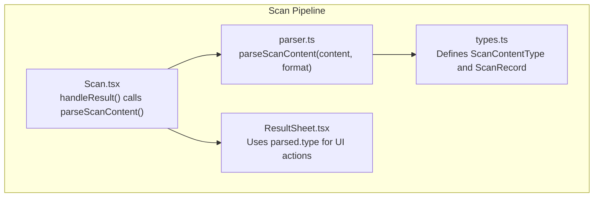
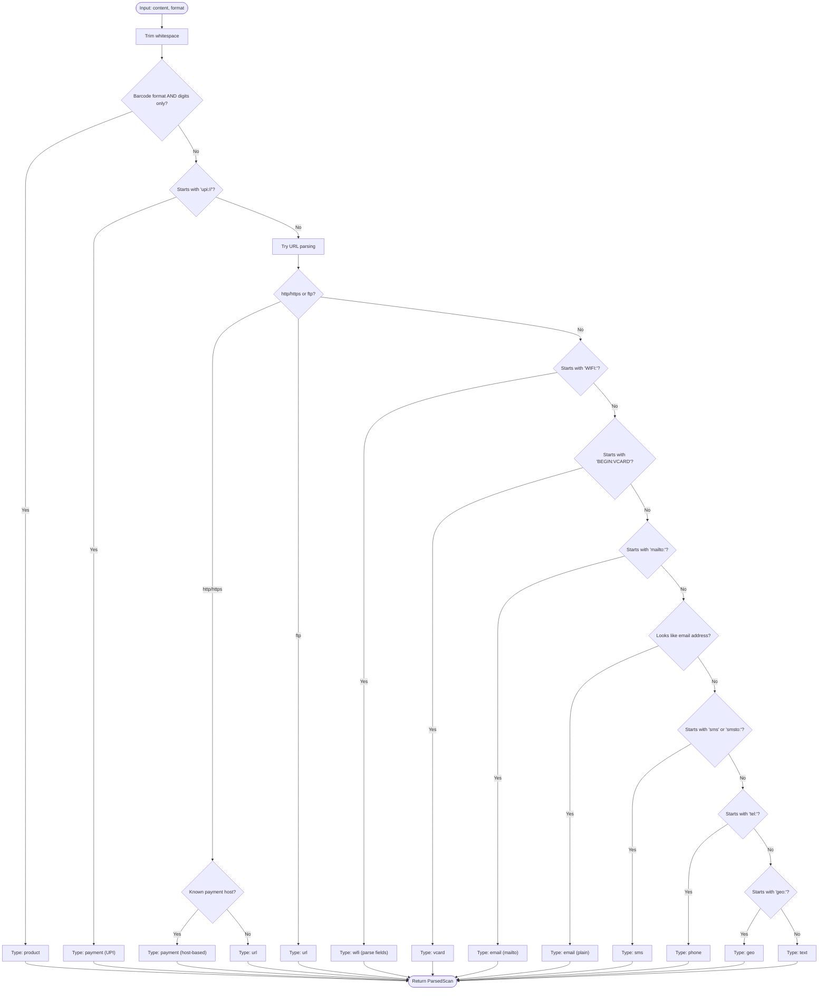
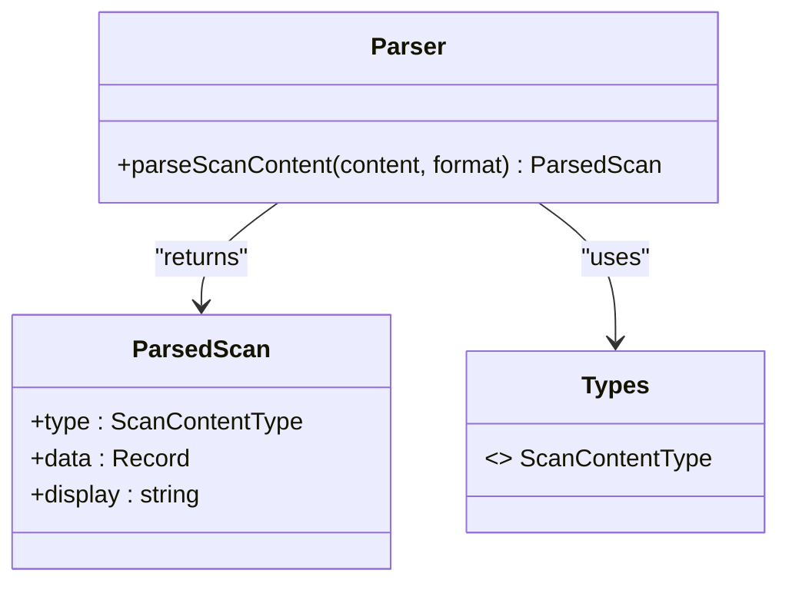
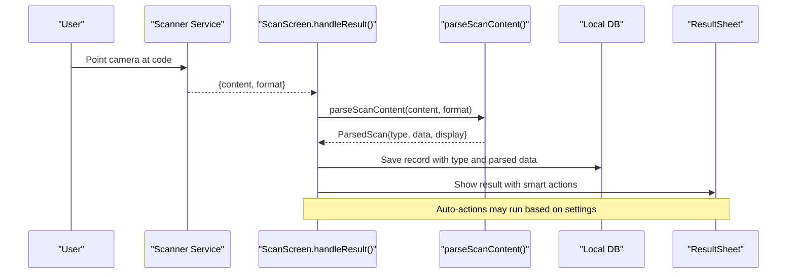
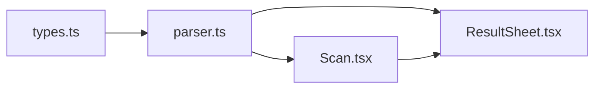

# Content Type Detection

<cite>
**Referenced Files in This Document**
- [types.ts](file://src/lib/scan/types.ts)
- [parser.ts](file://src/lib/scan/parser.ts)
- [Scan.tsx](file://src/pages/Scan.tsx)
- [ResultSheet.tsx](file://src/components/ResultSheet.tsx)
</cite>

## Table of Contents
1. [Introduction](#introduction)
2. [Project Structure](#project-structure)
3. [Core Components](#core-components)
4. [Architecture Overview](#architecture-overview)
5. [Detailed Component Analysis](#detailed-component-analysis)
6. [Dependency Analysis](#dependency-analysis)
7. [Performance Considerations](#performance-considerations)
8. [Troubleshooting Guide](#troubleshooting-guide)
9. [Conclusion](#conclusion)

## Introduction
This document explains the content type detection system that automatically classifies scanned content into specific types such as product barcodes, URLs, WiFi credentials, vCard contacts, emails, phone numbers, SMS messages, geographic coordinates, and payment links. It focuses on the strategy-like pipeline implemented in the parser module, which applies a prioritized sequence of checks to determine the most appropriate content type. The documentation covers detection algorithms, pattern matching logic, protocol handling, priority order, fallback behavior, and examples of inputs that trigger each classification.

## Project Structure
The content type detection is implemented primarily in two modules:
- Types and shared models for scan records and content types
- A parsing function that applies a deterministic, ordered set of rules to classify content

**Diagram sources**
- [types.ts:16-26](file://src/lib/scan/types.ts#L16-L26)
- [parser.ts:12-101](file://src/lib/scan/parser.ts#L12-L101)
- [Scan.tsx:50-102](file://src/pages/Scan.tsx#L50-L102)
- [ResultSheet.tsx:127-131](file://src/components/ResultSheet.tsx#L127-L131)

**Section sources**
- [types.ts:16-26](file://src/lib/scan/types.ts#L16-L26)
- [parser.ts:12-101](file://src/lib/scan/parser.ts#L12-L101)
- [Scan.tsx:50-102](file://src/pages/Scan.tsx#L50-L102)
- [ResultSheet.tsx:127-131](file://src/components/ResultSheet.tsx#L127-L131)

## Core Components
- ScanContentType enum values: url, wifi, vcard, email, sms, phone, geo, product, text, payment
- Parser function: parseScanContent(content, format) returns a normalized result with type, structured data, and display string
- Integration points:
  - Scan screen invokes the parser after decoding
  - Result sheet renders type-specific actions based on the parsed type

Key responsibilities:
- Normalize input (trim whitespace)
- Apply ordered detection rules
- Return structured payload for downstream UI and automation

**Section sources**
- [types.ts:16-26](file://src/lib/scan/types.ts#L16-L26)
- [parser.ts:12-101](file://src/lib/scan/parser.ts#L12-L101)
- [Scan.tsx:57-68](file://src/pages/Scan.tsx#L57-L68)
- [ResultSheet.tsx:127-131](file://src/components/ResultSheet.tsx#L127-L131)

## Architecture Overview
The detection pipeline follows a strategy-like approach by applying a fixed sequence of specialized checks. Each check short-circuits on match; otherwise, control proceeds to the next rule. The final fallback is plain text.

**Diagram sources**
- [parser.ts:12-101](file://src/lib/scan/parser.ts#L12-L101)

## Detailed Component Analysis

### Strategy Pattern Implementation in Parser
The parser implements a strategy-like pipeline where each detection rule acts as a specialized strategy applied in a strict order. The first matching strategy wins, ensuring deterministic classification.

- Priority order:
  1. Product barcode (when format indicates a barcode and content is digits-only)
  2. UPI payment scheme (protocol-based)
  3. URL-based checks:
     - Payment services via known hosts
     - Generic http/https/ftp URLs
  4. WiFi credential strings
  5. vCard blocks
  6. Email addresses (mailto: and plain email regex)
  7. SMS (smsto:/sms:)
  8. Phone (tel:)
  9. Geographic coordinates (geo:)
  10. Fallback to plain text

**Diagram sources**
- [parser.ts:6-10](file://src/lib/scan/parser.ts#L6-L10)
- [parser.ts:12-101](file://src/lib/scan/parser.ts#L12-L101)
- [types.ts:16-26](file://src/lib/scan/types.ts#L16-L26)

**Section sources**
- [parser.ts:12-101](file://src/lib/scan/parser.ts#L12-L101)
- [types.ts:16-26](file://src/lib/scan/types.ts#L16-L26)

### Detection Algorithms and Patterns

- Product barcodes
  - Condition: Format is one of the recognized barcode formats and content matches a digits-only pattern
  - Output: type = product, data includes code
  - Example triggers: EAN-13/EAN-8/UPC-A/UPC-E/Code 128/Code 39/Code 93/ITF with numeric payloads

- UPI payments
  - Condition: Content starts with the UPI scheme prefix
  - Output: type = payment, scheme = upi, extracts payee and amount from query parameters when present
  - Example triggers: UPI intent-style URIs with recipient and optional amount fields

- Payment service URLs
  - Condition: URL host matches known payment providers
  - Output: type = payment, scheme derived from host, extracts recipient from path
  - Example triggers: PayPal.me links, Venmo/Cash App profile links

- Generic URLs
  - Condition: Valid URL with http/https or ftp protocols
  - Output: type = url, stores full URL and host
  - Example triggers: https://example.com, ftp://files.example.org

- WiFi credentials
  - Condition: Content begins with the WiFi configuration prefix
  - Output: type = wifi, parses SSID, password, encryption, hidden flags
  - Example triggers: Standard WiFi provisioning strings with key-value pairs

- vCard contacts
  - Condition: Content begins with the vCard header marker
  - Output: type = vcard, extracts name, telephone, email, and raw block
  - Example triggers: BEGIN:VCARD ... END:VCARD blocks

- Emails
  - Conditions:
    - mailto: URI with optional subject/body
    - Plain email address pattern
  - Output: type = email, stores recipient and optional metadata
  - Example triggers: mailto:user@example.com?subject=..., user@example.com

- SMS messages
  - Condition: smsto: or sms: prefix with optional body
  - Output: type = sms, stores number and message body
  - Example triggers: SMSTO:+15551234567:Hello%20World

- Phone numbers
  - Condition: tel: prefix
  - Output: type = phone, stores number portion
  - Example triggers: tel:+15551234567

- Geographic coordinates
  - Condition: geo: prefix
  - Output: type = geo, stores coordinate string
  - Example triggers: geo:lat,lon or geo:lat,lon,alt

- Fallback text
  - Condition: No other rule matched
  - Output: type = text, stores original trimmed content
  - Example triggers: Any unrecognized string

**Section sources**
- [parser.ts:15-17](file://src/lib/scan/parser.ts#L15-L17)
- [parser.ts:20-25](file://src/lib/scan/parser.ts#L20-L25)
- [parser.ts:28-49](file://src/lib/scan/parser.ts#L28-L49)
- [parser.ts:52-64](file://src/lib/scan/parser.ts#L52-L64)
- [parser.ts:67-72](file://src/lib/scan/parser.ts#L67-L72)
- [parser.ts:75-81](file://src/lib/scan/parser.ts#L75-L81)
- [parser.ts:84-88](file://src/lib/scan/parser.ts#L84-L88)
- [parser.ts:91-93](file://src/lib/scan/parser.ts#L91-L93)
- [parser.ts:96-98](file://src/lib/scan/parser.ts#L96-L98)
- [parser.ts:100](file://src/lib/scan/parser.ts#L100)

### Protocol Matching Logic
- UPI scheme: Recognizes the custom scheme prefix for payment intents
- HTTP(S)/FTP: Uses URL constructor to validate and extract host and protocol
- mailto/sms/tel/geo: Recognizes standard URI schemes and extracts relevant segments
- WiFi provisioning: Parses standardized key-value pairs following the WiFi prefix

These checks ensure robustness against malformed inputs by using try/catch around URL parsing and simple prefix checks before deeper parsing.

**Section sources**
- [parser.ts:20-25](file://src/lib/scan/parser.ts#L20-L25)
- [parser.ts:28-49](file://src/lib/scan/parser.ts#L28-L49)
- [parser.ts:75-81](file://src/lib/scan/parser.ts#L75-L81)
- [parser.ts:84-88](file://src/lib/scan/parser.ts#L84-L88)
- [parser.ts:91-93](file://src/lib/scan/parser.ts#L91-L93)
- [parser.ts:96-98](file://src/lib/scan/parser.ts#L96-L98)

### Ambiguity and Malformed Data Handling
- Barcode vs text: Only classified as product when both format indicates a barcode and content is digits-only
- URL validation: URL construction failures are caught and treated as non-URL content
- Partial WiFi/vCard: Parsing tolerates missing fields by providing defaults or empty strings
- Email ambiguity: mailto: takes precedence over plain email regex; if neither matches, falls through to later rules
- Fallback safety: Unrecognized content becomes plain text rather than failing

**Section sources**
- [parser.ts:15-17](file://src/lib/scan/parser.ts#L15-L17)
- [parser.ts:28-49](file://src/lib/scan/parser.ts#L28-L49)
- [parser.ts:52-64](file://src/lib/scan/parser.ts#L52-L64)
- [parser.ts:67-72](file://src/lib/scan/parser.ts#L67-L72)
- [parser.ts:75-81](file://src/lib/scan/parser.ts#L75-L81)
- [parser.ts:100](file://src/lib/scan/parser.ts#L100)

### Integration Points and Usage Flow

#### Scan Screen Integration
After decoding, the scan screen:
- Calls the parser with content and format
- Stores the resulting type and parsed data
- Optionally performs auto-actions based on settings (e.g., auto-copy text, auto-open safe URLs)

**Diagram sources**
- [Scan.tsx:50-102](file://src/pages/Scan.tsx#L50-L102)
- [parser.ts:12-101](file://src/lib/scan/parser.ts#L12-L101)
- [ResultSheet.tsx:127-131](file://src/components/ResultSheet.tsx#L127-L131)

**Section sources**
- [Scan.tsx:50-102](file://src/pages/Scan.tsx#L50-L102)
- [ResultSheet.tsx:127-131](file://src/components/ResultSheet.tsx#L127-L131)

### Examples of Input Patterns

- Product barcodes
  - Numeric-only payloads from EAN-13/EAN-8/UPC-A/UPC-E/Code 128/Code 39/Code 93/ITF formats
- UPI payments
  - URIs starting with the UPI scheme prefix, optionally including recipient and amount parameters
- Payment service URLs
  - Links to known payment provider hosts with recipient identifiers in the path
- Generic URLs
  - Valid http/https/ftp URLs
- WiFi credentials
  - Strings beginning with the WiFi provisioning prefix containing SSID, password, encryption, and hidden flags
- vCard contacts
  - Blocks starting with the vCard header marker and ending with the footer marker
- Emails
  - mailto: URIs with optional subject/body; standalone email addresses
- SMS messages
  - smsto:/sms: prefixes with optional message bodies
- Phone numbers
  - tel: prefixed numbers
- Geographic coordinates
  - geo: prefixed coordinate strings
- Fallback text
  - Any unrecognized content

[No sources needed since this section summarizes patterns without quoting code]

## Dependency Analysis
The detection system has minimal dependencies and clear separation of concerns:
- types.ts defines shared enums and interfaces used across modules
- parser.ts depends only on types.ts and contains all detection logic
- Scan.tsx orchestrates scanning and persists results
- ResultSheet.tsx consumes parsed results to render type-specific actions

**Diagram sources**
- [types.ts:16-26](file://src/lib/scan/types.ts#L16-L26)
- [parser.ts:12-101](file://src/lib/scan/parser.ts#L12-L101)
- [Scan.tsx:50-102](file://src/pages/Scan.tsx#L50-L102)
- [ResultSheet.tsx:127-131](file://src/components/ResultSheet.tsx#L127-L131)

**Section sources**
- [types.ts:16-26](file://src/lib/scan/types.ts#L16-L26)
- [parser.ts:12-101](file://src/lib/scan/parser.ts#L12-L101)
- [Scan.tsx:50-102](file://src/pages/Scan.tsx#L50-L102)
- [ResultSheet.tsx:127-131](file://src/components/ResultSheet.tsx#L127-L131)

## Performance Considerations
- Early exits: The parser uses short-circuiting checks to avoid unnecessary work once a match is found
- Minimal allocations: Returns lightweight objects with only necessary fields
- Safe URL parsing: Catches exceptions during URL construction to prevent overhead from invalid inputs
- Deterministic order: Fixed priority reduces branching complexity and improves predictability

[No sources needed since this section provides general guidance]

## Troubleshooting Guide
Common issues and resolutions:
- Misclassification as text
  - Ensure the scanner reports correct format for barcodes; verify content is digits-only for product detection
- Payment not detected
  - Confirm the content matches supported schemes or known payment hosts
- URL not recognized
  - Validate that the content is a well-formed URL; malformed URLs fall back to text
- WiFi fields missing
  - Check that the provisioning string includes required keys; missing fields default to empty values
- Email not detected
  - Verify mailto: syntax or email address format; ambiguous cases may require explicit mailto: usage

**Section sources**
- [parser.ts:15-17](file://src/lib/scan/parser.ts#L15-L17)
- [parser.ts:20-25](file://src/lib/scan/parser.ts#L20-L25)
- [parser.ts:28-49](file://src/lib/scan/parser.ts#L28-L49)
- [parser.ts:52-64](file://src/lib/scan/parser.ts#L52-L64)
- [parser.ts:67-72](file://src/lib/scan/parser.ts#L67-L72)
- [parser.ts:75-81](file://src/lib/scan/parser.ts#L75-L81)
- [parser.ts:100](file://src/lib/scan/parser.ts#L100)

## Conclusion
The content type detection system employs a clear, prioritized strategy-like pipeline to classify scanned content accurately and efficiently. By combining format hints, protocol checks, and targeted pattern matching, it reliably identifies products, URLs, WiFi credentials, contacts, emails, SMS, phones, locations, and payments, while gracefully falling back to plain text for unrecognized inputs. The modular design keeps detection logic isolated and testable, enabling straightforward extension for new content types and improved heuristics.