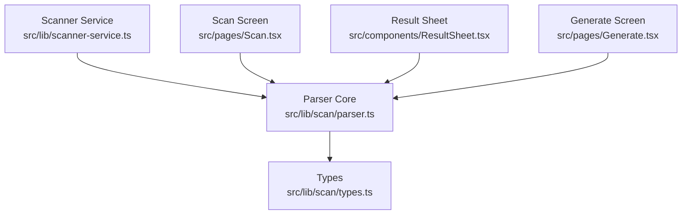
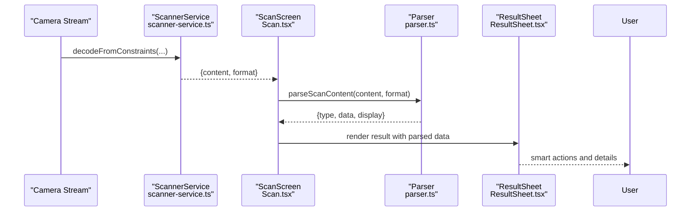
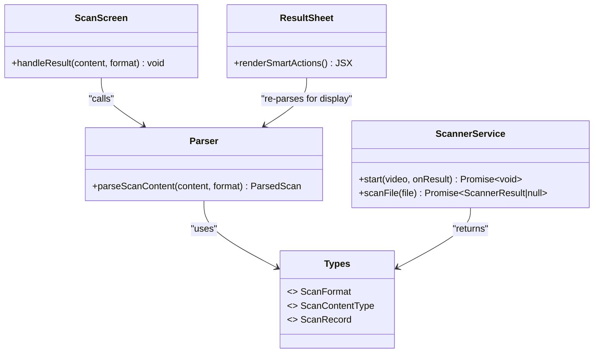
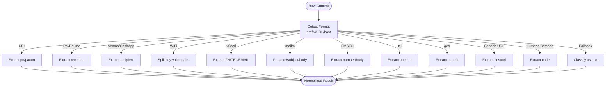

# Data Extraction Parsers

<cite>
**Referenced Files in This Document**
- [parser.ts](file://src/lib/scan/parser.ts)
- [types.ts](file://src/lib/scan/types.ts)
- [scanner-service.ts](file://src/lib/scanner-service.ts)
- [Scan.tsx](file://src/pages/Scan.tsx)
- [ResultSheet.tsx](file://src/components/ResultSheet.tsx)
- [Generate.tsx](file://src/pages/Generate.tsx)
</cite>

## Table of Contents
1. [Introduction](#introduction)
2. [Project Structure](#project-structure)
3. [Core Components](#core-components)
4. [Architecture Overview](#architecture-overview)
5. [Detailed Component Analysis](#detailed-component-analysis)
6. [Dependency Analysis](#dependency-analysis)
7. [Performance Considerations](#performance-considerations)
8. [Troubleshooting Guide](#troubleshooting-guide)
9. [Conclusion](#conclusion)
10. [Appendices](#appendices)

## Introduction
This document explains the data extraction parsers that process structured content formats detected by the scanner. It covers parsing logic for:
- UPI payment schemes (pn, pa, am parameters)
- PayPal.me URLs
- Venmo/CashApp links
- WiFi configuration strings (WIFI:T:WPA;S:ssid;P:password;H:hidden)
- vCard contact information (FN, TEL, EMAIL fields)
- mailto URLs
- SMSTO protocols
- tel: URIs
- geo: coordinates

For each format, we describe field extraction methods, parameter validation, error handling for missing fields, and data normalization processes. We also provide concrete examples showing raw input strings and their corresponding parsed output structures.

## Project Structure
The parsing logic is centralized in a single module with supporting types and integration points across the application:
- Parsing core: src/lib/scan/parser.ts
- Shared types: src/lib/scan/types.ts
- Scanner service (feeds raw content to parser): src/lib/scanner-service.ts
- UI orchestration (invokes parser and displays results): src/pages/Scan.tsx, src/components/ResultSheet.tsx
- Payload generation (for round-trip examples): src/pages/Generate.tsx

**Diagram sources**
- [scanner-service.ts:1-198](file://src/lib/scanner-service.ts#L1-L198)
- [parser.ts:1-102](file://src/lib/scan/parser.ts#L1-L102)
- [types.ts:1-49](file://src/lib/scan/types.ts#L1-L49)
- [Scan.tsx:1-488](file://src/pages/Scan.tsx#L1-L488)
- [ResultSheet.tsx:1-414](file://src/components/ResultSheet.tsx#L1-L414)
- [Generate.tsx:24-50](file://src/pages/Generate.tsx#L24-L50)

**Section sources**
- [parser.ts:1-102](file://src/lib/scan/parser.ts#L1-L102)
- [types.ts:1-49](file://src/lib/scan/types.ts#L1-L49)
- [scanner-service.ts:1-198](file://src/lib/scanner-service.ts#L1-L198)
- [Scan.tsx:1-488](file://src/pages/Scan.tsx#L1-L488)
- [ResultSheet.tsx:1-414](file://src/components/ResultSheet.tsx#L1-L414)
- [Generate.tsx:24-50](file://src/pages/Generate.tsx#L24-L50)

## Core Components
- Parser entry point: parseScanContent(content, format) returns a normalized result object containing type, data, and display text.
- Supported content types include url, wifi, vcard, email, sms, phone, geo, product, text, and payment.
- The parser normalizes inputs into consistent fields per type and provides a human-readable display string.

Key responsibilities:
- Detect content category based on prefixes or URL patterns.
- Extract named fields using URL APIs or regex-based tokenization.
- Normalize values (e.g., trimming whitespace, uppercasing keys).
- Provide safe defaults when optional fields are missing.

**Section sources**
- [parser.ts:12-101](file://src/lib/scan/parser.ts#L12-L101)
- [types.ts:16-26](file://src/lib/scan/types.ts#L16-L26)

## Architecture Overview
The scanner service decodes barcodes/QR codes and emits raw content plus format metadata. The scan screen invokes the parser to normalize content into typed results. The result sheet renders smart actions based on the parsed type and data.

**Diagram sources**
- [scanner-service.ts:80-131](file://src/lib/scanner-service.ts#L80-L131)
- [Scan.tsx:50-102](file://src/pages/Scan.tsx#L50-L102)
- [parser.ts:12-101](file://src/lib/scan/parser.ts#L12-L101)
- [ResultSheet.tsx:111-131](file://src/components/ResultSheet.tsx#L111-L131)

## Detailed Component Analysis

### Unified Parser API
- Input: raw content string and barcode format hint.
- Output: normalized record with:
  - type: one of the supported content categories
  - data: key-value map specific to the type
  - display: user-friendly summary string

Normalization rules:
- Trim leading/trailing whitespace before detection.
- For URL-based formats, use URL constructor to safely parse host, path, and query parameters.
- For semi-structured strings (WiFi), split on delimiters and normalize keys to uppercase.
- For vCard, extract first matching FN, TEL, EMAIL lines.
- For email-only strings without scheme, validate via a simple pattern.

Error handling:
- If URL parsing fails, treat as non-URL content.
- Missing optional fields default to empty strings.
- Unknown content falls back to generic text type.

**Section sources**
- [parser.ts:12-101](file://src/lib/scan/parser.ts#L12-L101)
- [types.ts:16-26](file://src/lib/scan/types.ts#L16-L26)

### UPI Payment Schemes (pn, pa, am)
Detection:
- Matches content starting with upi:// (case-insensitive).
- Uses URLSearchParams to read pn, pa, and am.

Field extraction:
- payee: prefers pn, falls back to pa if present, else empty.
- amount: reads am if present, else empty.
- scheme: set to "upi".
- raw: stores original input for reference.

Validation and normalization:
- No strict numeric validation for amount; kept as string.
- Display shows payee if available, otherwise "UPI Payment".

Examples:
- Raw: upi://?pa=payee123&am=10.00
  - Parsed: { type: "payment", data: { scheme: "upi", payee: "payee123", amount: "10.00", raw: "upi://?pa=payee123&am=10.00" }, display: "payee123" }
- Raw: upi://?pn=merchant&am=5
  - Parsed: { type: "payment", data: { scheme: "upi", payee: "merchant", amount: "5", raw: "upi://?pn=merchant&am=5" }, display: "merchant" }
- Raw: upi://
  - Parsed: { type: "payment", data: { scheme: "upi", payee: "", amount: "", raw: "upi://" }, display: "UPI Payment" }

**Section sources**
- [parser.ts:19-25](file://src/lib/scan/parser.ts#L19-L25)

### PayPal.me URLs
Detection:
- Recognizes hosts paypal.me or *.paypal.me.

Field extraction:
- payee: first path segment after removing leading slash.
- scheme: "paypal".
- raw: original URL.

Validation and normalization:
- Host comparison is case-insensitive.
- If no recipient in path, payee defaults to empty string.

Examples:
- Raw: https://paypal.me/johndoe
  - Parsed: { type: "payment", data: { scheme: "paypal", payee: "johndoe", raw: "https://paypal.me/johndoe" }, display: "PayPal: johndoe" }
- Raw: https://sub.paypal.me/alice
  - Parsed: { type: "payment", data: { scheme: "paypal", payee: "alice", raw: "https://sub.paypal.me/alice" }, display: "PayPal: alice" }

**Section sources**
- [parser.ts:27-36](file://src/lib/scan/parser.ts#L27-L36)

### Venmo/CashApp Links
Detection:
- Recognizes hosts venmo.com or cash.app.

Field extraction:
- payee: first path segment after removing leading slash.
- scheme: derived from host ("venmo" or "cash").
- raw: original URL.

Validation and normalization:
- Host comparison is case-insensitive.
- Payee defaults to empty if not present.

Examples:
- Raw: https://venmo.com/u/bob
  - Parsed: { type: "payment", data: { scheme: "venmo", payee: "u", raw: "https://venmo.com/u/bob" }, display: "venmo.com: u" }
- Raw: https://cash.app/$charlie
  - Parsed: { type: "payment", data: { scheme: "cash", payee: "$charlie", raw: "https://cash.app/$charlie" }, display: "cash.app: $charlie" }

Note: The implementation extracts the first path segment only. Adjustments may be needed if you want to ignore segments like "u" or "$".

**Section sources**
- [parser.ts:37-40](file://src/lib/scan/parser.ts#L37-L40)

### WiFi Configuration Strings (WIFI:)
Detection:
- Matches strings starting with WIFI: (case-insensitive).

Field extraction:
- Removes trailing double semicolon.
- Splits body by semicolons and parses key:value pairs.
- Normalizes keys to uppercase.
- Maps:
  - T -> encryption
  - S -> ssid
  - P -> password
  - H -> hidden

Validation and normalization:
- Defaults:
  - encryption: "WPA" if T missing
  - hidden: "false" if H missing
  - ssid/password: empty if missing

Examples:
- Raw: WIFI:T:WPA;S:MyNet;P:pass123;H:false;;
  - Parsed: { type: "wifi", data: { ssid: "MyNet", password: "pass123", encryption: "WPA", hidden: "false" }, display: "MyNet" }
- Raw: WIFI:S:OpenNet;T:none;;
  - Parsed: { type: "wifi", data: { ssid: "OpenNet", password: "", encryption: "none", hidden: "false" }, display: "OpenNet" }

**Section sources**
- [parser.ts:51-64](file://src/lib/scan/parser.ts#L51-L64)

### vCard Contact Information
Detection:
- Matches BEGIN:VCARD (case-insensitive).

Field extraction:
- name: first FN line value
- tel: first TEL line value
- email: first EMAIL line value
- raw: original vCard string

Validation and normalization:
- If multiple occurrences exist, only the first match is used.
- Display prioritizes name, then tel, then email, else "Contact".

Examples:
- Raw: BEGIN:VCARD\nVERSION:3.0\nFN:Alice\nTEL:+15551234567\nEMAIL:alice@example.com\nEND:VCARD
  - Parsed: { type: "vcard", data: { name: "Alice", tel: "+15551234567", email: "alice@example.com", raw: "BEGIN:VCARD..." }, display: "Alice" }
- Raw: BEGIN:VCARD\nFN:Bob\nEND:VCARD
  - Parsed: { type: "vcard", data: { name: "Bob", tel: "", email: "", raw: "BEGIN:VCARD..." }, display: "Bob" }

**Section sources**
- [parser.ts:66-72](file://src/lib/scan/parser.ts#L66-L72)

### mailto URLs
Detection:
- Matches mailto: prefix (case-insensitive).

Field extraction:
- to: pathname portion of the URL
- subject: query param "subject"
- body: query param "body"

Validation and normalization:
- Uses URL constructor for robust parsing.
- Optional fields default to empty strings.

Examples:
- Raw: mailto:hello@example.com?subject=Hi&body=Hello%20World
  - Parsed: { type: "email", data: { to: "hello@example.com", subject: "Hi", body: "Hello World" }, display: "hello@example.com" }
- Raw: mailto:support@site.org
  - Parsed: { type: "email", data: { to: "support@site.org", subject: "", body: "" }, display: "support@site.org" }

**Section sources**
- [parser.ts:74-78](file://src/lib/scan/parser.ts#L74-L78)

### Plain Email Addresses
Detection:
- Matches a basic email pattern without scheme.

Field extraction:
- to: the matched email address

Validation and normalization:
- Simple regex-based validation.

Examples:
- Raw: dev@company.io
  - Parsed: { type: "email", data: { to: "dev@company.io" }, display: "dev@company.io" }

**Section sources**
- [parser.ts:79-81](file://src/lib/scan/parser.ts#L79-L81)

### SMSTO Protocols
Detection:
- Matches smsto: or sms: prefix (case-insensitive).

Field extraction:
- number: first segment after the scheme
- body: second segment after colon (if present)

Validation and normalization:
- If body is absent, defaults to empty string.

Examples:
- Raw: SMSTO:+15559876543:Meeting at noon
  - Parsed: { type: "sms", data: { number: "+15559876543", body: "Meeting at noon" }, display: "+15559876543" }
- Raw: sms:+15559876543
  - Parsed: { type: "sms", data: { number: "+15559876543", body: "" }, display: "+15559876543" }

**Section sources**
- [parser.ts:83-88](file://src/lib/scan/parser.ts#L83-L88)

### tel: URIs
Detection:
- Matches tel: prefix (case-insensitive).

Field extraction:
- number: everything after "tel:"

Validation and normalization:
- No additional validation; preserves original digits/symbols.

Examples:
- Raw: tel:+15551234567
  - Parsed: { type: "phone", data: { number: "+15551234567" }, display: "+15551234567" }

**Section sources**
- [parser.ts:90-93](file://src/lib/scan/parser.ts#L90-L93)

### geo: Coordinates
Detection:
- Matches geo: prefix (case-insensitive).

Field extraction:
- coords: everything after "geo:"

Validation and normalization:
- No coordinate validation; preserved as-is.

Examples:
- Raw: geo:37.7749,-122.4194
  - Parsed: { type: "geo", data: { coords: "37.7749,-122.4194" }, display: "37.7749,-122.4194" }

**Section sources**
- [parser.ts:95-98](file://src/lib/scan/parser.ts#L95-L98)

### Generic URLs and FTP
Detection:
- http:/https: protocols recognized as URLs.
- ftp: protocol treated as URL.

Field extraction:
- url: original URL string
- host: hostname portion

Validation and normalization:
- Hostname lowercased for consistency.

Examples:
- Raw: https://example.com/path?q=1
  - Parsed: { type: "url", data: { url: "https://example.com/path?q=1", host: "example.com" }, display: "https://example.com/path?q=1" }
- Raw: ftp://files.example.com/doc.pdf
  - Parsed: { type: "url", data: { url: "ftp://files.example.com/doc.pdf", host: "files.example.com" }, display: "ftp://files.example.com/doc.pdf" }

**Section sources**
- [parser.ts:27-46](file://src/lib/scan/parser.ts#L27-L46)

### Product Codes (Barcode Numbers)
Detection:
- When format indicates a numeric barcode (EAN_13, EAN_8, UPC_A, UPC_E, CODE_128, CODE_39, CODE_93, ITF) and content is all digits.

Field extraction:
- code: the numeric string

Validation and normalization:
- Strictly numeric check ensures correct classification.

Examples:
- Raw: 123456789012 (format: EAN_13)
  - Parsed: { type: "product", data: { code: "123456789012" }, display: "123456789012" }

**Section sources**
- [parser.ts:3-17](file://src/lib/scan/parser.ts#L3-L17)

### Fallback Text
If none of the above patterns match, content is classified as text.

Examples:
- Raw: Hello world
  - Parsed: { type: "text", data: { text: "Hello world" }, display: "Hello world" }

**Section sources**
- [parser.ts:100-101](file://src/lib/scan/parser.ts#L100-L101)

## Dependency Analysis
The parser depends on shared types and is consumed by both scanning and result rendering flows.

**Diagram sources**
- [parser.ts:1-102](file://src/lib/scan/parser.ts#L1-102)
- [types.ts:1-49](file://src/lib/scan/types.ts#L1-L49)
- [scanner-service.ts:1-198](file://src/lib/scanner-service.ts#L1-L198)
- [Scan.tsx:50-102](file://src/pages/Scan.tsx#L50-L102)
- [ResultSheet.tsx:111-131](file://src/components/ResultSheet.tsx#L111-L131)

**Section sources**
- [parser.ts:1-102](file://src/lib/scan/parser.ts#L1-L102)
- [types.ts:1-49](file://src/lib/scan/types.ts#L1-L49)
- [scanner-service.ts:1-198](file://src/lib/scanner-service.ts#L1-L198)
- [Scan.tsx:50-102](file://src/pages/Scan.tsx#L50-L102)
- [ResultSheet.tsx:111-131](file://src/components/ResultSheet.tsx#L111-L131)

## Performance Considerations
- Parsing is lightweight and deterministic; complexity is O(n) over input length due to regex and string splitting.
- URL parsing uses native URL constructor; avoid repeated parsing by caching results if needed.
- Barcode decoding occurs in the scanner service; ensure TRY_HARDER hints are appropriate for your environment.
- Avoid heavy operations in hot paths; keep display string generation minimal.

[No sources needed since this section provides general guidance]

## Troubleshooting Guide
Common issues and resolutions:
- Invalid URL: If URL constructor throws, the parser treats it as non-URL content. Ensure inputs are well-formed for URL-based formats.
- Missing fields: Optional fields default to empty strings; verify expected presence before relying on them.
- WiFi string formatting: Ensure proper semicolon separation and trailing double semicolon for reliable parsing.
- vCard multi-line: Only first FN/TEL/EMAIL matches are extracted; ensure required fields appear early in the vCard.
- Payment link nuances: For Venmo/CashApp, the current implementation takes the first path segment; adjust expectations accordingly.

**Section sources**
- [parser.ts:27-49](file://src/lib/scan/parser.ts#L27-L49)
- [parser.ts:51-64](file://src/lib/scan/parser.ts#L51-L64)
- [parser.ts:66-72](file://src/lib/scan/parser.ts#L66-L72)

## Conclusion
The parser provides a unified interface for extracting structured data from diverse content formats. It normalizes inputs into consistent types and fields, enabling robust downstream actions such as opening URLs, composing emails/SMS, saving contacts, and connecting to Wi-Fi. By following the documented extraction rules and validation strategies, developers can reliably integrate these parsers into scanning workflows.

[No sources needed since this section summarizes without analyzing specific files]

## Appendices

### End-to-End Flow Example

[No sources needed since this diagram shows conceptual workflow, not actual code structure]

### Round-Trip Examples (Generation vs Parsing)
These examples demonstrate how generated payloads align with parsed outputs:

- WiFi:
  - Generated payload: WIFI:T:WPA;S:Home;P:secret;H:false;;
  - Parsed output: { type: "wifi", data: { ssid: "Home", password: "secret", encryption: "WPA", hidden: "false" }, display: "Home" }

- vCard:
  - Generated payload: BEGIN:VCARD\nVERSION:3.0\nFN:Jane\nTEL:+15550001111\nEMAIL:jane@example.com\nEND:VCARD
  - Parsed output: { type: "vcard", data: { name: "Jane", tel: "+15550001111", email: "jane@example.com", raw: "BEGIN:VCARD..." }, display: "Jane" }

- Email:
  - Generated payload: mailto:info@site.com?subject=Inquiry
  - Parsed output: { type: "email", data: { to: "info@site.com", subject: "Inquiry", body: "" }, display: "info@site.com" }

- SMS:
  - Generated payload: SMSTO:+15552223333:Call me later
  - Parsed output: { type: "sms", data: { number: "+15552223333", body: "Call me later" }, display: "+15552223333" }

- Phone:
  - Generated payload: tel:+15554445555
  - Parsed output: { type: "phone", data: { number: "+15554445555" }, display: "+15554445555" }

**Section sources**
- [Generate.tsx:24-50](file://src/pages/Generate.tsx#L24-L50)
- [parser.ts:51-64](file://src/lib/scan/parser.ts#L51-L64)
- [parser.ts:66-72](file://src/lib/scan/parser.ts#L66-L72)
- [parser.ts:74-81](file://src/lib/scan/parser.ts#L74-L81)
- [parser.ts:83-88](file://src/lib/scan/parser.ts#L83-L88)
- [parser.ts:90-93](file://src/lib/scan/parser.ts#L90-L93)