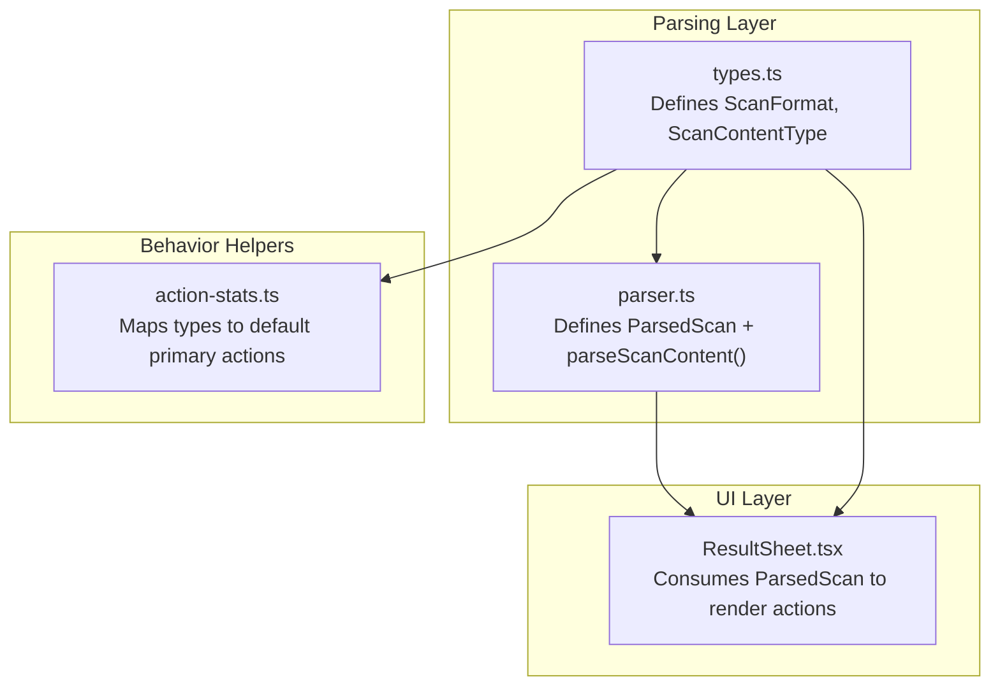
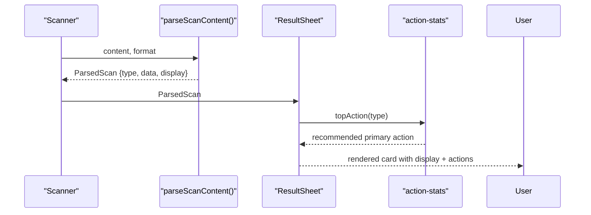
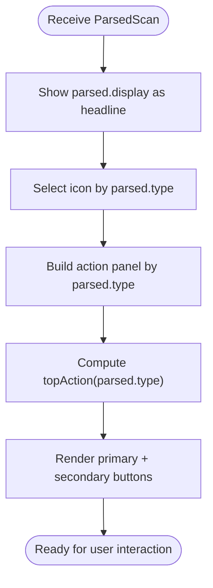
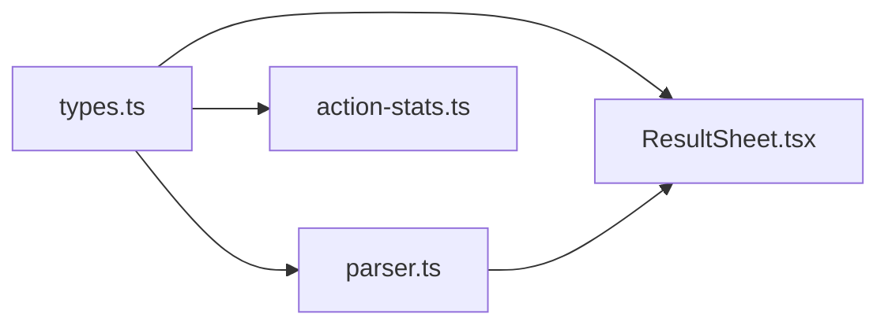

# Parsed Data Structure

<cite>
**Referenced Files in This Document**
- [parser.ts](file://src/lib/scan/parser.ts)
- [types.ts](file://src/lib/scan/types.ts)
- [ResultSheet.tsx](file://src/components/ResultSheet.tsx)
- [action-stats.ts](file://src/lib/action-stats.ts)
</cite>

## Table of Contents
1. [Introduction](#introduction)
2. [Project Structure](#project-structure)
3. [Core Components](#core-components)
4. [Architecture Overview](#architecture-overview)
5. [Detailed Component Analysis](#detailed-component-analysis)
6. [Dependency Analysis](#dependency-analysis)
7. [Performance Considerations](#performance-considerations)
8. [Troubleshooting Guide](#troubleshooting-guide)
9. [Conclusion](#conclusion)
10. [Appendices](#appendices)

## Introduction
This document explains the ParsedScan interface and the standardized data structure returned by the parsing engine. It focuses on the three core properties:
- type (ScanContentType): a semantic content category used to drive UI behavior and actions
- data (Record<string, string>): structured fields extracted from the raw scan content
- display (string): a user-friendly summary for immediate presentation

It also documents how each supported content type populates these fields differently, clarifies the relationship between structured data and display text, and shows example ParsedScan objects for each content type. Finally, it describes how downstream components consume this format to render consistent, actionable results.

## Project Structure
The parsing logic and types are centralized under the scan library, while the UI consumes the parsed result to present context-aware actions and summaries.

**Diagram sources**
- [types.ts:1-26](file://src/lib/scan/types.ts#L1-L26)
- [parser.ts:6-10](file://src/lib/scan/parser.ts#L6-L10)
- [ResultSheet.tsx:128-131](file://src/components/ResultSheet.tsx#L128-L131)
- [action-stats.ts:10-21](file://src/lib/action-stats.ts#L10-L21)

**Section sources**
- [types.ts:1-26](file://src/lib/scan/types.ts#L1-L26)
- [parser.ts:6-10](file://src/lib/scan/parser.ts#L6-L10)
- [ResultSheet.tsx:128-131](file://src/components/ResultSheet.tsx#L128-L131)
- [action-stats.ts:10-21](file://src/lib/action-stats.ts#L10-L21)

## Core Components
- ParsedScan interface: The canonical output of the parser with three fields:
  - type: one of the values defined by ScanContentType
  - data: a key-value map of extracted fields; keys vary by content type
  - display: a concise, human-readable label or snippet intended for immediate visibility
- parseScanContent(content, format): Determines the content type based on the raw content and barcode format, then returns a fully populated ParsedScan.

Downstream consumers:
- ResultSheet uses parsed.type to select icons and action panels, parsed.display as the headline, and typed fields inside parsed.data to power specific behaviors (e.g., opening maps, dialing numbers).
- action-stats maps each ScanContentType to a default primary action, which influences the prominent button shown to users.

**Section sources**
- [parser.ts:6-10](file://src/lib/scan/parser.ts#L6-L10)
- [parser.ts:12-101](file://src/lib/scan/parser.ts#L12-L101)
- [ResultSheet.tsx:128-131](file://src/components/ResultSheet.tsx#L128-L131)
- [action-stats.ts:10-21](file://src/lib/action-stats.ts#L10-L21)

## Architecture Overview
The parsing pipeline is simple and deterministic:
- Input: raw content string and scanner-reported format
- Processing: pattern-based detection and URL parsing to infer content semantics
- Output: a normalized ParsedScan object consumed uniformly by the UI

**Diagram sources**
- [parser.ts:12-101](file://src/lib/scan/parser.ts#L12-L101)
- [ResultSheet.tsx:128-131](file://src/components/ResultSheet.tsx#L128-L131)
- [action-stats.ts:55-76](file://src/lib/action-stats.ts#L55-L76)

## Detailed Component Analysis

### ParsedScan Interface
- type: Enumerated content category that drives UI routing and action selection
- data: Typed-by-context dictionary of extracted fields; all values are strings
- display: Human-friendly summary suitable for headlines and quick scanning

Key design principles:
- Uniform shape across all content types simplifies rendering and action mapping
- Structured data enables programmatic actions (e.g., open maps, call number)
- Display text ensures good UX even when structured fields are sparse

**Section sources**
- [parser.ts:6-10](file://src/lib/scan/parser.ts#L6-L10)

### Content Type Behavior and Field Evolution
Below are examples of complete ParsedScan objects for each supported content type. These illustrate how type, data, and display evolve per content semantics.

- Product (barcode digits)
  - type: "product"
  - data: { code }
  - display: same numeric code
  - Notes: Used when the scanner reports a numeric barcode format and the payload is digits only

- Payment (UPI)
  - type: "payment"
  - data: { scheme: "upi", payee, amount, raw }
  - display: payee if available, otherwise a generic label
  - Notes: Extracts UPI parameters; includes raw payload for reference

- Payment (PayPal.me)
  - type: "payment"
  - data: { scheme: "paypal", payee, raw }
  - display: "PayPal: <recipient>"
  - Notes: Host-based detection for PayPal.me links

- Payment (Venmo/Cash App)
  - type: "payment"
  - data: { scheme: "<host>", payee, raw }
  - display: "<host>: <recipient>"
  - Notes: Normalizes host into scheme and extracts recipient from path

- URL (http/https/ftp)
  - type: "url"
  - data: { url, host }
  - display: original URL string
  - Notes: Generic URL handling after payment-specific checks

- WiFi configuration
  - type: "wifi"
  - data: { ssid, password, encryption, hidden }
  - display: SSID if available, else raw string
  - Notes: Parses WIFI: URI fields into normalized keys

- vCard
  - type: "vcard"
  - data: { name, tel, email, raw }
  - display: name, phone, or email if present, else "Contact"
  - Notes: Extracts common contact fields and retains raw payload

- Email (mailto:)
  - type: "email"
  - data: { to, subject, body }
  - display: recipient address
  - Notes: Uses URL parsing to extract mailto parameters

- Email (plain address)
  - type: "email"
  - data: { to }
  - display: email address
  - Notes: Fallback for bare email addresses

- SMS (smsto:/sms:)
  - type: "sms"
  - data: { number, body }
  - display: phone number
  - Notes: Splits optional message body from the target number

- Phone (tel:)
  - type: "phone"
  - data: { number }
  - display: phone number
  - Notes: Strips the scheme to expose the number

- Geo location (geo:)
  - type: "geo"
  - data: { coords }
  - display: coordinate string
  - Notes: Passes coordinates through for map integration

- Text (fallback)
  - type: "text"
  - data: { text }
  - display: trimmed content
  - Notes: Catch-all for unrecognized content

These examples demonstrate how structured data grows richer for complex formats (e.g., payment schemes, vCard fields), while simpler formats keep minimal fields. The display field always provides a readable summary independent of data completeness.

**Section sources**
- [parser.ts:15-17](file://src/lib/scan/parser.ts#L15-L17)
- [parser.ts:20-25](file://src/lib/scan/parser.ts#L20-L25)
- [parser.ts:33-46](file://src/lib/scan/parser.ts#L33-L46)
- [parser.ts:52-64](file://src/lib/scan/parser.ts#L52-L64)
- [parser.ts:67-72](file://src/lib/scan/parser.ts#L67-L72)
- [parser.ts:75-81](file://src/lib/scan/parser.ts#L75-L81)
- [parser.ts:84-88](file://src/lib/scan/parser.ts#L84-L88)
- [parser.ts:91-93](file://src/lib/scan/parser.ts#L91-L93)
- [parser.ts:96-98](file://src/lib/scan/parser.ts#L96-L98)
- [parser.ts:100-101](file://src/lib/scan/parser.ts#L100-L101)

### Downstream Consumption Patterns
- Rendering:
  - Icon selection: mapped by parsed.type
  - Headline: uses parsed.display
  - Action panel: switches on parsed.type to show relevant controls
- Actions:
  - Primary action recommendation: derived from parsed.type via action stats
  - Secondary actions: copy/share/translate depending on type
- Safety:
  - For url/payment types, additional safety analysis can be applied before opening links

**Diagram sources**
- [ResultSheet.tsx:128-131](file://src/components/ResultSheet.tsx#L128-L131)
- [ResultSheet.tsx:190-331](file://src/components/ResultSheet.tsx#L190-L331)
- [action-stats.ts:55-76](file://src/lib/action-stats.ts#L55-L76)

**Section sources**
- [ResultSheet.tsx:128-131](file://src/components/ResultSheet.tsx#L128-L131)
- [ResultSheet.tsx:190-331](file://src/components/ResultSheet.tsx#L190-L331)
- [action-stats.ts:10-21](file://src/lib/action-stats.ts#L10-L21)
- [action-stats.ts:55-76](file://src/lib/action-stats.ts#L55-L76)

## Dependency Analysis
- Types dependency:
  - parser.ts imports ScanContentType and ScanFormat from types.ts
  - ResultSheet.tsx imports ScanContentType and uses parsed.type for UI routing
  - action-stats.ts imports ScanContentType to map default actions
- Parsing-to-UI contract:
  - The UI expects exactly the three fields defined by ParsedScan
  - Additional fields in data are optional and type-specific; consumers should guard access

**Diagram sources**
- [types.ts:16-26](file://src/lib/scan/types.ts#L16-L26)
- [parser.ts:1](file://src/lib/scan/parser.ts#L1)
- [ResultSheet.tsx:25-26](file://src/components/ResultSheet.tsx#L25-L26)
- [action-stats.ts:3](file://src/lib/action-stats.ts#L3)

**Section sources**
- [types.ts:16-26](file://src/lib/scan/types.ts#L16-L26)
- [parser.ts:1](file://src/lib/scan/parser.ts#L1)
- [ResultSheet.tsx:25-26](file://src/components/ResultSheet.tsx#L25-L26)
- [action-stats.ts:3](file://src/lib/action-stats.ts#L3)

## Performance Considerations
- Parsing is lightweight and synchronous, using regex and URL parsing; no I/O involved
- Avoid re-parsing identical inputs by caching results at higher layers if needed
- Keep data fields minimal and string-only to reduce serialization overhead

[No sources needed since this section provides general guidance]

## Troubleshooting Guide
- Missing fields in data:
  - Some types may omit optional fields (e.g., amount in payment, body in sms); always check existence before use
- Unexpected type:
  - If content does not match any known pattern, it falls back to "text"; verify input formatting and scanner-reported format
- Display vs. data mismatch:
  - display is optimized for readability; do not rely on it for machine processing—use data instead

**Section sources**
- [parser.ts:100-101](file://src/lib/scan/parser.ts#L100-L101)

## Conclusion
ParsedScan provides a stable, type-driven contract that unifies diverse scan payloads into a single shape. The type field drives behavior, data exposes structured information for programmatic actions, and display offers a friendly summary for users. By adhering to this contract, both the parser and UI remain decoupled and extensible as new content types are added.

[No sources needed since this section summarizes without analyzing specific files]

## Appendices

### Appendix A: Complete Example Objects by Content Type
- Product
  - type: "product"
  - data: { code }
  - display: code string
- Payment (UPI)
  - type: "payment"
  - data: { scheme: "upi", payee, amount, raw }
  - display: payee or generic label
- Payment (PayPal.me)
  - type: "payment"
  - data: { scheme: "paypal", payee, raw }
  - display: "PayPal: <recipient>"
- Payment (Venmo/Cash App)
  - type: "payment"
  - data: { scheme: "<host>", payee, raw }
  - display: "<host>: <recipient>"
- URL
  - type: "url"
  - data: { url, host }
  - display: url string
- WiFi
  - type: "wifi"
  - data: { ssid, password, encryption, hidden }
  - display: ssid or raw
- vCard
  - type: "vcard"
  - data: { name, tel, email, raw }
  - display: name/tel/email or "Contact"
- Email (mailto)
  - type: "email"
  - data: { to, subject, body }
  - display: to address
- Email (bare)
  - type: "email"
  - data: { to }
  - display: email address
- SMS
  - type: "sms"
  - data: { number, body }
  - display: number
- Phone
  - type: "phone"
  - data: { number }
  - display: number
- Geo
  - type: "geo"
  - data: { coords }
  - display: coords
- Text
  - type: "text"
  - data: { text }
  - display: text

**Section sources**
- [parser.ts:15-17](file://src/lib/scan/parser.ts#L15-L17)
- [parser.ts:20-25](file://src/lib/scan/parser.ts#L20-L25)
- [parser.ts:33-46](file://src/lib/scan/parser.ts#L33-L46)
- [parser.ts:52-64](file://src/lib/scan/parser.ts#L52-L64)
- [parser.ts:67-72](file://src/lib/scan/parser.ts#L67-L72)
- [parser.ts:75-81](file://src/lib/scan/parser.ts#L75-L81)
- [parser.ts:84-88](file://src/lib/scan/parser.ts#L84-L88)
- [parser.ts:91-93](file://src/lib/scan/parser.ts#L91-L93)
- [parser.ts:96-98](file://src/lib/scan/parser.ts#L96-L98)
- [parser.ts:100-101](file://src/lib/scan/parser.ts#L100-L101)