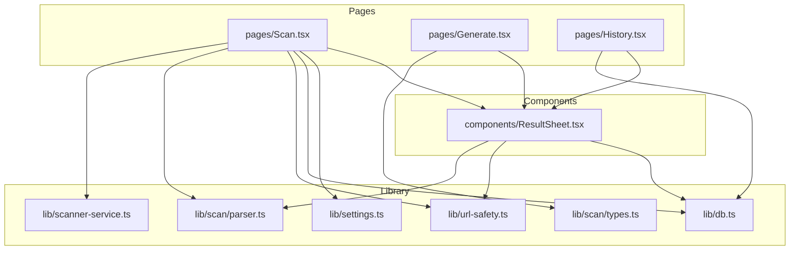
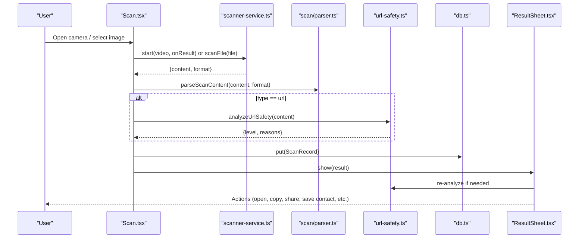
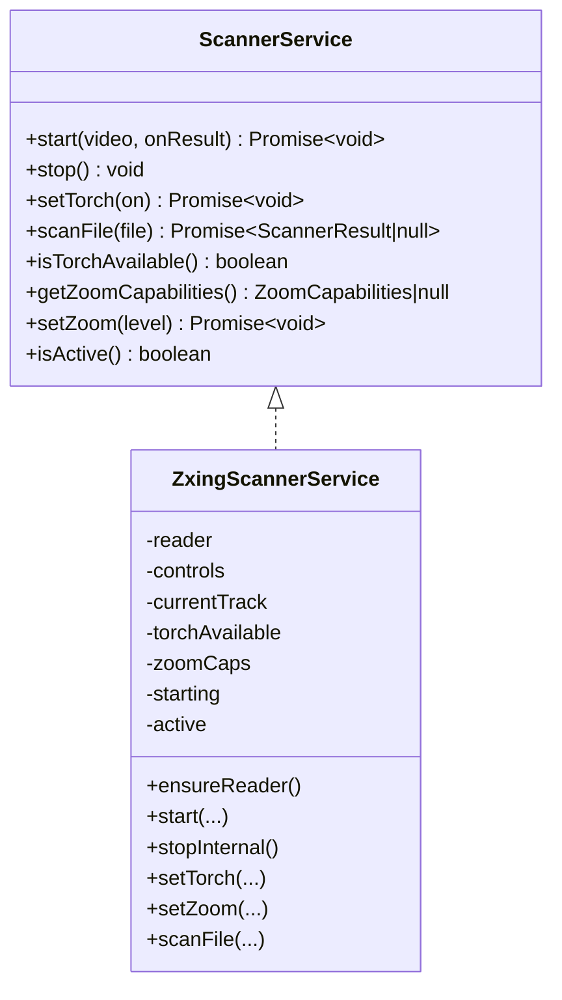
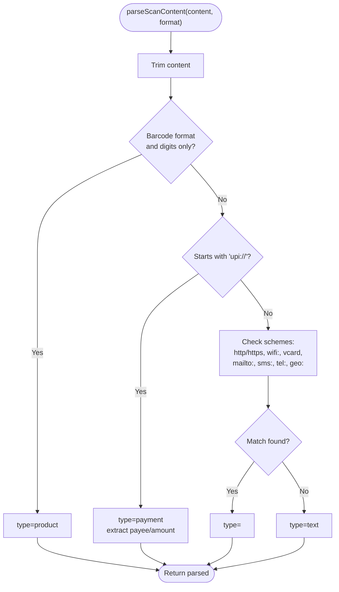
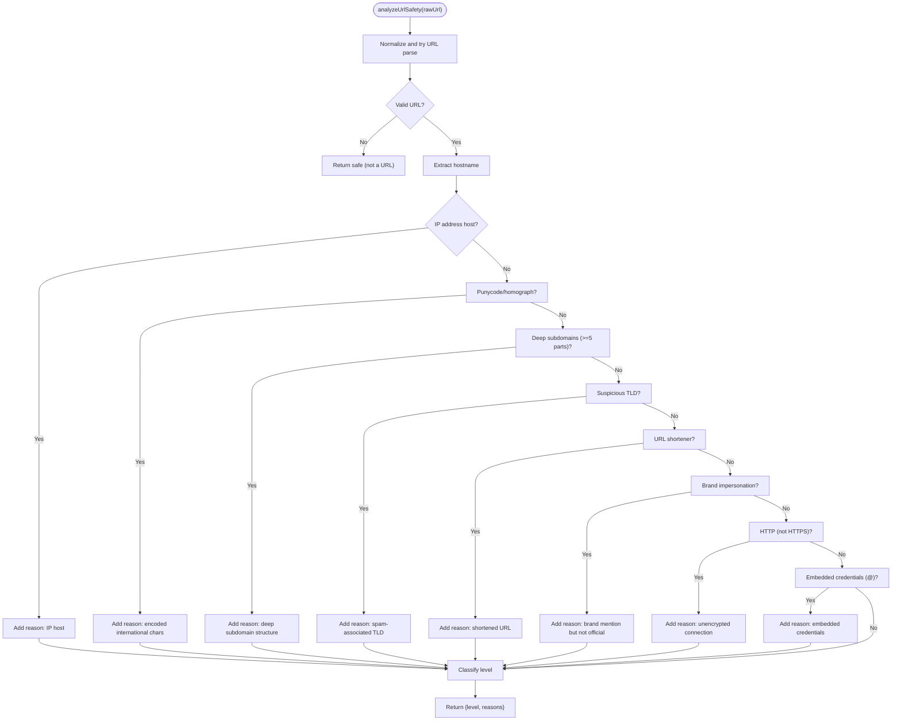
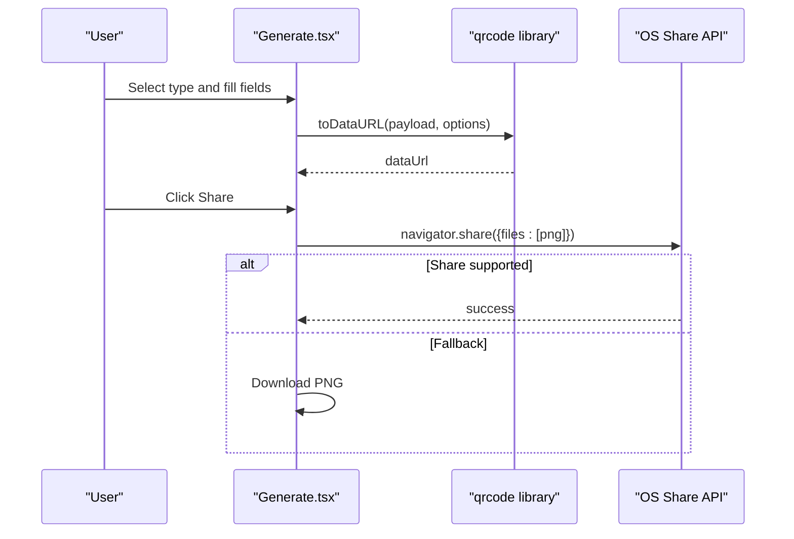
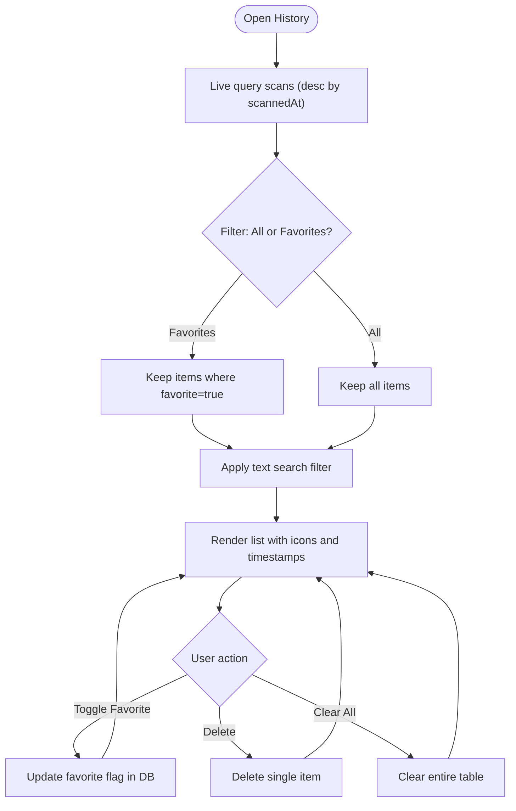
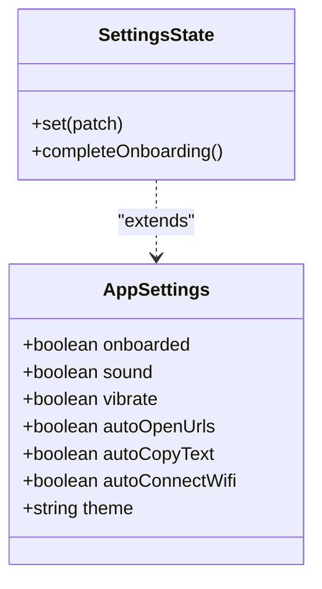
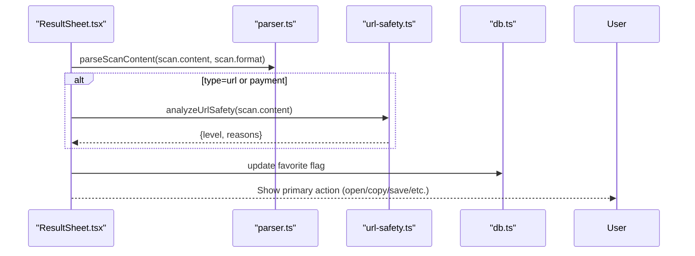
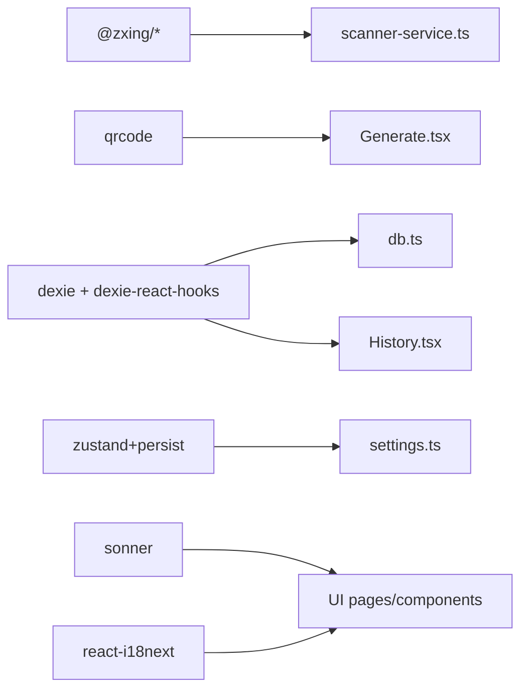

# Core Features

<cite>
**Referenced Files in This Document**
- [README.md](file://README.md)
- [package.json](file://package.json)
- [src/lib/scanner-service.ts](file://src/lib/scanner-service.ts)
- [src/lib/url-safety.ts](file://src/lib/url-safety.ts)
- [src/pages/Scan.tsx](file://src/pages/Scan.tsx)
- [src/pages/Generate.tsx](file://src/pages/Generate.tsx)
- [src/components/ResultSheet.tsx](file://src/components/ResultSheet.tsx)
- [src/lib/db.ts](file://src/lib/db.ts)
- [src/lib/settings.ts](file://src/lib/settings.ts)
- [src/lib/scan/types.ts](file://src/lib/scan/types.ts)
- [src/lib/scan/parser.ts](file://src/lib/scan/parser.ts)
</cite>

## Table of Contents
1. Introduction
2. Project Structure
3. Core Components
4. Architecture Overview
5. Detailed Component Analysis
6. Dependency Analysis
7. Performance Considerations
8. Troubleshooting Guide
9. Conclusion

## Introduction
Smart Scan Pro is a browser-based QR and barcode scanner with intelligent content parsing, URL safety analysis, QR code generation, history management, and user preferences. It supports multiple barcode formats, parses common content types (URLs, WiFi credentials, contact cards, payment links), and provides a safe browsing experience through an inline safety engine. The app also includes a generator for creating QR codes from various payloads and a robust history system with favorites and automatic cleanup.

## Project Structure
The application follows a feature-oriented layout:
- Pages: Scan, Generate, History, Profile, Onboarding, Privacy, Language, ShareQR
- Library modules: Scanner service, URL safety analyzer, database layer, settings store, parser, and utilities
- UI components: Shared primitives and composite components like ResultSheet

**Diagram sources**
- [src/pages/Scan.tsx:1-488](file://src/pages/Scan.tsx#L1-L488)
- [src/pages/Generate.tsx:1-225](file://src/pages/Generate.tsx#L1-L225)
- [src/pages/History.tsx:1-138](file://src/pages/History.tsx#L1-L138)
- [src/lib/scanner-service.ts:1-198](file://src/lib/scanner-service.ts#L1-L198)
- [src/lib/scan/parser.ts:1-25](file://src/lib/scan/parser.ts#L1-L25)
- [src/lib/scan/types.ts:1-48](file://src/lib/scan/types.ts#L1-L48)
- [src/lib/url-safety.ts:1-106](file://src/lib/url-safety.ts#L1-L106)
- [src/lib/db.ts:1-37](file://src/lib/db.ts#L1-L37)
- [src/lib/settings.ts:1-35](file://src/lib/settings.ts#L1-L35)
- [src/components/ResultSheet.tsx:1-418](file://src/components/ResultSheet.tsx#L1-L418)

**Section sources**
- [README.md:1-4](file://README.md#L1-L4)
- [package.json:1-70](file://package.json#L1-L70)

## Core Components
- Multi-format scanner: Real-time camera scanning and image file scanning using a multi-format reader with support for QR, EAN, UPC, Code 128, Code 39, Code 93, ITF, Data Matrix, PDF 417, and Aztec.
- Intelligent content parser: Detects product barcodes, UPI payments, URLs, WiFi credentials, vCards, email, SMS, phone numbers, geo locations, and generic text.
- URL safety engine: Heuristic checks for dangerous protocols, IP hosts, punycode/homograph domains, deep subdomains, suspicious TLDs, shorteners, brand impersonation, HTTP usage, and embedded credentials.
- QR generator: Creates QR images for URLs, text, WiFi, vCard, email, SMS, and phone with download and share options.
- History and favorites: IndexedDB-backed history with search, favorite toggling, per-item deletion, clear-all, and automatic pruning of non-favorites beyond a free-tier limit.
- Settings and preferences: Persisted toggles for auto-copy, auto-open URLs, auto-copy WiFi password, sound/vibration feedback, and theme.

**Section sources**
- [src/lib/scanner-service.ts:1-198](file://src/lib/scanner-service.ts#L1-L198)
- [src/lib/scan/parser.ts:1-25](file://src/lib/scan/parser.ts#L1-L25)
- [src/lib/scan/types.ts:1-48](file://src/lib/scan/types.ts#L1-L48)
- [src/lib/url-safety.ts:1-106](file://src/lib/url-safety.ts#L1-L106)
- [src/pages/Generate.tsx:1-225](file://src/pages/Generate.tsx#L1-L225)
- [src/lib/db.ts:1-37](file://src/lib/db.ts#L1-L37)
- [src/lib/settings.ts:1-35](file://src/lib/settings.ts#L1-L35)
- [src/components/ResultSheet.tsx:1-418](file://src/components/ResultSheet.tsx#L1-L418)

## Architecture Overview
High-level flow from scan to result and storage:

**Diagram sources**
- [src/pages/Scan.tsx:50-102](file://src/pages/Scan.tsx#L50-L102)
- [src/lib/scanner-service.ts:80-131](file://src/lib/scanner-service.ts#L80-L131)
- [src/lib/scan/parser.ts:12-25](file://src/lib/scan/parser.ts#L12-L25)
- [src/lib/url-safety.ts:31-105](file://src/lib/url-safety.ts#L31-L105)
- [src/lib/db.ts:1-37](file://src/lib/db.ts#L1-L37)
- [src/components/ResultSheet.tsx:122-175](file://src/components/ResultSheet.tsx#L122-L175)

## Detailed Component Analysis

### Multi-format Barcode Scanning
- Camera scanning: Starts a constrained video stream, configures supported formats, and invokes a callback on each decode. Supports torch and zoom where available.
- Image scanning: Accepts an image file and decodes via the same reader.
- Format support: QR_CODE, EAN_13, EAN_8, UPC_A, UPC_E, CODE_128, CODE_39, CODE_93, ITF, DATA_MATRIX, PDF_417, AZTEC.

**Diagram sources**
- [src/lib/scanner-service.ts:14-23](file://src/lib/scanner-service.ts#L14-L23)
- [src/lib/scanner-service.ts:42-191](file://src/lib/scanner-service.ts#L42-L191)

**Section sources**
- [src/lib/scanner-service.ts:25-74](file://src/lib/scanner-service.ts#L25-L74)
- [src/lib/scanner-service.ts:80-131](file://src/lib/scanner-service.ts#L80-L131)
- [src/lib/scanner-service.ts:155-170](file://src/lib/scanner-service.ts#L155-L170)
- [src/lib/scanner-service.ts:176-190](file://src/lib/scanner-service.ts#L176-L190)
- [src/pages/Scan.tsx:104-180](file://src/pages/Scan.tsx#L104-L180)
- [src/pages/Scan.tsx:254-268](file://src/pages/Scan.tsx#L254-L268)

### Intelligent Content Parsing
- Recognizes product barcodes by numeric content and known barcode formats.
- Parses UPI payment links into structured fields (payee, amount).
- Handles standard schemes: http(s), wifi:, vcard, mailto:, sms:, tel:, geo:.
- Falls back to generic text when no specific pattern matches.

**Diagram sources**
- [src/lib/scan/parser.ts:12-25](file://src/lib/scan/parser.ts#L12-L25)
- [src/lib/scan/types.ts:16-26](file://src/lib/scan/types.ts#L16-L26)

**Section sources**
- [src/lib/scan/parser.ts:1-25](file://src/lib/scan/parser.ts#L1-L25)
- [src/lib/scan/types.ts:16-26](file://src/lib/scan/types.ts#L16-L26)

### URL Safety Analysis Engine
- Flags dangerous protocols (javascript:, data:).
- Detects IP host addresses, punycode/homograph domains, excessive subdomains, suspicious TLDs, URL shorteners, brand impersonation, unencrypted HTTP, and embedded credentials.
- Classifies results as safe, suspicious, or malicious based on severity and count of indicators.

**Diagram sources**
- [src/lib/url-safety.ts:31-105](file://src/lib/url-safety.ts#L31-L105)

**Section sources**
- [src/lib/url-safety.ts:1-106](file://src/lib/url-safety.ts#L1-L106)

### QR Code Generation
- Supported payload types: URL, text, WiFi (SSID, password, encryption, hidden), vCard (name, phone, email), email (to, subject), SMS (number, body), phone (number).
- Generates a high-resolution PNG preview with configurable colors and error correction.
- Provides download and native share fallbacks.

**Diagram sources**
- [src/pages/Generate.tsx:24-41](file://src/pages/Generate.tsx#L24-L41)
- [src/pages/Generate.tsx:52-71](file://src/pages/Generate.tsx#L52-L71)
- [src/pages/Generate.tsx:89-111](file://src/pages/Generate.tsx#L89-L111)

**Section sources**
- [src/pages/Generate.tsx:1-225](file://src/pages/Generate.tsx#L1-L225)

### History Management System
- Live query of scans ordered by time.
- Search across raw content.
- Favorites toggle persisted in DB.
- Per-item delete and clear-all.
- Automatic pruning of oldest non-favorites beyond a configured limit.

**Diagram sources**
- [src/pages/History.tsx:34-138](file://src/pages/History.tsx#L34-L138)
- [src/lib/db.ts:1-37](file://src/lib/db.ts#L1-L37)

**Section sources**
- [src/pages/History.tsx:1-138](file://src/pages/History.tsx#L1-L138)
- [src/lib/db.ts:1-37](file://src/lib/db.ts#L1-L37)

### User Settings and Preferences
- Persisted state for onboarding, sound, vibration, auto-copy text, auto-open URLs, auto-copy WiFi password, and theme.
- Used by the scanner page to perform automatic actions after a successful scan.

**Diagram sources**
- [src/lib/settings.ts:4-34](file://src/lib/settings.ts#L4-L34)

**Section sources**
- [src/lib/settings.ts:1-35](file://src/lib/settings.ts#L1-L35)
- [src/pages/Scan.tsx:74-97](file://src/pages/Scan.tsx#L74-L97)

### Result Sheet and Smart Actions
- Displays parsed content with smart actions tailored to the detected type.
- Shows URL safety status and warnings; prompts confirmation for malicious links.
- Supports copy, share, open link, call/email/SMS, save contact, open maps, and open payment links.
- Integrates with action stats to highlight the most-used action.

**Diagram sources**
- [src/components/ResultSheet.tsx:122-175](file://src/components/ResultSheet.tsx#L122-L175)
- [src/components/ResultSheet.tsx:155-160](file://src/components/ResultSheet.tsx#L155-L160)
- [src/lib/scan/parser.ts:12-25](file://src/lib/scan/parser.ts#L12-L25)
- [src/lib/url-safety.ts:31-105](file://src/lib/url-safety.ts#L31-L105)
- [src/lib/db.ts:1-37](file://src/lib/db.ts#L1-L37)

**Section sources**
- [src/components/ResultSheet.tsx:1-418](file://src/components/ResultSheet.tsx#L1-L418)

## Dependency Analysis
Key external dependencies and their roles:
- @zxing/browser and @zxing/library: Multi-format barcode decoding for live camera and image files.
- qrcode: Client-side QR code generation to PNG.
- dexie and dexie-react-hooks: IndexedDB persistence and reactive queries.
- zustand with persist middleware: Local settings store.
- sonner: Toast notifications.
- react-i18next: Internationalization.

**Diagram sources**
- [package.json:16-46](file://package.json#L16-L46)
- [src/lib/scanner-service.ts:42-74](file://src/lib/scanner-service.ts#L42-L74)
- [src/pages/Generate.tsx:52-71](file://src/pages/Generate.tsx#L52-L71)
- [src/lib/db.ts:1-17](file://src/lib/db.ts#L1-L17)
- [src/pages/History.tsx:1-10](file://src/pages/History.tsx#L1-L10)
- [src/lib/settings.ts:1-35](file://src/lib/settings.ts#L1-L35)

**Section sources**
- [package.json:1-70](file://package.json#L1-L70)

## Performance Considerations
- Decoding cadence: The scanner sets a delay between scan attempts to reduce CPU load during continuous video processing.
- Debounced zoom updates: Zoom changes are batched via requestAnimationFrame to avoid frequent MediaStream constraint updates.
- Pruning strategy: Non-favorite records are pruned in batches to keep IndexedDB size manageable.
- Lazy imports: The scanner lazily loads heavy decoding libraries to improve initial load time.
- Avoid redundant work: Duplicate results within a short window are ignored to prevent repeated parsing and storage writes.

[No sources needed since this section provides general guidance]

## Troubleshooting Guide
- Camera permission denied: The scanner detects permission states and shows appropriate overlays with retry or settings navigation.
- No camera devices: If enumerateDevices finds no video input, it displays an unavailable state.
- Camera initialization errors: Specific error messages guide users to check permissions, device availability, or browser compatibility.
- Clipboard operations: Copy/share actions gracefully fall back when APIs are unavailable or aborted.
- Storage failures: Errors writing to IndexedDB surface as toast notifications.

**Section sources**
- [src/pages/Scan.tsx:104-180](file://src/pages/Scan.tsx#L104-L180)
- [src/pages/Scan.tsx:158-179](file://src/pages/Scan.tsx#L158-L179)
- [src/components/ResultSheet.tsx:132-153](file://src/components/ResultSheet.tsx#L132-L153)
- [src/pages/Scan.tsx:98-101](file://src/pages/Scan.tsx#L98-L101)

## Conclusion
Smart Scan Pro combines reliable multi-format scanning, intelligent content parsing, proactive URL safety analysis, flexible QR generation, and a robust history system with user-controlled automation. Its modular architecture separates concerns across scanning, parsing, safety, storage, and UI, enabling maintainability and extensibility while delivering a smooth mobile-first experience.