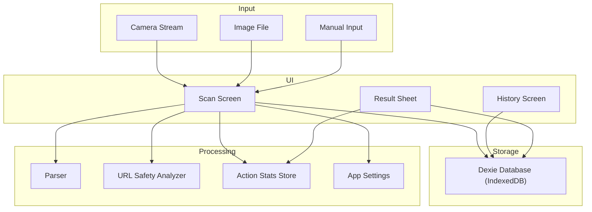
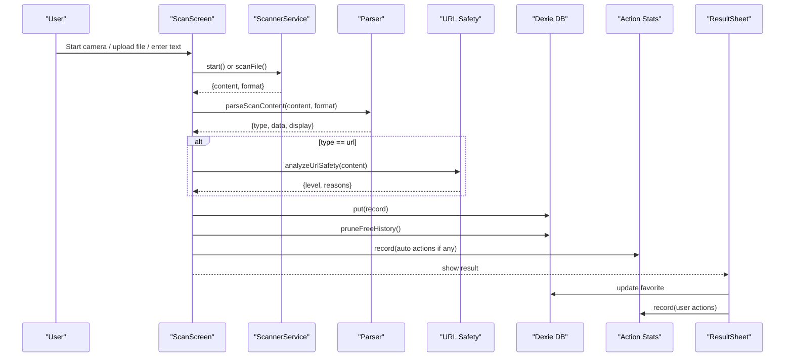
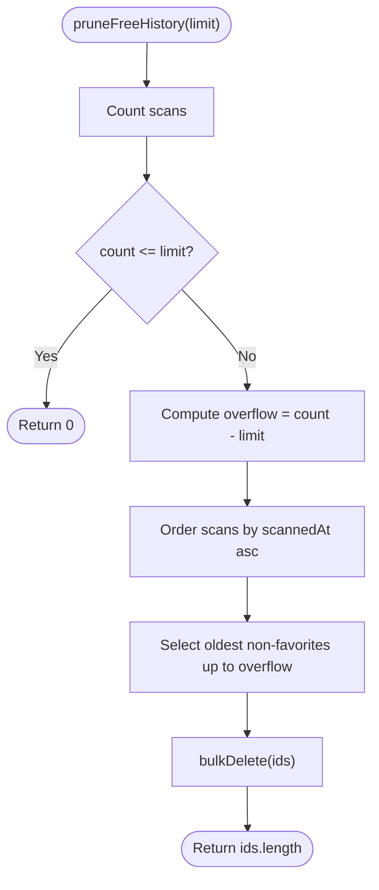
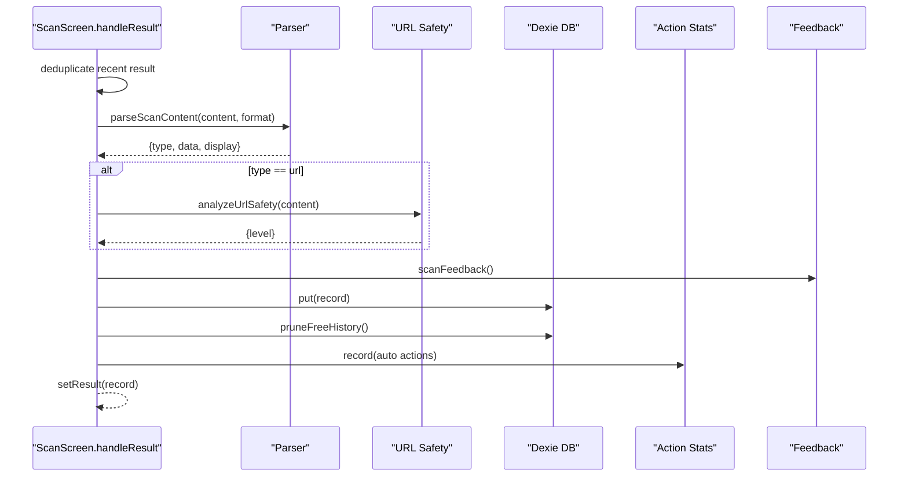
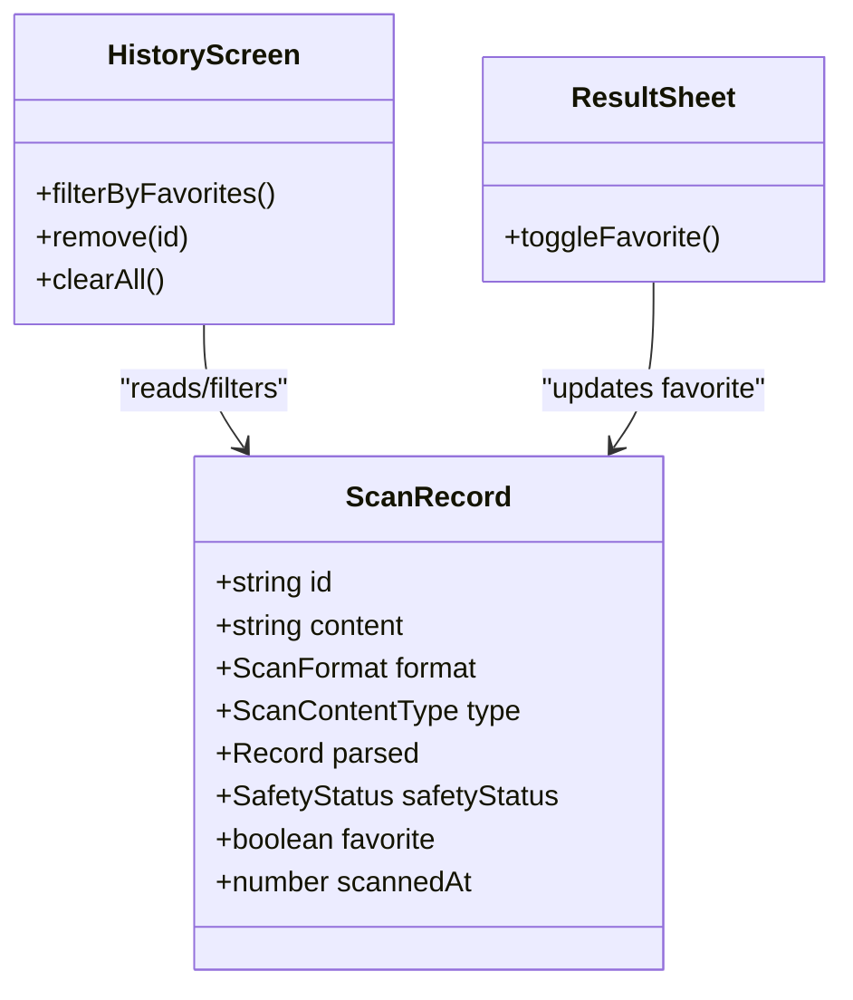
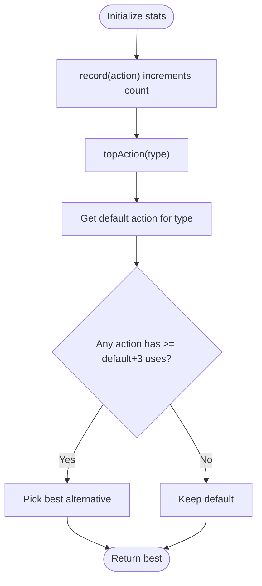
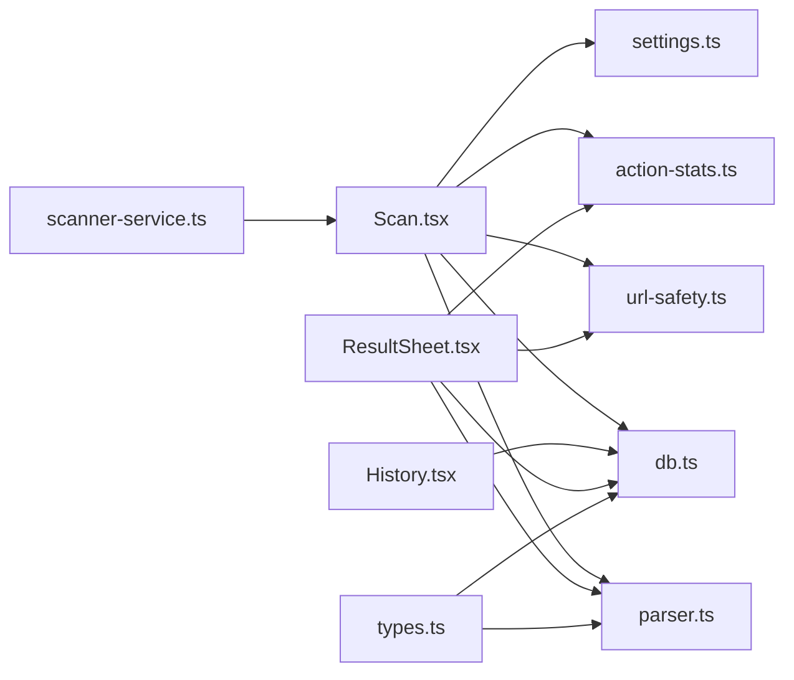
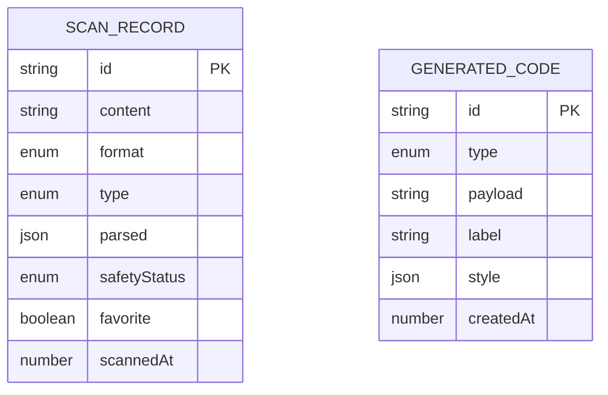

# Data Lifecycle Management

<cite>
**Referenced Files in This Document**
- [db.ts](file://src/lib/db.ts)
- [types.ts](file://src/lib/scan/types.ts)
- [parser.ts](file://src/lib/scan/parser.ts)
- [url-safety.ts](file://src/lib/url-safety.ts)
- [action-stats.ts](file://src/lib/action-stats.ts)
- [settings.ts](file://src/lib/settings.ts)
- [scanner-service.ts](file://src/lib/scanner-service.ts)
- [feedback.ts](file://src/lib/feedback.ts)
- [Scan.tsx](file://src/pages/Scan.tsx)
- [History.tsx](file://src/pages/History.tsx)
- [ResultSheet.tsx](file://src/components/ResultSheet.tsx)
</cite>

## Table of Contents
1. [Introduction](#introduction)
2. [Project Structure](#project-structure)
3. [Core Components](#core-components)
4. [Architecture Overview](#architecture-overview)
5. [Detailed Component Analysis](#detailed-component-analysis)
6. [Dependency Analysis](#dependency-analysis)
7. [Performance Considerations](#performance-considerations)
8. [Troubleshooting Guide](#troubleshooting-guide)
9. [Conclusion](#conclusion)
10. [Appendices](#appendices)

## Introduction
This document explains the end-to-end lifecycle management of scan data, covering creation, modification, deletion, and cleanup. It details automatic free-tier history pruning, favorites handling, bulk clear operations, action statistics tracking, usage analytics collection, performance monitoring considerations, data retention policies, archival strategies, privacy implications, error handling patterns, transactional behavior, and consistency guarantees.

## Project Structure
The application is a browser-based scanner with:
- A camera/file/manual input pipeline that produces scan results
- Parsing and safety analysis to classify content
- Local persistence using IndexedDB via Dexie
- UI for viewing, editing favorites, deleting, and clearing history
- Action statistics persisted locally for smart defaults
- Settings controlling auto-actions

[No sources needed since this diagram shows conceptual workflow, not actual code structure]

## Core Components
- Database layer: Defines tables, indexes, and free-tier pruning logic.
- Scanner service: Provides scanning from camera or file.
- Parser: Classifies raw content into typed structures.
- URL safety analyzer: Evaluates risk for URLs.
- Action stats: Tracks user actions to learn preferred primary actions.
- Settings: Controls auto behaviors like auto-copy or auto-open.
- UI screens: Create records, manage favorites, delete, and clear all.

Key responsibilities:
- Creation: Parse, analyze safety, persist record, trigger pruning.
- Modification: Toggle favorite status.
- Deletion: Remove single or all records.
- Cleanup: Enforce free-tier limits by removing oldest non-favorites.
- Analytics: Record user actions for personalization.

**Section sources**
- [db.ts:1-35](file://src/lib/db.ts#L1-L35)
- [scanner-service.ts:1-198](file://src/lib/scanner-service.ts#L1-L198)
- [parser.ts:1-102](file://src/lib/scan/parser.ts#L1-L102)
- [url-safety.ts:1-106](file://src/lib/url-safety.ts#L1-L106)
- [action-stats.ts:1-81](file://src/lib/action-stats.ts#L1-L81)
- [settings.ts:1-35](file://src/lib/settings.ts#L1-L35)
- [Scan.tsx:1-488](file://src/pages/Scan.tsx#L1-L488)
- [History.tsx:1-138](file://src/pages/History.tsx#L1-L138)
- [ResultSheet.tsx:1-414](file://src/components/ResultSheet.tsx#L1-L414)

## Architecture Overview
The scan data lifecycle flows through these stages:
1. Capture: Camera stream, image file, or manual text input.
2. Parse & Analyze: Determine type and optional safety assessment.
3. Persist: Save record to IndexedDB; optionally perform auto-actions.
4. Prune: If over free-tier limit, remove oldest non-favorites.
5. Present: Show result sheet with smart actions and favorites toggle.
6. Manage: View history, filter favorites, delete individual items, clear all.

**Diagram sources**
- [Scan.tsx:50-102](file://src/pages/Scan.tsx#L50-L102)
- [db.ts:21-34](file://src/lib/db.ts#L21-L34)
- [parser.ts:12-101](file://src/lib/scan/parser.ts#L12-L101)
- [url-safety.ts:31-105](file://src/lib/url-safety.ts#L31-L105)
- [action-stats.ts:45-80](file://src/lib/action-stats.ts#L45-L80)
- [ResultSheet.tsx:155-160](file://src/components/ResultSheet.tsx#L155-L160)

## Detailed Component Analysis

### Database Layer and Free-Tier Pruning
- Tables: scans (id, scannedAt, type, format, favorite, content), generated (id, createdAt, type).
- Free-tier policy: When total scans exceed a fixed limit, remove the oldest non-favorite entries until within limit.
- Bulk clear: History screen clears all scans.

**Diagram sources**
- [db.ts:21-34](file://src/lib/db.ts#L21-L34)

**Section sources**
- [db.ts:1-35](file://src/lib/db.ts#L1-L35)
- [History.tsx:57-60](file://src/pages/History.tsx#L57-L60)

### Scan Creation Flow
- Deduplication: Prevents duplicate rapid results by comparing last result content and timestamp.
- Parsing: Determines content type and structured fields.
- Safety: For URLs, computes safety level and stores it on the record.
- Persistence: Inserts or updates the record in IndexedDB.
- Auto-actions: Based on settings, may copy text, copy WiFi password, or open safe URLs.
- Feedback: Plays sound and vibrates on successful scan.

**Diagram sources**
- [Scan.tsx:50-102](file://src/pages/Scan.tsx#L50-L102)
- [parser.ts:12-101](file://src/lib/scan/parser.ts#L12-L101)
- [url-safety.ts:31-105](file://src/lib/url-safety.ts#L31-L105)
- [feedback.ts:37-41](file://src/lib/feedback.ts#L37-L41)
- [action-stats.ts:45-80](file://src/lib/action-stats.ts#L45-L80)

**Section sources**
- [Scan.tsx:50-102](file://src/pages/Scan.tsx#L50-L102)
- [parser.ts:12-101](file://src/lib/scan/parser.ts#L12-L101)
- [url-safety.ts:31-105](file://src/lib/url-safety.ts#L31-L105)
- [feedback.ts:1-41](file://src/lib/feedback.ts#L1-L41)
- [action-stats.ts:1-81](file://src/lib/action-stats.ts#L1-L81)

### Favorites System
- Toggle favorite state per record.
- Filter history by favorites tab.
- Favorite status influences pruning (favorites are protected).

**Diagram sources**
- [types.ts:30-39](file://src/lib/scan/types.ts#L30-L39)
- [History.tsx:42-60](file://src/pages/History.tsx#L42-L60)
- [ResultSheet.tsx:155-160](file://src/components/ResultSheet.tsx#L155-L160)

**Section sources**
- [types.ts:30-39](file://src/lib/scan/types.ts#L30-L39)
- [History.tsx:42-60](file://src/pages/History.tsx#L42-L60)
- [ResultSheet.tsx:155-160](file://src/components/ResultSheet.tsx#L155-L160)

### Bulk Operations (Clear All)
- Clear all removes every scan record instantly.
- No confirmation dialog is shown in current implementation.

**Section sources**
- [History.tsx:57-60](file://src/pages/History.tsx#L57-L60)

### Action Statistics Tracking and Smart Defaults
- Tracks counts per action globally and persists across sessions.
- Computes top action per content type with a threshold rule (requires at least 3 more uses than default to override).
- Used to highlight recommended primary actions in the result sheet.

**Diagram sources**
- [action-stats.ts:45-80](file://src/lib/action-stats.ts#L45-L80)

**Section sources**
- [action-stats.ts:1-81](file://src/lib/action-stats.ts#L1-L81)
- [ResultSheet.tsx:115-131](file://src/components/ResultSheet.tsx#L115-L131)

### Usage Analytics Collection
- Action events recorded include copy, share, open_url, send_email, send_sms, call, open_maps, save_contact, translate, open_payment, copy_password.
- Counts are stored locally and used to adapt UI recommendations.

**Section sources**
- [action-stats.ts:10-35](file://src/lib/action-stats.ts#L10-L35)
- [ResultSheet.tsx:132-187](file://src/components/ResultSheet.tsx#L132-L187)
- [Scan.tsx:78-97](file://src/pages/Scan.tsx#L78-L97)

### Performance Monitoring Considerations
- Debouncing/deduplication prevents repeated processing of identical results within a short window.
- Asynchronous pruning runs without blocking UI.
- Camera session lifecycle managed to avoid resource leaks.

Recommendations:
- Add timing metrics around parsing, safety analysis, and DB writes to monitor latency.
- Track prune frequency and number of deletions per run.
- Monitor camera start/stop errors and retry counts.

[No sources needed since this section provides general guidance]

### Data Retention Policies and Archival Strategies
- Free-tier retention: Keeps only the most recent N scans; older non-favorites are pruned automatically after each new scan.
- Archival strategy: Not implemented currently. Potential future approach:
  - Export scans to JSON before pruning.
  - Compress and store in IndexedDB under an archive table or external storage.
  - Provide restore functionality.

**Section sources**
- [db.ts:19-34](file://src/lib/db.ts#L19-L34)

### Privacy Considerations
- All data is stored locally in IndexedDB; no network transmission of scan contents occurs by default.
- URL safety analysis is performed client-side.
- Clipboard access is used conditionally based on user settings and explicit actions.
- External links opened with noopener/noreferrer to mitigate security risks.

**Section sources**
- [url-safety.ts:31-105](file://src/lib/url-safety.ts#L31-L105)
- [Scan.tsx:94-97](file://src/pages/Scan.tsx#L94-L97)
- [ResultSheet.tsx:162-175](file://src/components/ResultSheet.tsx#L162-L175)

### Error Handling Patterns
- Camera permission and device availability checks with user-friendly overlays and retry options.
- Graceful fallback when clipboard or sharing APIs are unavailable.
- Non-blocking pruning failures are ignored to avoid disrupting user flow.
- Toast notifications inform users about successes and failures.

**Section sources**
- [Scan.tsx:104-180](file://src/pages/Scan.tsx#L104-L180)
- [ResultSheet.tsx:132-153](file://src/components/ResultSheet.tsx#L132-L153)
- [db.ts:21-34](file://src/lib/db.ts#L21-L34)

### Transaction Management and Consistency Guarantees
- Each write operation (put, update, delete, clear) is executed individually.
- The sequence of put followed by prune is not wrapped in a single transaction; prune runs asynchronously and independently.
- Dexie ensures atomicity per operation; however, cross-operation consistency between put and prune is eventual.

Implications:
- In rare cases, a newly inserted record could be pruned immediately if it is among the oldest non-favorites and the limit is tight.
- To strengthen consistency, consider batching put and prune within a Dexie transaction or deferring prune until after UI commit.

**Section sources**
- [Scan.tsx:70-72](file://src/pages/Scan.tsx#L70-L72)
- [db.ts:21-34](file://src/lib/db.ts#L21-L34)

## Dependency Analysis
High-level dependencies among core modules:

**Diagram sources**
- [Scan.tsx:1-102](file://src/pages/Scan.tsx#L1-L102)
- [History.tsx:1-60](file://src/pages/History.tsx#L1-L60)
- [ResultSheet.tsx:1-131](file://src/components/ResultSheet.tsx#L1-L131)
- [scanner-service.ts:1-24](file://src/lib/scanner-service.ts#L1-L24)
- [parser.ts:1-10](file://src/lib/scan/parser.ts#L1-L10)
- [url-safety.ts:1-6](file://src/lib/url-safety.ts#L1-L6)
- [db.ts:1-17](file://src/lib/db.ts#L1-L17)
- [action-stats.ts:1-10](file://src/lib/action-stats.ts#L1-L10)
- [settings.ts:1-12](file://src/lib/settings.ts#L1-L12)
- [types.ts:1-27](file://src/lib/scan/types.ts#L1-L27)

**Section sources**
- [Scan.tsx:1-102](file://src/pages/Scan.tsx#L1-L102)
- [History.tsx:1-60](file://src/pages/History.tsx#L1-L60)
- [ResultSheet.tsx:1-131](file://src/components/ResultSheet.tsx#L1-L131)
- [scanner-service.ts:1-24](file://src/lib/scanner-service.ts#L1-L24)
- [parser.ts:1-10](file://src/lib/scan/parser.ts#L1-L10)
- [url-safety.ts:1-6](file://src/lib/url-safety.ts#L1-L6)
- [db.ts:1-17](file://src/lib/db.ts#L1-L17)
- [action-stats.ts:1-10](file://src/lib/action-stats.ts#L1-L10)
- [settings.ts:1-12](file://src/lib/settings.ts#L1-L12)
- [types.ts:1-27](file://src/lib/scan/types.ts#L1-L27)

## Performance Considerations
- Avoid redundant parses by leveraging format hints and caching parsed results if needed.
- Limit heavy computations during hot paths; keep safety analysis lightweight.
- Use requestAnimationFrame for zoom updates to prevent jank.
- Batch UI updates where possible to reduce reflows.

[No sources needed since this section provides general guidance]

## Troubleshooting Guide
Common issues and resolutions:
- Camera denied or unavailable:
  - Check permissions and device enumeration; use provided overlays and retry flow.
- Clipboard operations fail:
  - Ensure HTTPS context and user gesture; fall back to toast messages.
- Storage full or quota exceeded:
  - Prune will attempt to remove old records; consider clearing all or exporting data.
- Unexpected errors during scanning:
  - Inspect console logs and error detail strings; restart camera session.

**Section sources**
- [Scan.tsx:158-180](file://src/pages/Scan.tsx#L158-L180)
- [ResultSheet.tsx:132-153](file://src/components/ResultSheet.tsx#L132-L153)
- [db.ts:21-34](file://src/lib/db.ts#L21-L34)

## Conclusion
The system implements a robust local-first scan data lifecycle with clear creation, modification, deletion, and cleanup mechanisms. Free-tier pruning protects storage while preserving favorites. Action statistics personalize the experience. While transactions are not batched across put and prune, overall consistency is acceptable for typical usage. Future enhancements can add archival/export, stronger transactional guarantees, and richer telemetry for performance monitoring.

## Appendices

### Data Model Reference

**Diagram sources**
- [types.ts:30-48](file://src/lib/scan/types.ts#L30-L48)