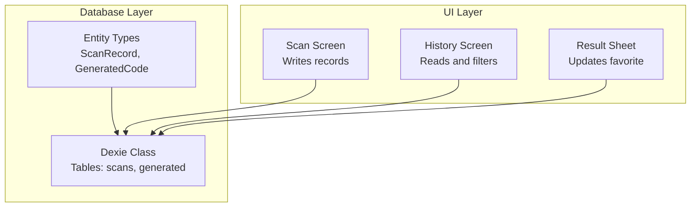
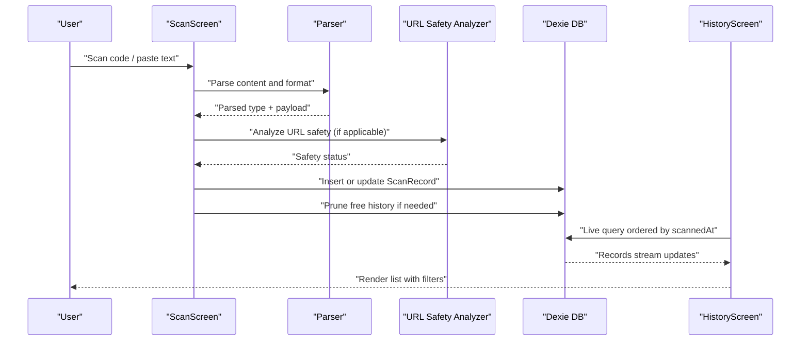
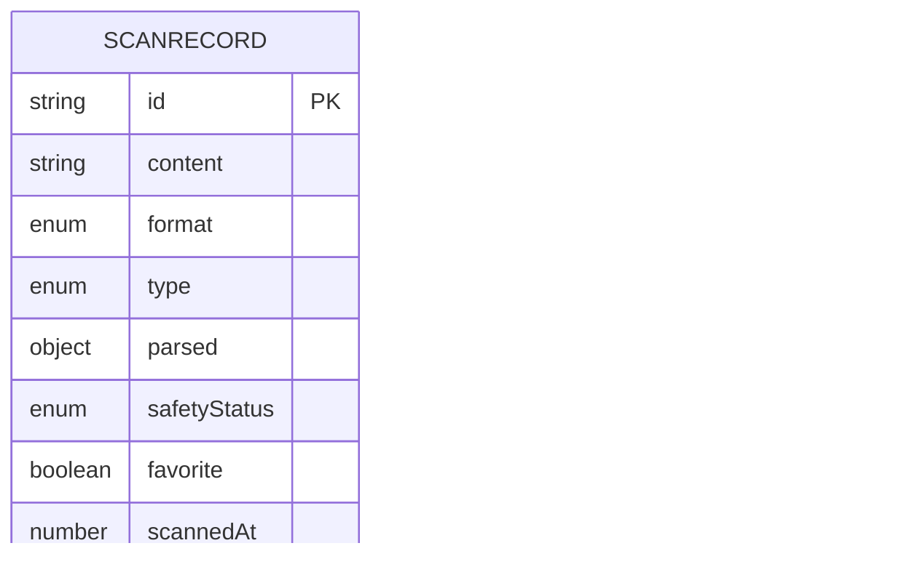
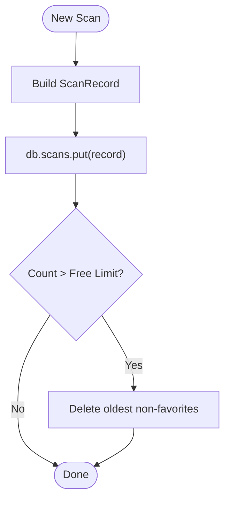
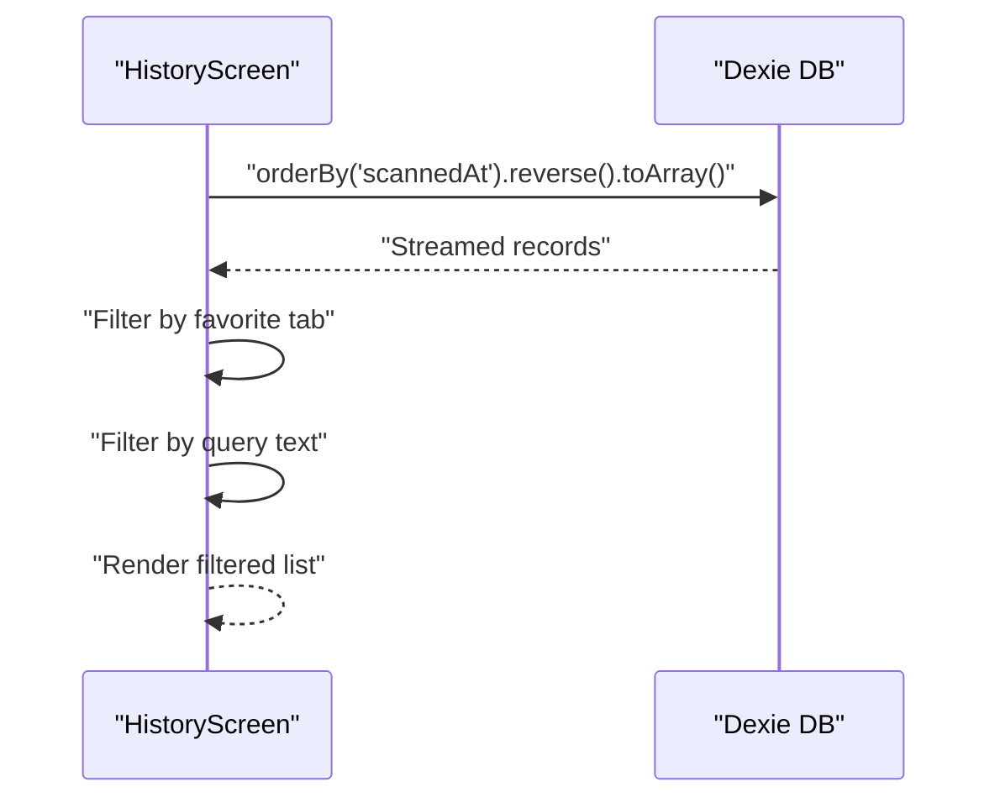
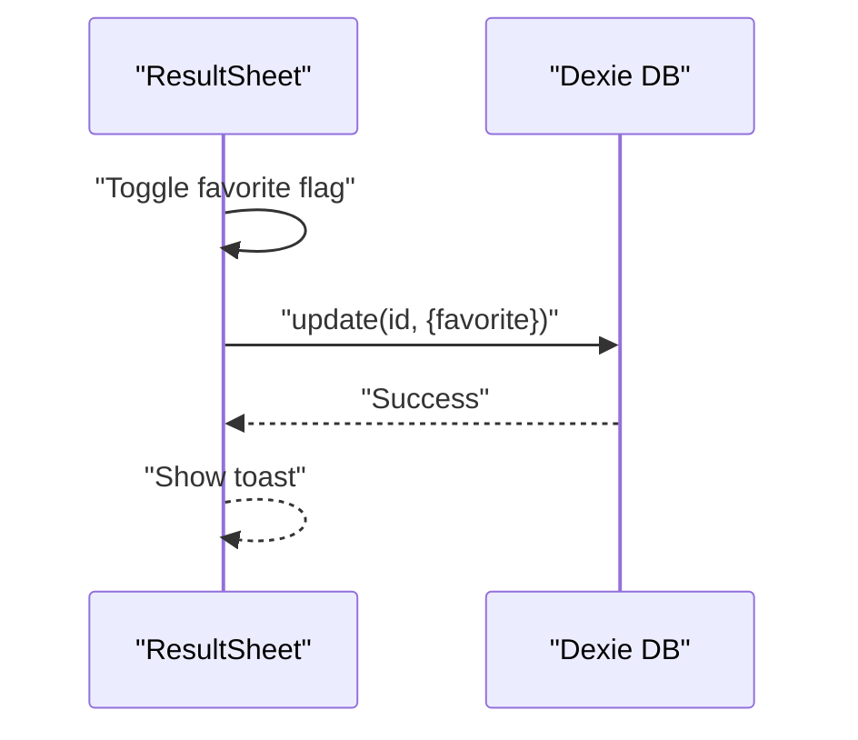
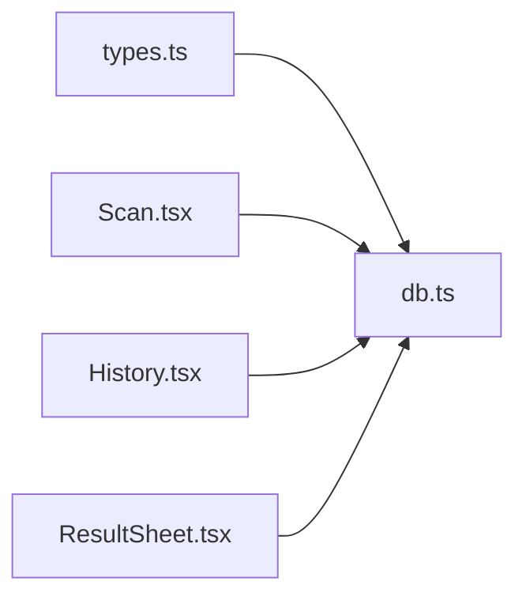

# Database Schema and Storage

<cite>
**Referenced Files in This Document**
- [db.ts](file://src/lib/db.ts)
- [types.ts](file://src/lib/scan/types.ts)
- [Scan.tsx](file://src/pages/Scan.tsx)
- [History.tsx](file://src/pages/History.tsx)
- [ResultSheet.tsx](file://src/components/ResultSheet.tsx)
</cite>

## Table of Contents
1. Introduction
2. Project Structure
3. Core Components
4. Architecture Overview
5. Detailed Component Analysis
6. Dependency Analysis
7. Performance Considerations
8. Troubleshooting Guide
9. Conclusion

## Introduction
This document explains the scan history database schema and storage implementation for the application. It covers the Dexie ORM setup, IndexedDB configuration, ScanRecord entity structure, indexing strategy, query patterns, data persistence mechanisms, migration procedures, backup and restore considerations, storage quota management, validation rules, constraints, and relationships between entities.

## Project Structure
The database layer is implemented with Dexie (IndexedDB wrapper). The core files involved are:
- Database class and instance definition
- Entity type definitions
- UI components that read/write records

**Diagram sources**
- [db.ts:4-17](file://src/lib/db.ts#L4-L17)
- [types.ts:30-48](file://src/lib/scan/types.ts#L30-L48)
- [Scan.tsx:50-72](file://src/pages/Scan.tsx#L50-L72)
- [History.tsx:40-60](file://src/pages/History.tsx#L40-L60)
- [ResultSheet.tsx:155-160](file://src/components/ResultSheet.tsx#L155-L160)

**Section sources**
- [db.ts:4-17](file://src/lib/db.ts#L4-L17)
- [types.ts:30-48](file://src/lib/scan/types.ts#L30-L48)
- [Scan.tsx:50-72](file://src/pages/Scan.tsx#L50-L72)
- [History.tsx:40-60](file://src/pages/History.tsx#L40-L60)
- [ResultSheet.tsx:155-160](file://src/components/ResultSheet.tsx#L155-L160)

## Core Components
- Dexie database class defines two tables:
  - scans: primary table for scan history
  - generated: secondary table for generated codes
- Entity types define the shape of stored objects and enums used across the app.

Key responsibilities:
- Define schema and indexes via Dexie stores string
- Provide a singleton db instance for all modules
- Enforce free-tier history limit by pruning oldest non-favorites

**Section sources**
- [db.ts:4-17](file://src/lib/db.ts#L4-L17)
- [types.ts:30-48](file://src/lib/scan/types.ts#L30-L48)

## Architecture Overview
The application persists scan results to IndexedDB using Dexie. The flow from scanning to display involves:
- Parsing and safety analysis on the client
- Writing a new record to the scans table
- Pruning old records if exceeding the free tier limit
- Rendering history with live queries and filtering

**Diagram sources**
- [Scan.tsx:50-72](file://src/pages/Scan.tsx#L50-L72)
- [db.ts:21-34](file://src/lib/db.ts#L21-L34)
- [History.tsx:40-50](file://src/pages/History.tsx#L40-L50)

## Detailed Component Analysis

### Database Schema and Indexing
- Database name: "scaniq"
- Tables and indexes:
  - scans: indexed fields include id (primary key), scannedAt, type, format, favorite, content
  - generated: indexed fields include id (primary key), createdAt, type
- Primary keys:
  - Both tables use string IDs as primary keys
- Notable observations:
  - The scans table includes an index on content, enabling substring search at the database level
  - The scans table includes an index on favorite, enabling efficient filtering for favorites
  - The scans table includes an index on scannedAt, enabling time-based ordering and pruning

**Diagram sources**
- [db.ts:10-13](file://src/lib/db.ts#L10-L13)
- [types.ts:30-48](file://src/lib/scan/types.ts#L30-L48)

**Section sources**
- [db.ts:10-13](file://src/lib/db.ts#L10-L13)
- [types.ts:30-48](file://src/lib/scan/types.ts#L30-L48)

### Data Persistence Mechanisms
- Write path:
  - On successful scan, a ScanRecord is created and persisted using put()
  - After insertion, pruneFreeHistory() is invoked to enforce the free-tier limit
- Read path:
  - History screen uses a live query to fetch all scans ordered by scannedAt descending
  - Client-side filtering supports favorites tab and text search against content
- Update path:
  - Favorite toggle updates only the favorite field for a given id

**Diagram sources**
- [Scan.tsx:50-72](file://src/pages/Scan.tsx#L50-L72)
- [db.ts:21-34](file://src/lib/db.ts#L21-L34)

**Section sources**
- [Scan.tsx:50-72](file://src/pages/Scan.tsx#L50-L72)
- [db.ts:21-34](file://src/lib/db.ts#L21-L34)

### Query Patterns
- Ordered listing:
  - All scans ordered by scannedAt descending for latest-first display
- Favorites filter:
  - Client-side filter toggles visibility of favorite records
- Text search:
  - Client-side filter searches within content; note that the database also has a content index available for potential server-side or advanced queries

**Diagram sources**
- [History.tsx:40-50](file://src/pages/History.tsx#L40-L50)

**Section sources**
- [History.tsx:40-50](file://src/pages/History.tsx#L40-L50)

### Favorite Management
- Toggle favorite state:
  - Updates only the favorite field for the specific record id
- UI feedback:
  - Toast notifications confirm add/remove actions

**Diagram sources**
- [ResultSheet.tsx:155-160](file://src/components/ResultSheet.tsx#L155-L160)

**Section sources**
- [ResultSheet.tsx:155-160](file://src/components/ResultSheet.tsx#L155-L160)

### Data Validation Rules and Constraints
- Type-level validation:
  - ScanFormat, ScanContentType, and SafetyStatus are TypeScript union types ensuring consistent values
- Record construction:
  - ID generation uses crypto.randomUUID when available, otherwise falls back to timestamp + random
  - scannedAt is set to current epoch milliseconds
  - parsed and safetyStatus are optional and computed before persisting
- Constraints:
  - No explicit unique constraints beyond primary key id
  - Optional fields allow partial records where appropriate

**Section sources**
- [types.ts:1-28](file://src/lib/scan/types.ts#L1-L28)
- [types.ts:30-48](file://src/lib/scan/types.ts#L30-L48)
- [Scan.tsx:50-72](file://src/pages/Scan.tsx#L50-L72)

### Relationships Between Entities
- The scans and generated tables are independent; no foreign key relationships are defined
- Both tables share a common ScanContentType enum for type consistency

**Section sources**
- [db.ts:10-13](file://src/lib/db.ts#L10-L13)
- [types.ts:16-26](file://src/lib/scan/types.ts#L16-L26)

## Dependency Analysis
- Module dependencies:
  - Database module depends on Dexie and entity types
  - UI modules depend on the database module for CRUD operations
- Coupling:
  - Low coupling through a single exported db instance
  - Clear separation between schema/types and usage

**Diagram sources**
- [db.ts:1-17](file://src/lib/db.ts#L1-L17)
- [types.ts:30-48](file://src/lib/scan/types.ts#L30-L48)
- [Scan.tsx:50-72](file://src/pages/Scan.tsx#L50-L72)
- [History.tsx:40-60](file://src/pages/History.tsx#L40-L60)
- [ResultSheet.tsx:155-160](file://src/components/ResultSheet.tsx#L155-L160)

**Section sources**
- [db.ts:1-17](file://src/lib/db.ts#L1-L17)
- [types.ts:30-48](file://src/lib/scan/types.ts#L30-L48)
- [Scan.tsx:50-72](file://src/pages/Scan.tsx#L50-L72)
- [History.tsx:40-60](file://src/pages/History.tsx#L40-L60)
- [ResultSheet.tsx:155-160](file://src/components/ResultSheet.tsx#L155-L160)

## Performance Considerations
- Index utilization:
  - Scans table indexes support:
    - Time-based ordering and pruning via scannedAt
    - Filtering by favorite
    - Content search capability via content index
- Live queries:
  - Using live queries reduces manual refresh logic and keeps UI in sync
- Pruning algorithm:
  - Iterates records ordered by scannedAt ascending and deletes non-favorites until under the limit
  - For large datasets, consider batching deletions or adding a composite index (e.g., scannedAt,favorite) to optimize selection

[No sources needed since this section provides general guidance]

## Troubleshooting Guide
- Common issues:
  - Storage failures:
    - If IndexedDB write fails, the UI shows an error toast
  - Camera-related errors:
    - Permission denied or device unavailable states are handled and surfaced to users
- Debugging tips:
  - Check browser DevTools Application panel for IndexedDB contents
  - Verify Dexie version and schema match expectations
  - Inspect console logs around handleResult and pruneFreeHistory for errors

**Section sources**
- [Scan.tsx:98-101](file://src/pages/Scan.tsx#L98-L101)

## Conclusion
The scan history storage leverages Dexie with a well-defined schema and practical indexes to support common queries and performance needs. The application writes records after parsing and safety checks, enforces a free-tier limit by pruning older non-favorites, and provides a responsive history view with live updates. Future enhancements could include more robust migration handling, explicit backup/export utilities, and additional indexes for complex queries.