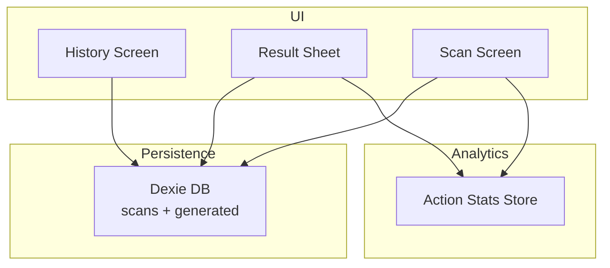
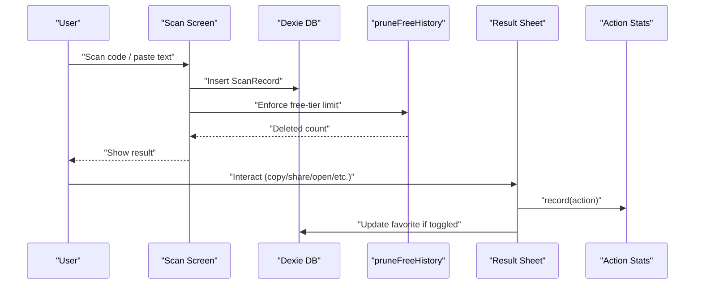
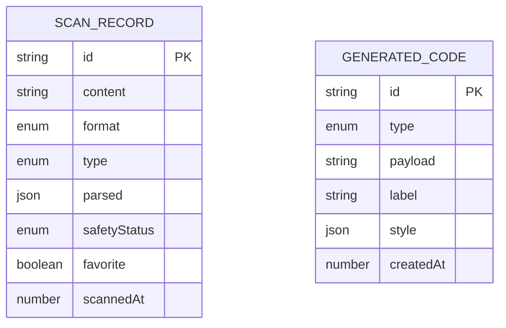
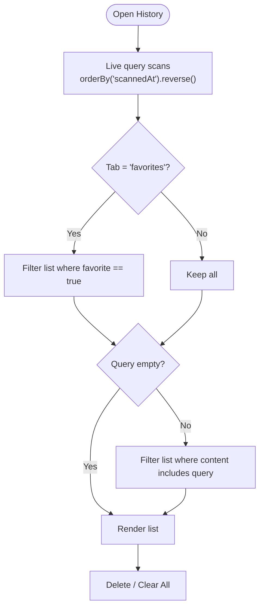
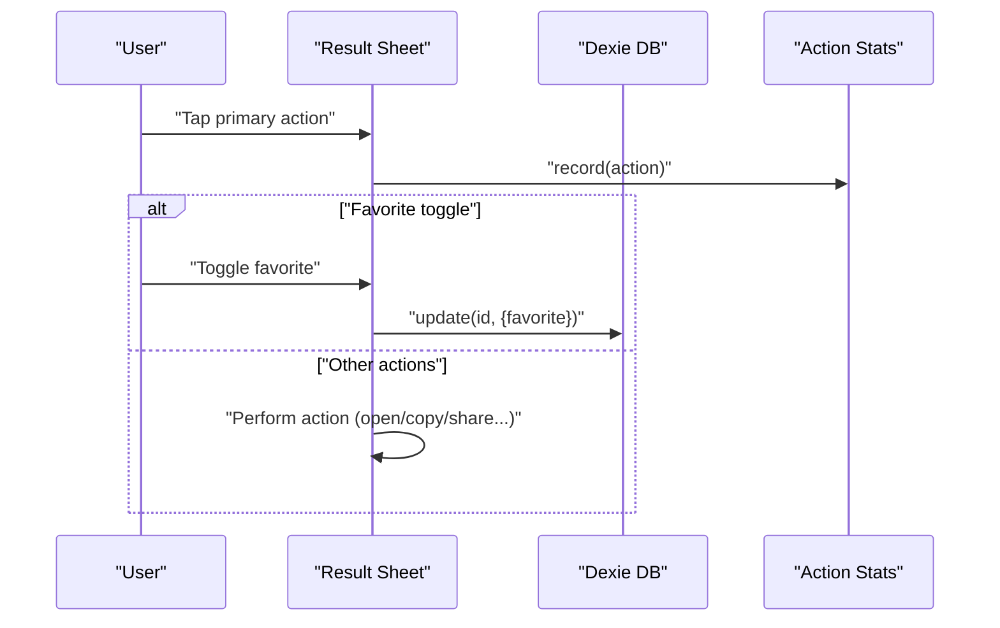
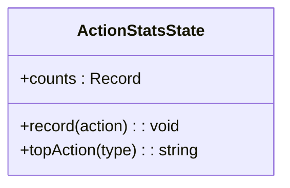
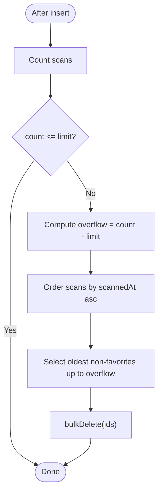
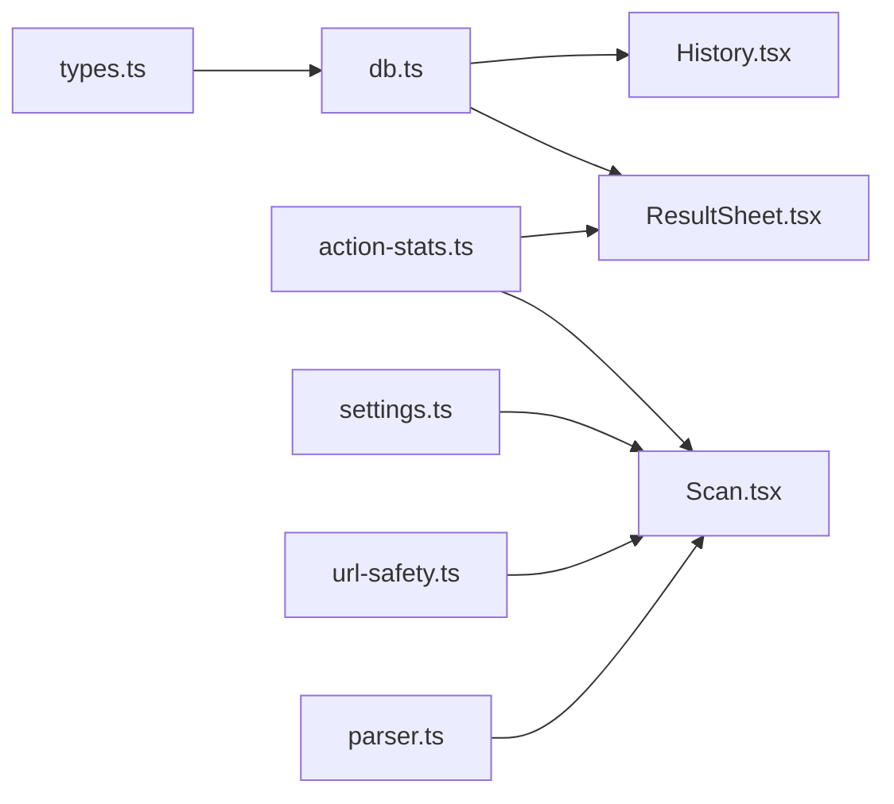

# History Management

<cite>
**Referenced Files in This Document**
- [db.ts](file://src/lib/db.ts)
- [types.ts](file://src/lib/scan/types.ts)
- [History.tsx](file://src/pages/History.tsx)
- [ResultSheet.tsx](file://src/components/ResultSheet.tsx)
- [action-stats.ts](file://src/lib/action-stats.ts)
- [Scan.tsx](file://src/pages/Scan.tsx)
- [Privacy.tsx](file://src/pages/Privacy.tsx)
</cite>

## Table of Contents
1. Introduction
2. Project Structure
3. Core Components
4. Architecture Overview
5. Detailed Component Analysis
6. Dependency Analysis
7. Performance Considerations
8. Troubleshooting Guide
9. Conclusion
10. Appendices

## Introduction
This document explains the scan history management system, focusing on how records are stored and retrieved using Dexie ORM over IndexedDB, how search and favorites work, how free-tier limits are enforced via automatic cleanup, and how action statistics are tracked for usage analytics. It also covers privacy considerations, data retention policies, and outlines strategies for export, backup, restore, and migration.

## Project Structure
The history system is implemented across a small set of focused modules:
- Data model and persistence layer (Dexie schema and helpers)
- History UI with live queries, filtering, and favorites
- Result sheet with actions and favorite toggling
- Action statistics store for usage analytics
- Scanner page that persists new scans and enforces free-tier pruning
- Privacy page describing local-only storage and user controls

**Diagram sources**
- [db.ts:1-34](file://src/lib/db.ts#L1-L34)
- [History.tsx:1-138](file://src/pages/History.tsx#L1-L138)
- [ResultSheet.tsx:1-414](file://src/components/ResultSheet.tsx#L1-L414)
- [Scan.tsx:1-488](file://src/pages/Scan.tsx#L1-L488)
- [action-stats.ts:1-81](file://src/lib/action-stats.ts#L1-L81)

**Section sources**
- [db.ts:1-34](file://src/lib/db.ts#L1-L34)
- [History.tsx:1-138](file://src/pages/History.tsx#L1-L138)
- [ResultSheet.tsx:1-414](file://src/components/ResultSheet.tsx#L1-L414)
- [Scan.tsx:1-488](file://src/pages/Scan.tsx#L1-L488)
- [action-stats.ts:1-81](file://src/lib/action-stats.ts#L1-L81)

## Core Components
- Database schema and free-tier pruning
  - Dexie database class defines two tables: scans and generated. The scans table indexes id, scannedAt, type, format, favorite, content to support ordering by time, filtering by type/favorite, and searching by content.
  - A pruning utility enforces a free-tier limit by removing oldest non-favorite records when the count exceeds the configured threshold.
- History screen
  - Live query fetches all scans ordered by most recent first.
  - Client-side filtering supports “All” vs “Favorites” tabs and text search against the content field.
  - Actions include delete single record and clear all.
- Result sheet
  - Displays parsed result details and smart primary actions based on content type.
  - Toggles favorite status and updates the database accordingly.
  - Records user actions for analytics.
- Action statistics
  - Persisted Zustand store tracks counts per action and recommends a top action per content type based on usage thresholds.
- Scanner integration
  - On successful scan, creates a ScanRecord, persists it, runs free-tier pruning, and optionally performs auto-actions based on settings.

**Section sources**
- [db.ts:1-34](file://src/lib/db.ts#L1-L34)
- [History.tsx:1-138](file://src/pages/History.tsx#L1-L138)
- [ResultSheet.tsx:1-414](file://src/components/ResultSheet.tsx#L1-L414)
- [action-stats.ts:1-81](file://src/lib/action-stats.ts#L1-L81)
- [Scan.tsx:1-488](file://src/pages/Scan.tsx#L1-L488)

## Architecture Overview
The system uses a client-first architecture with IndexedDB as the persistent store. Dexie provides an object-relational API and reactive hooks for real-time UI updates. Analytics are persisted locally and influence UI behavior such as recommended actions.

**Diagram sources**
- [Scan.tsx:50-102](file://src/pages/Scan.tsx#L50-L102)
- [db.ts:21-34](file://src/lib/db.ts#L21-L34)
- [ResultSheet.tsx:155-160](file://src/components/ResultSheet.tsx#L155-L160)
- [action-stats.ts:45-80](file://src/lib/action-stats.ts#L45-L80)

## Detailed Component Analysis

### Database Schema and Persistence (Dexie + IndexedDB)
- Tables
  - scans: Primary key id; indexed fields scannedAt, type, format, favorite, content. Used for ordering, filtering, and full-text-like substring search.
  - generated: Primary key id; indexed createdAt, type. Used for generated codes (not central to history).
- Free-tier pruning
  - When total scans exceed the configured limit, the oldest non-favorite entries are removed until within the limit.
- Storage strategy
  - All data remains in the browser’s IndexedDB under the database name used by Dexie. No server sync is implemented.

**Diagram sources**
- [types.ts:30-48](file://src/lib/scan/types.ts#L30-L48)
- [db.ts:10-14](file://src/lib/db.ts#L10-L14)

**Section sources**
- [db.ts:1-34](file://src/lib/db.ts#L1-L34)
- [types.ts:1-49](file://src/lib/scan/types.ts#L1-L49)

### History Screen: Search, Filtering, Favorites
- Live query loads all scans sorted by most recent first.
- Tabs filter between “All” and “Favorites”.
- Text input filters by substring match against content.
- Operations:
  - Delete individual record
  - Clear all records

**Diagram sources**
- [History.tsx:40-60](file://src/pages/History.tsx#L40-L60)

**Section sources**
- [History.tsx:1-138](file://src/pages/History.tsx#L1-L138)

### Result Sheet: Smart Actions and Favorites
- Parses content to determine type and display.
- Presents a primary action tailored to type (e.g., open URL, copy password, call, email, maps, payment).
- Tracks user actions for analytics.
- Allows toggling favorite status, which updates the scans table.

**Diagram sources**
- [ResultSheet.tsx:155-160](file://src/components/ResultSheet.tsx#L155-L160)
- [ResultSheet.tsx:132-187](file://src/components/ResultSheet.tsx#L132-L187)
- [action-stats.ts:45-80](file://src/lib/action-stats.ts#L45-L80)

**Section sources**
- [ResultSheet.tsx:1-414](file://src/components/ResultSheet.tsx#L1-L414)
- [action-stats.ts:1-81](file://src/lib/action-stats.ts#L1-L81)

### Action Statistics and Usage Analytics
- Local, persisted store tracks counts per action.
- Recommends a top action per content type based on default preferences and observed usage thresholds.
- Integrates into Result Sheet and Scan flow to capture user interactions.

**Diagram sources**
- [action-stats.ts:37-80](file://src/lib/action-stats.ts#L37-L80)

**Section sources**
- [action-stats.ts:1-81](file://src/lib/action-stats.ts#L1-L81)

### Free-Tier Cleanup Policy
- Enforced after each successful scan insertion.
- If total scans exceed the configured limit, oldest non-favorite records are deleted until within the limit.

**Diagram sources**
- [db.ts:21-34](file://src/lib/db.ts#L21-L34)
- [Scan.tsx:69-72](file://src/pages/Scan.tsx#L69-L72)

**Section sources**
- [db.ts:19-34](file://src/lib/db.ts#L19-L34)
- [Scan.tsx:69-72](file://src/pages/Scan.tsx#L69-L72)

## Dependency Analysis
- History depends on Dexie for live queries and basic CRUD operations.
- Result Sheet depends on parsing utilities, URL safety analysis, action stats, and Dexie for favorite updates.
- Scan Screen depends on scanner service, parser, Dexie, safety analyzer, settings, and action stats.
- Action stats is independent but consumed by UI components.

**Diagram sources**
- [types.ts:1-49](file://src/lib/scan/types.ts#L1-L49)
- [db.ts:1-34](file://src/lib/db.ts#L1-L34)
- [Scan.tsx:1-488](file://src/pages/Scan.tsx#L1-L488)
- [ResultSheet.tsx:1-414](file://src/components/ResultSheet.tsx#L1-L414)
- [History.tsx:1-138](file://src/pages/History.tsx#L1-L138)
- [action-stats.ts:1-81](file://src/lib/action-stats.ts#L1-L81)

**Section sources**
- [db.ts:1-34](file://src/lib/db.ts#L1-L34)
- [History.tsx:1-138](file://src/pages/History.tsx#L1-L138)
- [ResultSheet.tsx:1-414](file://src/components/ResultSheet.tsx#L1-L414)
- [Scan.tsx:1-488](file://src/pages/Scan.tsx#L1-L488)
- [action-stats.ts:1-81](file://src/lib/action-stats.ts#L1-L81)

## Performance Considerations
- Indexing
  - Indexed fields scannedAt, type, format, favorite, content enable efficient ordering and filtering.
  - For large datasets, consider adding composite indexes (e.g., scannedAt + favorite) if frequent filtered queries arise.
- Query optimization
  - Use reverse ordering on scannedAt to avoid client-side sorting.
  - Prefer Dexie’s orderBy and filter chains rather than loading entire tables into memory when possible.
- UI responsiveness
  - useLiveQuery ensures UI stays in sync without manual refreshes.
  - Debounce or throttle heavy computations if additional client-side filtering is added.
- Pruning efficiency
  - pruneFreeHistory currently orders by scannedAt and iterates to collect IDs before bulk deletion. For very large histories, consider implementing server-side or advanced Dexie patterns to minimize iteration overhead.

[No sources needed since this section provides general guidance]

## Troubleshooting Guide
- Scans not appearing
  - Verify Dexie initialization and table definitions.
  - Check browser console for IndexedDB errors.
- Favorites not persisting
  - Ensure update calls target the correct id and field.
- Free-tier pruning not working
  - Confirm pruning is invoked after insert and that the limit constant is correctly applied.
- Action stats not updating
  - Validate that record(action) is called for each user interaction path.

**Section sources**
- [db.ts:1-34](file://src/lib/db.ts#L1-L34)
- [ResultSheet.tsx:155-160](file://src/components/ResultSheet.tsx#L155-L160)
- [Scan.tsx:69-72](file://src/pages/Scan.tsx#L69-L72)
- [action-stats.ts:45-80](file://src/lib/action-stats.ts#L45-L80)

## Conclusion
The history management system leverages Dexie and IndexedDB for robust, offline-first persistence with efficient indexing and live UI updates. It provides powerful search and favorites capabilities, enforces free-tier limits through automatic pruning, and captures actionable analytics to tailor user experience. Privacy is maintained by keeping all data local, with clear user controls to manage their information.

[No sources needed since this section summarizes without analyzing specific files]

## Appendices

### Data Export, Backup, Restore, and Migration Strategies
- Export
  - Implement a feature to read all scans from Dexie and serialize them to JSON for download.
  - Optionally include generated codes and action stats for comprehensive backups.
- Backup
  - Schedule periodic exports or provide a manual “Export History” button.
- Restore
  - Provide an import flow that reads a previously exported JSON file and bulk inserts records into Dexie, handling duplicates and conflicts.
- Migration
  - Use Dexie version upgrades to evolve schemas safely.
  - Add migration logic to transform legacy fields or re-index as needed.

[No sources needed since this section proposes strategies not present in the current codebase]

### Privacy and Data Retention Policies
- Local-only storage
  - All scan history and analytics are stored in the browser’s IndexedDB and Zustand persistence.
- User control
  - Users can delete individual items or clear all history.
  - Privacy page documents local data handling and camera permissions.
- Retention
  - Free-tier users have an automatic cap enforced by pruning; premium tiers could remove or increase the limit.

**Section sources**
- [Privacy.tsx:1-40](file://src/pages/Privacy.tsx#L1-L40)
- [db.ts:19-34](file://src/lib/db.ts#L19-L34)
- [History.tsx:52-60](file://src/pages/History.tsx#L52-L60)