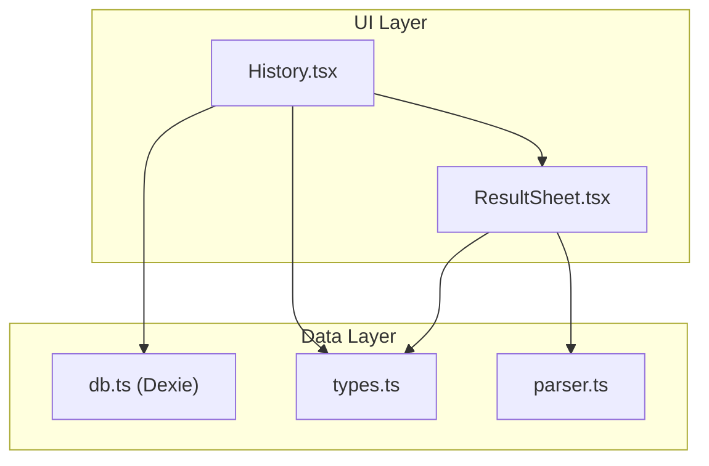
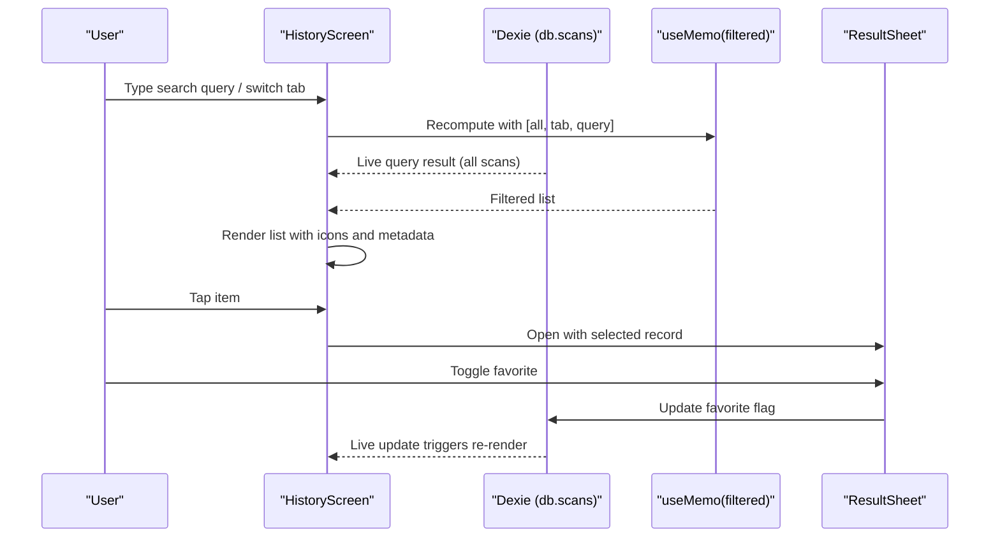
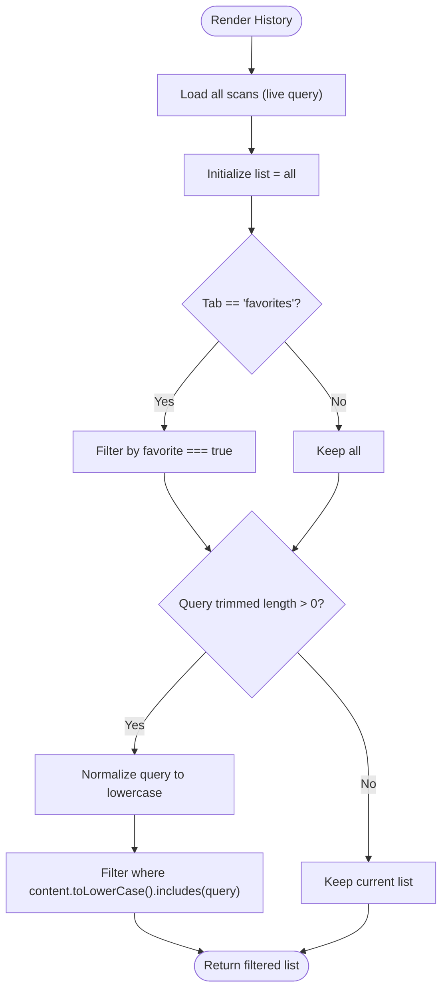
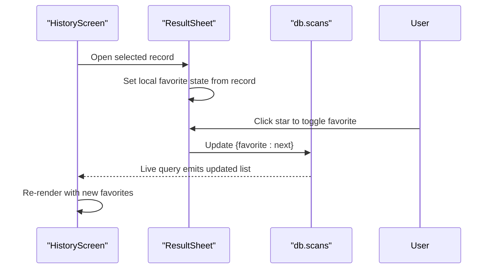
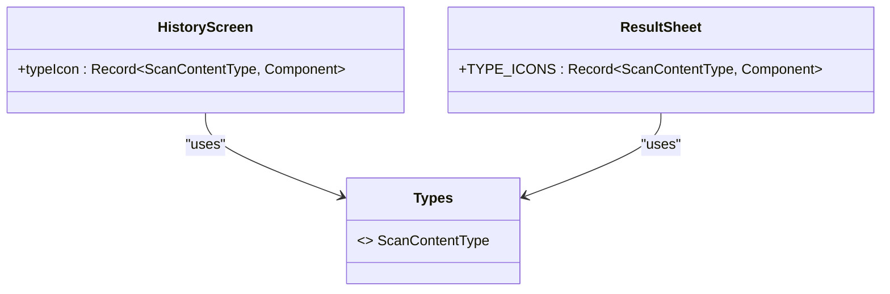
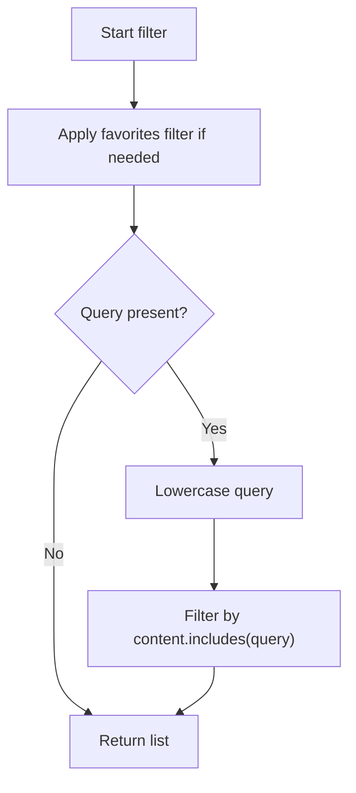
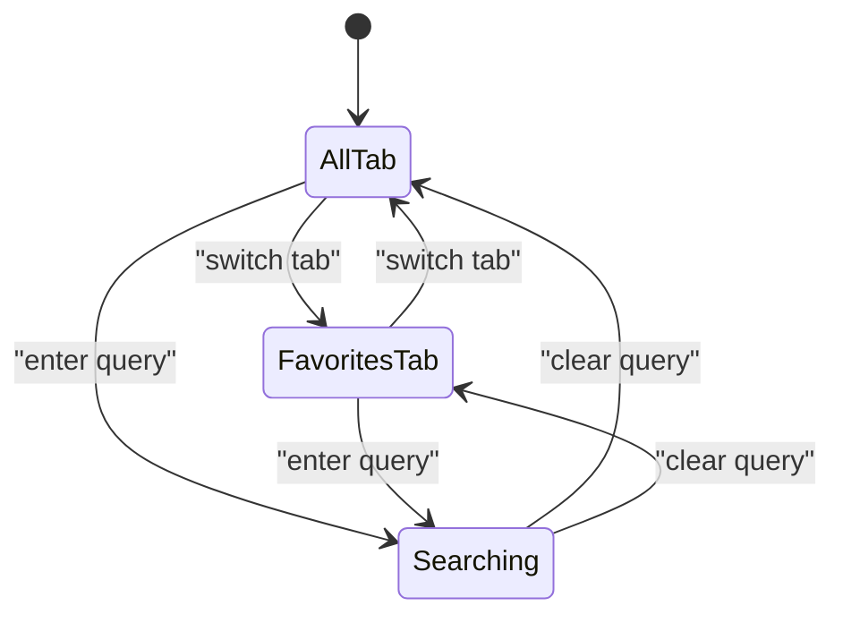
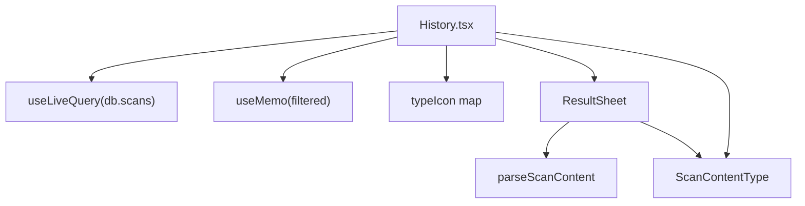

# Search and Filtering System

<cite>
**Referenced Files in This Document**
- [History.tsx](file://src/pages/History.tsx)
- [db.ts](file://src/lib/db.ts)
- [types.ts](file://src/lib/scan/types.ts)
- [parser.ts](file://src/lib/scan/parser.ts)
- [ResultSheet.tsx](file://src/components/ResultSheet.tsx)
</cite>

## Table of Contents
1. [Introduction](#introduction)
2. [Project Structure](#project-structure)
3. [Core Components](#core-components)
4. [Architecture Overview](#architecture-overview)
5. [Detailed Component Analysis](#detailed-component-analysis)
6. [Dependency Analysis](#dependency-analysis)
7. [Performance Considerations](#performance-considerations)
8. [Troubleshooting Guide](#troubleshooting-guide)
9. [Conclusion](#conclusion)
10. [Appendices](#appendices)

## Introduction
This document explains the search and filtering system implemented in the History feature. It focuses on:
- Real-time search using React’s useMemo hook for efficient, content-based filtering
- Case-insensitive matching against stored scan content
- Favorites tab functionality to quickly view only favorite records
- UI state management for query input, active tab, and selected record
- Content type icon mapping and how different scan types are represented
- Scalability considerations for large datasets and best practices for future enhancements

The goal is to provide both a conceptual overview and code-level insights so that developers can understand, maintain, and extend the search and filtering logic effectively.

## Project Structure
The search and filtering features primarily live in the History page component, with supporting data models and parsing utilities. The key files involved are:
- History screen: manages state, queries, tabs, and renders filtered results
- Database layer: provides live query access to scans and indexes fields used by filtering
- Types: define the shape of scan records and content types
- Parser: determines content type from raw content and format (used elsewhere for display and actions)
- Result sheet: displays details and supports toggling favorites

**Diagram sources**
- [History.tsx:1-138](file://src/pages/History.tsx#L1-L138)
- [db.ts:1-35](file://src/lib/db.ts#L1-L35)
- [types.ts:1-49](file://src/lib/scan/types.ts#L1-L49)
- [parser.ts:1-102](file://src/lib/scan/parser.ts#L1-L102)
- [ResultSheet.tsx:1-414](file://src/components/ResultSheet.tsx#L1-L414)

**Section sources**
- [History.tsx:1-138](file://src/pages/History.tsx#L1-L138)
- [db.ts:1-35](file://src/lib/db.ts#L1-L35)
- [types.ts:1-49](file://src/lib/scan/types.ts#L1-L49)
- [parser.ts:1-102](file://src/lib/scan/parser.ts#L1-L102)
- [ResultSheet.tsx:1-414](file://src/components/ResultSheet.tsx#L1-L414)

## Core Components
- HistoryScreen:
  - Manages local state for search query, active tab (all/favorites), and selected record
  - Uses a live database query to fetch all scans ordered by time
  - Computes filtered list via useMemo based on tab and query
  - Renders icons per content type and supports delete/clear operations
- Database (Dexie):
  - Exposes a table of scans with indexed fields including scannedAt, type, format, favorite, and content
  - Provides a live query hook to keep UI in sync with database changes
- Types:
  - Defines ScanRecord structure and ScanContentType enumeration used across components
- Parser:
  - Determines content type and structured data from raw content and format; used in detail view
- ResultSheet:
  - Displays parsed result, safety analysis, and allows toggling favorite status

Key responsibilities:
- Real-time search: memoized filter over live dataset
- Favorites filtering: simple boolean flag on records
- Icon mapping: content type to icon component mapping for consistent UI

**Section sources**
- [History.tsx:34-50](file://src/pages/History.tsx#L34-L50)
- [db.ts:10-17](file://src/lib/db.ts#L10-L17)
- [types.ts:30-39](file://src/lib/scan/types.ts#L30-L39)
- [parser.ts:12-101](file://src/lib/scan/parser.ts#L12-L101)
- [ResultSheet.tsx:111-160](file://src/components/ResultSheet.tsx#L111-L160)

## Architecture Overview
The search and filtering architecture follows a reactive pattern:
- Live query returns an array of ScanRecord objects
- useMemo recomputes the filtered list when dependencies change (dataset, tab, query)
- UI reacts to filtered list updates without manual re-renders or extra state synchronization

**Diagram sources**
- [History.tsx:40-50](file://src/pages/History.tsx#L40-L50)
- [db.ts:10-17](file://src/lib/db.ts#L10-L17)
- [ResultSheet.tsx:155-160](file://src/components/ResultSheet.tsx#L155-L160)

## Detailed Component Analysis

### History Screen: Real-time Search and Favorites
- State variables:
  - query: current search string
  - tab: "all" or "favorites"
  - active: currently selected ScanRecord for detail view
- Data retrieval:
  - useLiveQuery fetches scans ordered by scannedAt descending
- Filtering algorithm:
  - Start with full dataset
  - If tab is "favorites", filter by favorite flag
  - If query is non-empty, convert to lowercase and match against content field
- Rendering:
  - Maps each record to a row with type-specific icon, truncated content, timestamp, and delete action
  - Empty states for both all and favorites tabs

**Diagram sources**
- [History.tsx:42-50](file://src/pages/History.tsx#L42-L50)

**Section sources**
- [History.tsx:34-50](file://src/pages/History.tsx#L34-L50)
- [History.tsx:92-132](file://src/pages/History.tsx#L92-L132)

### Favorites Tab Functionality
- Favorites are stored as a boolean flag on ScanRecord
- When tab is "favorites", the filter applies s.favorite before applying text search
- Toggling favorite updates the database and triggers live re-query, updating both tabs automatically

**Diagram sources**
- [ResultSheet.tsx:118-160](file://src/components/ResultSheet.tsx#L118-L160)
- [History.tsx:42-50](file://src/pages/History.tsx#L42-L50)

**Section sources**
- [ResultSheet.tsx:155-160](file://src/components/ResultSheet.tsx#L155-L160)
- [History.tsx:42-50](file://src/pages/History.tsx#L42-L50)

### Content Type Icons Mapping
- A mapping object associates each ScanContentType with a Lucide icon component
- Used in History list rows to visually represent the type of each scan
- The same concept is mirrored in the detail sheet for consistency

**Diagram sources**
- [History.tsx:13-24](file://src/pages/History.tsx#L13-L24)
- [ResultSheet.tsx:49-60](file://src/components/ResultSheet.tsx#L49-L60)
- [types.ts:16-26](file://src/lib/scan/types.ts#L16-L26)

**Section sources**
- [History.tsx:13-24](file://src/pages/History.tsx#L13-L24)
- [ResultSheet.tsx:49-60](file://src/components/ResultSheet.tsx#L49-L60)
- [types.ts:16-26](file://src/lib/scan/types.ts#L16-L26)

### Search Query Processing and Case-Insensitive Matching
- Query normalization:
  - Trim whitespace and convert to lowercase once per computation
- Matching strategy:
  - Simple substring inclusion check against the content field
- Scope:
  - Applies after favorites filtering if applicable

Best practices demonstrated:
- Memoization avoids unnecessary recalculations
- Single pass normalization reduces repeated work
- Early exit when query is empty improves performance

**Section sources**
- [History.tsx:42-50](file://src/pages/History.tsx#L42-L50)

### Filtering Logic for Different Scan Types
- While the current implementation filters by content text regardless of type, the parser defines clear categories:
  - url, wifi, vcard, email, sms, phone, geo, product, text, payment
- Future enhancements could add type-specific filters (e.g., only URLs or only payments) by leveraging the type field already present in the dataset

**Diagram sources**
- [History.tsx:42-50](file://src/pages/History.tsx#L42-L50)

**Section sources**
- [types.ts:16-26](file://src/lib/scan/types.ts#L16-L26)
- [parser.ts:12-101](file://src/lib/scan/parser.ts#L12-L101)
- [History.tsx:42-50](file://src/pages/History.tsx#L42-L50)

### UI State Management
- Local state:
  - query: controls search input
  - tab: controls active tab selection
  - active: holds the selected record for the detail sheet
- Effects:
  - No side effects in History; filtering is pure and memoized
  - ResultSheet initializes favorite state from the record and persists changes

[No sources needed since this diagram shows conceptual workflow, not actual code structure]

**Section sources**
- [History.tsx:34-39](file://src/pages/History.tsx#L34-L39)
- [ResultSheet.tsx:118-120](file://src/components/ResultSheet.tsx#L118-L120)

## Dependency Analysis
- HistoryScreen depends on:
  - Dexie live query for real-time data
  - useMemo for computed filtering
  - UI primitives for input, tabs, buttons
  - Icon components for visual representation
  - ResultSheet for detailed view
- Database schema includes indexed fields:
  - scannedAt, type, format, favorite, content
- Types and parser are consumed by both list and detail views

**Diagram sources**
- [History.tsx:1-10](file://src/pages/History.tsx#L1-L10)
- [History.tsx:40-50](file://src/pages/History.tsx#L40-L50)
- [ResultSheet.tsx:26-32](file://src/components/ResultSheet.tsx#L26-L32)
- [types.ts:16-26](file://src/lib/scan/types.ts#L16-L26)

**Section sources**
- [History.tsx:1-10](file://src/pages/History.tsx#L1-L10)
- [History.tsx:40-50](file://src/pages/History.tsx#L40-L50)
- [ResultSheet.tsx:26-32](file://src/components/ResultSheet.tsx#L26-L32)
- [types.ts:16-26](file://src/lib/scan/types.ts#L16-L26)

## Performance Considerations
Current optimizations:
- useMemo ensures filtering runs only when dataset, tab, or query changes
- Single normalization step for query reduces redundant conversions
- Live query keeps UI synchronized without manual refresh

Scalability recommendations for thousands of records:
- Server-side or IndexedDB-backed search:
  - Use Dexie’s built-in indexing and query methods to filter at the database level instead of client-side filtering
  - Example approach: order by scannedAt and apply where clauses for favorite and content contains
- Debounce user input:
  - Introduce a debounce delay to reduce frequent recomputation during rapid typing
- Virtualized lists:
  - Implement virtual scrolling to render only visible items for very large lists
- Incremental search:
  - Precompute lowercased content values to avoid repeated transformations
- Pagination or infinite scroll:
  - Load batches of records to reduce initial rendering cost
- Advanced matching:
  - For fuzzy or token-based search, consider a lightweight index or external library

[No sources needed since this section provides general guidance]

## Troubleshooting Guide
Common issues and resolutions:
- Search not returning expected results:
  - Ensure content field contains searchable text; some formats may have limited content
  - Verify case-insensitivity by checking normalization logic
- Favorites not appearing immediately:
  - Confirm that favorite updates persist to the database and trigger live query updates
- Performance degradation with many records:
  - Consider moving filtering into Dexie queries and adding debouncing to input handling

Operational notes:
- Clearing all history removes records and triggers live updates
- Deleting individual records also updates the live dataset

**Section sources**
- [History.tsx:52-60](file://src/pages/History.tsx#L52-L60)
- [db.ts:21-34](file://src/lib/db.ts#L21-L34)

## Conclusion
The History search and filtering system leverages React’s useMemo for efficient, real-time filtering and Dexie’s live queries for seamless UI updates. The current implementation provides robust content-based search and favorites filtering with straightforward state management. For larger datasets, adopting database-level filtering, debounced inputs, and virtualized lists will significantly improve scalability and responsiveness.

[No sources needed since this section summarizes without analyzing specific files]

## Appendices

### Examples of Search Patterns
- Exact substring matches:
  - Typing a domain name or part of a URL will match any record containing that substring
- Partial matches:
  - Short fragments like “pay” will match payment-related content
- Case-insensitive behavior:
  - Mixed-case queries still match due to normalization

[No sources needed since this section provides general guidance]

### Filtering Best Practices
- Normalize inputs early (trim and lowercase)
- Apply most selective filters first (e.g., favorites)
- Avoid heavy computations inside render loops
- Prefer memoization for derived data

[No sources needed since this section provides general guidance]

### Scalability Considerations
- Move filtering to IndexedDB/Dexie queries
- Debounce input events
- Use virtualized lists for large datasets
- Consider pagination/infinite scroll
- Precompute normalized fields if necessary

[No sources needed since this section provides general guidance]