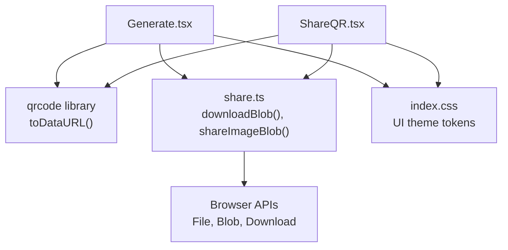
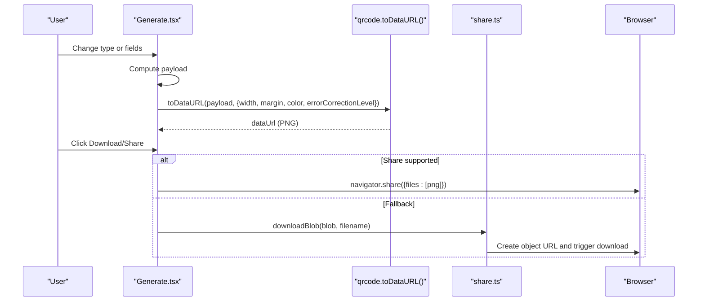
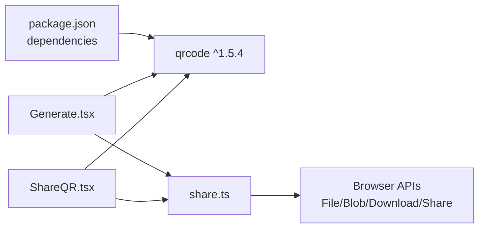

# QR Code Customization Options

<cite>
**Referenced Files in This Document**
- [Generate.tsx](file://src/pages/Generate.tsx)
- [ShareQR.tsx](file://src/pages/ShareQR.tsx)
- [share.ts](file://src/lib/share.ts)
- [app-meta.ts](file://src/lib/app-meta.ts)
- [index.css](file://src/index.css)
- [package.json](file://package.json)
</cite>

## Table of Contents
1. [Introduction](#introduction)
2. [Project Structure](#project-structure)
3. [Core Components](#core-components)
4. [Architecture Overview](#architecture-overview)
5. [Detailed Component Analysis](#detailed-component-analysis)
6. [Dependency Analysis](#dependency-analysis)
7. [Performance Considerations](#performance-considerations)
8. [Troubleshooting Guide](#troubleshooting-guide)
9. [Conclusion](#conclusion)

## Introduction
This document explains the QR code customization capabilities available in the application, focusing on visual styling options (size, margins, colors, background), error correction levels, output formats and quality, responsive design considerations for screens and print, and accessibility features that improve scanning reliability. It maps these features to the actual implementation in the repository.

## Project Structure
The QR generation functionality is implemented in two primary pages:
- Generate page: builds payloads (URL, text, Wi‑Fi, vCard, email, SMS, phone) and renders a QR preview with download and share actions.
- Share QR page: generates a QR for the app’s share URL and provides download and share actions.

**Diagram sources**
- [Generate.tsx:52-71](file://src/pages/Generate.tsx#L52-L71)
- [ShareQR.tsx:14-23](file://src/pages/ShareQR.tsx#L14-L23)
- [share.ts:24-51](file://src/lib/share.ts#L24-L51)
- [index.css:1-51](file://src/index.css#L1-L51)

**Section sources**
- [Generate.tsx:1-225](file://src/pages/Generate.tsx#L1-L225)
- [ShareQR.tsx:1-83](file://src/pages/ShareQR.tsx#L1-L83)
- [share.ts:1-52](file://src/lib/share.ts#L1-L52)
- [index.css:1-51](file://src/index.css#L1-L51)

## Core Components
- QR generation uses the qrcode library to produce PNG images via data URLs.
- The Generate page constructs content payloads and regenerates the QR whenever payload changes.
- The Share QR page generates a QR for the app’s share link.
- Output actions include downloading as PNG and sharing via the Web Share API when supported.

Key customization parameters currently applied:
- Size: width parameter controls pixel dimensions of the generated image.
- Margin: quiet zone around the QR symbol.
- Colors: dark and light color values control module and background colors.
- Error correction level: set to medium to balance robustness and capacity.
- Output format: PNG via data URL; shared/downloaded as PNG files.

**Section sources**
- [Generate.tsx:52-71](file://src/pages/Generate.tsx#L52-L71)
- [ShareQR.tsx:14-23](file://src/pages/ShareQR.tsx#L14-L23)
- [package.json:37](file://package.json#L37)

## Architecture Overview
The flow from user input to downloadable QR image involves React state updates, the qrcode library, and browser file APIs.

**Diagram sources**
- [Generate.tsx:52-71](file://src/pages/Generate.tsx#L52-L71)
- [Generate.tsx:89-111](file://src/pages/Generate.tsx#L89-L111)
- [share.ts:24-51](file://src/lib/share.ts#L24-L51)

## Detailed Component Analysis

### Visual Styling Options
- Width (size): Controls the final image size in pixels. Larger widths improve readability at distance but increase file size.
  - Current usage:
    - Generate page: width set to a fixed value.
    - Share QR page: width set to a larger fixed value.
- Margin: Adds padding around the QR symbol (quiet zone). Helps scanners detect edges reliably.
- Colors:
  - Dark color: module color (foreground).
  - Light color: background color behind modules.
  - Both are provided as hex values.
- Background customization: Achieved by setting the light color. For branded backgrounds, ensure sufficient contrast between dark and light colors.

Where these are configured:
- [Generate.tsx:58-62](file://src/pages/Generate.tsx#L58-L62)
- [ShareQR.tsx:15-19](file://src/pages/ShareQR.tsx#L15-L19)

Recommendations:
- Keep margins at least 2–4 modules for reliable scanning.
- Prefer high-contrast combinations (e.g., dark foreground on white background).
- Avoid gradients or patterns behind the QR; use solid light color only.

**Section sources**
- [Generate.tsx:58-62](file://src/pages/Generate.tsx#L58-L62)
- [ShareQR.tsx:15-19](file://src/pages/ShareQR.tsx#L15-L19)

### Error Correction Level Selection
- Purpose: Adds redundancy so the QR can be partially damaged or obscured yet still readable.
- Impact:
  - Higher levels improve robustness but reduce effective data capacity.
  - Lower levels maximize capacity but are more sensitive to damage.
- Current setting: Medium level is used in both generation flows.

Where this is configured:
- [Generate.tsx:62](file://src/pages/Generate.tsx#L62)
- [ShareQR.tsx:19](file://src/pages/ShareQR.tsx#L19)

Guidance:
- Use higher levels for printed materials likely to be handled frequently.
- Use lower levels for digital-only displays where damage risk is minimal.

**Section sources**
- [Generate.tsx:62](file://src/pages/Generate.tsx#L62)
- [ShareQR.tsx:19](file://src/pages/ShareQR.tsx#L19)

### Output Format and Quality Settings
- Format: PNG images produced as data URLs and converted to blobs for download or sharing.
- Quality: PNG is lossless; perceived quality depends on width and margin settings.
- File naming:
  - Generate page: timestamped name.
  - Share QR page: app-branded name.

Where this is implemented:
- Generation to data URL:
  - [Generate.tsx:58-67](file://src/pages/Generate.tsx#L58-L67)
  - [ShareQR.tsx:15-22](file://src/pages/ShareQR.tsx#L15-L22)
- Download and share:
  - [Generate.tsx:89-111](file://src/pages/Generate.tsx#L89-L111)
  - [share.ts:24-51](file://src/lib/share.ts#L24-L51)

Notes:
- No explicit compression or DPI metadata is set; PNGs are resolution-independent vectors rendered into bitmaps at the specified width.

**Section sources**
- [Generate.tsx:89-111](file://src/pages/Generate.tsx#L89-L111)
- [ShareQR.tsx:25-37](file://src/pages/ShareQR.tsx#L25-L37)
- [share.ts:24-51](file://src/lib/share.ts#L24-L51)

### Responsive Design Considerations
- On-screen sizing:
  - Preview images scale within containers using CSS classes; the underlying PNG width remains fixed.
  - Ensure the container does not shrink below a minimum size to maintain scanability.
- Print requirements:
  - For print, prefer generating a larger width to preserve detail after scaling down.
  - Maintain adequate quiet zone (margin) and high contrast.

Where UI sizes are applied:
- Generate page preview sizing:
  - [Generate.tsx:135-141](file://src/pages/Generate.tsx#L135-L141)
- Share QR page preview sizing:
  - [ShareQR.tsx:54-60](file://src/pages/ShareQR.tsx#L54-L60)

Practical tips:
- Use a larger width for print outputs.
- Keep margins consistent across screen and print.
- Test scans on target devices before distribution.

**Section sources**
- [Generate.tsx:135-141](file://src/pages/Generate.tsx#L135-L141)
- [ShareQR.tsx:54-60](file://src/pages/ShareQR.tsx#L54-L60)

### Accessibility and Contrast Compliance
- Alt text:
  - Provide descriptive alt attributes for QR images to aid assistive technologies.
  - Examples:
    - [Generate.tsx:136](file://src/pages/Generate.tsx#L136)
    - [ShareQR.tsx:56](file://src/pages/ShareQR.tsx#L56)
- Contrast ratio:
  - Ensure sufficient contrast between dark and light colors for reliable scanning and readability.
  - The current default uses a dark foreground on a white background, which typically meets contrast guidelines.
- Color system integration:
  - The app defines HSL-based theme tokens that can inform accessible color choices if extended to QR generation.

Where alt text is present:
- [Generate.tsx:136](file://src/pages/Generate.tsx#L136)
- [ShareQR.tsx:56](file://src/pages/ShareQR.tsx#L56)

Where theme tokens are defined:
- [index.css:1-51](file://src/index.css#L1-L51)

Best practices:
- Maintain a minimum contrast ratio between modules and background.
- Avoid low-contrast palettes and decorative overlays behind the QR.

**Section sources**
- [Generate.tsx:136](file://src/pages/Generate.tsx#L136)
- [ShareQR.tsx:56](file://src/pages/ShareQR.tsx#L56)
- [index.css:1-51](file://src/index.css#L1-L51)

## Dependency Analysis
The QR generation pipeline depends on:
- React components for UI and state management.
- The qrcode library for encoding and rendering.
- Browser APIs for file handling and sharing.

**Diagram sources**
- [package.json:37](file://package.json#L37)
- [Generate.tsx:52-71](file://src/pages/Generate.tsx#L52-L71)
- [ShareQR.tsx:14-23](file://src/pages/ShareQR.tsx#L14-L23)
- [share.ts:24-51](file://src/lib/share.ts#L24-L51)

**Section sources**
- [package.json:16-46](file://package.json#L16-L46)
- [Generate.tsx:52-71](file://src/pages/Generate.tsx#L52-L71)
- [ShareQR.tsx:14-23](file://src/pages/ShareQR.tsx#L14-L23)
- [share.ts:24-51](file://src/lib/share.ts#L24-L51)

## Performance Considerations
- Image size vs. performance:
  - Larger widths increase memory and processing time during generation and may slow down UI responsiveness.
  - Choose the smallest width that still ensures reliable scanning on target devices.
- Re-generation triggers:
  - The QR regenerates whenever the payload changes; avoid unnecessary re-renders by debouncing inputs if needed.
- Sharing fallbacks:
  - When Web Share is unavailable, the app falls back to direct download, ensuring usability across environments.

Where regeneration occurs:
- [Generate.tsx:52-71](file://src/pages/Generate.tsx#L52-L71)

Where fallback logic exists:
- [Generate.tsx:98-111](file://src/pages/Generate.tsx#L98-L111)
- [share.ts:35-51](file://src/lib/share.ts#L35-L51)

[No sources needed since this section provides general guidance]

## Troubleshooting Guide
Common issues and resolutions:
- QR not scannable:
  - Check contrast between dark and light colors.
  - Increase width and margin slightly.
  - Raise error correction level if the QR will be exposed to potential damage.
- Blurry or pixelated output:
  - Increase width for better clarity, especially for print.
- Share action fails:
  - The app automatically falls back to download; verify browser permissions and environment support.

Where to inspect behavior:
- Generation configuration:
  - [Generate.tsx:58-67](file://src/pages/Generate.tsx#L58-L67)
  - [ShareQR.tsx:15-22](file://src/pages/ShareQR.tsx#L15-L22)
- Share/download fallbacks:
  - [Generate.tsx:98-111](file://src/pages/Generate.tsx#L98-L111)
  - [share.ts:35-51](file://src/lib/share.ts#L35-L51)

**Section sources**
- [Generate.tsx:58-67](file://src/pages/Generate.tsx#L58-L67)
- [ShareQR.tsx:15-22](file://src/pages/ShareQR.tsx#L15-L22)
- [Generate.tsx:98-111](file://src/pages/Generate.tsx#L98-L111)
- [share.ts:35-51](file://src/lib/share.ts#L35-L51)

## Conclusion
The application provides practical QR customization through configurable width, margin, colors, and error correction level, producing PNG outputs suitable for both screen display and print. It includes responsive UI presentation and accessibility-friendly alt text. For enhanced branding and accessibility, consider integrating theme tokens into QR color selection and exposing additional UI controls for advanced customization while maintaining strong contrast and appropriate sizing.