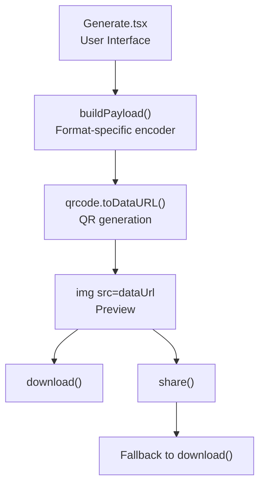
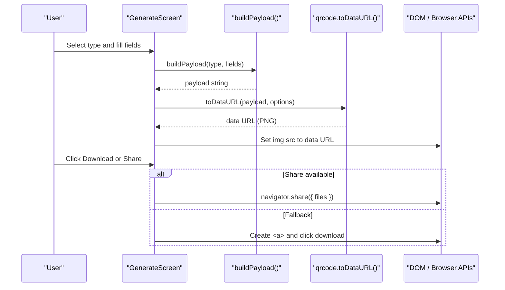
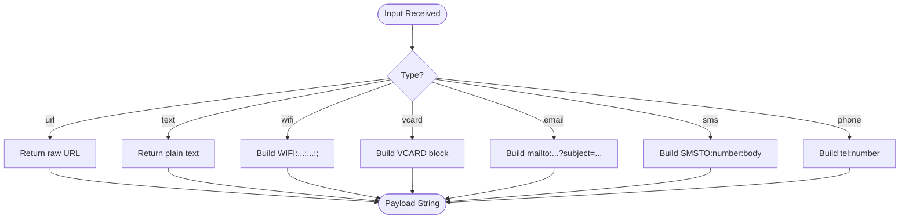
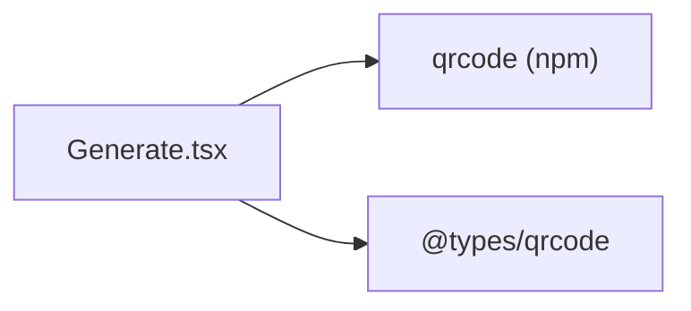

# QR Code Generation Algorithms

<cite>
**Referenced Files in This Document**
- [Generate.tsx](file://src/pages/Generate.tsx)
- [package.json](file://package.json)
- [parser.ts](file://src/lib/scan/parser.ts)
- [types.ts](file://src/lib/scan/types.ts)
- [share.ts](file://src/lib/share.ts)
</cite>

## Table of Contents
1. [Introduction](#introduction)
2. [Project Structure](#project-structure)
3. [Core Components](#core-components)
4. [Architecture Overview](#architecture-overview)
5. [Detailed Component Analysis](#detailed-component-analysis)
6. [Dependency Analysis](#dependency-analysis)
7. [Performance Considerations](#performance-considerations)
8. [Troubleshooting Guide](#troubleshooting-guide)
9. [Conclusion](#conclusion)

## Introduction
This document explains how QR codes are generated in the application, focusing on the underlying qrcode library integration, data encoding processes for multiple content types, and error correction configuration. It also covers supported payload formats (URLs, text, Wi-Fi credentials, vCard contacts, email addresses, SMS messages, and phone numbers), the payload building process, rendering via data URLs, and browser compatibility with fallback mechanisms. Performance considerations for large datasets and memory optimization strategies are included to guide future enhancements.

## Project Structure
The QR code generation feature is implemented primarily in a single React page component that:
- Accepts user input for different content types
- Builds a standardized string payload per type
- Renders a QR image using the qrcode library’s toDataURL method
- Provides download and share actions with browser-compatible fallbacks

**Diagram sources**
- [Generate.tsx:24-41](file://src/pages/Generate.tsx#L24-L41)
- [Generate.tsx:52-71](file://src/pages/Generate.tsx#L52-L71)
- [Generate.tsx:89-111](file://src/pages/Generate.tsx#L89-L111)

**Section sources**
- [Generate.tsx:1-225](file://src/pages/Generate.tsx#L1-L225)

## Core Components
- Payload builder: Encodes user inputs into format-specific strings used by the QR generator.
- QR generation: Uses the qrcode library to convert payloads into PNG data URLs.
- Rendering and export: Displays the QR preview and supports downloading or sharing with fallbacks.

Key responsibilities:
- Format selection and default field population
- Payload construction rules per type
- Asynchronous QR generation with cancellation handling
- Export utilities leveraging standard browser APIs

**Section sources**
- [Generate.tsx:24-41](file://src/pages/Generate.tsx#L24-L41)
- [Generate.tsx:52-71](file://src/pages/Generate.tsx#L52-L71)
- [Generate.tsx:89-111](file://src/pages/Generate.tsx#L89-L111)

## Architecture Overview
The flow from user input to rendered QR code involves three stages:
1. Input collection and payload building
2. QR encoding via qrcode.toDataURL
3. Image preview and export operations

**Diagram sources**
- [Generate.tsx:24-41](file://src/pages/Generate.tsx#L24-L41)
- [Generate.tsx:52-71](file://src/pages/Generate.tsx#L52-L71)
- [Generate.tsx:89-111](file://src/pages/Generate.tsx#L89-L111)

## Detailed Component Analysis

### Payload Building and Supported Data Types
The payload builder constructs strings according to well-known schemes:
- URL: Raw URL string
- Text: Plain text
- Wi-Fi: WIFI:T:<encryption>;S:<ssid>;P:<password>;H:<hidden>;;
- vCard: BEGIN:VCARD\nVERSION:3.0\nFN:<name>\nTEL:<tel>\nEMAIL:<email>\nEND:VCARD
- Email: mailto:<to>?subject=<subject>
- SMS: SMSTO:<number>:<body>
- Phone: tel:<number>

These encodings align with common scanner expectations and mirror parsing logic used elsewhere in the app.

**Diagram sources**
- [Generate.tsx:24-41](file://src/pages/Generate.tsx#L24-L41)

**Section sources**
- [Generate.tsx:24-41](file://src/pages/Generate.tsx#L24-L41)
- [parser.ts:51-101](file://src/lib/scan/parser.ts#L51-L101)
- [types.ts:16-26](file://src/lib/scan/types.ts#L16-L26)

### QR Library Integration and Error Correction
- The qrcode library is integrated via import and invoked through toDataURL.
- Configuration includes margin, width, colors, and errorCorrectionLevel set to "M".
- The promise-based API returns a data URL suitable for direct use in an  element.
- Cancellation is handled to avoid stale updates when inputs change rapidly.

Error correction levels:
- The implementation uses level M. The qrcode library supports L, M, Q, H. Level M provides moderate resilience against damage and is appropriate for general-purpose QR codes.

Rendering:
- The resulting data URL is assigned to an  element for immediate preview.
- A hidden canvas element exists in the component but is not actively used for rendering in this implementation.

**Section sources**
- [Generate.tsx:3](file://src/pages/Generate.tsx#L3)
- [Generate.tsx:52-71](file://src/pages/Generate.tsx#L52-L71)
- [Generate.tsx:200](file://src/pages/Generate.tsx#L200)

### Rendering and Export Flow
- Download: Creates an anchor element with href set to the data URL and triggers a programmatic click to save the PNG file.
- Share: Attempts to use the Web Share API with a File constructed from the data URL. If unavailable or fails, it falls back to download.

Browser compatibility:
- navigator.canShare and navigator.share are checked before attempting to share.
- Fallback ensures consistent behavior across browsers.

**Section sources**
- [Generate.tsx:89-111](file://src/pages/Generate.tsx#L89-L111)
- [share.ts:35-51](file://src/lib/share.ts#L35-L51)

### Parsing Alignment and Content Types
The payload formats match the parser used for scanned content, ensuring symmetry between generation and recognition:
- Wi-Fi, vCard, mailto/email, SMSTO/SMS, tel/phone, and generic text/url patterns are recognized by the parser.
- This alignment helps ensure generated QR codes are correctly interpreted by scanners.

**Section sources**
- [parser.ts:51-101](file://src/lib/scan/parser.ts#L51-L101)
- [types.ts:16-26](file://src/lib/scan/types.ts#L16-L26)

## Dependency Analysis
External dependencies relevant to QR generation:
- qrcode: Provides QR code generation algorithms and rendering to data URLs.
- @types/qrcode: TypeScript definitions for the qrcode package.

**Diagram sources**
- [Generate.tsx:3](file://src/pages/Generate.tsx#L3)
- [package.json:26](file://package.json#L26)
- [package.json:37](file://package.json#L37)

**Section sources**
- [package.json:26](file://package.json#L26)
- [package.json:37](file://package.json#L37)

## Performance Considerations
Current implementation notes:
- Width is fixed at 512 pixels with a small margin, producing reasonably sized images for preview and sharing.
- Error correction level M balances readability and size.

Recommendations for large datasets:
- Adjust width and margin based on payload length to keep QR modules within optimal density.
- Consider dynamic sizing: compute minimal width required for the payload and selected error correction level to reduce memory usage.
- Use requestAnimationFrame or debouncing around payload changes to avoid redundant generations during rapid typing.
- Avoid unnecessary re-renders by memoizing expensive computations and ensuring stable dependency arrays.

Memory optimization strategies:
- Reuse computed data URLs where possible and clear references when components unmount.
- Prefer Blob URLs for sharing when feasible to avoid repeated fetches from data URLs.
- Limit concurrent QR generations by canceling previous promises when new inputs arrive (already partially implemented).

Canvas rendering techniques:
- The current approach uses data URLs directly in . If custom drawing or post-processing is needed, render to a Canvas element, then export via toBlob or toDataURL.
- For high-DPI displays, scale canvas dimensions appropriately and adjust module sizes to maintain sharpness.

[No sources needed since this section provides general guidance]

## Troubleshooting Guide
Common issues and resolutions:
- Empty payload: Ensure all required fields are populated for each type; empty payloads will not generate a QR image.
- Invalid characters: Some formats require proper escaping (e.g., subject in mailto). Verify encoding rules.
- Large payloads: Excessively long content may exceed capacity for lower error correction levels. Increase error correction level or shorten content.
- Share failures: On unsupported browsers, the share action falls back to download automatically.

Relevant implementation details:
- Payload validation and defaults are managed in the component state and type switcher.
- Share attempts navigator.share with canShare checks and falls back to download.

**Section sources**
- [Generate.tsx:73-85](file://src/pages/Generate.tsx#L73-L85)
- [Generate.tsx:98-111](file://src/pages/Generate.tsx#L98-L111)

## Conclusion
The QR code generation system integrates the qrcode library to transform structured payloads into scannable images. It supports multiple content types with well-defined encoding rules, uses a moderate error correction level for robustness, and provides cross-browser compatible export options. Future improvements can focus on dynamic sizing, performance optimizations for large payloads, and optional canvas-based rendering for advanced customization.