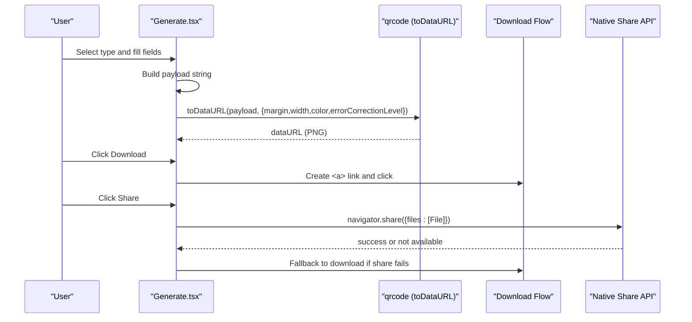
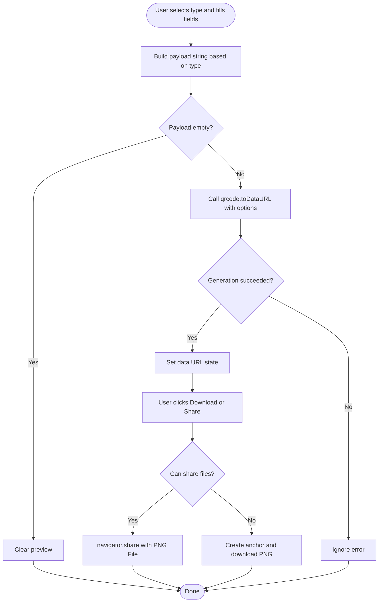
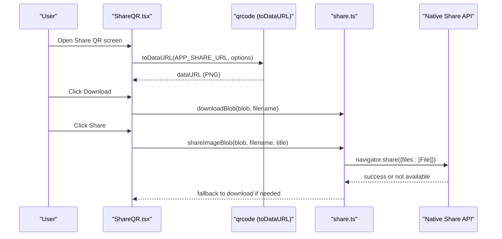
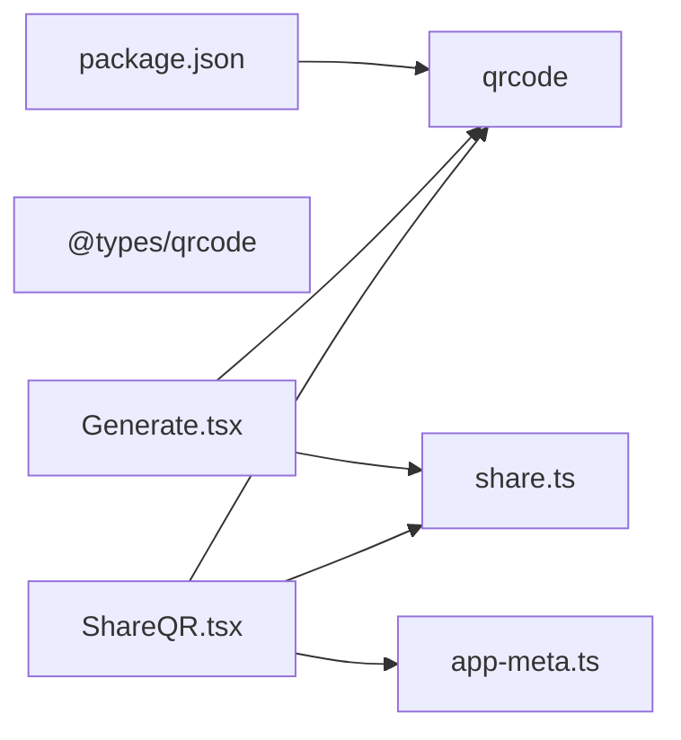

# QR Code Generation

<cite>
**Referenced Files in This Document**
- [Generate.tsx](file://src/pages/Generate.tsx)
- [ShareQR.tsx](file://src/pages/ShareQR.tsx)
- [share.ts](file://src/lib/share.ts)
- [app-meta.ts](file://src/lib/app-meta.ts)
- [types.ts](file://src/lib/scan/types.ts)
- [package.json](file://package.json)
</cite>

## Table of Contents
1. [Introduction](#introduction)
2. [Project Structure](#project-structure)
3. [Core Components](#core-components)
4. [Architecture Overview](#architecture-overview)
5. [Detailed Component Analysis](#detailed-component-analysis)
6. [Dependency Analysis](#dependency-analysis)
7. [Performance Considerations](#performance-considerations)
8. [Troubleshooting Guide](#troubleshooting-guide)
9. [Conclusion](#conclusion)
10. [Appendices](#appendices)

## Introduction
This document explains the QR code generation capabilities implemented in the application. It covers supported data types, customization options, algorithms and output formats, sharing and download flows, performance considerations for large or batch scenarios, and template/branding possibilities. The implementation uses a well-known client-side library to generate QR images directly in the browser.

## Project Structure
The QR generation feature is primarily implemented in two pages:
- Generate page: user-facing form to create QR codes from various content types
- Share QR page: generates a promotional QR code for app sharing

Supporting utilities provide share/download helpers and app metadata.

```mermaid
graph TB
subgraph "Pages"
G["Generate.tsx"]
S["ShareQR.tsx"]
end
subgraph "Libraries"
SH["share.ts"]
AM["app-meta.ts"]
PT["types.ts (GeneratedCode)"]
end
PKG["package.json (qrcode dependency)"]
G --> SH
S --> SH
S --> AM
G -.uses payload builder.-> PT
G -.calls qrcode.toDataURL.-> PKG
S -.calls qrcode.toDataURL.-> PKG
```

**Diagram sources**
- [Generate.tsx:1-225](file://src/pages/Generate.tsx#L1-L225)
- [ShareQR.tsx:1-83](file://src/pages/ShareQR.tsx#L1-L83)
- [share.ts:1-52](file://src/lib/share.ts#L1-L52)
- [app-meta.ts:1-8](file://src/lib/app-meta.ts#L1-L8)
- [types.ts:41-48](file://src/lib/scan/types.ts#L41-L48)
- [package.json:37](file://package.json#L37)

**Section sources**
- [Generate.tsx:1-225](file://src/pages/Generate.tsx#L1-L225)
- [ShareQR.tsx:1-83](file://src/pages/ShareQR.tsx#L1-L83)
- [share.ts:1-52](file://src/lib/share.ts#L1-L52)
- [app-meta.ts:1-8](file://src/lib/app-meta.ts#L1-L8)
- [types.ts:41-48](file://src/lib/scan/types.ts#L41-L48)
- [package.json:37](file://package.json#L37)

## Core Components
- Data type support: URL, plain text, WiFi credentials, vCard contact, email, SMS, phone number
- Generation algorithm: Client-side encoding via the qrcode library into PNG data URLs
- Output format: PNG only (data URL), with download and native share integration
- Customization: margin, width, color scheme (foreground/background), error correction level
- Sharing and download: Native Share API with file blob; fallback to direct PNG download
- App branding: Promotional QR using app name, tagline, and share URL

Key implementation references:
- Payload builders and UI for each type
- QR generation call and configuration
- Download and share utilities

**Section sources**
- [Generate.tsx:24-41](file://src/pages/Generate.tsx#L24-L41)
- [Generate.tsx:52-71](file://src/pages/Generate.tsx#L52-L71)
- [Generate.tsx:89-111](file://src/pages/Generate.tsx#L89-L111)
- [ShareQR.tsx:14-23](file://src/pages/ShareQR.tsx#L14-L23)
- [share.ts:24-51](file://src/lib/share.ts#L24-L51)
- [app-meta.ts:1-8](file://src/lib/app-meta.ts#L1-L8)

## Architecture Overview
The flow centers on React components that build payloads and call the QR library to produce PNG images. Sharing and downloading are handled by shared utilities.



**Diagram sources**
- [Generate.tsx:52-71](file://src/pages/Generate.tsx#L52-L71)
- [Generate.tsx:89-111](file://src/pages/Generate.tsx#L89-L111)
- [share.ts:35-51](file://src/lib/share.ts#L35-L51)

## Detailed Component Analysis

### Generate Page
Responsibilities:
- Provide a type selector and dynamic fields for each content type
- Build a standardized payload string per type
- Generate a QR image using the qrcode library
- Offer download and share actions

Supported data types and payload construction:
- URL: raw URL string
- Text: free-form text
- WiFi: structured connection string including SSID, password, encryption, hidden flag
- vCard: contact card with name, phone, email
- Email: mailto URI with optional subject
- SMS: SMSTO URI with recipient and body
- Phone: tel URI

Customization options currently applied:
- Margin around the QR module
- Width of the generated image
- Color scheme (dark/light)
- Error correction level

Output and UX:
- Preview rendered as an  element from the data URL
- Hidden canvas element present but unused for rendering
- Download triggers a PNG file named with a timestamp
- Share attempts native share with a PNG File; falls back to download



**Diagram sources**
- [Generate.tsx:24-41](file://src/pages/Generate.tsx#L24-L41)
- [Generate.tsx:52-71](file://src/pages/Generate.tsx#L52-L71)
- [Generate.tsx:89-111](file://src/pages/Generate.tsx#L89-L111)

**Section sources**
- [Generate.tsx:12-22](file://src/pages/Generate.tsx#L12-L22)
- [Generate.tsx:24-41](file://src/pages/Generate.tsx#L24-L41)
- [Generate.tsx:52-71](file://src/pages/Generate.tsx#L52-L71)
- [Generate.tsx:89-111](file://src/pages/Generate.tsx#L89-L111)
- [Generate.tsx:199-201](file://src/pages/Generate.tsx#L199-L201)

### Share QR Page
Responsibilities:
- Generate a QR code for the app’s share URL
- Display branding elements (name, tagline, URL)
- Provide download and share actions using shared utilities

Implementation highlights:
- Uses the same qrcode.toDataURL call with fixed styling and size
- Converts the data URL to a Blob for sharing
- Uses helper functions for download and share



**Diagram sources**
- [ShareQR.tsx:14-23](file://src/pages/ShareQR.tsx#L14-L23)
- [ShareQR.tsx:27-37](file://src/pages/ShareQR.tsx#L27-L37)
- [share.ts:24-51](file://src/lib/share.ts#L24-L51)
- [app-meta.ts:1-8](file://src/lib/app-meta.ts#L1-L8)

**Section sources**
- [ShareQR.tsx:1-83](file://src/pages/ShareQR.tsx#L1-L83)
- [share.ts:24-51](file://src/lib/share.ts#L24-L51)
- [app-meta.ts:1-8](file://src/lib/app-meta.ts#L1-L8)

### Sharing and Download Utilities
Functions:
- shareApp: shares app info via native share or clipboard fallback
- downloadBlob: creates a temporary object URL and triggers a download
- shareImageBlob: attempts native share with a PNG File; falls back to download

Behavior:
- Graceful fallbacks when native APIs are unavailable or cancelled
- User feedback via toast notifications

**Section sources**
- [share.ts:1-52](file://src/lib/share.ts#L1-L52)

### Data Model for Generated Codes
A model exists for persisted generated codes, including style hints (foreground/background). While not used by the current generation UI, it indicates future extensibility for templates and branding.

**Section sources**
- [types.ts:41-48](file://src/lib/scan/types.ts#L41-L48)

## Dependency Analysis
External dependencies relevant to QR generation:
- qrcode: core library for generating QR images in the browser
- @types/qrcode: TypeScript definitions for the above

Internal dependencies:
- Generate and ShareQR pages depend on qrcode and share utilities
- ShareQR depends on app metadata for branding and share URL



**Diagram sources**
- [package.json:37](file://package.json#L37)
- [package.json:26](file://package.json#L26)
- [Generate.tsx:3](file://src/pages/Generate.tsx#L3)
- [ShareQR.tsx:4](file://src/pages/ShareQR.tsx#L4)
- [ShareQR.tsx:7](file://src/pages/ShareQR.tsx#L7)
- [Generate.tsx:98-111](file://src/pages/Generate.tsx#L98-L111)
- [ShareQR.tsx:8](file://src/pages/ShareQR.tsx#L8)

**Section sources**
- [package.json:26-37](file://package.json#L26-L37)
- [Generate.tsx:3](file://src/pages/Generate.tsx#L3)
- [ShareQR.tsx:4](file://src/pages/ShareQR.tsx#L4)
- [ShareQR.tsx:7-8](file://src/pages/ShareQR.tsx#L7-L8)

## Performance Considerations
Current implementation notes:
- Generation uses qrcode.toDataURL with a fixed width and error correction level
- A hidden canvas element exists but is not used for rendering
- No explicit batching or debouncing is implemented

Recommendations for optimization:
- Debounce regeneration while typing to avoid excessive re-renders
- Use requestIdleCallback or Web Workers for heavy batches
- Cache generated data URLs keyed by payload to avoid recomputation
- Adjust width and error correction level based on payload length to balance readability and size
- Prefer SVG output for scalable branding overlays (requires additional library or post-processing)

[No sources needed since this section provides general guidance]

## Troubleshooting Guide
Common issues and resolutions:
- Share API not available: The code falls back to downloading the PNG automatically
- Clipboard write failures: Toast messages inform users and show the URL for manual copy
- Large QR codes: Increase error correction level cautiously; reduce payload size or increase width for better scan reliability
- Blank or missing preview: Ensure payload is non-empty before generation; check console for errors from the QR library

Operational references:
- Share fallback behavior and toast messaging
- Direct download path when share is unsupported

**Section sources**
- [share.ts:5-22](file://src/lib/share.ts#L5-L22)
- [share.ts:35-51](file://src/lib/share.ts#L35-L51)
- [Generate.tsx:52-71](file://src/pages/Generate.tsx#L52-L71)
- [Generate.tsx:89-111](file://src/pages/Generate.tsx#L89-L111)

## Conclusion
The application provides a robust, client-side QR generation experience with multiple content types, straightforward customization, and integrated sharing and download flows. While the current implementation focuses on PNG output, the presence of a style field in the generated code model suggests room for future enhancements such as SVG output, templates, and advanced branding.

[No sources needed since this section summarizes without analyzing specific files]

## Appendices

### Supported Data Types and Formats
- URL: standard web links
- Text: arbitrary strings
- WiFi: network credentials with encryption and hidden flags
- vCard: contact information
- Email: mailto links with optional subject
- SMS: pre-filled message recipients and bodies
- Phone: telephone numbers

These are constructed into standardized strings before being passed to the QR generator.

**Section sources**
- [Generate.tsx:24-41](file://src/pages/Generate.tsx#L24-L41)

### Customization Options
- Size: width parameter controls pixel dimensions
- Colors: foreground and background colors
- Error correction: level selection affects resilience and density
- Margin: quiet zone around the QR modules

These options are supplied to the QR generation call.

**Section sources**
- [Generate.tsx:58-63](file://src/pages/Generate.tsx#L58-L63)
- [ShareQR.tsx:15-20](file://src/pages/ShareQR.tsx#L15-L20)

### Output Formats
- PNG: primary output via data URL and Blob conversion
- SVG: not currently implemented in the pages; would require additional logic or a different generator

**Section sources**
- [Generate.tsx:89-111](file://src/pages/Generate.tsx#L89-L111)
- [ShareQR.tsx:27-37](file://src/pages/ShareQR.tsx#L27-L37)

### Sharing and Clipboard Integration
- Native share with PNG file when supported
- Clipboard fallback for text-based sharing
- Toast notifications for user feedback

**Section sources**
- [share.ts:5-22](file://src/lib/share.ts#L5-L22)
- [share.ts:35-51](file://src/lib/share.ts#L35-L51)

### Template and Branding Support
- Current UI does not expose template controls
- A style field exists in the generated code model for potential future use (foreground/background)
- Promotional QR includes app name, tagline, and share URL

**Section sources**
- [types.ts:41-48](file://src/lib/scan/types.ts#L41-L48)
- [app-meta.ts:1-8](file://src/lib/app-meta.ts#L1-L8)
- [ShareQR.tsx:50-70](file://src/pages/ShareQR.tsx#L50-L70)