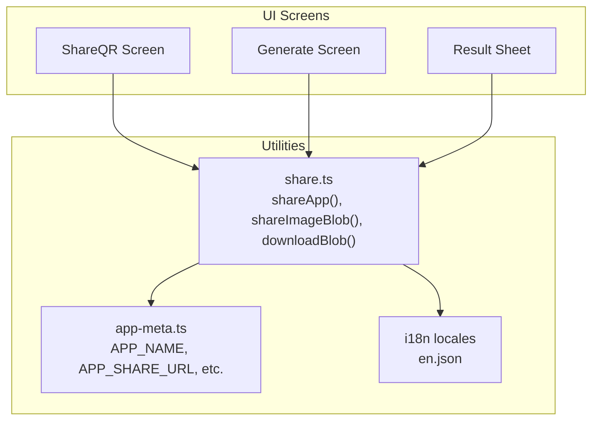
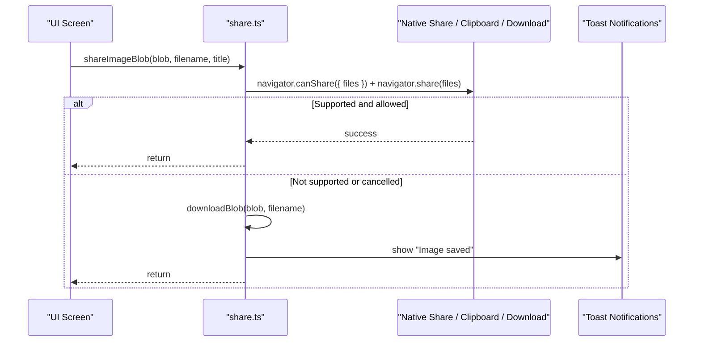
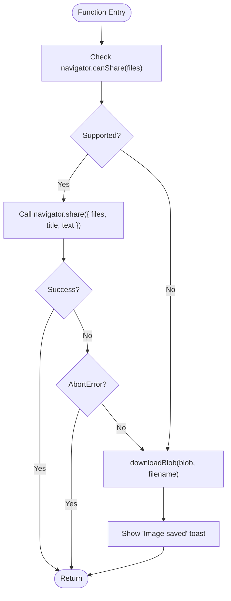
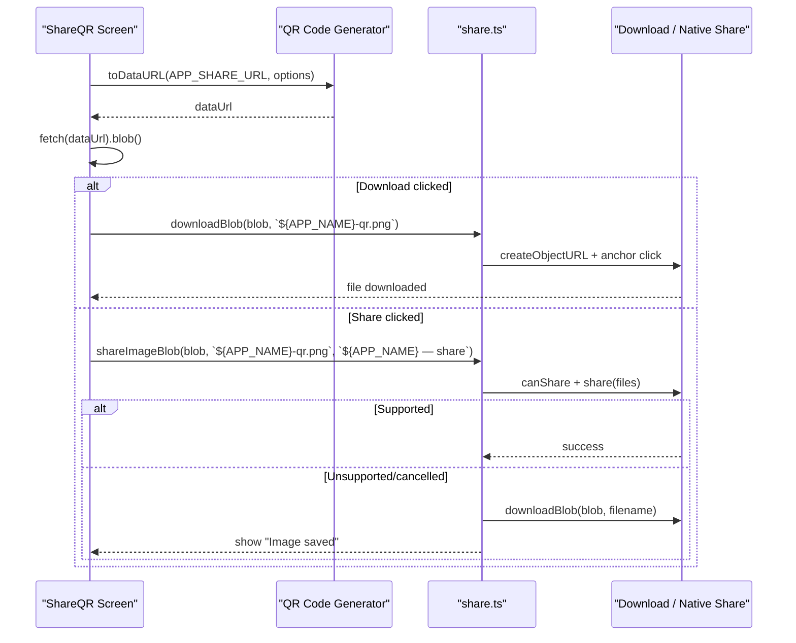
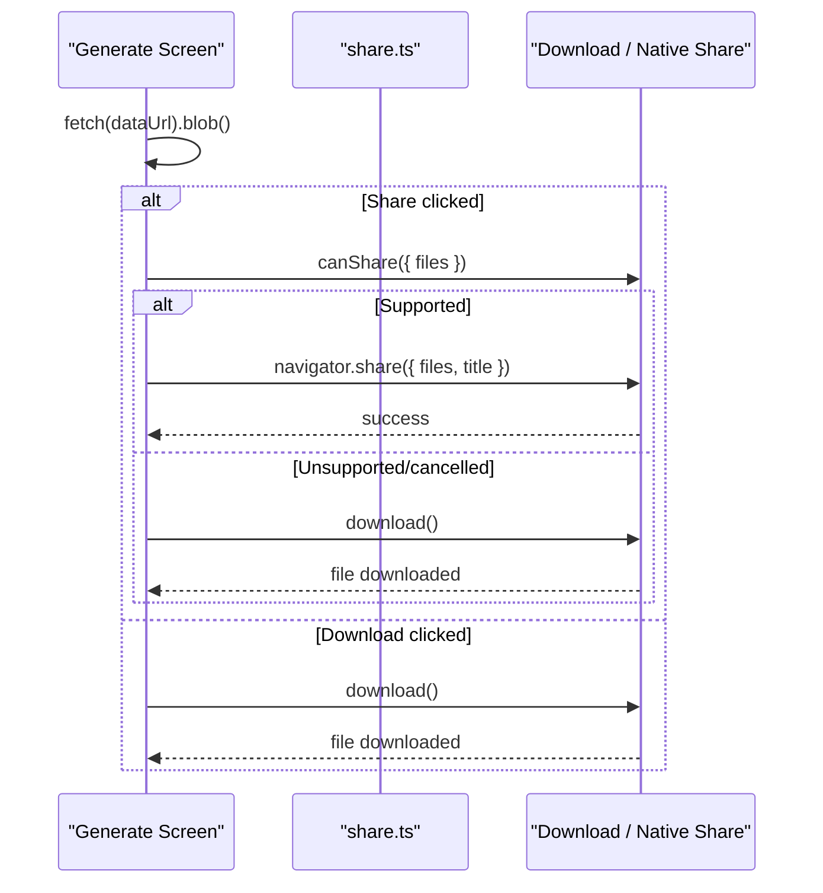
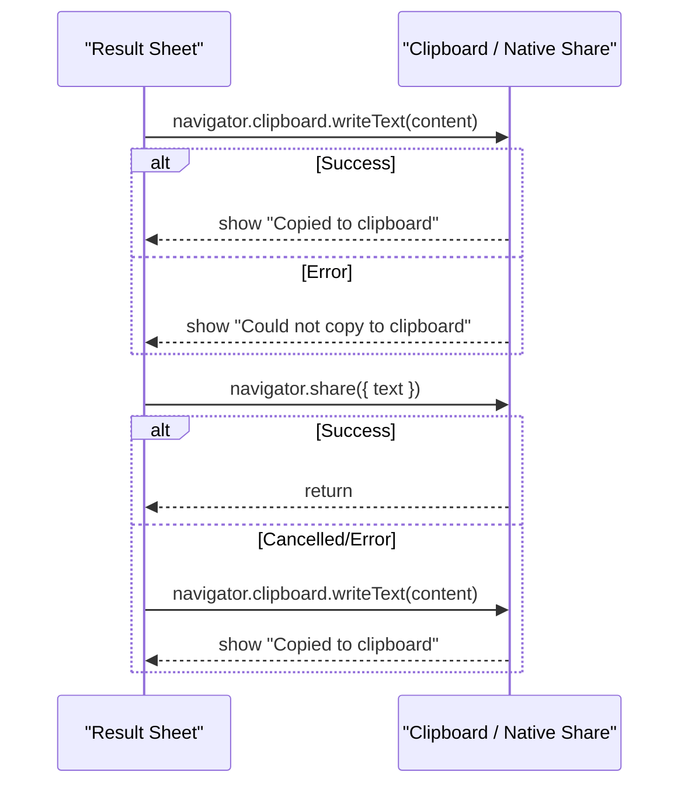
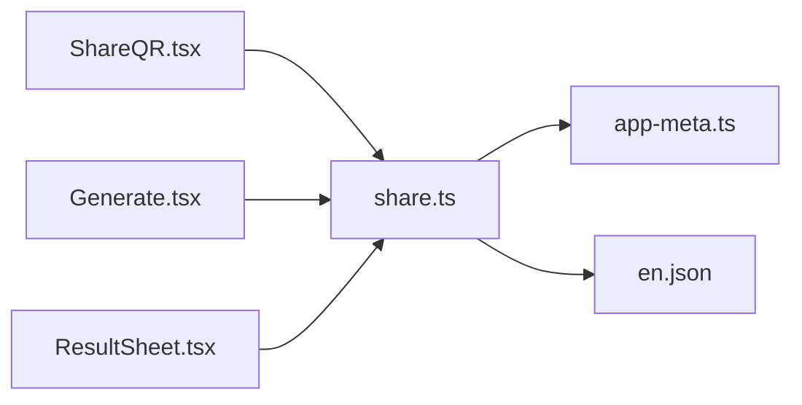

# Sharing and Export Functionality

<cite>
**Referenced Files in This Document**
- [share.ts](file://src/lib/share.ts)
- [ShareQR.tsx](file://src/pages/ShareQR.tsx)
- [Generate.tsx](file://src/pages/Generate.tsx)
- [ResultSheet.tsx](file://src/components/ResultSheet.tsx)
- [app-meta.ts](file://src/lib/app-meta.ts)
- [en.json](file://src/lib/i18n/locales/en.json)
</cite>

## Table of Contents
1. [Introduction](#introduction)
2. [Project Structure](#project-structure)
3. [Core Components](#core-components)
4. [Architecture Overview](#architecture-overview)
5. [Detailed Component Analysis](#detailed-component-analysis)
6. [Dependency Analysis](#dependency-analysis)
7. [Performance Considerations](#performance-considerations)
8. [Troubleshooting Guide](#troubleshooting-guide)
9. [Conclusion](#conclusion)

## Introduction
This document explains the QR code sharing and export capabilities implemented in the application. It covers:
- Native share API integration with file handling and blob conversion
- Cross-platform compatibility and fallback mechanisms
- Download functionality with automatic filename generation and PNG export
- Clipboard integration for copying text and images
- Security considerations, permission handling, and error recovery strategies
- Mobile vs desktop behavior differences and user experience optimizations

The implementation leverages modern browser APIs (Web Share API v2, Clipboard API) with robust fallbacks to ensure a consistent user experience across devices and browsers.

## Project Structure
Sharing and export features are primarily implemented in:
- A shared utility module for native sharing, image sharing, and downloads
- A dedicated screen for generating and exporting the app’s promotional QR code
- The QR generator screen that includes download and share actions
- The result sheet that provides copy and share actions for scanned content

**Diagram sources**
- [ShareQR.tsx:1-83](file://src/pages/ShareQR.tsx#L1-L83)
- [Generate.tsx:90-111](file://src/pages/Generate.tsx#L90-L111)
- [ResultSheet.tsx:132-153](file://src/components/ResultSheet.tsx#L132-L153)
- [share.ts:1-52](file://src/lib/share.ts#L1-L52)
- [app-meta.ts:1-8](file://src/lib/app-meta.ts#L1-L8)
- [en.json:200-209](file://src/lib/i18n/locales/en.json#L200-L209)

**Section sources**
- [ShareQR.tsx:1-83](file://src/pages/ShareQR.tsx#L1-L83)
- [Generate.tsx:90-111](file://src/pages/Generate.tsx#L90-L111)
- [ResultSheet.tsx:132-153](file://src/components/ResultSheet.tsx#L132-L153)
- [share.ts:1-52](file://src/lib/share.ts#L1-L52)
- [app-meta.ts:1-8](file://src/lib/app-meta.ts#L1-L8)
- [en.json:200-209](file://src/lib/i18n/locales/en.json#L200-L209)

## Core Components
- Utility functions:
  - shareApp(): Attempts native text sharing; falls back to clipboard copy with localized feedback.
  - shareImageBlob(): Attempts native image sharing via Web Share API v2; falls back to download with toast confirmation.
  - downloadBlob(): Creates an object URL from a Blob, triggers a programmatic download, and revokes the URL after a short delay.
- UI screens:
  - ShareQR Screen: Generates a high-resolution QR code for the app link, supports downloading as PNG and sharing the image.
  - Generate Screen: Supports downloading generated QR codes and sharing them when possible.
  - Result Sheet: Provides copy-to-clipboard and share actions for scanned content.

Key behaviors:
- Native share is preferred on supported platforms; otherwise, clipboard or download is used.
- Image sharing uses File objects and canShare checks to ensure platform support.
- Downloads use PNG format with deterministic filenames based on app metadata.
- User feedback is provided via localized toast notifications.

**Section sources**
- [share.ts:5-22](file://src/lib/share.ts#L5-L22)
- [share.ts:24-33](file://src/lib/share.ts#L24-L33)
- [share.ts:35-51](file://src/lib/share.ts#L35-L51)
- [ShareQR.tsx:14-37](file://src/pages/ShareQR.tsx#L14-L37)
- [Generate.tsx:90-111](file://src/pages/Generate.tsx#L90-L111)
- [ResultSheet.tsx:132-153](file://src/components/ResultSheet.tsx#L132-L153)
- [en.json:200-209](file://src/lib/i18n/locales/en.json#L200-L209)

## Architecture Overview
The sharing/export architecture follows a layered approach:
- UI layer triggers actions (download, share, copy).
- Utilities handle API calls and fallbacks.
- Metadata and localization provide consistent messaging and filenames.

**Diagram sources**
- [share.ts:35-51](file://src/lib/share.ts#L35-L51)
- [ShareQR.tsx:33-37](file://src/pages/ShareQR.tsx#L33-L37)

## Detailed Component Analysis

### Utility Module: share.ts
Responsibilities:
- Text sharing with fallback to clipboard
- Image sharing with fallback to download
- Generic blob download helper

Implementation highlights:
- shareApp():
  - Uses navigator.share with title, text, and url.
  - Catches AbortError to respect user cancellation.
  - Falls back to navigator.clipboard.writeText with localized success/error messages.
- downloadBlob():
  - Creates an object URL from a Blob.
  - Programmatically clicks a temporary anchor element with a download attribute.
  - Revokes the object URL after a short timeout to free memory.
- shareImageBlob():
  - Wraps the Blob into a File with type image/png if needed.
  - Checks navigator.canShare with files array before attempting native share.
  - On failure or unsupported environment, falls back to downloadBlob and shows a success toast.

**Diagram sources**
- [share.ts:35-51](file://src/lib/share.ts#L35-L51)

**Section sources**
- [share.ts:5-22](file://src/lib/share.ts#L5-L22)
- [share.ts:24-33](file://src/lib/share.ts#L24-L33)
- [share.ts:35-51](file://src/lib/share.ts#L35-L51)

### ShareQR Screen: ShareQR.tsx
Responsibilities:
- Generate a high-resolution QR code for the app’s install link.
- Provide Download and Share buttons for the generated image.

Behavior:
- Generates a data URL using a QR library with specified width and colors.
- Converts the data URL to a Blob for sharing/download.
- Uses downloadBlob for direct PNG download with a filename derived from app metadata.
- Uses shareImageBlob for native image sharing with a custom title and message.

**Diagram sources**
- [ShareQR.tsx:14-37](file://src/pages/ShareQR.tsx#L14-L37)
- [share.ts:24-51](file://src/lib/share.ts#L24-L51)
- [app-meta.ts:1-8](file://src/lib/app-meta.ts#L1-L8)

**Section sources**
- [ShareQR.tsx:14-37](file://src/pages/ShareQR.tsx#L14-L37)
- [app-meta.ts:1-8](file://src/lib/app-meta.ts#L1-L8)

### Generate Screen: Generate.tsx
Responsibilities:
- Generate QR codes for various content types.
- Provide Download and Share actions for the generated image.

Behavior:
- Download creates a timestamped filename and triggers a PNG download.
- Share attempts native image sharing via canShare and navigator.share; falls back to download if not supported.

**Diagram sources**
- [Generate.tsx:90-111](file://src/pages/Generate.tsx#L90-L111)

**Section sources**
- [Generate.tsx:90-111](file://src/pages/Generate.tsx#L90-L111)

### Result Sheet: ResultSheet.tsx
Responsibilities:
- Provide quick actions for scanned content, including copy and share.

Behavior:
- Copy writes the raw content to the system clipboard using navigator.clipboard.writeText.
- Share attempts native text sharing; falls back to copy if unavailable or cancelled.

**Diagram sources**
- [ResultSheet.tsx:132-153](file://src/components/ResultSheet.tsx#L132-L153)

**Section sources**
- [ResultSheet.tsx:132-153](file://src/components/ResultSheet.tsx#L132-L153)

## Dependency Analysis
- share.ts depends on:
  - app-meta.ts for shareable app information (title, message, URL).
  - i18n for localized user feedback.
- ShareQR.tsx and Generate.tsx depend on share.ts for consistent sharing and download logic.
- ResultSheet.tsx implements its own copy/share flow for scanned content.

**Diagram sources**
- [share.ts:1-52](file://src/lib/share.ts#L1-L52)
- [app-meta.ts:1-8](file://src/lib/app-meta.ts#L1-L8)
- [en.json:200-209](file://src/lib/i18n/locales/en.json#L200-L209)
- [ShareQR.tsx:1-83](file://src/pages/ShareQR.tsx#L1-L83)
- [Generate.tsx:90-111](file://src/pages/Generate.tsx#L90-L111)
- [ResultSheet.tsx:132-153](file://src/components/ResultSheet.tsx#L132-L153)

**Section sources**
- [share.ts:1-52](file://src/lib/share.ts#L1-L52)
- [app-meta.ts:1-8](file://src/lib/app-meta.ts#L1-L8)
- [en.json:200-209](file://src/lib/i18n/locales/en.json#L200-L209)
- [ShareQR.tsx:1-83](file://src/pages/ShareQR.tsx#L1-L83)
- [Generate.tsx:90-111](file://src/pages/Generate.tsx#L90-L111)
- [ResultSheet.tsx:132-153](file://src/components/ResultSheet.tsx#L132-L153)

## Performance Considerations
- QR generation:
  - Use appropriate width and error correction level to balance quality and performance.
  - Avoid regenerating unnecessarily; cache data URLs where feasible.
- Blob handling:
  - Revoke object URLs promptly to prevent memory leaks.
  - Prefer File objects for native sharing to leverage platform optimizations.
- Clipboard operations:
  - Keep clipboard writes minimal and only on explicit user actions.
- Toast notifications:
  - Use lightweight toasts to avoid blocking UI threads.

[No sources needed since this section provides general guidance]

## Troubleshooting Guide
Common issues and resolutions:
- Native sharing unavailable:
  - Behavior: Falls back to download or clipboard depending on context.
  - Resolution: Ensure HTTPS context and user gesture requirements are met.
- Clipboard write failures:
  - Behavior: Shows localized error message.
  - Resolution: Verify secure context (HTTPS), focus state, and permissions.
- Share dialog cancelled:
  - Behavior: No action taken; no error shown.
  - Resolution: Respect user intent; do not retry automatically.
- Download not triggered:
  - Behavior: May be blocked by browser settings or pop-up blockers.
  - Resolution: Ensure programmatic click occurs within a user-initiated event.

Localized messages:
- Link copied to clipboard
- Image saved
- Couldn't share — copy this link: <url>
- Could not copy to clipboard

**Section sources**
- [share.ts:5-22](file://src/lib/share.ts#L5-L22)
- [share.ts:35-51](file://src/lib/share.ts#L35-L51)
- [en.json:200-209](file://src/lib/i18n/locales/en.json#L200-L209)

## Conclusion
The sharing and export functionality provides a robust, cross-platform experience by leveraging native APIs with sensible fallbacks. Users benefit from:
- Seamless native sharing when available
- Reliable downloads with clear filenames
- Direct clipboard integration for quick sharing
- Clear, localized feedback and graceful error handling

Mobile vs desktop behavior:
- Mobile: Native share and clipboard are typically supported; image sharing integrates with apps and contacts.
- Desktop: Native share may be limited; clipboard and download remain reliable.

Security and privacy:
- All operations occur client-side; no server uploads.
- Secure contexts (HTTPS) are required for clipboard and some share features.
- Object URLs are revoked to minimize memory footprint.

[No sources needed since this section summarizes without analyzing specific files]