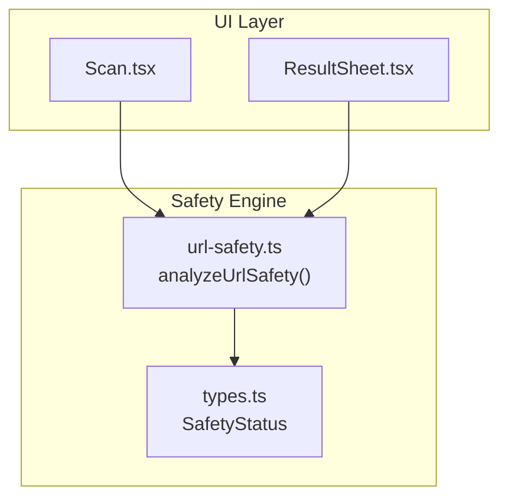
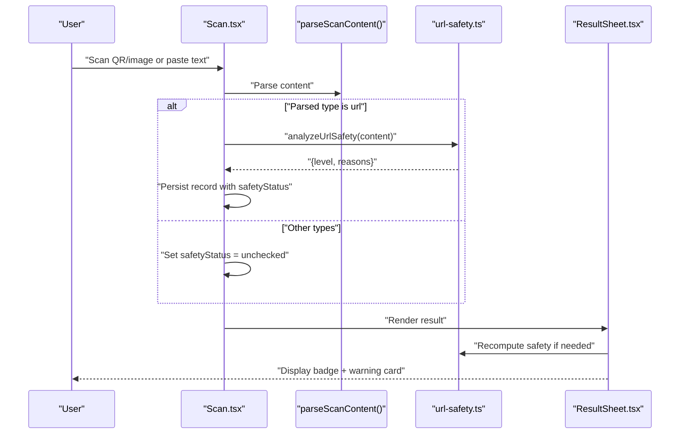
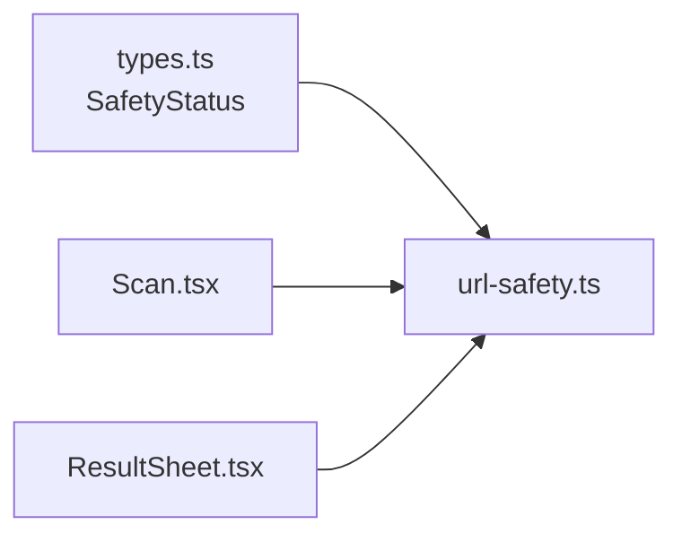

# URL Safety Analysis

<cite>
**Referenced Files in This Document**
- [url-safety.ts](file://src/lib/url-safety.ts)
- [types.ts](file://src/lib/scan/types.ts)
- [Scan.tsx](file://src/pages/Scan.tsx)
- [ResultSheet.tsx](file://src/components/ResultSheet.tsx)
</cite>

## Table of Contents
1. [Introduction](#introduction)
2. [Project Structure](#project-structure)
3. [Core Components](#core-components)
4. [Architecture Overview](#architecture-overview)
5. [Detailed Component Analysis](#detailed-component-analysis)
6. [Dependency Analysis](#dependency-analysis)
7. [Performance Considerations](#performance-considerations)
8. [Troubleshooting Guide](#troubleshooting-guide)
9. [Conclusion](#conclusion)

## Introduction
This document explains the URL safety analysis engine implemented in the application. It covers heuristic-based threat detection, malicious link identification, phishing attempt detection, risk classification (safe, suspicious, dangerous), and scoring methodology. It also documents brand impersonation detection, suspicious TLD analysis, domain reputation checks, credential exposure alerts, configuration options for custom rules, whitelist/blacklist management, integration with external threat intelligence services, and performance considerations for real-time URL analysis and caching strategies.

## Project Structure
The URL safety feature is primarily implemented as a standalone module that performs static heuristics on URLs. The scanning UI invokes this module when processing scanned content.

**Diagram sources**
- [Scan.tsx:50-72](file://src/pages/Scan.tsx#L50-L72)
- [ResultSheet.tsx:122-125](file://src/components/ResultSheet.tsx#L122-L125)
- [url-safety.ts:31-105](file://src/lib/url-safety.ts#L31-L105)
- [types.ts:28-28](file://src/lib/scan/types.ts#L28-L28)

**Section sources**
- [Scan.tsx:50-72](file://src/pages/Scan.tsx#L50-L72)
- [ResultSheet.tsx:122-125](file://src/components/ResultSheet.tsx#L122-L125)
- [url-safety.ts:31-105](file://src/lib/url-safety.ts#L31-L105)
- [types.ts:28-28](file://src/lib/scan/types.ts#L28-L28)

## Core Components
- Heuristic analyzer: A single function evaluates a URL against multiple rules and returns a risk level and reasons.
- Risk levels: safe, suspicious, dangerous (mapped to an internal type).
- Rule sets:
  - Dangerous protocol detection
  - IP host detection
  - Punycode/homograph detection
  - Excessive subdomains
  - Suspicious TLDs
  - URL shortener detection
  - Brand impersonation
  - Unencrypted HTTP
  - Embedded credentials

These components are defined and orchestrated within the URL safety module and consumed by the scanning UI.

**Section sources**
- [url-safety.ts:8-25](file://src/lib/url-safety.ts#L8-L25)
- [url-safety.ts:27-29](file://src/lib/url-safety.ts#L27-L29)
- [url-safety.ts:31-105](file://src/lib/url-safety.ts#L31-L105)
- [types.ts:28-28](file://src/lib/scan/types.ts#L28-L28)

## Architecture Overview
The flow from scan result to safety assessment and display:

**Diagram sources**
- [Scan.tsx:50-72](file://src/pages/Scan.tsx#L50-L72)
- [ResultSheet.tsx:122-125](file://src/components/ResultSheet.tsx#L122-L125)
- [url-safety.ts:31-105](file://src/lib/url-safety.ts#L31-L105)

## Detailed Component Analysis

### Heuristic-Based Threat Detection Algorithms
The analyzer applies a sequence of independent checks. Each check appends a human-readable reason to a list. Final classification uses a simple rule: any critical indicator or three or more total indicators yields “dangerous”; otherwise “suspicious”. If no indicators are found, it is “safe”.

Key checks:
- Dangerous protocols: javascript:, data:
- IP address hosts
- Punycode/homograph domains
- Deep subdomain structures (four or more dots)
- Suspicious TLDs
- URL shorteners
- Brand impersonation
- Unencrypted HTTP
- Embedded credentials (@username/password patterns)

```mermaid
flowchart TD
Start(["Function Entry"]) --> Normalize["Normalize input"]
Normalize --> CheckDangerProto{"Dangerous protocol?"}
CheckDangerProto --> |Yes| ReturnMalicious["Return 'dangerous' with reason"]
CheckDangerProto --> |No| ParseURL["Parse URL"]
ParseURL --> Host["Extract hostname"]
Host --> IPCheck{"IP host?"}
IPCheck --> |Yes| AddReason1["Add reason: IP host"]
IPCheck --> |No| PunycodeCheck{"Punycode/homograph?"}
AddReason1 --> PunycodeCheck
PunycodeCheck --> |Yes| AddReason2["Add reason: encoded international chars"]
PunycodeCheck --> |No| SubdomainCheck{"Excessive subdomains?"}
AddReason2 --> SubdomainCheck
SubdomainCheck --> |Yes| AddReason3["Add reason: deep subdomain structure"]
SubdomainCheck --> |No| TldCheck{"Suspicious TLD?"}
AddReason3 --> TldCheck
TldCheck --> |Yes| AddReason4["Add reason: spam-associated TLD"]
TldCheck --> |No| ShortenerCheck{"URL shortener?"}
AddReason4 --> ShortenerCheck
ShortenerCheck --> |Yes| AddReason5["Add reason: hidden destination"]
ShortenerCheck --> |No| BrandCheck{"Brand impersonation?"}
AddReason5 --> BrandCheck
BrandCheck --> |Yes| AddReason6["Add reason: mentions brand but not official"]
BrandCheck --> |No| HttpCheck{"HTTP (not HTTPS)?"}
AddReason6 --> HttpCheck
HttpCheck --> |Yes| AddReason7["Add reason: unencrypted connection"]
HttpCheck --> |No| CredsCheck{"Embedded credentials?"}
AddReason7 --> CredsCheck
CredsCheck --> |Yes| AddReason8["Add reason: embedded credentials"]
CredsCheck --> |No| Classify["Classify based on reasons"]
AddReason8 --> Classify
Classify --> HasCritical{"Has critical reason?"}
HasCritical --> |Yes| SetDangerous["Set 'dangerous'"]
HasCritical --> |No| CountCheck{"reasons >= 3?"}
CountCheck --> |Yes| SetDangerous
CountCheck --> |No| SetSuspicious["Set 'suspicious'"]
SetDangerous --> End(["Return result"])
SetSuspicious --> End
```

**Diagram sources**
- [url-safety.ts:31-105](file://src/lib/url-safety.ts#L31-L105)

**Section sources**
- [url-safety.ts:31-105](file://src/lib/url-safety.ts#L31-L105)

### Malicious Link Identification
A link is classified as “dangerous” when:
- Any critical indicator is present (e.g., dangerous protocol, brand impersonation, embedded credentials)
- Or there are three or more indicators overall

Examples of critical indicators include:
- Dangerous protocols
- Brand impersonation
- Embedded credentials

Non-critical indicators include:
- IP host
- Punycode/homograph
- Deep subdomains
- Suspicious TLD
- URL shortener
- HTTP

**Section sources**
- [url-safety.ts:99-102](file://src/lib/url-safety.ts#L99-L102)

### Phishing Attempt Detection
Phishing signals detected by the engine:
- Brand impersonation: domain contains a known brand name but does not match official domains
- Punycode/homograph: encoded international characters that can mimic legitimate sites
- Embedded credentials: presence of username/password in URL
- Suspicious TLDs: commonly abused extensions
- URL shorteners: hide final destination
- Deep subdomains: often used in lookalike pages

**Section sources**
- [url-safety.ts:54-82](file://src/lib/url-safety.ts#L54-L82)
- [url-safety.ts:89-92](file://src/lib/url-safety.ts#L89-L92)

### Risk Classification System and Scoring Methodology
- Levels: safe, suspicious, dangerous
- Scoring logic:
  - No reasons → safe
  - Critical reason OR ≥ 3 reasons → dangerous
  - Otherwise → suspicious

This provides a deterministic, transparent classification without numeric scores.

**Section sources**
- [types.ts:28-28](file://src/lib/scan/types.ts#L28-L28)
- [url-safety.ts:95-102](file://src/lib/url-safety.ts#L95-L102)

### Brand Impersonation Detection
- Maintains a map of brands to their legitimate domains
- Flags domains that mention a brand but do not match any official domain

Extensibility:
- Add new brands and domains to the map
- Adjust matching logic if needed

**Section sources**
- [url-safety.ts:15-25](file://src/lib/url-safety.ts#L15-L25)
- [url-safety.ts:76-82](file://src/lib/url-safety.ts#L76-L82)

### Suspicious TLD Analysis
- Uses a curated list of TLDs commonly associated with spam or abuse
- Adds a reason when the URL’s TLD matches the list

Extensibility:
- Update the TLD list as threat landscapes evolve

**Section sources**
- [url-safety.ts:8-8](file://src/lib/url-safety.ts#L8-L8)
- [url-safety.ts:65-69](file://src/lib/url-safety.ts#L65-L69)

### Domain Reputation Checking
- Current implementation does not perform live reputation checks
- Future enhancement: integrate with external threat intelligence APIs to enrich results

[No sources needed since this section proposes future enhancements]

### Credential Exposure Alerts
- Detects embedded usernames/passwords via URL parsing and raw string inspection
- Treats this as a critical indicator

**Section sources**
- [url-safety.ts:89-92](file://src/lib/url-safety.ts#L89-L92)

### Configuration Options for Custom Safety Rules
- The analyzer uses in-memory constants for lists and mappings
- To customize:
  - Extend the suspicious TLD list
  - Add or remove URL shorteners
  - Expand brand-to-domain mapping
  - Introduce additional heuristics (e.g., path patterns, query parameters)

Implementation guidance:
- Keep rule definitions near the top of the file for easy maintenance
- Ensure new rules append descriptive reasons for transparency

**Section sources**
- [url-safety.ts:8-25](file://src/lib/url-safety.ts#L8-L25)
- [url-safety.ts:31-105](file://src/lib/url-safety.ts#L31-L105)

### Whitelist/Blacklist Management
- Not currently implemented
- Recommended approach:
  - Maintain separate allow/deny lists
  - Apply deny-list first (immediate dangerous)
  - Then apply allow-list overrides (force safe)
  - Persist user preferences using existing settings store

[No sources needed since this section proposes future enhancements]

### Integration with External Threat Intelligence Services
- Not currently integrated
- Suggested design:
  - Create a service layer for remote checks (e.g., domain reputation, URL lookup)
  - Cache responses locally to reduce latency
  - Combine remote signals with local heuristics before final classification

[No sources needed since this section proposes future enhancements]

## Dependency Analysis
The safety module depends only on the shared type for status values and is invoked by UI components.

**Diagram sources**
- [types.ts:28-28](file://src/lib/scan/types.ts#L28-L28)
- [url-safety.ts:1-6](file://src/lib/url-safety.ts#L1-L6)
- [Scan.tsx:50-72](file://src/pages/Scan.tsx#L50-L72)
- [ResultSheet.tsx:122-125](file://src/components/ResultSheet.tsx#L122-L125)

**Section sources**
- [url-safety.ts:1-6](file://src/lib/url-safety.ts#L1-L6)
- [Scan.tsx:50-72](file://src/pages/Scan.tsx#L50-L72)
- [ResultSheet.tsx:122-125](file://src/components/ResultSheet.tsx#L122-L125)
- [types.ts:28-28](file://src/lib/scan/types.ts#L28-L28)

## Performance Considerations
- Real-time analysis:
  - The analyzer runs synchronously and is lightweight; it should be suitable for real-time use during scanning
  - Avoid blocking the main thread by keeping checks minimal and efficient
- Caching strategies:
  - Implement an in-process cache keyed by normalized URL to avoid re-analyzing identical inputs within a session
  - Optionally persist recent results to IndexedDB for long-lived sessions
- Debouncing:
  - The scanning page already debounces repeated identical results; reuse similar patterns for URL analysis if needed
- Extensibility cost:
  - Adding network calls for reputation checks should be optional and cached aggressively to maintain responsiveness

[No sources needed since this section provides general guidance]

## Troubleshooting Guide
Common issues and resolutions:
- False positives for legitimate shortened links:
  - Add trusted shortener domains to a whitelist override
  - Consider resolving redirects before analysis (requires external service)
- Legitimate brand-related subdomains flagged:
  - Expand the brand domain mapping to include common subdomains
- Internationalized domains misclassified:
  - Review punycode handling and consider allowing known legitimate xn-- domains
- Embedded credentials false alarms:
  - Some services embed tokens in URLs; add exceptions for known providers

Operational tips:
- Inspect the returned reasons array to understand why a URL was flagged
- Use the UI badges and warning cards to quickly identify risk levels

**Section sources**
- [ResultSheet.tsx:84-108](file://src/components/ResultSheet.tsx#L84-L108)
- [url-safety.ts:95-105](file://src/lib/url-safety.ts#L95-L105)

## Conclusion
The URL safety analysis engine provides a fast, deterministic, and explainable heuristic system for detecting potentially unsafe links. It identifies key risks such as brand impersonation, suspicious TLDs, hidden destinations, and credential exposure, and classifies URLs into safe, suspicious, or dangerous categories. While it currently operates offline with local rules, it is designed to be extended with whitelists/blacklists and external threat intelligence while maintaining performance through caching and minimal synchronous work.