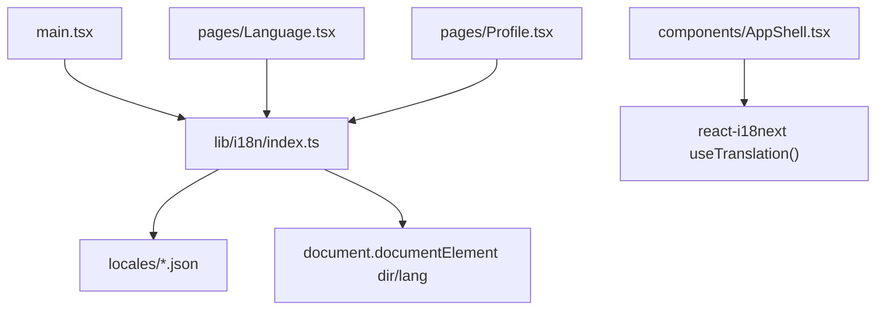
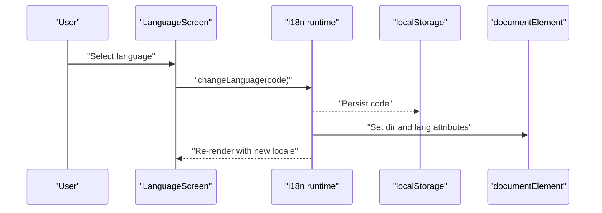
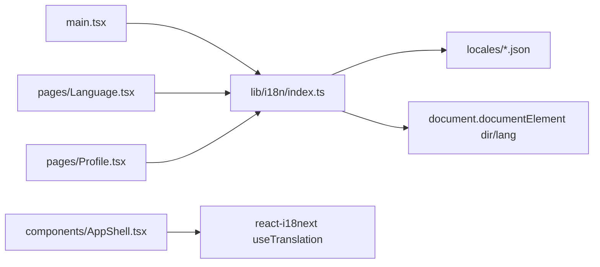

# Language & Localization

<cite>
**Referenced Files in This Document**
- [src/lib/i18n/index.ts](file://src/lib/i18n/index.ts)
- [src/pages/Language.tsx](file://src/pages/Language.tsx)
- [src/pages/Profile.tsx](file://src/pages/Profile.tsx)
- [src/components/AppShell.tsx](file://src/components/AppShell.tsx)
- [src/main.tsx](file://src/main.tsx)
- [src/lib/i18n/locales/en.json](file://src/lib/i18n/locales/en.json)
- [src/lib/i18n/locales/zh-CN.json](file://src/lib/i18n/locales/zh-CN.json)
- [src/lib/i18n/locales/ur.json](file://src/lib/i18n/locales/ur.json)
</cite>

## Table of Contents
1. [Introduction](#introduction)
2. [Project Structure](#project-structure)
3. [Core Components](#core-components)
4. [Architecture Overview](#architecture-overview)
5. [Detailed Component Analysis](#detailed-component-analysis)
6. [Dependency Analysis](#dependency-analysis)
7. [Performance Considerations](#performance-considerations)
8. [Troubleshooting Guide](#troubleshooting-guide)
9. [Conclusion](#conclusion)
10. [Appendices](#appendices)

## Introduction
This document explains the internationalization (i18n) system used by the application. It covers language selection, locale management, dynamic switching, and right-to-left (RTL) support. You will learn how translations are structured, how to add new languages, and best practices for accessible localization, date/time formatting, and cultural adaptations.

## Project Structure
The i18n implementation is centered around a single configuration module that initializes i18next, registers translation resources, detects the user’s preferred language, persists the choice, and applies text direction. The UI exposes a dedicated language selection page and integrates with profile navigation.

**Diagram sources**
- [src/main.tsx:1-24](file://src/main.tsx#L1-L24)
- [src/lib/i18n/index.ts:1-95](file://src/lib/i18n/index.ts#L1-L95)
- [src/pages/Language.tsx:1-68](file://src/pages/Language.tsx#L1-L68)
- [src/pages/Profile.tsx:1-180](file://src/pages/Profile.tsx#L1-L180)
- [src/components/AppShell.tsx:1-63](file://src/components/AppShell.tsx#L1-L63)

**Section sources**
- [src/main.tsx:1-24](file://src/main.tsx#L1-L24)
- [src/lib/i18n/index.ts:1-95](file://src/lib/i18n/index.ts#L1-L95)

## Core Components
- i18n initialization and runtime
  - Initializes i18next with react-i18next integration and browser language detection.
  - Registers all supported locales and sets fallback behavior.
  - Persists selected language in localStorage and applies document direction on change.
- Language selection interface
  - Renders a list of supported languages with native labels and English labels.
  - Applies RTL or LTR per language using metadata.
- Profile integration
  - Displays current language and navigates to the language selection screen.
- Navigation labels
  - Uses translation keys for tab labels across the app shell.

**Section sources**
- [src/lib/i18n/index.ts:1-95](file://src/lib/i18n/index.ts#L1-L95)
- [src/pages/Language.tsx:1-68](file://src/pages/Language.tsx#L1-L68)
- [src/pages/Profile.tsx:1-180](file://src/pages/Profile.tsx#L1-L180)
- [src/components/AppShell.tsx:1-63](file://src/components/AppShell.tsx#L1-L63)

## Architecture Overview
The i18n architecture follows a simple, modular design:
- Initialization occurs early in the app bootstrap.
- Translation resources are statically imported and registered.
- Language detection uses localStorage first, then navigator preferences.
- Changing language updates the runtime, persists the choice, and flips document direction.

**Diagram sources**
- [src/pages/Language.tsx:1-68](file://src/pages/Language.tsx#L1-L68)
- [src/lib/i18n/index.ts:74-93](file://src/lib/i18n/index.ts#L74-L93)

## Detailed Component Analysis

### i18n Configuration and Runtime
- Registration of supported languages and their metadata (code, English label, native label, direction).
- Resource map linking each language code to its JSON file under the translation namespace.
- Detection order: localStorage key, then navigator language; caches result in localStorage.
- Fallback language set to English.
- Interpolation enabled without escaping values.
- Direction application function reads metadata and sets both dir and lang attributes on the root element.
- Initial direction applied at startup based on resolved language.

Key responsibilities:
- Centralized language registry and metadata.
- Single source of truth for supported codes and directions.
- Persistence and immediate UI update on language change.

**Section sources**
- [src/lib/i18n/index.ts:14-42](file://src/lib/i18n/index.ts#L14-L42)
- [src/lib/i18n/index.ts:46-72](file://src/lib/i18n/index.ts#L46-L72)
- [src/lib/i18n/index.ts:74-93](file://src/lib/i18n/index.ts#L74-L93)

### Language Selection Interface
- Lists all supported languages from the central registry.
- Highlights the currently active language using resolved or current language.
- Each option shows native label and English label, with correct text direction and language attribute.
- Selecting a language triggers the centralized setter which updates runtime, persistence, and document direction.

Accessibility highlights:
- Uses aria-pressed to indicate selection state.
- Provides meaningful aria-labels for navigation elements.

**Section sources**
- [src/pages/Language.tsx:1-68](file://src/pages/Language.tsx#L1-L68)

### Profile Integration
- Shows the current language’s native label and direction.
- Navigates users to the language selection screen.
- Keeps UI consistent with the rest of the app by using shared translation keys.

**Section sources**
- [src/pages/Profile.tsx:26-85](file://src/pages/Profile.tsx#L26-L85)

### App Shell Navigation Labels
- Translates bottom navigation labels via translation keys.
- Ensures consistent labeling across screens.

**Section sources**
- [src/components/AppShell.tsx:7-16](file://src/components/AppShell.tsx#L7-L16)

### Translation File Structure
Translations are organized as flat JSON files grouped by feature area. Common patterns include:
- app: product name and tagline
- nav: top-level navigation labels
- common: reusable actions and messages
- scan, history, generate, result, safety, privacy, profile, language, shareQR, onboarding, errors, notFound, errorBoundary: domain-specific strings

Example structure overview:
- Top-level keys represent sections.
- Nested keys represent specific messages.
- Placeholders use interpolation syntax compatible with i18next.

Where to find examples:
- English resource file
- Simplified Chinese resource file
- Urdu resource file (RTL example)

**Section sources**
- [src/lib/i18n/locales/en.json:1-222](file://src/lib/i18n/locales/en.json#L1-L222)
- [src/lib/i18n/locales/zh-CN.json:1-208](file://src/lib/i18n/locales/zh-CN.json#L1-L208)
- [src/lib/i18n/locales/ur.json:1-208](file://src/lib/i18n/locales/ur.json#L1-L208)

## Dependency Analysis
The following diagram maps the primary dependencies among i18n-related modules and pages.

**Diagram sources**
- [src/main.tsx:1-24](file://src/main.tsx#L1-L24)
- [src/lib/i18n/index.ts:1-95](file://src/lib/i18n/index.ts#L1-L95)
- [src/pages/Language.tsx:1-68](file://src/pages/Language.tsx#L1-L68)
- [src/pages/Profile.tsx:1-180](file://src/pages/Profile.tsx#L1-L180)
- [src/components/AppShell.tsx:1-63](file://src/components/AppShell.tsx#L1-L63)

**Section sources**
- [src/lib/i18n/index.ts:1-95](file://src/lib/i18n/index.ts#L1-L95)
- [src/pages/Language.tsx:1-68](file://src/pages/Language.tsx#L1-L68)
- [src/pages/Profile.tsx:1-180](file://src/pages/Profile.tsx#L1-L180)
- [src/components/AppShell.tsx:1-63](file://src/components/AppShell.tsx#L1-L63)

## Performance Considerations
- Current-only loading: Resources are loaded only for the active language, reducing initial bundle size.
- Static imports: All locales are bundled at build time; consider lazy-loading large locales if the app grows significantly.
- Minimal runtime overhead: Language changes trigger a single re-render cycle through react-i18next.

[No sources needed since this section provides general guidance]

## Troubleshooting Guide
Common issues and resolutions:
- Language does not persist
  - Ensure localStorage is available and not blocked.
  - Verify the storage key used by the runtime matches expectations.
- Text direction not applied
  - Confirm the selected language has a valid direction in the registry.
  - Check that the document root attributes are updated after changing language.
- Missing translation keys
  - Add the missing key to all locale files to avoid undefined or empty strings.
  - Keep keys consistent across locales to maintain parity.
- Fallback behavior
  - If a language is not found, the app falls back to English; verify fallback configuration.

Operational references:
- Storage key and persistence logic
- Direction application logic
- Supported languages and fallback configuration

**Section sources**
- [src/lib/i18n/index.ts:44-72](file://src/lib/i18n/index.ts#L44-L72)
- [src/lib/i18n/index.ts:74-93](file://src/lib/i18n/index.ts#L74-L93)

## Conclusion
The i18n system is straightforward and effective: a single configuration module manages supported languages, resources, detection, persistence, and direction. Pages consume translations via hooks and expose a clear language selection flow. Adding new languages involves registering metadata, adding a locale file, and updating the resource map. For accessibility and cultural correctness, ensure proper direction handling, descriptive labels, and consistent key usage across all locales.

[No sources needed since this section summarizes without analyzing specific files]

## Appendices

### How to Add a New Language
Steps:
1. Create a new JSON file under the locales directory with the same structure as existing ones.
2. Register the language in the supported languages list with code, English label, native label, and direction.
3. Import the new locale file and add it to the resources map.
4. Optionally, test language detection and persistence.

References:
- Supported languages list and metadata
- Resources map registration
- Locale file structure examples

**Section sources**
- [src/lib/i18n/index.ts:33-55](file://src/lib/i18n/index.ts#L33-L55)
- [src/lib/i18n/locales/en.json:1-222](file://src/lib/i18n/locales/en.json#L1-L222)

### Managing Translations
Guidelines:
- Use semantic keys grouped by feature area.
- Keep placeholders consistent across locales.
- Maintain parity across all locales to prevent missing strings.
- Review pluralization and context-specific variants when expanding features.

References:
- Example English locale structure
- Example Simplified Chinese locale structure
- Example Urdu locale structure (RTL)

**Section sources**
- [src/lib/i18n/locales/en.json:1-222](file://src/lib/i18n/locales/en.json#L1-L222)
- [src/lib/i18n/locales/zh-CN.json:1-208](file://src/lib/i18n/locales/zh-CN.json#L1-L208)
- [src/lib/i18n/locales/ur.json:1-208](file://src/lib/i18n/locales/ur.json#L1-L208)

### Handling RTL Languages
Implementation details:
- Each language includes a direction flag.
- On language change, the document root receives dir and lang attributes.
- UI components render native labels with appropriate direction and language attributes.

References:
- Direction application function
- Language selection component rendering

**Section sources**
- [src/lib/i18n/index.ts:84-93](file://src/lib/i18n/index.ts#L84-L93)
- [src/pages/Language.tsx:42-52](file://src/pages/Language.tsx#L42-L52)

### Best Practices for Accessible Localization
Recommendations:
- Provide meaningful aria-labels for interactive elements.
- Use semantic HTML and ensure headings convey structure.
- Respect text direction and language attributes for assistive technologies.
- Avoid hardcoded strings; always use translation keys.
- Test with screen readers and keyboard navigation in both LTR and RTL modes.

[No sources needed since this section provides general guidance]

### Date/Time Formatting and Cultural Adaptations
Recommendations:
- Use locale-aware formatting libraries for dates, times, numbers, and currencies.
- Respect regional formats (e.g., 12-hour vs 24-hour clocks, calendar systems).
- Localize content beyond text: units, measurements, and culturally sensitive phrasing.
- Validate input formats and provide localized error messages.

[No sources needed since this section provides general guidance]