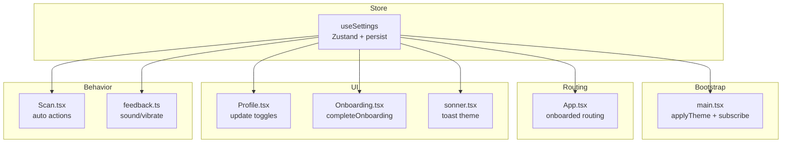
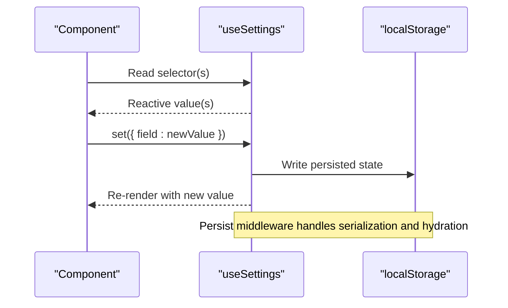
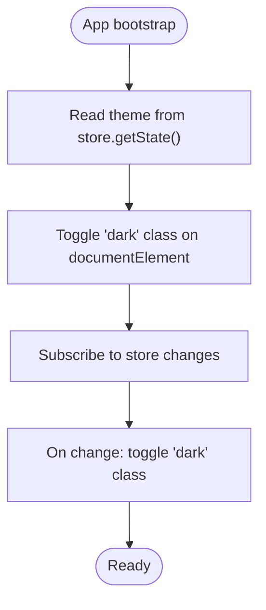
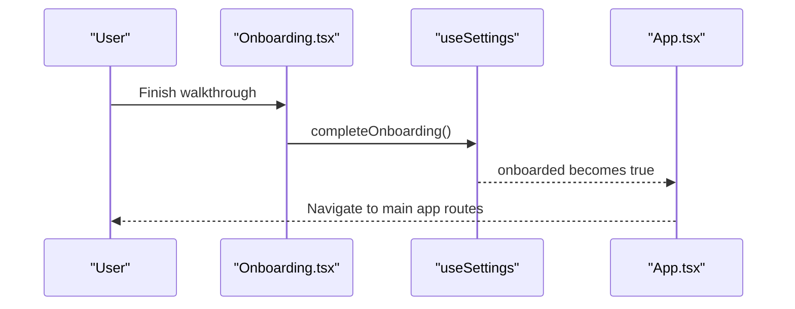
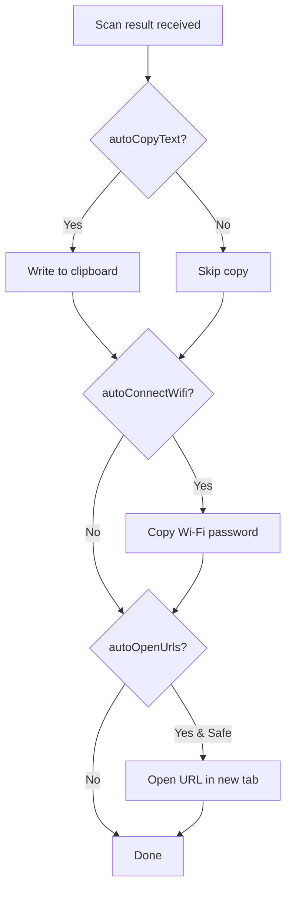
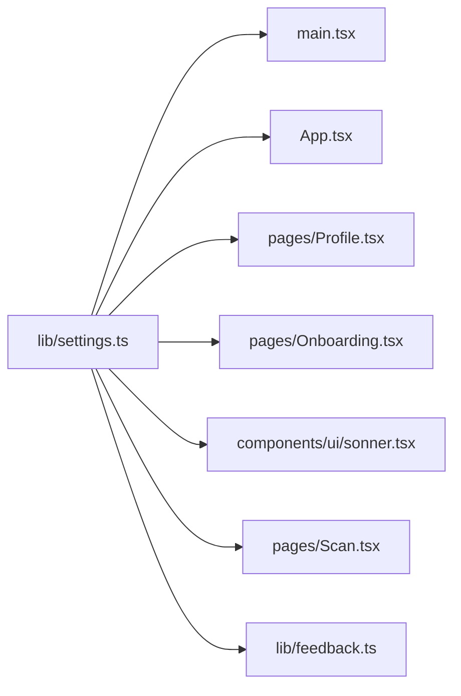

# Settings State Management

<cite>
**Referenced Files in This Document**
- [settings.ts](file://src/lib/settings.ts)
- [main.tsx](file://src/main.tsx)
- [App.tsx](file://src/App.tsx)
- [Profile.tsx](file://src/pages/Profile.tsx)
- [Onboarding.tsx](file://src/pages/Onboarding.tsx)
- [Scan.tsx](file://src/pages/Scan.tsx)
- [sonner.tsx](file://src/components/ui/sonner.tsx)
- [feedback.ts](file://src/lib/feedback.ts)
</cite>

## Table of Contents
1. [Introduction](#introduction)
2. [Project Structure](#project-structure)
3. [Core Components](#core-components)
4. [Architecture Overview](#architecture-overview)
5. [Detailed Component Analysis](#detailed-component-analysis)
6. [Dependency Analysis](#dependency-analysis)
7. [Performance Considerations](#performance-considerations)
8. [Troubleshooting Guide](#troubleshooting-guide)
9. [Conclusion](#conclusion)
10. [Appendices](#appendices)

## Introduction
This document explains the settings state management system built with Zustand and its persistence layer. It covers the AppSettings interface, default values, localStorage persistence via the persist middleware, the useSettings hook API (including set and completeOnboarding), storage key management, reactive updates, and practical usage patterns across components. It also provides best practices for maintaining consistency and performance when updating settings throughout the application.

## Project Structure
The settings store is centralized in a single module and consumed by multiple parts of the app:
- Store definition and types: src/lib/settings.ts
- Global theme application and subscription: src/main.tsx
- Routing decisions based on onboarding status: src/App.tsx
- User-facing settings UI: src/pages/Profile.tsx
- Onboarding completion flow: src/pages/Onboarding.tsx
- Runtime behavior driven by settings (auto-copy, auto-open URL, etc.): src/pages/Scan.tsx
- Toast theme integration: src/components/ui/sonner.tsx
- Non-UI side effects reading settings (sound/vibrate): src/lib/feedback.ts

**Diagram sources**
- [settings.ts:19-34](file://src/lib/settings.ts#L19-L34)
- [main.tsx:15-21](file://src/main.tsx#L15-L21)
- [App.tsx:24-36](file://src/App.tsx#L24-L36)
- [Profile.tsx:26-40](file://src/pages/Profile.tsx#L26-L40)
- [Onboarding.tsx:14-24](file://src/pages/Onboarding.tsx#L14-L24)
- [sonner.tsx:6-11](file://src/components/ui/sonner.tsx#L6-L11)
- [Scan.tsx:74-97](file://src/pages/Scan.tsx#L74-L97)
- [feedback.ts:5-35](file://src/lib/feedback.ts#L5-L35)

**Section sources**
- [settings.ts:1-34](file://src/lib/settings.ts#L1-L34)
- [main.tsx:15-21](file://src/main.tsx#L15-L21)
- [App.tsx:24-36](file://src/App.tsx#L24-L36)
- [Profile.tsx:26-40](file://src/pages/Profile.tsx#L26-L40)
- [Onboarding.tsx:14-24](file://src/pages/Onboarding.tsx#L14-L24)
- [sonner.tsx:6-11](file://src/components/ui/sonner.tsx#L6-L11)
- [Scan.tsx:74-97](file://src/pages/Scan.tsx#L74-L97)
- [feedback.ts:5-35](file://src/lib/feedback.ts#L5-L35)

## Core Components
- AppSettings interface: Defines all user preferences including onboarding status, sound, vibration, automation flags, and theme.
- SettingsState: Extends AppSettings with two methods:
  - set(patch): Partial update to merge into current state.
  - completeOnboarding(): Marks onboarding as completed.
- useSettings: The exported Zustand store instance wrapped with persist middleware for localStorage.

Key characteristics:
- Default values are defined at store creation time.
- Persist middleware serializes state to localStorage under a specific key.
- Subscriptions enable global side effects like applying theme before first paint.

**Section sources**
- [settings.ts:4-17](file://src/lib/settings.ts#L4-L17)
- [settings.ts:19-34](file://src/lib/settings.ts#L19-L34)

## Architecture Overview
The settings system follows a simple, unidirectional data flow:
- Components read from useSettings via selectors or full state access.
- Updates go through the provided set method or domain-specific actions like completeOnboarding.
- Persist middleware automatically syncs changes to localStorage.
- Global subscriptions apply cross-cutting concerns such as theme application.

**Diagram sources**
- [settings.ts:19-34](file://src/lib/settings.ts#L19-L34)

## Detailed Component Analysis

### AppSettings Interface and Defaults
- Fields:
  - onboarded: boolean — whether the user has finished onboarding.
  - sound: boolean — enables/disables audio feedback.
  - vibrate: boolean — enables/disables haptic feedback.
  - autoOpenUrls: boolean — opens URLs automatically after scanning.
  - autoCopyText: boolean — copies text results to clipboard automatically.
  - autoConnectWifi: boolean — copies Wi-Fi password to clipboard automatically.
  - theme: "dark" | "light" — UI theme preference.
- Defaults:
  - onboarded: false
  - sound: true
  - vibrate: true
  - autoOpenUrls: false
  - autoCopyText: false
  - autoConnectWifi: false
  - theme: "dark"

These defaults ensure predictable initial behavior and consistent UX across sessions.

**Section sources**
- [settings.ts:4-12](file://src/lib/settings.ts#L4-L12)
- [settings.ts:21-28](file://src/lib/settings.ts#L21-L28)

### useSettings Hook Implementation
- Created with create<SettingsState>() and wrapped with persist.
- Methods:
  - set(patch): Accepts a partial object and merges it into the existing state.
  - completeOnboarding(): Sets onboarded to true.
- Storage configuration:
  - name: "scaniq-settings" — used as the localStorage key.
  - No custom serializer/deserializer; default JSON serialization is used.

Reactive updates:
- Components subscribing to specific fields re-render only when those fields change.
- Full state access triggers re-renders on any change.

**Section sources**
- [settings.ts:14-17](file://src/lib/settings.ts#L14-L17)
- [settings.ts:19-34](file://src/lib/settings.ts#L19-L34)

### Persist Middleware and Storage Key Management
- The persist middleware persists the entire state tree to localStorage using the provided name.
- Hydration occurs on store initialization, restoring previous values if available.
- If you need to migrate or validate stored values, configure a custom serialize/deserialize function in the persist options.

Best practice:
- Keep the storage key stable across versions to avoid losing user preferences.
- If schema changes occur, implement migration logic in deserialize to transform old values safely.

**Section sources**
- [settings.ts:19-34](file://src/lib/settings.ts#L19-L34)

### Global Theme Application and Subscription
- Before the first render, the app reads the persisted theme and applies the dark class to the root element.
- A subscription ensures that whenever theme changes, the DOM class is updated immediately.

**Diagram sources**
- [main.tsx:15-21](file://src/main.tsx#L15-L21)

**Section sources**
- [main.tsx:15-21](file://src/main.tsx#L15-L21)

### Usage Patterns in Components

#### Accessing Settings in Components
- Selectors: Prefer selecting only the fields you need to minimize re-renders.
- Full state: Use when you need to call set with multiple fields or inspect many fields.

Examples:
- Reading a single field:
  - Pattern: const theme = useSettings((s) => s.theme);
  - Used in: sonner.tsx
- Reading multiple fields:
  - Pattern: const { sound, vibrate } = useSettings.getState();
  - Used in: feedback.ts

**Section sources**
- [sonner.tsx:6-11](file://src/components/ui/sonner.tsx#L6-L11)
- [feedback.ts:5-35](file://src/lib/feedback.ts#L5-L35)

#### Updating Settings with set
- Single-field updates:
  - Example pattern: settings.set({ sound: nextValue });
  - Used in: Profile.tsx for toggling sound, vibration, and automation flags.
- Multi-field batch updates:
  - Pass an object with multiple fields to set once to avoid multiple re-renders and writes.
  - Example pattern: settings.set({ theme: nextTheme, sound: false });

**Section sources**
- [Profile.tsx:36-40](file://src/pages/Profile.tsx#L36-L40)
- [Profile.tsx:63-72](file://src/pages/Profile.tsx#L63-L72)
- [Profile.tsx:104-118](file://src/pages/Profile.tsx#L104-L118)

#### Completing Onboarding
- The Onboarding component calls completeOnboarding to mark the user as onboarded.
- The App routes users away from onboarding screens based on the onboarded flag.

**Diagram sources**
- [Onboarding.tsx:14-24](file://src/pages/Onboarding.tsx#L14-L24)
- [App.tsx:24-36](file://src/App.tsx#L24-L36)

**Section sources**
- [Onboarding.tsx:14-24](file://src/pages/Onboarding.tsx#L14-L24)
- [App.tsx:24-36](file://src/App.tsx#L24-L36)

### Behavior Driven by Settings
- Scan flow reads settings synchronously to decide post-scan actions:
  - Auto-copy text if enabled.
  - Copy Wi-Fi password if enabled.
  - Open URL if safe and enabled.
- Feedback utilities check sound and vibrate flags before triggering side effects.

**Diagram sources**
- [Scan.tsx:74-97](file://src/pages/Scan.tsx#L74-L97)

**Section sources**
- [Scan.tsx:74-97](file://src/pages/Scan.tsx#L74-L97)
- [feedback.ts:5-35](file://src/lib/feedback.ts#L5-L35)

## Dependency Analysis
The following diagram shows how different modules depend on the settings store:

**Diagram sources**
- [settings.ts:19-34](file://src/lib/settings.ts#L19-L34)
- [main.tsx:5-21](file://src/main.tsx#L5-L21)
- [App.tsx:6-36](file://src/App.tsx#L6-L36)
- [Profile.tsx:2-40](file://src/pages/Profile.tsx#L2-L40)
- [Onboarding.tsx:3-24](file://src/pages/Onboarding.tsx#L3-L24)
- [sonner.tsx:1-11](file://src/components/ui/sonner.tsx#L1-L11)
- [Scan.tsx:74-97](file://src/pages/Scan.tsx#L74-L97)
- [feedback.ts:1-35](file://src/lib/feedback.ts#L1-L35)

**Section sources**
- [settings.ts:19-34](file://src/lib/settings.ts#L19-L34)
- [main.tsx:5-21](file://src/main.tsx#L5-L21)
- [App.tsx:6-36](file://src/App.tsx#L6-L36)
- [Profile.tsx:2-40](file://src/pages/Profile.tsx#L2-L40)
- [Onboarding.tsx:3-24](file://src/pages/Onboarding.tsx#L3-L24)
- [sonner.tsx:1-11](file://src/components/ui/sonner.tsx#L1-L11)
- [Scan.tsx:74-97](file://src/pages/Scan.tsx#L74-L97)
- [feedback.ts:1-35](file://src/lib/feedback.ts#L1-L35)

## Performance Considerations
- Prefer fine-grained selectors to reduce unnecessary re-renders. For example, select only the fields a component needs rather than the entire state.
- Batch updates by passing multiple fields to a single set call to minimize re-renders and localStorage writes.
- Avoid calling getState inside tight loops; cache values where appropriate.
- Keep the persisted payload small; the current shape is already minimal and efficient.

[No sources needed since this section provides general guidance]

## Troubleshooting Guide
- Theme not applied on reload:
  - Ensure the bootstrap code runs before rendering and subscribes to store changes.
  - Verify the persisted theme value exists in localStorage under the expected key.
- Onboarding loop:
  - Confirm completeOnboarding sets onboarded to true and that routing checks the same flag.
- Sound/vibrate not working:
  - Check that the relevant flags are enabled and that browser APIs are available.
- Unexpected re-renders:
  - Review selectors to ensure they are stable and specific.
  - Avoid accessing the whole state unless necessary.

**Section sources**
- [main.tsx:15-21](file://src/main.tsx#L15-L21)
- [Onboarding.tsx:14-24](file://src/pages/Onboarding.tsx#L14-L24)
- [feedback.ts:5-35](file://src/lib/feedback.ts#L5-L35)

## Conclusion
The settings system is a lightweight, persistent, and reactive foundation for user preferences. By centralizing state in a single store, exposing clear update methods, and leveraging React’s subscription model, the app achieves consistent behavior across features while keeping performance predictable. Following the recommended patterns—selective subscriptions, batched updates, and careful bootstrap logic—ensures reliability and maintainability as the feature set grows.

[No sources needed since this section summarizes without analyzing specific files]

## Appendices

### Examples and Best Practices

- Accessing settings in a component:
  - Selector-based: const theme = useSettings((s) => s.theme);
  - Full state: const settings = useSettings(); then settings.set({ ... });
- Batch updates:
  - settings.set({ theme: "light", sound: false });
- Complete onboarding:
  - completeOnboarding() to transition out of onboarding flows.
- Maintain consistency:
  - Always update settings via the provided set method or domain actions.
  - Centralize side effects that depend on settings (e.g., theme application) in bootstrap or dedicated hooks.

[No sources needed since this section provides general guidance]