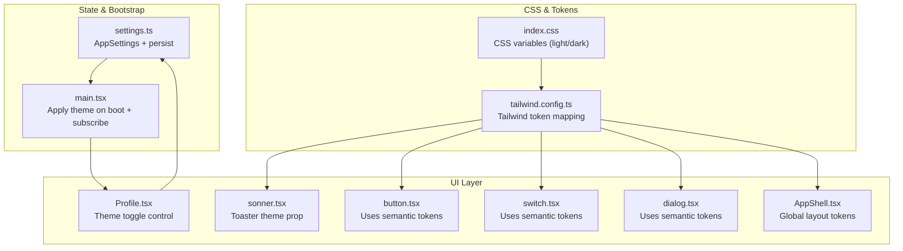
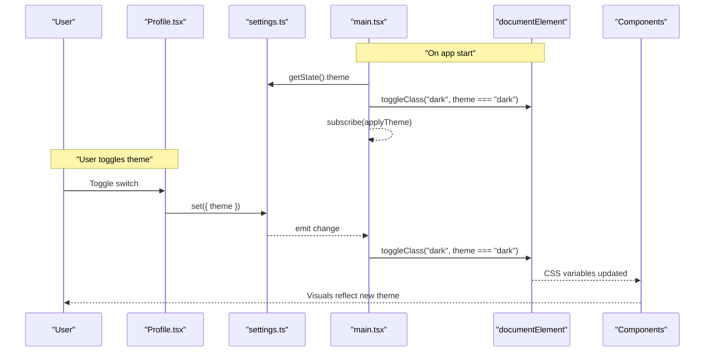
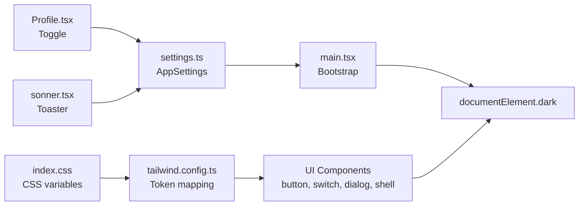

# Theme System

<cite>
**Referenced Files in This Document**
- [index.css](file://src/index.css)
- [tailwind.config.ts](file://tailwind.config.ts)
- [settings.ts](file://src/lib/settings.ts)
- [main.tsx](file://src/main.tsx)
- [Profile.tsx](file://src/pages/Profile.tsx)
- [sonner.tsx](file://src/components/ui/sonner.tsx)
- [button.tsx](file://src/components/ui/button.tsx)
- [switch.tsx](file://src/components/ui/switch.tsx)
- [dialog.tsx](file://src/components/ui/dialog.tsx)
- [AppShell.tsx](file://src/components/AppShell.tsx)
- [components.json](file://components.json)
</cite>

## Table of Contents
1. [Introduction](#introduction)
2. [Project Structure](#project-structure)
3. [Core Components](#core-components)
4. [Architecture Overview](#architecture-overview)
5. [Detailed Component Analysis](#detailed-component-analysis)
6. [Dependency Analysis](#dependency-analysis)
7. [Performance Considerations](#performance-considerations)
8. [Troubleshooting Guide](#troubleshooting-guide)
9. [Conclusion](#conclusion)
10. [Appendices](#appendices)

## Introduction
This document explains the theme system implementation, focusing on dark/light theme switching, CSS variable management, and Tailwind CSS integration. It covers how the theme property in AppSettings is persisted across sessions, how themes are applied dynamically at runtime, and how UI components consume theme tokens for consistent visuals. It also provides guidelines for adding new themes, customizing existing ones, and ensuring accessibility compliance.

## Project Structure
The theme system spans a small set of focused files:
- CSS variables and base styles define light and dark palettes.
- Tailwind configuration maps semantic color tokens to CSS variables.
- A Zustand store persists user preferences including the active theme.
- The application bootstrap applies the persisted theme before first paint and subscribes to changes.
- UI components use Tailwind classes that resolve to CSS variables, enabling automatic theme updates.

**Diagram sources**
- [index.css:7-114](file://src/index.css#L7-L114)
- [tailwind.config.ts:1-108](file://tailwind.config.ts#L1-L108)
- [settings.ts:4-34](file://src/lib/settings.ts#L4-L34)
- [main.tsx:15-21](file://src/main.tsx#L15-L21)
- [Profile.tsx:36-40](file://src/pages/Profile.tsx#L36-L40)
- [sonner.tsx:6-11](file://src/components/ui/sonner.tsx#L6-L11)
- [button.tsx:7-31](file://src/components/ui/button.tsx#L7-L31)
- [switch.tsx:10-23](file://src/components/ui/switch.tsx#L10-L23)
- [dialog.tsx:33-49](file://src/components/ui/dialog.tsx#L33-L49)
- [AppShell.tsx:17-25](file://src/components/AppShell.tsx#L17-L25)

**Section sources**
- [index.css:7-114](file://src/index.css#L7-L114)
- [tailwind.config.ts:1-108](file://tailwind.config.ts#L1-L108)
- [settings.ts:4-34](file://src/lib/settings.ts#L4-L34)
- [main.tsx:15-21](file://src/main.tsx#L15-L21)

## Core Components
- CSS Variables and Base Styles
  - Light and dark palettes are defined as HSL-based CSS variables under :root and .dark selectors.
  - Semantic tokens include background, foreground, primary, secondary, accent, destructive, warning, success, border, input, ring, card, popover, and sidebar variants.
  - Additional tokens cover gradients and shadows used by components.

- Tailwind Integration
  - Tailwind’s darkMode is configured to class-based toggling.
  - Color tokens map directly to CSS variables via hsl(var(--token)).
  - Border radius, gradients, shadows, animations, and keyframes extend the design system.

- Settings Store and Persistence
  - AppSettings includes a theme field with values "dark" | "light".
  - The store uses persistence middleware to save settings under a storage key.
  - Default theme is set to "dark".

- Runtime Application
  - On bootstrap, the app reads the persisted theme and toggles the "dark" class on the document root.
  - A subscription ensures any future changes to the theme propagate immediately.

- UI Consumption
  - Components use Tailwind utility classes referencing semantic tokens (e.g., bg-background, text-primary).
  - Third-party toast library receives the current theme from settings to match its internal styling.

**Section sources**
- [index.css:7-114](file://src/index.css#L7-L114)
- [tailwind.config.ts:1-108](file://tailwind.config.ts#L1-L108)
- [settings.ts:4-34](file://src/lib/settings.ts#L4-L34)
- [main.tsx:15-21](file://src/main.tsx#L15-L21)
- [sonner.tsx:6-11](file://src/components/ui/sonner.tsx#L6-L11)
- [button.tsx:7-31](file://src/components/ui/button.tsx#L7-L31)
- [switch.tsx:10-23](file://src/components/ui/switch.tsx#L10-L23)
- [dialog.tsx:33-49](file://src/components/ui/dialog.tsx#L33-L49)
- [AppShell.tsx:17-25](file://src/components/AppShell.tsx#L17-L25)

## Architecture Overview
The theme architecture follows a simple, robust pattern:
- State: Centralized in a persistent store.
- Bootstrap: Applies persisted state to DOM before rendering.
- Reactivity: Subscriptions update the DOM when state changes.
- Styling: Tailwind utilities read CSS variables; no component-level theme logic required.

**Diagram sources**
- [main.tsx:15-21](file://src/main.tsx#L15-L21)
- [Profile.tsx:36-40](file://src/pages/Profile.tsx#L36-L40)
- [settings.ts:19-34](file://src/lib/settings.ts#L19-L34)

## Detailed Component Analysis

### Theme State and Persistence
- AppSettings defines the theme property as an enum-like union of "dark" | "light".
- The store initializes with a default theme value and exposes a setter function.
- Persistence middleware saves all settings under a specific storage key, ensuring theme preference survives reloads.

Key behaviors:
- Reading theme: components can subscribe to the theme slice.
- Writing theme: call the setter with a partial patch including theme.
- Persistence: automatically persisted to local storage.

**Section sources**
- [settings.ts:4-12](file://src/lib/settings.ts#L4-L12)
- [settings.ts:19-34](file://src/lib/settings.ts#L19-L34)

### Bootstrap and Dynamic Application
- Before React renders, the app reads the persisted theme and sets the "dark" class accordingly.
- A subscription ensures subsequent theme changes instantly update the DOM without requiring a full re-render.

Implications:
- Prevents flash of incorrect theme on load.
- Keeps UI in sync with state changes globally.

**Section sources**
- [main.tsx:15-21](file://src/main.tsx#L15-L21)

### Theme Control Surface
- The Profile screen exposes a toggle that flips between "dark" and "light".
- It updates the store and synchronizes the DOM class for immediate effect.

Accessibility considerations:
- Ensure the toggle has appropriate labels and keyboard support.
- Provide visible focus indicators using ring tokens.

**Section sources**
- [Profile.tsx:36-40](file://src/pages/Profile.tsx#L36-L40)

### Toast Notification Theming
- The Toaster wrapper reads the current theme from settings and passes it to the underlying toast provider.
- This ensures toast messages match the active theme.

**Section sources**
- [sonner.tsx:6-11](file://src/components/ui/sonner.tsx#L6-L11)

### UI Components and Token Usage
- Button, Switch, Dialog, and AppShell rely on Tailwind utilities bound to CSS variables.
- Examples include backgrounds, text colors, borders, rings, and shadows.
- Because tokens are centralized, changing variables or adding new themes propagates consistently.

**Section sources**
- [button.tsx:7-31](file://src/components/ui/button.tsx#L7-L31)
- [switch.tsx:10-23](file://src/components/ui/switch.tsx#L10-L23)
- [dialog.tsx:33-49](file://src/components/ui/dialog.tsx#L33-L49)
- [AppShell.tsx:17-25](file://src/components/AppShell.tsx#L17-L25)

### Tailwind Configuration and Shadcn Setup
- Tailwind is configured for class-based dark mode and maps semantic colors to CSS variables.
- The project uses shadcn/ui conventions with CSS variables enabled.

**Section sources**
- [tailwind.config.ts:1-108](file://tailwind.config.ts#L1-L108)
- [components.json:6-12](file://components.json#L6-L12)

## Dependency Analysis
The following diagram shows how theme-related modules depend on each other and where CSS variables flow into the UI.

**Diagram sources**
- [index.css:7-114](file://src/index.css#L7-L114)
- [tailwind.config.ts:1-108](file://tailwind.config.ts#L1-L108)
- [settings.ts:4-34](file://src/lib/settings.ts#L4-L34)
- [main.tsx:15-21](file://src/main.tsx#L15-L21)
- [Profile.tsx:36-40](file://src/pages/Profile.tsx#L36-L40)
- [sonner.tsx:6-11](file://src/components/ui/sonner.tsx#L6-L11)
- [button.tsx:7-31](file://src/components/ui/button.tsx#L7-L31)
- [switch.tsx:10-23](file://src/components/ui/switch.tsx#L10-L23)
- [dialog.tsx:33-49](file://src/components/ui/dialog.tsx#L33-L49)
- [AppShell.tsx:17-25](file://src/components/AppShell.tsx#L17-L25)

**Section sources**
- [tailwind.config.ts:1-108](file://tailwind.config.ts#L1-L108)
- [components.json:6-12](file://components.json#L6-L12)

## Performance Considerations
- Class-based dark mode avoids media query recalculations and enables instant toggles.
- Using CSS variables ensures minimal repaint/reflow cost when theme changes.
- Persisted state prevents unnecessary network or heavy computations during startup.
- Keep theme tokens granular but not excessive to avoid bloated CSS.

[No sources needed since this section provides general guidance]

## Troubleshooting Guide
Common issues and resolutions:
- Theme does not persist after reload
  - Verify the persistence middleware name and ensure storage is accessible.
  - Confirm the store initialization includes the theme field and defaults.

- Flash of wrong theme on load
  - Ensure the bootstrap code runs before React render and toggles the "dark" class based on persisted state.

- UI components not updating
  - Check that components use Tailwind utilities mapped to CSS variables.
  - Confirm Tailwind config references the correct CSS file and uses class-based dark mode.

- Toast notifications mismatch theme
  - Ensure the Toaster wrapper reads the current theme from settings and passes it to the toast provider.

- Accessibility problems
  - Validate contrast ratios for both light and dark themes.
  - Ensure focus rings and interactive states remain visible.

**Section sources**
- [settings.ts:19-34](file://src/lib/settings.ts#L19-L34)
- [main.tsx:15-21](file://src/main.tsx#L15-L21)
- [tailwind.config.ts:1-108](file://tailwind.config.ts#L1-L108)
- [sonner.tsx:6-11](file://src/components/ui/sonner.tsx#L6-L11)

## Conclusion
The theme system is intentionally simple and composable:
- Centralized CSS variables define semantic tokens for light and dark modes.
- Tailwind bridges tokens to utilities, enabling consistent theming across components.
- A persistent store manages user preferences, and the bootstrap applies them early.
- UI components remain theme-agnostic, relying on tokens rather than hard-coded colors.

This approach makes it straightforward to add new themes, customize existing ones, and maintain visual consistency and accessibility.

[No sources needed since this section summarizes without analyzing specific files]

## Appendices

### How Themes Affect UI Components
- Colors: Backgrounds, text, borders, and accents derive from CSS variables.
- Shadows and Gradients: Custom shadow and gradient tokens provide depth and emphasis.
- Interactive States: Focus rings and hover states use semantic tokens for clarity.
- Layout Surfaces: Cards, dialogs, and navigation shells apply consistent surfaces.

**Section sources**
- [index.css:7-114](file://src/index.css#L7-L114)
- [tailwind.config.ts:16-84](file://tailwind.config.ts#L16-L84)
- [button.tsx:7-31](file://src/components/ui/button.tsx#L7-L31)
- [switch.tsx:10-23](file://src/components/ui/switch.tsx#L10-L23)
- [dialog.tsx:33-49](file://src/components/ui/dialog.tsx#L33-L49)
- [AppShell.tsx:17-25](file://src/components/AppShell.tsx#L17-L25)

### Guidelines for Adding New Themes
- Define a new theme selector (for example, a class like "theme-ocean").
- Add CSS variables under the new selector with adjusted HSL values.
- If you want a selectable theme beyond dark/light, extend the AppSettings type and store to include the new option.
- Update the bootstrap logic to apply the new theme class instead of or alongside "dark".
- Ensure Tailwind mappings still reference the same CSS variables so components adapt automatically.
- Test contrast and accessibility for the new palette.

[No sources needed since this section provides general guidance]

### Guidelines for Customizing Existing Themes
- Adjust HSL values in the relevant CSS variable blocks to tweak hues, saturations, or lightness.
- Use the provided gradient and shadow tokens to maintain visual harmony.
- Avoid overriding Tailwind utilities directly; prefer adjusting tokens for global consistency.

**Section sources**
- [index.css:7-114](file://src/index.css#L7-L114)
- [tailwind.config.ts:16-84](file://tailwind.config.ts#L16-L84)

### Ensuring Accessibility Compliance
- Contrast Ratios
  - Verify foreground/background pairs meet WCAG AA thresholds in both themes.
- Focus Indicators
  - Ensure ring tokens produce visible focus outlines on all surfaces.
- Reduced Motion
  - Respect user preferences for reduced motion if animations are introduced.
- Keyboard Navigation
  - Confirm all interactive elements are reachable and operable via keyboard.

[No sources needed since this section provides general guidance]