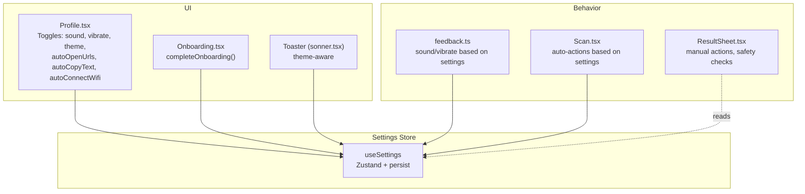
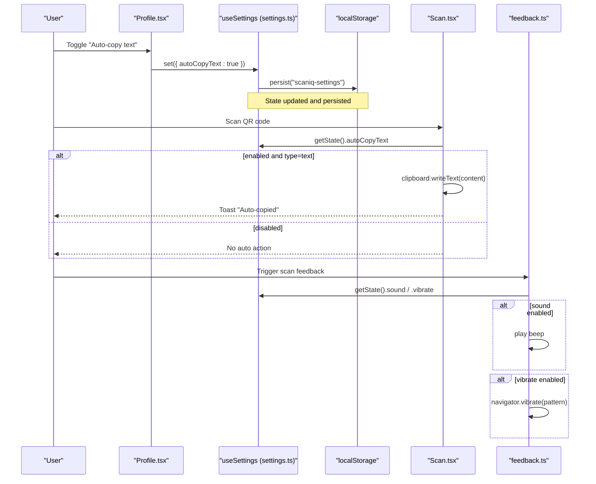
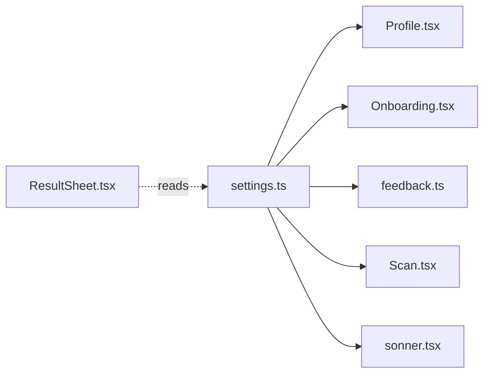

# User Preferences

<cite>
**Referenced Files in This Document**
- [settings.ts](file://src/lib/settings.ts)
- [Profile.tsx](file://src/pages/Profile.tsx)
- [Onboarding.tsx](file://src/pages/Onboarding.tsx)
- [feedback.ts](file://src/lib/feedback.ts)
- [ResultSheet.tsx](file://src/components/ResultSheet.tsx)
- [Scan.tsx](file://src/pages/Scan.tsx)
- [Privacy.tsx](file://src/pages/Privacy.tsx)
- [sonner.tsx](file://src/components/ui/sonner.tsx)
</cite>

## Table of Contents
1. [Introduction](#introduction)
2. [Project Structure](#project-structure)
3. [Core Components](#core-components)
4. [Architecture Overview](#architecture-overview)
5. [Detailed Component Analysis](#detailed-component-analysis)
6. [Dependency Analysis](#dependency-analysis)
7. [Performance Considerations](#performance-considerations)
8. [Troubleshooting Guide](#troubleshooting-guide)
9. [Conclusion](#conclusion)
10. [Appendices](#appendices)

## Introduction
This document explains the user preferences system for sound controls, vibration settings, auto-action preferences (URL opening, text copying, Wi-Fi connection), and onboarding completion status. It covers preference storage, default values, validation behavior, UX considerations, examples of implementing toggles and preference-dependent actions, feedback mechanisms, privacy considerations, and data retention policies.

## Project Structure
The preferences system is centered around a single Zustand store with persistence, exposed via a React hook. UI components read and update preferences, while feature modules consume them to alter runtime behavior.

**Diagram sources**
- [settings.ts:1-35](file://src/lib/settings.ts#L1-L35)
- [Profile.tsx:1-180](file://src/pages/Profile.tsx#L1-L180)
- [Onboarding.tsx:1-73](file://src/pages/Onboarding.tsx#L1-L73)
- [feedback.ts:1-40](file://src/lib/feedback.ts#L1-L40)
- [ResultSheet.tsx:1-414](file://src/components/ResultSheet.tsx#L1-L414)
- [Scan.tsx:46-124](file://src/pages/Scan.tsx#L46-L124)
- [sonner.tsx:1-27](file://src/components/ui/sonner.tsx#L1-L27)

**Section sources**
- [settings.ts:1-35](file://src/lib/settings.ts#L1-L35)
- [Profile.tsx:1-180](file://src/pages/Profile.tsx#L1-L180)
- [Onboarding.tsx:1-73](file://src/pages/Onboarding.tsx#L1-L73)
- [feedback.ts:1-40](file://src/lib/feedback.ts#L1-L40)
- [ResultSheet.tsx:1-414](file://src/components/ResultSheet.tsx#L1-L414)
- [Scan.tsx:46-124](file://src/pages/Scan.tsx#L46-L124)
- [sonner.tsx:1-27](file://src/components/ui/sonner.tsx#L1-L27)

## Core Components
- Settings store: Defines all preference keys, defaults, and mutation helpers. Persisted under a fixed key.
- Profile screen: Provides user-facing toggles for sound, vibration, theme, and automation options.
- Onboarding flow: Marks onboarding as complete when finished or skipped.
- Feedback utilities: Respect sound and vibration preferences before playing audio or vibrating.
- Scan flow: Applies auto-actions (copy text, copy Wi-Fi password, open URL) based on current preferences.
- Result sheet: Presents manual actions and safety information; does not directly change preferences but may be influenced by learned primary actions.
- Toaster: Adapts toast appearance to the selected theme preference.

Key preference fields and defaults:
- onboarded: boolean, default false
- sound: boolean, default true
- vibrate: boolean, default true
- autoOpenUrls: boolean, default false
- autoCopyText: boolean, default false
- autoConnectWifi: boolean, default false
- theme: "dark" | "light", default "dark"

**Section sources**
- [settings.ts:4-34](file://src/lib/settings.ts#L4-L34)
- [Profile.tsx:57-119](file://src/pages/Profile.tsx#L57-L119)
- [Onboarding.tsx:14-24](file://src/pages/Onboarding.tsx#L14-L24)
- [feedback.ts:5-35](file://src/lib/feedback.ts#L5-L35)
- [Scan.tsx:74-97](file://src/pages/Scan.tsx#L74-L97)
- [sonner.tsx:6-12](file://src/components/ui/sonner.tsx#L6-L12)

## Architecture Overview
The preferences are stored in a persistent Zustand store. UI components subscribe to specific fields and call a unified set method to update state. Feature code reads the latest values synchronously from the store’s getState to decide runtime behavior.

**Diagram sources**
- [settings.ts:19-34](file://src/lib/settings.ts#L19-L34)
- [Profile.tsx:104-118](file://src/pages/Profile.tsx#L104-L118)
- [Scan.tsx:74-97](file://src/pages/Scan.tsx#L74-L97)
- [feedback.ts:5-35](file://src/lib/feedback.ts#L5-L35)

## Detailed Component Analysis

### Settings Store (AppSettings)
- Purpose: Centralized, typed configuration with persistence.
- Storage: Uses a named localStorage key for persistence across sessions.
- API:
  - set(patch): Partial updates to any subset of fields.
  - completeOnboarding(): Sets onboarded to true.
- Defaults: Defined inline at creation time.
- Validation: No explicit validation; consumers should guard against unsupported values. For example, theme is typed as a union literal to prevent invalid strings.

Implementation notes:
- The store exposes both state fields and methods.
- Persistence name is stable, ensuring consistent storage across app versions unless explicitly changed.

**Section sources**
- [settings.ts:4-34](file://src/lib/settings.ts#L4-L34)

### Profile Screen (Toggles and Theme)
- Sound toggle: Updates settings.sound.
- Vibration toggle: Updates settings.vibrate.
- Theme toggle: Updates settings.theme and applies a class to the document root for CSS dark mode.
- Automation toggles: Update autoOpenUrls, autoCopyText, autoConnectWifi.
- UX: Each toggle uses a Switch component bound to the corresponding setting field.

Best practices demonstrated:
- Read-only subscription to individual fields for reactivity.
- Batch updates via partial patches.
- Immediate visual feedback through controlled Switch components.

**Section sources**
- [Profile.tsx:57-119](file://src/pages/Profile.tsx#L57-L119)

### Onboarding Completion
- Flow: Completes onboarding either by finishing slides or skipping.
- Effect: Calls completeOnboarding(), which sets onboarded to true and persists it.

UX considerations:
- Skip option allows users to bypass onboarding without friction.
- Completion is immediate and persistent.

**Section sources**
- [Onboarding.tsx:14-24](file://src/pages/Onboarding.tsx#L14-L24)

### Feedback Utilities (Sound and Vibration)
- Sound: Generates a short beep using Web Audio if settings.sound is true.
- Vibration: Triggers device vibration if settings.vibrate is true.
- Combined helper: Plays both beep and vibration together.

Error handling:
- Catches exceptions from browser APIs and ignores failures gracefully.

**Section sources**
- [feedback.ts:5-35](file://src/lib/feedback.ts#L5-L35)

### Auto-Actions in Scan Flow
- Text auto-copy: If autoCopyText is enabled and content type is text, copies to clipboard and shows success toast.
- Wi-Fi auto-connect: If autoConnectWifi is enabled and content type is wifi with a password, copies the password to clipboard and shows success toast.
- URL auto-open: If autoOpenUrls is enabled and content type is url with safe status, opens the URL in a new tab.

Safety integration:
- URL auto-open only occurs when safety analysis reports safe status.

Feedback:
- Success toasts inform users of automatic actions taken.

**Section sources**
- [Scan.tsx:74-97](file://src/pages/Scan.tsx#L74-L97)
- [ResultSheet.tsx:162-187](file://src/components/ResultSheet.tsx#L162-L187)

### Result Sheet (Manual Actions and Safety)
- Manual actions: Copy, share, open URL, translate text, open payment links, etc.
- Safety: Displays safety badges and warnings for URLs; prompts confirmation for malicious links.
- Learning: Highlights a “Smart Action” based on historical usage counts.

Note:
- Manual actions do not depend on auto-action preferences; they are always available.

**Section sources**
- [ResultSheet.tsx:111-187](file://src/components/ResultSheet.tsx#L111-L187)

### Toaster Theme Integration
- Reads theme from settings and passes it to the toaster so notifications match the selected theme.

**Section sources**
- [sonner.tsx:6-12](file://src/components/ui/sonner.tsx#L6-L12)

## Dependency Analysis

**Diagram sources**
- [settings.ts:1-35](file://src/lib/settings.ts#L1-L35)
- [Profile.tsx:1-180](file://src/pages/Profile.tsx#L1-L180)
- [Onboarding.tsx:1-73](file://src/pages/Onboarding.tsx#L1-L73)
- [feedback.ts:1-40](file://src/lib/feedback.ts#L1-L40)
- [Scan.tsx:46-124](file://src/pages/Scan.tsx#L46-L124)
- [ResultSheet.tsx:1-414](file://src/components/ResultSheet.tsx#L1-L414)
- [sonner.tsx:1-27](file://src/components/ui/sonner.tsx#L1-L27)

**Section sources**
- [settings.ts:1-35](file://src/lib/settings.ts#L1-L35)
- [Profile.tsx:1-180](file://src/pages/Profile.tsx#L1-L180)
- [Onboarding.tsx:1-73](file://src/pages/Onboarding.tsx#L1-L73)
- [feedback.ts:1-40](file://src/lib/feedback.ts#L1-L40)
- [Scan.tsx:46-124](file://src/pages/Scan.tsx#L46-L124)
- [ResultSheet.tsx:1-414](file://src/components/ResultSheet.tsx#L1-L414)
- [sonner.tsx:1-27](file://src/components/ui/sonner.tsx#L1-L27)

## Performance Considerations
- Minimal re-renders: Subscribe to specific fields rather than the entire store to avoid unnecessary updates.
- Synchronous reads: Use getState() for one-off reads in event handlers to avoid subscriptions.
- Persistence overhead: Zustand persist middleware writes to localStorage on each change; batch updates where possible.
- Browser APIs: Guard audio and vibration calls with try/catch to prevent performance penalties from exceptions.

[No sources needed since this section provides general guidance]

## Troubleshooting Guide
- Sound not playing:
  - Ensure settings.sound is true.
  - Check that the browser allows audio context creation and that no autoplay restrictions block it.
- Vibration not working:
  - Ensure settings.vibrate is true.
  - Verify device supports navigator.vibrate.
- Auto-copy not triggered:
  - Confirm autoCopyText is enabled and content type is text.
  - Check clipboard permissions and availability.
- Auto Wi-Fi password copy not triggered:
  - Confirm autoConnectWifi is enabled and content type is wifi with a password present.
- Auto URL open blocked:
  - Only safe URLs auto-open; suspicious/malicious links require user confirmation.
- Theme mismatch in toasts:
  - Ensure settings.theme is applied to the document root and toaster receives the same theme value.

**Section sources**
- [feedback.ts:5-35](file://src/lib/feedback.ts#L5-L35)
- [Scan.tsx:74-97](file://src/pages/Scan.tsx#L74-L97)
- [ResultSheet.tsx:162-187](file://src/components/ResultSheet.tsx#L162-L187)
- [sonner.tsx:6-12](file://src/components/ui/sonner.tsx#L6-L12)

## Conclusion
The preferences system is simple, robust, and user-centric. It centralizes configuration, persists choices, and integrates cleanly with UI and feature logic. Defaults favor safety and privacy, while still enabling powerful automation when explicitly enabled. Clear feedback and safety checks ensure a trustworthy experience.

[No sources needed since this section summarizes without analyzing specific files]

## Appendices

### Preference Schema and Defaults
- onboarded: boolean, default false
- sound: boolean, default true
- vibrate: boolean, default true
- autoOpenUrls: boolean, default false
- autoCopyText: boolean, default false
- autoConnectWifi: boolean, default false
- theme: "dark" | "light", default "dark"

**Section sources**
- [settings.ts:4-34](file://src/lib/settings.ts#L4-L34)

### Implementing a New Preference Toggle
- Add the field to the AppSettings interface and provide a sensible default.
- Expose a control in Profile.tsx bound to the field via the settings hook.
- If the preference affects runtime behavior, read it via getState() in the relevant module and act accordingly.
- Provide user feedback (e.g., toast) when an automatic action occurs.

**Section sources**
- [settings.ts:4-34](file://src/lib/settings.ts#L4-L34)
- [Profile.tsx:104-118](file://src/pages/Profile.tsx#L104-L118)
- [Scan.tsx:74-97](file://src/pages/Scan.tsx#L74-L97)

### Privacy and Data Retention
- Local-only storage: Preferences are persisted locally under a fixed key.
- No tracking: The app does not send preferences or personal data to external services.
- Clear data: Users can clear local data via the privacy page.

**Section sources**
- [settings.ts:19-34](file://src/lib/settings.ts#L19-L34)
- [Privacy.tsx:9-14](file://src/pages/Privacy.tsx#L9-L14)