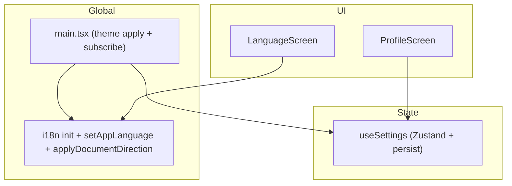
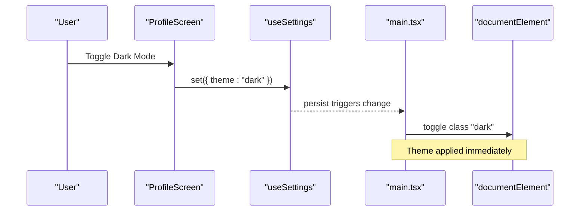
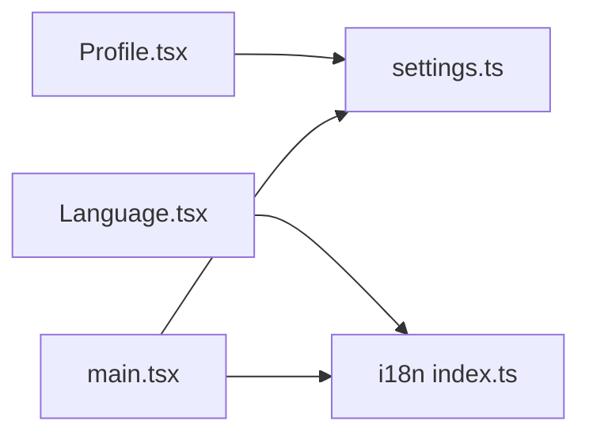

# User Settings & Preferences

<cite>
**Referenced Files in This Document**
- [settings.ts](file://src/lib/settings.ts)
- [main.tsx](file://src/main.tsx)
- [Profile.tsx](file://src/pages/Profile.tsx)
- [Language.tsx](file://src/pages/Language.tsx)
- [i18n index.ts](file://src/lib/i18n/index.ts)
- [en.json](file://src/lib/i18n/locales/en.json)
- [ur.json](file://src/lib/i18n/locales/ur.json)
</cite>

## Table of Contents
1. Introduction
2. Project Structure
3. Core Components
4. Architecture Overview
5. Detailed Component Analysis
6. Dependency Analysis
7. Performance Considerations
8. Troubleshooting Guide
9. Conclusion

## Introduction
This document explains the user settings and preferences system, focusing on:
- Zustand-based state management for app settings
- Persistent storage using localStorage via zustand/middleware persist
- Reactive updates to UI and global theme
- Available settings: theme (dark/light), sound, vibration, auto-actions (open URLs, copy text, connect Wi-Fi)
- Internationalization workflow with dynamic language switching and RTL support
- Validation, defaults, and migration strategies for setting changes
- Accessibility compliance and UX best practices for settings interfaces

## Project Structure
The settings system spans a small set of focused modules:
- State store and persistence: src/lib/settings.ts
- Global theme application and subscription: src/main.tsx
- Settings UI: src/pages/Profile.tsx
- Language selection UI: src/pages/Language.tsx
- i18n configuration and utilities: src/lib/i18n/index.ts
- Locale resources: src/lib/i18n/locales/*.json

**Diagram sources**
- [settings.ts:19-34](file://src/lib/settings.ts#L19-L34)
- [main.tsx:15-22](file://src/main.tsx#L15-L22)
- [Profile.tsx:26-40](file://src/pages/Profile.tsx#L26-L40)
- [Language.tsx:6-11](file://src/pages/Language.tsx#L6-L11)
- [i18n index.ts:57-95](file://src/lib/i18n/index.ts#L57-L95)

**Section sources**
- [settings.ts:1-34](file://src/lib/settings.ts#L1-L34)
- [main.tsx:1-23](file://src/main.tsx#L1-L23)
- [Profile.tsx:1-180](file://src/pages/Profile.tsx#L1-L180)
- [Language.tsx:1-68](file://src/pages/Language.tsx#L1-L68)
- [i18n index.ts:1-96](file://src/lib/i18n/index.ts#L1-L96)

## Core Components
- AppSettings model and default values:
  - Fields include onboarded, sound, vibrate, autoOpenUrls, autoCopyText, autoConnectWifi, theme
  - Defaults are defined centrally in the store initializer
- Store API:
  - set(patch): partial update of any setting
  - completeOnboarding(): marks onboarding as completed
- Persistence:
  - Persisted under key "scaniq-settings" in localStorage
- Theme reactivity:
  - main.tsx applies the persisted theme before first paint and subscribes to future changes to toggle the root class

Key responsibilities:
- Centralized source of truth for all user preferences
- Automatic persistence across sessions
- Immediate UI reaction to changes without manual refresh

**Section sources**
- [settings.ts:4-17](file://src/lib/settings.ts#L4-L17)
- [settings.ts:19-34](file://src/lib/settings.ts#L19-L34)
- [main.tsx:15-22](file://src/main.tsx#L15-L22)

## Architecture Overview
The system combines three layers:
- State layer: Zustand store with persist middleware
- Application layer: Profile and Language screens read/write settings
- Global layer: main.tsx applies theme; i18n module manages language and direction

**Diagram sources**
- [Profile.tsx:36-40](file://src/pages/Profile.tsx#L36-L40)
- [settings.ts:19-34](file://src/lib/settings.ts#L19-L34)
- [main.tsx:15-22](file://src/main.tsx#L15-L22)

## Detailed Component Analysis

### Zustand Settings Store
- Data model: AppSettings defines all preference keys and types
- Default values: Defined at store creation time
- Mutations:
  - set(patch): merges provided fields into current state
  - completeOnboarding(): sets onboarded flag
- Persistence:
  - Uses zustand/middleware persist with name "scaniq-settings"
  - Automatically serializes/deserializes state to/from localStorage

Complexity:
- O(1) reads/writes per field
- Storage operations are asynchronous but non-blocking from React perspective

Error handling:
- No explicit validation or sanitization is performed in the store
- Missing fields will be undefined until initialized by defaults

Migration strategy:
- When adding new fields, add them to the default object so they initialize safely
- For breaking changes, consider a versioned storage key or a migration function around persist

Accessibility:
- The store itself is not UI; accessibility is handled by components that consume it

**Section sources**
- [settings.ts:4-17](file://src/lib/settings.ts#L4-L17)
- [settings.ts:19-34](file://src/lib/settings.ts#L19-L34)

### Theme Management and Global Application
- Initial application:
  - Before first render, main.tsx reads the persisted theme and toggles the root element's class accordingly
- Reactive updates:
  - Subscribes to useSettings changes to keep the DOM in sync with state
- Consistency:
  - Ensures no flash of incorrect theme on load

Performance:
- Minimal overhead: one class toggle per change
- Avoids unnecessary re-renders by operating outside React tree

**Section sources**
- [main.tsx:15-22](file://src/main.tsx#L15-L22)

### Profile Screen (Settings UI)
- Reads current settings via useSettings
- Provides controls for:
  - Theme toggle (dark/light)
  - Sound and vibration toggles
  - Auto-open URLs, auto-copy text, auto-connect Wi-Fi
- Navigates to Language screen for language selection
- Uses localized labels via react-i18next

UX considerations:
- Clear grouping of related settings
- Immediate feedback via Switch components
- Accessible labels and icons

Validation:
- No server-side validation; relies on boolean switches ensuring valid values

**Section sources**
- [Profile.tsx:26-40](file://src/pages/Profile.tsx#L26-L40)
- [Profile.tsx:57-118](file://src/pages/Profile.tsx#L57-L118)

### Language Selection and RTL Support
- Displays supported languages with native and English labels
- On selection:
  - Calls setAppLanguage(code)
  - Persists choice to localStorage
  - Applies document direction (dir) and lang attributes
- Supports RTL languages (e.g., Urdu)

Internationalization workflow:
- i18n initialized with multiple locales
- Language detection order includes localStorage then navigator
- Fallback language configured

Dynamic switching:
- Changes apply instantly without reload
- Direction and lang attributes updated on documentElement

**Section sources**
- [Language.tsx:6-11](file://src/pages/Language.tsx#L6-L11)
- [i18n index.ts:57-95](file://src/lib/i18n/index.ts#L57-L95)

### i18n Configuration and Locales
- Supported languages list with metadata including code, englishLabel, nativeLabel, dir
- Resources map each language code to its translation JSON
- Detection and caching configured for smooth transitions
- Utility functions:
  - setAppLanguage(code): changes language, persists, applies direction
  - applyDocumentDirection(code): sets dir and lang on documentElement

Locale files:
- Example keys for profile and language sections exist in en.json and ur.json

**Section sources**
- [i18n index.ts:14-42](file://src/lib/i18n/index.ts#L14-L42)
- [i18n index.ts:57-95](file://src/lib/i18n/index.ts#L57-L95)
- [en.json:157-184](file://src/lib/i18n/locales/en.json#L157-L184)
- [ur.json:137-164](file://src/lib/i18n/locales/ur.json#L137-L164)

### Settings Validation, Defaults, and Migration Strategies
- Validation:
  - Current implementation does not validate inputs; rely on typed booleans and enum-like theme value
- Defaults:
  - All fields have sensible defaults in the store initializer
- Migration strategies:
  - New fields: add to default object to ensure safe initialization
  - Breaking changes:
    - Option A: Change persist name to trigger fresh defaults
    - Option B: Wrap persist with a migration function that transforms old data to new schema
  - Versioning:
    - Consider storing a version number alongside settings and applying migrations on load

[No sources needed since this section provides general guidance]

### Internationalization Workflow and Dynamic Language Switching
- Initialization:
  - Registers plugins for language detection and React integration
  - Loads only the current language to reduce bundle size
- Switching:
  - setAppLanguage updates i18n instance, persists choice, and applies document direction
- Directionality:
  - applyDocumentDirection maps language code to dir attribute and sets lang attribute

**Section sources**
- [i18n index.ts:57-95](file://src/lib/i18n/index.ts#L57-L95)

### Accessibility Compliance and UX Best Practices
- ARIA attributes:
  - Language options use aria-pressed to indicate selection state
  - Back navigation uses aria-label for screen readers
- Semantic structure:
  - Headings and lists provide clear hierarchy
- Visual clarity:
  - Selected state highlighted with distinct border/background
  - Native and English labels improve findability
- Keyboard navigation:
  - Buttons and links are focusable and operable via keyboard
- Color contrast and motion:
  - Ensure sufficient contrast for text and indicators
  - Respect reduced-motion preferences where applicable

**Section sources**
- [Language.tsx:33-40](file://src/pages/Language.tsx#L33-L40)
- [Language.tsx:16-22](file://src/pages/Language.tsx#L16-L22)

## Dependency Analysis

**Diagram sources**
- [Profile.tsx:26-40](file://src/pages/Profile.tsx#L26-L40)
- [Language.tsx:6-11](file://src/pages/Language.tsx#L6-L11)
- [main.tsx:15-22](file://src/main.tsx#L15-L22)
- [settings.ts:19-34](file://src/lib/settings.ts#L19-L34)
- [i18n index.ts:57-95](file://src/lib/i18n/index.ts#L57-L95)

**Section sources**
- [Profile.tsx:1-180](file://src/pages/Profile.tsx#L1-L180)
- [Language.tsx:1-68](file://src/pages/Language.tsx#L1-L68)
- [main.tsx:1-23](file://src/main.tsx#L1-L23)
- [settings.ts:1-34](file://src/lib/settings.ts#L1-L34)
- [i18n index.ts:1-96](file://src/lib/i18n/index.ts#L1-L96)

## Performance Considerations
- Zustand subscriptions are lightweight; only affected components re-render
- Persist middleware writes to localStorage asynchronously; avoid frequent bulk updates
- Theme application operates outside React tree to minimize re-renders
- i18n loads only the current language to reduce initial payload

[No sources needed since this section provides general guidance]

## Troubleshooting Guide
Common issues and resolutions:
- Theme not applied on first load:
  - Ensure main.tsx runs before rendering and subscribes to settings changes
- Language not persisting:
  - Verify setAppLanguage writes to localStorage and applyDocumentDirection is called
- RTL layout not applied:
  - Confirm applyDocumentDirection sets dir and lang attributes on documentElement
- Settings reset after browser clear:
  - Expected behavior due to localStorage dependency; consider fallback defaults if needed

**Section sources**
- [main.tsx:15-22](file://src/main.tsx#L15-L22)
- [i18n index.ts:74-90](file://src/lib/i18n/index.ts#L74-L90)

## Conclusion
The settings system is simple, robust, and reactive:
- Centralized Zustand store with persistence ensures consistency across sessions
- Global theme application prevents visual glitches
- i18n supports dynamic switching and RTL layouts
- Extensible design allows easy addition of new settings and migration strategies
- Accessibility-friendly UI enhances usability for all users

[No sources needed since this section summarizes without analyzing specific files]