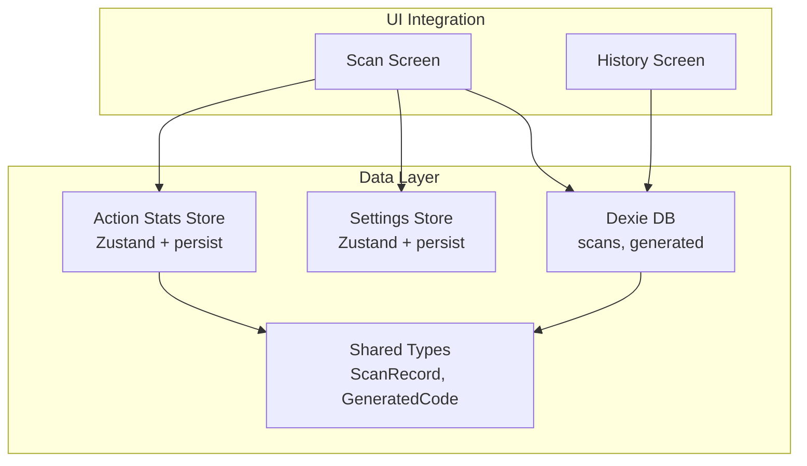
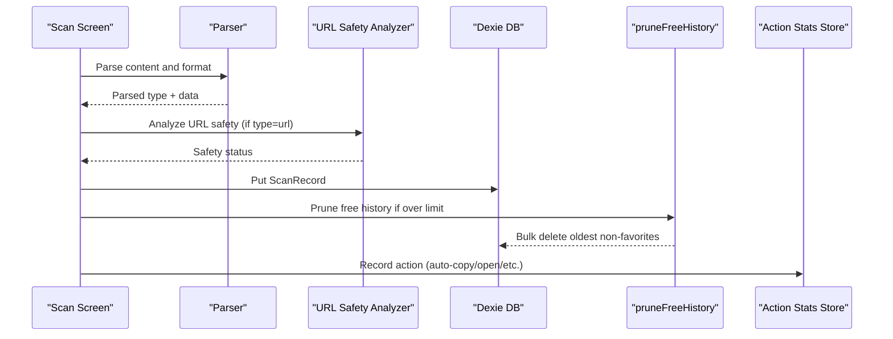
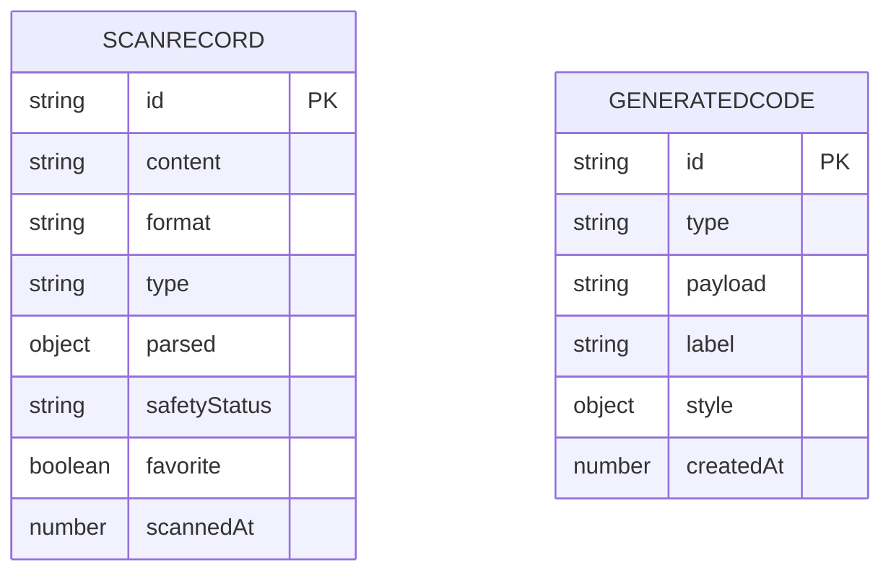
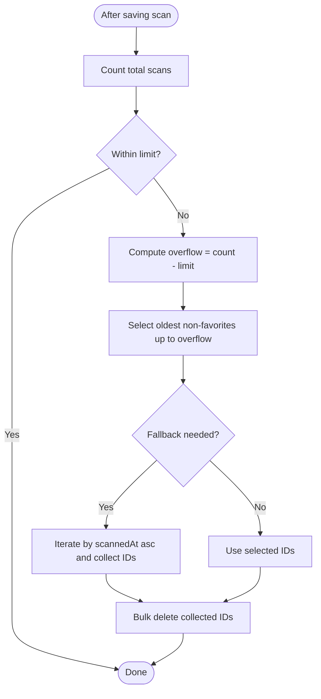
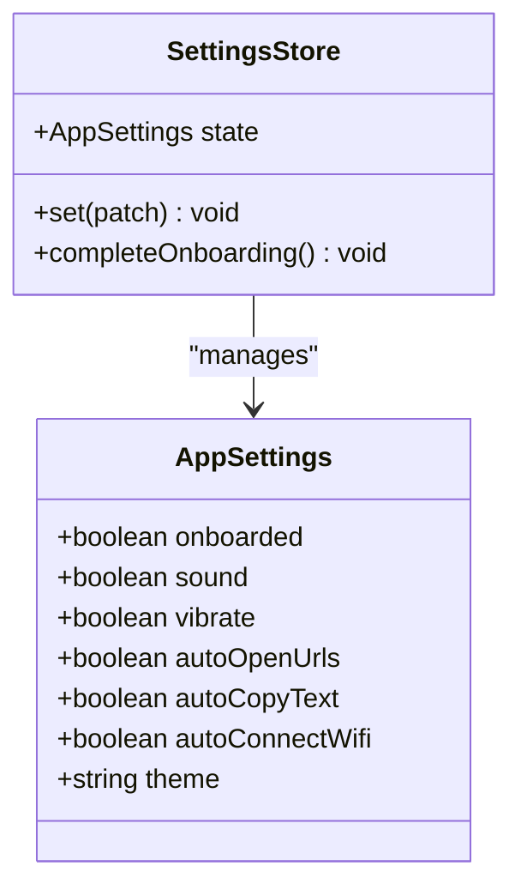
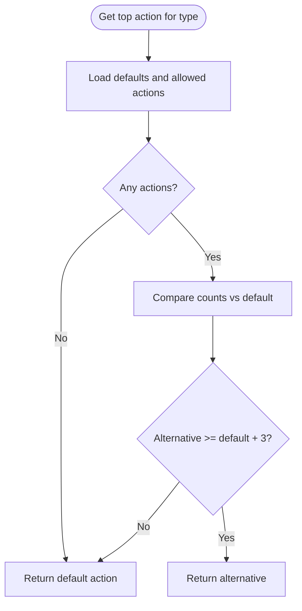
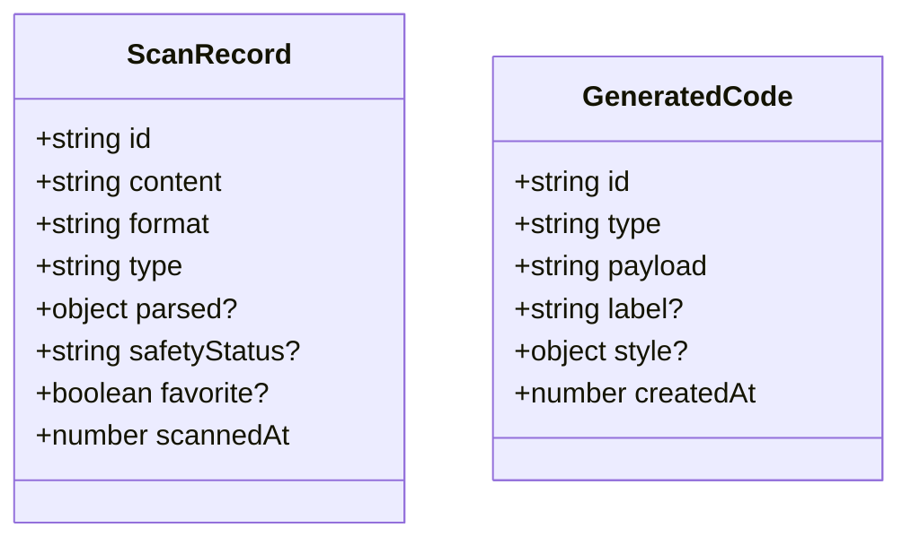
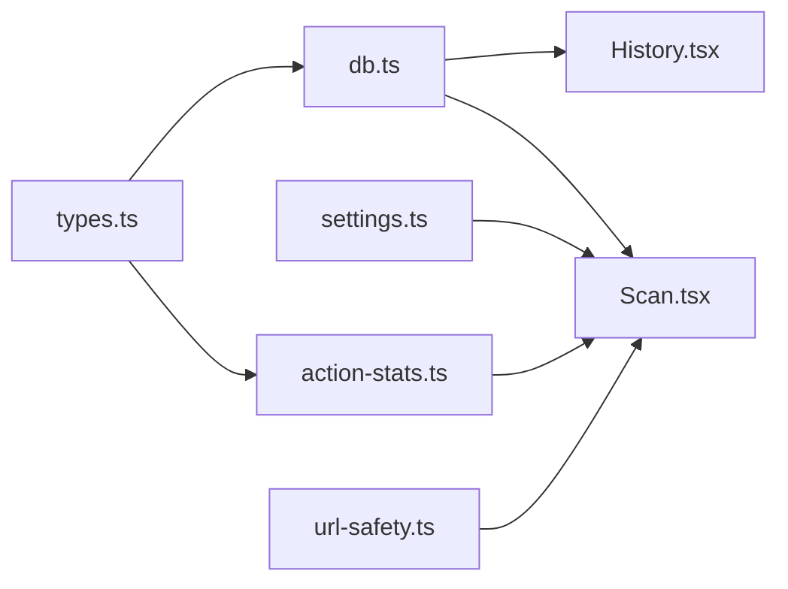

# Data Management

<cite>
**Referenced Files in This Document**
- [db.ts](file://src/lib/db.ts)
- [types.ts](file://src/lib/scan/types.ts)
- [settings.ts](file://src/lib/settings.ts)
- [action-stats.ts](file://src/lib/action-stats.ts)
- [Scan.tsx](file://src/pages/Scan.tsx)
- [History.tsx](file://src/pages/History.tsx)
- [url-safety.ts](file://src/lib/url-safety.ts)
</cite>

## Table of Contents
1. [Introduction](#introduction)
2. [Project Structure](#project-structure)
3. [Core Components](#core-components)
4. [Architecture Overview](#architecture-overview)
5. [Detailed Component Analysis](#detailed-component-analysis)
6. [Dependency Analysis](#dependency-analysis)
7. [Performance Considerations](#performance-considerations)
8. [Troubleshooting Guide](#troubleshooting-guide)
9. [Conclusion](#conclusion)
10. [Appendices](#appendices)

## Introduction
This document describes the data layer of Smart Scan Pro with a focus on IndexedDB schema design using Dexie ORM, entity relationships, field definitions, validation rules, repository-style access patterns, lifecycle management (including automatic cleanup), settings persistence and reactive updates, migration/versioning considerations, performance optimization techniques, and security/privacy requirements. It synthesizes implementation details from the codebase to provide both conceptual clarity and actionable guidance for maintainers and contributors.

## Project Structure
The data layer is implemented across a small set of focused modules:
- Database schema and operations: Dexie-based database class and helper utilities
- Domain types: Shared TypeScript types for scan records and generated codes
- Settings store: Persistent user preferences via Zustand + persist middleware
- Action statistics: Persistent usage analytics for recommended actions
- UI integration: Pages that read/write data and drive reactive UI updates

**Diagram sources**
- [db.ts:4-17](file://src/lib/db.ts#L4-L17)
- [types.ts:30-48](file://src/lib/scan/types.ts#L30-L48)
- [settings.ts:19-34](file://src/lib/settings.ts#L19-L34)
- [action-stats.ts:45-80](file://src/lib/action-stats.ts#L45-L80)
- [Scan.tsx:50-102](file://src/pages/Scan.tsx#L50-L102)
- [History.tsx:40-60](file://src/pages/History.tsx#L40-L60)

**Section sources**
- [db.ts:4-17](file://src/lib/db.ts#L4-L17)
- [types.ts:30-48](file://src/lib/scan/types.ts#L30-L48)
- [settings.ts:19-34](file://src/lib/settings.ts#L19-L34)
- [action-stats.ts:45-80](file://src/lib/action-stats.ts#L45-L80)
- [Scan.tsx:50-102](file://src/pages/Scan.tsx#L50-L102)
- [History.tsx:40-60](file://src/pages/History.tsx#L40-L60)

## Core Components
This section documents the primary data entities, their fields, types, and constraints as defined by the application’s shared types and Dexie schema.

### Entities and Fields
- ScanRecord
  - id: string (primary key)
  - content: string
  - format: enum-like string (e.g., QR_CODE, EAN_13, UNKNOWN)
  - type: enum-like string (e.g., url, wifi, vcard, email, sms, phone, geo, product, text, payment)
  - parsed?: object (optional structured parse result)
  - safetyStatus?: enum-like string (unchecked, safe, suspicious, malicious)
  - favorite?: boolean
  - scannedAt: number (epoch milliseconds)
- GeneratedCode
  - id: string (primary key)
  - type: enum-like string (same domain as ScanRecord.type)
  - payload: string
  - label?: string
  - style?: object (fg/bg color hints)
  - createdAt: number (epoch milliseconds)

These types are used to strongly-type Dexie tables and ensure consistent data shapes across the app.

**Section sources**
- [types.ts:30-48](file://src/lib/scan/types.ts#L30-L48)

### Dexie Schema Design
- Database name: “scaniq”
- Tables and indexes:
  - scans: indexed by id, scannedAt, type, format, favorite, content
  - generated: indexed by id, createdAt, type
- Versioning:
  - Declared version 1 with stores mapping; future migrations should increment version and add upgrade steps as needed.

Notes:
- The scans table includes an index on favorite to support filtering favorites efficiently.
- The scans table includes an index on scannedAt to support time-ordered queries and pruning.
- The scans table includes an index on content to support search/filtering by substring.

**Section sources**
- [db.ts:8-14](file://src/lib/db.ts#L8-L14)

### Repository Pattern and Data Access Patterns
While there is no explicit repository abstraction, the codebase follows a clear pattern:
- Centralized database instance exported from the database module
- Direct table access from components and services (e.g., db.scans.put, db.scans.delete, useLiveQuery)
- Helper functions encapsulate complex operations (e.g., pruneFreeHistory)

Recommended evolution:
- Introduce a thin repository layer to centralize CRUD operations, transactions, and error handling
- Expose typed methods like saveScan(record), deleteScan(id), getRecentScans(limit), etc.
- Keep Dexie internals hidden behind repository interfaces to simplify testing and future migration

Current usage examples:
- Insert/update scan record: db.scans.put(record)
- Delete single record: db.scans.delete(id)
- Clear all records: db.scans.clear()
- Live query: useLiveQuery(() => db.scans.orderBy("scannedAt").reverse().toArray(), [])

**Section sources**
- [db.ts:17-36](file://src/lib/db.ts#L17-L36)
- [Scan.tsx:70-71](file://src/pages/Scan.tsx#L70-L71)
- [History.tsx:40-60](file://src/pages/History.tsx#L40-L60)

## Architecture Overview
The data architecture centers around Dexie for persistent storage and Zustand with persist middleware for lightweight local state.

**Diagram sources**
- [Scan.tsx:50-102](file://src/pages/Scan.tsx#L50-L102)
- [db.ts:21-36](file://src/lib/db.ts#L21-L36)
- [url-safety.ts:31-105](file://src/lib/url-safety.ts#L31-L105)
- [action-stats.ts:45-80](file://src/lib/action-stats.ts#L45-L80)

## Detailed Component Analysis

### IndexedDB Schema and Indexes
- Primary keys:
  - scans.id
  - generated.id
- Secondary indexes:
  - scans: scannedAt, type, format, favorite, content
  - generated: createdAt, type
- Implications:
  - Efficient ordering by scannedAt for recent-first lists
  - Fast filtering by favorite and type
  - Substring search on content supported by browser indexing behavior

**Diagram sources**
- [types.ts:30-48](file://src/lib/scan/types.ts#L30-L48)
- [db.ts:10-13](file://src/lib/db.ts#L10-L13)

**Section sources**
- [db.ts:10-13](file://src/lib/db.ts#L10-L13)
- [types.ts:30-48](file://src/lib/scan/types.ts#L30-L48)

### Data Lifecycle Management and Automatic Cleanup
- On each successful scan:
  - A ScanRecord is inserted or updated
  - Free history pruning runs asynchronously to enforce a limit
- Pruning policy:
  - If total scans exceed a configured limit, remove the oldest non-favorite entries until within the limit
  - Uses ordered traversal by scannedAt and bulk deletion for efficiency

**Diagram sources**
- [db.ts:21-36](file://src/lib/db.ts#L21-L36)

**Section sources**
- [db.ts:21-36](file://src/lib/db.ts#L21-L36)
- [Scan.tsx:70-71](file://src/pages/Scan.tsx#L70-L71)

### Settings Management System
- State shape:
  - onboarded: boolean
  - sound: boolean
  - vibrate: boolean
  - autoOpenUrls: boolean
  - autoCopyText: boolean
  - autoConnectWifi: boolean
  - theme: "dark" | "light"
- Persistence:
  - Zustand store persisted under a dedicated key
- Reactive updates:
  - Consumers subscribe to changes automatically via Zustand hooks
- Usage in scanning flow:
  - Auto-copy text when enabled
  - Auto-open URLs when safe and enabled
  - Auto-copy Wi-Fi password when enabled

**Diagram sources**
- [settings.ts:4-17](file://src/lib/settings.ts#L4-L17)
- [settings.ts:19-34](file://src/lib/settings.ts#L19-L34)

**Section sources**
- [settings.ts:4-17](file://src/lib/settings.ts#L4-L17)
- [settings.ts:19-34](file://src/lib/settings.ts#L19-L34)
- [Scan.tsx:74-97](file://src/pages/Scan.tsx#L74-L97)

### Action Statistics and Recommendations
- Purpose:
  - Track user actions per content type to recommend a primary action
- Storage:
  - Counts map persisted under a dedicated key
- Recommendation logic:
  - Default primary action per type
  - Override default only if alternative action has been used at least three more times than the default
- Integration:
  - Actions recorded automatically for certain flows (e.g., copy, open_url, copy_password)

**Diagram sources**
- [action-stats.ts:10-21](file://src/lib/action-stats.ts#L10-L21)
- [action-stats.ts:55-76](file://src/lib/action-stats.ts#L55-L76)

**Section sources**
- [action-stats.ts:10-21](file://src/lib/action-stats.ts#L10-L21)
- [action-stats.ts:45-80](file://src/lib/action-stats.ts#L45-L80)
- [Scan.tsx:78-97](file://src/pages/Scan.tsx#L78-L97)

### Data Validation Rules
- Type-level validation:
  - Enum-like string unions constrain format, type, and safetyStatus values
- Optional fields:
  - parsed and safetyStatus are optional to allow flexible parsing and deferred analysis
- Business rules:
  - Safety analysis applied only for URL-type scans
  - Favorite flag influences pruning behavior

**Diagram sources**
- [types.ts:30-48](file://src/lib/scan/types.ts#L30-L48)

**Section sources**
- [types.ts:30-48](file://src/lib/scan/types.ts#L30-L48)
- [url-safety.ts:31-105](file://src/lib/url-safety.ts#L31-L105)

### Data Migration Paths and Version Management
- Current state:
  - Database version declared once with initial stores
- Recommended approach:
  - Increment version and define upgrade steps to add/remove indexes or transform records
  - Example pattern: this.version(2).stores({...}).upgrade(tx => {...})
  - Ensure backward compatibility for existing records during upgrades

[No sources needed since this section provides general guidance]

### Backup Strategies
- Local-only storage:
  - All data resides in IndexedDB and localStorage-backed Zustand stores
- Export/import opportunities:
  - Implement export of scans and generated codes as JSON
  - Provide import functionality to restore from backups
- Browser storage:
  - Users can rely on browser data retention policies; consider prompting users to export periodically

[No sources needed since this section provides general guidance]

## Dependency Analysis
The following diagram shows how data-related modules depend on each other and where they are consumed by UI components.

**Diagram sources**
- [types.ts:30-48](file://src/lib/scan/types.ts#L30-L48)
- [db.ts:4-17](file://src/lib/db.ts#L4-L17)
- [action-stats.ts:45-80](file://src/lib/action-stats.ts#L45-L80)
- [settings.ts:19-34](file://src/lib/settings.ts#L19-L34)
- [url-safety.ts:31-105](file://src/lib/url-safety.ts#L31-L105)
- [Scan.tsx:50-102](file://src/pages/Scan.tsx#L50-L102)
- [History.tsx:40-60](file://src/pages/History.tsx#L40-L60)

**Section sources**
- [db.ts:4-17](file://src/lib/db.ts#L4-L17)
- [types.ts:30-48](file://src/lib/scan/types.ts#L30-L48)
- [settings.ts:19-34](file://src/lib/settings.ts#L19-L34)
- [action-stats.ts:45-80](file://src/lib/action-stats.ts#L45-L80)
- [url-safety.ts:31-105](file://src/lib/url-safety.ts#L31-L105)
- [Scan.tsx:50-102](file://src/pages/Scan.tsx#L50-L102)
- [History.tsx:40-60](file://src/pages/History.tsx#L40-L60)

## Performance Considerations
- Index utilization:
  - Queries order by scannedAt and filter by favorite/content leverage indexes
- Batch operations:
  - Bulk delete used in pruning reduces transaction overhead
- Live queries:
  - useLiveQuery enables efficient reactivity without manual polling
- Avoid heavy payloads:
  - Keep parsed objects concise; avoid storing large binary blobs in IndexedDB
- Debounce/throttle:
  - For high-frequency writes (e.g., frequent scans), consider batching or debouncing writes to reduce churn

[No sources needed since this section provides general guidance]

## Troubleshooting Guide
Common issues and remedies:
- Storage failures:
  - Errors during write operations are caught and surfaced to the user
- Camera permission errors:
  - Permission denied states are detected and handled with appropriate overlays and guidance
- Pruning not reducing size:
  - Verify favorite flags and scannedAt ordering; ensure pruning function is invoked after successful saves

Operational references:
- Error handling around scan result processing and storage
- History screen operations for deleting/clearing records

**Section sources**
- [Scan.tsx:98-101](file://src/pages/Scan.tsx#L98-L101)
- [History.tsx:52-60](file://src/pages/History.tsx#L52-L60)

## Conclusion
Smart Scan Pro’s data layer combines a lean Dexie schema with straightforward repository-style access, robust settings persistence, and simple yet effective analytics for action recommendations. The current design emphasizes simplicity and performance through targeted indexes and live queries. Future enhancements could include a formal repository abstraction, explicit migration strategies, and export/import capabilities for backup and portability.

[No sources needed since this section summarizes without analyzing specific files]

## Appendices

### Security and Privacy Considerations
- Local-only data:
  - Scans, generated codes, settings, and stats are stored locally in the browser
- URL safety:
  - Built-in heuristics analyze URLs for risky characteristics before auto-opening
- User control:
  - Settings allow toggling auto behaviors (copy, open, connect Wi-Fi)
- Data minimization:
  - Only necessary fields are persisted; optional fields remain absent unless populated

**Section sources**
- [url-safety.ts:31-105](file://src/lib/url-safety.ts#L31-L105)
- [settings.ts:4-17](file://src/lib/settings.ts#L4-L17)
- [Scan.tsx:74-97](file://src/pages/Scan.tsx#L74-L97)