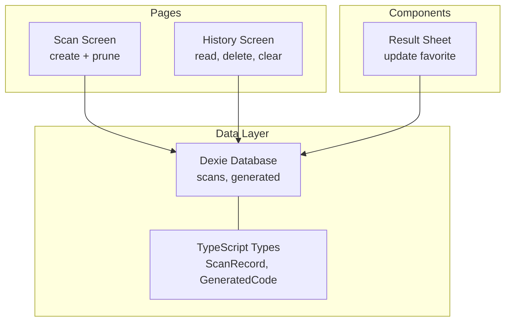
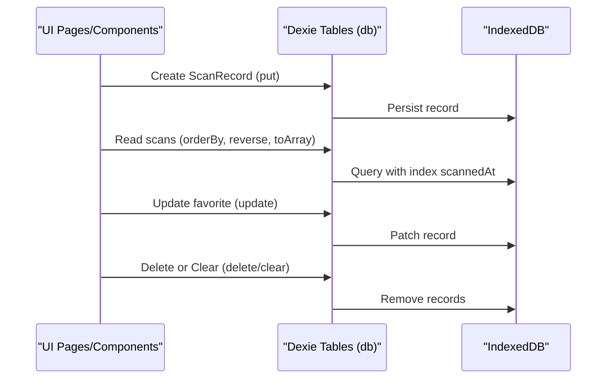
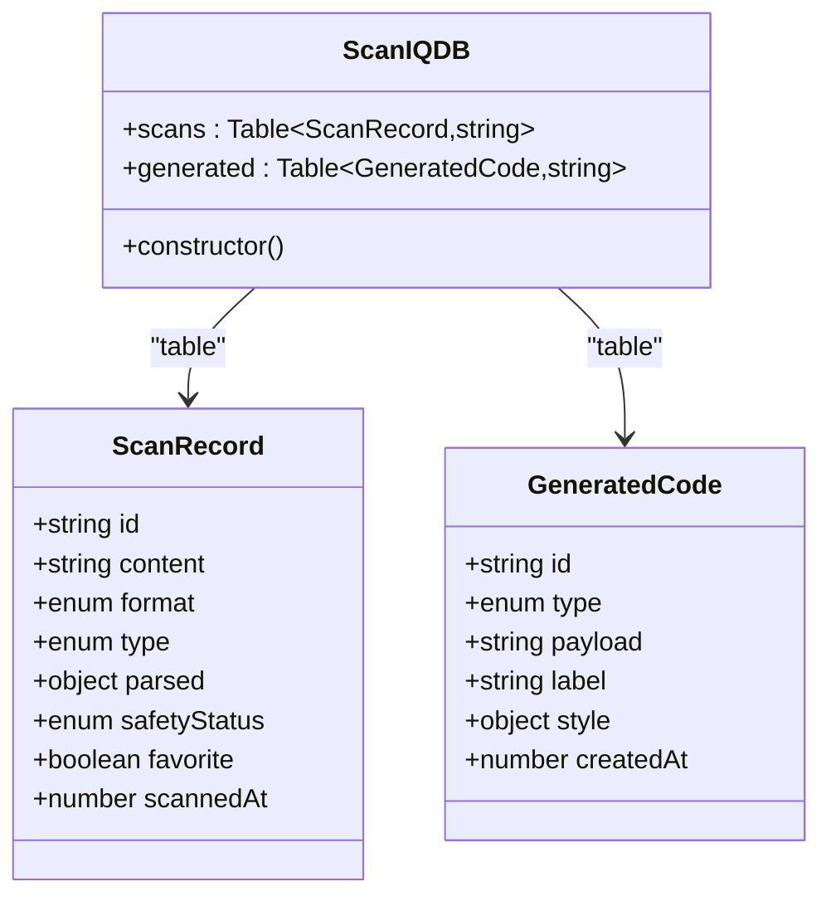
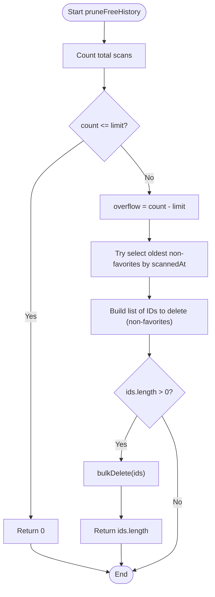
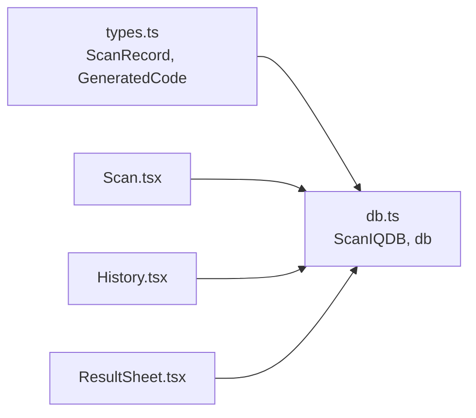

# Data Operations

<cite>
**Referenced Files in This Document**
- [db.ts](file://src/lib/db.ts)
- [types.ts](file://src/lib/scan/types.ts)
- [Scan.tsx](file://src/pages/Scan.tsx)
- [History.tsx](file://src/pages/History.tsx)
- [ResultSheet.tsx](file://src/components/ResultSheet.tsx)
</cite>

## Table of Contents
1. [Introduction](#introduction)
2. [Project Structure](#project-structure)
3. [Core Components](#core-components)
4. [Architecture Overview](#architecture-overview)
5. [Detailed Component Analysis](#detailed-component-analysis)
6. [Dependency Analysis](#dependency-analysis)
7. [Performance Considerations](#performance-considerations)
8. [Troubleshooting Guide](#troubleshooting-guide)
9. [Conclusion](#conclusion)

## Introduction
This document explains the data access patterns and database operations in Smart Scan Pro, focusing on how scan records and generated codes are persisted and queried using a repository-style layer built on Dexie (IndexedDB). It covers create, read, update, and delete operations for scans and generated codes, the automatic history pruning system governed by FREE_HISTORY_LIMIT, query optimization techniques, bulk operations, transaction handling, error handling strategies, retry mechanisms, performance monitoring, validation rules, constraint enforcement, and practical examples for common and advanced scenarios.

## Project Structure
The data layer is centered around a single Dexie database instance with two tables: scans and generated. The application pages and components interact with this layer to perform CRUD operations and live queries.

**Diagram sources**
- [db.ts:4-17](file://src/lib/db.ts#L4-L17)
- [types.ts:30-48](file://src/lib/scan/types.ts#L30-L48)
- [Scan.tsx:60-72](file://src/pages/Scan.tsx#L60-L72)
- [History.tsx:40-60](file://src/pages/History.tsx#L40-L60)
- [ResultSheet.tsx:157](file://src/components/ResultSheet.tsx#L157)

**Section sources**
- [db.ts:4-17](file://src/lib/db.ts#L4-L17)
- [types.ts:30-48](file://src/lib/scan/types.ts#L30-L48)
- [Scan.tsx:60-72](file://src/pages/Scan.tsx#L60-L72)
- [History.tsx:40-60](file://src/pages/History.tsx#L40-L60)
- [ResultSheet.tsx:157](file://src/components/ResultSheet.tsx#L157)

## Core Components
- Database class and instance: A Dexie subclass defines the schema and indexes for scans and generated tables. An exported singleton db provides typed table access.
- Data models: TypeScript interfaces define the shape of ScanRecord and GeneratedCode, including fields used as indexes and filters.
- Pruning utility: A function enforces a free-tier history limit by removing oldest non-favorite scans when over the threshold.

Key responsibilities:
- Define schema and indexes for efficient querying.
- Provide typed access to tables for all CRUD operations.
- Enforce storage limits via pruning logic.

**Section sources**
- [db.ts:4-17](file://src/lib/db.ts#L4-L17)
- [types.ts:30-48](file://src/lib/scan/types.ts#L30-L48)
- [db.ts:19-36](file://src/lib/db.ts#L19-L36)

## Architecture Overview
The data flow follows a simple repository pattern: UI layers call methods on the Dexie tables directly through the exported db instance. Scanning creates records; history reads and deletes them; result sheet updates favorites.

**Diagram sources**
- [Scan.tsx:60-72](file://src/pages/Scan.tsx#L60-L72)
- [History.tsx:40-60](file://src/pages/History.tsx#L40-L60)
- [ResultSheet.tsx:157](file://src/components/ResultSheet.tsx#L157)
- [db.ts:4-17](file://src/lib/db.ts#L4-L17)

## Detailed Component Analysis

### Repository Pattern Implementation
The repository layer is implemented by direct usage of Dexie tables exposed via the db singleton. Each table corresponds to an entity:
- scans: stores ScanRecord entries with indexes on id, scannedAt, type, format, favorite, content.
- generated: stores GeneratedCode entries with indexes on id, createdAt, type.

Operations observed across the codebase:
- Create: Insert new scan records using put.
- Read: Live queries using orderBy and reverse, plus client-side filtering.
- Update: Toggle favorite status using update.
- Delete: Single delete and full clear.

**Diagram sources**
- [db.ts:4-17](file://src/lib/db.ts#L4-L17)
- [types.ts:30-48](file://src/lib/scan/types.ts#L30-L48)

**Section sources**
- [db.ts:4-17](file://src/lib/db.ts#L4-L17)
- [types.ts:30-48](file://src/lib/scan/types.ts#L30-L48)
- [Scan.tsx:60-72](file://src/pages/Scan.tsx#L60-L72)
- [History.tsx:40-60](file://src/pages/History.tsx#L40-L60)
- [ResultSheet.tsx:157](file://src/components/ResultSheet.tsx#L157)

### Automatic History Pruning System
The pruning system ensures that the number of stored scan records does not exceed a configurable limit for free users. The key elements:
- Configuration constant: FREE_HISTORY_LIMIT defines the maximum allowed scans.
- Function: pruneFreeHistory(limit) calculates overflow and removes the oldest non-favorite scans to bring the count within the limit.

Algorithm overview:
- Count current scans.
- If under or equal to limit, return without changes.
- Compute overflow = count - limit.
- Attempt to select oldest non-favorites using indexed queries.
- Fallback: iterate ordered by scannedAt ascending, collect IDs of non-favorites until overflow reached.
- Bulk delete collected IDs.
- Return number of deleted items.

**Diagram sources**
- [db.ts:19-36](file://src/lib/db.ts#L19-L36)

**Section sources**
- [db.ts:19-36](file://src/lib/db.ts#L19-L36)
- [Scan.tsx:70-72](file://src/pages/Scan.tsx#L70-L72)

### Query Optimization Techniques
- Indexes: The schema declares indexes on frequently filtered/sorted fields such as scannedAt, type, format, favorite, and content. These enable efficient ordering and filtering.
- Live queries: useLiveQuery subscribes to changes and re-renders automatically, avoiding manual refresh logic.
- Ordered retrieval: orderBy("scannedAt").reverse().toArray() leverages the scannedAt index for fast sorting and pagination-friendly iteration.
- Client-side filtering: After fetching, additional filters (e.g., favorites tab, text search) are applied in memory for simplicity and responsiveness.

Practical examples:
- List all scans newest first: order by scannedAt descending.
- Filter favorites: filter results where favorite is true.
- Search by content: case-insensitive substring match on content.

**Section sources**
- [db.ts:10-13](file://src/lib/db.ts#L10-L13)
- [History.tsx:40-50](file://src/pages/History.tsx#L40-L50)

### Bulk Operations
- Bulk delete: Used in pruning to remove multiple oldest non-favorite records efficiently.
- Clear all: Removes all scans at once from the scans table.

Use cases:
- Pruning excess history beyond the configured limit.
- User-initiated clearing of entire history.

**Section sources**
- [db.ts:34](file://src/lib/db.ts#L34)
- [History.tsx:57-60](file://src/pages/History.tsx#L57-L60)

### Transaction Handling
- Dexie transactions are implicit per operation unless explicitly wrapped. For atomic multi-step writes (e.g., creating a scan and updating related metadata), wrap operations in a Dexie transaction to ensure consistency.
- Example pattern: Use db.transaction('rw', db.scans, ...).write(() => {...}) to group multiple writes atomically.

Recommendation:
- When performing combined write operations (e.g., insert scan and update action stats), prefer explicit transactions to avoid partial failures.

[No sources needed since this section provides general guidance]

### Error Handling Strategies
- Localized user feedback: Errors during scanning or storage trigger toast notifications with localized messages.
- Graceful fallbacks: Prune errors are caught and ignored to avoid disrupting the main flow.
- Camera permission and device availability checks prevent runtime errors and guide users to resolve issues.

Examples:
- Storage failure toast after failed put.
- Ignoring prune errors to keep scanning responsive.

**Section sources**
- [Scan.tsx:98-101](file://src/pages/Scan.tsx#L98-L101)
- [Scan.tsx:70-72](file://src/pages/Scan.tsx#L70-L72)

### Retry Mechanisms
- Camera restart: Visibility change and retry button allow restarting camera sessions when permissions are denied or devices become unavailable.
- Operation retries: For transient storage errors, consider wrapping critical writes in a retry loop with exponential backoff before surfacing errors.

Example approach:
- Wrap db.scans.put(record) in a retry helper that attempts N times with delays, then falls back to user notification.

[No sources needed since this section provides general guidance]

### Performance Monitoring
- Dexie provides hooks for performance insights (e.g., transaction timing). Integrate metrics collection around heavy operations like bulk deletions or large queries.
- Monitor IndexedDB quota usage to proactively warn users before hitting storage limits.

Suggested practices:
- Log transaction durations for critical paths.
- Track counts of scans and generated codes to inform pruning thresholds.

[No sources needed since this section provides general guidance]

### Data Validation Rules, Constraint Enforcement, and Integrity Checks
- Type safety: TypeScript interfaces enforce field shapes and enum values for ScanRecord and GeneratedCode.
- Schema constraints: Dexie indexes ensure efficient lookups; unique constraints can be added if required (e.g., unique id).
- Content integrity: Parsed data includes optional fields like parsed and safetyStatus; ensure these are populated consistently before persistence.

Validation recommendations:
- Validate content length and format before insertion.
- Normalize timestamps (epoch ms) and ensure scannedAt is set.
- Ensure id uniqueness (UUID recommended).

**Section sources**
- [types.ts:30-48](file://src/lib/scan/types.ts#L30-L48)
- [db.ts:10-13](file://src/lib/db.ts#L10-L13)
- [Scan.tsx:60-72](file://src/pages/Scan.tsx#L60-L72)

### Practical Examples

Common operations:
- Create a scan record:
  - Path: [Create scan:60-72](file://src/pages/Scan.tsx#L60-L72)
- Read scans (live):
  - Path: [List scans:40-40](file://src/pages/History.tsx#L40-L40)
- Update favorite:
  - Path: [Toggle favorite](file://src/components/ResultSheet.tsx#L157)
- Delete a scan:
  - Path: [Delete scan:52-55](file://src/pages/History.tsx#L52-L55)
- Clear all scans:
  - Path: [Clear all:57-60](file://src/pages/History.tsx#L57-L60)
- Prune free history:
  - Path: [Prune function:21-36](file://src/lib/db.ts#L21-L36)

Advanced querying scenarios:
- Filter by type and sort by time:
  - Use db.scans.where("type").equals(type).sortBy("scannedAt")
- Search by content substring:
  - Fetch with orderBy("content").toArray() and apply client-side filter
- Paginated reads:
  - Use limit(n).offset(m) on ordered queries

[No sources needed since this section provides general guidance]

## Dependency Analysis
The data layer depends on Dexie and TypeScript types. UI components depend on the db singleton and specific table methods.

**Diagram sources**
- [types.ts:30-48](file://src/lib/scan/types.ts#L30-L48)
- [db.ts:4-17](file://src/lib/db.ts#L4-L17)
- [Scan.tsx:60-72](file://src/pages/Scan.tsx#L60-L72)
- [History.tsx:40-60](file://src/pages/History.tsx#L40-L60)
- [ResultSheet.tsx:157](file://src/components/ResultSheet.tsx#L157)

**Section sources**
- [types.ts:30-48](file://src/lib/scan/types.ts#L30-L48)
- [db.ts:4-17](file://src/lib/db.ts#L4-L17)
- [Scan.tsx:60-72](file://src/pages/Scan.tsx#L60-L72)
- [History.tsx:40-60](file://src/pages/History.tsx#L40-L60)
- [ResultSheet.tsx:157](file://src/components/ResultSheet.tsx#L157)

## Performance Considerations
- Prefer indexed queries: Use orderBy and where clauses on indexed fields (scannedAt, type, format, favorite, content).
- Minimize client-side filtering: Fetch only necessary subsets and filter server-side (or Dexie side) when possible.
- Batch writes: Use bulk operations for pruning and batch imports.
- Avoid unnecessary re-renders: Leverage useLiveQuery to subscribe to specific queries rather than polling.

[No sources needed since this section provides general guidance]

## Troubleshooting Guide
- Storage failures:
  - Symptom: Toast indicating storage failed after scanning.
  - Action: Check IndexedDB availability and quota; retry write; notify user.
- Pruning errors:
  - Behavior: Errors are caught and ignored to maintain scanning UX.
  - Action: Inspect logs; verify indexes and data integrity.
- Camera-related issues:
  - Permission denied or device unavailable states are handled with overlays and retry options.
  - Action: Guide users to grant permissions or switch to image/manual input.

**Section sources**
- [Scan.tsx:98-101](file://src/pages/Scan.tsx#L98-L101)
- [Scan.tsx:70-72](file://src/pages/Scan.tsx#L70-L72)

## Conclusion
Smart Scan Pro implements a straightforward repository pattern using Dexie for local persistence. The design emphasizes indexed queries, live subscriptions, and efficient bulk operations. The automatic pruning system maintains storage hygiene for free users. By following the recommended validation, transaction, retry, and monitoring practices, the application can remain robust and performant under varying usage patterns.