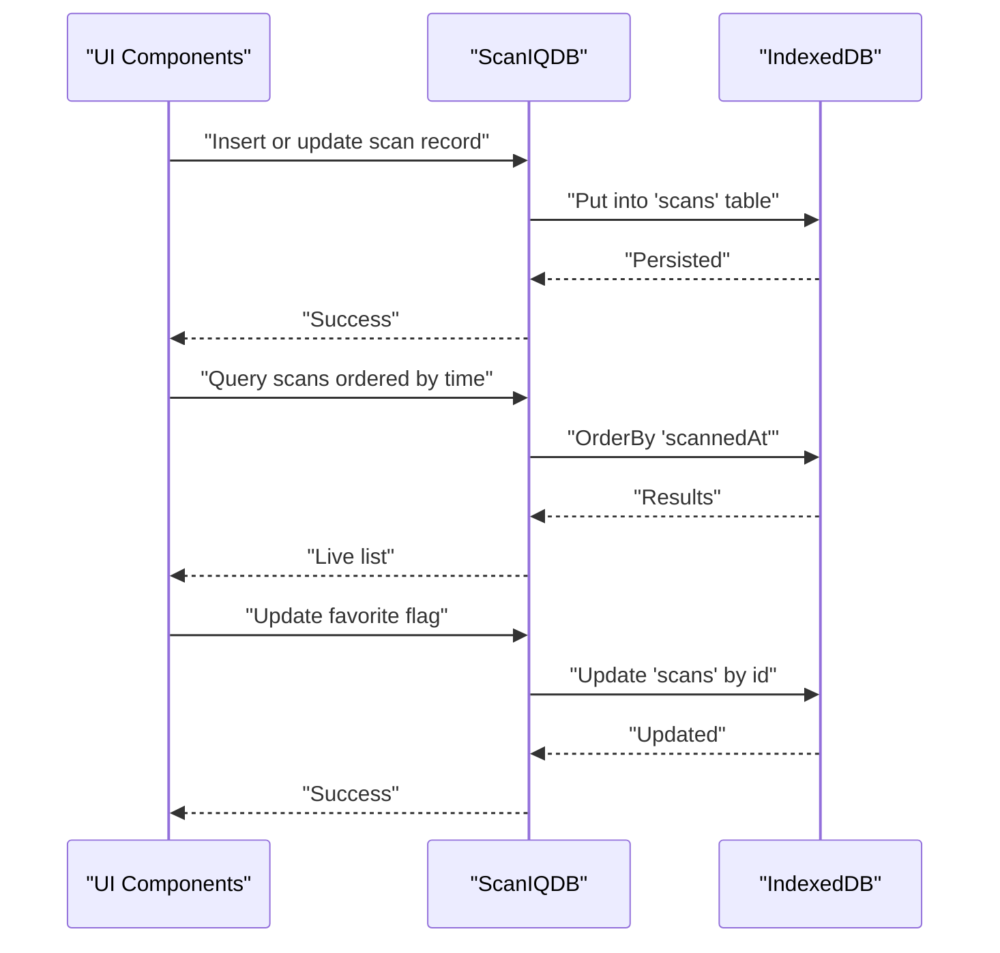
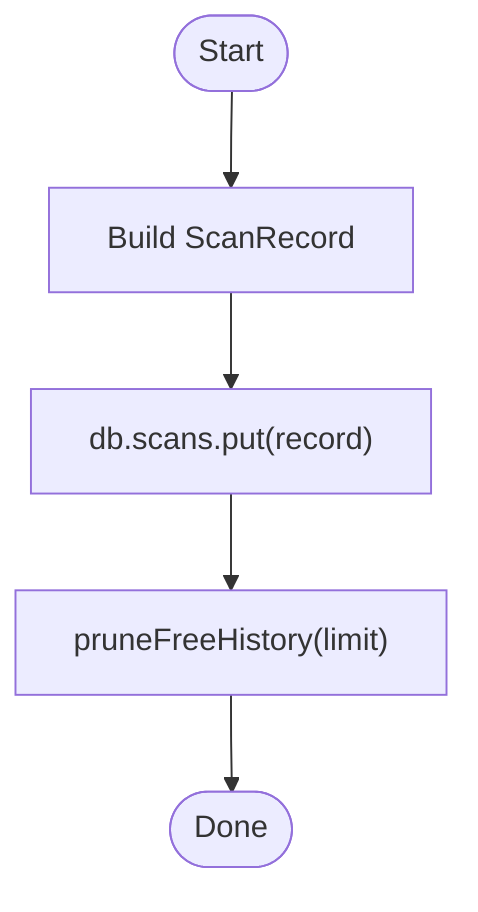
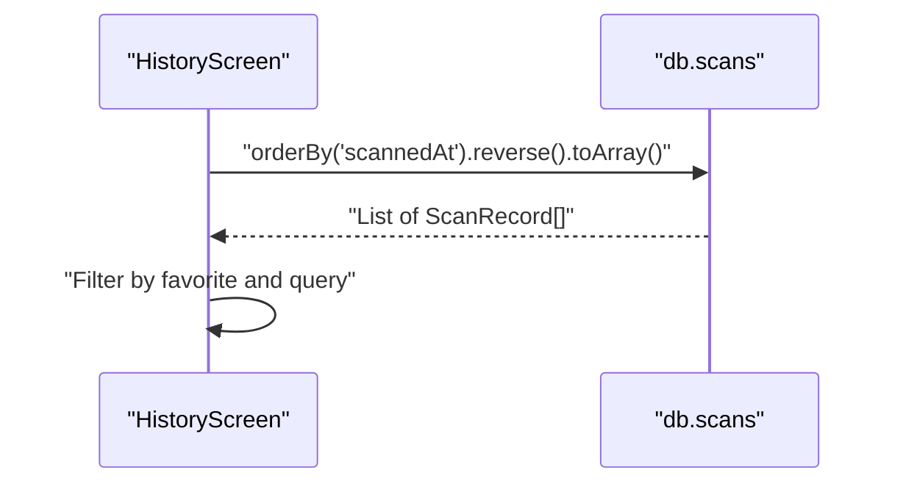
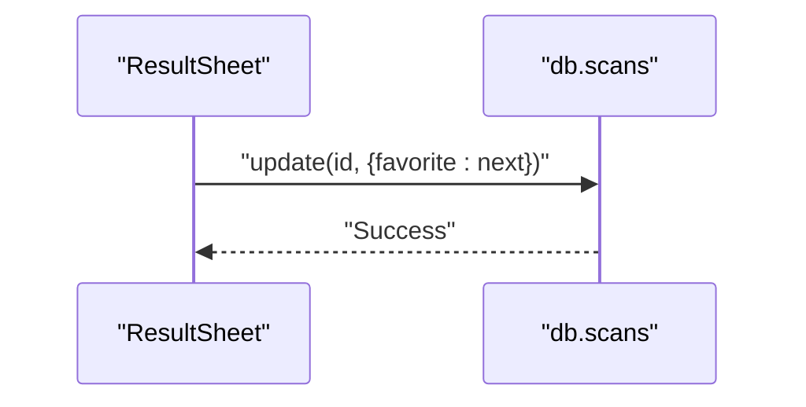
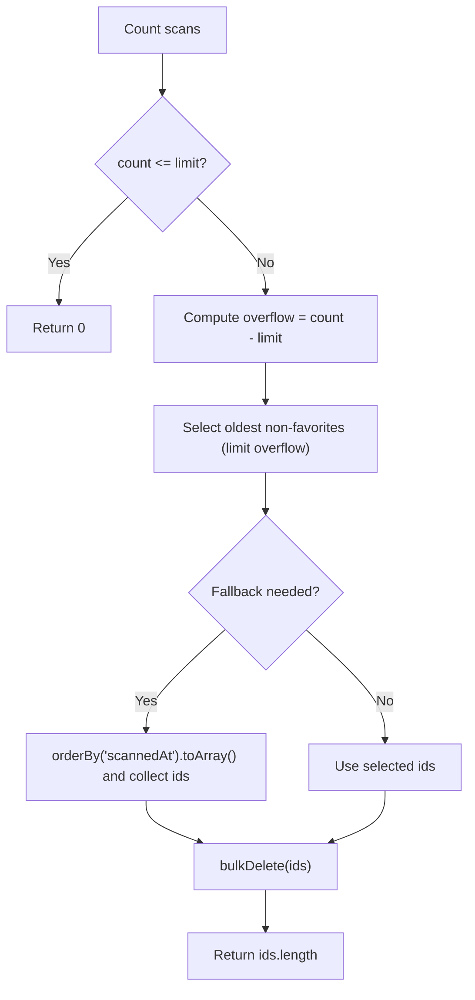
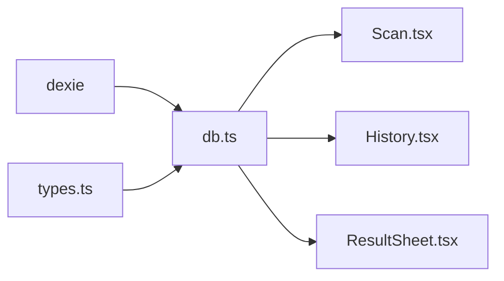

# Database Schema

<cite>
**Referenced Files in This Document**
- [db.ts](file://src/lib/db.ts)
- [types.ts](file://src/lib/scan/types.ts)
- [Scan.tsx](file://src/pages/Scan.tsx)
- [History.tsx](file://src/pages/History.tsx)
- [ResultSheet.tsx](file://src/components/ResultSheet.tsx)
</cite>

## Table of Contents
1. [Introduction](#introduction)
2. [Project Structure](#project-structure)
3. [Core Components](#core-components)
4. [Architecture Overview](#architecture-overview)
5. [Detailed Component Analysis](#detailed-component-analysis)
6. [Dependency Analysis](#dependency-analysis)
7. [Performance Considerations](#performance-considerations)
8. [Troubleshooting Guide](#troubleshooting-guide)
9. [Conclusion](#conclusion)
10. [Appendices](#appendices)

## Introduction
This document describes the IndexedDB schema and Dexie ORM implementation used by Smart Scan Pro. It focuses on the database layer that persists scan results and generated codes, including entity definitions, indexing strategy, initialization and versioning, migration approach, and common query patterns. The goal is to provide a clear reference for both developers and technical stakeholders who need to understand how data is modeled and accessed in the application.

## Project Structure
The database-related code is organized under the library layer and consumed by UI components:
- Database definition and utilities: src/lib/db.ts
- Entity type definitions: src/lib/scan/types.ts
- Data write path (scanning): src/pages/Scan.tsx
- Data read path (history listing): src/pages/History.tsx
- Data update path (favorites): src/components/ResultSheet.tsx

```mermaid
graph TB
subgraph "Database Layer"
DB["Dexie Instance<br/>ScanIQDB"]
TScans["Table 'scans'<br/>Indexed fields"]
TGen["Table 'generated'<br/>Indexed fields"]
end
subgraph "Types"
Types["Entity Types<br/>ScanRecord, GeneratedCode"]
end
subgraph "UI Consumers"
ScanPage["Scan Screen<br/>Write scans"]
HistoryPage["History Screen<br/>Read scans"]
ResultSheet["Result Sheet<br/>Update favorites"]
end
Types --> DB
DB --> TScans
DB --> TGen
ScanPage --> DB
HistoryPage --> DB
ResultSheet --> DB
```

**Diagram sources**
- [db.ts:4-17](file://src/lib/db.ts#L4-L17)
- [types.ts:30-48](file://src/lib/scan/types.ts#L30-L48)
- [Scan.tsx:50-72](file://src/pages/Scan.tsx#L50-L72)
- [History.tsx:40-60](file://src/pages/History.tsx#L40-L60)
- [ResultSheet.tsx:155-160](file://src/components/ResultSheet.tsx#L155-L160)

**Section sources**
- [db.ts:1-37](file://src/lib/db.ts#L1-L37)
- [types.ts:1-49](file://src/lib/scan/types.ts#L1-L49)
- [Scan.tsx:1-488](file://src/pages/Scan.tsx#L1-L488)
- [History.tsx:1-138](file://src/pages/History.tsx#L1-L138)
- [ResultSheet.tsx:1-414](file://src/components/ResultSheet.tsx#L1-L414)

## Core Components
- Dexie class: ScanIQDB defines the database name, tables, and indexes.
- Tables:
  - scans: stores each scanned result with metadata and content.
  - generated: stores user-generated codes.
- Entities:
  - ScanRecord: represents a single scan result.
  - GeneratedCode: represents a generated code entry.

Key responsibilities:
- Define schema and indexes for efficient queries.
- Provide a singleton instance for app-wide access.
- Offer utility functions for maintenance tasks such as pruning history.

**Section sources**
- [db.ts:4-17](file://src/lib/db.ts#L4-L17)
- [types.ts:30-48](file://src/lib/scan/types.ts#L30-L48)

## Architecture Overview
At runtime, the UI triggers operations against the Dexie instance. Writes occur during scanning; reads occur in the history view; updates occur when toggling favorites.



**Diagram sources**
- [Scan.tsx:60-72](file://src/pages/Scan.tsx#L60-L72)
- [History.tsx:40-41](file://src/pages/History.tsx#L40-L41)
- [ResultSheet.tsx:155-160](file://src/components/ResultSheet.tsx#L155-L160)
- [db.ts:4-17](file://src/lib/db.ts#L4-L17)

## Detailed Component Analysis

### Database Class and Initialization
- Database name: "scaniq"
- Version management: version(1) with explicit store definitions for both tables
- Indexes:
  - scans: id, scannedAt, type, format, favorite, content
  - generated: id, createdAt, type

Initialization pattern:
- Extend Dexie with typed tables
- Define schema in constructor via version().stores()
- Export a singleton instance for reuse across the app

Migration approach:
- Use Dexie's versioning API to evolve schema over time
- Add new versions and define incremental changes within version blocks
- Maintain backward compatibility by keeping existing indexes and adding new ones as needed

**Section sources**
- [db.ts:4-17](file://src/lib/db.ts#L4-L17)

### Entity: ScanRecord
Fields:
- id: string — unique identifier
- content: string — raw scanned text
- format: enum-like string — barcode/QR format
- type: enum-like string — parsed content category
- parsed?: object — optional structured data derived from content
- safetyStatus?: enum-like string — URL/payment safety classification
- favorite?: boolean — user preference
- scannedAt: number — epoch milliseconds timestamp

Indexing notes:
- Primary key: id
- Secondary indexes: scannedAt, type, format, favorite, content
- These enable fast filtering and sorting by time, type, and content search

Complexity considerations:
- Sorting by scannedAt is O(log n) due to index usage
- Filtering by favorite and type leverages indexes for efficient selection
- Content-based filtering may be less efficient if not indexed appropriately; current schema includes content as an index field

**Section sources**
- [types.ts:30-39](file://src/lib/scan/types.ts#L30-L39)
- [db.ts:10-13](file://src/lib/db.ts#L10-L13)

### Entity: GeneratedCode
Fields:
- id: string — unique identifier
- type: enum-like string — content category
- payload: string — serialized payload for generation
- label?: string — optional human-readable label
- style?: object — optional styling options (foreground/background colors)
- createdAt: number — epoch milliseconds timestamp

Indexing notes:
- Primary key: id
- Secondary indexes: createdAt, type
- Supports retrieval by creation time and filtering by type

**Section sources**
- [types.ts:41-48](file://src/lib/scan/types.ts#L41-L48)
- [db.ts:10-13](file://src/lib/db.ts#L10-L13)

### Relationship Mapping
- No explicit foreign keys are defined between entities.
- Logical relationships:
  - Scans and generated codes are independent collections.
  - UI can correlate entries by type and timestamps where needed.

Data flow:
- Scans are created during scanning and persisted immediately.
- Generated codes are created separately and stored independently.

**Section sources**
- [db.ts:4-17](file://src/lib/db.ts#L4-L17)
- [types.ts:30-48](file://src/lib/scan/types.ts#L30-L48)

### Database Operations and Query Patterns

#### Write Path: Creating a Scan Record
- Build a ScanRecord with id, content, format, type, parsed, safetyStatus, and scannedAt
- Persist using put() which upserts by id
- Optionally prune free history after insert



**Diagram sources**
- [Scan.tsx:60-72](file://src/pages/Scan.tsx#L60-L72)
- [db.ts:21-36](file://src/lib/db.ts#L21-L36)

**Section sources**
- [Scan.tsx:50-72](file://src/pages/Scan.tsx#L50-L72)
- [db.ts:21-36](file://src/lib/db.ts#L21-L36)

#### Read Path: Listing Scans
- Retrieve all scans ordered by scannedAt descending
- Filter client-side by favorite tab and search query



**Diagram sources**
- [History.tsx:40-50](file://src/pages/History.tsx#L40-L50)

**Section sources**
- [History.tsx:40-50](file://src/pages/History.tsx#L40-L50)

#### Update Path: Toggle Favorite
- Update favorite flag by id using update()



**Diagram sources**
- [ResultSheet.tsx:155-160](file://src/components/ResultSheet.tsx#L155-L160)

**Section sources**
- [ResultSheet.tsx:155-160](file://src/components/ResultSheet.tsx#L155-L160)

#### Maintenance: Prune Free History
- Count total scans
- If count exceeds limit, select oldest non-favorites and delete them
- Fallback uses orderBy("scannedAt") and bulkDelete



**Diagram sources**
- [db.ts:21-36](file://src/lib/db.ts#L21-L36)

**Section sources**
- [db.ts:21-36](file://src/lib/db.ts#L21-L36)

### Common CRUD Examples Using Dexie API
Note: The following examples describe typical operations without including code content. Refer to the indicated file sections for concrete usage patterns.

- Create or update a scan record:
  - Use db.scans.put(record)
  - See: [Scan.tsx:60-72](file://src/pages/Scan.tsx#L60-L72)

- Read recent scans:
  - Use db.scans.orderBy("scannedAt").reverse().toArray()
  - See: [History.tsx:40-41](file://src/pages/History.tsx#L40-L41)

- Delete a scan:
  - Use db.scans.delete(id)
  - See: [History.tsx:52-55](file://src/pages/History.tsx#L52-L55)

- Clear all scans:
  - Use db.scans.clear()
  - See: [History.tsx:57-60](file://src/pages/History.tsx#L57-L60)

- Update favorite status:
  - Use db.scans.update(id, { favorite })
  - See: [ResultSheet.tsx:155-160](file://src/components/ResultSheet.tsx#L155-L160)

- Bulk delete old scans:
  - Collect ids then use db.scans.bulkDelete(ids)
  - See: [db.ts:28-35](file://src/lib/db.ts#L28-L35)

**Section sources**
- [Scan.tsx:60-72](file://src/pages/Scan.tsx#L60-L72)
- [History.tsx:40-60](file://src/pages/History.tsx#L40-L60)
- [ResultSheet.tsx:155-160](file://src/components/ResultSheet.tsx#L155-L160)
- [db.ts:21-36](file://src/lib/db.ts#L21-L36)

## Dependency Analysis
The database module depends on Dexie and exports a typed instance. UI modules depend on this instance to perform CRUD operations.



**Diagram sources**
- [db.ts:1-17](file://src/lib/db.ts#L1-L17)
- [types.ts:30-48](file://src/lib/scan/types.ts#L30-L48)
- [Scan.tsx:5-7](file://src/pages/Scan.tsx#L5-L7)
- [History.tsx:3-5](file://src/pages/History.tsx#L3-L5)
- [ResultSheet.tsx:31-33](file://src/components/ResultSheet.tsx#L31-L33)

**Section sources**
- [db.ts:1-17](file://src/lib/db.ts#L1-L17)
- [types.ts:30-48](file://src/lib/scan/types.ts#L30-L48)
- [Scan.tsx:1-20](file://src/pages/Scan.tsx#L1-L20)
- [History.tsx:1-12](file://src/pages/History.tsx#L1-L12)
- [ResultSheet.tsx:1-35](file://src/components/ResultSheet.tsx#L1-L35)

## Performance Considerations
- Index utilization:
  - Prefer queries that leverage existing indexes (e.g., orderBy("scannedAt"), where("favorite"), where("type")).
  - Avoid full-table scans by filtering early and limiting result sets.
- Pagination:
  - For large histories, consider pagination or cursor-based loading to reduce memory pressure.
- Batch operations:
  - Use bulkDelete for mass deletions to minimize transaction overhead.
- Live queries:
  - Use live query hooks judiciously; they recompute on changes and can impact performance if overused.

[No sources needed since this section provides general guidance]

## Troubleshooting Guide
Common issues and resolutions:
- Storage failures:
  - Ensure IndexedDB is available and not blocked by browser settings.
  - Handle errors around put/update/delete operations gracefully.
- Permission and environment constraints:
  - Some environments restrict camera or clipboard APIs; handle exceptions and fallbacks.
- Migration pitfalls:
  - When upgrading schema versions, ensure backward-compatible indexes and avoid destructive changes without migrations.

Operational references:
- Error handling around storage operations:
  - See error catch in scan result handler.
- Pruning logic edge cases:
  - Verify non-favorite detection and fallback ordering behavior.

**Section sources**
- [Scan.tsx:98-102](file://src/pages/Scan.tsx#L98-L102)
- [db.ts:21-36](file://src/lib/db.ts#L21-L36)

## Conclusion
Smart Scan Pro’s database layer is built on Dexie with a clear separation between schema definition and UI consumption. The schema supports efficient time-based ordering, type-based filtering, and content search. The design enables straightforward CRUD operations and maintenance routines like history pruning. Future enhancements should focus on pagination, advanced search strategies, and robust migration practices as the schema evolves.

[No sources needed since this section summarizes without analyzing specific files]

## Appendices

### Appendix A: Field Specifications Summary

- Table: scans
  - id: string (primary key)
  - scannedAt: number (epoch ms)
  - type: string (content category)
  - format: string (barcode/QR format)
  - favorite: boolean
  - content: string
  - parsed: object (optional)
  - safetyStatus: string (optional)

- Table: generated
  - id: string (primary key)
  - createdAt: number (epoch ms)
  - type: string (content category)
  - payload: string
  - label: string (optional)
  - style: object (optional)

**Section sources**
- [types.ts:30-48](file://src/lib/scan/types.ts#L30-L48)
- [db.ts:10-13](file://src/lib/db.ts#L10-L13)