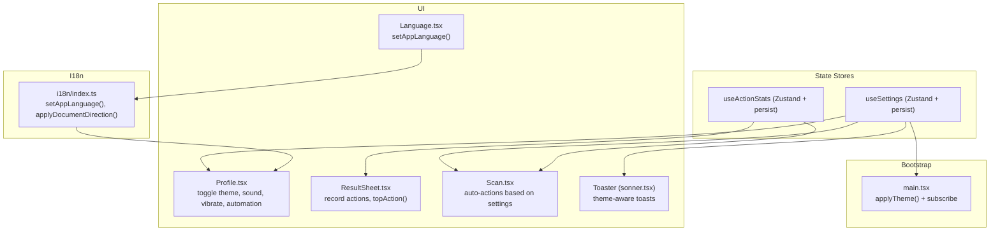
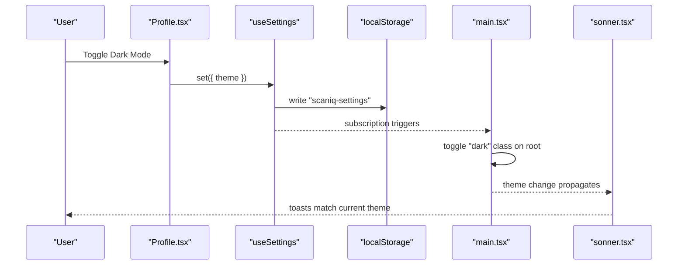
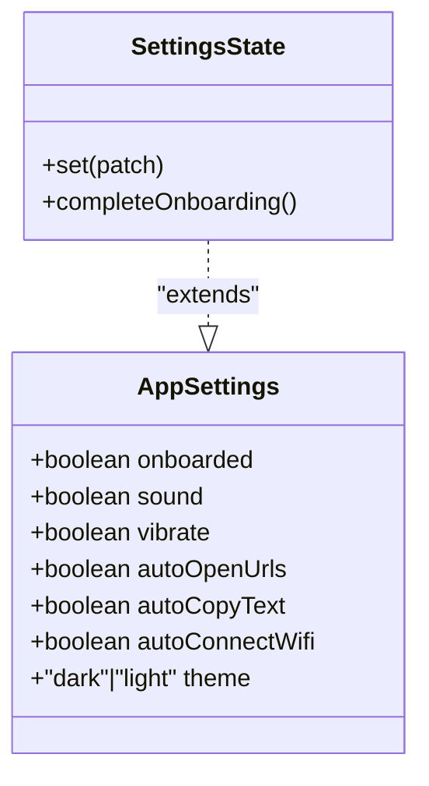
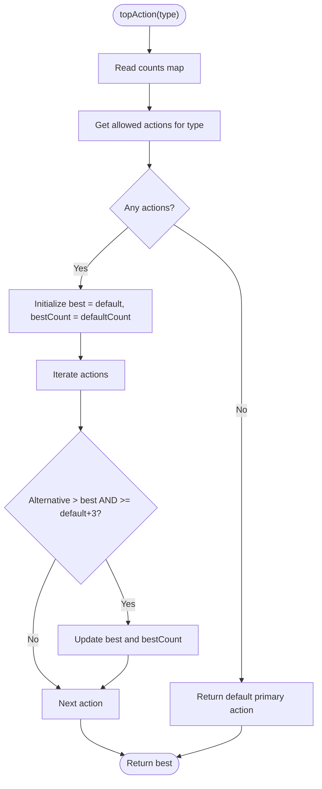
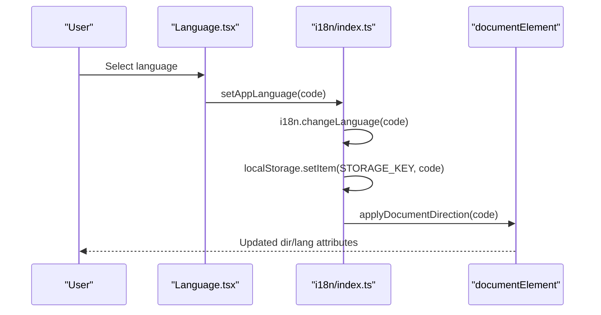
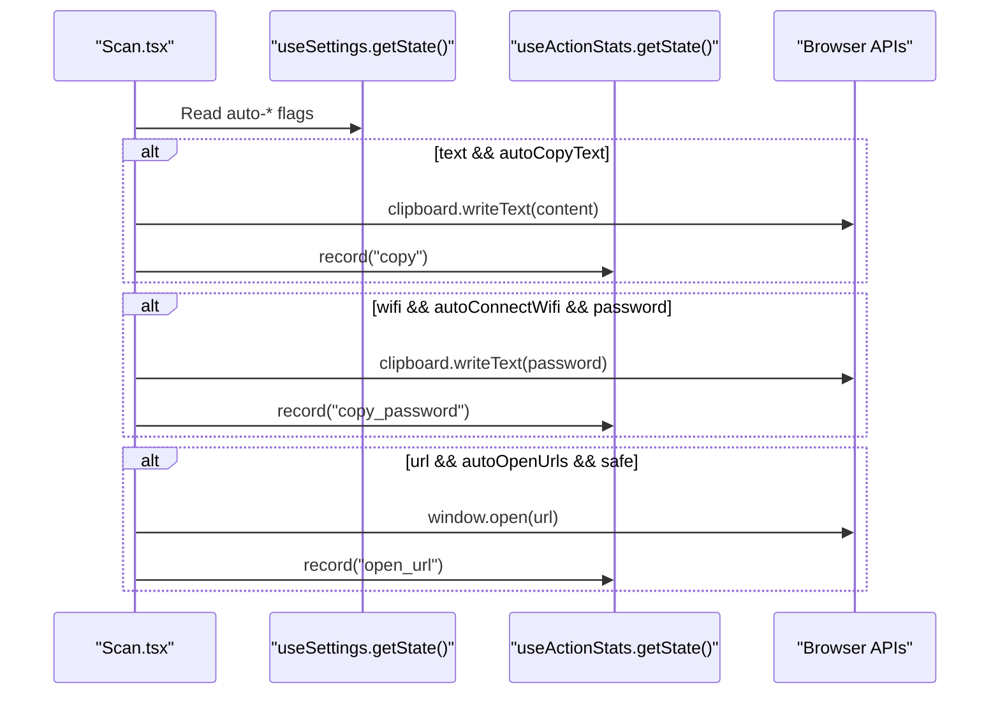
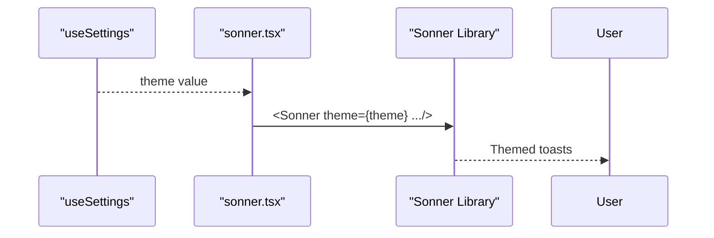
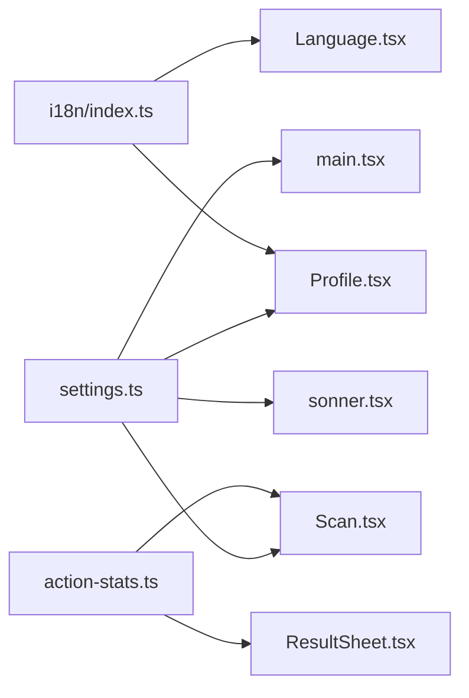

# Settings Management

<cite>
**Referenced Files in This Document**
- [settings.ts](file://src/lib/settings.ts)
- [action-stats.ts](file://src/lib/action-stats.ts)
- [main.tsx](file://src/main.tsx)
- [Profile.tsx](file://src/pages/Profile.tsx)
- [Language.tsx](file://src/pages/Language.tsx)
- [i18n/index.ts](file://src/lib/i18n/index.ts)
- [ResultSheet.tsx](file://src/components/ResultSheet.tsx)
- [Scan.tsx](file://src/pages/Scan.tsx)
- [sonner.tsx](file://src/components/ui/sonner.tsx)
</cite>

## Table of Contents
1. [Introduction](#introduction)
2. [Project Structure](#project-structure)
3. [Core Components](#core-components)
4. [Architecture Overview](#architecture-overview)
5. [Detailed Component Analysis](#detailed-component-analysis)
6. [Dependency Analysis](#dependency-analysis)
7. [Performance Considerations](#performance-considerations)
8. [Troubleshooting Guide](#troubleshooting-guide)
9. [Conclusion](#conclusion)
10. [Appendices](#appendices)

## Introduction
This document explains the settings management system in Smart Scan Pro, focusing on:
- Zustand-based state for user preferences (theme, language, auto-actions, notifications)
- Persistence via localStorage and reactive UI updates
- Action statistics tracking for monitoring user interactions
- Validation, defaults, and migration strategies
- Integration with UI components for real-time updates
- Practical examples for extending settings and building settings-dependent features

## Project Structure
The settings system is implemented across a small set of focused modules:
- State stores: settings store and action stats store
- App bootstrap: theme application and subscriptions
- UI integration: profile screen, language screen, scanner flow, toast theme
- Internationalization: language persistence and direction handling

**Diagram sources**
- [settings.ts:19-34](file://src/lib/settings.ts#L19-L34)
- [action-stats.ts:45-80](file://src/lib/action-stats.ts#L45-L80)
- [main.tsx:15-22](file://src/main.tsx#L15-L22)
- [Profile.tsx:26-40](file://src/pages/Profile.tsx#L26-L40)
- [Language.tsx:34](file://src/pages/Language.tsx#L34)
- [i18n/index.ts:74-90](file://src/lib/i18n/index.ts#L74-L90)
- [ResultSheet.tsx:114-116](file://src/components/ResultSheet.tsx#L114-L116)
- [Scan.tsx:74-97](file://src/pages/Scan.tsx#L74-L97)
- [sonner.tsx:6-12](file://src/components/ui/sonner.tsx#L6-L12)

**Section sources**
- [settings.ts:1-34](file://src/lib/settings.ts#L1-L34)
- [action-stats.ts:1-81](file://src/lib/action-stats.ts#L1-L81)
- [main.tsx:15-22](file://src/main.tsx#L15-L22)
- [Profile.tsx:26-40](file://src/pages/Profile.tsx#L26-L40)
- [Language.tsx:34](file://src/pages/Language.tsx#L34)
- [i18n/index.ts:74-90](file://src/lib/i18n/index.ts#L74-L90)
- [ResultSheet.tsx:114-116](file://src/components/ResultSheet.tsx#L114-L116)
- [Scan.tsx:74-97](file://src/pages/Scan.tsx#L74-L97)
- [sonner.tsx:6-12](file://src/components/ui/sonner.tsx#L6-L12)

## Core Components
- Settings Store (useSettings)
  - Provides typed settings fields and mutation helpers
  - Persists to localStorage under a dedicated key
  - Exposes a patch setter and an onboarding completion helper
- Action Stats Store (useActionStats)
  - Tracks counts per action string
  - Computes recommended primary action per content type using learned behavior
  - Persists to localStorage under a dedicated key
- Language System (i18n)
  - Persists selected language code and applies document direction
  - Integrates with UI to reflect changes immediately
- Bootstrap Theme Application
  - Applies persisted theme before first paint and subscribes to future changes

Key responsibilities:
- Centralized state for user preferences
- Persistent storage for cross-session continuity
- Reactive updates to UI without manual re-renders
- Learning-based action recommendations

**Section sources**
- [settings.ts:4-34](file://src/lib/settings.ts#L4-L34)
- [action-stats.ts:37-80](file://src/lib/action-stats.ts#L37-L80)
- [i18n/index.ts:74-90](file://src/lib/i18n/index.ts#L74-L90)
- [main.tsx:15-22](file://src/main.tsx#L15-L22)

## Architecture Overview
The architecture uses two independent Zustand stores with middleware-based persistence. The app bootstraps by applying persisted theme synchronously and subscribing to subsequent changes. UI components read from stores and dispatch mutations. Action stats are updated at interaction points to inform future UI behavior.

**Diagram sources**
- [Profile.tsx:36-40](file://src/pages/Profile.tsx#L36-L40)
- [settings.ts:19-34](file://src/lib/settings.ts#L19-L34)
- [main.tsx:15-22](file://src/main.tsx#L15-L22)
- [sonner.tsx:6-12](file://src/components/ui/sonner.tsx#L6-L12)

## Detailed Component Analysis

### Settings Store (useSettings)
- Data model: boolean flags for onboarding, sound, vibration, and auto-actions; theme enum
- Mutations:
  - Patch setter for partial updates
  - Onboarding completion helper
- Persistence:
  - Uses zustand/middleware persist with a unique storage key
- Defaults:
  - Defined inline in the store initializer
- Validation:
  - TypeScript enforces shape; runtime validation not present
- Migration:
  - No explicit versioning or migration logic currently

**Diagram sources**
- [settings.ts:4-17](file://src/lib/settings.ts#L4-L17)

**Section sources**
- [settings.ts:4-34](file://src/lib/settings.ts#L4-L34)

### Action Statistics Store (useActionStats)
- Data model: counts map keyed by action strings
- Mutations:
  - record(action): increments count for the given action
  - topAction(type): returns recommended action for a content type
- Recommendation algorithm:
  - Starts from default primary action per type
  - Overrides if an alternative has been used at least three more times than the default
- Persistence:
  - Uses zustand/middleware persist with a unique storage key

**Diagram sources**
- [action-stats.ts:55-76](file://src/lib/action-stats.ts#L55-L76)

**Section sources**
- [action-stats.ts:10-21](file://src/lib/action-stats.ts#L10-L21)
- [action-stats.ts:24-35](file://src/lib/action-stats.ts#L24-L35)
- [action-stats.ts:45-80](file://src/lib/action-stats.ts#L45-L80)

### Language Preferences (i18n integration)
- Persistence:
  - Language code stored in localStorage under a dedicated key
- Runtime effects:
  - Changes language via i18next
  - Applies document direction and lang attributes
- UI integration:
  - Language selection page calls the setter function
  - Profile shows current language metadata

**Diagram sources**
- [Language.tsx:34](file://src/pages/Language.tsx#L34)
- [i18n/index.ts:74-90](file://src/lib/i18n/index.ts#L74-L90)

**Section sources**
- [i18n/index.ts:44-72](file://src/lib/i18n/index.ts#L44-L72)
- [i18n/index.ts:74-90](file://src/lib/i18n/index.ts#L74-L90)
- [Language.tsx:34](file://src/pages/Language.tsx#L34)

### Auto-Actions and Scanner Flow
- Behavior:
  - After scanning, the scanner reads current settings and performs automatic actions when enabled
  - Updates action stats accordingly
- Conditions:
  - Text auto-copy when enabled
  - WiFi password copy when enabled and password available
  - URL open when safe and enabled

**Diagram sources**
- [Scan.tsx:74-97](file://src/pages/Scan.tsx#L74-L97)
- [action-stats.ts:50-53](file://src/lib/action-stats.ts#L50-L53)

**Section sources**
- [Scan.tsx:74-97](file://src/pages/Scan.tsx#L74-L97)
- [action-stats.ts:50-53](file://src/lib/action-stats.ts#L50-L53)

### Toast Theme Integration
- Behavior:
  - Toaster component reads theme from settings store and passes it to the underlying toaster library
- Effect:
  - Toasts adapt to dark/light theme automatically

**Diagram sources**
- [sonner.tsx:6-12](file://src/components/ui/sonner.tsx#L6-L12)
- [settings.ts:19-34](file://src/lib/settings.ts#L19-L34)

**Section sources**
- [sonner.tsx:6-12](file://src/components/ui/sonner.tsx#L6-L12)

## Dependency Analysis
- Coupling:
  - UI components depend on useSettings and useActionStats for behavior and appearance
  - Bootstrap depends on useSettings for initial theme application
  - Language system persists independently but affects global UI direction
- Cohesion:
  - Each store encapsulates related concerns (preferences vs. usage analytics)
- External dependencies:
  - zustand and zustand/middleware for state and persistence
  - i18next ecosystem for internationalization
  - Browser APIs for clipboard, window navigation, and DOM manipulation

**Diagram sources**
- [settings.ts:19-34](file://src/lib/settings.ts#L19-L34)
- [action-stats.ts:45-80](file://src/lib/action-stats.ts#L45-L80)
- [main.tsx:15-22](file://src/main.tsx#L15-L22)
- [Profile.tsx:26-40](file://src/pages/Profile.tsx#L26-L40)
- [Language.tsx:34](file://src/pages/Language.tsx#L34)
- [i18n/index.ts:74-90](file://src/lib/i18n/index.ts#L74-L90)
- [ResultSheet.tsx:114-116](file://src/components/ResultSheet.tsx#L114-L116)
- [Scan.tsx:74-97](file://src/pages/Scan.tsx#L74-L97)
- [sonner.tsx:6-12](file://src/components/ui/sonner.tsx#L6-L12)

**Section sources**
- [settings.ts:19-34](file://src/lib/settings.ts#L19-L34)
- [action-stats.ts:45-80](file://src/lib/action-stats.ts#L45-L80)
- [main.tsx:15-22](file://src/main.tsx#L15-L22)
- [Profile.tsx:26-40](file://src/pages/Profile.tsx#L26-L40)
- [Language.tsx:34](file://src/pages/Language.tsx#L34)
- [i18n/index.ts:74-90](file://src/lib/i18n/index.ts#L74-L90)
- [ResultSheet.tsx:114-116](file://src/components/ResultSheet.tsx#L114-L116)
- [Scan.tsx:74-97](file://src/pages/Scan.tsx#L74-L97)
- [sonner.tsx:6-12](file://src/components/ui/sonner.tsx#L6-L12)

## Performance Considerations
- Minimal re-renders:
  - Zustand selectors allow components to subscribe only to needed slices
- Early theme application:
  - Applying theme before first paint avoids flash of incorrect theme
- Lightweight persistence:
  - JSON serialization via middleware is efficient for small objects
- Action stats:
  - Simple counters avoid heavy computation; recommendation runs only when needed

[No sources needed since this section provides general guidance]

## Troubleshooting Guide
Common issues and resolutions:
- Theme not applied on reload
  - Ensure bootstrap applies theme from store and subscribes to changes
  - Verify no conflicting CSS classes override the root element
- Language not persisting
  - Confirm localStorage writes succeed and that detection order includes localStorage
- Auto-actions not triggering
  - Check that settings flags are enabled and conditions (e.g., safety status) are met
  - Validate that action stats recording occurs after successful operations
- Toast theme mismatch
  - Ensure Toaster receives the current theme from settings

**Section sources**
- [main.tsx:15-22](file://src/main.tsx#L15-L22)
- [i18n/index.ts:74-90](file://src/lib/i18n/index.ts#L74-L90)
- [Scan.tsx:74-97](file://src/pages/Scan.tsx#L74-L97)
- [sonner.tsx:6-12](file://src/components/ui/sonner.tsx#L6-L12)

## Conclusion
Smart Scan Pro’s settings system combines a simple, typed Zustand store with middleware-based persistence, enabling seamless user preference management and reactive UI updates. The action statistics store adds a lightweight learning layer to personalize primary actions. Together with robust i18n integration and early theme application, the system delivers a responsive and personalized experience. Extensibility is straightforward: add new fields to the settings interface, wire them into UI controls, and optionally integrate them into auto-action flows.

[No sources needed since this section summarizes without analyzing specific files]

## Appendices

### Adding a New Setting
Steps:
- Extend the settings interface with the new field and default value
- Add a UI control in the profile screen to update the setting
- Optionally, consume the setting in relevant flows (e.g., scanner)
- If the setting affects global UI (like theme), ensure bootstrap handles it

Example references:
- [settings.ts:4-34](file://src/lib/settings.ts#L4-L34)
- [Profile.tsx:63-72](file://src/pages/Profile.tsx#L63-L72)
- [Scan.tsx:74-97](file://src/pages/Scan.tsx#L74-L97)

### Customizing Existing Settings
- Modify defaults in the store initializer
- Adjust UI labels and behaviors in the profile screen
- Update any dependent flows to respect new semantics

Example references:
- [settings.ts:21-31](file://src/lib/settings.ts#L21-L31)
- [Profile.tsx:57-118](file://src/pages/Profile.tsx#L57-L118)

### Implementing Settings-Dependent Features
- Read current settings via getState() where imperative access is needed
- Subscribe to changes reactively in components using selectors
- Record user actions to influence future recommendations

Example references:
- [Scan.tsx:74-97](file://src/pages/Scan.tsx#L74-L97)
- [ResultSheet.tsx:114-116](file://src/components/ResultSheet.tsx#L114-L116)
- [action-stats.ts:50-76](file://src/lib/action-stats.ts#L50-L76)

### Settings Validation, Defaults, and Migration
- Validation:
  - Enforced via TypeScript types; consider adding runtime guards if needed
- Defaults:
  - Defined in the store initializer; review when introducing breaking changes
- Migration:
  - No built-in migration strategy; consider adding a versioned schema and a one-time migration step if the structure evolves

Example references:
- [settings.ts:4-34](file://src/lib/settings.ts#L4-L34)