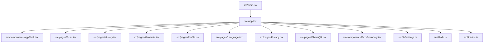
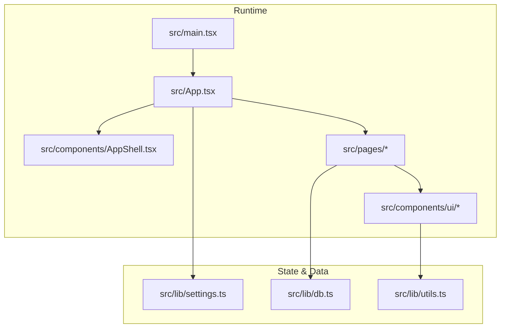
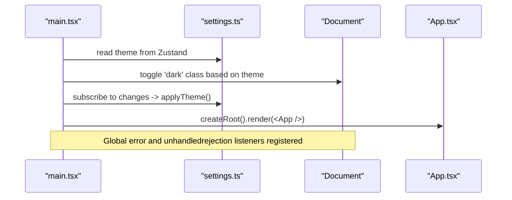
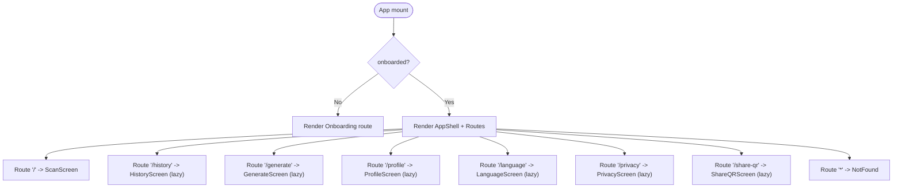
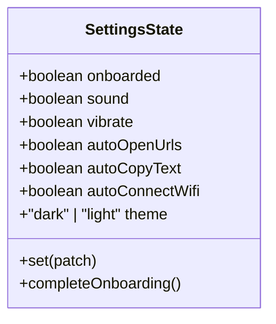
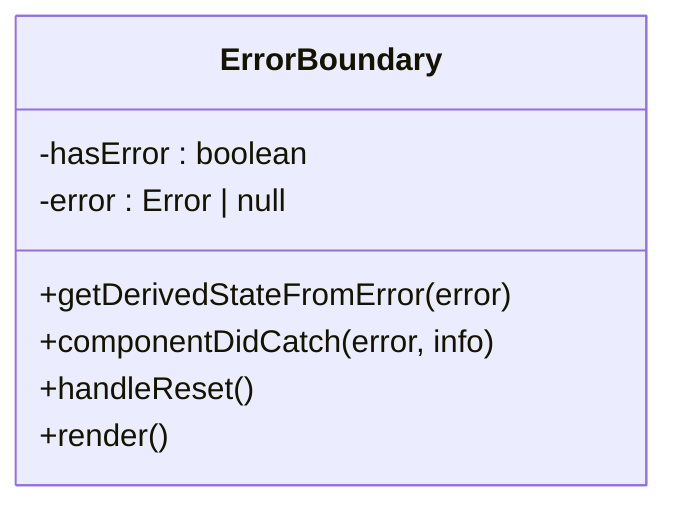
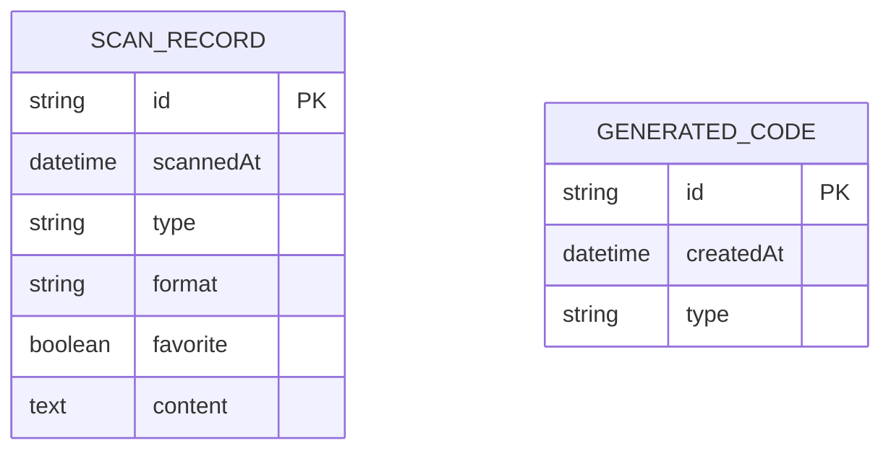

# Developer Guide

<cite>
**Referenced Files in This Document**
- [package.json](file://package.json)
- [tsconfig.json](file://tsconfig.json)
- [tsconfig.app.json](file://tsconfig.app.json)
- [eslint.config.js](file://eslint.config.js)
- [vite.config.ts](file://vite.config.ts)
- [tailwind.config.ts](file://tailwind.config.ts)
- [components.json](file://components.json)
- [vitest.config.ts](file://vitest.config.ts)
- [src/main.tsx](file://src/main.tsx)
- [src/App.tsx](file://src/App.tsx)
- [src/lib/settings.ts](file://src/lib/settings.ts)
- [src/components/ErrorBoundary.tsx](file://src/components/ErrorBoundary.tsx)
- [src/lib/db.ts](file://src/lib/db.ts)
- [src/lib/utils.ts](file://src/lib/utils.ts)
</cite>

## Table of Contents
1. Introduction
2. Project Structure
3. Core Components
4. Architecture Overview
5. Detailed Component Analysis
6. Dependency Analysis
7. Performance Considerations
8. Troubleshooting Guide
9. Conclusion
10. Appendices

## Introduction
This developer guide explains how to build, run, and extend Smart Scan Pro (Scaniq). It covers code style conventions, TypeScript configuration, ESLint rules, project structure principles, contribution guidelines, debugging techniques, logging strategies, performance profiling, optimization tips, troubleshooting, and integration guidance for external systems.

## Project Structure
Smart Scan Pro is a React + Vite application with TypeScript, Tailwind CSS, Radix UI components, Zustand state management, Dexie IndexedDB persistence, i18n, and testing via Vitest.

Key directories:
- src/components/ui: Reusable UI primitives (Radix-based)
- src/components: App-level components (shell, error boundary, navigation, banners)
- src/hooks: Shared hooks (mobile detection, network status, toast)
- src/lib: Utilities, settings store, database layer, scanner service, URL safety, sharing utilities, app metadata
- src/pages: Feature screens (scan, history, generate, profile, language, privacy, onboarding, share QR)
- public: Static assets
- Root config files: Vite, TypeScript, ESLint, Tailwind, Vitest, package scripts



**Diagram sources**
- [src/main.tsx:1-24](file://src/main.tsx#L1-L24)
- [src/App.tsx:1-100](file://src/App.tsx#L1-L100)
- [src/components/ErrorBoundary.tsx:1-71](file://src/components/ErrorBoundary.tsx#L1-L71)
- [src/lib/settings.ts:1-35](file://src/lib/settings.ts#L1-L35)
- [src/lib/db.ts:1-37](file://src/lib/db.ts#L1-L37)
- [src/lib/utils.ts:1-7](file://src/lib/utils.ts#L1-L7)

**Section sources**
- [package.json:1-70](file://package.json#L1-L70)
- [src/main.tsx:1-24](file://src/main.tsx#L1-L24)
- [src/App.tsx:1-100](file://src/App.tsx#L1-L100)

## Core Components
- Application bootstrap and global error handling: The entry point initializes the root, applies persisted theme before first paint, and registers global error/unhandled rejection handlers.
- Routing and lazy loading: The app shell wraps routes; feature pages are lazily loaded with Suspense fallbacks.
- Settings store: A Zustand store persists user preferences (theme, onboarding, behaviors) and drives UI behavior like dark mode toggling.
- Error boundary: A class component catches render errors, logs details, and provides recovery actions.
- Database layer: Dexie schema defines tables for scans and generated codes; includes pruning logic to limit free history size.
- Utility helpers: Class name merging utility for Tailwind classes.

**Section sources**
- [src/main.tsx:1-24](file://src/main.tsx#L1-L24)
- [src/App.tsx:1-100](file://src/App.tsx#L1-L100)
- [src/lib/settings.ts:1-35](file://src/lib/settings.ts#L1-L35)
- [src/components/ErrorBoundary.tsx:1-71](file://src/components/ErrorBoundary.tsx#L1-L71)
- [src/lib/db.ts:1-37](file://src/lib/db.ts#L1-L37)
- [src/lib/utils.ts:1-7](file://src/lib/utils.ts#L1-L7)

## Architecture Overview
The app follows a layered architecture:
- Presentation: Pages and UI components
- State: Zustand store for settings
- Data: Dexie IndexedDB for persistence
- Tooling: Vite dev server, SWC plugin, Tailwind styling, ESLint, Vitest tests



**Diagram sources**
- [src/main.tsx:1-24](file://src/main.tsx#L1-L24)
- [src/App.tsx:1-100](file://src/App.tsx#L1-L100)
- [src/lib/settings.ts:1-35](file://src/lib/settings.ts#L1-L35)
- [src/lib/db.ts:1-37](file://src/lib/db.ts#L1-L37)
- [src/lib/utils.ts:1-7](file://src/lib/utils.ts#L1-L7)

## Detailed Component Analysis

### Bootstrap and Global Error Handling
- Initializes React root and applies persisted theme before first paint.
- Subscribes to settings changes to toggle dark mode dynamically.
- Registers global error and unhandled rejection listeners for early crash detection.



**Diagram sources**
- [src/main.tsx:1-24](file://src/main.tsx#L1-L24)
- [src/lib/settings.ts:1-35](file://src/lib/settings.ts#L1-L35)

**Section sources**
- [src/main.tsx:1-24](file://src/main.tsx#L1-L24)
- [src/lib/settings.ts:1-35](file://src/lib/settings.ts#L1-L35)

### Routing and Lazy Loading
- Uses BrowserRouter with Routes; non-onboarded users are redirected to Onboarding.
- Feature pages are lazily imported with Suspense fallbacks for better initial load performance.



**Diagram sources**
- [src/App.tsx:1-100](file://src/App.tsx#L1-L100)

**Section sources**
- [src/App.tsx:1-100](file://src/App.tsx#L1-L100)

### Settings Store (Zustand)
- Persists settings under a storage key and exposes setters and an onboarding completion action.
- Drives theme toggling and feature flags across the app.



**Diagram sources**
- [src/lib/settings.ts:1-35](file://src/lib/settings.ts#L1-L35)

**Section sources**
- [src/lib/settings.ts:1-35](file://src/lib/settings.ts#L1-L35)

### Error Boundary
- Catches rendering errors, logs stack traces, and offers reset or reload actions.
- Provides a localized fallback UI.



**Diagram sources**
- [src/components/ErrorBoundary.tsx:1-71](file://src/components/ErrorBoundary.tsx#L1-L71)

**Section sources**
- [src/components/ErrorBoundary.tsx:1-71](file://src/components/ErrorBoundary.tsx#L1-L71)

### Database Layer (Dexie)
- Defines tables for scan records and generated codes.
- Includes pruning logic to enforce a free-tier history limit while preserving favorites.



**Diagram sources**
- [src/lib/db.ts:1-37](file://src/lib/db.ts#L1-L37)

**Section sources**
- [src/lib/db.ts:1-37](file://src/lib/db.ts#L1-L37)

### Utility Helpers
- Class name merging utility combining conditional classes and Tailwind merge for consistent styling.

**Section sources**
- [src/lib/utils.ts:1-7](file://src/lib/utils.ts#L1-L7)

## Dependency Analysis
Top-level dependencies include React ecosystem, Radix UI primitives, ZXing scanning library, Dexie for IndexedDB, i18n, Zustand for state, and tooling for build, lint, and test.

```mermaid
graph LR
Pkg["package.json"] --> React["react / react-dom"]
Pkg --> Router["react-router-dom"]
Pkg --> Radix["@radix-ui/*"]
Pkg --> Scanning["@zxing/library", "@zxing/browser"]
Pkg --> State["zustand"]
Pkg --> DB["dexie / dexie-react-hooks"]
Pkg --> I18N["i18next / react-i18next"]
Pkg --> Build["vite / @vitejs/plugin-react-swc"]
Pkg --> Lint["eslint / typescript-eslint"]
Pkg --> Test["vitest / jsdom"]
Pkg --> Styles["tailwindcss / tailwind-merge / clsx"]
```

**Diagram sources**
- [package.json:1-70](file://package.json#L1-L70)

**Section sources**
- [package.json:1-70](file://package.json#L1-L70)

## Performance Considerations
- Code splitting: Use lazy imports for heavy pages to reduce initial bundle size.
- Dedupe React: Ensure single instance of React and ReactDOM to avoid duplicate bundles.
- Styling efficiency: Prefer Tailwind utilities and the provided cn helper to minimize runtime overhead.
- Database queries: Keep indexes minimal and query only needed fields; prune history regularly.
- Dev overlay: Disable HMR overlay in development to reduce console noise during rapid edits.

[No sources needed since this section provides general guidance]

## Troubleshooting Guide
Common issues and resolutions:
- Development server port conflicts: Adjust server port in Vite config if default is occupied.
- Theme not applying: Verify global error handlers and settings subscription are initialized before first render.
- Unhandled promise rejections: Inspect global unhandledrejection listener output for failing async flows.
- IndexedDB limits: Monitor history growth and ensure pruning runs when exceeding free tier limits.
- Linting failures: Run linter locally and fix unused variables or React hook warnings.

**Section sources**
- [vite.config.ts:1-23](file://vite.config.ts#L1-L23)
- [src/main.tsx:1-24](file://src/main.tsx#L1-L24)
- [src/lib/db.ts:1-37](file://src/lib/db.ts#L1-L37)

## Contribution Guidelines
- Pull request process:
  - Create a feature branch from main.
  - Ensure all tests pass and lints clean.
  - Open a PR with a clear description and linked issue if applicable.
- Code review standards:
  - Follow ESLint and TypeScript rules.
  - Keep components small and focused; prefer composition over inheritance.
  - Add comments for complex logic and document new APIs.
- Commit message conventions:
  - Use imperative mood and concise summaries.
  - Reference related issues where appropriate.
  - Separate logical changes into multiple commits.

[No sources needed since this section doesn't analyze specific files]

## Debugging Techniques
- Browser DevTools:
  - Sources: Set breakpoints in TSX files; use conditional breakpoints for performance-sensitive paths.
  - Network: Inspect fetch calls and resource loading; verify CORS and headers.
  - Console: Filter logs by tags used in global error handlers and boundaries.
  - Performance: Record timelines to identify long tasks and layout thrashing.
  - Memory: Take heap snapshots to detect retained references and leaks.
- Logging strategies:
  - Centralize logs using tagged messages for easy filtering.
  - Avoid excessive logging in hot paths; log only essential context.
- Error tracking:
  - Wrap critical sections with try/catch and report to your telemetry backend.
  - Use the existing error boundary to capture and display actionable information.

[No sources needed since this section provides general guidance]

## Common Development Workflows
- Install dependencies and start dev server:
  - npm install
  - npm run dev
- Build and preview:
  - npm run build
  - npm run preview
- Lint and test:
  - npm run lint
  - npm run test
  - npm run test:watch

**Section sources**
- [package.json:1-70](file://package.json#L1-L70)

## Extending Functionality and Integrating External Systems
- Adding a new page:
  - Create a new file under src/pages.
  - Add a route in the app router and wrap with Suspense if lazy-loaded.
- Adding a new UI primitive:
  - Place it under src/components/ui and export consistently.
  - Use the cn utility for class merging.
- Integrating a new data source:
  - Extend the database layer or create a dedicated service under src/lib.
  - Provide typed interfaces and handle errors gracefully.
- Internationalization:
  - Add keys to the i18n resources and reference them in components.
- Settings:
  - Extend the settings store with new flags and persist them automatically.

[No sources needed since this section provides general guidance]

## Appendix A: Code Style Conventions
- TypeScript:
  - Strictness: Some strict checks disabled at top-level; per-project options enable unused variable checks.
  - Path aliases: Use @/ prefix for imports within src.
- ESLint:
  - Recommended configs for JS and TypeScript.
  - React Hooks and Refresh plugins enabled.
  - Unused vars warning with underscore-ignore patterns.
- Tailwind:
  - Dark mode via class strategy.
  - Custom color tokens and animations configured.
- Components:
  - Prefer functional components with hooks.
  - Use Radix primitives for accessibility.
  - Merge classes via the cn helper.

**Section sources**
- [tsconfig.json:1-16](file://tsconfig.json#L1-L16)
- [tsconfig.app.json:1-31](file://tsconfig.app.json#L1-L31)
- [eslint.config.js:1-27](file://eslint.config.js#L1-L27)
- [tailwind.config.ts:1-108](file://tailwind.config.ts#L1-L108)
- [components.json:1-21](file://components.json#L1-21)
- [src/lib/utils.ts:1-7](file://src/lib/utils.ts#L1-L7)

## Appendix B: Environment and Configuration
- Vite:
  - Host binding and port configuration.
  - SWC React plugin and optional component tagger in development.
  - Alias mapping for @/.
- Testing:
  - Vitest with jsdom environment and setup file.
  - Include patterns for test files.

**Section sources**
- [vite.config.ts:1-23](file://vite.config.ts#L1-L23)
- [vitest.config.ts:1-17](file://vitest.config.ts#L1-L17)

## Appendix C: Scripts and Commands
- Development: npm run dev
- Build: npm run build
- Preview: npm run preview
- Lint: npm run lint
- Test: npm run test
- Test watch: npm run test:watch

**Section sources**
- [package.json:1-70](file://package.json#L1-L70)

## Conclusion
Smart Scan Pro is structured for clarity, performance, and maintainability. By following the conventions, leveraging the provided tools, and adhering to the contribution guidelines, contributors can efficiently extend features, debug effectively, and optimize performance.

[No sources needed since this section summarizes without analyzing specific files]