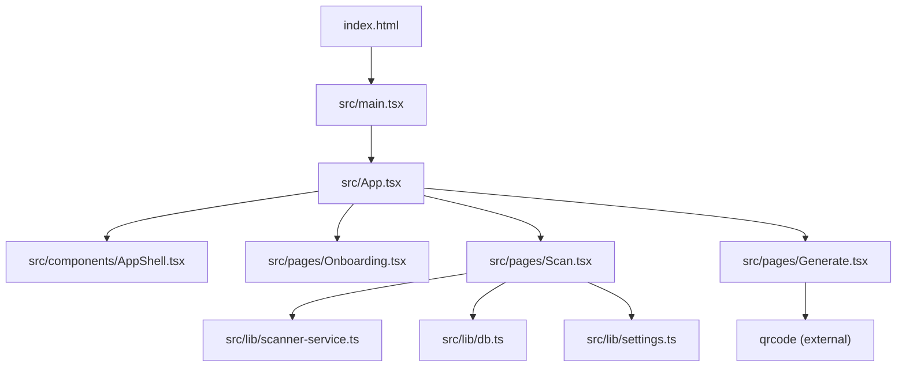
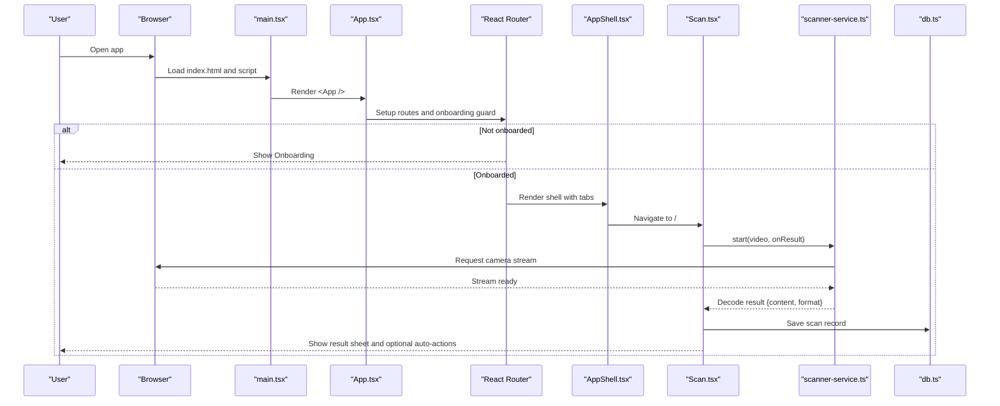
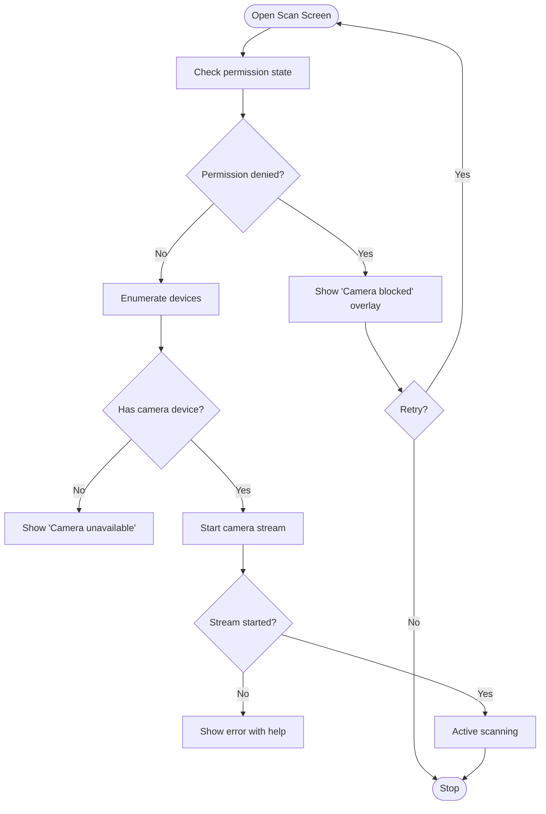
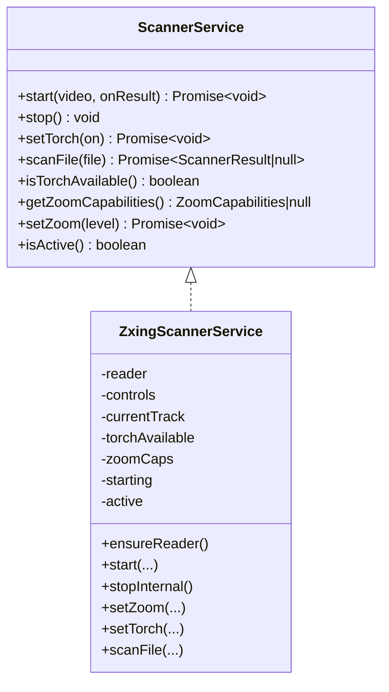
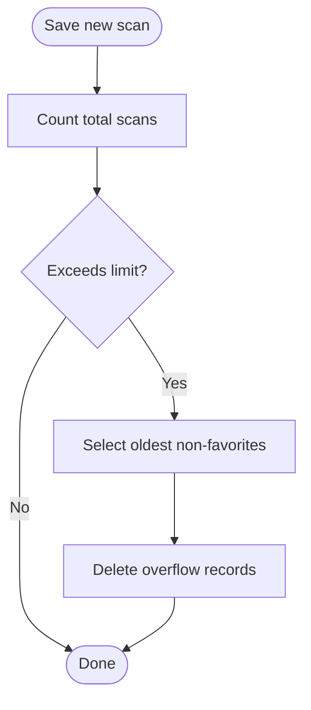

# Getting Started

<cite>
**Referenced Files in This Document**
- [README.md](file://README.md)
- [package.json](file://package.json)
- [vite.config.ts](file://vite.config.ts)
- [index.html](file://index.html)
- [tsconfig.json](file://tsconfig.json)
- [src/main.tsx](file://src/main.tsx)
- [src/App.tsx](file://src/App.tsx)
- [src/components/AppShell.tsx](file://src/components/AppShell.tsx)
- [src/pages/Onboarding.tsx](file://src/pages/Onboarding.tsx)
- [src/pages/Scan.tsx](file://src/pages/Scan.tsx)
- [src/pages/Generate.tsx](file://src/pages/Generate.tsx)
- [src/lib/scanner-service.ts](file://src/lib/scanner-service.ts)
- [src/lib/db.ts](file://src/lib/db.ts)
- [src/lib/settings.ts](file://src/lib/settings.ts)
</cite>

## Table of Contents
1. Introduction
2. Project Structure
3. Core Components
4. Architecture Overview
5. Detailed Component Analysis
6. Dependency Analysis
7. Performance Considerations
8. Troubleshooting Guide
9. Conclusion

## Introduction
Smart Scan Pro is a modern, mobile-first web app for scanning QR codes and barcodes, generating QR codes, and managing scan history with smart actions and safety checks. It runs entirely in the browser using React, Vite, and ZXing for decoding. The app includes an onboarding flow, camera-based scanning with torch and zoom controls, manual input, image upload scanning, and a generation screen for multiple content types.

This guide helps you install dependencies, set up your development environment, run the app, complete first-time setup (including camera permissions), and use core features like scanning and generating QR codes.

## Project Structure
The project follows a feature-oriented layout:
- src/pages: Top-level screens (Scan, Generate, History, Profile, Onboarding, etc.)
- src/components: Shared UI components and shell navigation
- src/lib: Core libraries (scanner service, database, settings, utilities)
- Public assets and HTML entry point at root

**Diagram sources**
- [index.html:20-24](file://index.html#L20-L24)
- [src/main.tsx:1-24](file://src/main.tsx#L1-L24)
- [src/App.tsx:1-100](file://src/App.tsx#L1-L100)
- [src/components/AppShell.tsx:1-63](file://src/components/AppShell.tsx#L1-L63)
- [src/pages/Onboarding.tsx:1-73](file://src/pages/Onboarding.tsx#L1-L73)
- [src/pages/Scan.tsx:1-488](file://src/pages/Scan.tsx#L1-L488)
- [src/pages/Generate.tsx:1-225](file://src/pages/Generate.tsx#L1-L225)
- [src/lib/scanner-service.ts:1-198](file://src/lib/scanner-service.ts#L1-L198)
- [src/lib/db.ts:1-37](file://src/lib/db.ts#L1-L37)
- [src/lib/settings.ts:1-35](file://src/lib/settings.ts#L1-L35)

**Section sources**
- [index.html:1-25](file://index.html#L1-L25)
- [src/main.tsx:1-24](file://src/main.tsx#L1-L24)
- [src/App.tsx:1-100](file://src/App.tsx#L1-L100)
- [src/components/AppShell.tsx:1-63](file://src/components/AppShell.tsx#L1-L63)
- [src/pages/Onboarding.tsx:1-73](file://src/pages/Onboarding.tsx#L1-L73)
- [src/pages/Scan.tsx:1-488](file://src/pages/Scan.tsx#L1-L488)
- [src/pages/Generate.tsx:1-225](file://src/pages/Generate.tsx#L1-L225)
- [src/lib/scanner-service.ts:1-198](file://src/lib/scanner-service.ts#L1-L198)
- [src/lib/db.ts:1-37](file://src/lib/db.ts#L1-L37)
- [src/lib/settings.ts:1-35](file://src/lib/settings.ts#L1-L35)

## Core Components
- App Shell and Routing: The app bootstraps via main.tsx, renders App.tsx which sets up routing and guards onboarding. After onboarding, the AppShell provides bottom navigation to Scan, History, Generate, and Profile.
- Scanner Screen: Handles camera access, permission states, live scanning, torch and zoom controls, manual input, and image upload scanning. Results are parsed, saved to IndexedDB, and optionally auto-copied or opened based on settings.
- Generate Screen: Builds payloads for various types (URL, text, Wi-Fi, vCard, email, SMS, phone) and renders a QR code preview with download/share options.
- Scanner Service: A singleton wrapper around ZXing that starts/stops camera streams, decodes frames, and exposes torch/zoom capabilities.
- Database: Dexie-backed IndexedDB tables for scans and generated codes, with automatic pruning of free-tier history.
- Settings: Persisted Zustand store for user preferences including onboarding status, auto-actions, and theme.

Key responsibilities and interactions:
- Camera lifecycle and error handling are centralized in the scanner service and surfaced by the Scan screen.
- Scanned results are persisted and pruned automatically.
- Auto-actions (copy/open URL/Wi-Fi password) are controlled by settings.

**Section sources**
- [src/main.tsx:1-24](file://src/main.tsx#L1-L24)
- [src/App.tsx:1-100](file://src/App.tsx#L1-L100)
- [src/components/AppShell.tsx:1-63](file://src/components/AppShell.tsx#L1-L63)
- [src/pages/Scan.tsx:1-488](file://src/pages/Scan.tsx#L1-L488)
- [src/pages/Generate.tsx:1-225](file://src/pages/Generate.tsx#L1-L225)
- [src/lib/scanner-service.ts:1-198](file://src/lib/scanner-service.ts#L1-L198)
- [src/lib/db.ts:1-37](file://src/lib/db.ts#L1-L37)
- [src/lib/settings.ts:1-35](file://src/lib/settings.ts#L1-L35)

## Architecture Overview
High-level runtime flow from boot to scanning:

**Diagram sources**
- [index.html:20-24](file://index.html#L20-L24)
- [src/main.tsx:1-24](file://src/main.tsx#L1-L24)
- [src/App.tsx:1-100](file://src/App.tsx#L1-L100)
- [src/components/AppShell.tsx:1-63](file://src/components/AppShell.tsx#L1-L63)
- [src/pages/Scan.tsx:1-488](file://src/pages/Scan.tsx#L1-L488)
- [src/lib/scanner-service.ts:1-198](file://src/lib/scanner-service.ts#L1-L198)
- [src/lib/db.ts:1-37](file://src/lib/db.ts#L1-L37)

## Detailed Component Analysis

### Installation and Development Environment
- Node.js requirements: Use a recent LTS version compatible with Vite 5 and TypeScript 5.
- Install dependencies:
  - npm: run npm install
  - bun: run bun install
- Start development server:
  - npm: run npm run dev
  - bun: run bun run dev
- The dev server listens on port 8080 and supports hot module replacement.

Notes:
- The project uses ES modules and path aliases configured via tsconfig and Vite.
- The HTML entry mounts the React app into #root.

**Section sources**
- [package.json:7-14](file://package.json#L7-L14)
- [vite.config.ts:7-22](file://vite.config.ts#L7-L22)
- [tsconfig.json:1-16](file://tsconfig.json#L1-L16)
- [index.html:20-24](file://index.html#L20-L24)

### First-Time Setup and Launch
- Onboarding:
  - If not completed, the app shows a guided onboarding flow. Completing it marks the user as onboarded and unlocks the main interface.
- Camera permissions:
  - On first launch of the Scan screen, the app requests camera access. If denied, it displays guidance and offers retry or alternative inputs (image upload/manual).
  - If permanently denied, the app suggests opening system settings to change permissions.
- Initial launch:
  - After onboarding, navigate to the Scan tab to begin scanning.

**Section sources**
- [src/pages/Onboarding.tsx:1-73](file://src/pages/Onboarding.tsx#L1-L73)
- [src/pages/Scan.tsx:104-180](file://src/pages/Scan.tsx#L104-L180)
- [src/lib/settings.ts:19-34](file://src/lib/settings.ts#L19-L34)

### Basic Usage Tutorial
- Scan barcodes and QR codes:
  - Allow camera access when prompted.
  - Point the camera at a barcode or QR code; results appear in a slide-up sheet.
  - Optional: toggle torch, pinch-to-zoom or use the slider if supported.
  - Alternative inputs: choose “Image” to scan from a photo or “Manual” to paste text.
- Generate QR codes:
  - Go to the Generate tab.
  - Choose type (URL, text, Wi-Fi, vCard, email, SMS, phone).
  - Fill fields; a live preview updates.
  - Download or share the generated QR image.
- Navigation:
  - Use the bottom navigation to switch between Scan, History, Generate, and Profile.

**Section sources**
- [src/pages/Scan.tsx:254-276](file://src/pages/Scan.tsx#L254-L276)
- [src/pages/Scan.tsx:376-453](file://src/pages/Scan.tsx#L376-L453)
- [src/pages/Generate.tsx:43-111](file://src/pages/Generate.tsx#L43-L111)
- [src/components/AppShell.tsx:7-12](file://src/components/AppShell.tsx#L7-L12)

### Camera Permissions Flow

**Diagram sources**
- [src/pages/Scan.tsx:104-180](file://src/pages/Scan.tsx#L104-L180)

### Scanner Service Internals

**Diagram sources**
- [src/lib/scanner-service.ts:14-23](file://src/lib/scanner-service.ts#L14-L23)
- [src/lib/scanner-service.ts:42-197](file://src/lib/scanner-service.ts#L42-L197)

### Data Persistence and Pruning
- Scans are stored in IndexedDB via Dexie.
- Free-tier history is pruned to a fixed limit while preserving favorites.

**Diagram sources**
- [src/lib/db.ts:19-36](file://src/lib/db.ts#L19-L36)

**Section sources**
- [src/lib/db.ts:1-37](file://src/lib/db.ts#L1-L37)

## Dependency Analysis
Key runtime dependencies relevant to getting started:
- React and ReactDOM for UI
- Vite for build/dev server
- ZXing browser/library for decoding
- Dexie for IndexedDB persistence
- i18next for internationalization
- Tailwind CSS and Radix UI components for styling and primitives

Development tooling:
- TypeScript, ESLint, Vitest for testing
- PostCSS/Autoprefixer for CSS processing

**Section sources**
- [package.json:16-68](file://package.json#L16-L68)

## Performance Considerations
- Lazy loading: Major pages (History, Generate, Profile, ShareQR, Language, Privacy) are lazy-loaded to reduce initial bundle size.
- Debounced zoom: Zoom changes are batched via requestAnimationFrame to avoid excessive track constraint updates.
- Image scanning: Uses object URLs and revokes them promptly to free memory.
- IndexedDB pruning: Prevents unbounded growth of scan history.

[No sources needed since this section provides general guidance]

## Troubleshooting Guide
Common issues and resolutions:
- Camera permission denied:
  - The app detects denied states and shows guidance. Try again or open system settings to allow camera access.
- No camera found:
  - If no videoinput devices are detected, the app indicates the camera is unavailable. Ensure a webcam or rear camera is present and accessible.
- Camera initialization errors:
  - Errors such as NotReadable or TrackStartError are handled with helpful messages. Try refreshing the page, ensuring HTTPS context, and closing other apps using the camera.
- Torch or zoom not available:
  - These features depend on device capabilities. The app probes capabilities after starting the stream and hides controls if unsupported.
- Build or dev server issues:
  - Ensure Node.js is installed and compatible. Run npm install or bun install before npm run dev. Confirm port 8080 is free.

**Section sources**
- [src/pages/Scan.tsx:158-180](file://src/pages/Scan.tsx#L158-L180)
- [src/lib/scanner-service.ts:107-127](file://src/lib/scanner-service.ts#L107-L127)
- [package.json:7-14](file://package.json#L7-L14)
- [vite.config.ts:8-14](file://vite.config.ts#L8-L14)

## Conclusion
You now have everything needed to install Smart Scan Pro, set up your development environment, complete first-time setup, and use core scanning and generation features. For advanced customization, explore the scanner service, settings store, and database schema.