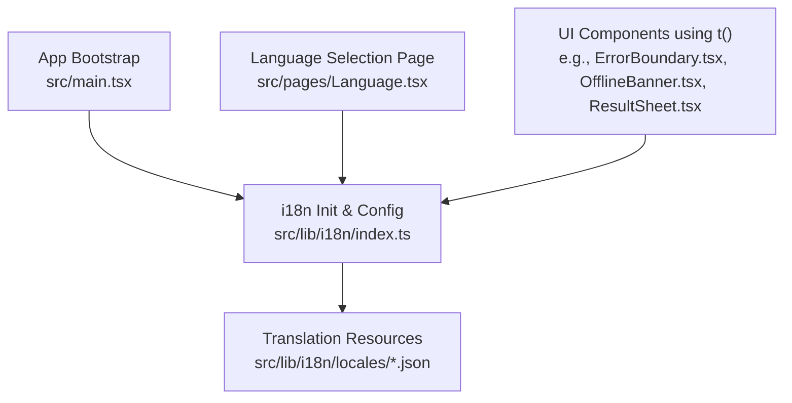
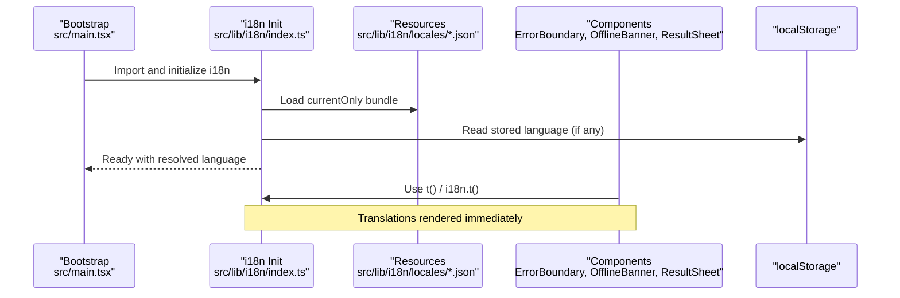
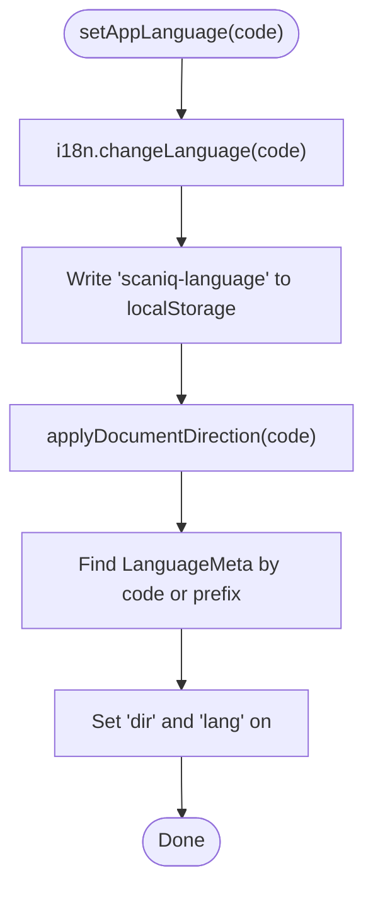
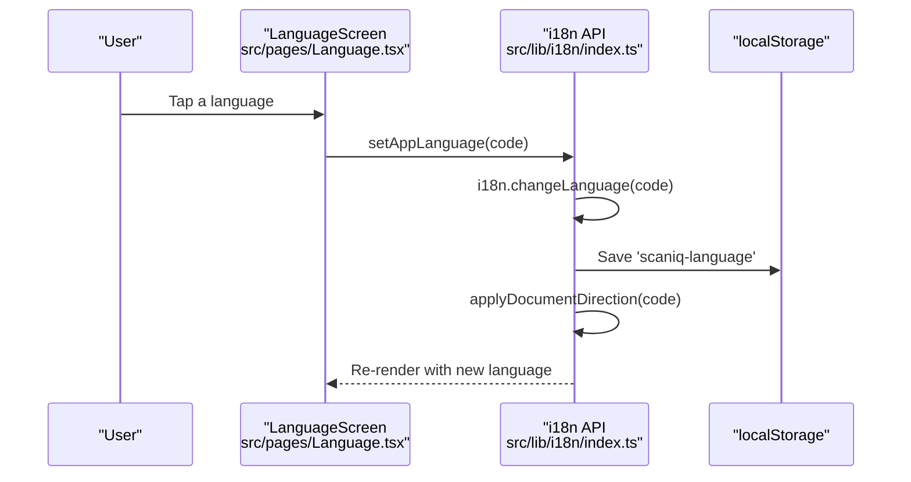
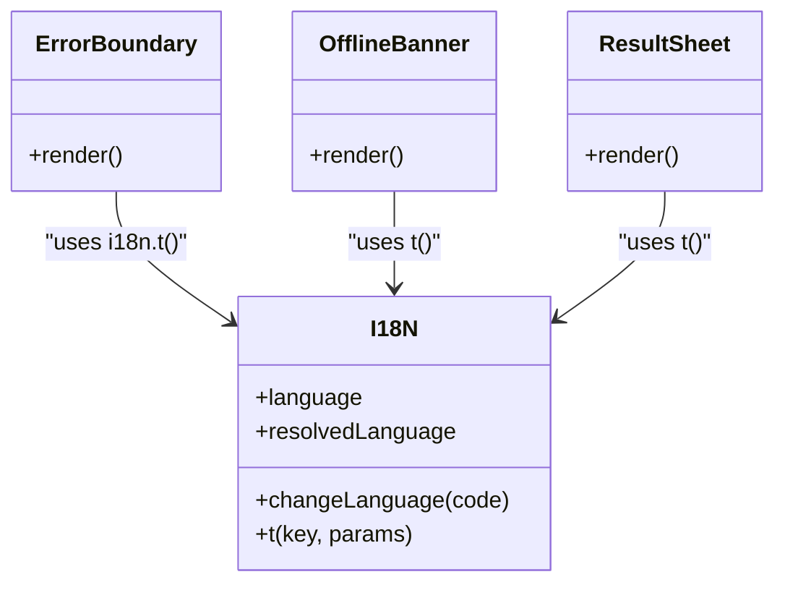
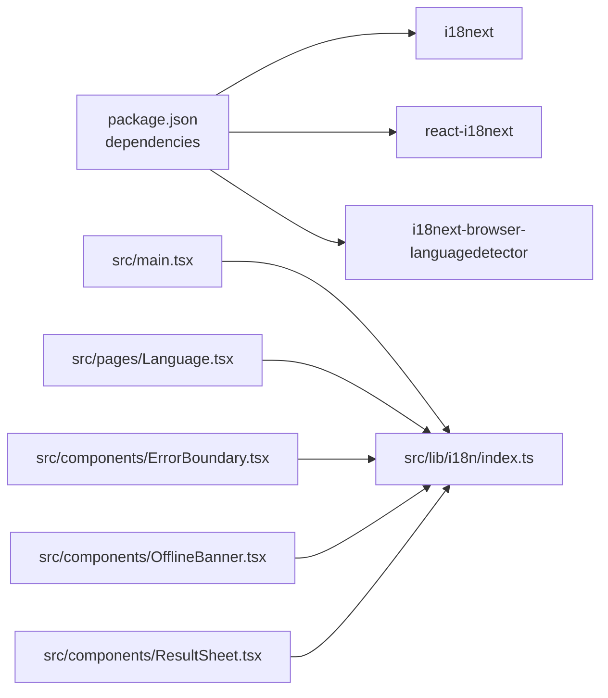

# Internationalization

<cite>
**Referenced Files in This Document**
- [index.ts](file://src/lib/i18n/index.ts)
- [en.json](file://src/lib/i18n/locales/en.json)
- [ur.json](file://src/lib/i18n/locales/ur.json)
- [Language.tsx](file://src/pages/Language.tsx)
- [main.tsx](file://src/main.tsx)
- [ErrorBoundary.tsx](file://src/components/ErrorBoundary.tsx)
- [OfflineBanner.tsx](file://src/components/OfflineBanner.tsx)
- [ResultSheet.tsx](file://src/components/ResultSheet.tsx)
- [package.json](file://package.json)
</cite>

## Table of Contents
1. [Introduction](#introduction)
2. [Project Structure](#project-structure)
3. [Core Components](#core-components)
4. [Architecture Overview](#architecture-overview)
5. [Detailed Component Analysis](#detailed-component-analysis)
6. [Dependency Analysis](#dependency-analysis)
7. [Performance Considerations](#performance-considerations)
8. [Troubleshooting Guide](#troubleshooting-guide)
9. [Conclusion](#conclusion)
10. [Appendices](#appendices)

## Introduction
This document explains Smart Scan Pro’s internationalization (i18n) system built on i18next and react-i18next. It covers how language resources are organized, the structure of translation files, dynamic language switching, RTL support, adding new languages, managing keys, extraction workflow, UI for language selection, persistence of user preferences, performance considerations for large translation sets, lazy loading strategies, and best practices for implementing new translatable features while maintaining consistency.

## Project Structure
The i18n implementation is centralized under src/lib/i18n with per-language JSON files under src/lib/i18n/locales. The application initializes i18n early during bootstrap so that all components can use translations from the start.

**Diagram sources**
- [main.tsx:1-24](file://src/main.tsx#L1-L24)
- [index.ts:1-96](file://src/lib/i18n/index.ts#L1-L96)
- [en.json:1-222](file://src/lib/i18n/locales/en.json#L1-L222)
- [Language.tsx:1-68](file://src/pages/Language.tsx#L1-L68)
- [ErrorBoundary.tsx:1-71](file://src/components/ErrorBoundary.tsx#L1-L71)
- [OfflineBanner.tsx:1-18](file://src/components/OfflineBanner.tsx#L1-L18)
- [ResultSheet.tsx:309-335](file://src/components/ResultSheet.tsx#L309-L335)

**Section sources**
- [main.tsx:1-24](file://src/main.tsx#L1-L24)
- [index.ts:1-96](file://src/lib/i18n/index.ts#L1-L96)

## Core Components
- i18n initialization and configuration
  - Uses i18next with initReactI18next and i18next-browser-languagedetector.
  - Loads bundled locale JSONs into a resources map keyed by language code.
  - Sets fallback language to English and supported languages list.
  - Uses load: "currentOnly" to avoid preloading all locales at startup.
  - Detects language from localStorage first, then navigator; caches in localStorage.
  - Applies document direction and lang attributes based on language metadata.
- Language metadata and runtime helpers
  - Exposes a typed LanguageCode union and LanguageMeta interface.
  - Provides SUPPORTED_LANGUAGES array including dir ("ltr" | "rtl").
  - Exposes setAppLanguage(code) to change language, persist preference, and update text direction.
  - Exposes applyDocumentDirection(code) to set HTML dir and lang attributes.
- Translation resource files
  - Each language has a single JSON file under src/lib/i18n/locales/<code>.json.
  - Keys are grouped by feature area (e.g., app, nav, common, scan, history, generate, result, safety, privacy, profile, language, shareQR, onboarding, errors, notFound, errorBoundary).
  - Supports interpolation placeholders like {{n}} for dynamic values.
- Language selection UI
  - Language screen lists all supported languages with native and English labels.
  - Clicking a language calls setAppLanguage and persists the choice.
  - Displays current selection state and applies correct text direction per language.

**Section sources**
- [index.ts:14-42](file://src/lib/i18n/index.ts#L14-L42)
- [index.ts:46-72](file://src/lib/i18n/index.ts#L46-L72)
- [index.ts:74-93](file://src/lib/i18n/index.ts#L74-L93)
- [en.json:1-222](file://src/lib/i18n/locales/en.json#L1-L222)
- [Language.tsx:1-68](file://src/pages/Language.tsx#L1-L68)

## Architecture Overview
The i18n architecture follows a simple, cohesive pattern:
- Initialization occurs once at app bootstrap.
- Components consume translations via the t function or i18n instance.
- User-driven language changes trigger i18n updates, persistence, and DOM attribute adjustments.

**Diagram sources**
- [main.tsx:1-24](file://src/main.tsx#L1-L24)
- [index.ts:57-72](file://src/lib/i18n/index.ts#L57-L72)
- [en.json:1-222](file://src/lib/i18n/locales/en.json#L1-L222)
- [ErrorBoundary.tsx:40-62](file://src/components/ErrorBoundary.tsx#L40-L62)
- [OfflineBanner.tsx:12-15](file://src/components/OfflineBanner.tsx#L12-L15)
- [ResultSheet.tsx:309-335](file://src/components/ResultSheet.tsx#L309-L335)

## Detailed Component Analysis

### i18n Configuration and Runtime API
- Resource registration
  - Bundles each locale JSON into a resources object keyed by language code.
  - Registers plugins: LanguageDetector and initReactI18next.
  - Configures detection order: localStorage then navigator; caches in localStorage.
- Language switching
  - setAppLanguage(code):
    - Changes active language via i18n.changeLanguage.
    - Persists the chosen code to localStorage.
    - Updates document.documentElement dir and lang attributes.
- Direction handling
  - applyDocumentDirection(code):
    - Looks up meta from SUPPORTED_LANGUAGES.
    - Sets dir to "rtl" for Urdu, otherwise "ltr".
    - Sets lang attribute to the matched code or fallback.

**Diagram sources**
- [index.ts:74-93](file://src/lib/i18n/index.ts#L74-L93)

**Section sources**
- [index.ts:46-72](file://src/lib/i18n/index.ts#L46-L72)
- [index.ts:74-93](file://src/lib/i18n/index.ts#L74-L93)

### Language Selection Interface
- Lists all supported languages with nativeLabel and englishLabel.
- Highlights the currently selected language.
- On selection:
  - Calls setAppLanguage(lang.code).
  - Immediately re-renders UI with new language.
  - Persists choice and updates text direction.

**Diagram sources**
- [Language.tsx:1-68](file://src/pages/Language.tsx#L1-L68)
- [index.ts:74-93](file://src/lib/i18n/index.ts#L74-L93)

**Section sources**
- [Language.tsx:1-68](file://src/pages/Language.tsx#L1-L68)

### Usage Across Components
- Components import i18n directly or use the useTranslation hook to access t().
- Examples include:
  - ErrorBoundary uses i18n.t(...) for error messages and actions.
  - OfflineBanner uses t("errors.offline") to show offline status.
  - ResultSheet uses t(...) for action labels and feedback messages.

**Diagram sources**
- [index.ts:1-96](file://src/lib/i18n/index.ts#L1-L96)
- [ErrorBoundary.tsx:40-62](file://src/components/ErrorBoundary.tsx#L40-L62)
- [OfflineBanner.tsx:12-15](file://src/components/OfflineBanner.tsx#L12-L15)
- [ResultSheet.tsx:309-335](file://src/components/ResultSheet.tsx#L309-L335)

**Section sources**
- [ErrorBoundary.tsx:1-71](file://src/components/ErrorBoundary.tsx#L1-L71)
- [OfflineBanner.tsx:1-18](file://src/components/OfflineBanner.tsx#L1-18)
- [ResultSheet.tsx:309-335](file://src/components/ResultSheet.tsx#L309-L335)

## Dependency Analysis
- External dependencies
  - i18next, react-i18next, i18next-browser-languagedetector are declared in package.json.
- Internal dependencies
  - main.tsx imports the i18n module to initialize it before rendering App.
  - Pages and components depend on i18n exports (SUPPORTED_LANGUAGES, setAppLanguage, t).

**Diagram sources**
- [package.json:34-45](file://package.json#L34-L45)
- [main.tsx:1-24](file://src/main.tsx#L1-L24)
- [index.ts:1-96](file://src/lib/i18n/index.ts#L1-L96)
- [Language.tsx:1-68](file://src/pages/Language.tsx#L1-L68)
- [ErrorBoundary.tsx:1-71](file://src/components/ErrorBoundary.tsx#L1-L71)
- [OfflineBanner.tsx:1-18](file://src/components/OfflineBanner.tsx#L1-18)
- [ResultSheet.tsx:309-335](file://src/components/ResultSheet.tsx#L309-L335)

**Section sources**
- [package.json:34-45](file://package.json#L34-L45)
- [main.tsx:1-24](file://src/main.tsx#L1-L24)

## Performance Considerations
- Current strategy
  - load: "currentOnly" ensures only the detected language is loaded at startup, minimizing initial bundle size.
  - All locales are statically imported and included in the build; this simplifies setup but increases total payload if many languages are added.
- Recommendations for large translation sets
  - Switch to dynamic imports for locales when scaling beyond a small number of languages.
  - Implement a loader that fetches locale JSON on demand and registers it via i18n.addResourceBundle.
  - Cache fetched locales in memory and optionally in localStorage to avoid repeated network requests.
  - Consider splitting large JSON files into namespaces and loading only required namespaces per route.
- Interpolation and rendering
  - Keep interpolation parameters minimal and avoid heavy computations inside templates.
  - Prefer stable key names to reduce unnecessary re-renders across components.

[No sources needed since this section provides general guidance]

## Troubleshooting Guide
- Language does not change
  - Verify that setAppLanguage is called with a valid LanguageCode present in SUPPORTED_LANGUAGES.
  - Ensure localStorage is writable; the setter wraps storage writes in try/catch and ignores failures.
- Text direction incorrect
  - Confirm applyDocumentDirection is invoked after language change.
  - Check that the language code maps to a LanguageMeta entry with the expected dir value.
- Missing translations
  - Ensure the target locale JSON exists and includes the requested key path.
  - Fallback language is English; missing keys will render empty strings unless configured otherwise.
- Debugging tips
  - Inspect document.documentElement attributes (dir, lang) to verify direction and language.
  - Check localStorage for the "scaniq-language" key.
  - Use browser dev tools to confirm i18n.language and i18n.resolvedLanguage values.

**Section sources**
- [index.ts:74-93](file://src/lib/i18n/index.ts#L74-L93)

## Conclusion
Smart Scan Pro’s i18n system is straightforward and effective for its scope: centralized configuration, bundled locale resources, robust language detection, persistent user preference, and automatic RTL support. For future growth, consider dynamic loading and namespace-based organization to keep performance optimal as the number of languages and keys expands.

[No sources needed since this section summarizes without analyzing specific files]

## Appendices

### Adding a New Language
- Create a new JSON file under src/lib/i18n/locales/<code>.json mirroring the structure of en.json.
- Add an entry to SUPPORTED_LANGUAGES in src/lib/i18n/index.ts with code, englishLabel, nativeLabel, and dir.
- Register the new locale in the resources map within the same file.
- Update the LanguageCode type union to include the new code.
- Test language switching and ensure text direction is applied correctly.

**Section sources**
- [index.ts:14-42](file://src/lib/i18n/index.ts#L14-L42)
- [index.ts:46-72](file://src/lib/i18n/index.ts#L46-L72)

### Managing Translation Keys
- Organize keys by feature area (app, nav, common, scan, history, generate, result, safety, privacy, profile, language, shareQR, onboarding, errors, notFound, errorBoundary).
- Use consistent naming conventions and hierarchical grouping.
- Leverage interpolation placeholders (e.g., {{n}}) for dynamic content.
- Maintain parity across locales to prevent missing key warnings.

**Section sources**
- [en.json:1-222](file://src/lib/i18n/locales/en.json#L1-L222)
- [ur.json:1-208](file://src/lib/i18n/locales/ur.json#L1-L208)

### Implementation Guidelines for New Features
- Wrap all user-visible strings with t("feature.key") or i18n.t("feature.key").
- Avoid hardcoding strings in components; always reference translation keys.
- When introducing new UI flows, add corresponding keys to all existing locales to maintain consistency.
- If a feature requires pluralization or context-specific variants, plan for i18next features (e.g., ns, plural forms) and extend resource structure accordingly.

**Section sources**
- [ErrorBoundary.tsx:40-62](file://src/components/ErrorBoundary.tsx#L40-L62)
- [OfflineBanner.tsx:12-15](file://src/components/OfflineBanner.tsx#L12-L15)
- [ResultSheet.tsx:309-335](file://src/components/ResultSheet.tsx#L309-L335)