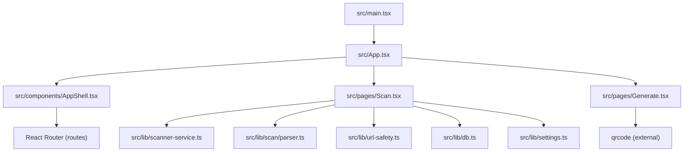
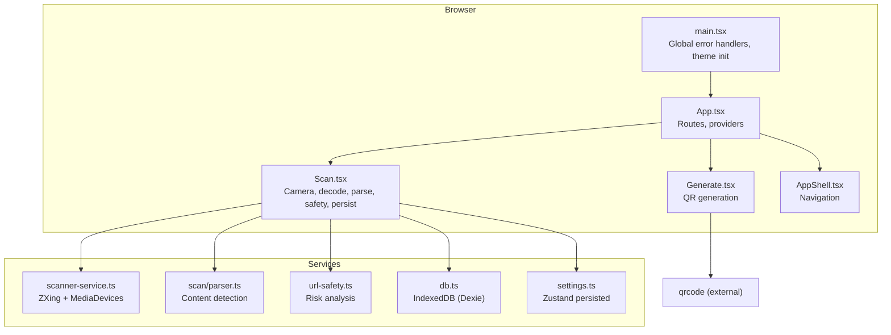
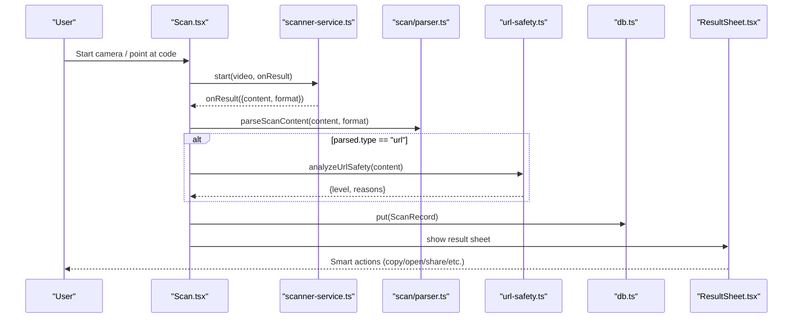
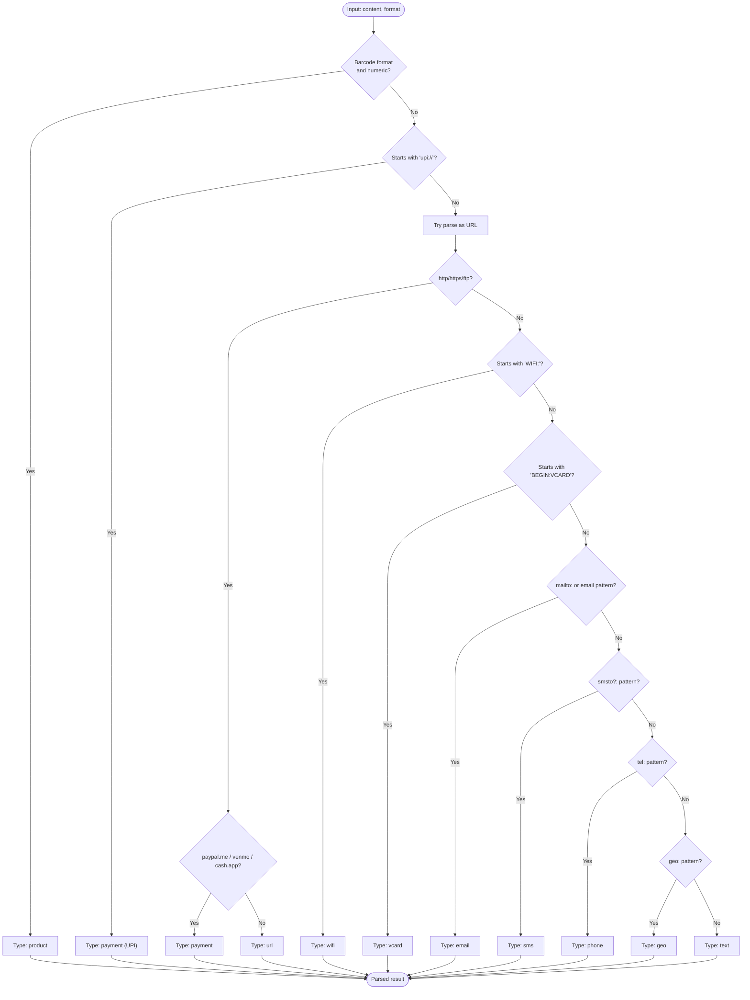
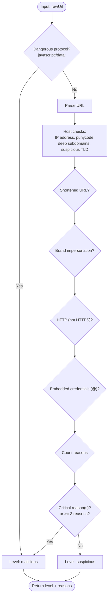
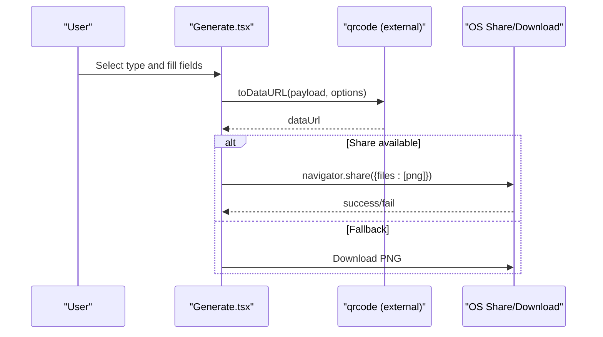
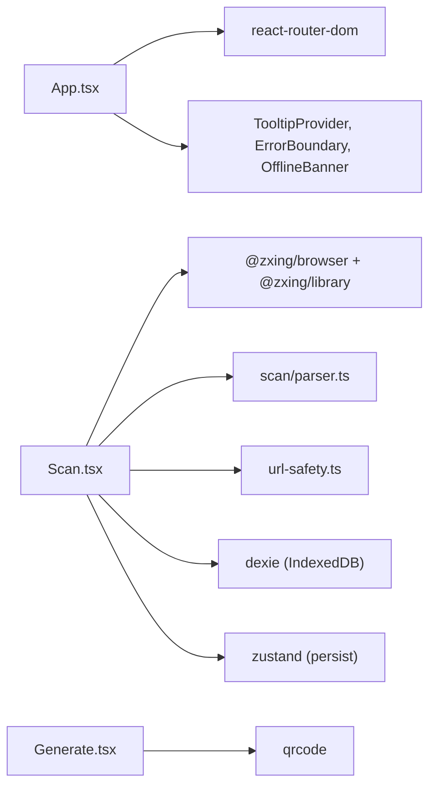

# Project Overview

<cite>
**Referenced Files in This Document**
- [package.json](file://package.json)
- [vite.config.ts](file://vite.config.ts)
- [src/main.tsx](file://src/main.tsx)
- [src/App.tsx](file://src/App.tsx)
- [src/components/AppShell.tsx](file://src/components/AppShell.tsx)
- [src/pages/Scan.tsx](file://src/pages/Scan.tsx)
- [src/lib/scanner-service.ts](file://src/lib/scanner-service.ts)
- [src/lib/scan/parser.ts](file://src/lib/scan/parser.ts)
- [src/lib/url-safety.ts](file://src/lib/url-safety.ts)
- [src/lib/db.ts](file://src/lib/db.ts)
- [src/lib/settings.ts](file://src/lib/settings.ts)
- [src/components/ResultSheet.tsx](file://src/components/ResultSheet.tsx)
- [src/pages/Generate.tsx](file://src/pages/Generate.tsx)
</cite>

## Table of Contents
1. [Introduction](#introduction)
2. [Project Structure](#project-structure)
3. [Core Components](#core-components)
4. [Architecture Overview](#architecture-overview)
5. [Detailed Component Analysis](#detailed-component-analysis)
6. [Dependency Analysis](#dependency-analysis)
7. [Performance Considerations](#performance-considerations)
8. [Troubleshooting Guide](#troubleshooting-guide)
9. [Conclusion](#conclusion)

## Introduction
Smart Scan Pro is a cross-platform, browser-based QR code and barcode scanning web application designed for both developers and end users. It provides:
- Multi-format barcode scanning (QR codes, EAN/UPC, Code 128/39/93, ITF, Data Matrix, PDF 417, Aztec)
- Intelligent content parsing to detect URLs, WiFi credentials, vCards, email/SMS/phone links, geo links, product codes, and payment links
- URL safety analysis with clear risk indicators and warnings
- QR code generation for multiple content types (URL, text, WiFi, vCard, email, SMS, phone)
- Modern UX with offline readiness, haptics, and accessibility-friendly controls

Target audience:
- End users who need a fast, privacy-first scanner on mobile or desktop browsers
- Developers integrating scanning into web apps without native dependencies

Technology stack:
- React 18 with TypeScript
- Vite build tooling and SWC plugin
- ZXing Browser library for decoding
- Web APIs: MediaDevices, Permissions, Clipboard, Share, IndexedDB via Dexie
- State management via Zustand; UI components from Radix + Tailwind

System boundaries:
- Runs entirely in the browser; no backend required
- Uses local storage (IndexedDB) for scan history and generated codes
- Integrates with system actions (open link, call, mailto, sms, share) through standard web APIs

Practical examples:
- Scan a product barcode and copy the number automatically based on settings
- Scan a WiFi QR and copy the password with one tap
- Generate a WiFi QR with SSID and encryption type, then download or share it
- Open a scanned URL only if safety analysis indicates safe or after explicit confirmation

**Section sources**
- [package.json:1-70](file://package.json#L1-L70)
- [vite.config.ts:1-23](file://vite.config.ts#L1-L23)
- [src/main.tsx:1-24](file://src/main.tsx#L1-L24)
- [src/App.tsx:1-100](file://src/App.tsx#L1-L100)

## Project Structure
The app follows a feature-oriented layout with shared libraries and reusable UI primitives:
- src/pages: Top-level screens (Scan, History, Generate, Profile, etc.)
- src/components: Shared UI and shell components
- src/lib: Core services (scanner, parser, safety, database, settings)
- Public assets and configuration at repository root

**Diagram sources**
- [src/main.tsx:1-24](file://src/main.tsx#L1-L24)
- [src/App.tsx:1-100](file://src/App.tsx#L1-L100)
- [src/components/AppShell.tsx:1-63](file://src/components/AppShell.tsx#L1-L63)
- [src/pages/Scan.tsx:1-488](file://src/pages/Scan.tsx#L1-L488)
- [src/pages/Generate.tsx:1-225](file://src/pages/Generate.tsx#L1-L225)
- [src/lib/scanner-service.ts:1-198](file://src/lib/scanner-service.ts#L1-L198)
- [src/lib/scan/parser.ts:1-102](file://src/lib/scan/parser.ts#L1-L102)
- [src/lib/url-safety.ts:1-106](file://src/lib/url-safety.ts#L1-L106)
- [src/lib/db.ts:1-37](file://src/lib/db.ts#L1-L37)
- [src/lib/settings.ts:1-35](file://src/lib/settings.ts#L1-L35)

**Section sources**
- [src/App.tsx:1-100](file://src/App.tsx#L1-L100)
- [src/components/AppShell.tsx:1-63](file://src/components/AppShell.tsx#L1-L63)

## Core Components
- Scanner service: Wraps ZXing Browser, manages camera stream, torch, zoom, and file-based scanning. Exposes a stable interface for start/stop and device capabilities.
- Content parser: Detects content types (URL, WiFi, vCard, email, SMS, phone, geo, product, payment, text) and returns structured data for downstream actions.
- URL safety analyzer: Evaluates URLs for risks such as dangerous protocols, IP hosts, punycode/homograph, deep subdomains, suspicious TLDs, shorteners, brand impersonation, HTTP, and embedded credentials.
- Database layer: IndexedDB via Dexie for scans and generated codes, including automatic pruning of free-tier history.
- Settings store: Persisted Zustand state for user preferences (auto-open, auto-copy, auto-wifi, theme).
- Result sheet: Context-aware actions per content type, safety badges, favorites, copy/share, and translation shortcuts.
- QR generator: Builds QR images for various payloads and supports download or native share.

**Section sources**
- [src/lib/scanner-service.ts:1-198](file://src/lib/scanner-service.ts#L1-L198)
- [src/lib/scan/parser.ts:1-102](file://src/lib/scan/parser.ts#L1-L102)
- [src/lib/url-safety.ts:1-106](file://src/lib/url-safety.ts#L1-L106)
- [src/lib/db.ts:1-37](file://src/lib/db.ts#L1-L37)
- [src/lib/settings.ts:1-35](file://src/lib/settings.ts#L1-L35)
- [src/components/ResultSheet.tsx:1-418](file://src/components/ResultSheet.tsx#L1-L418)
- [src/pages/Generate.tsx:1-225](file://src/pages/Generate.tsx#L1-L225)

## Architecture Overview
High-level flow: The app bootstraps React, sets up routing, and renders the main shell. The Scan page initializes the camera, decodes barcodes/QR codes using ZXing, parses results, performs safety checks, persists records, and presents actionable insights. The Generate page creates QR codes client-side.

**Diagram sources**
- [src/main.tsx:1-24](file://src/main.tsx#L1-L24)
- [src/App.tsx:1-100](file://src/App.tsx#L1-L100)
- [src/pages/Scan.tsx:1-488](file://src/pages/Scan.tsx#L1-L488)
- [src/pages/Generate.tsx:1-225](file://src/pages/Generate.tsx#L1-L225)
- [src/components/AppShell.tsx:1-63](file://src/components/AppShell.tsx#L1-L63)
- [src/lib/scanner-service.ts:1-198](file://src/lib/scanner-service.ts#L1-L198)
- [src/lib/scan/parser.ts:1-102](file://src/lib/scan/parser.ts#L1-L102)
- [src/lib/url-safety.ts:1-106](file://src/lib/url-safety.ts#L1-L106)
- [src/lib/db.ts:1-37](file://src/lib/db.ts#L1-L37)
- [src/lib/settings.ts:1-35](file://src/lib/settings.ts#L1-L35)

## Detailed Component Analysis

### Scanning Flow (Sequence)
This sequence shows how a live camera scan is processed end-to-end.

**Diagram sources**
- [src/pages/Scan.tsx:1-488](file://src/pages/Scan.tsx#L1-L488)
- [src/lib/scanner-service.ts:1-198](file://src/lib/scanner-service.ts#L1-L198)
- [src/lib/scan/parser.ts:1-102](file://src/lib/scan/parser.ts#L1-L102)
- [src/lib/url-safety.ts:1-106](file://src/lib/url-safety.ts#L1-L106)
- [src/lib/db.ts:1-37](file://src/lib/db.ts#L1-L37)
- [src/components/ResultSheet.tsx:1-418](file://src/components/ResultSheet.tsx#L1-L418)

**Section sources**
- [src/pages/Scan.tsx:1-488](file://src/pages/Scan.tsx#L1-L488)

### Content Parsing Logic (Flowchart)
How raw strings are classified into actionable types.

**Diagram sources**
- [src/lib/scan/parser.ts:1-102](file://src/lib/scan/parser.ts#L1-L102)

**Section sources**
- [src/lib/scan/parser.ts:1-102](file://src/lib/scan/parser.ts#L1-L102)

### URL Safety Analysis (Flowchart)
Decision logic used to classify URLs as safe, suspicious, or malicious.

**Diagram sources**
- [src/lib/url-safety.ts:1-106](file://src/lib/url-safety.ts#L1-L106)

**Section sources**
- [src/lib/url-safety.ts:1-106](file://src/lib/url-safety.ts#L1-L106)

### QR Generation Flow (Sequence)
Client-side generation and sharing/download options.

**Diagram sources**
- [src/pages/Generate.tsx:1-225](file://src/pages/Generate.tsx#L1-L225)

**Section sources**
- [src/pages/Generate.tsx:1-225](file://src/pages/Generate.tsx#L1-L225)

## Dependency Analysis
Key runtime and build-time dependencies:
- Build and dev tooling: Vite, SWC React plugin, ESLint, Vitest
- UI and UX: Radix primitives, Tailwind CSS, Sonner toasts, Framer Motion
- Scanning: @zxing/browser and @zxing/library
- QR generation: qrcode
- Persistence: Dexie (IndexedDB), zustand with persist middleware
- Routing: react-router-dom
- i18n: i18next + react-i18next + language detector

**Diagram sources**
- [src/App.tsx:1-100](file://src/App.tsx#L1-L100)
- [src/pages/Scan.tsx:1-488](file://src/pages/Scan.tsx#L1-L488)
- [src/pages/Generate.tsx:1-225](file://src/pages/Generate.tsx#L1-L225)
- [package.json:1-70](file://package.json#L1-L70)

**Section sources**
- [package.json:1-70](file://package.json#L1-L70)
- [vite.config.ts:1-23](file://vite.config.ts#L1-L23)

## Performance Considerations
- Lazy-loaded routes reduce initial bundle size and improve Time to Interactive.
- ZXing reader is initialized lazily and configured with reasonable constraints and delay between attempts to balance accuracy and CPU usage.
- Debounced zoom updates use requestAnimationFrame to avoid excessive MediaTrack constraint writes.
- IndexedDB operations are batched where possible; history pruning prevents unbounded growth.
- Avoid unnecessary re-renders by memoizing computed values and stabilizing callbacks.

[No sources needed since this section provides general guidance]

## Troubleshooting Guide
Common issues and resolutions:
- Camera permission denied: The app detects denied states and guides users to retry or open system settings. If permanently denied, prompt includes a settings link.
- No camera devices: Enumerates devices and shows an informative overlay when none are found.
- Torch/zoom not supported: Gracefully hides unavailable controls and continues scanning.
- Storage failures: Toast notifications inform users when saving scan records fails.
- Global errors: Unhandled errors and promise rejections are logged to aid debugging.

Operational tips:
- Use image upload or manual input when camera is unavailable.
- For risky URLs, confirm before opening; consider copying instead of opening directly.
- Clear or manage history via the history screen; favorites are preserved during pruning.

**Section sources**
- [src/pages/Scan.tsx:1-488](file://src/pages/Scan.tsx#L1-L488)
- [src/components/ResultSheet.tsx:1-418](file://src/components/ResultSheet.tsx#L1-L418)
- [src/lib/db.ts:1-37](file://src/lib/db.ts#L1-L37)
- [src/main.tsx:1-24](file://src/main.tsx#L1-L24)

## Conclusion
Smart Scan Pro delivers a robust, privacy-conscious scanning experience entirely within the browser. Its modular architecture separates concerns across scanning, parsing, safety analysis, persistence, and UI, enabling easy maintenance and extension. With multi-format support, intelligent content handling, and practical utilities like QR generation and safety warnings, it serves both everyday users and developers seeking a reliable, cross-platform solution.

[No sources needed since this section summarizes without analyzing specific files]