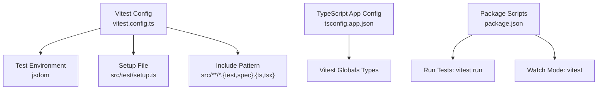
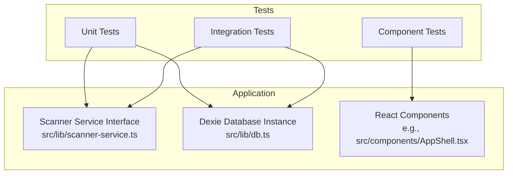
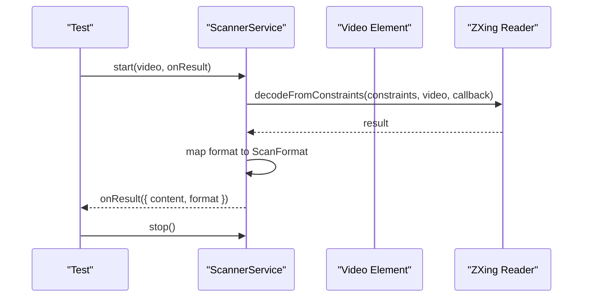
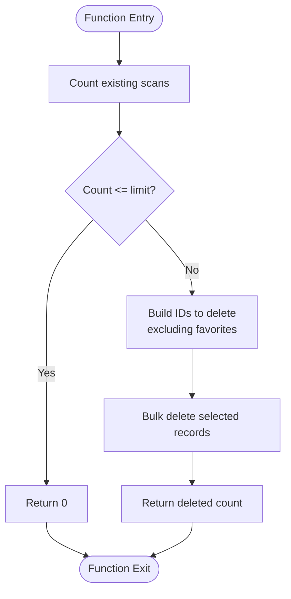
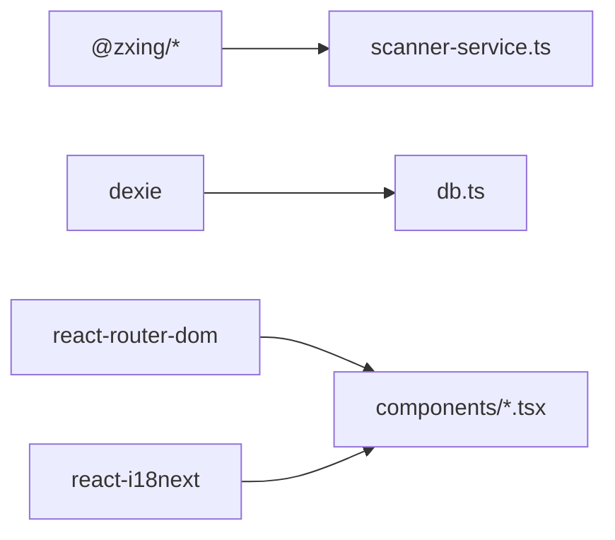

# Testing Strategy

<cite>
**Referenced Files in This Document**
- [vitest.config.ts](file://vitest.config.ts)
- [setup.ts](file://src/test/setup.ts)
- [package.json](file://package.json)
- [tsconfig.app.json](file://tsconfig.app.json)
- [scanner-service.ts](file://src/lib/scanner-service.ts)
- [db.ts](file://src/lib/db.ts)
- [types.ts](file://src/lib/scan/types.ts)
- [AppShell.tsx](file://src/components/AppShell.tsx)
</cite>

## Table of Contents
1. Introduction
2. Project Structure
3. Core Components
4. Architecture Overview
5. Detailed Component Analysis
6. Dependency Analysis
7. Performance Considerations
8. Troubleshooting Guide
9. Conclusion

## Introduction
This document defines the testing strategy for Smart Scan Pro using Vitest and React Testing Library. It covers test organization, mocking strategies, component and hook testing patterns, integration tests for services and database operations, naming conventions, assertion patterns, configuration, CI considerations, performance testing, debugging techniques, and examples for common scenarios such as barcode scanning, data persistence, and user interactions.

## Project Structure
The project uses a standard Vitest setup with jsdom environment, global test APIs, and a shared setup file. Tests are discovered by pattern matching under src with .test or .spec suffixes. The TypeScript configuration enables Vitest globals for type safety.

**Diagram sources**
- [vitest.config.ts:1-17](file://vitest.config.ts#L1-L17)
- [setup.ts:1-16](file://src/test/setup.ts#L1-L16)
- [tsconfig.app.json:1-30](file://tsconfig.app.json#L1-L30)
- [package.json:1-70](file://package.json#L1-L70)

**Section sources**
- [vitest.config.ts:1-17](file://vitest.config.ts#L1-L17)
- [setup.ts:1-16](file://src/test/setup.ts#L1-L16)
- [tsconfig.app.json:1-30](file://tsconfig.app.json#L1-L30)
- [package.json:1-70](file://package.json#L1-L70)

## Core Components
- Test runner and environment:
  - Vitest is configured to use jsdom, enable globals, and include tests via a glob pattern.
  - A setup file initializes DOM matchers and polyfills window.matchMedia.
- Type support:
  - TypeScript app config includes Vitest globals types so describe/it/expect are typed.
- Scripts:
  - package.json exposes test and test:watch scripts that invoke Vitest.

Key implementation references:
- Vitest configuration and discovery: [vitest.config.ts:1-17](file://vitest.config.ts#L1-L17)
- Global setup and polyfills: [setup.ts:1-16](file://src/test/setup.ts#L1-L16)
- TypeScript globals: [tsconfig.app.json:1-30](file://tsconfig.app.json#L1-L30)
- NPM scripts: [package.json:1-70](file://package.json#L1-L70)

**Section sources**
- [vitest.config.ts:1-17](file://vitest.config.ts#L1-L17)
- [setup.ts:1-16](file://src/test/setup.ts#L1-L16)
- [tsconfig.app.json:1-30](file://tsconfig.app.json#L1-L30)
- [package.json:1-70](file://package.json#L1-L70)

## Architecture Overview
Testing architecture centers on isolating external dependencies (camera, media devices, IndexedDB) behind interfaces and singletons, enabling deterministic unit and integration tests.

[No sources needed since this diagram shows conceptual workflow, not actual code structure]

## Detailed Component Analysis

### Unit Testing Strategy
- Scope: Pure functions, utility logic, service interfaces, and stateful modules without side effects.
- Organization:
  - Place tests next to source files or under a parallel test directory.
  - Use .test.ts/.test.tsx or .spec.ts/.spec.tsx filenames; Vitest discovers them automatically.
- Mocking strategies:
  - Replace browser APIs (mediaDevices, MediaStreamTrack) with Jest-compatible mocks when needed.
  - For singleton services, replace the exported instance or factory function with a mock implementation.
- Assertions:
  - Prefer explicit assertions over snapshot-only checks.
  - Validate both happy paths and error branches.

Example reference points:
- Scanner service interface and singleton accessor: [scanner-service.ts:1-198](file://src/lib/scanner-service.ts#L1-L198)
- Database class and helper: [db.ts:1-37](file://src/lib/db.ts#L1-L37)

**Section sources**
- [scanner-service.ts:1-198](file://src/lib/scanner-service.ts#L1-L198)
- [db.ts:1-37](file://src/lib/db.ts#L1-L37)

### Component Testing Patterns (React)
- Rendering:
  - Render components with React Testing Library inside a minimal router context if routing is involved.
- Interactions:
  - Simulate user actions (clicks, input changes) and assert visible text, attributes, and navigation outcomes.
- Internationalization:
  - Provide a minimal i18n setup or mock translation hooks to avoid missing keys.
- Styling and layout:
  - Assert presence of key elements and roles rather than CSS classes.

Example reference point:
- Shell component with navigation and translations: [AppShell.tsx:1-63](file://src/components/AppShell.tsx#L1-L63)

**Section sources**
- [AppShell.tsx:1-63](file://src/components/AppShell.tsx#L1-L63)

### Hook Testing Patterns
- Isolate hooks from UI by rendering them within a provider wrapper if they depend on context.
- Trigger re-renders and async updates; assert state transitions and side effects via callbacks.

[No sources needed since this section doesn't analyze specific files]

### Integration Testing Approaches
- Services:
  - Integrate with real implementations where possible, but stub network/media calls.
  - For scanner service, provide a mock implementation of the interface to simulate results deterministically.
- Database:
  - Use an in-memory or isolated Dexie instance per test suite to avoid cross-test pollution.
  - Seed data before tests and clean up after each test.

Reference points:
- Scanner service interface and singleton: [scanner-service.ts:1-198](file://src/lib/scanner-service.ts#L1-L198)
- Dexie schema and helpers: [db.ts:1-37](file://src/lib/db.ts#L1-L37)
- Data models used by DB: [types.ts:1-49](file://src/lib/scan/types.ts#L1-L49)

**Section sources**
- [scanner-service.ts:1-198](file://src/lib/scanner-service.ts#L1-L198)
- [db.ts:1-37](file://src/lib/db.ts#L1-L37)
- [types.ts:1-49](file://src/lib/scan/types.ts#L1-L49)

### Barcode Scanning Flow (Sequence Diagram)

**Diagram sources**
- [scanner-service.ts:80-131](file://src/lib/scanner-service.ts#L80-L131)
- [scanner-service.ts:147-149](file://src/lib/scanner-service.ts#L147-L149)
- [types.ts:1-49](file://src/lib/scan/types.ts#L1-L49)

### Data Persistence Flow (Flowchart)

**Diagram sources**
- [db.ts:21-36](file://src/lib/db.ts#L21-L36)

## Dependency Analysis
External dependencies relevant to testing:
- @zxing/browser and @zxing/library: Used by the scanner service; should be mocked in tests.
- dexie and dexie-react-hooks: IndexedDB-backed persistence; isolate with separate instances in tests.
- react-router-dom and react-i18next: Require minimal providers/mocks in component tests.

**Diagram sources**
- [scanner-service.ts:1-198](file://src/lib/scanner-service.ts#L1-L198)
- [db.ts:1-37](file://src/lib/db.ts#L1-L37)
- [AppShell.tsx:1-63](file://src/components/AppShell.tsx#L1-L63)

**Section sources**
- [scanner-service.ts:1-198](file://src/lib/scanner-service.ts#L1-L198)
- [db.ts:1-37](file://src/lib/db.ts#L1-L37)
- [AppShell.tsx:1-63](file://src/components/AppShell.tsx#L1-L63)

## Performance Considerations
- Keep unit tests fast by avoiding heavy libraries; mock ZXing and IndexedDB.
- Use small datasets for integration tests; reset database state between tests.
- Avoid unnecessary re-renders in component tests by memoizing inputs and minimizing context providers.
- Measure coverage and identify slow tests; split large suites into focused groups.

[No sources needed since this section provides general guidance]

## Troubleshooting Guide
Common issues and resolutions:
- Missing DOM APIs: Ensure jsdom environment and setup file are loaded.
- Polyfills: Add window.matchMedia polyfill in setup if components rely on it.
- Router/i18n in tests: Wrap components with necessary providers or mock hooks.
- Singleton interference: Reset module state or replace singletons between tests.

Configuration references:
- Environment and setup: [vitest.config.ts:1-17](file://vitest.config.ts#L1-L17), [setup.ts:1-16](file://src/test/setup.ts#L1-L16)

**Section sources**
- [vitest.config.ts:1-17](file://vitest.config.ts#L1-L17)
- [setup.ts:1-16](file://src/test/setup.ts#L1-L16)

## Conclusion
Smart Scan Pro’s testing strategy leverages Vitest with jsdom, clear configuration, and strong isolation through interfaces and singletons. By mocking external systems (camera, IndexedDB) and following consistent patterns for unit, component, and integration tests, the team can maintain fast, reliable, and readable tests across the application.

[No sources needed since this section summarizes without analyzing specific files]

## Appendices

### Guidelines for Writing Effective Tests
- Naming conventions:
  - Use descriptive names that express behavior: “should return UNKNOWN format when barcode is unrecognized”.
  - Group related tests with nested describe blocks.
- Assertion patterns:
  - Prefer explicit equality and existence checks over snapshots.
  - Validate both success and failure paths.
- Test utilities:
  - Centralize common mocks (scanner service, DB instance, i18n, router).
  - Create helpers for seeding data and asserting UI states.

[No sources needed since this section doesn't analyze specific files]

### Test Setup Configuration
- Environment: jsdom
- Globals: enabled
- Setup file: src/test/setup.ts
- Include pattern: src/**/*.{test,spec}.{ts,tsx}
- TypeScript globals: included via tsconfig

References:
- [vitest.config.ts:1-17](file://vitest.config.ts#L1-L17)
- [setup.ts:1-16](file://src/test/setup.ts#L1-L16)
- [tsconfig.app.json:1-30](file://tsconfig.app.json#L1-L30)

**Section sources**
- [vitest.config.ts:1-17](file://vitest.config.ts#L1-L17)
- [setup.ts:1-16](file://src/test/setup.ts#L1-L16)
- [tsconfig.app.json:1-30](file://tsconfig.app.json#L1-L30)

### Continuous Integration Considerations
- Run tests headlessly with vitest run.
- Cache node_modules and dependency artifacts to speed up builds.
- Parallelize test execution where possible.
- Collect coverage reports and enforce thresholds.
- Fail the pipeline on test failures and lint errors.

[No sources needed since this section provides general guidance]

### Debugging Techniques
- Use Vitest watch mode for rapid feedback during development.
- Inspect rendered output with debug utilities from React Testing Library.
- Log intermediate values in pure functions and service methods.
- Isolate failing tests by running them individually.

References:
- Scripts: [package.json:1-70](file://package.json#L1-L70)

**Section sources**
- [package.json:1-70](file://package.json#L1-L70)

### Examples of Common Scenarios

- Barcode scanning:
  - Mock the scanner service interface to emit deterministic results.
  - Verify that UI reacts to results and formats are mapped correctly.
  - References: [scanner-service.ts:1-198](file://src/lib/scanner-service.ts#L1-L198), [types.ts:1-49](file://src/lib/scan/types.ts#L1-L49)

- Data persistence:
  - Use a fresh Dexie instance per test suite.
  - Seed scan records and verify pruning behavior against limits.
  - References: [db.ts:1-37](file://src/lib/db.ts#L1-L37), [types.ts:1-49](file://src/lib/scan/types.ts#L1-L49)

- User interactions:
  - Render shell and navigate via NavLink; assert active tab and labels.
  - Provide minimal i18n setup to resolve translation keys.
  - Reference: [AppShell.tsx:1-63](file://src/components/AppShell.tsx#L1-L63)

[No additional sources beyond those already cited above]