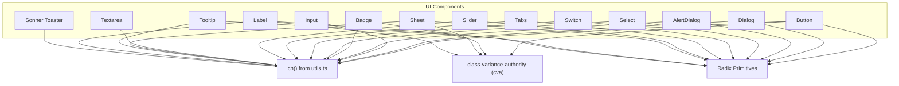
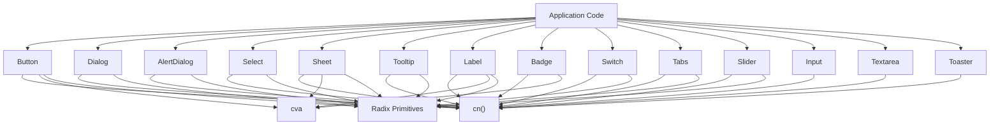
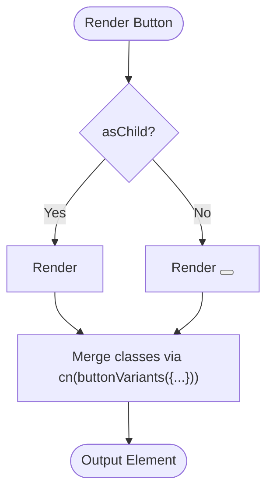
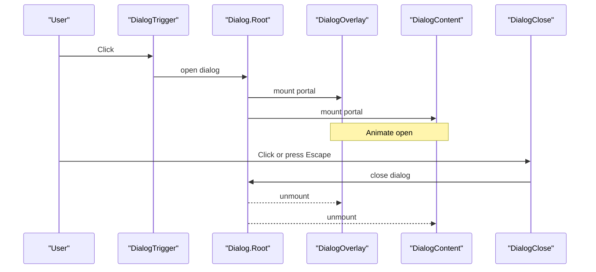
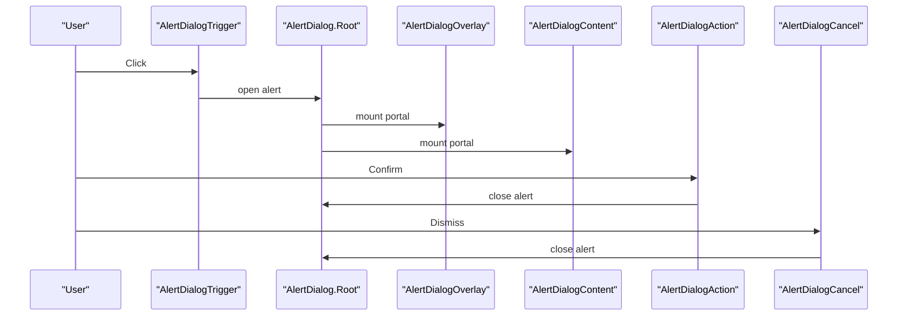
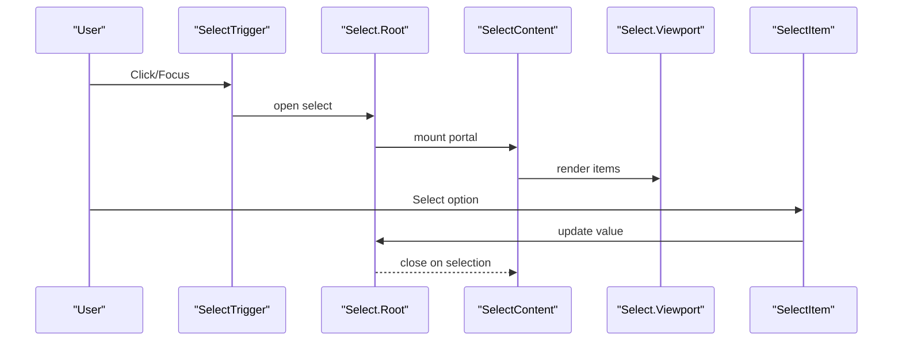
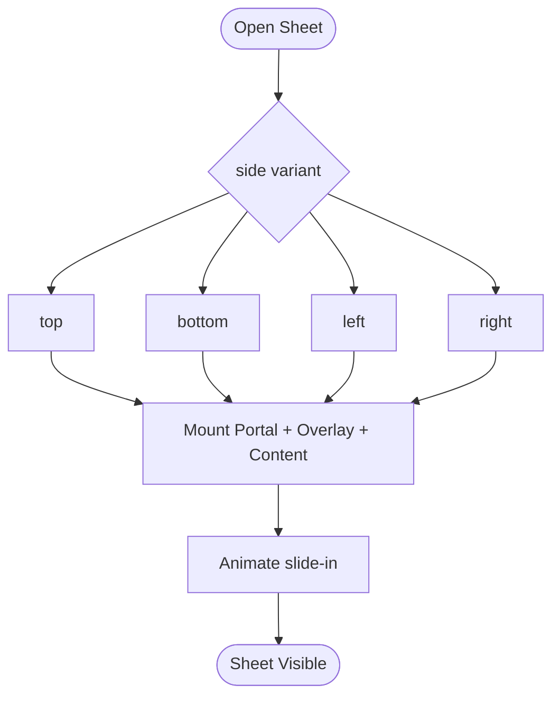
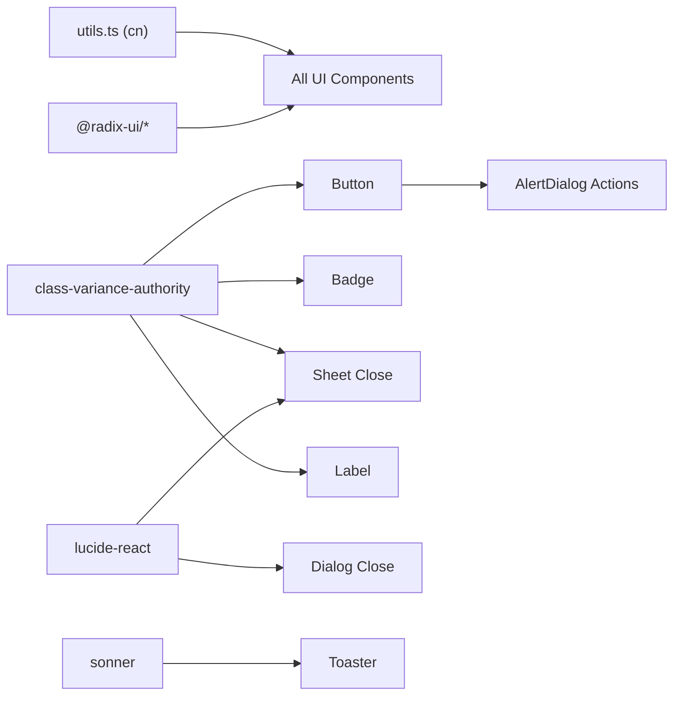

# Base UI Components

<cite>
**Referenced Files in This Document**
- [button.tsx](file://src/components/ui/button.tsx)
- [dialog.tsx](file://src/components/ui/dialog.tsx)
- [input.tsx](file://src/components/ui/input.tsx)
- [alert-dialog.tsx](file://src/components/ui/alert-dialog.tsx)
- [badge.tsx](file://src/components/ui/badge.tsx)
- [select.tsx](file://src/components/ui/select.tsx)
- [switch.tsx](file://src/components/ui/switch.tsx)
- [tabs.tsx](file://src/components/ui/tabs.tsx)
- [slider.tsx](file://src/components/ui/slider.tsx)
- [textarea.tsx](file://src/components/ui/textarea.tsx)
- [sheet.tsx](file://src/components/ui/sheet.tsx)
- [tooltip.tsx](file://src/components/ui/tooltip.tsx)
- [label.tsx](file://src/components/ui/label.tsx)
- [sonner.tsx](file://src/components/ui/sonner.tsx)
- [utils.ts](file://src/lib/utils.ts)
</cite>

## Table of Contents
1. [Introduction](#introduction)
2. [Project Structure](#project-structure)
3. [Core Components](#core-components)
4. [Architecture Overview](#architecture-overview)
5. [Detailed Component Analysis](#detailed-component-analysis)
6. [Dependency Analysis](#dependency-analysis)
7. [Performance Considerations](#performance-considerations)
8. [Troubleshooting Guide](#troubleshooting-guide)
9. [Conclusion](#conclusion)
10. [Appendices](#appendices)

## Introduction
This document describes Smart Scan Pro’s base UI component library built on Radix UI primitives and Tailwind CSS. It covers the Button, Dialog, Input, AlertDialog, Badge, Select, Switch, Tabs, Slider, Textarea, Sheet, Tooltip, Label, and Sonner toast notifications. For each component, you will find prop interfaces, usage examples, styling variants, accessibility features, customization options, theme integration, responsive behavior patterns, composition strategies, and best practices for extending components. The library uses class-variance-authority (cva) for variant management and a shared utility to merge Tailwind classes safely.

## Project Structure
The UI components live under src/components/ui and are thin wrappers around Radix primitives with consistent Tailwind styling and accessible defaults. A shared utility merges class names deterministically.

**Diagram sources**
- [button.tsx:1-48](file://src/components/ui/button.tsx#L1-L48)
- [dialog.tsx:1-96](file://src/components/ui/dialog.tsx#L1-L96)
- [input.tsx:1-23](file://src/components/ui/input.tsx#L1-L23)
- [alert-dialog.tsx:1-105](file://src/components/ui/alert-dialog.tsx#L1-L105)
- [badge.tsx:1-30](file://src/components/ui/badge.tsx#L1-L30)
- [select.tsx:1-144](file://src/components/ui/select.tsx#L1-L144)
- [switch.tsx:1-28](file://src/components/ui/switch.tsx#L1-L28)
- [tabs.tsx:1-54](file://src/components/ui/tabs.tsx#L1-L54)
- [slider.tsx:1-24](file://src/components/ui/slider.tsx#L1-L24)
- [textarea.tsx:1-22](file://src/components/ui/textarea.tsx#L1-L22)
- [sheet.tsx:1-108](file://src/components/ui/sheet.tsx#L1-L108)
- [tooltip.tsx:1-29](file://src/components/ui/tooltip.tsx#L1-L29)
- [label.tsx:1-18](file://src/components/ui/label.tsx#L1-L18)
- [sonner.tsx:1-28](file://src/components/ui/sonner.tsx#L1-L28)
- [utils.ts:1-7](file://src/lib/utils.ts#L1-L7)

**Section sources**
- [utils.ts:1-7](file://src/lib/utils.ts#L1-L7)

## Core Components
This section summarizes the common patterns used across components:
- Variant management via cva for consistent styling across states and sizes.
- Class merging via cn to compose Tailwind classes without conflicts.
- ForwardRef pattern for proper ref forwarding and accessibility.
- Radix primitives provide robust focus management, keyboard navigation, and state semantics.

Key implementation references:
- Button variant system and asChild support
- Shared cn utility for deterministic class resolution
- Consistent focus-visible ring styles and disabled states

**Section sources**
- [button.tsx:1-48](file://src/components/ui/button.tsx#L1-L48)
- [utils.ts:1-7](file://src/lib/utils.ts#L1-L7)

## Architecture Overview
The architecture is layered:
- Presentation layer: UI components that wrap Radix primitives and apply Tailwind styles.
- Styling layer: Tailwind utilities merged by cn; variants defined with cva.
- Behavior layer: Radix primitives handle low-level interactions and accessibility.

**Diagram sources**
- [button.tsx:1-48](file://src/components/ui/button.tsx#L1-L48)
- [dialog.tsx:1-96](file://src/components/ui/dialog.tsx#L1-L96)
- [alert-dialog.tsx:1-105](file://src/components/ui/alert-dialog.tsx#L1-L105)
- [select.tsx:1-144](file://src/components/ui/select.tsx#L1-L144)
- [sheet.tsx:1-108](file://src/components/ui/sheet.tsx#L1-L108)
- [tooltip.tsx:1-29](file://src/components/ui/tooltip.tsx#L1-L29)
- [label.tsx:1-18](file://src/components/ui/label.tsx#L1-L18)
- [badge.tsx:1-30](file://src/components/ui/badge.tsx#L1-L30)
- [switch.tsx:1-28](file://src/components/ui/switch.tsx#L1-L28)
- [tabs.tsx:1-54](file://src/components/ui/tabs.tsx#L1-L54)
- [slider.tsx:1-24](file://src/components/ui/slider.tsx#L1-L24)
- [input.tsx:1-23](file://src/components/ui/input.tsx#L1-L23)
- [textarea.tsx:1-22](file://src/components/ui/textarea.tsx#L1-L22)
- [sonner.tsx:1-28](file://src/components/ui/sonner.tsx#L1-L28)
- [utils.ts:1-7](file://src/lib/utils.ts#L1-L7)

## Detailed Component Analysis

### Button
- Purpose: Primary interactive element with multiple visual variants and sizes.
- Props:
  - Inherits all native button attributes.
  - variant: default | destructive | outline | secondary | ghost | link
  - size: default | sm | lg | icon
  - asChild: boolean — render as child component using Slot
- Variants:
  - Visual themes and hover states per variant.
  - Sizes control height and padding.
- States:
  - Focus-visible ring and offset.
  - Disabled pointer-events and reduced opacity.
- Accessibility:
  - Native button semantics when not using asChild.
  - Proper focus management and keyboard interaction.
- Customization:
  - Extend variants or sizes via cva configuration.
  - Compose with icons and other elements.
- Responsive:
  - Uses Tailwind spacing and sizing tokens.
- Composition:
  - Use asChild to integrate with router/link components.

**Diagram sources**
- [button.tsx:1-48](file://src/components/ui/button.tsx#L1-L48)

**Section sources**
- [button.tsx:1-48](file://src/components/ui/button.tsx#L1-L48)

### Dialog
- Purpose: Modal overlay with content, header/footer, title, description, trigger, and close.
- Props:
  - DialogRoot props (open, onOpenChange, modal).
  - Content supports className and children.
  - Header/Footer layout helpers.
  - Title/Description text styling.
- Variants:
  - No explicit variants; style via className.
- States:
  - Open/closed animations and transitions.
  - Close button with focus and hover states.
- Accessibility:
  - Focus trap, escape-to-close, aria roles provided by Radix.
  - Close button includes sr-only label.
- Customization:
  - Override overlay/content styles via className.
  - Adjust animation durations and transforms.
- Responsive:
  - Centered layout with max-width and rounded corners on small screens.
- Composition:
  - Combine Trigger, Portal, Overlay, Content, Header, Footer, Title, Description.

**Diagram sources**
- [dialog.tsx:1-96](file://src/components/ui/dialog.tsx#L1-L96)

**Section sources**
- [dialog.tsx:1-96](file://src/components/ui/dialog.tsx#L1-L96)

### Input
- Purpose: Standard text input with consistent styling and focus states.
- Props:
  - All native input attributes (type, value, onChange, placeholder, disabled, etc.).
- Variants:
  - None; style via className.
- States:
  - Focus-visible ring and offset.
  - Disabled cursor and opacity.
- Accessibility:
  - Native input semantics.
  - Compatible with Label for association.
- Customization:
  - Add leading/trailing elements via wrapper components.
  - Adjust border, padding, and typography via className.
- Responsive:
  - Fluid width and font-size adjustments.

**Section sources**
- [input.tsx:1-23](file://src/components/ui/input.tsx#L1-L23)

### AlertDialog
- Purpose: Confirmation dialog with action and cancel buttons styled via Button variants.
- Props:
  - Root, Trigger, Portal, Overlay, Content, Header, Footer, Title, Description.
  - Action and Cancel buttons use Button variants internally.
- Variants:
  - Action uses default variant; Cancel uses outline variant.
- States:
  - Open/closed animations similar to Dialog.
- Accessibility:
  - Focus management and keyboard handling via Radix.
- Customization:
  - Override button variants or pass additional className to Action/Cancel.
- Composition:
  - Pair with Button triggers and actions.

**Diagram sources**
- [alert-dialog.tsx:1-105](file://src/components/ui/alert-dialog.tsx#L1-L105)
- [button.tsx:1-48](file://src/components/ui/button.tsx#L1-L48)

**Section sources**
- [alert-dialog.tsx:1-105](file://src/components/ui/alert-dialog.tsx#L1-L105)

### Badge
- Purpose: Small status or categorization indicator.
- Props:
  - variant: default | secondary | destructive | outline
- Variants:
  - Background and foreground colors per variant with hover effects.
- States:
  - Focus ring for keyboard users.
- Accessibility:
  - Semantic div; add role="status" or aria-label if needed.
- Customization:
  - Extend variants via cva.
- Composition:
  - Place near titles, tags, or status lines.

**Section sources**
- [badge.tsx:1-30](file://src/components/ui/badge.tsx#L1-L30)

### Select
- Purpose: Accessible select dropdown with grouped items and scroll controls.
- Props:
  - Root, Group, Value, Trigger, Content, Label, Item, Separator, ScrollUpButton, ScrollDownButton.
  - Content supports position prop ("popper" or others).
- Variants:
  - None; style via className.
- States:
  - Disabled states and focus rings.
  - Selected item indicator with check icon.
- Accessibility:
  - Keyboard navigation, ARIA attributes, and screen reader support via Radix.
- Customization:
  - Customize trigger, viewport, and item styles.
- Composition:
  - Group items with SelectGroup and SelectLabel.

**Diagram sources**
- [select.tsx:1-144](file://src/components/ui/select.tsx#L1-L144)

**Section sources**
- [select.tsx:1-144](file://src/components/ui/select.tsx#L1-L144)

### Switch
- Purpose: Toggle control for binary settings.
- Props:
  - All root switch attributes (checked, onCheckedChange, disabled, id, etc.).
- Variants:
  - None; style via className.
- States:
  - Checked/unchecked background and thumb translation.
  - Focus-visible ring and disabled states.
- Accessibility:
  - ARIA role="switch", keyboard toggle, and labels via associated Label.
- Customization:
  - Adjust track/thumb dimensions and colors via className.
- Composition:
  - Pair with Label for descriptive text.

**Section sources**
- [switch.tsx:1-28](file://src/components/ui/switch.tsx#L1-L28)

### Tabs
- Purpose: Tabbed interface for organizing content into panes.
- Props:
  - Root, List, Trigger, Content.
- Variants:
  - None; style via className.
- States:
  - Active tab highlighted with background and shadow.
  - Focus-visible ring for keyboard navigation.
- Accessibility:
  - Role="tablist", tabs with role="tab", content with role="tabpanel".
- Customization:
  - Style list background and active states.
- Composition:
  - Multiple Triggers and corresponding Content panels.

**Section sources**
- [tabs.tsx:1-54](file://src/components/ui/tabs.tsx#L1-L54)

### Slider
- Purpose: Range selector with track, range, and thumb.
- Props:
  - Root slider attributes (value, defaultValue, min, max, step, disabled, orientation).
- Variants:
  - None; style via className.
- States:
  - Thumb focus ring and disabled states.
- Accessibility:
  - ARIA roles and keyboard increment/decrement.
- Customization:
  - Change track/range/thumb colors and sizes.
- Composition:
  - Use with labels and value displays.

**Section sources**
- [slider.tsx:1-24](file://src/components/ui/slider.tsx#L1-L24)

### Textarea
- Purpose: Multi-line text input with consistent styling.
- Props:
  - All native textarea attributes.
- Variants:
  - None; style via className.
- States:
  - Focus-visible ring and disabled states.
- Accessibility:
  - Native textarea semantics; pair with Label.
- Customization:
  - Adjust min-height and padding via className.
- Composition:
  - Wrap with form fields or validation messages.

**Section sources**
- [textarea.tsx:1-22](file://src/components/ui/textarea.tsx#L1-L22)

### Sheet
- Purpose: Side panel drawer with configurable side and animations.
- Props:
  - Root, Trigger, Close, Portal, Overlay, Content, Header, Footer, Title, Description.
  - Content supports side variant: top | bottom | left | right.
- Variants:
  - side controls positioning and slide-in/out animations.
- States:
  - Open/closed transitions and overlay fade.
- Accessibility:
  - Focus trap and escape-to-close via Radix.
- Customization:
  - Override side variants or adjust max-widths.
- Composition:
  - Use with Header/Footer and actions.

**Diagram sources**
- [sheet.tsx:1-108](file://src/components/ui/sheet.tsx#L1-L108)

**Section sources**
- [sheet.tsx:1-108](file://src/components/ui/sheet.tsx#L1-L108)

### Tooltip
- Purpose: Contextual hint shown on hover/focus.
- Props:
  - Root, Trigger, Content (with sideOffset), Provider.
- Variants:
  - None; style via className.
- States:
  - Animated open/close and positioning relative to trigger.
- Accessibility:
  - ARIA-describedby and keyboard show/hide behaviors.
- Customization:
  - Adjust sideOffset and container styles.
- Composition:
  - Wrap any interactive element with Trigger.

**Section sources**
- [tooltip.tsx:1-29](file://src/components/ui/tooltip.tsx#L1-L29)

### Label
- Purpose: Accessible label for inputs and controls.
- Props:
  - Root label attributes; no variants beyond default.
- Variants:
  - Uses cva for consistent text styles and peer-disabled behavior.
- States:
  - Reduced opacity when peer is disabled.
- Accessibility:
  - Associates with input via htmlFor/id.
- Customization:
  - Extend labelVariants via cva.
- Composition:
  - Pair with Input, Switch, or custom controls.

**Section sources**
- [label.tsx:1-18](file://src/components/ui/label.tsx#L1-L18)

### Sonner Toast Notifications
- Purpose: Global toast notifications integrated with app theme.
- Props:
  - Toaster accepts Sonner props; reads theme from settings.
  - Exposes toast function for programmatic calls.
- Variants:
  - Theme-aware styling via Sonner classNames.
- States:
  - Success, error, info, warning handled by Sonner API.
- Accessibility:
  - Announces to screen readers automatically.
- Customization:
  - Override toast classNames and action button styles.
- Composition:
  - Render Toaster once at app root; call toast() anywhere.

**Section sources**
- [sonner.tsx:1-28](file://src/components/ui/sonner.tsx#L1-L28)

## Dependency Analysis
- Internal dependencies:
  - All components use cn for class merging.
  - Button, Badge, Sheet, Label use cva for variant management.
  - AlertDialog composes Button variants for actions.
- External dependencies:
  - Radix primitives provide behavior and accessibility.
  - Lucide icons used in Dialog and Sheet close buttons.
  - Sonner provides toast functionality.

**Diagram sources**
- [utils.ts:1-7](file://src/lib/utils.ts#L1-L7)
- [button.tsx:1-48](file://src/components/ui/button.tsx#L1-L48)
- [badge.tsx:1-30](file://src/components/ui/badge.tsx#L1-L30)
- [sheet.tsx:1-108](file://src/components/ui/sheet.tsx#L1-L108)
- [label.tsx:1-18](file://src/components/ui/label.tsx#L1-L18)
- [alert-dialog.tsx:1-105](file://src/components/ui/alert-dialog.tsx#L1-L105)
- [dialog.tsx:1-96](file://src/components/ui/dialog.tsx#L1-L96)
- [sonner.tsx:1-28](file://src/components/ui/sonner.tsx#L1-L28)

**Section sources**
- [button.tsx:1-48](file://src/components/ui/button.tsx#L1-L48)
- [alert-dialog.tsx:1-105](file://src/components/ui/alert-dialog.tsx#L1-L105)
- [dialog.tsx:1-96](file://src/components/ui/dialog.tsx#L1-L96)
- [sheet.tsx:1-108](file://src/components/ui/sheet.tsx#L1-L108)
- [badge.tsx:1-30](file://src/components/ui/badge.tsx#L1-L30)
- [label.tsx:1-18](file://src/components/ui/label.tsx#L1-L18)
- [sonner.tsx:1-28](file://src/components/ui/sonner.tsx#L1-L28)
- [utils.ts:1-7](file://src/lib/utils.ts#L1-L7)

## Performance Considerations
- Prefer forwardRef and minimal re-renders by passing stable props.
- Use asChild sparingly; it changes the rendered element type.
- Avoid excessive inline styles; prefer Tailwind classes and cva variants.
- Keep portal contents lightweight; defer heavy rendering until open.
- Leverage Radix’s optimized event handling and focus management.

## Troubleshooting Guide
- Focus issues: Ensure components are within a Radix provider context where required (e.g., TooltipProvider).
- Class conflicts: Always pass className through cn to avoid duplicate or conflicting Tailwind rules.
- Missing icons: Verify lucide-react is installed for close icons in Dialog and Sheet.
- Toast not appearing: Ensure Toaster is mounted at the app root and toast() is called after mounting.
- Variant not applied: Check cva variant keys and default values; ensure correct prop names.

**Section sources**
- [tooltip.tsx:1-29](file://src/components/ui/tooltip.tsx#L1-L29)
- [dialog.tsx:1-96](file://src/components/ui/dialog.tsx#L1-L96)
- [sheet.tsx:1-108](file://src/components/ui/sheet.tsx#L1-L108)
- [sonner.tsx:1-28](file://src/components/ui/sonner.tsx#L1-L28)
- [utils.ts:1-7](file://src/lib/utils.ts#L1-L7)

## Conclusion
Smart Scan Pro’s base UI components provide a cohesive, accessible, and customizable foundation built on Radix primitives and Tailwind CSS. The consistent use of cva for variants and cn for class merging ensures predictable styling and easy extension. By following the composition patterns and accessibility guidelines outlined here, teams can rapidly build feature-rich interfaces while maintaining quality and consistency.

## Appendices

### Prop Interfaces Summary
- ButtonProps: extends HTMLButtonAttributes, variant, size, asChild
- BadgeProps: extends HTMLAttributes<HTMLDivElement>, variant
- SheetContentProps: extends Radix Content props, side variant
- Label: extends Radix Label props
- Input/Textarea: extend native input/textarea attributes
- Dialog/AlertDialog/Select/Tabs/Slider/Switch/Tooltip: expose Radix primitive props

**Section sources**
- [button.tsx:33-47](file://src/components/ui/button.tsx#L33-L47)
- [badge.tsx:23-29](file://src/components/ui/badge.tsx#L23-L29)
- [sheet.tsx:50-67](file://src/components/ui/sheet.tsx#L50-L67)
- [label.tsx:9-17](file://src/components/ui/label.tsx#L9-L17)
- [input.tsx:5-22](file://src/components/ui/input.tsx#L5-L22)
- [textarea.tsx:5-21](file://src/components/ui/textarea.tsx#L5-L21)
- [dialog.tsx:15-52](file://src/components/ui/dialog.tsx#L15-L52)
- [alert-dialog.tsx:28-44](file://src/components/ui/alert-dialog.tsx#L28-L44)
- [select.tsx:61-91](file://src/components/ui/select.tsx#L61-L91)
- [tabs.tsx:8-51](file://src/components/ui/tabs.tsx#L8-L51)
- [slider.tsx:6-23](file://src/components/ui/slider.tsx#L6-L23)
- [switch.tsx:6-27](file://src/components/ui/switch.tsx#L6-L27)
- [tooltip.tsx:12-28](file://src/components/ui/tooltip.tsx#L12-L28)

### Usage Examples (by reference)
- Button with variant and size: see [button.tsx:39-47](file://src/components/ui/button.tsx#L39-L47)
- Dialog with Trigger and Content: see [dialog.tsx:9-52](file://src/components/ui/dialog.tsx#L9-L52)
- AlertDialog with Action and Cancel: see [alert-dialog.tsx:72-90](file://src/components/ui/alert-dialog.tsx#L72-L90)
- Select with Group and Items: see [select.tsx:9-122](file://src/components/ui/select.tsx#L9-L122)
- Sheet with side variant: see [sheet.tsx:31-67](file://src/components/ui/sheet.tsx#L31-L67)
- Tooltip with Trigger and Content: see [tooltip.tsx:8-28](file://src/components/ui/tooltip.tsx#L8-L28)
- Label paired with Input: see [label.tsx:9-17](file://src/components/ui/label.tsx#L9-L17), [input.tsx:5-22](file://src/components/ui/input.tsx#L5-L22)
- Toaster setup and toast calls: see [sonner.tsx:6-27](file://src/components/ui/sonner.tsx#L6-L27)

### Best Practices for Extending Base Components
- Create new variants by extending cva configurations rather than duplicating styles.
- Use cn to merge external className overrides safely.
- Preserve accessibility by keeping Radix semantics intact when composing.
- Provide sensible defaults and document optional props clearly.
- Test focus and keyboard interactions thoroughly for complex compositions.