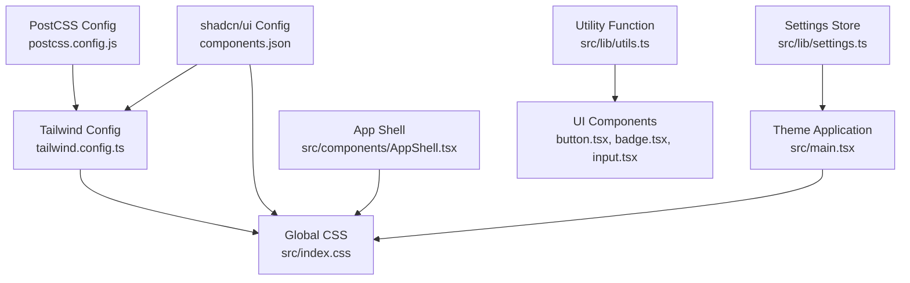
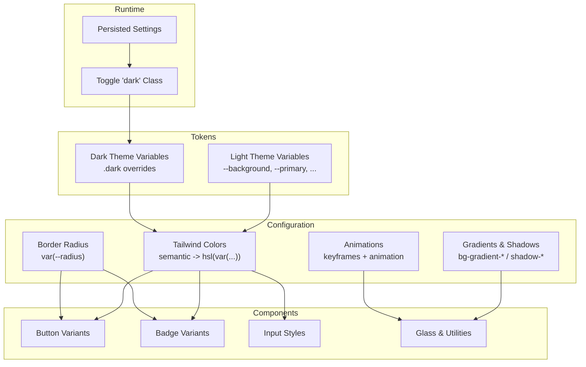
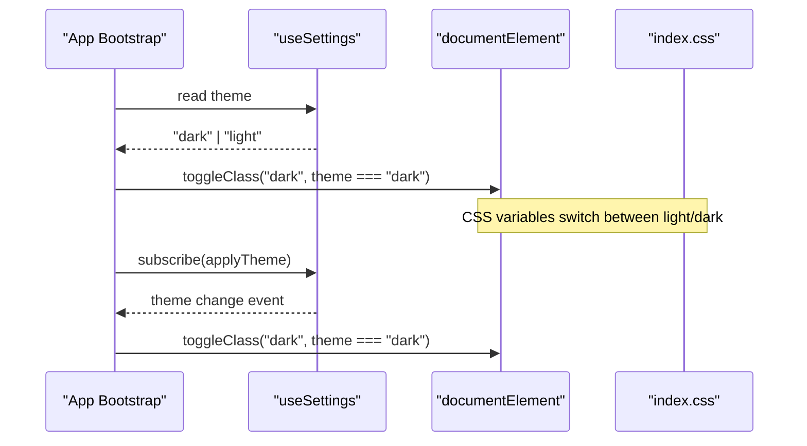
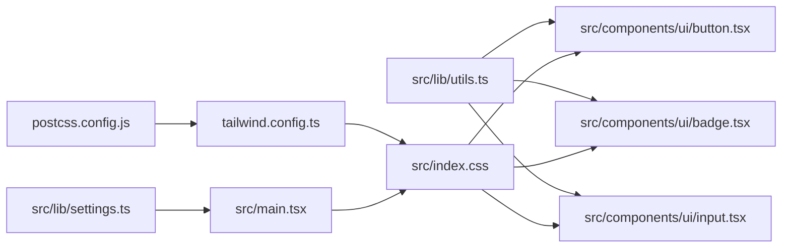

# Design System & Theming

<cite>
**Referenced Files in This Document**
- [tailwind.config.ts](file://tailwind.config.ts)
- [src/index.css](file://src/index.css)
- [postcss.config.js](file://postcss.config.js)
- [components.json](file://components.json)
- [src/lib/utils.ts](file://src/lib/utils.ts)
- [src/components/ui/button.tsx](file://src/components/ui/button.tsx)
- [src/components/ui/badge.tsx](file://src/components/ui/badge.tsx)
- [src/components/ui/input.tsx](file://src/components/ui/input.tsx)
- [src/main.tsx](file://src/main.tsx)
- [src/lib/settings.ts](file://src/lib/settings.ts)
- [src/components/AppShell.tsx](file://src/components/AppShell.tsx)
</cite>

## Table of Contents
1. Introduction
2. Project Structure
3. Core Components
4. Architecture Overview
5. Detailed Component Analysis
6. Dependency Analysis
7. Performance Considerations
8. Troubleshooting Guide
9. Conclusion
10. Appendices

## Introduction
This document explains Smart Scan Pro’s design system and theming implementation. It covers Tailwind CSS configuration (custom tokens, spacing, typography, responsive breakpoints), the CSS custom properties system for dark/light mode, utility functions for className merging and conditional styling, shadcn/ui integration, and guidelines for extending tokens and maintaining visual consistency. It also provides practical examples for theme customization and component styling patterns.

## Project Structure
The design system is implemented across a small set of focused files:
- Tailwind configuration defines semantic color tokens, border radius, gradients, shadows, animations, and container behavior.
- Global CSS defines CSS custom properties for light and dark themes and introduces reusable component-level utilities.
- PostCSS config wires Tailwind and Autoprefixer.
- shadcn/ui configuration points to Tailwind and CSS entry and sets aliases.
- Utility function merges class names deterministically.
- UI components use semantic tokens via Tailwind classes and variant APIs.
- App shell demonstrates usage of glass effect and safe-area utilities.
- Theme application toggles the root “dark” class based on persisted settings.

**Diagram sources**
- [tailwind.config.ts:1-108](file://tailwind.config.ts#L1-L108)
- [src/index.css:1-159](file://src/index.css#L1-L159)
- [postcss.config.js:1-7](file://postcss.config.js#L1-L7)
- [components.json:1-21](file://components.json#L1-L21)
- [src/lib/utils.ts:1-7](file://src/lib/utils.ts#L1-L7)
- [src/components/ui/button.tsx:1-48](file://src/components/ui/button.tsx#L1-L48)
- [src/components/ui/badge.tsx:1-30](file://src/components/ui/badge.tsx#L1-L30)
- [src/components/ui/input.tsx:1-23](file://src/components/ui/input.tsx#L1-L23)
- [src/components/AppShell.tsx:1-63](file://src/components/AppShell.tsx#L1-L63)
- [src/main.tsx:1-24](file://src/main.tsx#L1-L24)
- [src/lib/settings.ts:1-35](file://src/lib/settings.ts#L1-L35)

**Section sources**
- [tailwind.config.ts:1-108](file://tailwind.config.ts#L1-L108)
- [src/index.css:1-159](file://src/index.css#L1-L159)
- [postcss.config.js:1-7](file://postcss.config.js#L1-L7)
- [components.json:1-21](file://components.json#L1-L21)

## Core Components
- Tailwind configuration
  - Dark mode strategy: class-based dark mode.
  - Semantic color tokens mapped to CSS variables for background, foreground, primary, secondary, accent, destructive, warning, success, muted, popover, card, sidebar, border, input, ring.
  - Border radius tokens derived from a single --radius variable.
  - Background images and box shadows exposed as Tailwind utilities using CSS variables.
  - Custom keyframes and animations for accordion, scan-line, and fade-up effects.
  - Container centering and padding with an explicit 2xl breakpoint.
- Global CSS
  - Light theme defaults under :root and dark theme overrides under .dark.
  - All colors are defined as HSL values for consistent hue/saturation/luminance control.
  - Reusable component utilities like .glass, .scan-reticle, and .scan-line.
  - Safe area utilities for mobile devices.
- shadcn/ui configuration
  - Points to Tailwind config and CSS entry.
  - Uses CSS variables and base color palette.
  - Aliases map to project directories for clean imports.
- Utility function
  - Merges class names deterministically by combining clsx and tailwind-merge.
- UI components
  - Button, Badge, Input demonstrate variant-driven styling and token usage.
- Theme application
  - Root “dark” class toggled based on persisted settings before first paint.

**Section sources**
- [tailwind.config.ts:1-108](file://tailwind.config.ts#L1-L108)
- [src/index.css:1-159](file://src/index.css#L1-L159)
- [components.json:1-21](file://components.json#L1-L21)
- [src/lib/utils.ts:1-7](file://src/lib/utils.ts#L1-L7)
- [src/components/ui/button.tsx:1-48](file://src/components/ui/button.tsx#L1-L48)
- [src/components/ui/badge.tsx:1-30](file://src/components/ui/badge.tsx#L1-L30)
- [src/components/ui/input.tsx:1-23](file://src/components/ui/input.tsx#L1-L23)
- [src/main.tsx:1-24](file://src/main.tsx#L1-L24)
- [src/lib/settings.ts:1-35](file://src/lib/settings.ts#L1-L35)

## Architecture Overview
The design system follows a layered approach:
- Tokens layer: CSS custom properties define all visual tokens.
- Configuration layer: Tailwind maps semantic names to tokens and exposes extended utilities.
- Component layer: shadcn/ui and internal components consume tokens via Tailwind classes and variant APIs.
- Runtime layer: Theme switching toggles the root class to swap token values.

**Diagram sources**
- [src/index.css:1-159](file://src/index.css#L1-L159)
- [tailwind.config.ts:1-108](file://tailwind.config.ts#L1-L108)
- [src/components/ui/button.tsx:1-48](file://src/components/ui/button.tsx#L1-L48)
- [src/components/ui/badge.tsx:1-30](file://src/components/ui/badge.tsx#L1-L30)
- [src/components/ui/input.tsx:1-23](file://src/components/ui/input.tsx#L1-L23)
- [src/main.tsx:1-24](file://src/main.tsx#L1-L24)
- [src/lib/settings.ts:1-35](file://src/lib/settings.ts#L1-L35)

## Detailed Component Analysis

### Tailwind Configuration
- Dark mode: class-based strategy ensures predictable runtime toggling.
- Colors: semantic names map directly to HSL variables, enabling consistent theming.
- Border radius: computed relative to a single --radius token.
- Gradients and shadows: exposed as Tailwind utilities for reuse.
- Animations: includes accordion, scan-line, and fade-up; uses CSS variables where appropriate.
- Container: centered with padding and a 2xl breakpoint.

Guidelines:
- Prefer semantic color names over raw values.
- Use var(--radius) for consistent rounding.
- Extend backgroundImage or boxShadow only when introducing new tokens.

**Section sources**
- [tailwind.config.ts:1-108](file://tailwind.config.ts#L1-L108)

### Global CSS and Theme Variables
- Light theme defaults under :root; dark theme overrides under .dark.
- All tokens are HSL for precise control over hue, saturation, and luminance.
- Component utilities:
  - .glass: semi-transparent card-like surface with backdrop blur.
  - .scan-reticle and .scan-line: scanning overlay visuals.
- Mobile-safe areas: .safe-top and .safe-bottom.

Guidelines:
- Keep all color tokens as HSL triplets.
- Maintain parity between light and dark tokens for each semantic name.
- Add new component utilities under @layer components.

**Section sources**
- [src/index.css:1-159](file://src/index.css#L1-L159)

### shadcn/ui Integration
- Style: default style with CSS variables enabled.
- Base color: slate (used by shadcn-generated components).
- Tailwind config path and CSS entry specified.
- Aliases configured for components, utils, ui, lib, hooks.

Guidelines:
- When adding shadcn components, ensure they reference semantic tokens via Tailwind classes.
- Keep aliases consistent to avoid import drift.

**Section sources**
- [components.json:1-21](file://components.json#L1-L21)

### Utility Functions for ClassName Merging
- The cn utility combines clsx and tailwind-merge to produce deterministic, conflict-free class strings.
- Usage pattern: pass static classes, conditional expressions, and variant outputs through cn.

Best practices:
- Always wrap dynamic className props with cn.
- Avoid manually concatenating strings; rely on cn for merge safety.

**Section sources**
- [src/lib/utils.ts:1-7](file://src/lib/utils.ts#L1-L7)

### UI Components Using the Design System
- Button
  - Variant API for default, destructive, outline, secondary, ghost, link.
  - Size variants: default, sm, lg, icon.
  - Focus ring and disabled states follow token-driven styles.
- Badge
  - Variant API for default, secondary, destructive, outline.
  - Consistent focus ring and transition behaviors.
- Input
  - Token-driven borders, backgrounds, placeholders, and focus rings.
  - Responsive text sizing and accessibility-friendly focus indicators.

Styling patterns:
- Use cva for variant-driven components.
- Compose variants with cn to allow external overrides.
- Reference semantic tokens via Tailwind classes (e.g., bg-primary, text-muted-foreground).

**Section sources**
- [src/components/ui/button.tsx:1-48](file://src/components/ui/button.tsx#L1-L48)
- [src/components/ui/badge.tsx:1-30](file://src/components/ui/badge.tsx#L1-L30)
- [src/components/ui/input.tsx:1-23](file://src/components/ui/input.tsx#L1-L23)

### Theme Application Flow
- On app start, read persisted theme setting and toggle the root “dark” class accordingly.
- Subscribe to settings changes to update the theme reactively without reload.

**Diagram sources**
- [src/main.tsx:1-24](file://src/main.tsx#L1-L24)
- [src/lib/settings.ts:1-35](file://src/lib/settings.ts#L1-L35)
- [src/index.css:1-159](file://src/index.css#L1-L159)

**Section sources**
- [src/main.tsx:1-24](file://src/main.tsx#L1-L24)
- [src/lib/settings.ts:1-35](file://src/lib/settings.ts#L1-L35)

### Example: Glass Navigation Bar
- Demonstrates usage of .glass utility, safe-area padding, and token-driven colors.
- Active tab highlights with primary color and subtle scale transitions.

**Section sources**
- [src/components/AppShell.tsx:1-63](file://src/components/AppShell.tsx#L1-L63)
- [src/index.css:133-149](file://src/index.css#L133-L149)

## Dependency Analysis
- Build-time dependencies:
  - Tailwind processes src/**/*.{ts,tsx} content and generates utilities.
  - PostCSS runs Tailwind and Autoprefixer.
- Runtime dependencies:
  - CSS variables drive all tokenized styles.
  - Theme toggling depends on persisted settings store.

**Diagram sources**
- [postcss.config.js:1-7](file://postcss.config.js#L1-L7)
- [tailwind.config.ts:1-108](file://tailwind.config.ts#L1-L108)
- [src/index.css:1-159](file://src/index.css#L1-L159)
- [src/lib/settings.ts:1-35](file://src/lib/settings.ts#L1-L35)
- [src/main.tsx:1-24](file://src/main.tsx#L1-L24)
- [src/lib/utils.ts:1-7](file://src/lib/utils.ts#L1-L7)
- [src/components/ui/button.tsx:1-48](file://src/components/ui/button.tsx#L1-L48)
- [src/components/ui/badge.tsx:1-30](file://src/components/ui/badge.tsx#L1-L30)
- [src/components/ui/input.tsx:1-23](file://src/components/ui/input.tsx#L1-L23)

**Section sources**
- [postcss.config.js:1-7](file://postcss.config.js#L1-L7)
- [tailwind.config.ts:1-108](file://tailwind.config.ts#L1-L108)
- [src/index.css:1-159](file://src/index.css#L1-L159)
- [src/lib/settings.ts:1-35](file://src/lib/settings.ts#L1-L35)
- [src/main.tsx:1-24](file://src/main.tsx#L1-L24)
- [src/lib/utils.ts:1-7](file://src/lib/utils.ts#L1-L7)
- [src/components/ui/button.tsx:1-48](file://src/components/ui/button.tsx#L1-L48)
- [src/components/ui/badge.tsx:1-30](file://src/components/ui/badge.tsx#L1-L30)
- [src/components/ui/input.tsx:1-23](file://src/components/ui/input.tsx#L1-L23)

## Performance Considerations
- CSS variables enable instant theme switches without reflow-heavy recalculation.
- Keep token definitions minimal and grouped by semantic role to reduce duplication.
- Use Tailwind’s built-in utilities and cva to avoid large custom CSS blocks.
- Limit heavy backdrop filters to necessary elements (e.g., glass surfaces) to maintain smooth interactions on low-end devices.

[No sources needed since this section provides general guidance]

## Troubleshooting Guide
- Theme not applying on load
  - Ensure the root “dark” class is toggled before first paint and that settings store initializes correctly.
- Tokens not updating
  - Verify that CSS variables exist for both light and dark modes and that Tailwind references them via hsl(var(...)).
- Conflicting classes
  - Always route dynamic classNames through the cn utility to prevent duplicate or conflicting Tailwind rules.
- Missing shadcn components
  - Confirm components.json paths and aliases point to the correct directories and that Tailwind scans src/**/*.

**Section sources**
- [src/main.tsx:1-24](file://src/main.tsx#L1-L24)
- [src/index.css:1-159](file://src/index.css#L1-L159)
- [tailwind.config.ts:1-108](file://tailwind.config.ts#L1-L108)
- [src/lib/utils.ts:1-7](file://src/lib/utils.ts#L1-L7)
- [components.json:1-21](file://components.json#L1-L21)

## Conclusion
Smart Scan Pro’s design system centers on semantic tokens exposed as CSS variables, consumed by Tailwind utilities and shadcn/ui components. The class-based dark mode, robust utility merging, and variant-driven components provide a scalable foundation for consistent theming and rapid iteration. Follow the guidelines to extend tokens, create cohesive themes, and maintain visual harmony across the application.

[No sources needed since this section summarizes without analyzing specific files]

## Appendices

### Adding New Design Tokens
- Define a new CSS variable pair (light and dark) in index.css under the appropriate layer.
- Map it to a Tailwind semantic name in tailwind.config.ts if you want a new utility (e.g., bg-new-token).
- Optionally add to borderRadius, backgroundImage, or boxShadow sections if applicable.
- Use the new token in components via Tailwind classes and ensure focus/contrast requirements are met.

**Section sources**
- [src/index.css:1-159](file://src/index.css#L1-L159)
- [tailwind.config.ts:1-108](file://tailwind.config.ts#L1-L108)

### Creating Consistent Themes
- Keep hue consistent across related tokens (e.g., primary and accent) while adjusting saturation and luminance for contrast.
- Mirror token roles between light and dark modes to avoid missing overrides.
- Validate contrast ratios for foreground/background pairs.

**Section sources**
- [src/index.css:1-159](file://src/index.css#L1-L159)

### Maintaining Visual Consistency
- Centralize spacing and radius via Tailwind defaults and --radius.
- Prefer semantic color names over ad-hoc hex values.
- Use cva for component variants and always merge with cn.

**Section sources**
- [tailwind.config.ts:1-108](file://tailwind.config.ts#L1-L108)
- [src/components/ui/button.tsx:1-48](file://src/components/ui/button.tsx#L1-L48)
- [src/components/ui/badge.tsx:1-30](file://src/components/ui/badge.tsx#L1-L30)
- [src/lib/utils.ts:1-7](file://src/lib/utils.ts#L1-L7)

### Examples of Theme Customization
- Change brand hue: adjust primary and accent HSL values in both light and dark blocks.
- Adjust intensity: tweak saturation and luminance to meet accessibility targets.
- Update gradients: modify gradient variables to reflect new brand colors.

**Section sources**
- [src/index.css:1-159](file://src/index.css#L1-L159)

### Component Styling Patterns
- Buttons: use variant and size props; override with className via cn.
- Badges: select variant for status semantics; keep focus rings visible.
- Inputs: rely on token-driven borders and focus rings; avoid inline styles.

**Section sources**
- [src/components/ui/button.tsx:1-48](file://src/components/ui/button.tsx#L1-L48)
- [src/components/ui/badge.tsx:1-30](file://src/components/ui/badge.tsx#L1-L30)
- [src/components/ui/input.tsx:1-23](file://src/components/ui/input.tsx#L1-L23)