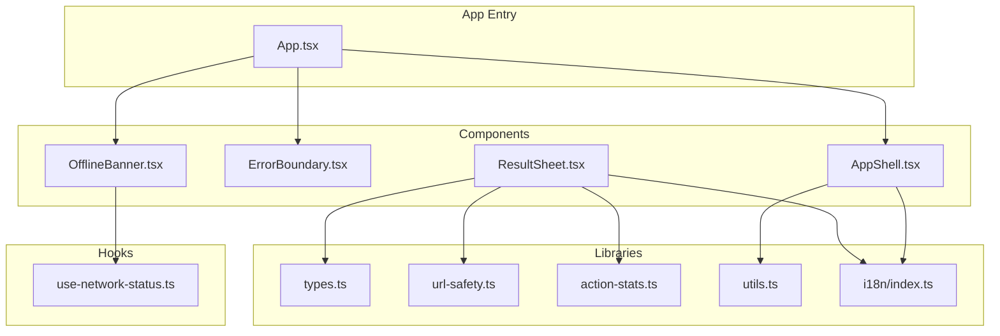
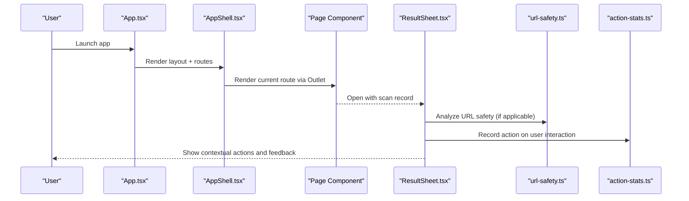
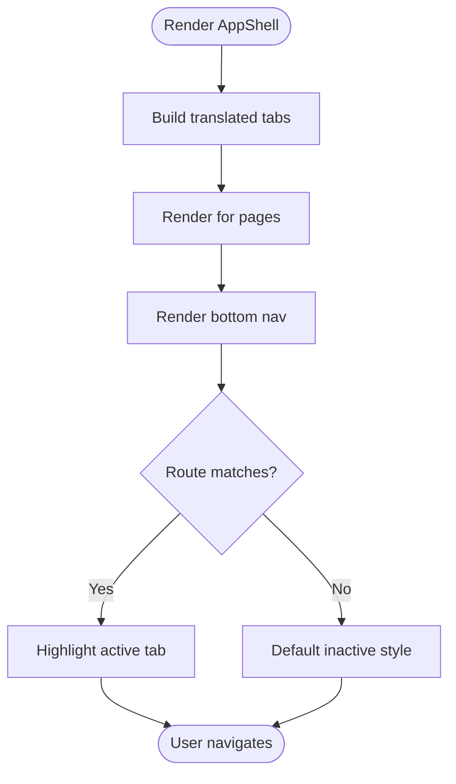
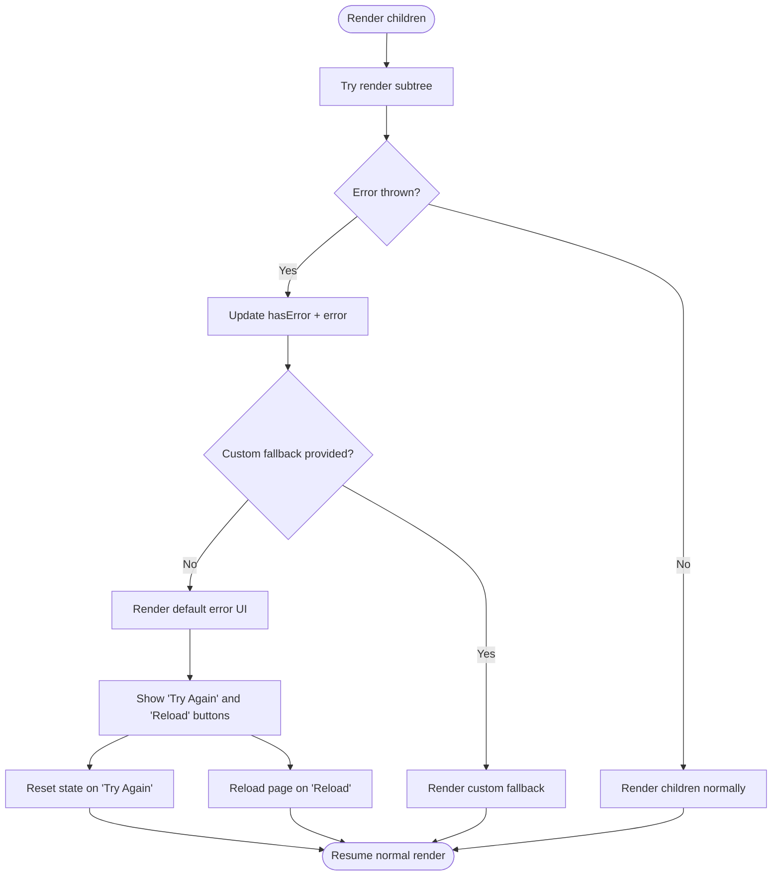
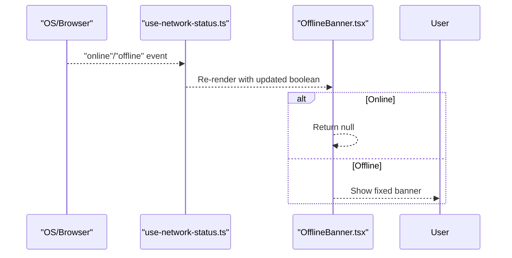
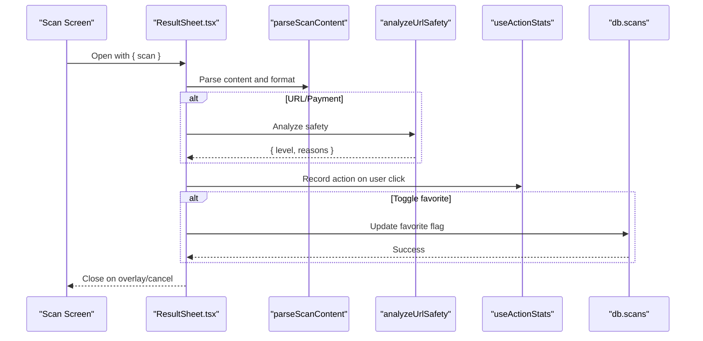
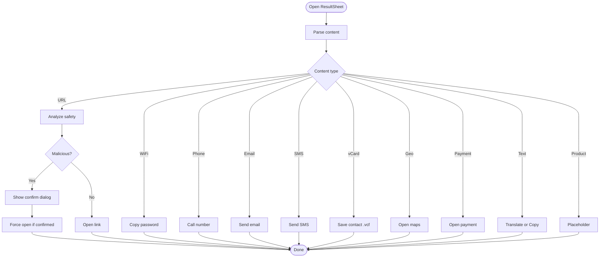
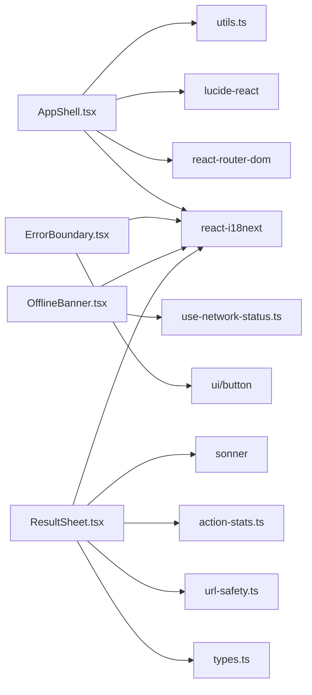

# Feature Components

<cite>
**Referenced Files in This Document**
- [AppShell.tsx](file://src/components/AppShell.tsx)
- [ErrorBoundary.tsx](file://src/components/ErrorBoundary.tsx)
- [OfflineBanner.tsx](file://src/components/OfflineBanner.tsx)
- [ResultSheet.tsx](file://src/components/ResultSheet.tsx)
- [use-network-status.ts](file://src/hooks/use-network-status.ts)
- [types.ts](file://src/lib/scan/types.ts)
- [url-safety.ts](file://src/lib/url-safety.ts)
- [action-stats.ts](file://src/lib/action-stats.ts)
- [utils.ts](file://src/lib/utils.ts)
- [index.ts (i18n)](file://src/lib/i18n/index.ts)
- [App.tsx](file://src/App.tsx)
</cite>

## Table of Contents
1. [Introduction](#introduction)
2. [Project Structure](#project-structure)
3. [Core Components](#core-components)
4. [Architecture Overview](#architecture-overview)
5. [Detailed Component Analysis](#detailed-component-analysis)
6. [Dependency Analysis](#dependency-analysis)
7. [Performance Considerations](#performance-considerations)
8. [Troubleshooting Guide](#troubleshooting-guide)
9. [Conclusion](#conclusion)

## Introduction
This document provides detailed, feature-focused documentation for Smart Scan Pro’s UI components that shape the application shell, error handling, offline feedback, and result interactions. It explains how AppShell manages layout and navigation, how ErrorBoundary captures and recovers from errors, how OfflineBanner communicates connectivity status, and how ResultSheet renders scan results with smart actions. The guide also covers architecture patterns, state management integration, event handling strategies, performance considerations, usage examples, prop interfaces, and integration guidelines with page components.

## Project Structure
The feature components live under src/components and integrate with shared hooks and libraries:
- AppShell orchestrates the app layout and bottom tab navigation using React Router.
- ErrorBoundary wraps the app to catch rendering errors and provide recovery UI.
- OfflineBanner listens to network events and shows a persistent banner when offline.
- ResultSheet displays parsed scan content with contextual actions and safety indicators.

**Diagram sources**
- [AppShell.tsx:1-63](file://src/components/AppShell.tsx#L1-L63)
- [ErrorBoundary.tsx:1-71](file://src/components/ErrorBoundary.tsx#L1-L71)
- [OfflineBanner.tsx:1-18](file://src/components/OfflineBanner.tsx#L1-L18)
- [ResultSheet.tsx:1-414](file://src/components/ResultSheet.tsx#L1-L414)
- [use-network-status.ts:1-23](file://src/hooks/use-network-status.ts#L1-L23)
- [types.ts:1-49](file://src/lib/scan/types.ts#L1-L49)
- [url-safety.ts:1-106](file://src/lib/url-safety.ts#L1-L106)
- [action-stats.ts:1-81](file://src/lib/action-stats.ts#L1-L81)
- [utils.ts:1-7](file://src/lib/utils.ts#L1-L7)
- [index.ts (i18n):1-95](file://src/lib/i18n/index.ts#L1-L95)
- [App.tsx:1-100](file://src/App.tsx#L1-L100)

**Section sources**
- [AppShell.tsx:1-63](file://src/components/AppShell.tsx#L1-L63)
- [ErrorBoundary.tsx:1-71](file://src/components/ErrorBoundary.tsx#L1-L71)
- [OfflineBanner.tsx:1-18](file://src/components/OfflineBanner.tsx#L1-L18)
- [ResultSheet.tsx:1-414](file://src/components/ResultSheet.tsx#L1-L414)
- [use-network-status.ts:1-23](file://src/hooks/use-network-status.ts#L1-L23)
- [types.ts:1-49](file://src/lib/scan/types.ts#L1-L49)
- [url-safety.ts:1-106](file://src/lib/url-safety.ts#L1-L106)
- [action-stats.ts:1-81](file://src/lib/action-stats.ts#L1-L81)
- [utils.ts:1-7](file://src/lib/utils.ts#L1-L7)
- [index.ts (i18n):1-95](file://src/lib/i18n/index.ts#L1-L95)
- [App.tsx:1-100](file://src/App.tsx#L1-L100)

## Core Components
- AppShell: Provides the main layout with an Outlet for pages and a responsive bottom navigation bar. Uses memoization and translation-aware labels.
- ErrorBoundary: Class-based component that catches render errors, exposes a fallback UI, and offers reset/reload actions.
- OfflineBanner: Lightweight banner that reacts to online/offline changes via a custom hook.
- ResultSheet: Bottom sheet displaying parsed scan content, safety analysis, and context-aware actions; integrates with persistence and analytics.

**Section sources**
- [AppShell.tsx:1-63](file://src/components/AppShell.tsx#L1-L63)
- [ErrorBoundary.tsx:1-71](file://src/components/ErrorBoundary.tsx#L1-L71)
- [OfflineBanner.tsx:1-18](file://src/components/OfflineBanner.tsx#L1-L18)
- [ResultSheet.tsx:1-414](file://src/components/ResultSheet.tsx#L1-L414)

## Architecture Overview
The components follow a layered pattern:
- Shell layer: AppShell composes navigation and layout.
- Resilience layer: ErrorBoundary ensures graceful degradation.
- Environment awareness: OfflineBanner reflects connectivity.
- Domain logic layer: ResultSheet orchestrates parsing, safety checks, user actions, and stats.

**Diagram sources**
- [App.tsx:24-96](file://src/App.tsx#L24-L96)
- [AppShell.tsx:14-60](file://src/components/AppShell.tsx#L14-L60)
- [ResultSheet.tsx:111-414](file://src/components/ResultSheet.tsx#L111-L414)
- [url-safety.ts:31-106](file://src/lib/url-safety.ts#L31-L106)
- [action-stats.ts:45-81](file://src/lib/action-stats.ts#L45-L81)

## Detailed Component Analysis

### AppShell
Responsibilities:
- Layout container with full-height flex column.
- Renders page content via Outlet.
- Bottom navigation with four tabs: Scan, History, Generate, Profile.
- Translates labels dynamically and highlights active tab.
- Responsive design with safe area and glass styling.

Key implementation patterns:
- Memoized configuration mapping to avoid re-renders.
- Translation integration for dynamic labels.
- Conditional styling based on active route.

Props and behavior:
- No props; relies on React Router for routing and Outlet.

Integration notes:
- Wrapped by ErrorBoundary at the app root.
- Used inside BrowserRouter with nested Routes.

Usage example:
- See route definition where AppShell is used as a layout wrapper.

**Section sources**
- [AppShell.tsx:1-63](file://src/components/AppShell.tsx#L1-L63)
- [utils.ts:1-7](file://src/lib/utils.ts#L1-L7)
- [index.ts (i18n):1-95](file://src/lib/i18n/index.ts#L1-L95)
- [App.tsx:32-92](file://src/App.tsx#L32-L92)

#### Navigation Flow

**Diagram sources**
- [AppShell.tsx:14-60](file://src/components/AppShell.tsx#L14-L60)

### ErrorBoundary
Responsibilities:
- Catches synchronous and asynchronous rendering errors within its subtree.
- Displays a friendly error UI with details and recovery options.
- Supports custom fallback UI via props.

State and lifecycle:
- State tracks hasError and captured error.
- getDerivedStateFromError updates state on error.
- componentDidCatch logs error and component stack.
- Reset handler clears error state; reload button triggers full page reload.

Props interface:
- children: ReactNode
- fallback?: ReactNode

Integration notes:
- Wraps entire app in App.tsx to ensure global resilience.

Usage example:
- Wrap top-level routes or specific sections needing isolation.

**Section sources**
- [ErrorBoundary.tsx:1-71](file://src/components/ErrorBoundary.tsx#L1-L71)
- [App.tsx:28-96](file://src/App.tsx#L28-L96)

#### Error Handling Flow

**Diagram sources**
- [ErrorBoundary.tsx:16-70](file://src/components/ErrorBoundary.tsx#L16-L70)

### OfflineBanner
Responsibilities:
- Shows a fixed banner at the top when the device is offline.
- Uses a custom hook to subscribe to browser online/offline events.

Hook integration:
- useNetworkStatus subscribes to window online/offline events and returns navigator.onLine.
- Server snapshot defaults to true for SSR compatibility.

Behavior:
- Returns null when online; otherwise renders a warning banner with icon and localized message.

Usage example:
- Place near the app root to persist across routes.

**Section sources**
- [OfflineBanner.tsx:1-18](file://src/components/OfflineBanner.tsx#L1-L18)
- [use-network-status.ts:1-23](file://src/hooks/use-network-status.ts#L1-L23)
- [App.tsx:28-31](file://src/App.tsx#L28-L31)

#### Network Status Flow

**Diagram sources**
- [use-network-status.ts:1-23](file://src/hooks/use-network-status.ts#L1-L23)
- [OfflineBanner.tsx:1-18](file://src/components/OfflineBanner.tsx#L1-L18)

### ResultSheet
Responsibilities:
- Displays a bottom sheet with parsed scan content and contextual actions.
- Integrates URL safety analysis and shows warnings for suspicious/malicious links.
- Tracks user actions for learning primary actions per content type.
- Supports copy, share, favorite toggle, and type-specific actions (e.g., open maps, call, email).

Data model integration:
- Accepts a ScanRecord and uses types from scan types.
- Parses content into typed structures and determines display text.

Safety analysis:
- For URLs and payment links, analyzes safety and renders badges/warnings accordingly.

Action tracking:
- Records actions via Zustand store persisted to storage.
- Learns preferred primary action per content type based on usage thresholds.

UI features:
- Type icon and badge header.
- Primary smart action tailored to content type.
- Quick actions row (copy, share, explain placeholder).
- Collapsible raw content view.
- Confirmation dialog for malicious URLs before opening.

Props interface:
- scan: ScanRecord | null
- onClose: () => void

Event handling strategies:
- Clipboard operations with toast feedback.
- Web Share API fallback to clipboard.
- Favorite toggle persists to local database and shows toast.
- External link opening with security confirmation when needed.

Performance considerations:
- useMemo for safety analysis and computed values.
- Localized strings via i18n.
- Minimal re-renders by isolating state and using stable handlers.

Usage example:
- Pages like Scan pass a ScanRecord and control visibility via local state.

**Section sources**
- [ResultSheet.tsx:1-414](file://src/components/ResultSheet.tsx#L1-L414)
- [types.ts:1-49](file://src/lib/scan/types.ts#L1-L49)
- [url-safety.ts:1-106](file://src/lib/url-safety.ts#L1-L106)
- [action-stats.ts:1-81](file://src/lib/action-stats.ts#L1-L81)
- [index.ts (i18n):1-95](file://src/lib/i18n/index.ts#L1-L95)

#### Result Sheet Interaction Flow

**Diagram sources**
- [ResultSheet.tsx:111-414](file://src/components/ResultSheet.tsx#L111-L414)
- [url-safety.ts:31-106](file://src/lib/url-safety.ts#L31-L106)
- [action-stats.ts:45-81](file://src/lib/action-stats.ts#L45-L81)

#### Smart Action Decision Flow

**Diagram sources**
- [ResultSheet.tsx:189-331](file://src/components/ResultSheet.tsx#L189-L331)

## Dependency Analysis
Component relationships and external dependencies:
- AppShell depends on React Router, lucide icons, i18n, and utility class merging.
- ErrorBoundary depends on UI primitives and i18n for messages.
- OfflineBanner depends on a custom hook for network status.
- ResultSheet depends on scan types, parser, safety analyzer, action stats, toast notifications, and i18n.

**Diagram sources**
- [AppShell.tsx:1-63](file://src/components/AppShell.tsx#L1-L63)
- [ErrorBoundary.tsx:1-71](file://src/components/ErrorBoundary.tsx#L1-L71)
- [OfflineBanner.tsx:1-18](file://src/components/OfflineBanner.tsx#L1-L18)
- [ResultSheet.tsx:1-414](file://src/components/ResultSheet.tsx#L1-L414)
- [use-network-status.ts:1-23](file://src/hooks/use-network-status.ts#L1-L23)
- [types.ts:1-49](file://src/lib/scan/types.ts#L1-L49)
- [url-safety.ts:1-106](file://src/lib/url-safety.ts#L1-L106)
- [action-stats.ts:1-81](file://src/lib/action-stats.ts#L1-L81)
- [utils.ts:1-7](file://src/lib/utils.ts#L1-L7)
- [index.ts (i18n):1-95](file://src/lib/i18n/index.ts#L1-L95)

**Section sources**
- [AppShell.tsx:1-63](file://src/components/AppShell.tsx#L1-L63)
- [ErrorBoundary.tsx:1-71](file://src/components/ErrorBoundary.tsx#L1-L71)
- [OfflineBanner.tsx:1-18](file://src/components/OfflineBanner.tsx#L1-L18)
- [ResultSheet.tsx:1-414](file://src/components/ResultSheet.tsx#L1-L414)
- [use-network-status.ts:1-23](file://src/hooks/use-network-status.ts#L1-L23)
- [types.ts:1-49](file://src/lib/scan/types.ts#L1-L49)
- [url-safety.ts:1-106](file://src/lib/url-safety.ts#L1-L106)
- [action-stats.ts:1-81](file://src/lib/action-stats.ts#L1-L81)
- [utils.ts:1-7](file://src/lib/utils.ts#L1-L7)
- [index.ts (i18n):1-95](file://src/lib/i18n/index.ts#L1-L95)

## Performance Considerations
- AppShell:
  - Uses memoization for tab configuration and label computation to minimize re-renders.
  - Leverages Tailwind classes for efficient styling without heavy CSS overhead.
- ErrorBoundary:
  - Minimal state; only updates on error capture.
  - Avoids unnecessary work by returning early when no error.
- OfflineBanner:
  - Subscribes to lightweight browser events; renders nothing when online.
- ResultSheet:
  - Computes safety analysis with useMemo to avoid repeated calculations.
  - Uses Zustand with persistence for action stats; selectors isolate subscriptions to reduce re-renders.
  - Clipboard and share operations are wrapped with try/catch to prevent blocking UI.

[No sources needed since this section provides general guidance]

## Troubleshooting Guide
Common issues and resolutions:
- ErrorBoundary not catching async errors:
  - Ensure the error occurs during render or synchronous code paths. Async errors should be handled within components or boundaries closer to the failing operation.
- OfflineBanner not showing:
  - Verify browser supports online/offline events and that the hook is mounted. Check navigator.onLine directly in console.
- ResultSheet actions fail silently:
  - Clipboard may be unavailable in insecure contexts; ensure HTTPS and proper permissions. Share API may abort; handle AbortError gracefully.
- Safety analysis false positives/negatives:
  - Review heuristics in the safety analyzer and adjust rules if necessary. Consider adding domain allowlists or stricter checks.

**Section sources**
- [ErrorBoundary.tsx:16-70](file://src/components/ErrorBoundary.tsx#L16-L70)
- [use-network-status.ts:1-23](file://src/hooks/use-network-status.ts#L1-L23)
- [ResultSheet.tsx:132-187](file://src/components/ResultSheet.tsx#L132-L187)
- [url-safety.ts:31-106](file://src/lib/url-safety.ts#L31-L106)

## Conclusion
Smart Scan Pro’s feature components implement robust patterns for layout, resilience, environment awareness, and rich user interactions. AppShell centralizes navigation and layout, ErrorBoundary ensures graceful error recovery, OfflineBanner keeps users informed about connectivity, and ResultSheet delivers intelligent, context-aware actions backed by safety analysis and learned preferences. Together, they form a cohesive, performant, and user-friendly experience.